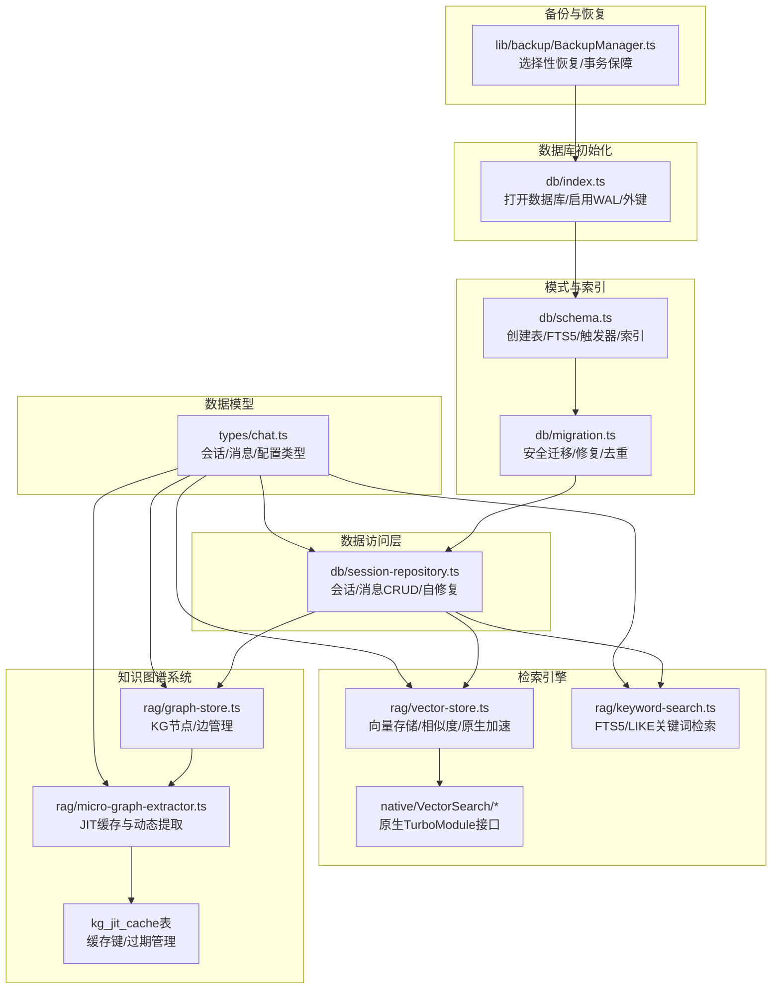
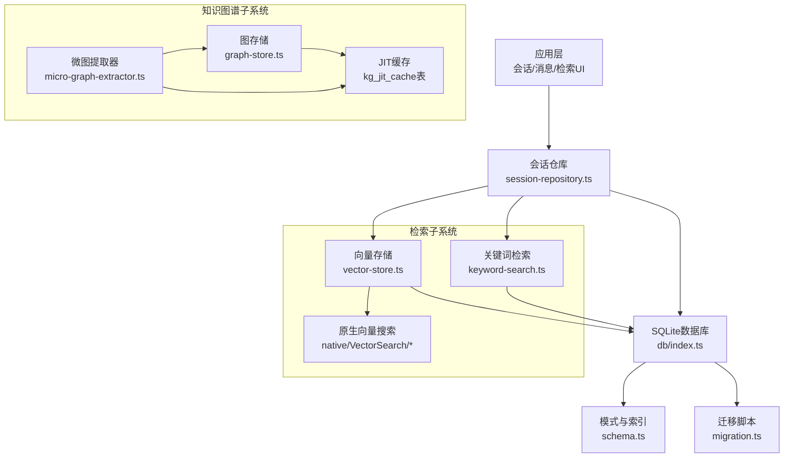
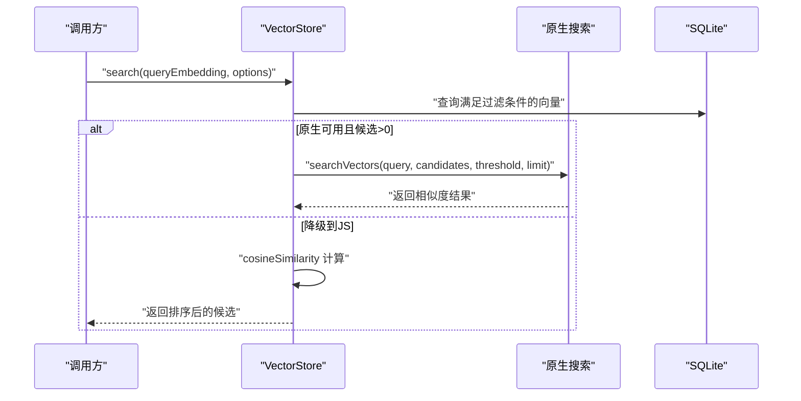
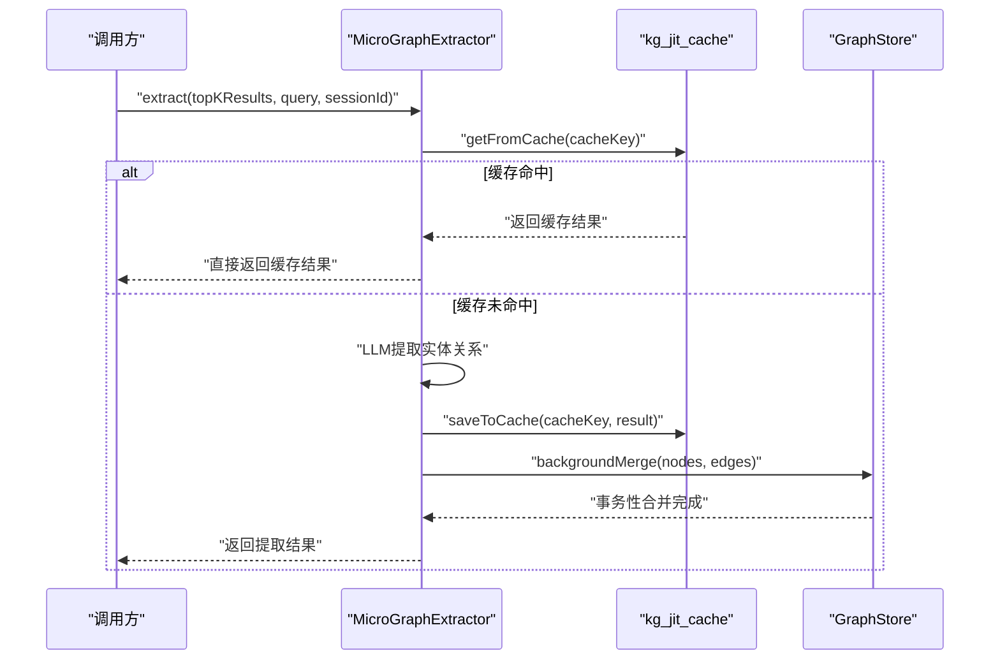
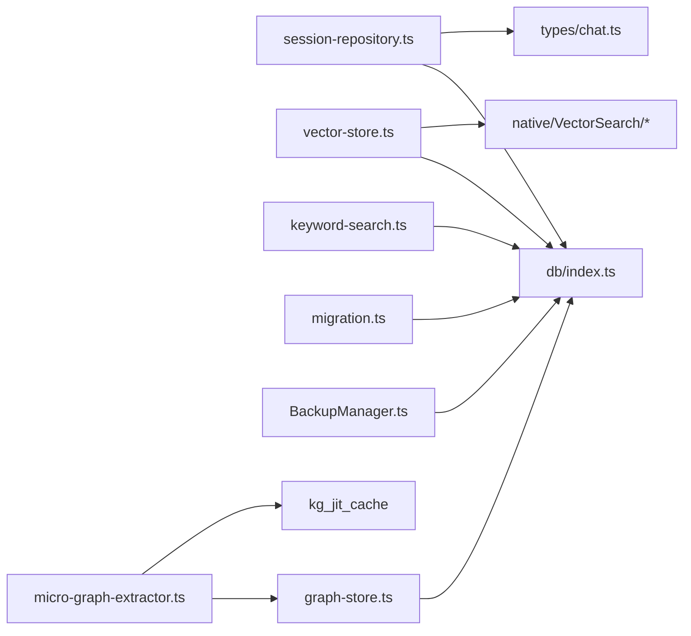

# 数据库设计

<cite>
**本文引用的文件**
- [src/lib/db/index.ts](file://src/lib/db/index.ts)
- [src/lib/db/schema.ts](file://src/lib/db/schema.ts)
- [src/lib/db/migration.ts](file://src/lib/db/migration.ts)
- [src/lib/db/session-repository.ts](file://src/lib/db/session-repository.ts)
- [src/lib/rag/vector-store.ts](file://src/lib/rag/vector-store.ts)
- [src/lib/rag/keyword-search.ts](file://src/lib/rag/keyword-search.ts)
- [src/lib/rag/micro-graph-extractor.ts](file://src/lib/rag/micro-graph-extractor.ts)
- [src/lib/rag/graph-store.ts](file://src/lib/rag/graph-store.ts)
- [src/native/VectorSearch/NativeVectorSearch.ts](file://src/native/VectorSearch/NativeVectorSearch.ts)
- [src/native/VectorSearch/index.ts](file://src/native/VectorSearch/index.ts)
- [src/types/chat.ts](file://src/types/chat.ts)
- [src/lib/backup/BackupManager.ts](file://src/lib/backup/BackupManager.ts)
</cite>

## 更新摘要
**变更内容**
- 新增kg_jit_cache表用于JIT提取结果缓存
- 扩展kg_nodes和kg_edges表以跟踪源类型（full/summary/jit）
- 增强向量存储系统以支持新的知识图谱功能
- 新增知识图谱作用域支持（会话和代理级别）

## 目录
1. [简介](#简介)
2. [项目结构](#项目结构)
3. [核心组件](#核心组件)
4. [架构总览](#架构总览)
5. [详细组件分析](#详细组件分析)
6. [依赖关系分析](#依赖关系分析)
7. [性能考量](#性能考量)
8. [故障排查指南](#故障排查指南)
9. [结论](#结论)
10. [附录](#附录)

## 简介
本文件面向Nexara数据库设计，围绕基于SQLite + FTS5 + 向量支持的架构展开，系统阐述表结构与索引策略、向量存储与相似度计算、数据模型关系、迁移与版本管理、查询优化与大数据量处理、以及备份恢复与完整性保障。**更新**：新增知识图谱JIT缓存机制、源类型跟踪和作用域支持，进一步强化了知识图谱功能的性能和可追溯性。

## 项目结构
数据库相关代码主要分布在以下模块：
- 初始化与基础配置：数据库打开、WAL模式、外键约束
- 模式定义与索引：核心表、FTS5虚拟表、触发器与索引
- 迁移脚本：安全升级与修复
- 会话与消息访问层：CRUD与自修复能力
- 向量检索：原生加速与降级路径
- 关键词检索：FTS5优先、LIKE回退
- **新增**：知识图谱JIT缓存：动态提取结果缓存与清理
- 备份与恢复：选择性恢复与事务保障



**图表来源**
- [src/lib/db/index.ts:1-13](file://src/lib/db/index.ts#L1-L13)
- [src/lib/db/schema.ts:1-381](file://src/lib/db/schema.ts#L1-L381)
- [src/lib/db/migration.ts:1-382](file://src/lib/db/migration.ts#L1-L382)
- [src/lib/db/session-repository.ts:1-425](file://src/lib/db/session-repository.ts#L1-L425)
- [src/lib/rag/vector-store.ts:1-376](file://src/lib/rag/vector-store.ts#L1-L376)
- [src/lib/rag/keyword-search.ts:1-204](file://src/lib/rag/keyword-search.ts#L1-L204)
- [src/lib/rag/graph-store.ts:1-429](file://src/lib/rag/graph-store.ts#L1-L429)
- [src/lib/rag/micro-graph-extractor.ts:1-304](file://src/lib/rag/micro-graph-extractor.ts#L1-L304)
- [src/native/VectorSearch/NativeVectorSearch.ts:1-18](file://src/native/VectorSearch/NativeVectorSearch.ts#L1-L18)
- [src/native/VectorSearch/index.ts:1-52](file://src/native/VectorSearch/index.ts#L1-L52)
- [src/types/chat.ts:1-323](file://src/types/chat.ts#L1-L323)
- [src/lib/backup/BackupManager.ts:306-407](file://src/lib/backup/BackupManager.ts#L306-L407)

**章节来源**
- [src/lib/db/index.ts:1-13](file://src/lib/db/index.ts#L1-L13)
- [src/lib/db/schema.ts:1-381](file://src/lib/db/schema.ts#L1-L381)
- [src/lib/db/migration.ts:1-382](file://src/lib/db/migration.ts#L1-L382)
- [src/lib/db/session-repository.ts:1-425](file://src/lib/db/session-repository.ts#L1-L425)
- [src/lib/rag/vector-store.ts:1-376](file://src/lib/rag/vector-store.ts#L1-L376)
- [src/lib/rag/keyword-search.ts:1-204](file://src/lib/rag/keyword-search.ts#L1-L204)
- [src/lib/rag/graph-store.ts:1-429](file://src/lib/rag/graph-store.ts#L1-L429)
- [src/lib/rag/micro-graph-extractor.ts:1-304](file://src/lib/rag/micro-graph-extractor.ts#L1-L304)
- [src/native/VectorSearch/NativeVectorSearch.ts:1-18](file://src/native/VectorSearch/NativeVectorSearch.ts#L1-L18)
- [src/native/VectorSearch/index.ts:1-52](file://src/native/VectorSearch/index.ts#L1-L52)
- [src/types/chat.ts:1-323](file://src/types/chat.ts#L1-L323)
- [src/lib/backup/BackupManager.ts:306-407](file://src/lib/backup/BackupManager.ts#L306-L407)

## 核心组件
- 数据库初始化与配置：打开数据库、启用WAL、开启外键约束，确保并发与参照完整性。
- 模式与索引：定义会话、消息、附件、文件夹、文档、向量、上下文摘要、标签、**扩展的知识图谱**、向量化任务队列、审计日志、工件等表，并建立必要索引；同时创建FTS5虚拟表及触发器以支持全文检索。
- 迁移与修复：通过迁移脚本安全升级表结构，补充缺失列，修复历史版本问题，执行工作区去重等。
- 会话与消息访问层：提供会话与消息的CRUD操作，具备自修复能力（检测缺失列并自动补全）。
- 向量检索：支持原生加速与JavaScript降级路径，实现向量BLOB存储、余弦相似度计算与索引维护。
- 关键词检索：优先使用FTS5，不可用时回退至LIKE，提供性能优化与过滤能力。
- **新增**：知识图谱JIT缓存：动态提取结果缓存、过期管理和背景合并机制。
- 备份与恢复：提供选择性恢复策略，对不同表采用"存在即覆盖"的策略，保证事务一致性。

**章节来源**
- [src/lib/db/index.ts:7-12](file://src/lib/db/index.ts#L7-L12)
- [src/lib/db/schema.ts:3-381](file://src/lib/db/schema.ts#L3-L381)
- [src/lib/db/migration.ts:8-382](file://src/lib/db/migration.ts#L8-L382)
- [src/lib/db/session-repository.ts:14-148](file://src/lib/db/session-repository.ts#L14-L148)
- [src/lib/rag/vector-store.ts:31-113](file://src/lib/rag/vector-store.ts#L31-L113)
- [src/lib/rag/keyword-search.ts:16-105](file://src/lib/rag/keyword-search.ts#L16-L105)
- [src/lib/rag/micro-graph-extractor.ts:18-78](file://src/lib/rag/micro-graph-extractor.ts#L18-L78)
- [src/lib/backup/BackupManager.ts:320-407](file://src/lib/backup/BackupManager.ts#L320-L407)

## 架构总览
整体架构围绕SQLite为核心，结合FTS5提升关键词检索效率，向量表配合原生模块实现相似度计算加速，并通过触发器与索引保障数据一致性与查询性能。**更新**：新增知识图谱JIT缓存层，支持动态提取结果的高性能缓存和清理。



**图表来源**
- [src/lib/db/session-repository.ts:1-425](file://src/lib/db/session-repository.ts#L1-L425)
- [src/lib/db/index.ts:1-13](file://src/lib/db/index.ts#L1-L13)
- [src/lib/db/schema.ts:1-381](file://src/lib/db/schema.ts#L1-L381)
- [src/lib/db/migration.ts:1-382](file://src/lib/db/migration.ts#L1-L382)
- [src/lib/rag/vector-store.ts:1-376](file://src/lib/rag/vector-store.ts#L1-L376)
- [src/lib/rag/keyword-search.ts:1-204](file://src/lib/rag/keyword-search.ts#L1-L204)
- [src/lib/rag/graph-store.ts:1-429](file://src/lib/rag/graph-store.ts#L1-L429)
- [src/lib/rag/micro-graph-extractor.ts:1-304](file://src/lib/rag/micro-graph-extractor.ts#L1-L304)
- [src/native/VectorSearch/NativeVectorSearch.ts:1-18](file://src/native/VectorSearch/NativeVectorSearch.ts#L1-L18)
- [src/native/VectorSearch/index.ts:1-52](file://src/native/VectorSearch/index.ts#L1-L52)

## 详细组件分析

### 数据模型与表结构
核心实体与关系如下：
- 会话（sessions）：记录会话元信息与配置，支持JSON字段保存复杂配置。
- 消息（messages）：记录对话消息，支持多模态附件、RAG引用、工具调用、向量化状态等。
- 附件（attachments）：消息级附件，支持图片与文件两类。
- 文件夹（folders）：知识库组织结构，支持父子关系。
- 文档（documents）：知识库条目，支持向量化状态、文件大小、元数据、全局可见性等。
- 向量（vectors）：嵌入向量存储，BLOB保存浮点数组，支持文档与会话关联、元数据、消息范围。
- 上下文摘要（context_summaries）：会话内摘要记录，用于成本控制与清理。
- 标签（tags）与文档标签（document_tags）：文档智能标注。
- **扩展**：知识图谱（kg_nodes/edges）：实体与关系，支持会话/代理作用域和源类型跟踪。
- **新增**：JIT缓存（kg_jit_cache）：动态提取结果缓存，支持键值映射和过期管理。
- 向量化任务队列（vectorization_tasks）：向量化任务持久化与断点续跑。
- 审计日志（audit_logs）：安全合规追踪。
- 工件（artifacts）：工作台集成产物。

```mermaid
erDiagram
SESSIONS {
text id PK
text agent_id
text title
text last_message
text time
integer unread
text model_id
text custom_prompt
integer is_pinned
real scroll_offset
text draft
text execution_mode
text loop_status
text pending_intervention
text approval_request
text rag_options
text inference_params
text active_task
text stats
text options
text active_mcp_server_ids
text active_skill_ids
integer created_at
integer updated_at
}
MESSAGES {
text id PK
text session_id FK
text role
text content
text model_id
text status
text reasoning
text thought_signature
text images
text tokens
text citations
text rag_references
text rag_progress
text rag_metadata
integer rag_references_loading
text execution_steps
text tool_calls
text pending_approval_tool_ids
text tool_call_id
text name
text planning_task
integer is_archived
text vectorization_status
real layout_height
text tool_results
text files
integer created_at
}
ATTACHMENTS {
text id PK
text message_id FK
text type
text uri
text local_uri
}
FOLDERS {
text id PK
text name
text parent_id FK
integer created_at
}
DOCUMENTS {
text id PK
text title
text content
text source
text type
text folder_id FK
integer vectorized
integer vector_count
integer file_size
integer created_at
integer updated_at
text metadata
integer is_global
text content_hash
}
VECTORS {
text id PK
text doc_id FK
text session_id FK
text content
blob embedding
text metadata
text start_message_id
text end_message_id
integer created_at
}
CONTEXT_SUMMARIES {
text id PK
text session_id FK
text start_message_id
text end_message_id
text summary_content
integer created_at
integer token_usage
}
TAGS {
text id PK
text name
text color
integer created_at
}
DOCUMENT_TAGS {
text doc_id PK FK
text tag_id PK FK
integer created_at
}
KG_NODES {
text id PK
text name
text type
text metadata
text session_id
text agent_id
text source_type
integer created_at
integer updated_at
}
KG_EDGES {
text id PK
text source_id FK
text target_id FK
text relation
real weight
text doc_id FK
text session_id
text agent_id
text source_type
integer created_at
}
KG_JIT_CACHE {
text cache_key PK
text query_hash
text chunk_ids_hash
text result_json
integer created_at
integer expires_at
}
VECTORIZATION_TASKS {
text id PK
text type
text status
text doc_id FK
text doc_title
text session_id FK
text user_content
text ai_content
text user_message_id
text assistant_message_id
integer last_chunk_index
integer total_chunks
real progress
text error
integer created_at
integer updated_at
}
AUDIT_LOGS {
text id PK
text action
text resource_type
text resource_path
text session_id
text agent_id
text skill_id
text status
text error_message
text metadata
integer created_at
}
ARTIFACTS {
text id PK
text type
text title
text content
text preview_image
text session_id FK
text message_id
integer created_at
integer updated_at
text tags
}
SESSIONS ||--o{ MESSAGES : "拥有"
MESSAGES ||--o{ ATTACHMENTS : "拥有"
FOLDERS ||--o{ DOCUMENTS : "拥有"
DOCUMENTS ||--o{ VECTORS : "生成"
SESSIONS ||--o{ VECTORS : "生成"
DOCUMENTS ||--o{ DOCUMENT_TAGS : "被标记"
TAGS ||--o{ DOCUMENT_TAGS : "标记"
KG_NODES ||--o{ KG_EDGES : "连接"
DOCUMENTS ||--o{ KG_EDGES : "归属"
SESSIONS ||--o{ CONTEXT_SUMMARIES : "摘要"
SESSIONS ||--o{ ARTIFACTS : "产生"
KG_NODES ||--o{ KG_JIT_CACHE : "缓存"
```

**图表来源**
- [src/lib/db/schema.ts:5-381](file://src/lib/db/schema.ts#L5-L381)
- [src/lib/db/session-repository.ts:345-402](file://src/lib/db/session-repository.ts#L345-L402)
- [src/types/chat.ts:135-223](file://src/types/chat.ts#L135-L223)

**章节来源**
- [src/lib/db/schema.ts:3-381](file://src/lib/db/schema.ts#L3-L381)
- [src/lib/db/session-repository.ts:345-402](file://src/lib/db/session-repository.ts#L345-L402)
- [src/types/chat.ts:135-223](file://src/types/chat.ts#L135-L223)

### 索引策略与查询优化
- 会话消息索引：按会话ID与创建时间建立复合索引，支撑分页与游标翻页。
- 向量化任务：按状态建立索引，便于批量调度与监控。
- 审计日志：按会话、创建时间、动作建立索引，满足合规审计查询。
- 工件：按会话、类型、创建时间建立索引，支撑工作台检索。
- **新增**：JIT缓存：按过期时间建立索引，支持快速清理过期条目。
- FTS5：为向量内容建立全文索引虚拟表，并通过触发器同步，优先用于关键词检索。
- 分页与游标：消息查询支持标准分页与基于时间戳的游标分页，避免大偏移扫描。

**章节来源**
- [src/lib/db/schema.ts:70-77](file://src/lib/db/schema.ts#L70-L77)
- [src/lib/db/schema.ts:297-301](file://src/lib/db/schema.ts#L297-L301)
- [src/lib/db/schema.ts:319-328](file://src/lib/db/schema.ts#L319-L328)
- [src/lib/db/schema.ts:346-356](file://src/lib/db/schema.ts#L346-L356)
- [src/lib/db/schema.ts:284](file://src/lib/db/schema.ts#L284)
- [src/lib/db/schema.ts:186-216](file://src/lib/db/schema.ts#L186-L216)
- [src/lib/db/session-repository.ts:266-315](file://src/lib/db/session-repository.ts#L266-L315)

### 向量存储与相似度计算
- 存储方式：向量以BLOB形式存储，内部为Float32数组二进制，支持高维向量。
- 相似度：提供原生与JS两种实现，均采用余弦相似度；原生模块在候选集较小或平台可用时优先使用。
- 索引维护：通过触发器与FTS5同步向量内容；支持按文档/会话清理；提供摘要清理冗余向量。
- 过滤与阈值：支持按文档ID、会话ID、类型等过滤，设定相似度阈值与返回数量上限。



**图表来源**
- [src/lib/rag/vector-store.ts:62-113](file://src/lib/rag/vector-store.ts#L62-L113)
- [src/lib/rag/vector-store.ts:115-159](file://src/lib/rag/vector-store.ts#L115-L159)
- [src/lib/rag/vector-store.ts:161-215](file://src/lib/rag/vector-store.ts#L161-L215)
- [src/native/VectorSearch/index.ts:15-48](file://src/native/VectorSearch/index.ts#L15-L48)
- [src/native/VectorSearch/NativeVectorSearch.ts:4-17](file://src/native/VectorSearch/NativeVectorSearch.ts#L4-L17)

**章节来源**
- [src/lib/rag/vector-store.ts:22-376](file://src/lib/rag/vector-store.ts#L22-L376)
- [src/native/VectorSearch/index.ts:1-52](file://src/native/VectorSearch/index.ts#L1-L52)
- [src/native/VectorSearch/NativeVectorSearch.ts:1-18](file://src/native/VectorSearch/NativeVectorSearch.ts#L1-L18)

### 关键词检索（FTS5/LIKE）
- 优先使用FTS5：通过MATCH进行分词与相关性排序，支持会话过滤与文档集合过滤。
- 性能优化：对超长查询进行截断，避免LIKE开销过大；当FTS5不可用时回退至LIKE。
- 内存文档过滤：对大集合文档ID采用内存过滤，减少SQL IN开销。

**章节来源**
- [src/lib/rag/keyword-search.ts:16-105](file://src/lib/rag/keyword-search.ts#L16-L105)
- [src/lib/rag/keyword-search.ts:110-202](file://src/lib/rag/keyword-search.ts#L110-L202)
- [src/lib/db/schema.ts:186-216](file://src/lib/db/schema.ts#L186-L216)

### 知识图谱系统与JIT缓存
**更新**：新增完整的知识图谱JIT（Just-In-Time）缓存机制，支持动态提取结果的高性能缓存和清理。

- **JIT缓存表**：kg_jit_cache用于存储动态提取的微图谱结果，包含缓存键、查询哈希、chunk ID哈希、JSON结果和过期时间。
- **缓存键生成**：基于查询内容和召回chunk ID的组合生成唯一键，支持重复查询的快速命中。
- **过期管理**：支持可配置的TTL（默认3600秒），自动清理过期条目，维护缓存空间。
- **背景合并**：提取完成后异步将结果合并到全局知识图谱中，支持事务性操作。
- **源类型跟踪**：kg_nodes和kg_edges新增source_type字段，支持'full'、'summary'、'jit'三种类型，便于追踪数据来源。



**图表来源**
- [src/lib/rag/micro-graph-extractor.ts:31-78](file://src/lib/rag/micro-graph-extractor.ts#L31-L78)
- [src/lib/rag/micro-graph-extractor.ts:85-130](file://src/lib/rag/micro-graph-extractor.ts#L85-L130)
- [src/lib/rag/graph-store.ts:270-362](file://src/lib/rag/graph-store.ts#L270-L362)

**章节来源**
- [src/lib/rag/micro-graph-extractor.ts:18-304](file://src/lib/rag/micro-graph-extractor.ts#L18-L304)
- [src/lib/rag/graph-store.ts:1-429](file://src/lib/rag/graph-store.ts#L1-L429)
- [src/lib/db/schema.ts:240-284](file://src/lib/db/schema.ts#L240-L284)
- [src/lib/db/migration.ts:236-262](file://src/lib/db/migration.ts#L236-L262)

### 会话与消息访问层（自修复）
- 自修复机制：当更新字段遇到"列不存在"错误时，自动检测表结构并补全缺失列，再重试更新。
- 事务与一致性：消息更新后同步刷新会话更新时间，确保视图一致性。
- 分页与游标：支持标准分页与基于时间戳的游标分页，满足大规模消息场景。

**章节来源**
- [src/lib/db/session-repository.ts:110-147](file://src/lib/db/session-repository.ts#L110-L147)
- [src/lib/db/session-repository.ts:209-241](file://src/lib/db/session-repository.ts#L209-L241)
- [src/lib/db/session-repository.ts:266-315](file://src/lib/db/session-repository.ts#L266-L315)

### 迁移与版本管理
- 结构演进：逐步添加列（如文档向量化状态、文件夹字段、标签与KG表）、创建索引与触发器。
- **新增**：JIT缓存支持：自动检测并创建kg_jit_cache表，添加必要的索引。
- **扩展**：知识图谱增强：为kg_nodes和kg_edges表添加session_id、agent_id和source_type字段。
- 历史修复：针对旧版本缺失字段进行补全，确保Schema漂移下的自愈。
- 去重优化：对工作区文件夹进行去重与索引优化，降低冗余与提升删除效率。
- 选择性恢复：备份恢复时仅对存在数据的表执行覆盖，避免误清空。

**章节来源**
- [src/lib/db/migration.ts:8-382](file://src/lib/db/migration.ts#L8-L382)
- [src/lib/db/migration.ts:291-353](file://src/lib/db/migration.ts#L291-L353)
- [src/lib/backup/BackupManager.ts:320-407](file://src/lib/backup/BackupManager.ts#L320-L407)

### 备份、恢复与完整性检查
- 选择性恢复：仅当备份中包含某类数据时才覆盖对应表，避免误删现有数据。
- 事务保障：导入过程包裹在事务中，失败自动回滚。
- 完整性检查：迁移脚本与自修复机制共同保障结构一致性；FTS5触发器与索引确保检索一致性。
- **新增**：JIT缓存清理：备份恢复时自动清理过期的JIT缓存条目，确保缓存一致性。

**章节来源**
- [src/lib/backup/BackupManager.ts:320-407](file://src/lib/backup/BackupManager.ts#L320-L407)
- [src/lib/db/schema.ts:186-216](file://src/lib/db/schema.ts#L186-L216)
- [src/lib/db/session-repository.ts:110-147](file://src/lib/db/session-repository.ts#L110-L147)

## 依赖关系分析
- 组件耦合：会话仓库依赖数据库连接；向量检索依赖原生模块与数据库；关键词检索依赖FTS5与数据库；迁移脚本依赖数据库执行。
- **新增**：知识图谱依赖JIT缓存表；微图提取器依赖图存储和缓存系统。
- 外部依赖：React Native TurboModule提供原生向量搜索能力；op-sqlite提供FTS5扩展支持。
- 循环依赖：未发现循环依赖迹象，模块职责清晰。



**图表来源**
- [src/lib/db/session-repository.ts:1-425](file://src/lib/db/session-repository.ts#L1-L425)
- [src/lib/db/index.ts:1-13](file://src/lib/db/index.ts#L1-L13)
- [src/types/chat.ts:1-323](file://src/types/chat.ts#L1-L323)
- [src/lib/rag/vector-store.ts:1-376](file://src/lib/rag/vector-store.ts#L1-L376)
- [src/native/VectorSearch/NativeVectorSearch.ts:1-18](file://src/native/VectorSearch/NativeVectorSearch.ts#L1-L18)
- [src/lib/rag/keyword-search.ts:1-204](file://src/lib/rag/keyword-search.ts#L1-L204)
- [src/lib/db/migration.ts:1-382](file://src/lib/db/migration.ts#L1-L382)
- [src/lib/backup/BackupManager.ts:306-407](file://src/lib/backup/BackupManager.ts#L306-L407)
- [src/lib/rag/graph-store.ts:1-429](file://src/lib/rag/graph-store.ts#L1-L429)
- [src/lib/rag/micro-graph-extractor.ts:1-304](file://src/lib/rag/micro-graph-extractor.ts#L1-L304)

## 性能考量
- WAL模式：启用WAL提升并发读写性能，适合移动端高频读写场景。
- 索引策略：为高频过滤字段建立索引，避免全表扫描；FTS5用于关键词检索，显著优于LIKE。
- 原生加速：在候选集可控时使用原生向量搜索，减少JS端计算压力。
- 分页与游标：使用基于时间戳的游标分页，避免大偏移带来的性能损耗。
- 查询截断：对长查询进行截断，避免FTS5/LIKE性能劣化。
- 事务批处理：批量插入与恢复采用事务，减少磁盘写入次数。
- **新增**：JIT缓存性能：通过缓存命中避免重复LLM调用，TTL控制内存占用，背景合并减少主线程阻塞。

**章节来源**
- [src/lib/db/index.ts:8-12](file://src/lib/db/index.ts#L8-L12)
- [src/lib/db/schema.ts:70-77](file://src/lib/db/schema.ts#L70-L77)
- [src/lib/db/schema.ts:186-216](file://src/lib/db/schema.ts#L186-L216)
- [src/lib/rag/vector-store.ts:102-113](file://src/lib/rag/vector-store.ts#L102-L113)
- [src/lib/rag/keyword-search.ts:28-31](file://src/lib/rag/keyword-search.ts#L28-L31)
- [src/lib/backup/BackupManager.ts:320-407](file://src/lib/backup/BackupManager.ts#L320-L407)
- [src/lib/rag/micro-graph-extractor.ts:103-130](file://src/lib/rag/micro-graph-extractor.ts#L103-L130)

## 故障排查指南
- 向量维度不匹配：当查询向量与存储向量维度不一致时，会记录错误并提示；可通过清理不一致向量或重建向量解决。
- FTS5不可用：若FTS5不可用，系统自动回退至LIKE；建议检查op-sqlite构建配置。
- Schema漂移：更新字段报"列不存在"时，会自动尝试补全并重试；若仍失败，检查迁移脚本与数据库权限。
- 备份恢复失败：导入失败会自动回滚；检查备份数据结构与表权限，确认事务边界内的完整性。
- **新增**：JIT缓存异常：检查kg_jit_cache表是否存在，验证TTL配置，确认缓存键生成逻辑正确。
- **新增**：知识图谱源类型冲突：当同一实体来自不同源类型时，系统按优先级合并，检查source_type字段是否正确设置。

**章节来源**
- [src/lib/rag/vector-store.ts:176-215](file://src/lib/rag/vector-store.ts#L176-L215)
- [src/lib/rag/keyword-search.ts:99-105](file://src/lib/rag/keyword-search.ts#L99-L105)
- [src/lib/db/session-repository.ts:110-147](file://src/lib/db/session-repository.ts#L110-L147)
- [src/lib/backup/BackupManager.ts:402-407](file://src/lib/backup/BackupManager.ts#L402-L407)
- [src/lib/rag/micro-graph-extractor.ts:85-130](file://src/lib/rag/micro-graph-extractor.ts#L85-L130)
- [src/lib/rag/graph-store.ts:87-177](file://src/lib/rag/graph-store.ts#L87-L177)

## 结论
该数据库设计以SQLite为核心，结合FTS5与原生向量搜索，实现了从会话消息到知识库与知识图谱的全链路数据管理。**更新**：新增的知识图谱JIT缓存机制显著提升了动态提取的性能和可扩展性，通过源类型跟踪和作用域支持增强了数据的可追溯性和隔离性。通过完善的索引策略、迁移机制与自修复能力，兼顾了易用性与稳定性；通过WAL、游标分页与原生加速等手段，满足移动端大数据量场景的性能需求。配套的备份恢复与完整性检查进一步增强了系统的可靠性。

## 附录
- 原生向量搜索接口定义与调用路径，便于平台适配与性能调优。
- 备份数据结构与恢复流程，便于制定自动化运维策略。
- **新增**：JIT缓存配置参数说明，包括TTL设置和性能调优建议。
- **新增**：知识图谱源类型策略，指导不同数据来源的处理方式。

**章节来源**
- [src/native/VectorSearch/NativeVectorSearch.ts:4-17](file://src/native/VectorSearch/NativeVectorSearch.ts#L4-L17)
- [src/native/VectorSearch/index.ts:15-48](file://src/native/VectorSearch/index.ts#L15-L48)
- [src/lib/backup/BackupManager.ts:320-407](file://src/lib/backup/BackupManager.ts#L320-L407)
- [src/lib/rag/micro-graph-extractor.ts:103-130](file://src/lib/rag/micro-graph-extractor.ts#L103-L130)
- [src/types/chat.ts:306-316](file://src/types/chat.ts#L306-L316)