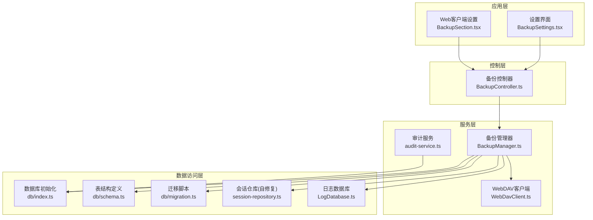
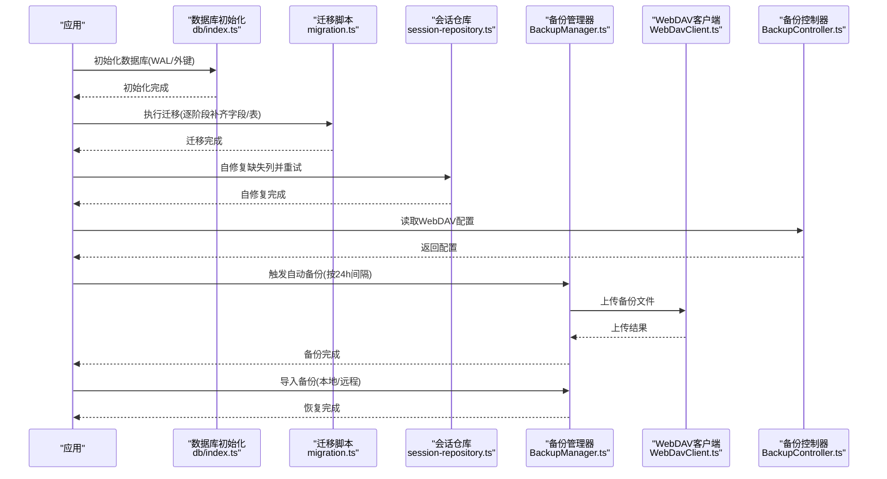
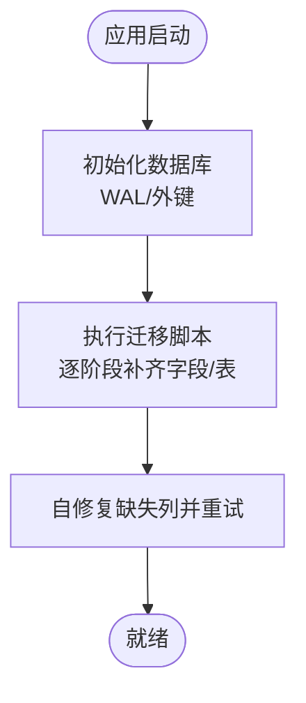
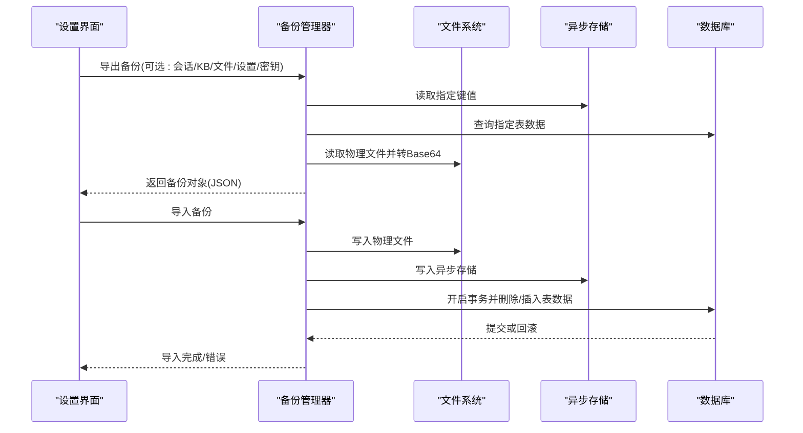
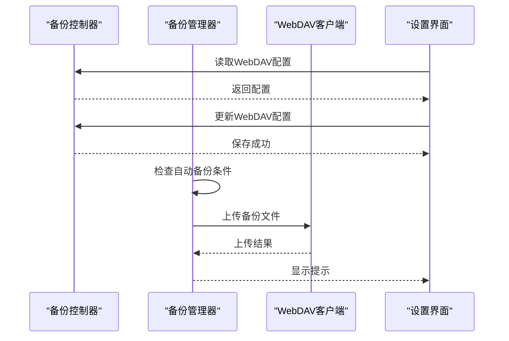
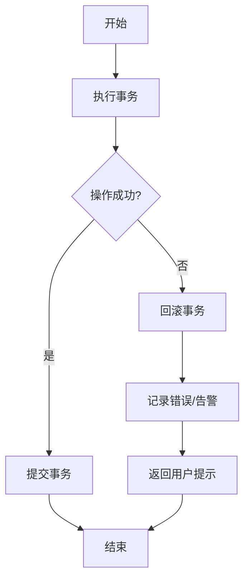
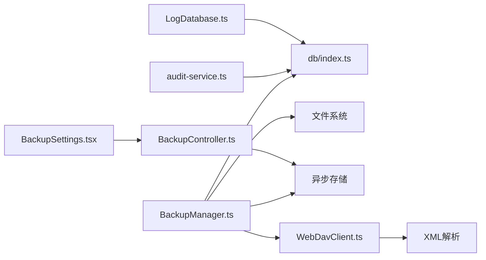

# 数据迁移管理

<cite>
**本文引用的文件**
- [src/lib/db/index.ts](file://src/lib/db/index.ts)
- [src/lib/db/schema.ts](file://src/lib/db/schema.ts)
- [src/lib/db/migration.ts](file://src/lib/db/migration.ts)
- [src/lib/db/session-repository.ts](file://src/lib/db/session-repository.ts)
- [src/lib/backup/BackupManager.ts](file://src/lib/backup/BackupManager.ts)
- [src/lib/backup/WebDavClient.ts](file://src/lib/backup/WebDavClient.ts)
- [src/services/workbench/controllers/BackupController.ts](file://src/services/workbench/controllers/BackupController.ts)
- [src/features/settings/BackupSettings.tsx](file://src/features/settings/BackupSettings.tsx)
- [web-client/src/pages/settings/BackupSection.tsx](file://web-client/src/pages/settings/BackupSection.tsx)
- [src/lib/services/audit-service.ts](file://src/lib/services/audit-service.ts)
- [src/lib/logging/LogDatabase.ts](file://src/lib/logging/LogDatabase.ts)
- [src/lib/rag/vectorization-queue.ts](file://src/lib/rag/vectorization-queue.ts)
</cite>

## 目录
1. [简介](#简介)
2. [项目结构](#项目结构)
3. [核心组件](#核心组件)
4. [架构总览](#架构总览)
5. [详细组件分析](#详细组件分析)
6. [依赖关系分析](#依赖关系分析)
7. [性能考量](#性能考量)
8. [故障排查指南](#故障排查指南)
9. [结论](#结论)
10. [附录](#附录)

## 简介
本文件面向Nexara的数据迁移管理，系统化阐述数据库版本管理机制、迁移脚本编写规范、执行顺序与回滚策略；解释备份与恢复自动化流程（版本检测、增量备份、一致性验证）；提供热备份、冷备份与增量备份策略建议；说明错误处理与异常恢复机制；给出数据完整性检查与校验方法；并提供迁移前准备清单与迁移后验证步骤，以及向后兼容性与版本升级注意事项。

## 项目结构
Nexara采用分层架构，数据库层由SQLite驱动，迁移与模式定义集中在数据库目录；备份与恢复通过BackupManager统一管理，并支持WebDAV云同步；工作台控制器负责配置读取与保存；前端设置页面提供本地导入/导出与自动备份开关。

**图表来源**
- [src/lib/db/index.ts:1-13](file://src/lib/db/index.ts#L1-L13)
- [src/lib/db/schema.ts:1-362](file://src/lib/db/schema.ts#L1-L362)
- [src/lib/db/migration.ts:1-354](file://src/lib/db/migration.ts#L1-L354)
- [src/lib/db/session-repository.ts:135-157](file://src/lib/db/session-repository.ts#L135-L157)
- [src/lib/backup/BackupManager.ts:1-472](file://src/lib/backup/BackupManager.ts#L1-L472)
- [src/lib/backup/WebDavClient.ts:1-201](file://src/lib/backup/WebDavClient.ts#L1-L201)
- [src/services/workbench/controllers/BackupController.ts:1-29](file://src/services/workbench/controllers/BackupController.ts#L1-L29)
- [src/lib/services/audit-service.ts:99-202](file://src/lib/services/audit-service.ts#L99-L202)
- [src/lib/logging/LogDatabase.ts:1-49](file://src/lib/logging/LogDatabase.ts#L1-L49)

**章节来源**
- [src/lib/db/index.ts:1-13](file://src/lib/db/index.ts#L1-L13)
- [src/lib/db/schema.ts:1-362](file://src/lib/db/schema.ts#L1-L362)
- [src/lib/db/migration.ts:1-354](file://src/lib/db/migration.ts#L1-L354)
- [src/lib/db/session-repository.ts:135-157](file://src/lib/db/session-repository.ts#L135-L157)
- [src/lib/backup/BackupManager.ts:1-472](file://src/lib/backup/BackupManager.ts#L1-L472)
- [src/lib/backup/WebDavClient.ts:1-201](file://src/lib/backup/WebDavClient.ts#L1-L201)
- [src/services/workbench/controllers/BackupController.ts:1-29](file://src/services/workbench/controllers/BackupController.ts#L1-L29)
- [src/features/settings/BackupSettings.tsx:148-451](file://src/features/settings/BackupSettings.tsx#L148-L451)
- [web-client/src/pages/settings/BackupSection.tsx:1-42](file://web-client/src/pages/settings/BackupSection.tsx#L1-L42)
- [src/lib/services/audit-service.ts:99-202](file://src/lib/services/audit-service.ts#L99-L202)
- [src/lib/logging/LogDatabase.ts:1-49](file://src/lib/logging/LogDatabase.ts#L1-L49)

## 核心组件
- 数据库初始化与WAL模式：确保并发读写与崩溃安全。
- 表结构定义与迁移脚本：按阶段演进，逐步补齐缺失字段与新增表，保证向后兼容。
- 备份管理器：支持选择性导出/导入、物理文件处理、路径重写、事务性恢复。
- WebDAV客户端：提供连接测试、文件列表、上传下载能力。
- 备份控制器与设置界面：读取/保存WebDAV配置，触发自动备份。
- 审计服务与日志数据库：记录操作与错误，便于问题定位与合规审计。
- 会话仓库自修复：对缺失列进行自动修复并重试，提升健壮性。

**章节来源**
- [src/lib/db/index.ts:1-13](file://src/lib/db/index.ts#L1-L13)
- [src/lib/db/schema.ts:1-362](file://src/lib/db/schema.ts#L1-L362)
- [src/lib/db/migration.ts:1-354](file://src/lib/db/migration.ts#L1-L354)
- [src/lib/backup/BackupManager.ts:1-472](file://src/lib/backup/BackupManager.ts#L1-L472)
- [src/lib/backup/WebDavClient.ts:1-201](file://src/lib/backup/WebDavClient.ts#L1-L201)
- [src/services/workbench/controllers/BackupController.ts:1-29](file://src/services/workbench/controllers/BackupController.ts#L1-L29)
- [src/lib/services/audit-service.ts:99-202](file://src/lib/services/audit-service.ts#L99-L202)
- [src/lib/logging/LogDatabase.ts:1-49](file://src/lib/logging/LogDatabase.ts#L1-L49)
- [src/lib/db/session-repository.ts:135-157](file://src/lib/db/session-repository.ts#L135-L157)

## 架构总览
下图展示数据迁移与备份的整体流程：启动时先初始化数据库并执行迁移，随后根据配置决定是否自动备份；用户可在设置界面进行本地导入/导出与WebDAV配置管理；备份过程中涉及异步存储、SQLite表与物理文件三类数据的处理与一致性保障。

**图表来源**
- [src/lib/db/index.ts:1-13](file://src/lib/db/index.ts#L1-L13)
- [src/lib/db/migration.ts:1-354](file://src/lib/db/migration.ts#L1-L354)
- [src/lib/db/session-repository.ts:135-157](file://src/lib/db/session-repository.ts#L135-L157)
- [src/lib/backup/BackupManager.ts:52-91](file://src/lib/backup/BackupManager.ts#L52-L91)
- [src/lib/backup/WebDavClient.ts:45-134](file://src/lib/backup/WebDavClient.ts#L45-L134)
- [src/services/workbench/controllers/BackupController.ts:7-27](file://src/services/workbench/controllers/BackupController.ts#L7-L27)

## 详细组件分析

### 数据库版本管理与迁移机制
- 版本管理策略
  - 采用阶段式迁移脚本，逐次补齐缺失字段与新增表，避免一次性大变更导致的风险。
  - 对于历史schema变更遗漏的情况，提供“修复”阶段，确保新字段在旧表上补齐。
- 迁移执行顺序
  - 启动时先初始化数据库（WAL模式、外键约束），再执行迁移脚本，最后进行自修复。
  - 迁移脚本内部按序号执行，遇到异常仅记录告警而不中断应用启动。
- 回滚策略
  - 当前实现未提供显式回滚脚本；通过事务性导入与“空数据跳过”策略降低风险。
  - 建议后续引入版本号与回滚清单，配合事务与快照实现可控回滚。

**图表来源**
- [src/lib/db/index.ts:7-12](file://src/lib/db/index.ts#L7-L12)
- [src/lib/db/migration.ts:8-289](file://src/lib/db/migration.ts#L8-L289)
- [src/lib/db/session-repository.ts:135-157](file://src/lib/db/session-repository.ts#L135-L157)

**章节来源**
- [src/lib/db/index.ts:1-13](file://src/lib/db/index.ts#L1-L13)
- [src/lib/db/migration.ts:1-354](file://src/lib/db/migration.ts#L1-L354)
- [src/lib/db/session-repository.ts:135-157](file://src/lib/db/session-repository.ts#L135-L157)

### 备份与恢复自动化流程
- 版本检测
  - 备份对象包含版本号与平台标识，导入时若备份版本高于当前支持版本则拒绝导入。
- 增量备份
  - 支持选择性导出（会话、知识库、文件、设置、密钥），可组合实现“增量”效果。
  - 自动备份默认按24小时间隔触发，通常执行全量备份以确保一致性。
- 一致性验证
  - 导入过程使用事务包裹，失败时回滚；对空数组采取“跳过”策略，避免误清空现有数据。
  - 物理文件与路径映射在内存中重写后再落盘，确保跨设备/目录一致性。

**图表来源**
- [src/lib/backup/BackupManager.ts:96-246](file://src/lib/backup/BackupManager.ts#L96-L246)
- [src/lib/backup/BackupManager.ts:251-407](file://src/lib/backup/BackupManager.ts#L251-L407)

**章节来源**
- [src/lib/backup/BackupManager.ts:32-33](file://src/lib/backup/BackupManager.ts#L32-L33)
- [src/lib/backup/BackupManager.ts:96-246](file://src/lib/backup/BackupManager.ts#L96-L246)
- [src/lib/backup/BackupManager.ts:251-407](file://src/lib/backup/BackupManager.ts#L251-L407)

### WebDAV集成与自动备份
- 连接测试与文件管理
  - 支持PROPFIND列出目录、PUT上传、GET下载，具备重定向处理与认证头设置。
- 自动备份
  - 读取配置后按24小时间隔触发，生成带时间戳的文件名并上传至远端。
- 设置界面
  - 提供开启/关闭自动备份、显示/隐藏密码等交互。

**图表来源**
- [src/services/workbench/controllers/BackupController.ts:7-27](file://src/services/workbench/controllers/BackupController.ts#L7-L27)
- [src/lib/backup/BackupManager.ts:52-91](file://src/lib/backup/BackupManager.ts#L52-L91)
- [src/lib/backup/WebDavClient.ts:45-153](file://src/lib/backup/WebDavClient.ts#L45-L153)
- [src/features/settings/BackupSettings.tsx:182-451](file://src/features/settings/BackupSettings.tsx#L182-L451)
- [web-client/src/pages/settings/BackupSection.tsx:1-42](file://web-client/src/pages/settings/BackupSection.tsx#L1-L42)

**章节来源**
- [src/lib/backup/WebDavClient.ts:1-201](file://src/lib/backup/WebDavClient.ts#L1-L201)
- [src/services/workbench/controllers/BackupController.ts:1-29](file://src/services/workbench/controllers/BackupController.ts#L1-L29)
- [src/lib/backup/BackupManager.ts:52-91](file://src/lib/backup/BackupManager.ts#L52-L91)
- [src/features/settings/BackupSettings.tsx:148-451](file://src/features/settings/BackupSettings.tsx#L148-L451)
- [web-client/src/pages/settings/BackupSection.tsx:1-42](file://web-client/src/pages/settings/BackupSection.tsx#L1-L42)

### 错误处理与异常恢复机制
- 数据库迁移
  - 迁移脚本捕获异常并记录警告，不中断应用启动；对缺失字段提供“修复”阶段。
- 备份导入
  - 使用事务包裹，失败即回滚；对空数据数组采取“跳过”策略，避免误清空。
- WebDAV
  - 对HTML错误页与非XML响应进行识别与报错；支持手动重定向URL提示。
- 审计与日志
  - 审计服务记录操作、错误与统计；日志数据库独立存储，便于离线分析。

**图表来源**
- [src/lib/backup/BackupManager.ts:321-407](file://src/lib/backup/BackupManager.ts#L321-L407)
- [src/lib/db/migration.ts:286-289](file://src/lib/db/migration.ts#L286-L289)
- [src/lib/backup/WebDavClient.ts:89-105](file://src/lib/backup/WebDavClient.ts#L89-L105)
- [src/lib/services/audit-service.ts:99-202](file://src/lib/services/audit-service.ts#L99-L202)
- [src/lib/logging/LogDatabase.ts:1-49](file://src/lib/logging/LogDatabase.ts#L1-L49)

**章节来源**
- [src/lib/db/migration.ts:286-289](file://src/lib/db/migration.ts#L286-L289)
- [src/lib/backup/BackupManager.ts:321-407](file://src/lib/backup/BackupManager.ts#L321-L407)
- [src/lib/backup/WebDavClient.ts:89-105](file://src/lib/backup/WebDavClient.ts#L89-L105)
- [src/lib/services/audit-service.ts:99-202](file://src/lib/services/audit-service.ts#L99-L202)
- [src/lib/logging/LogDatabase.ts:1-49](file://src/lib/logging/LogDatabase.ts#L1-L49)

### 数据完整性检查与校验
- 备份对象大小估算：将备份对象序列化为JSON后计算字节数，转换为MB显示。
- 向量化任务恢复：心跳超时自动标记为中断，重启后加载待处理任务，保障向量化进度。
- 审计与日志：通过审计服务查询最近错误与统计，结合日志数据库定位问题根因。

**章节来源**
- [src/lib/backup/BackupManager.ts:438-442](file://src/lib/backup/BackupManager.ts#L438-L442)
- [src/lib/rag/vectorization-queue.ts:716-732](file://src/lib/rag/vectorization-queue.ts#L716-L732)
- [src/lib/services/audit-service.ts:99-202](file://src/lib/services/audit-service.ts#L99-L202)
- [src/lib/logging/LogDatabase.ts:1-49](file://src/lib/logging/LogDatabase.ts#L1-L49)

## 依赖关系分析
- 组件耦合
  - 备份管理器依赖数据库、文件系统与异步存储；WebDAV客户端独立封装网络协议。
  - 控制器仅负责配置存取，不直接参与业务逻辑，降低耦合度。
- 外部依赖
  - SQLite驱动、WebDAV协议、XML解析库、Base64编码库。
- 潜在循环依赖
  - 未发现直接循环依赖；各模块职责清晰，通过接口与常量解耦。

**图表来源**
- [src/lib/backup/BackupManager.ts:1-5](file://src/lib/backup/BackupManager.ts#L1-L5)
- [src/lib/db/index.ts:1-5](file://src/lib/db/index.ts#L1-L5)
- [src/lib/backup/WebDavClient.ts:1-8](file://src/lib/backup/WebDavClient.ts#L1-L8)
- [src/services/workbench/controllers/BackupController.ts:1-2](file://src/services/workbench/controllers/BackupController.ts#L1-L2)
- [src/features/settings/BackupSettings.tsx:1-10](file://src/features/settings/BackupSettings.tsx#L1-L10)
- [src/lib/services/audit-service.ts:1-5](file://src/lib/services/audit-service.ts#L1-L5)
- [src/lib/logging/LogDatabase.ts:1-5](file://src/lib/logging/LogDatabase.ts#L1-L5)

**章节来源**
- [src/lib/backup/BackupManager.ts:1-5](file://src/lib/backup/BackupManager.ts#L1-L5)
- [src/lib/backup/WebDavClient.ts:1-8](file://src/lib/backup/WebDavClient.ts#L1-L8)
- [src/services/workbench/controllers/BackupController.ts:1-2](file://src/services/workbench/controllers/BackupController.ts#L1-L2)
- [src/features/settings/BackupSettings.tsx:1-10](file://src/features/settings/BackupSettings.tsx#L1-L10)
- [src/lib/services/audit-service.ts:1-5](file://src/lib/services/audit-service.ts#L1-L5)
- [src/lib/logging/LogDatabase.ts:1-5](file://src/lib/logging/LogDatabase.ts#L1-L5)

## 性能考量
- WAL模式与外键约束：提升并发读写性能与参照完整性。
- 索引与FTS5：为消息、向量化任务与审计日志建立索引；在支持情况下启用全文检索虚拟表。
- 事务批量写入：备份导入采用事务包裹，减少磁盘碎片与锁竞争。
- 文件读写优化：对物理文件进行Base64编码与路径重写，避免跨平台路径差异带来的IO开销。

**章节来源**
- [src/lib/db/index.ts:7-12](file://src/lib/db/index.ts#L7-L12)
- [src/lib/db/schema.ts:70-77](file://src/lib/db/schema.ts#L70-L77)
- [src/lib/db/schema.ts:186-216](file://src/lib/db/schema.ts#L186-L216)
- [src/lib/backup/BackupManager.ts:426-436](file://src/lib/backup/BackupManager.ts#L426-L436)

## 故障排查指南
- WebDAV连接失败
  - 检查URL、用户名与密码；确认服务器允许WebDAV协议与重定向处理。
  - 若收到HTML错误页或非XML响应，优先核对服务器配置与认证头。
- 备份导入失败
  - 查看导入事务回滚日志；确认备份版本与平台兼容性。
  - 检查空数据数组策略是否导致预期表被跳过。
- 迁移脚本异常
  - 查看迁移日志与自修复记录；确认缺失字段是否已补齐。
- 审计与日志
  - 使用审计服务查询最近错误与统计；结合日志数据库按时间与级别过滤定位问题。

**章节来源**
- [src/lib/backup/WebDavClient.ts:89-105](file://src/lib/backup/WebDavClient.ts#L89-L105)
- [src/lib/backup/BackupManager.ts:254-256](file://src/lib/backup/BackupManager.ts#L254-L256)
- [src/lib/db/migration.ts:286-289](file://src/lib/db/migration.ts#L286-L289)
- [src/lib/services/audit-service.ts:99-202](file://src/lib/services/audit-service.ts#L99-L202)
- [src/lib/logging/LogDatabase.ts:1-49](file://src/lib/logging/LogDatabase.ts#L1-L49)

## 结论
Nexara的数据迁移与备份体系以“渐进式迁移+事务性恢复+可选增量导出”为核心设计，兼顾安全性与可用性。通过WAL模式、索引与FTS5优化性能，借助审计与日志完善可观测性。建议后续引入版本回滚机制与更细粒度的增量策略，进一步提升运维效率与数据可靠性。

## 附录

### 数据迁移最佳实践
- 编写规范
  - 迁移脚本按阶段编号，每个阶段只做最小必要变更；对历史schema遗漏提供“修复”阶段。
  - 新增表与索引需考虑外键与唯一性约束，避免破坏现有数据。
- 执行顺序
  - 启动时先初始化数据库，再执行迁移，最后进行自修复。
  - 导入备份前先进行版本与平台校验，失败即回滚。
- 回滚策略
  - 当前未提供显式回滚脚本；建议引入版本号与回滚清单，配合事务与快照实现可控回滚。

**章节来源**
- [src/lib/db/migration.ts:1-354](file://src/lib/db/migration.ts#L1-L354)
- [src/lib/db/session-repository.ts:135-157](file://src/lib/db/session-repository.ts#L135-L157)
- [src/lib/backup/BackupManager.ts:251-407](file://src/lib/backup/BackupManager.ts#L251-L407)

### 自动化流程与策略
- 版本检测
  - 备份对象包含版本号与平台标识，导入时严格校验。
- 增量迁移
  - 通过选择性导出实现“增量”效果；自动备份默认全量。
- 一致性验证
  - 事务包裹与空数据跳过策略降低误删风险；路径重写确保跨设备一致性。

**章节来源**
- [src/lib/backup/BackupManager.ts:32-33](file://src/lib/backup/BackupManager.ts#L32-L33)
- [src/lib/backup/BackupManager.ts:96-246](file://src/lib/backup/BackupManager.ts#L96-L246)
- [src/lib/backup/BackupManager.ts:251-407](file://src/lib/backup/BackupManager.ts#L251-L407)

### 备份与恢复策略
- 热备份
  - 利用事务性导入与WAL模式，尽量减少停机时间。
- 冷备份
  - 在应用停止状态下导出全量数据，适合离线归档。
- 增量备份
  - 通过选择性导出（会话/知识库/文件/设置/密钥）组合实现增量效果。

**章节来源**
- [src/lib/db/index.ts:7-12](file://src/lib/db/index.ts#L7-L12)
- [src/lib/backup/BackupManager.ts:96-246](file://src/lib/backup/BackupManager.ts#L96-L246)

### 错误处理与异常恢复
- 数据库迁移：捕获异常并记录警告，不影响应用启动。
- 备份导入：事务包裹与回滚；空数组跳过策略。
- WebDAV：识别HTML错误页与非XML响应，抛出明确错误信息。
- 审计与日志：提供查询接口与统计功能，辅助问题定位。

**章节来源**
- [src/lib/db/migration.ts:286-289](file://src/lib/db/migration.ts#L286-L289)
- [src/lib/backup/BackupManager.ts:321-407](file://src/lib/backup/BackupManager.ts#L321-L407)
- [src/lib/backup/WebDavClient.ts:89-105](file://src/lib/backup/WebDavClient.ts#L89-L105)
- [src/lib/services/audit-service.ts:99-202](file://src/lib/services/audit-service.ts#L99-L202)
- [src/lib/logging/LogDatabase.ts:1-49](file://src/lib/logging/LogDatabase.ts#L1-L49)

### 数据完整性检查与校验
- 备份对象大小估算：序列化后计算字节数并转换为MB。
- 向量化任务恢复：心跳超时自动标记为中断，重启后加载待处理任务。
- 审计与日志：通过审计服务查询最近错误与统计，结合日志数据库定位问题。

**章节来源**
- [src/lib/backup/BackupManager.ts:438-442](file://src/lib/backup/BackupManager.ts#L438-L442)
- [src/lib/rag/vectorization-queue.ts:716-732](file://src/lib/rag/vectorization-queue.ts#L716-L732)
- [src/lib/services/audit-service.ts:99-202](file://src/lib/services/audit-service.ts#L99-L202)
- [src/lib/logging/LogDatabase.ts:1-49](file://src/lib/logging/LogDatabase.ts#L1-L49)

### 迁移前准备与迁移后验证
- 迁移前准备
  - 备份当前应用状态（全量导出）；核对WebDAV配置；确保磁盘空间充足。
- 迁移后验证
  - 校验表结构与索引是否存在；检查关键字段是否补齐；验证向量化任务队列与审计日志。
  - 通过设置界面进行本地导入测试，确认路径重写与数据一致性。

**章节来源**
- [src/lib/backup/BackupManager.ts:96-246](file://src/lib/backup/BackupManager.ts#L96-L246)
- [src/lib/backup/BackupManager.ts:251-407](file://src/lib/backup/BackupManager.ts#L251-L407)
- [src/features/settings/BackupSettings.tsx:148-180](file://src/features/settings/BackupSettings.tsx#L148-L180)

### 向后兼容性与版本升级注意事项
- 向后兼容性
  - 迁移脚本对历史schema遗漏提供“修复”阶段；备份版本校验避免高版本备份导入。
- 升级注意事项
  - 升级前务必进行全量备份；升级后检查自修复日志与审计统计；如遇异常，回滚至上一版本并修复问题。

**章节来源**
- [src/lib/db/migration.ts:305-317](file://src/lib/db/migration.ts#L305-L317)
- [src/lib/backup/BackupManager.ts:254-256](file://src/lib/backup/BackupManager.ts#L254-L256)