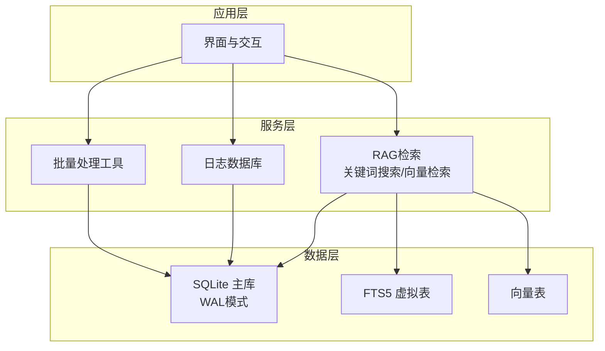
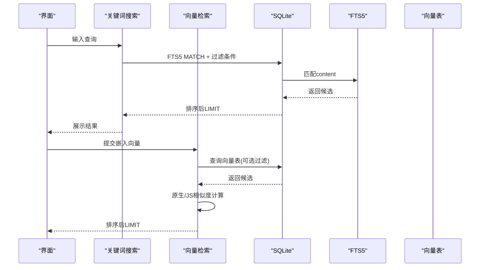
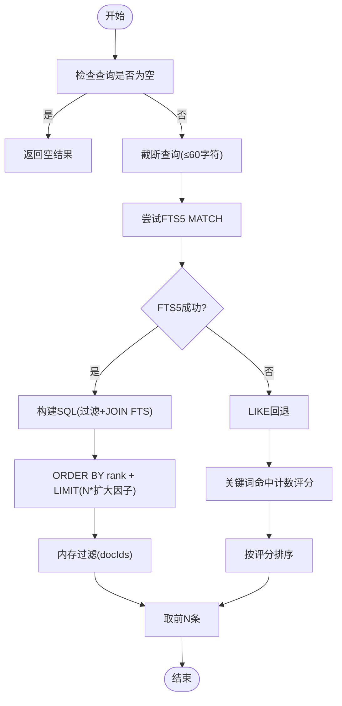
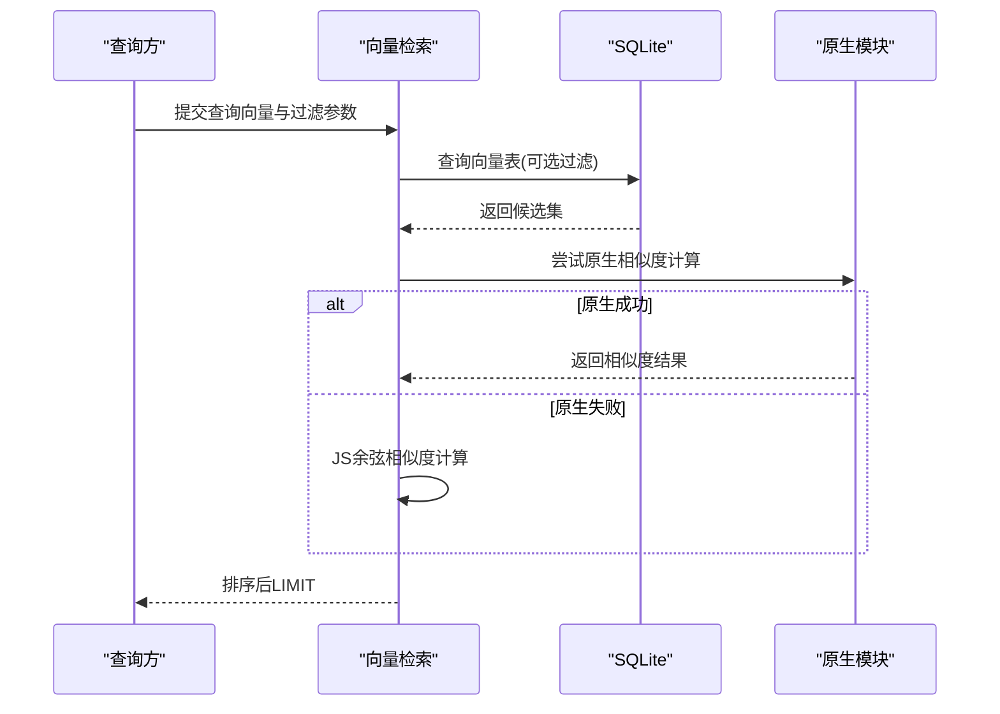
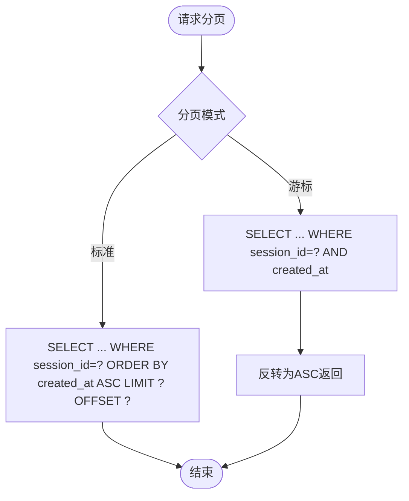
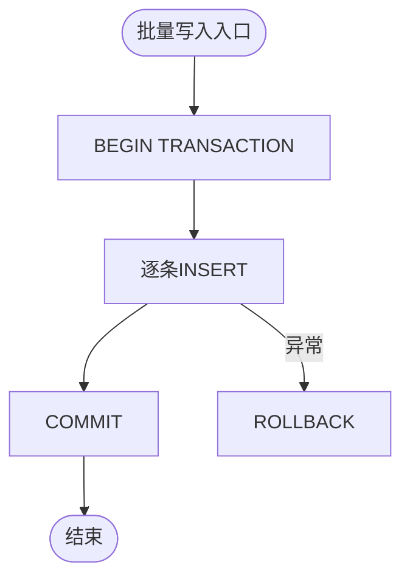
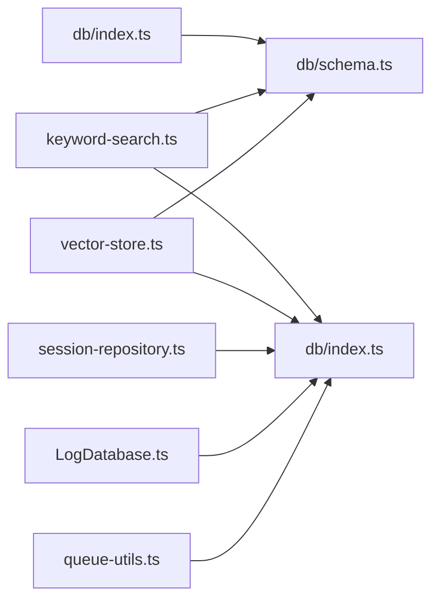

# 查询优化策略

<cite>
**本文引用的文件**
- [schema.ts](file://src/lib/db/schema.ts)
- [index.ts](file://src/lib/db/index.ts)
- [keyword-search.ts](file://src/lib/rag/keyword-search.ts)
- [vector-store.ts](file://src/lib/rag/vector-store.ts)
- [vector-stats.ts](file://src/lib/rag/vector-stats.ts)
- [session-repository.ts](file://src/lib/db/session-repository.ts)
- [LogDatabase.ts](file://src/lib/logging/LogDatabase.ts)
- [queue-utils.ts](file://src/lib/queue-utils.ts)
- [vector-store.benchmark.ts](file://src/lib/rag/__tests__/vector-store.benchmark.ts)
</cite>

## 目录
1. [简介](#简介)
2. [项目结构](#项目结构)
3. [核心组件](#核心组件)
4. [架构总览](#架构总览)
5. [详细组件分析](#详细组件分析)
6. [依赖关系分析](#依赖关系分析)
7. [性能考量](#性能考量)
8. [故障排查指南](#故障排查指南)
9. [结论](#结论)
10. [附录](#附录)

## 简介
本文件面向Nexara的查询优化策略，系统化梳理SQLite查询性能优化技术，涵盖索引使用策略、查询计划分析与执行效率提升；详解FTS5全文搜索的优化技巧（查询语法、权重与排序）；提供复杂查询的性能分析方法（EXPLAIN QUERY PLAN思路与瓶颈识别）；并给出大数据量场景下的分页查询、批量操作与内存管理策略；最后总结查询缓存、预编译语句与连接池优化方案，并提供性能监控指标与调优工具使用建议。

## 项目结构
Nexara采用分层架构，数据库层以SQLite为核心，结合FTS5全文索引与向量检索，配合会话与消息的分页查询、日志数据库的批量写入与清理、以及队列工具的大批量批处理，形成完整的本地查询与检索体系。

图表来源
- [schema.ts:186-216](file://src/lib/db/schema.ts#L186-L216)
- [keyword-search.ts:33-105](file://src/lib/rag/keyword-search.ts#L33-L105)
- [vector-store.ts:62-113](file://src/lib/rag/vector-store.ts#L62-L113)
- [LogDatabase.ts:25-43](file://src/lib/logging/LogDatabase.ts#L25-L43)
- [queue-utils.ts:5-48](file://src/lib/queue-utils.ts#L5-L48)

章节来源
- [schema.ts:1-362](file://src/lib/db/schema.ts#L1-L362)
- [index.ts:1-13](file://src/lib/db/index.ts#L1-L13)

## 核心组件
- 数据库初始化与模式
  - 初始化时启用WAL与外键约束，提升并发与一致性。
  - 定义会话、消息、向量、文档、标签、审计日志等核心表及索引。
  - FTS5虚拟表与触发器，实现向量内容的全文检索与同步。
- 关键查询组件
  - 关键词搜索：优先使用FTS5 MATCH，降级至LIKE；支持会话过滤、文档集合过滤与内存过滤。
  - 向量检索：原生与JS双实现路径，支持阈值与上限控制、JSON元数据过滤。
  - 会话与消息分页：标准分页与游标分页（基于时间戳）。
- 日志数据库：事务批量写入、索引与裁剪策略。
- 批量工具：小批次+延迟让渡事件循环，避免UI阻塞。

章节来源
- [index.ts:7-12](file://src/lib/db/index.ts#L7-L12)
- [schema.ts:36-76](file://src/lib/db/schema.ts#L36-L76)
- [schema.ts:186-216](file://src/lib/db/schema.ts#L186-L216)
- [keyword-search.ts:16-105](file://src/lib/rag/keyword-search.ts#L16-L105)
- [vector-store.ts:62-113](file://src/lib/rag/vector-store.ts#L62-L113)
- [session-repository.ts:266-299](file://src/lib/db/session-repository.ts#L266-L299)
- [LogDatabase.ts:48-94](file://src/lib/logging/LogDatabase.ts#L48-L94)
- [queue-utils.ts:5-48](file://src/lib/queue-utils.ts#L5-L48)

## 架构总览
下图展示查询优化的关键路径：UI触发检索 → 关键词搜索/向量检索 → SQLite/FTS5/向量表 → 结果返回与排序。

图表来源
- [keyword-search.ts:33-98](file://src/lib/rag/keyword-search.ts#L33-L98)
- [vector-store.ts:62-113](file://src/lib/rag/vector-store.ts#L62-L113)
- [schema.ts:186-216](file://src/lib/db/schema.ts#L186-L216)

## 详细组件分析

### 组件A：关键词搜索（FTS5 + LIKE回退）
- 优化要点
  - 查询长度截断：避免超长查询导致FTS5/LIKE性能骤降。
  - FTS5 MATCH优先：利用虚拟表与触发器同步，显著优于LIKE。
  - 过滤策略：支持会话过滤、文档集合过滤（小集合IN，大集合内存过滤）。
  - 回退机制：FTS5失败时自动降级至LIKE，保证可用性。
- 排序与限制
  - FTS5使用rank排序，先LIMIT扩大候选再切片。
  - LIKE基于关键词命中次数评分，最终排序取前N。

图表来源
- [keyword-search.ts:25-105](file://src/lib/rag/keyword-search.ts#L25-L105)

章节来源
- [keyword-search.ts:16-105](file://src/lib/rag/keyword-search.ts#L16-L105)

### 组件B：向量检索（原生/JS双实现）
- 优化要点
  - 原生路径优先：在可用时调用原生相似度计算，降低JS侧开销。
  - 降级策略：原生失败回退JS实现，确保稳定性。
  - 过滤与阈值：支持docId/docIds/sessionId/type过滤与相似度阈值控制。
  - 维度校验：发现维度不一致时输出警告并提示用户。
- 排序与限制
  - 原生/JS均按相似度降序，取前LIMIT条。

图表来源
- [vector-store.ts:62-113](file://src/lib/rag/vector-store.ts#L62-L113)
- [vector-store.ts:115-159](file://src/lib/rag/vector-store.ts#L115-L159)
- [vector-store.ts:161-215](file://src/lib/rag/vector-store.ts#L161-L215)

章节来源
- [vector-store.ts:62-215](file://src/lib/rag/vector-store.ts#L62-L215)

### 组件C：会话与消息分页查询
- 分页策略
  - 标准分页：LIMIT/OFFSET，适合小规模数据。
  - 游标分页：基于created_at < ? DESC + 反转，适合上拉加载历史片段。
- 索引优化
  - 为messages.session_id与时间戳建立复合索引，加速过滤与排序。

图表来源
- [session-repository.ts:266-299](file://src/lib/db/session-repository.ts#L266-L299)

章节来源
- [session-repository.ts:266-299](file://src/lib/db/session-repository.ts#L266-L299)

### 组件D：日志数据库（批量写入与裁剪）
- 事务批量插入：BEGIN/COMMIT包裹，显著提升吞吐。
- 索引策略：按timestamp与level建立索引，支撑快速查询与裁剪。
- 裁剪策略：保留最近N条，删除超出部分，控制存储增长。

图表来源
- [LogDatabase.ts:48-76](file://src/lib/logging/LogDatabase.ts#L48-L76)
- [LogDatabase.ts:81-94](file://src/lib/logging/LogDatabase.ts#L81-L94)

章节来源
- [LogDatabase.ts:25-131](file://src/lib/logging/LogDatabase.ts#L25-L131)

### 组件E：批量处理工具（UI让渡与进度反馈）
- 小批次处理：每批Promise并行，减少串行等待。
- 延迟让渡：批次间主动setTimeout，避免主线程阻塞。
- 进度回调：累计完成/失败计数，便于UI反馈。

章节来源
- [queue-utils.ts:5-48](file://src/lib/queue-utils.ts#L5-L48)

## 依赖关系分析
- 数据库层
  - schema.ts定义表结构与索引，包含FTS5虚拟表与触发器。
  - index.ts启用WAL与外键，奠定并发与一致性基础。
- 检索层
  - keyword-search.ts依赖FTS5与vectors表，支持回退。
  - vector-store.ts依赖vectors表与原生模块，支持阈值与过滤。
- 会话层
  - session-repository.ts提供分页查询与游标分页。
- 日志层
  - LogDatabase.ts提供批量写入与裁剪。
- 工具层
  - queue-utils.ts提供UI友好型批处理。

图表来源
- [index.ts:1-13](file://src/lib/db/index.ts#L1-L13)
- [schema.ts:1-362](file://src/lib/db/schema.ts#L1-L362)
- [keyword-search.ts:1-204](file://src/lib/rag/keyword-search.ts#L1-L204)
- [vector-store.ts:1-376](file://src/lib/rag/vector-store.ts#L1-L376)
- [session-repository.ts:1-425](file://src/lib/db/session-repository.ts#L1-L425)
- [LogDatabase.ts:1-132](file://src/lib/logging/LogDatabase.ts#L1-L132)
- [queue-utils.ts:1-48](file://src/lib/queue-utils.ts#L1-L48)

章节来源
- [index.ts:1-13](file://src/lib/db/index.ts#L1-L13)
- [schema.ts:1-362](file://src/lib/db/schema.ts#L1-L362)

## 性能考量
- 索引使用策略
  - 会话消息：idx_messages_session、idx_messages_session_created，加速按会话过滤与时间排序。
  - 审计日志：idx_audit_logs_session、idx_audit_logs_created、idx_audit_logs_action，支撑多维查询。
  - 文档标签：idx_document_tags_doc_id、idx_document_tags_tag_id，加速多对多关联。
  - 资产：idx_artifacts_session、idx_artifacts_type、idx_artifacts_created_at，支撑检索与分页。
- 查询计划分析与执行效率
  - 使用EXPLAIN QUERY PLAN（概念性说明）：观察SQLite执行路径，确认索引使用、排序与连接顺序，定位全表扫描与不必要的临时表。
  - 避免SELECT *：仅取必要列，减少I/O与序列化成本。
  - 控制返回量：先扩大候选（如FTS5 LIMIT N*扩大因子）再切片，平衡准确与性能。
- FTS5优化技巧
  - 查询语法：MATCH短语，利用自动分词；避免超长查询（已内置截断）。
  - 权重与排序：FTS5 rank默认按相关性排序；LIKE场景下按命中词频评分。
  - 同步策略：触发器自动维护FTS5内容，确保一致性。
- 大数据量场景
  - 分页：优先游标分页（基于时间戳），避免深层OFFSET。
  - 批量：使用事务批量写入与队列工具分批处理，避免UI卡顿。
  - 内存：大集合过滤采用内存Set后再过滤，减少SQL IN子句膨胀。
- 缓存、预编译与连接池
  - 预编译：将重复SQL与参数绑定，减少解析与编译开销（概念性建议）。
  - 连接池：在多线程/多任务场景下复用连接，减少握手成本（概念性建议）。
  - 读写分离：WAL模式下读写并发提升，但需注意写放大与checkpoint策略（概念性建议）。
- 监控与调优
  - 性能指标：查询耗时、返回行数、候选扩大因子、相似度分布、日志写入吞吐。
  - 基准测试：参考向量检索基准脚本，按不同规模评估响应时间与UI流畅度。

章节来源
- [schema.ts:36-76](file://src/lib/db/schema.ts#L36-L76)
- [schema.ts:218-356](file://src/lib/db/schema.ts#L218-L356)
- [keyword-search.ts:28-31](file://src/lib/rag/keyword-search.ts#L28-L31)
- [session-repository.ts:266-299](file://src/lib/db/session-repository.ts#L266-L299)
- [LogDatabase.ts:48-76](file://src/lib/logging/LogDatabase.ts#L48-L76)
- [queue-utils.ts:5-48](file://src/lib/queue-utils.ts#L5-L48)
- [vector-store.benchmark.ts:10-77](file://src/lib/rag/__tests__/vector-store.benchmark.ts#L10-L77)

## 故障排查指南
- FTS5不可用或失败
  - 现象：FTS5查询抛错，自动回退LIKE。
  - 处理：确认op-sqlite配置与FTS5扩展；检查触发器是否创建成功。
- 维度不匹配
  - 现象：向量检索返回0候选，控制台警告维度不一致。
  - 处理：检查嵌入模型维度一致性，必要时重建向量或迁移数据。
- UI卡顿
  - 现象：大批量写入或检索导致界面无响应。
  - 处理：使用队列工具分批处理，设置合理批次与延迟。
- 日志写入异常
  - 现象：批量写入失败或回滚。
  - 处理：捕获异常并回滚，检查磁盘空间与权限。

章节来源
- [keyword-search.ts:99-105](file://src/lib/rag/keyword-search.ts#L99-L105)
- [vector-store.ts:201-205](file://src/lib/rag/vector-store.ts#L201-L205)
- [queue-utils.ts:18-29](file://src/lib/queue-utils.ts#L18-L29)
- [LogDatabase.ts:70-76](file://src/lib/logging/LogDatabase.ts#L70-L76)

## 结论
Nexara在SQLite之上构建了完善的查询与检索体系：FTS5全文索引与触发器保障关键词检索性能；向量检索提供原生与JS双实现路径；分页与游标策略满足不同场景；日志数据库采用事务批量写入与裁剪控制存储；队列工具确保大规模批处理不阻塞UI。通过索引优化、查询计划分析、候选扩大与切片、以及基准测试与监控，可在大数据量场景下持续提升查询性能与用户体验。

## 附录
- EXPLAIN QUERY PLAN使用建议（概念性）
  - 在开发环境对关键SQL执行EXPLAIN QUERY PLAN，关注索引使用、排序与连接顺序。
  - 避免全表扫描，必要时添加复合索引或重写SQL谓词。
- 性能监控指标（概念性）
  - 查询耗时分布、返回行数、候选扩大因子、相似度阈值命中率、日志写入TPS、UI帧率。