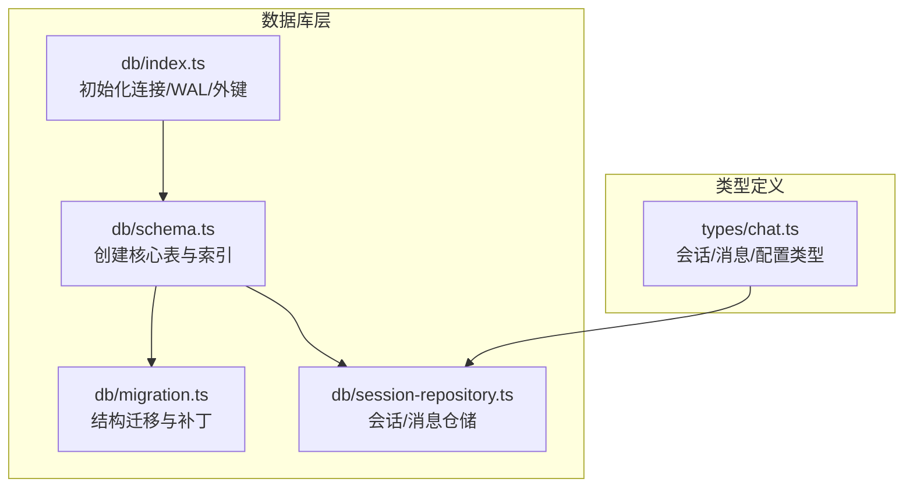
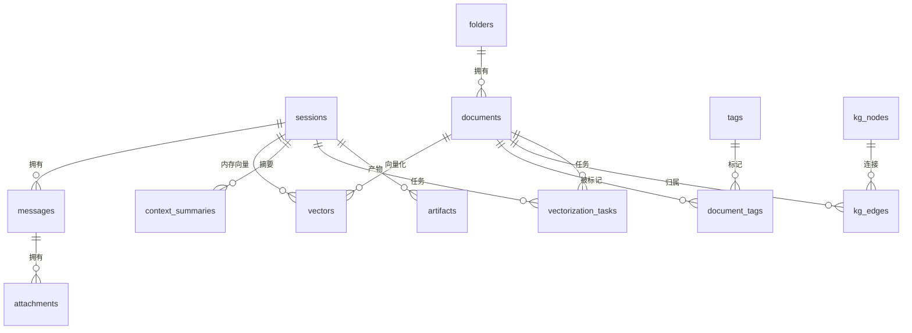
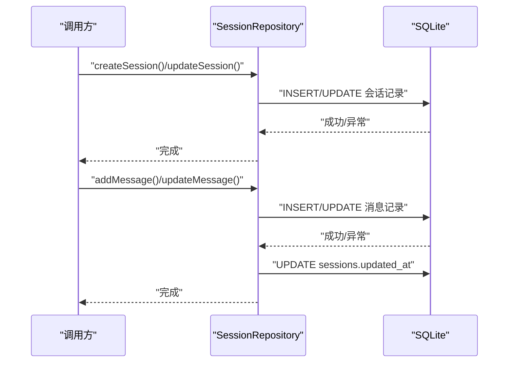
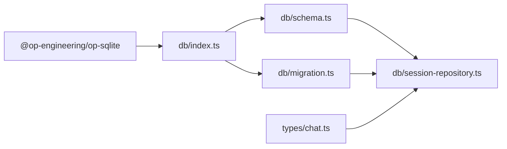

# 表结构设计

<cite>
**本文引用的文件**
- [schema.ts](file://src/lib/db/schema.ts)
- [migration.ts](file://src/lib/db/migration.ts)
- [index.ts](file://src/lib/db/index.ts)
- [session-repository.ts](file://src/lib/db/session-repository.ts)
- [chat.ts](file://src/types/chat.ts)
</cite>

## 目录
1. [简介](#简介)
2. [项目结构](#项目结构)
3. [核心组件](#核心组件)
4. [架构总览](#架构总览)
5. [详细组件分析](#详细组件分析)
6. [依赖分析](#依赖分析)
7. [性能考虑](#性能考虑)
8. [故障排查指南](#故障排查指南)
9. [结论](#结论)
10. [附录](#附录)

## 简介
本文件系统性梳理 Nexara 的 SQLite 表结构设计，聚焦核心实体表与关系设计，涵盖字段定义、数据类型、约束条件、索引策略、查询优化、数据完整性与版本兼容性。重点覆盖以下实体表：
- sessions：会话表
- messages：消息表
- documents：知识库文档表
- folders：知识库目录组织表
- attachments：消息附件表
- vectors：向量嵌入表
- context_summaries：上下文摘要表
- tags / document_tags：标签系统
- kg_nodes / kg_edges：知识图谱节点与边
- vectorization_tasks：向量化任务队列表
- audit_logs：审计日志表
- artifacts：工作区产物表

同时，文档解释主外键关系、引用完整性约束与级联策略，并总结表结构演进历史与迁移策略。

## 项目结构
数据库相关代码集中在 src/lib/db 目录，采用“初始化 + 架构定义 + 迁移 + 仓储层”的分层设计：
- 初始化：打开数据库连接并启用 WAL 与外键约束
- 架构定义：统一创建核心表与索引
- 迁移：安全升级现有表结构，保证数据不丢失
- 仓储层：面向业务的 CRUD 与查询封装，包含自修复能力

图表来源
- [index.ts:1-13](file://src/lib/db/index.ts#L1-L13)
- [schema.ts:1-362](file://src/lib/db/schema.ts#L1-L362)
- [migration.ts:1-354](file://src/lib/db/migration.ts#L1-L354)
- [session-repository.ts:1-425](file://src/lib/db/session-repository.ts#L1-L425)
- [chat.ts:1-314](file://src/types/chat.ts#L1-L314)

章节来源
- [index.ts:1-13](file://src/lib/db/index.ts#L1-L13)
- [schema.ts:1-362](file://src/lib/db/schema.ts#L1-L362)
- [migration.ts:1-354](file://src/lib/db/migration.ts#L1-L354)
- [session-repository.ts:1-425](file://src/lib/db/session-repository.ts#L1-L425)
- [chat.ts:1-314](file://src/types/chat.ts#L1-L314)

## 核心组件
本节对核心表进行字段定义、数据类型与约束说明，并给出关系与索引概览。

- sessions（会话表）
  - 主键：id（文本）
  - 关键字段：agent_id、title、last_message、time、unread、model_id、custom_prompt、is_pinned、scroll_offset、draft、execution_mode、loop_status、pending_intervention、approval_request、rag_options、inference_params、active_task、stats、options、active_mcp_server_ids、active_skill_ids
  - 时间戳：created_at、updated_at
  - 约束：NOT NULL、默认值、JSON 字段存储复杂对象
  - 级联：无外键引用；删除会话将通过 CASCADE 删除其消息（见 messages.fk）

- messages（消息表）
  - 主键：id（文本）
  - 外键：session_id → sessions(id)（CASCADE 删除）
  - 关键字段：role（用户/助手/系统/工具）、content、model_id、status、reasoning、thought_signature、images、tokens、citations、rag_references、rag_progress、rag_metadata、rag_references_loading、execution_steps、tool_calls、pending_approval_tool_ids、tool_call_id、name、planning_task、is_archived、vectorization_status、layout_height、tool_results、files
  - 时间戳：created_at
  - 约束：NOT NULL、默认值、JSON 字段存储复杂对象
  - 索引：idx_messages_session、idx_messages_session_created

- documents（知识库文档表）
  - 主键：id（文本）
  - 外键：folder_id → folders(id)（SET NULL）
  - 关键字段：title、content、source、type、vectorized、vector_count、file_size、metadata、is_global、content_hash
  - 时间戳：created_at、updated_at
  - 约束：NOT NULL、默认值、JSON 字段存储元数据
  - 级联：删除文档时，向量与附件等通过 CASCADE 或 SET NULL 清理

- folders（知识库目录组织表）
  - 主键：id（文本）
  - 外键：parent_id → folders(id)（CASCADE）
  - 关键字段：name、parent_id、created_at
  - 约束：UNIQUE(name)、NOT NULL
  - 级联：树形结构删除时级联子目录

- attachments（消息附件表）
  - 主键：id（文本）
  - 外键：message_id → messages(id)（CASCADE）
  - 关键字段：type（图像/文件）、uri、local_uri
  - 约束：NOT NULL
  - 级联：删除消息时级联删除附件

- vectors（向量嵌入表）
  - 主键：id（文本）
  - 外键：doc_id → documents(id)（CASCADE）、session_id → sessions(id)（CASCADE）
  - 关键字段：content（文本块）、embedding（BLOB，Float32Array 二进制）、metadata、start_message_id、end_message_id、created_at
  - 约束：NOT NULL
  - 级联：删除文档或会话时级联删除向量

- context_summaries（上下文摘要表）
  - 主键：id（文本）
  - 外键：session_id → sessions(id)（CASCADE）
  - 关键字段：start_message_id、end_message_id、summary_content、token_usage、created_at
  - 约束：NOT NULL
  - 级联：删除会话时级联删除摘要

- tags / document_tags（标签系统）
  - tags：id、name、color、created_at
  - document_tags：doc_id、tag_id、created_at（复合主键），外键分别指向 documents 与 tags（CASCADE）
  - 约束：NOT NULL、复合主键
  - 级联：删除文档或标签时级联删除关联记录

- kg_nodes / kg_edges（知识图谱）
  - kg_nodes：id、name（UNIQUE）、type、metadata、created_at、updated_at
  - kg_edges：id、source_id、target_id、relation、weight、doc_id（可空），外键指向 nodes 与 documents（CASCADE）
  - 约束：NOT NULL、UNIQUE(name)
  - 级联：删除节点或文档时级联删除边

- vectorization_tasks（向量化任务队列表）
  - 主键：id（文本）
  - 关键字段：type、status、doc_id/doc_title、session_id、user_content/ai_content、user_message_id/assistant_message_id、last_chunk_index、total_chunks、progress、error、created_at、updated_at
  - 外键：doc_id → documents(id)（CASCADE）、session_id → sessions(id)（CASCADE）
  - 约束：NOT NULL、默认值
  - 级联：删除文档或会话时级联删除任务
  - 索引：idx_vectorization_tasks_status

- audit_logs（审计日志表）
  - 主键：id（文本）
  - 关键字段：action、resource_type、resource_path、session_id、agent_id、skill_id、status、error_message、metadata、created_at
  - 约束：NOT NULL
  - 索引：idx_audit_logs_session、idx_audit_logs_created、idx_audit_logs_action

- artifacts（工作区产物表）
  - 主键：id（文本）
  - 外键：session_id → sessions(id)（CASCADE）
  - 关键字段：type、title、content、preview_image、session_id、message_id、created_at、updated_at、tags
  - 约束：NOT NULL
  - 级联：删除会话时级联删除产物
  - 索引：idx_artifacts_session、idx_artifacts_type、idx_artifacts_created_at

章节来源
- [schema.ts:3-362](file://src/lib/db/schema.ts#L3-L362)
- [migration.ts:1-354](file://src/lib/db/migration.ts#L1-L354)
- [session-repository.ts:1-425](file://src/lib/db/session-repository.ts#L1-L425)
- [chat.ts:135-223](file://src/types/chat.ts#L135-L223)

## 架构总览
下图展示核心表之间的主外键关系与级联策略，帮助理解数据流向与完整性约束。

图表来源
- [schema.ts:66-67](file://src/lib/db/schema.ts#L66-L67)
- [schema.ts:86-87](file://src/lib/db/schema.ts#L86-L87)
- [schema.ts:118-119](file://src/lib/db/schema.ts#L118-L119)
- [schema.ts:167-169](file://src/lib/db/schema.ts#L167-L169)
- [schema.ts:182-183](file://src/lib/db/schema.ts#L182-L183)
- [schema.ts:234-236](file://src/lib/db/schema.ts#L234-L236)
- [schema.ts:263-264](file://src/lib/db/schema.ts#L263-L264)
- [schema.ts:292-294](file://src/lib/db/schema.ts#L292-L294)
- [schema.ts:342-344](file://src/lib/db/schema.ts#L342-L344)

## 详细组件分析

### 会话与消息仓储流程
会话与消息的读写通过仓储层完成，包含自修复机制以应对表结构漂移（Schema Drift）。

图表来源
- [session-repository.ts:14-50](file://src/lib/db/session-repository.ts#L14-L50)
- [session-repository.ts:162-204](file://src/lib/db/session-repository.ts#L162-L204)
- [session-repository.ts:209-241](file://src/lib/db/session-repository.ts#L209-L241)

章节来源
- [session-repository.ts:1-425](file://src/lib/db/session-repository.ts#L1-L425)

### 表结构演进与版本兼容
- 初始架构（schema.ts）一次性创建核心表与索引，并包含若干关键字段的迁移补丁（如 messages.files、messages.is_error/error_message、sessions.options/rag_options 等）。
- 迁移脚本（migration.ts）负责：
  - 为 documents 表添加 folder_id/vectorized/vector_count/file_size 等字段
  - 创建 folders 表并维护树形结构级联
  - 为 vectors 表补充 start_message_id/end_message_id 以支持精确清理
  - 修复 sessions/messages 缺失字段（Phase 4b 修复）
  - 创建 tags/document_tags 与 kg_nodes/kg_edges（Phase 8）
  - 为 documents 增加 content_hash/thumbnail_path/kg_processed_hash（成本优化）
  - 为 kg_nodes/kg_edges 增加 session_id/agent_id 并创建索引（KG 2.0）
  - 优化工作区文件夹去重与清理（高效率）
  - 为 sessions 增加 active_mcp_server_ids/active_skill_ids 并补救缺失字段
  - 创建 artifacts 表并建立索引
- 初始化阶段启用 WAL 模式与外键约束，提升并发与一致性。

章节来源
- [schema.ts:122-151](file://src/lib/db/schema.ts#L122-L151)
- [migration.ts:12-56](file://src/lib/db/migration.ts#L12-L56)
- [migration.ts:58-119](file://src/lib/db/migration.ts#L58-L119)
- [migration.ts:121-235](file://src/lib/db/migration.ts#L121-L235)
- [migration.ts:236-283](file://src/lib/db/migration.ts#L236-L283)
- [migration.ts:291-317](file://src/lib/db/migration.ts#L291-L317)
- [migration.ts:319-353](file://src/lib/db/migration.ts#L319-L353)
- [index.ts:7-12](file://src/lib/db/index.ts#L7-L12)

### 索引设计原则与复合索引策略
- messages 表
  - 单列索引：idx_messages_session（按会话查询）
  - 复合索引：idx_messages_session_created（按会话+时间排序查询）
- folders 表
  - 复合索引：idx_folders_name_parent（快速定位同名父目录）
  - 单列索引：idx_documents_folder（按目录查询文档）
- vectorization_tasks 表
  - 单列索引：idx_vectorization_tasks_status（按状态批量处理）
- audit_logs 表
  - 单列索引：idx_audit_logs_session、idx_audit_logs_created、idx_audit_logs_action（多维过滤）
- artifacts 表
  - 单列索引：idx_artifacts_session、idx_artifacts_type、idx_artifacts_created_at（按会话/类型/时间查询）

章节来源
- [schema.ts:70-77](file://src/lib/db/schema.ts#L70-L77)
- [schema.ts:297-301](file://src/lib/db/schema.ts#L297-L301)
- [schema.ts:319-328](file://src/lib/db/schema.ts#L319-L328)
- [schema.ts:346-355](file://src/lib/db/schema.ts#L346-L355)
- [migration.ts:240-241](file://src/lib/db/migration.ts#L240-L241)

### 查询性能优化方案
- 使用复合索引满足常见查询模式（如按会话+时间排序）
- 采用游标分页（getMessagesBefore/getLatestMessages）减少大数据集扫描
- WAL 模式提升并发读写性能
- FTS5 全文索引（若可用）用于混合检索，不可用时回退到 LIKE 查询

章节来源
- [session-repository.ts:288-315](file://src/lib/db/session-repository.ts#L288-L315)
- [index.ts:8-11](file://src/lib/db/index.ts#L8-L11)
- [schema.ts:186-217](file://src/lib/db/schema.ts#L186-L217)

### 数据完整性检查与约束验证机制
- 外键约束：多处使用 FOREIGN KEY 并明确 ON DELETE 策略（CASCADE/SET NULL）
- 唯一约束：kg_nodes.name（UNIQUE）
- 自修复更新：当字段缺失导致更新失败时，仓储层自动检测并补全字段后重试
- 迁移脚本：逐项检查并添加缺失列，确保结构一致性

章节来源
- [schema.ts:66-67](file://src/lib/db/schema.ts#L66-L67)
- [schema.ts:86-87](file://src/lib/db/schema.ts#L86-L87)
- [schema.ts:118-119](file://src/lib/db/schema.ts#L118-L119)
- [schema.ts:167-169](file://src/lib/db/schema.ts#L167-L169)
- [schema.ts:182-183](file://src/lib/db/schema.ts#L182-L183)
- [schema.ts:234-236](file://src/lib/db/schema.ts#L234-L236)
- [schema.ts:263-264](file://src/lib/db/schema.ts#L263-L264)
- [schema.ts:292-294](file://src/lib/db/schema.ts#L292-L294)
- [schema.ts:342-344](file://src/lib/db/schema.ts#L342-L344)
- [session-repository.ts:110-147](file://src/lib/db/session-repository.ts#L110-L147)

## 依赖分析
- 初始化依赖：@op-engineering/op-sqlite
- 架构与迁移依赖：SQLite PRAGMA 与 DDL
- 仓储层依赖：类型定义（chat.ts）用于字段映射与序列化

图表来源
- [index.ts:1-5](file://src/lib/db/index.ts#L1-L5)
- [schema.ts:1-3](file://src/lib/db/schema.ts#L1-L3)
- [migration.ts:2-3](file://src/lib/db/migration.ts#L2-L3)
- [session-repository.ts:6-7](file://src/lib/db/session-repository.ts#L6-L7)
- [chat.ts:1-4](file://src/types/chat.ts#L1-L4)

章节来源
- [index.ts:1-13](file://src/lib/db/index.ts#L1-L13)
- [schema.ts:1-362](file://src/lib/db/schema.ts#L1-L362)
- [migration.ts:1-354](file://src/lib/db/migration.ts#L1-L354)
- [session-repository.ts:1-425](file://src/lib/db/session-repository.ts#L1-L425)
- [chat.ts:1-314](file://src/types/chat.ts#L1-L314)

## 性能考虑
- WAL 模式：提升并发读写吞吐，降低锁竞争
- 外键约束：保障引用完整性，避免脏数据
- 索引策略：针对高频查询建立复合索引，平衡写入与查询开销
- FTS5：全文检索加速，不可用时回退 LIKE
- 分页与游标：避免一次性加载大量消息，降低内存压力

## 故障排查指南
- 字段缺失导致更新失败
  - 现象：更新会话/消息时报“列不存在”
  - 处理：仓储层自动检测并补全缺失列后重试
- 迁移失败
  - 现象：启动时迁移日志报错
  - 处理：迁移脚本捕获异常并继续运行，不影响应用启动
- FTS5 不可用
  - 现象：日志提示 FTS5 不可用并回退到 LIKE
  - 处理：确认 op-sqlite 配置是否启用 fts5 扩展

章节来源
- [session-repository.ts:110-147](file://src/lib/db/session-repository.ts#L110-L147)
- [migration.ts:286-289](file://src/lib/db/migration.ts#L286-L289)
- [schema.ts:210-216](file://src/lib/db/schema.ts#L210-L216)

## 结论
Nexara 的表结构设计围绕“会话-消息-知识库-向量-产物”主线展开，采用 SQLite 的外键与索引策略保障一致性与性能。通过 schema.ts 与 migration.ts 的协同，实现了结构演进与版本兼容，配合仓储层的自修复能力，提升了系统的鲁棒性与可维护性。建议在后续版本中持续评估复合索引命中率与查询模式变化，动态调整索引与查询策略。

## 附录
- 字段类型与约束说明
  - 文本类：TEXT（默认值、NOT NULL、JSON 存储）
  - 数值类：INTEGER（时间戳、布尔标志）、REAL（浮点数）
  - 二进制类：BLOB（向量 embedding）
- 级联策略
  - CASCADE：删除父记录时自动删除子记录（messages、attachments、folders、documents、vectors、context_summaries、document_tags、kg_edges、vectorization_tasks、artifacts）
  - SET NULL：删除父记录时将外键字段置空（folders.parent_id、documents.folder_id）