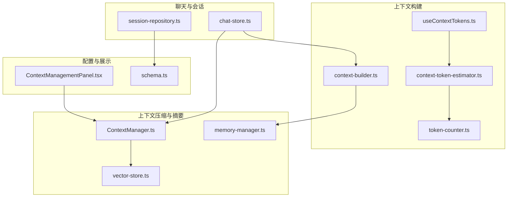
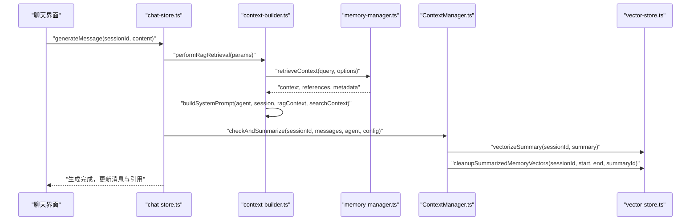
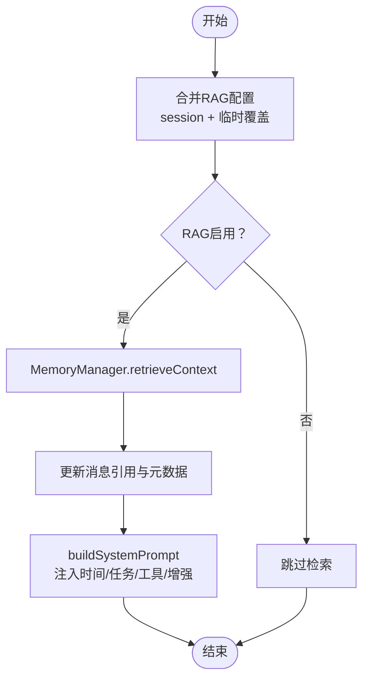
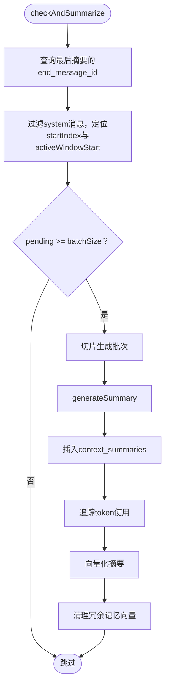
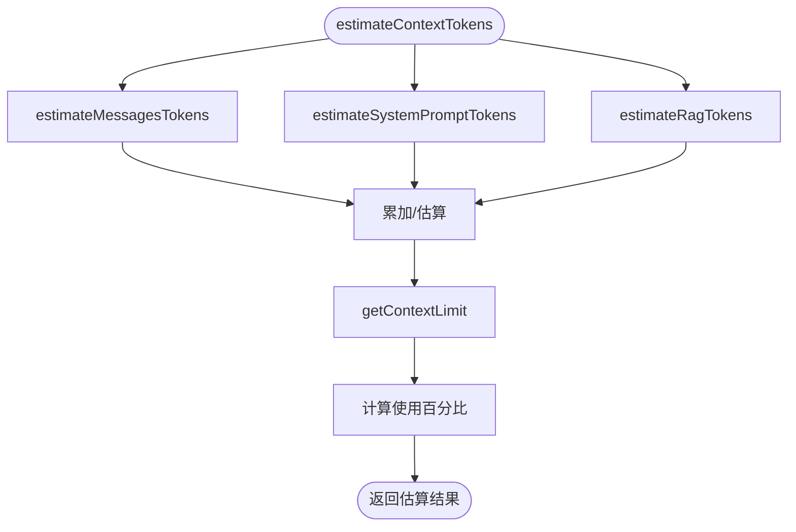
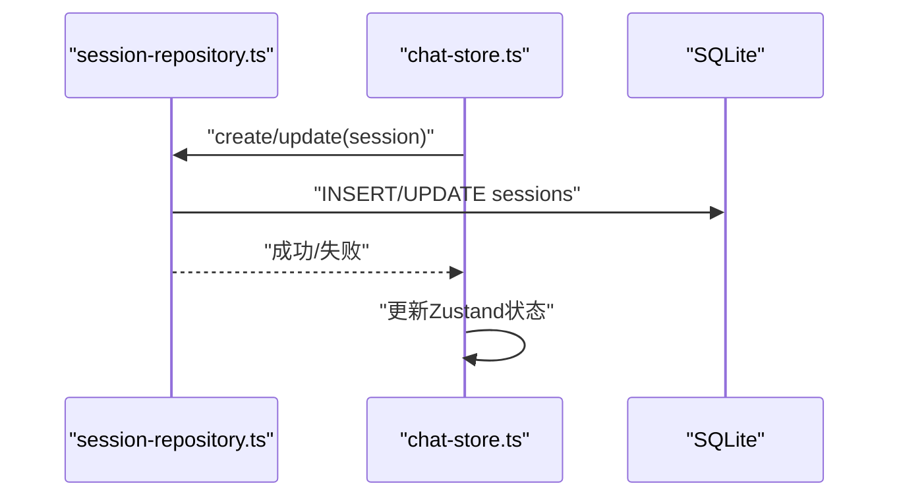
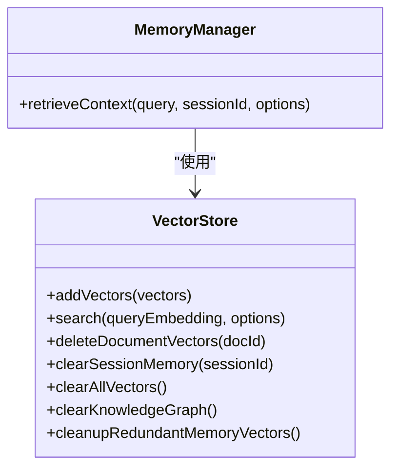
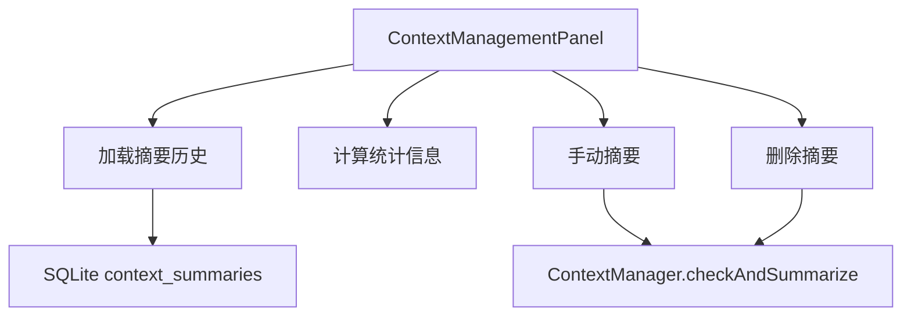
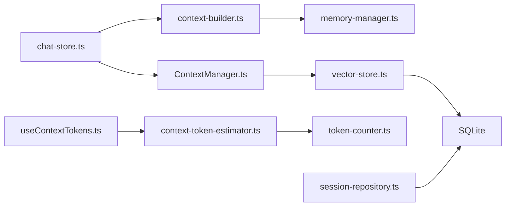

# 上下文管理机制

<cite>
**本文引用的文件**
- [src/store/chat/context-builder.ts](file://src/store/chat/context-builder.ts)
- [src/features/chat/utils/ContextManager.ts](file://src/features/chat/utils/ContextManager.ts)
- [src/features/chat/settings/ContextManagementPanel.tsx](file://src/features/chat/settings/ContextManagementPanel.tsx)
- [src/features/chat/utils/context-token-estimator.ts](file://src/features/chat/utils/context-token-estimator.ts)
- [src/features/chat/hooks/useContextTokens.ts](file://src/features/chat/hooks/useContextTokens.ts)
- [src/store/chat-store.ts](file://src/store/chat-store.ts)
- [src/lib/rag/memory-manager.ts](file://src/lib/rag/memory-manager.ts)
- [src/lib/rag/vector-store.ts](file://src/lib/rag/vector-store.ts)
- [src/lib/db/session-repository.ts](file://src/lib/db/session-repository.ts)
- [src/lib/db/schema.ts](file://src/lib/db/schema.ts)
- [src/features/chat/utils/token-counter.ts](file://src/features/chat/utils/token-counter.ts)
- [app/settings/token-usage.tsx](file://app/settings/token-usage.tsx)
</cite>

## 目录
1. [引言](#引言)
2. [项目结构](#项目结构)
3. [核心组件](#核心组件)
4. [架构总览](#架构总览)
5. [详细组件分析](#详细组件分析)
6. [依赖关系分析](#依赖关系分析)
7. [性能考量](#性能考量)
8. [故障排查指南](#故障排查指南)
9. [结论](#结论)
10. [附录](#附录)

## 引言
本文件系统性阐述 Nexara 代理上下文管理机制，围绕以下目标展开：
- 上下文构建器的工作原理与实现逻辑：上下文窗口大小控制、消息历史管理、重要信息提取
- 上下文压缩与优化算法：摘要生成、关键信息保留、冗余内容过滤
- 上下文管理面板的配置选项：窗口大小设置、记忆策略、性能调优
- 上下文在不同代理间的传递与共享：跨会话上下文保存与恢复
- 性能优化策略与最佳实践：内存管理与处理效率提升

## 项目结构
上下文管理相关代码主要分布在以下模块：
- 上下文构建与系统提示词注入：context-builder.ts
- 上下文压缩与摘要：ContextManager.ts
- 上下文估算与统计：context-token-estimator.ts、useContextTokens.ts、token-counter.ts
- 会话与消息管理：chat-store.ts、session-repository.ts
- 向量化与检索：memory-manager.ts、vector-store.ts
- 配置面板：ContextManagementPanel.tsx
- 数据库模式与表：schema.ts

**图表来源**
- [src/store/chat-store.ts](file://src/store/chat-store.ts)
- [src/store/chat/context-builder.ts](file://src/store/chat/context-builder.ts)
- [src/features/chat/utils/ContextManager.ts](file://src/features/chat/utils/ContextManager.ts)
- [src/lib/rag/memory-manager.ts](file://src/lib/rag/memory-manager.ts)
- [src/lib/rag/vector-store.ts](file://src/lib/rag/vector-store.ts)
- [src/features/chat/utils/context-token-estimator.ts](file://src/features/chat/utils/context-token-estimator.ts)
- [src/features/chat/hooks/useContextTokens.ts](file://src/features/chat/hooks/useContextTokens.ts)
- [src/features/chat/settings/ContextManagementPanel.tsx](file://src/features/chat/settings/ContextManagementPanel.tsx)
- [src/lib/db/schema.ts](file://src/lib/db/schema.ts)

**章节来源**
- [src/store/chat-store.ts](file://src/store/chat-store.ts)
- [src/store/chat/context-builder.ts](file://src/store/chat/context-builder.ts)
- [src/features/chat/utils/ContextManager.ts](file://src/features/chat/utils/ContextManager.ts)
- [src/lib/rag/memory-manager.ts](file://src/lib/rag/memory-manager.ts)
- [src/lib/rag/vector-store.ts](file://src/lib/rag/vector-store.ts)
- [src/features/chat/utils/context-token-estimator.ts](file://src/features/chat/utils/context-token-estimator.ts)
- [src/features/chat/hooks/useContextTokens.ts](file://src/features/chat/hooks/useContextTokens.ts)
- [src/features/chat/settings/ContextManagementPanel.tsx](file://src/features/chat/settings/ContextManagementPanel.tsx)
- [src/lib/db/schema.ts](file://src/lib/db/schema.ts)

## 核心组件
- 上下文构建器：负责 RAG 检索、Web 搜索、系统提示词注入与工具描述注入，形成最终系统提示词
- 上下文管理器：按配置周期性生成摘要、清理冗余向量、提供相关上下文检索
- 上下文估算器：估算消息、系统提示词、RAG 内容的 token 数量，计算使用比例与上下限
- 会话与消息管理：维护会话状态、消息列表、向量化状态，并与数据库同步
- 向量存储与检索：提供向量插入、相似度搜索、清理冗余向量等能力
- 配置面板：提供手动摘要、查看摘要历史、统计信息展示等功能

**章节来源**
- [src/store/chat/context-builder.ts](file://src/store/chat/context-builder.ts)
- [src/features/chat/utils/ContextManager.ts](file://src/features/chat/utils/ContextManager.ts)
- [src/features/chat/utils/context-token-estimator.ts](file://src/features/chat/utils/context-token-estimator.ts)
- [src/features/chat/hooks/useContextTokens.ts](file://src/features/chat/hooks/useContextTokens.ts)
- [src/store/chat-store.ts](file://src/store/chat-store.ts)
- [src/lib/rag/vector-store.ts](file://src/lib/rag/vector-store.ts)
- [src/features/chat/settings/ContextManagementPanel.tsx](file://src/features/chat/settings/ContextManagementPanel.tsx)

## 架构总览
上下文管理贯穿“生成消息”主流程，涉及以下关键步骤：
- 输入与配置合并：合并会话持久化配置与临时覆盖参数
- RAG 检索：根据启用的记忆与文档检索生成上下文
- Web 搜索：在非原生搜索模型场景执行客户端搜索
- 系统提示词构建：注入时间、任务状态、工具描述与模型特定增强
- 摘要与压缩：定期生成摘要、清理冗余向量、保持活跃窗口
- 统计与可视化：估算上下文长度、使用比例与上下限，提供 UI 展示

**图表来源**
- [src/store/chat-store.ts](file://src/store/chat-store.ts)
- [src/store/chat/context-builder.ts](file://src/store/chat/context-builder.ts)
- [src/lib/rag/memory-manager.ts](file://src/lib/rag/memory-manager.ts)
- [src/features/chat/utils/ContextManager.ts](file://src/features/chat/utils/ContextManager.ts)
- [src/lib/rag/vector-store.ts](file://src/lib/rag/vector-store.ts)

## 详细组件分析

### 上下文构建器（ContextBuilder）
- 参数与结果
  - 参数包含会话、代理、提供方、RAG 选项、进度回调与消息更新回调
  - 结果包含搜索上下文、RAG 上下文、引用、引用计数与最终系统提示词
- RAG 检索流程
  - 合并会话与临时 RAG 配置，支持全局/局部检索、文档与记忆开关
  - 触发检索阶段状态更新，调用 MemoryManager 执行检索
  - 将引用与元数据写入消息，更新 RAG 处理状态
- Web 搜索
  - 非原生搜索模型时执行客户端搜索，返回上下文与来源
- 系统提示词构建
  - 优先注入时间与任务状态，再注入工具描述与模型特定增强
  - 支持本地化提示词与工具 Schema 描述，按模型能力注入输出指导

**图表来源**
- [src/store/chat/context-builder.ts](file://src/store/chat/context-builder.ts)
- [src/lib/rag/memory-manager.ts](file://src/lib/rag/memory-manager.ts)

**章节来源**
- [src/store/chat/context-builder.ts](file://src/store/chat/context-builder.ts)

### 上下文管理器（ContextManager）
- 摘要检查与生成
  - 基于“活跃窗口大小”与“摘要批次大小”判断是否需要摘要
  - 识别未摘要消息区间，按批次生成摘要，存储到数据库并追踪 token 使用
  - 向量化摘要并清理对应范围内的冗余记忆向量
- 相关上下文检索
  - 从摘要表按会话检索最新摘要内容，用于系统提示词或上下文注入
- 截断与窗口控制
  - 提供按最大消息数截断的工具方法，配合活跃窗口策略

**图表来源**
- [src/features/chat/utils/ContextManager.ts](file://src/features/chat/utils/ContextManager.ts)
- [src/lib/rag/vector-store.ts](file://src/lib/rag/vector-store.ts)

**章节来源**
- [src/features/chat/utils/ContextManager.ts](file://src/features/chat/utils/ContextManager.ts)

### 上下文估算与统计（context-token-estimator 与 useContextTokens）
- 估算维度
  - 历史消息 token：累加每条消息的输入/输出 token，或估算内容与 reasoning
  - 系统提示词 token：累加 agent.systemPrompt、customPrompt 与工具描述预留开销
  - RAG 检索内容 token：从最近助手消息的 ragReferences 中估算
- 上下文上限
  - 优先使用模型配置的 contextLength，其次从 MODEL_SPECS 获取默认值，兜底为 4096
- Hook 与 UI
  - useContextTokens 提供 memo 化估算与格式化显示，useContextLimit 仅获取上限
  - UI 层可结合 StatsPanel 与 ChatInputTopBar 展示上下文使用情况

**图表来源**
- [src/features/chat/utils/context-token-estimator.ts](file://src/features/chat/utils/context-token-estimator.ts)
- [src/features/chat/hooks/useContextTokens.ts](file://src/features/chat/hooks/useContextTokens.ts)
- [src/features/chat/utils/token-counter.ts](file://src/features/chat/utils/token-counter.ts)

**章节来源**
- [src/features/chat/utils/context-token-estimator.ts](file://src/features/chat/utils/context-token-estimator.ts)
- [src/features/chat/hooks/useContextTokens.ts](file://src/features/chat/hooks/useContextTokens.ts)
- [src/features/chat/utils/token-counter.ts](file://src/features/chat/utils/token-counter.ts)

### 会话与消息管理（chat-store 与 session-repository）
- 会话双写模式
  - 新增/更新会话时同时写入 SQLite 与 Zustand 状态，保证持久化与运行态一致性
  - 自动补齐缺失列，确保 schema 兼容性
- 消息与向量化状态
  - 加载会话消息时，基于向量表标记消息归档状态与向量化状态
- 生成消息主流程
  - 调用 ContextBuilder 与 ContextManager，更新消息内容与引用，处理后处理与统计

**图表来源**
- [src/store/chat-store.ts](file://src/store/chat-store.ts)
- [src/lib/db/session-repository.ts](file://src/lib/db/session-repository.ts)

**章节来源**
- [src/store/chat-store.ts](file://src/store/chat-store.ts)
- [src/lib/db/session-repository.ts](file://src/lib/db/session-repository.ts)

### 向量存储与检索（memory-manager 与 vector-store）
- 向量存储
  - 批量插入向量，支持会话/文档维度，记录 metadata、消息范围字段
- 检索与清理
  - 基于余弦相似度检索，支持过滤条件与阈值
  - 提供清理冗余记忆向量能力，按摘要范围精确删除
- RAG 流程
  - MemoryManager 负责查询重写、嵌入、检索与引用聚合，支持进度回调

**图表来源**
- [src/lib/rag/vector-store.ts](file://src/lib/rag/vector-store.ts)
- [src/lib/rag/memory-manager.ts](file://src/lib/rag/memory-manager.ts)

**章节来源**
- [src/lib/rag/vector-store.ts](file://src/lib/rag/vector-store.ts)
- [src/lib/rag/memory-manager.ts](file://src/lib/rag/memory-manager.ts)

### 上下文管理面板（ContextManagementPanel）
- 功能概览
  - 加载摘要历史、统计活跃消息与归档数量、手动触发摘要、删除摘要
  - 展示 token 使用统计与上下文使用条形图
- 数据来源
  - 通过 ContextManager 与数据库交互，映射行到摘要对象
  - 统计 activeMessages、archivedMessages、summarizedCount

**图表来源**
- [src/features/chat/settings/ContextManagementPanel.tsx](file://src/features/chat/settings/ContextManagementPanel.tsx)
- [src/features/chat/utils/ContextManager.ts](file://src/features/chat/utils/ContextManager.ts)

**章节来源**
- [src/features/chat/settings/ContextManagementPanel.tsx](file://src/features/chat/settings/ContextManagementPanel.tsx)

## 依赖关系分析
- 组件耦合
  - chat-store 作为中枢协调 ContextBuilder、ContextManager、MemoryManager
  - ContextManager 依赖 vector-store 与数据库，实现摘要向量化与冗余清理
  - useContextTokens 依赖 context-token-estimator 与 token-counter，提供 UI 所需的估算与格式化
- 外部依赖
  - SQLite：会话、消息、摘要、向量等持久化
  - 向量搜索原生模块：加速相似度计算
  - API 提供商与模型：用于摘要与检索的 LLM/Embedding 调用

**图表来源**
- [src/store/chat-store.ts](file://src/store/chat-store.ts)
- [src/store/chat/context-builder.ts](file://src/store/chat/context-builder.ts)
- [src/features/chat/utils/ContextManager.ts](file://src/features/chat/utils/ContextManager.ts)
- [src/lib/rag/memory-manager.ts](file://src/lib/rag/memory-manager.ts)
- [src/lib/rag/vector-store.ts](file://src/lib/rag/vector-store.ts)
- [src/features/chat/hooks/useContextTokens.ts](file://src/features/chat/hooks/useContextTokens.ts)
- [src/features/chat/utils/context-token-estimator.ts](file://src/features/chat/utils/context-token-estimator.ts)
- [src/features/chat/utils/token-counter.ts](file://src/features/chat/utils/token-counter.ts)
- [src/lib/db/session-repository.ts](file://src/lib/db/session-repository.ts)

**章节来源**
- [src/store/chat-store.ts](file://src/store/chat-store.ts)
- [src/features/chat/utils/context-token-estimator.ts](file://src/features/chat/utils/context-token-estimator.ts)
- [src/features/chat/hooks/useContextTokens.ts](file://src/features/chat/hooks/useContextTokens.ts)
- [src/lib/rag/vector-store.ts](file://src/lib/rag/vector-store.ts)
- [src/lib/db/session-repository.ts](file://src/lib/db/session-repository.ts)

## 性能考量
- 估算与缓存
  - useContextTokens 使用 useMemo 对估算与格式化进行缓存，避免重复计算
  - token 估算采用启发式规则，兼顾准确性与性能
- 摘要与向量清理
  - 摘要生成后清理对应范围内的冗余记忆向量，降低向量库规模与检索成本
  - 向量批量插入与事务提交减少 IO 开销
- 检索优化
  - 向量检索支持阈值与过滤，避免无关文档参与排序
  - 查询重写阶段增加变体数量上限，平衡召回与延迟
- UI 响应
  - 摘要与检索流程中使用微任务让出线程，保证 UI 不阻塞
  - 进度回调驱动 UI 实时反馈

**章节来源**
- [src/features/chat/hooks/useContextTokens.ts](file://src/features/chat/hooks/useContextTokens.ts)
- [src/features/chat/utils/context-token-estimator.ts](file://src/features/chat/utils/context-token-estimator.ts)
- [src/features/chat/utils/ContextManager.ts](file://src/features/chat/utils/ContextManager.ts)
- [src/lib/rag/vector-store.ts](file://src/lib/rag/vector-store.ts)
- [src/lib/rag/memory-manager.ts](file://src/lib/rag/memory-manager.ts)

## 故障排查指南
- 摘要失败
  - 检查摘要模型 ID 是否在提供商模型列表中，若不存在或报错将触发回退
  - 查看 token 使用追踪与错误日志，确认是否为模型不可用或配额问题
- 冗余向量未清理
  - 确认摘要范围字段（start/end_message_id）是否正确写入
  - 检查清理函数执行日志与受影响行数
- RAG 检索无结果
  - 确认 RAG 启用状态、文档授权范围与查询重写开关
  - 检查嵌入模型配置与向量库是否为空
- 会话持久化异常
  - 检查 session-repository 的列补齐逻辑与外键约束
  - 确认 SQLite 表结构与 schema 版本一致

**章节来源**
- [src/features/chat/utils/ContextManager.ts](file://src/features/chat/utils/ContextManager.ts)
- [src/lib/rag/vector-store.ts](file://src/lib/rag/vector-store.ts)
- [src/lib/db/session-repository.ts](file://src/lib/db/session-repository.ts)
- [src/lib/db/schema.ts](file://src/lib/db/schema.ts)

## 结论
Nexara 的上下文管理机制通过“构建—检索—压缩—统计—持久化”的闭环，实现了对长上下文的有效控制与优化。ContextBuilder 负责将多源上下文整合为系统提示词；ContextManager 通过摘要与向量清理降低冗余；context-token-estimator 与 useContextTokens 提供实时估算与 UI 展示；chat-store 与 session-repository 确保状态一致性与持久化。整体设计在性能与可用性之间取得平衡，具备良好的扩展性与可维护性。

## 附录
- 配置项参考
  - 上下文窗口大小：来自 RAG 配置的 contextWindow
  - 摘要批次大小：来自 summaryThreshold
  - 摘要模型：defaultSummaryModel 或回退模型
  - 嵌入模型：defaultEmbeddingModel
- 最佳实践
  - 合理设置上下文窗口与摘要阈值，避免频繁摘要
  - 启用查询重写提升检索质量
  - 定期清理冗余向量，保持向量库健康
  - 使用 useContextTokens 监控上下文使用，避免接近上限