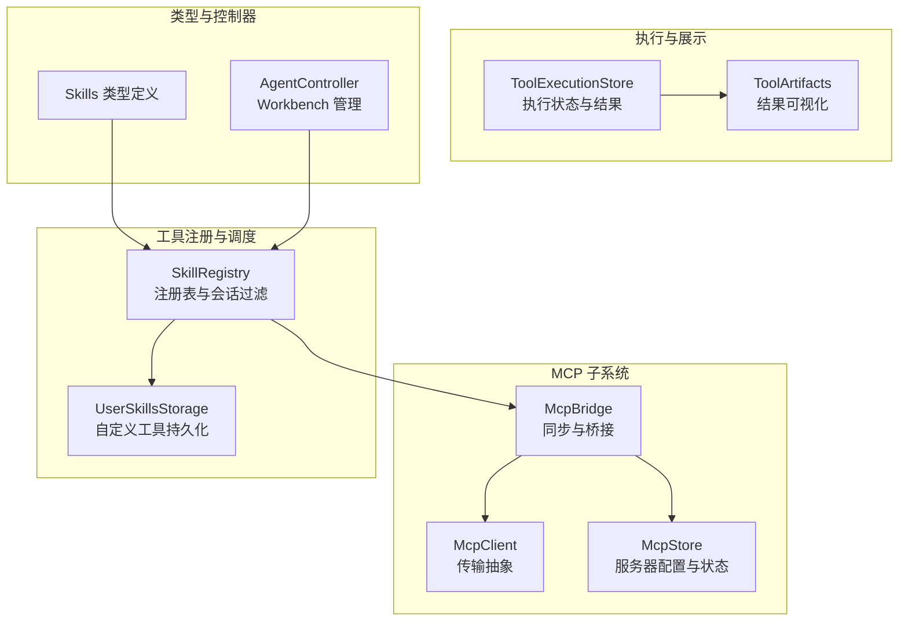
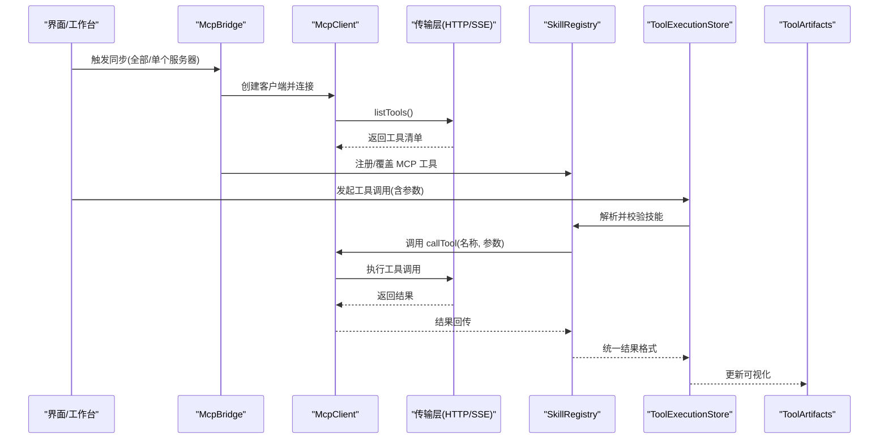
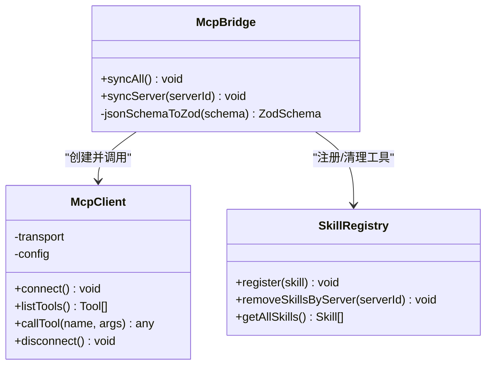
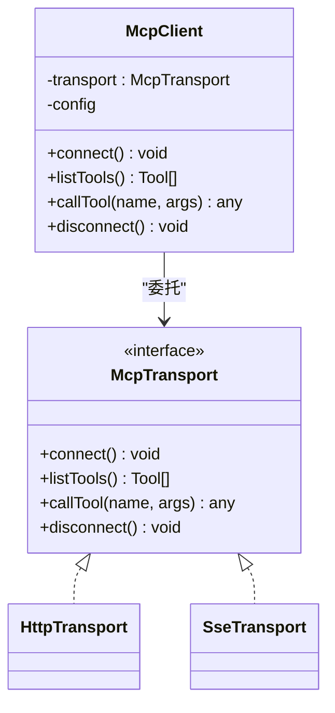
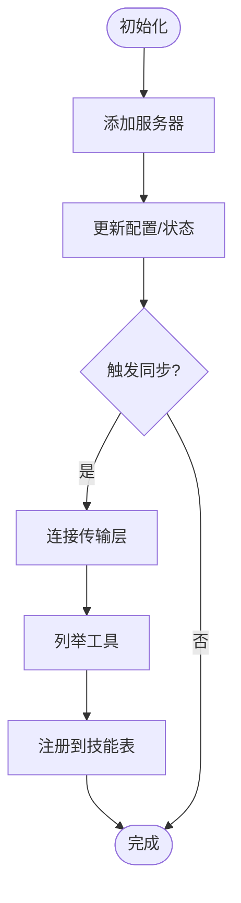
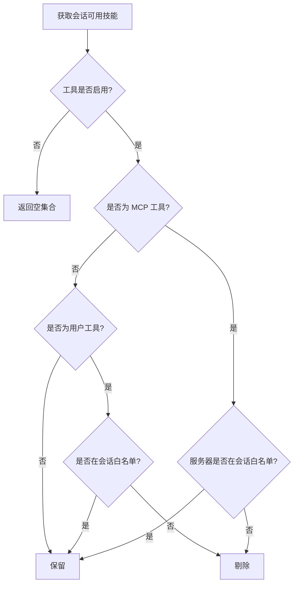
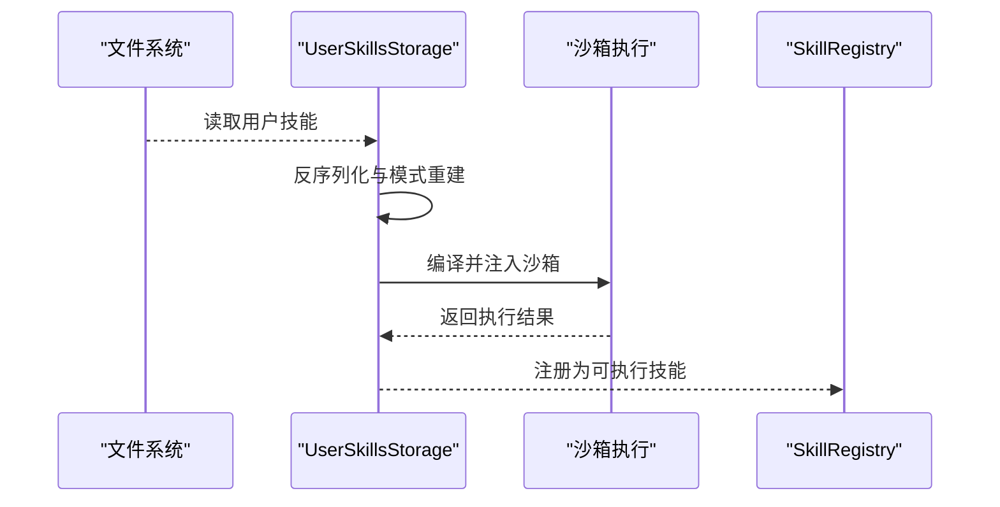
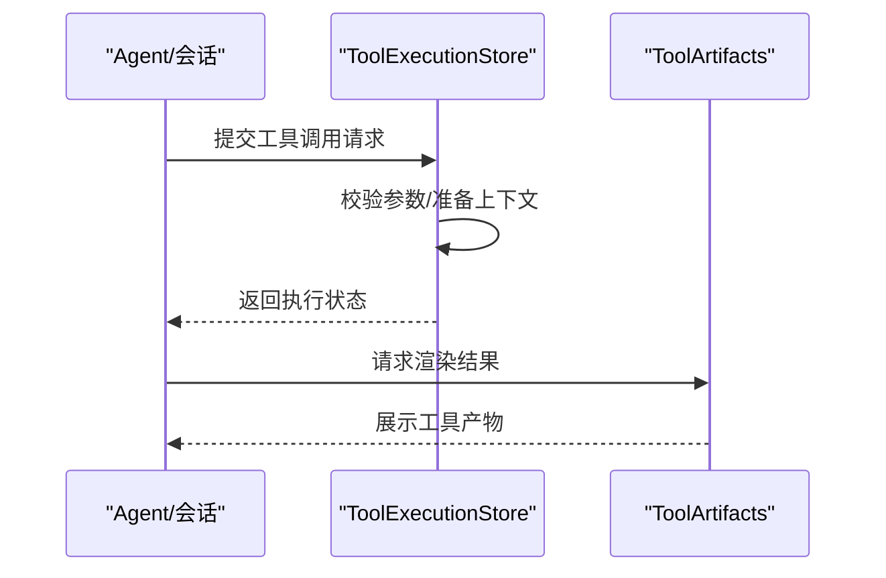
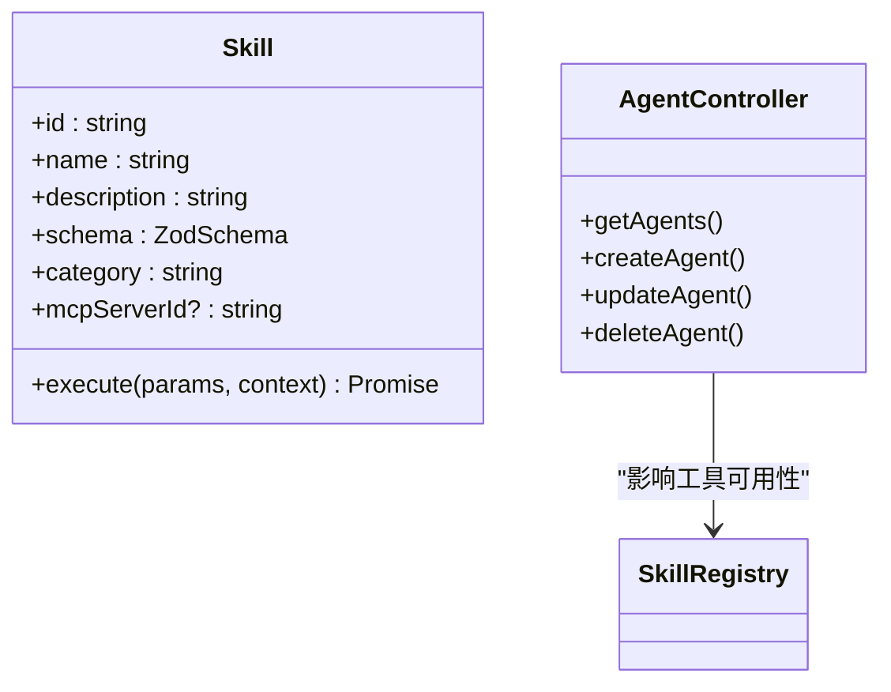
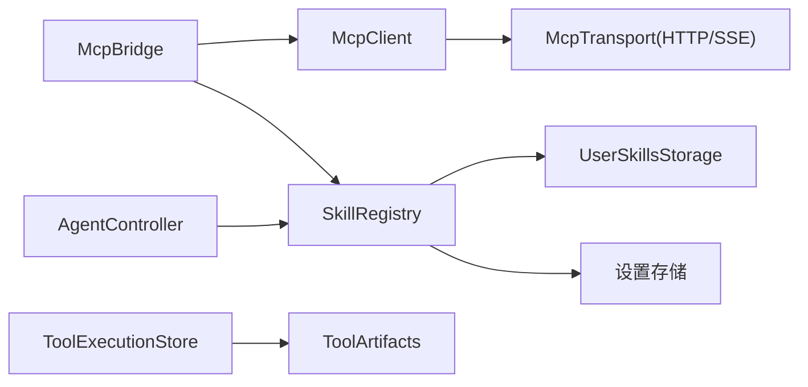

# 代理工具集成

<cite>
**本文引用的文件**
- [README.md](file://README.md)
- [mcp-bridge.ts](file://src/lib/mcp/mcp-bridge.ts)
- [mcp-client.ts](file://src/lib/mcp/mcp-client.ts)
- [mcp-store.ts](file://src/store/mcp-store.ts)
- [registry.ts](file://src/lib/skills/registry.ts)
- [storage.ts](file://src/lib/skills/storage.ts)
- [skills.ts](file://src/types/skills.ts)
- [tool-execution.ts](file://src/store/chat/tool-execution.ts)
- [ToolArtifacts.tsx](file://src/features/chat/components/ToolArtifacts.tsx)
- [AgentController.ts](file://src/services/workbench/controllers/AgentController.ts)
</cite>

## 目录
1. [简介](#简介)
2. [项目结构](#项目结构)
3. [核心组件](#核心组件)
4. [架构总览](#架构总览)
5. [详细组件分析](#详细组件分析)
6. [依赖关系分析](#依赖关系分析)
7. [性能考量](#性能考量)
8. [故障排查指南](#故障排查指南)
9. [结论](#结论)
10. [附录](#附录)

## 简介
本文件面向 Nexara 代理工具集集成，系统性阐述其架构设计与集成机制，覆盖本地工具、MCP 工具与外部 API 的统一管理；深入解析工具执行流程与调度机制（工具发现、参数验证、执行监控、结果处理）；说明权限管理与安全控制（访问控制、资源限制、错误隔离）；解释工具链的组合与编排策略（多工具协同、条件执行、结果合并）；并提供开发指南与最佳实践（自定义工具开发、性能优化、调试技巧）。  
项目 README 提供了整体背景与能力概览，包括多提供商对话、RAG 引擎、Agent 系统、MCP 协议、本地推理、Workbench 实验性功能等。

**章节来源**
- [README.md:10-46](file://README.md#L10-L46)
- [README.md:82-118](file://README.md#L82-L118)

## 项目结构
围绕代理工具集成的关键目录与文件：
- MCP 通信与桥接：src/lib/mcp/* 与 src/store/mcp-store.ts
- 工具注册与调度：src/lib/skills/*
- 工具执行与结果展示：src/store/chat/tool-execution.ts 与 src/features/chat/components/ToolArtifacts.tsx
- 工具类型定义：src/types/skills.ts
- Workbench Agent 管理：src/services/workbench/controllers/AgentController.ts

**图表来源**
- [mcp-bridge.ts:10-129](file://src/lib/mcp/mcp-bridge.ts#L10-L129)
- [mcp-client.ts:6-51](file://src/lib/mcp/mcp-client.ts#L6-L51)
- [mcp-store.ts:6-71](file://src/store/mcp-store.ts#L6-L71)
- [registry.ts:8-186](file://src/lib/skills/registry.ts#L8-L186)
- [storage.ts:24-151](file://src/lib/skills/storage.ts#L24-L151)
- [tool-execution.ts](file://src/store/chat/tool-execution.ts)
- [ToolArtifacts.tsx](file://src/features/chat/components/ToolArtifacts.tsx)
- [skills.ts](file://src/types/skills.ts)
- [AgentController.ts:4-47](file://src/services/workbench/controllers/AgentController.ts#L4-L47)

**章节来源**
- [mcp-bridge.ts:1-202](file://src/lib/mcp/mcp-bridge.ts#L1-L202)
- [mcp-client.ts:1-52](file://src/lib/mcp/mcp-client.ts#L1-L52)
- [mcp-store.ts:1-72](file://src/store/mcp-store.ts#L1-L72)
- [registry.ts:1-189](file://src/lib/skills/registry.ts#L1-L189)
- [storage.ts:1-152](file://src/lib/skills/storage.ts#L1-L152)
- [tool-execution.ts](file://src/store/chat/tool-execution.ts)
- [ToolArtifacts.tsx](file://src/features/chat/components/ToolArtifacts.tsx)
- [skills.ts](file://src/types/skills.ts)
- [AgentController.ts:1-48](file://src/services/workbench/controllers/AgentController.ts#L1-L48)

## 核心组件
- MCP 桥接器（McpBridge）：负责将外部 MCP 服务器的工具清单同步至本地技能注册表，执行参数强制转换与调用封装，并维护服务器状态。
- MCP 客户端（McpClient）：封装传输层抽象（HTTP/SSE），提供 listTools 与 callTool 能力。
- MCP 存储（McpStore）：持久化管理 MCP 服务器配置、状态与调用节流等元信息。
- 技能注册表（SkillRegistry）：集中注册与管理本地工具、MCP 工具与自定义工具，支持按会话过滤与动态重载。
- 用户技能存储（UserSkillsStorage）：以文件系统持久化自定义工具，提供安全沙箱执行与默认参数合并。
- 工具执行与结果（ToolExecutionStore 与 ToolArtifacts）：记录执行状态、聚合结果并可视化呈现。
- 类型与控制器：Skills 类型定义与 Workbench Agent 控制器用于管理代理与工具集合。

**章节来源**
- [mcp-bridge.ts:10-129](file://src/lib/mcp/mcp-bridge.ts#L10-L129)
- [mcp-client.ts:6-51](file://src/lib/mcp/mcp-client.ts#L6-L51)
- [mcp-store.ts:6-71](file://src/store/mcp-store.ts#L6-L71)
- [registry.ts:8-186](file://src/lib/skills/registry.ts#L8-L186)
- [storage.ts:24-151](file://src/lib/skills/storage.ts#L24-L151)
- [tool-execution.ts](file://src/store/chat/tool-execution.ts)
- [ToolArtifacts.tsx](file://src/features/chat/components/ToolArtifacts.tsx)
- [skills.ts](file://src/types/skills.ts)
- [AgentController.ts:4-47](file://src/services/workbench/controllers/AgentController.ts#L4-L47)

## 架构总览
下图展示了从 MCP 服务器到本地技能注册表、再到工具执行与结果可视化的全链路：

**图表来源**
- [mcp-bridge.ts:14-129](file://src/lib/mcp/mcp-bridge.ts#L14-L129)
- [mcp-client.ts:33-43](file://src/lib/mcp/mcp-client.ts#L33-L43)
- [registry.ts:41-59](file://src/lib/skills/registry.ts#L41-L59)
- [tool-execution.ts](file://src/store/chat/tool-execution.ts)
- [ToolArtifacts.tsx](file://src/features/chat/components/ToolArtifacts.tsx)

## 详细组件分析

### MCP 桥接器（McpBridge）
职责与特性：
- 同步策略：支持全量同步与单服务器同步；对禁用或不存在的服务器进行清理。
- 工具转换：将外部工具输入模式（JSON Schema）转换为 Zod 校验器，提升参数验证可靠性。
- 执行封装：对 MCP 工具包装为本地 Skill，内置参数强制转换（如对象转字符串）、即时连接/断开的无状态执行模式。
- 状态管理：通过 useMcpStore 更新服务器状态（连接中/已连接/错误/加载）。

**图表来源**
- [mcp-bridge.ts:10-129](file://src/lib/mcp/mcp-bridge.ts#L10-L129)
- [mcp-client.ts:6-51](file://src/lib/mcp/mcp-client.ts#L6-L51)
- [registry.ts:41-109](file://src/lib/skills/registry.ts#L41-L109)

**章节来源**
- [mcp-bridge.ts:14-129](file://src/lib/mcp/mcp-bridge.ts#L14-L129)
- [mcp-bridge.ts:135-200](file://src/lib/mcp/mcp-bridge.ts#L135-L200)

### MCP 客户端与传输层（McpClient）
- 传输抽象：根据配置选择 HTTP 或 SSE 传输，统一 listTools 与 callTool 接口。
- 生命周期：显式 connect/disconnect，确保连接复用与及时释放。
- 错误隔离：调用失败时上抛异常，便于桥接器捕获并更新状态。

**图表来源**
- [mcp-client.ts:6-51](file://src/lib/mcp/mcp-client.ts#L6-L51)
- [mcp-client.ts:3-4](file://src/lib/mcp/mcp-client.ts#L3-L4)

**章节来源**
- [mcp-client.ts:6-51](file://src/lib/mcp/mcp-client.ts#L6-L51)

### MCP 存储（McpStore）
- 配置项：服务器 ID、名称、URL、传输类型、启用状态、默认包含、最后同步时间、状态与错误信息、调用节流与上次调用时间。
- 状态机：connected/disconnected/error/loading，支持错误清空与状态联动。
- 持久化：基于 AsyncStorage 的 zustand/persist。

**图表来源**
- [mcp-store.ts:32-71](file://src/store/mcp-store.ts#L32-L71)

**章节来源**
- [mcp-store.ts:6-71](file://src/store/mcp-store.ts#L6-L71)

### 技能注册表（SkillRegistry）
- 注册与查找：支持按 ID 与名称查找；覆盖注册。
- 用户技能：延迟加载用户自定义工具，支持重载。
- 过滤策略：按会话维度过滤（MCP 服务器白名单、自定义工具白名单、全局开关、原生网络搜索开关）。
- 动态管理：按服务器批量删除工具，便于断开或切换。

**图表来源**
- [registry.ts:130-172](file://src/lib/skills/registry.ts#L130-L172)

**章节来源**
- [registry.ts:8-186](file://src/lib/skills/registry.ts#L8-L186)

### 用户技能存储（UserSkillsStorage）
- 持久化：文件系统存储，支持增删改查。
- 水合执行：将存储的代码与模式转换为可执行 Skill，提供默认参数合并与沙箱执行。
- 安全控制：通过 new Function 构造函数注入 console/fetch，避免全局污染；捕获编译与运行时错误并返回结构化结果。

**图表来源**
- [storage.ts:26-151](file://src/lib/skills/storage.ts#L26-L151)

**章节来源**
- [storage.ts:24-151](file://src/lib/skills/storage.ts#L24-L151)

### 工具执行与结果可视化
- 执行状态：ToolExecutionStore 记录每次调用的状态、内容与数据。
- 结果处理：统一将字符串或对象序列化为可展示内容。
- 可视化：ToolArtifacts 根据执行结果渲染工具产物（文本、图表、Mermaid 等）。

**图表来源**
- [tool-execution.ts](file://src/store/chat/tool-execution.ts)
- [ToolArtifacts.tsx](file://src/features/chat/components/ToolArtifacts.tsx)

**章节来源**
- [tool-execution.ts](file://src/store/chat/tool-execution.ts)
- [ToolArtifacts.tsx](file://src/features/chat/components/ToolArtifacts.tsx)

### 类型与控制器
- Skills 类型定义：规范工具的标识、名称、描述、模式、执行函数与分类等。
- AgentController：Workbench 管理端点，提供 Agent 的增删改查，作为工具集合与会话配置的入口之一。

**图表来源**
- [skills.ts](file://src/types/skills.ts)
- [AgentController.ts:4-47](file://src/services/workbench/controllers/AgentController.ts#L4-L47)

**章节来源**
- [skills.ts](file://src/types/skills.ts)
- [AgentController.ts:1-48](file://src/services/workbench/controllers/AgentController.ts#L1-L48)

## 依赖关系分析
- 组件耦合：
  - McpBridge 依赖 McpClient 与 SkillRegistry；McpClient 依赖传输层接口。
  - SkillRegistry 依赖设置存储与用户技能存储，提供过滤与动态重载。
  - ToolExecutionStore 与 ToolArtifacts 依赖执行结果与渲染组件。
- 外部依赖：
  - AsyncStorage（zustand/persist）用于 MCP 配置持久化。
  - 文件系统用于用户技能持久化。
  - 传输层（HTTP/SSE）用于与外部 MCP 服务器通信。

**图表来源**
- [mcp-bridge.ts:10-129](file://src/lib/mcp/mcp-bridge.ts#L10-L129)
- [mcp-client.ts:6-51](file://src/lib/mcp/mcp-client.ts#L6-L51)
- [registry.ts:8-186](file://src/lib/skills/registry.ts#L8-L186)
- [storage.ts:24-151](file://src/lib/skills/storage.ts#L24-L151)
- [tool-execution.ts](file://src/store/chat/tool-execution.ts)
- [ToolArtifacts.tsx](file://src/features/chat/components/ToolArtifacts.tsx)
- [AgentController.ts:4-47](file://src/services/workbench/controllers/AgentController.ts#L4-L47)

**章节来源**
- [mcp-bridge.ts:1-202](file://src/lib/mcp/mcp-bridge.ts#L1-L202)
- [mcp-client.ts:1-52](file://src/lib/mcp/mcp-client.ts#L1-L52)
- [registry.ts:1-189](file://src/lib/skills/registry.ts#L1-L189)
- [storage.ts:1-152](file://src/lib/skills/storage.ts#L1-L152)
- [tool-execution.ts](file://src/store/chat/tool-execution.ts)
- [ToolArtifacts.tsx](file://src/features/chat/components/ToolArtifacts.tsx)
- [AgentController.ts:1-48](file://src/services/workbench/controllers/AgentController.ts#L1-L48)

## 性能考量
- 连接策略：McpBridge 在执行单次工具调用时采用即时连接/断开的无状态模式，降低长连接维护成本，适合原子工具调用场景。
- 参数转换：在调用前进行 Schema 驱动的参数强制转换，减少无效请求与服务端错误重试。
- 同步覆盖：同步前先清理旧工具，避免注册表膨胀与冲突。
- 会话过滤：SkillRegistry 的会话级过滤减少不必要的工具扫描与渲染。
- 存储与持久化：McpStore 使用 zustand/persist 与 AsyncStorage，注意在高频变更场景下的写入节流与批处理。

[本节为通用性能建议，不直接分析具体文件，故无章节来源]

## 故障排查指南
- MCP 同步失败：
  - 检查服务器状态与错误信息（McpStore 的 status 与 error 字段）。
  - 确认传输类型（HTTP/SSE）与 URL 正确性。
  - 查看桥接器日志与 finally 分支的断开逻辑。
- 工具执行错误：
  - 检查参数是否符合 Zod 模式；必要时在桥接器中增加更严格的参数校验。
  - 查看用户自定义工具的编译与运行时错误（UserSkillsStorage 的错误回传）。
- 结果未显示：
  - 确认 ToolExecutionStore 是否正确更新状态与数据。
  - 检查 ToolArtifacts 的渲染分支与数据结构。

**章节来源**
- [mcp-bridge.ts:121-128](file://src/lib/mcp/mcp-bridge.ts#L121-L128)
- [mcp-store.ts:53-64](file://src/store/mcp-store.ts#L53-L64)
- [storage.ts:141-147](file://src/lib/skills/storage.ts#L141-L147)
- [tool-execution.ts](file://src/store/chat/tool-execution.ts)
- [ToolArtifacts.tsx](file://src/features/chat/components/ToolArtifacts.tsx)

## 结论
Nexara 的代理工具集成通过 McpBridge/McpClient/McpStore 形成稳定的 MCP 工具桥接闭环，结合 SkillRegistry 的统一注册与会话过滤，实现了本地工具、MCP 工具与自定义工具的统一管理。执行路径清晰、状态可控、错误隔离完善，具备良好的扩展性与可维护性。后续可在参数校验、连接池复用、会话级并发控制与可视化渲染等方面进一步优化。

[本节为总结性内容，不直接分析具体文件，故无章节来源]

## 附录

### 工具权限与安全控制
- 访问控制：
  - 会话级白名单：仅允许指定 MCP 服务器与自定义工具参与本次会话。
  - 全局开关：通过设置存储控制工具启用状态。
- 资源限制：
  - 调用节流：McpStore 支持 callInterval 与 lastCallTimestamp，可用于限速。
  - 连接生命周期：即时连接/断开，避免长连接占用。
- 错误隔离：
  - 传输层异常：McpBridge 捕获并标记服务器状态。
  - 自定义工具：编译与运行时错误通过结构化结果返回，避免崩溃传播。

**章节来源**
- [registry.ts:130-172](file://src/lib/skills/registry.ts#L130-L172)
- [mcp-store.ts:16-17](file://src/store/mcp-store.ts#L16-L17)
- [mcp-bridge.ts:121-128](file://src/lib/mcp/mcp-bridge.ts#L121-L128)
- [storage.ts:141-147](file://src/lib/skills/storage.ts#L141-L147)

### 工具链组合与编排策略
- 多工具协同：通过会话过滤与工具集合配置，将多个工具按顺序或并行组合。
- 条件执行：依据会话选项（如原生网络搜索开关）动态裁剪工具集。
- 结果合并：ToolExecutionStore 统一结果格式，ToolArtifacts 负责渲染与展示。

**章节来源**
- [registry.ts:130-172](file://src/lib/skills/registry.ts#L130-L172)
- [tool-execution.ts](file://src/store/chat/tool-execution.ts)
- [ToolArtifacts.tsx](file://src/features/chat/components/ToolArtifacts.tsx)

### 开发指南与最佳实践
- 自定义工具开发：
  - 使用 UserSkillsStorage 的存储接口保存工具定义与默认参数。
  - 通过 Zod 模式严格约束输入参数，提升执行稳定性。
- 性能优化：
  - 优先使用即时连接模式；对高频调用考虑连接复用与批量请求。
  - 在会话过滤阶段尽早剔除不必要工具，减少渲染压力。
- 调试技巧：
  - 利用 McpBridge 与 UserSkillsStorage 的日志输出定位问题。
  - 在 ToolArtifacts 中增加占位与错误态渲染，快速定位执行失败原因。

**章节来源**
- [storage.ts:26-151](file://src/lib/skills/storage.ts#L26-L151)
- [mcp-bridge.ts:14-129](file://src/lib/mcp/mcp-bridge.ts#L14-L129)
- [registry.ts:130-172](file://src/lib/skills/registry.ts#L130-L172)
- [ToolArtifacts.tsx](file://src/features/chat/components/ToolArtifacts.tsx)