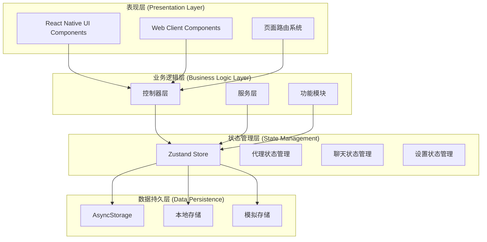
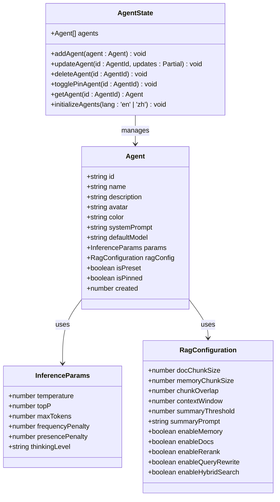
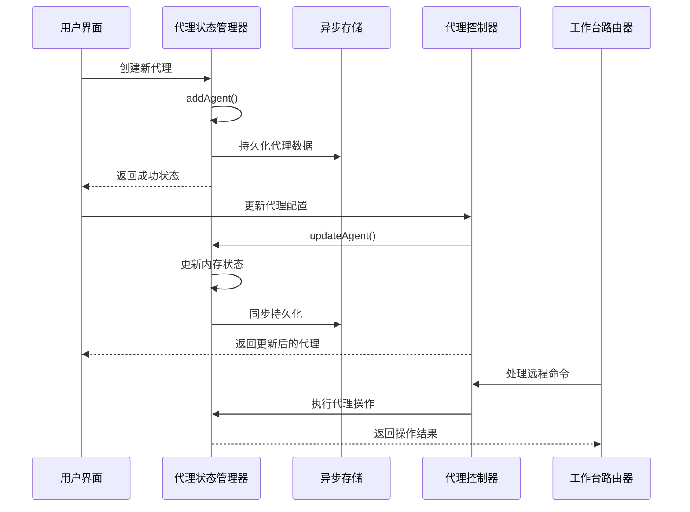
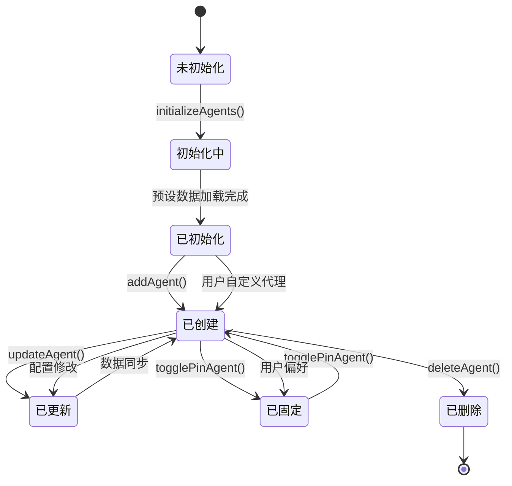
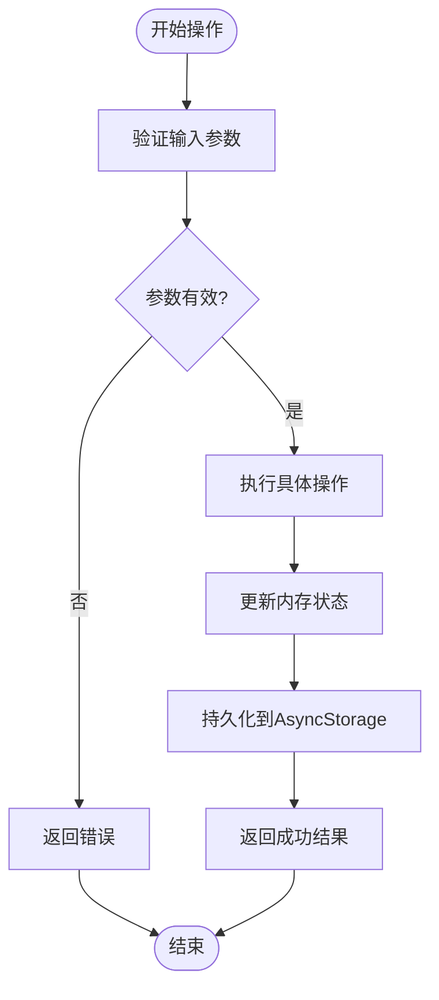
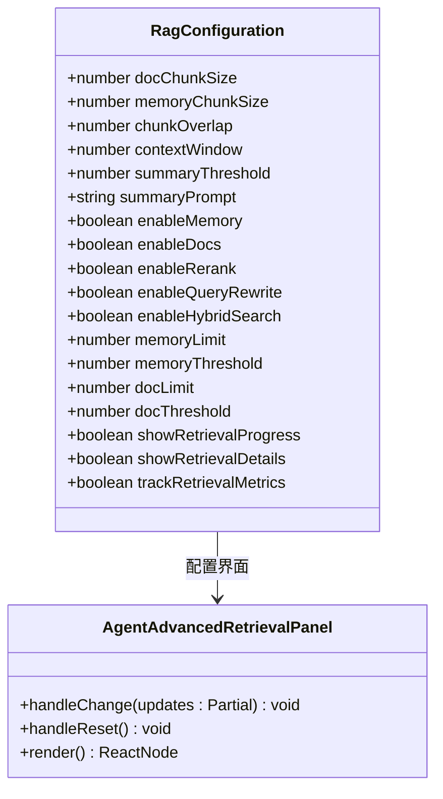
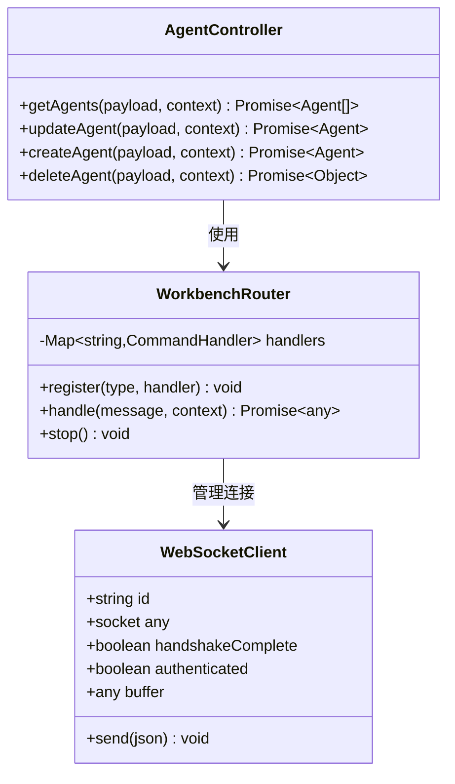

# 代理架构设计

<cite>
**本文档引用的文件**
- [src/store/agent-store.ts](file://src/store/agent-store.ts)
- [src/types/chat.ts](file://src/types/chat.ts)
- [src/lib/agent-presets.ts](file://src/lib/agent-presets.ts)
- [src/services/workbench/controllers/AgentController.ts](file://src/services/workbench/controllers/AgentController.ts)
- [src/services/workbench/WorkbenchRouter.ts](file://src/services/workbench/WorkbenchRouter.ts)
- [app/chat/agent/[agentId].tsx](file://app/chat/agent/[agentId].tsx)
- [app/chat/agent/edit/[agentId].tsx](file://app/chat/agent/edit/[agentId].tsx)
- [src/features/settings/components/AgentAdvancedRetrievalPanel.tsx](file://src/features/settings/components/AgentAdvancedRetrievalPanel.tsx)
- [app/welcome.tsx](file://app/welcome.tsx)
- [scripts/mocks/async-storage.ts](file://scripts/mocks/async-storage.ts)
</cite>

## 目录
1. [简介](#简介)
2. [项目结构](#项目结构)
3. [核心组件](#核心组件)
4. [架构概览](#架构概览)
5. [详细组件分析](#详细组件分析)
6. [依赖关系分析](#依赖关系分析)
7. [性能考虑](#性能考虑)
8. [故障排除指南](#故障排除指南)
9. [结论](#结论)

## 简介

Nexara代理架构是一个基于React Native和Web技术构建的智能助手系统。该架构采用现代化的状态管理模式，结合Zustand状态管理器和AsyncStorage持久化机制，实现了高效的代理管理和数据同步。

本系统的核心设计理念包括：
- **模块化架构**：清晰分离UI层、业务逻辑层和数据持久层
- **响应式状态管理**：使用Zustand实现高性能的状态管理
- **数据持久化**：通过AsyncStorage确保数据的可靠存储
- **代理生命周期管理**：完整的代理创建、更新、删除和固定功能
- **RAG配置集成**：支持高级检索增强功能的代理配置

## 项目结构

Nexara代理架构采用分层组织方式，主要分为以下几个层次：



**图表来源**
- [src/store/agent-store.ts:1-76](file://src/store/agent-store.ts#L1-L76)
- [src/services/workbench/controllers/AgentController.ts:1-47](file://src/services/workbench/controllers/AgentController.ts#L1-L47)

**章节来源**
- [src/store/agent-store.ts:1-76](file://src/store/agent-store.ts#L1-L76)
- [src/types/chat.ts:15-35](file://src/types/chat.ts#L15-L35)

## 核心组件

### 代理状态管理器 (AgentStore)

代理状态管理器是整个代理架构的核心组件，基于Zustand实现，提供了完整的代理生命周期管理功能。



**图表来源**
- [src/store/agent-store.ts:7-15](file://src/store/agent-store.ts#L7-L15)
- [src/types/chat.ts:15-35](file://src/types/chat.ts#L15-L35)
- [src/types/chat.ts:6-13](file://src/types/chat.ts#L6-L13)
- [src/types/chat.ts:244-313](file://src/types/chat.ts#L244-L313)

### 代理数据结构定义

代理对象采用强类型定义，确保数据的一致性和完整性：

| 字段名 | 类型 | 必填 | 描述 |
|--------|------|------|------|
| id | string | 是 | 代理唯一标识符 |
| name | string | 是 | 代理显示名称 |
| description | string | 是 | 代理功能描述 |
| avatar | string | 是 | 代理头像标识（图标名称或图片URL） |
| color | string | 是 | 代理主题颜色 |
| systemPrompt | string | 是 | 系统提示词，定义代理行为模式 |
| defaultModel | string | 是 | 默认使用的AI模型标识 |
| params | InferenceParams | 否 | 推理参数配置 |
| ragConfig | RagConfiguration | 否 | RAG检索配置 |
| isPreset | boolean | 否 | 是否为预设代理 |
| isPinned | boolean | 否 | 是否固定显示 |
| created | number | 是 | 创建时间戳 |

**章节来源**
- [src/types/chat.ts:15-35](file://src/types/chat.ts#L15-L35)

## 架构概览

Nexara代理架构采用客户端-服务器混合模式，结合本地状态管理和远程同步机制：



**图表来源**
- [src/store/agent-store.ts:32-52](file://src/store/agent-store.ts#L32-L52)
- [src/services/workbench/controllers/AgentController.ts:29-46](file://src/services/workbench/controllers/AgentController.ts#L29-L46)

**章节来源**
- [src/store/agent-store.ts:17-76](file://src/store/agent-store.ts#L17-L76)
- [src/services/workbench/controllers/AgentController.ts:4-47](file://src/services/workbench/controllers/AgentController.ts#L4-L47)

## 详细组件分析

### 代理生命周期管理

代理的完整生命周期包括初始化、创建、更新、删除和固定功能：



**图表来源**
- [src/store/agent-store.ts:22-69](file://src/store/agent-store.ts#L22-L69)

#### 初始化流程

系统启动时的代理初始化过程：

1. **欢迎屏幕触发**：用户选择语言后触发初始化
2. **预设数据加载**：根据选择的语言加载相应的代理预设
3. **状态更新**：将预设代理写入代理状态管理器
4. **持久化存储**：通过Zustand的persist中间件保存到AsyncStorage

**章节来源**
- [app/welcome.tsx:56-69](file://app/welcome.tsx#L56-L69)
- [src/store/agent-store.ts:22-30](file://src/store/agent-store.ts#L22-L30)

#### CRUD操作实现

每个代理操作都经过严格的状态管理和数据验证：



**图表来源**
- [src/store/agent-store.ts:34-52](file://src/store/agent-store.ts#L34-L52)

**章节来源**
- [src/store/agent-store.ts:32-69](file://src/store/agent-store.ts#L32-L69)

### RAG配置管理系统

代理支持复杂的RAG（检索增强生成）配置，允许精细化控制检索行为：



**图表来源**
- [src/types/chat.ts:244-313](file://src/types/chat.ts#L244-L313)
- [src/features/settings/components/AgentAdvancedRetrievalPanel.tsx:19-34](file://src/features/settings/components/AgentAdvancedRetrievalPanel.tsx#L19-L34)

**章节来源**
- [src/features/settings/components/AgentAdvancedRetrievalPanel.tsx:19-521](file://src/features/settings/components/AgentAdvancedRetrievalPanel.tsx#L19-L521)

### 工作台控制器架构

代理控制器提供统一的API接口，支持远程操作和本地管理：



**图表来源**
- [src/services/workbench/controllers/AgentController.ts:4-47](file://src/services/workbench/controllers/AgentController.ts#L4-L47)
- [src/services/workbench/WorkbenchRouter.ts:18-75](file://src/services/workbench/WorkbenchRouter.ts#L18-L75)

**章节来源**
- [src/services/workbench/controllers/AgentController.ts:1-47](file://src/services/workbench/controllers/AgentController.ts#L1-L47)
- [src/services/workbench/WorkbenchRouter.ts:18-75](file://src/services/workbench/WorkbenchRouter.ts#L18-L75)

## 依赖关系分析

代理架构的依赖关系呈现清晰的分层结构：

```mermaid
graph TB
subgraph "外部依赖"
Zustand[zustand]
AsyncStorage[async-storage]
ExpoRouter[expo-router]
ReactNative[react-native]
end
subgraph "内部模块"
AgentStore[src/store/agent-store.ts]
Types[src/types/chat.ts]
Presets[src/lib/agent-presets.ts]
Controller[src/services/workbench/controllers/AgentController.ts]
Router[src/services/workbench/WorkbenchRouter.ts]
UI[app/chat/agent/[agentId].tsx]
EditUI[app/chat/agent/edit/[agentId].tsx]
end
AgentStore --> Types
AgentStore --> Presets
Controller --> AgentStore
Controller --> Router
UI --> AgentStore
EditUI --> AgentStore
UI --> Types
EditUI --> Types
AgentStore --> AsyncStorage
AgentStore --> Zustand
UI --> ExpoRouter
EditUI --> ExpoRouter
```

**图表来源**
- [src/store/agent-store.ts:1-5](file://src/store/agent-store.ts#L1-L5)
- [src/services/workbench/controllers/AgentController.ts:1](file://src/services/workbench/controllers/AgentController.ts#L1)

**章节来源**
- [src/store/agent-store.ts:1-76](file://src/store/agent-store.ts#L1-L76)
- [src/types/chat.ts:1-314](file://src/types/chat.ts#L1-L314)

## 性能考虑

### 状态管理优化

1. **选择性订阅**：使用Zustand的函数式订阅，只监听必要的状态变化
2. **批量更新**：通过单个set函数调用减少状态更新次数
3. **内存优化**：代理数组存储而非对象映射，提高查找效率

### 持久化策略

1. **增量同步**：只同步发生变化的代理数据
2. **防抖机制**：编辑操作使用防抖减少存储写入频率
3. **异步写入**：持久化操作不影响UI响应性

### 数据结构优化

1. **扁平化存储**：代理数组比嵌套对象更节省内存
2. **索引优化**：预设代理快速查找机制
3. **类型安全**：编译时类型检查减少运行时错误

## 故障排除指南

### 常见问题及解决方案

#### 代理数据丢失

**症状**：应用重启后代理配置消失
**原因**：AsyncStorage读取失败或权限问题
**解决方案**：
1. 检查AsyncStorage可用性
2. 验证存储权限
3. 实施数据恢复机制

#### 代理更新不同步

**症状**：本地更新后远程客户端看不到变化
**原因**：状态管理器未正确触发更新
**解决方案**：
1. 确认Zustand订阅正常工作
2. 检查persist中间件配置
3. 验证WebSocket连接状态

#### 性能问题

**症状**：代理列表加载缓慢
**原因**：大量代理数据导致渲染压力
**解决方案**：
1. 实现虚拟列表渲染
2. 优化代理数据结构
3. 添加数据分页机制

**章节来源**
- [scripts/mocks/async-storage.ts:1-10](file://scripts/mocks/async-storage.ts#L1-L10)

## 结论

Nexara代理架构设计体现了现代前端开发的最佳实践，通过精心设计的状态管理、数据持久化和生命周期管理，实现了高效、可扩展的智能助手系统。

### 主要优势

1. **模块化设计**：清晰的分层架构便于维护和扩展
2. **高性能状态管理**：Zustand提供优秀的性能表现
3. **完整的生命周期管理**：从创建到销毁的全流程支持
4. **灵活的配置系统**：支持复杂的RAG配置和工具集成
5. **可靠的持久化机制**：AsyncStorage确保数据安全

### 技术亮点

- **响应式UI**：实时状态更新提供流畅用户体验
- **类型安全**：完整的TypeScript类型定义
- **可测试性**：模块化设计便于单元测试
- **可扩展性**：插件化的架构支持功能扩展

### 发展方向

未来可以考虑的功能增强：
- 多设备同步机制
- 代理模板系统
- 高级权限管理
- 性能监控和分析
- 更丰富的RAG配置选项

这个代理架构为构建复杂的AI助手应用提供了坚实的基础，其设计理念和实现方式值得在类似项目中借鉴和参考。