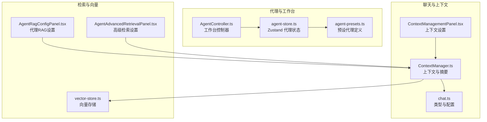
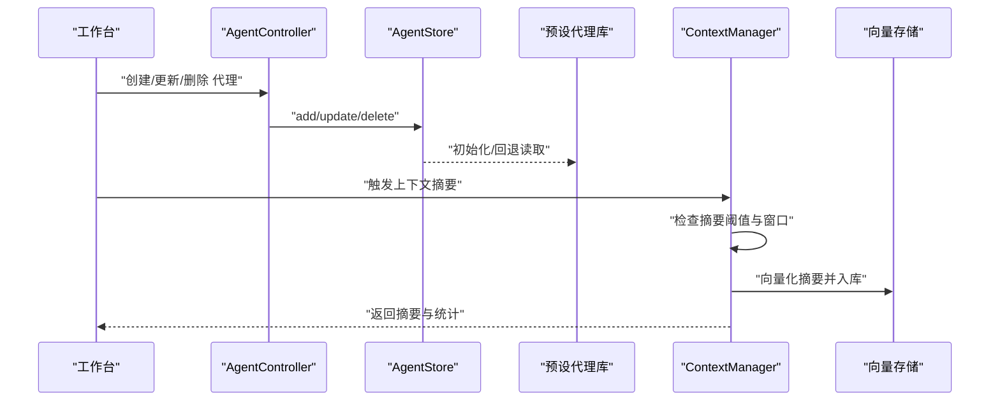
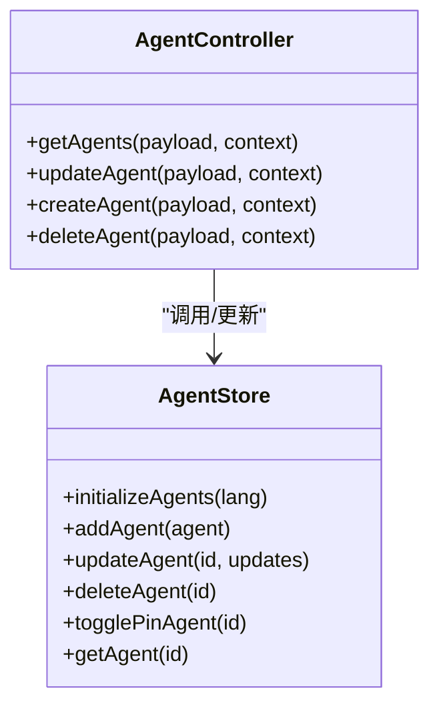
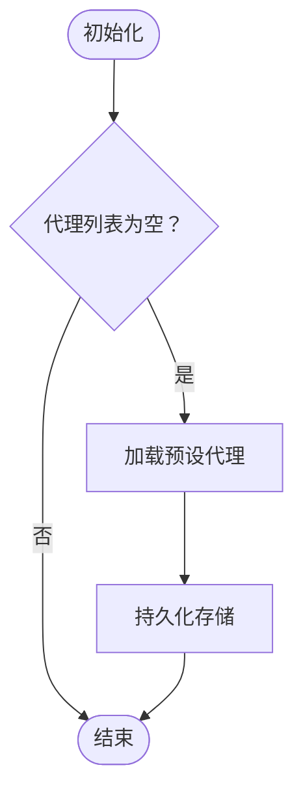
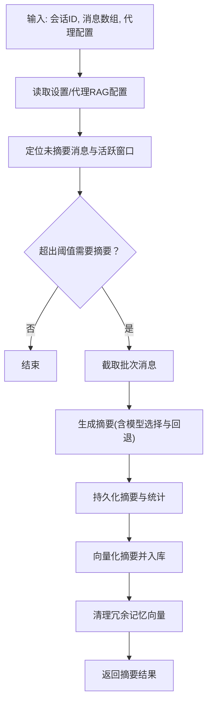
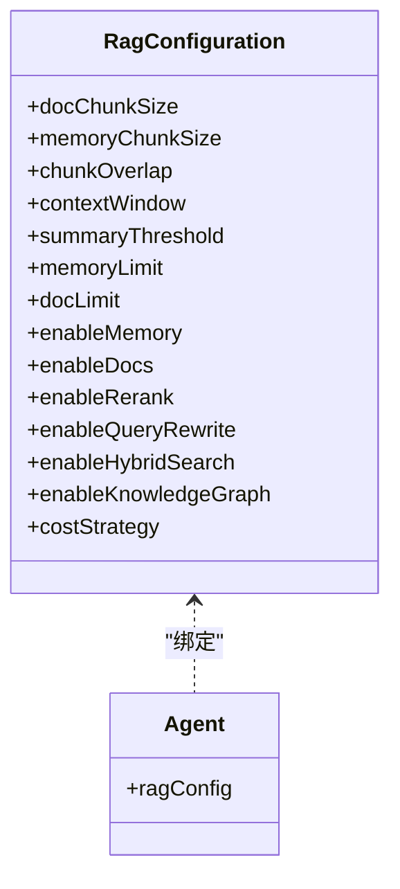
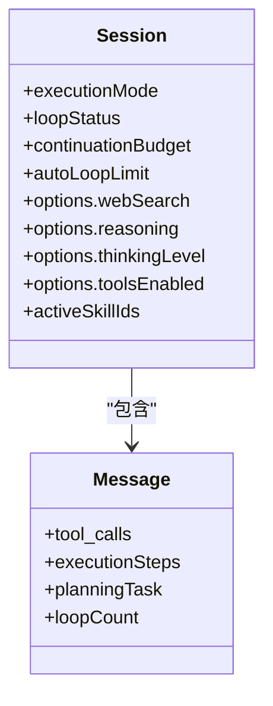
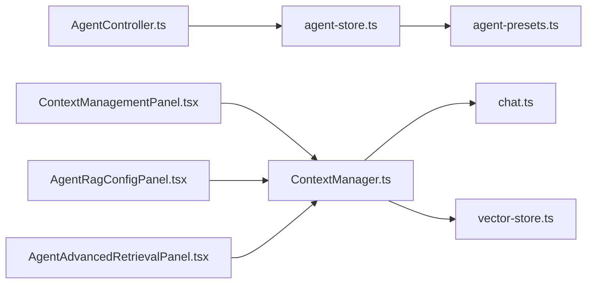

# 智能代理系统

<cite>
**本文引用的文件**
- [README.md](file://README.md)
- [AgentController.ts](file://src/services/workbench/controllers/AgentController.ts)
- [agent-store.ts](file://src/store/agent-store.ts)
- [agent-presets.ts](file://src/lib/agent-presets.ts)
- [ContextManager.ts](file://src/features/chat/utils/ContextManager.ts)
- [chat.ts](file://src/types/chat.ts)
- [AgentAdvancedRetrievalPanel.tsx](file://src/features/settings/components/AgentAdvancedRetrievalPanel.tsx)
- [AgentRagConfigPanel.tsx](file://src/features/settings/components/AgentRagConfigPanel.tsx)
- [ContextManagementPanel.tsx](file://src/features/chat/settings/ContextManagementPanel.tsx)
- [vector-store.ts](file://src/lib/rag/vector-store.ts)
</cite>

## 目录
1. [简介](#简介)
2. [项目结构](#项目结构)
3. [核心组件](#核心组件)
4. [架构总览](#架构总览)
5. [组件详解](#组件详解)
6. [依赖关系分析](#依赖关系分析)
7. [性能考量](#性能考量)
8. [故障排查指南](#故障排查指南)
9. [结论](#结论)
10. [附录](#附录)

## 简介
Nexara 是一款面向 Android 的本地优先 AI 助手客户端，强调本地数据管理与多提供商模型接入。其智能代理系统支持预设代理、自定义代理创建与更新、代理间协作与任务分配，并提供完善的上下文构建与记忆管理能力。系统通过工作台（Web 客户端）与移动端协同，实现远程管理与本地推理的统一体验。

## 项目结构
本节聚焦与智能代理系统直接相关的前端与服务端模块，展示代理配置、上下文管理与检索增强（RAG）的关键路径。

**图表来源**
- [AgentController.ts:1-48](file://src/services/workbench/controllers/AgentController.ts#L1-L48)
- [agent-store.ts:1-77](file://src/store/agent-store.ts#L1-L77)
- [agent-presets.ts:1-130](file://src/lib/agent-presets.ts#L1-L130)
- [ContextManager.ts:1-482](file://src/features/chat/utils/ContextManager.ts#L1-L482)
- [chat.ts:15-314](file://src/types/chat.ts#L15-L314)
- [ContextManagementPanel.tsx](file://src/features/chat/settings/ContextManagementPanel.tsx)
- [AgentRagConfigPanel.tsx](file://src/features/settings/components/AgentRagConfigPanel.tsx)
- [AgentAdvancedRetrievalPanel.tsx](file://src/features/settings/components/AgentAdvancedRetrievalPanel.tsx)
- [vector-store.ts](file://src/lib/rag/vector-store.ts)

**章节来源**
- [README.md:12-38](file://README.md#L12-L38)
- [AgentController.ts:1-48](file://src/services/workbench/controllers/AgentController.ts#L1-L48)
- [agent-store.ts:1-77](file://src/store/agent-store.ts#L1-L77)
- [agent-presets.ts:1-130](file://src/lib/agent-presets.ts#L1-L130)
- [ContextManager.ts:1-482](file://src/features/chat/utils/ContextManager.ts#L1-L482)
- [chat.ts:15-314](file://src/types/chat.ts#L15-L314)

## 核心组件
- 代理控制器（AgentController）：提供代理的增删改查接口，与工作台通信，负责代理状态更新与持久化。
- 代理状态存储（agent-store）：基于 Zustand + AsyncStorage 的持久化存储，支持初始化、更新、删除、置顶与回退读取。
- 预设代理库（agent-presets）：内置多语言预设代理，包含系统提示词、默认模型与 RAG 配置。
- 上下文管理器（ContextManager）：负责会话上下文的摘要生成、向量化、存储与清理，支撑 RAG 与长期记忆。
- 类型与配置（chat.ts）：定义 Agent、Session、Message、RagConfiguration 等核心类型，承载代理与会话配置。
- 设置面板：上下文管理面板、代理 RAG 配置面板与高级检索面板，用于可视化配置代理的上下文窗口、摘要策略与检索行为。

**章节来源**
- [AgentController.ts:4-47](file://src/services/workbench/controllers/AgentController.ts#L4-L47)
- [agent-store.ts:17-76](file://src/store/agent-store.ts#L17-L76)
- [agent-presets.ts:11-129](file://src/lib/agent-presets.ts#L11-L129)
- [ContextManager.ts:28-481](file://src/features/chat/utils/ContextManager.ts#L28-L481)
- [chat.ts:15-314](file://src/types/chat.ts#L15-L314)

## 架构总览
下图展示了代理系统从工作台到状态存储、再到上下文与检索增强的整体流程。

**图表来源**
- [AgentController.ts:5-46](file://src/services/workbench/controllers/AgentController.ts#L5-L46)
- [agent-store.ts:22-69](file://src/store/agent-store.ts#L22-L69)
- [agent-presets.ts:11-129](file://src/lib/agent-presets.ts#L11-L129)
- [ContextManager.ts:29-180](file://src/features/chat/utils/ContextManager.ts#L29-L180)
- [vector-store.ts](file://src/lib/rag/vector-store.ts)

## 组件详解

### 代理控制器与工作台集成
- 提供统一的代理 CRUD 接口，确保 ID 校验与更新广播（可选）。
- 与代理状态存储协作，保证数据一致性与持久化。

**图表来源**
- [AgentController.ts:4-47](file://src/services/workbench/controllers/AgentController.ts#L4-L47)
- [agent-store.ts:17-76](file://src/store/agent-store.ts#L17-L76)

**章节来源**
- [AgentController.ts:4-47](file://src/services/workbench/controllers/AgentController.ts#L4-L47)
- [agent-store.ts:17-76](file://src/store/agent-store.ts#L17-L76)

### 预设代理与自定义代理
- 预设代理包含系统提示词、默认模型与 RAG 配置，覆盖日常场景（如翻译、代码、创意写作、全局中枢）。
- 自定义代理可通过工作台或控制器创建与更新，支持覆盖默认模型、温度等推理参数与 RAG 行为。

**图表来源**
- [agent-store.ts:22-30](file://src/store/agent-store.ts#L22-L30)
- [agent-presets.ts:11-129](file://src/lib/agent-presets.ts#L11-L129)

**章节来源**
- [agent-store.ts:22-30](file://src/store/agent-store.ts#L22-L30)
- [agent-presets.ts:11-129](file://src/lib/agent-presets.ts#L11-L129)

### 上下文构建与摘要机制
- ContextManager 负责：
  - 基于会话消息与 RAG 配置计算摘要触发条件（上下文窗口与阈值）。
  - 生成摘要并记录 Token 使用量，支持真实用量与估算。
  - 将摘要向量化并写入向量存储，同时清理冗余的记忆向量。
  - 提供摘要查询与删除能力，便于调试与维护。

**图表来源**
- [ContextManager.ts:29-180](file://src/features/chat/utils/ContextManager.ts#L29-L180)
- [ContextManager.ts:182-347](file://src/features/chat/utils/ContextManager.ts#L182-L347)
- [ContextManager.ts:349-401](file://src/features/chat/utils/ContextManager.ts#L349-L401)
- [ContextManager.ts:407-441](file://src/features/chat/utils/ContextManager.ts#L407-L441)

**章节来源**
- [ContextManager.ts:28-481](file://src/features/chat/utils/ContextManager.ts#L28-L481)
- [chat.ts:244-313](file://src/types/chat.ts#L244-L313)

### RAG 配置与检索增强
- 代理级 RAG 配置（RagConfiguration）支持：
  - 切块大小、重叠、上下文窗口与摘要阈值。
  - 记忆与文档检索的限制与阈值。
  - 高级检索：重排序、查询重写、混合检索与知识图谱抽取。
- 设置面板提供可视化配置入口，便于按需调整检索策略与成本控制。

**图表来源**
- [chat.ts:244-313](file://src/types/chat.ts#L244-L313)
- [AgentRagConfigPanel.tsx](file://src/features/settings/components/AgentRagConfigPanel.tsx)
- [AgentAdvancedRetrievalPanel.tsx](file://src/features/settings/components/AgentAdvancedRetrievalPanel.tsx)

**章节来源**
- [chat.ts:244-313](file://src/types/chat.ts#L244-L313)
- [AgentRagConfigPanel.tsx](file://src/features/settings/components/AgentRagConfigPanel.tsx)
- [AgentAdvancedRetrievalPanel.tsx](file://src/features/settings/components/AgentAdvancedRetrievalPanel.tsx)

### 代理协作与任务分配
- 会话类型（Session）包含执行模式（auto/semi/manual）、循环状态与续杯额度，支持跨轮次连续执行与人工干预。
- 工具调用与执行步骤（ExecutionStep）在消息中体现，便于追踪代理的计划与执行过程。
- 代理可通过会话选项启用/禁用工具、推理与思维链模式，满足不同任务的可控性需求。

**图表来源**
- [chat.ts:169-223](file://src/types/chat.ts#L169-L223)
- [chat.ts:135-167](file://src/types/chat.ts#L135-L167)

**章节来源**
- [chat.ts:169-223](file://src/types/chat.ts#L169-L223)
- [chat.ts:135-167](file://src/types/chat.ts#L135-L167)

## 依赖关系分析
- 控制器依赖状态存储；状态存储依赖预设代理库进行初始化与回退。
- 上下文管理器依赖设置存储、数据库与向量存储，形成“摘要-向量化-入库-清理”的闭环。
- 类型定义贯穿代理、会话与消息，确保配置与运行时数据一致。

**图表来源**
- [AgentController.ts:1-48](file://src/services/workbench/controllers/AgentController.ts#L1-L48)
- [agent-store.ts:1-77](file://src/store/agent-store.ts#L1-L77)
- [agent-presets.ts:1-130](file://src/lib/agent-presets.ts#L1-L130)
- [ContextManager.ts:1-482](file://src/features/chat/utils/ContextManager.ts#L1-L482)
- [chat.ts:15-314](file://src/types/chat.ts#L15-L314)
- [ContextManagementPanel.tsx](file://src/features/chat/settings/ContextManagementPanel.tsx)
- [AgentRagConfigPanel.tsx](file://src/features/settings/components/AgentRagConfigPanel.tsx)
- [AgentAdvancedRetrievalPanel.tsx](file://src/features/settings/components/AgentAdvancedRetrievalPanel.tsx)
- [vector-store.ts](file://src/lib/rag/vector-store.ts)

**章节来源**
- [AgentController.ts:1-48](file://src/services/workbench/controllers/AgentController.ts#L1-L48)
- [agent-store.ts:1-77](file://src/store/agent-store.ts#L1-L77)
- [agent-presets.ts:1-130](file://src/lib/agent-presets.ts#L1-L130)
- [ContextManager.ts:1-482](file://src/features/chat/utils/ContextManager.ts#L1-L482)
- [chat.ts:15-314](file://src/types/chat.ts#L15-L314)

## 性能考量
- 上下文窗口与摘要阈值：合理设置上下文窗口与摘要阈值，可显著降低模型输入长度，减少 Token 消耗与延迟。
- 摘要模型与回退策略：摘要模型选择与运行时回退逻辑可提升稳定性，避免因模型不可用导致的失败。
- 向量化与清理：摘要向量化与冗余向量清理有助于降低向量库规模，提升检索效率。
- 成本控制：通过检索策略（重排序、混合检索、知识图谱）与成本策略（摘要优先、按需抽取）平衡质量与开销。

[本节为通用指导，无需列出具体文件来源]

## 故障排查指南
- 摘要失败：检查摘要模型是否存在、是否被禁用，关注运行时回退日志与 Token 统计。
- 向量化失败：确认嵌入模型提供商与模型类型是否正确，检查网络与权限。
- 会话缺失：摘要存储前会进行会话存在性检查，若失败需确认会话 ID 与数据库状态。
- 配置不生效：确认代理级配置优先于全局配置，检查设置面板与会话选项是否正确应用。

**章节来源**
- [ContextManager.ts:118-128](file://src/features/chat/utils/ContextManager.ts#L118-L128)
- [ContextManager.ts:234-238](file://src/features/chat/utils/ContextManager.ts#L234-L238)
- [ContextManager.ts:386-400](file://src/features/chat/utils/ContextManager.ts#L386-L400)

## 结论
Nexara 的智能代理系统通过预设代理与自定义代理的灵活组合、完善的上下文与 RAG 管理、以及可视化的工作台配置，实现了从提示词工程、模型绑定到工具集成与性能调优的全链路能力。结合会话级执行模式与任务分配策略，系统能够适应多样化的应用场景，并为扩展开发提供清晰的接口与数据模型。

[本节为总结性内容，无需列出具体文件来源]

## 附录

### 实际使用案例
- 创建翻译代理：设置系统提示词与默认模型，启用文档检索以辅助术语一致性。
- 构建代码导师代理：提高温度与启用思维链模式，绑定知识库与工具集以支持代码解释与重构。
- 全局中枢代理：开启知识图谱抽取与混合检索，提升跨文档综合能力。

[本节为概念性示例，无需列出具体文件来源]

### 扩展开发指南
- 新增代理：通过工作台或控制器创建代理，设置系统提示词与默认模型，必要时配置 RAG 参数。
- 自定义提示词工程：利用会话级附加提示词与代理系统提示词叠加，实现场景化引导。
- 工具集成：在会话选项中启用工具，或在代理级别指定技能集合，结合 MCP 协议接入外部工具。
- 性能调优：根据业务场景调整上下文窗口、摘要阈值与检索策略，结合成本策略控制开销。

[本节为通用指导，无需列出具体文件来源]