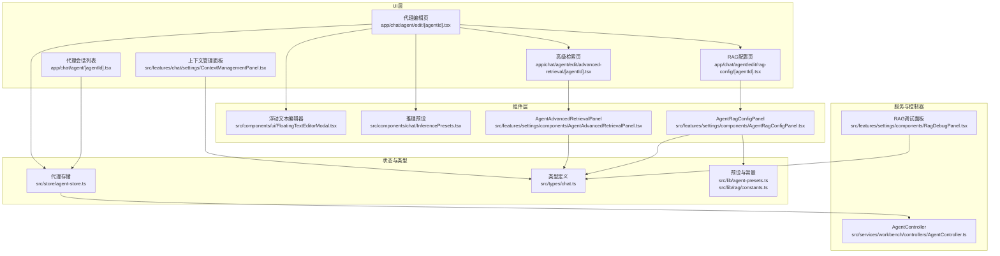
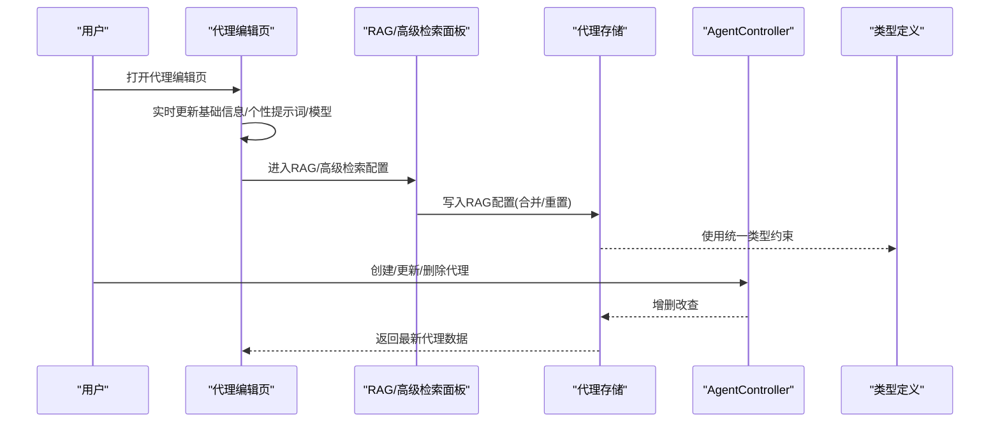
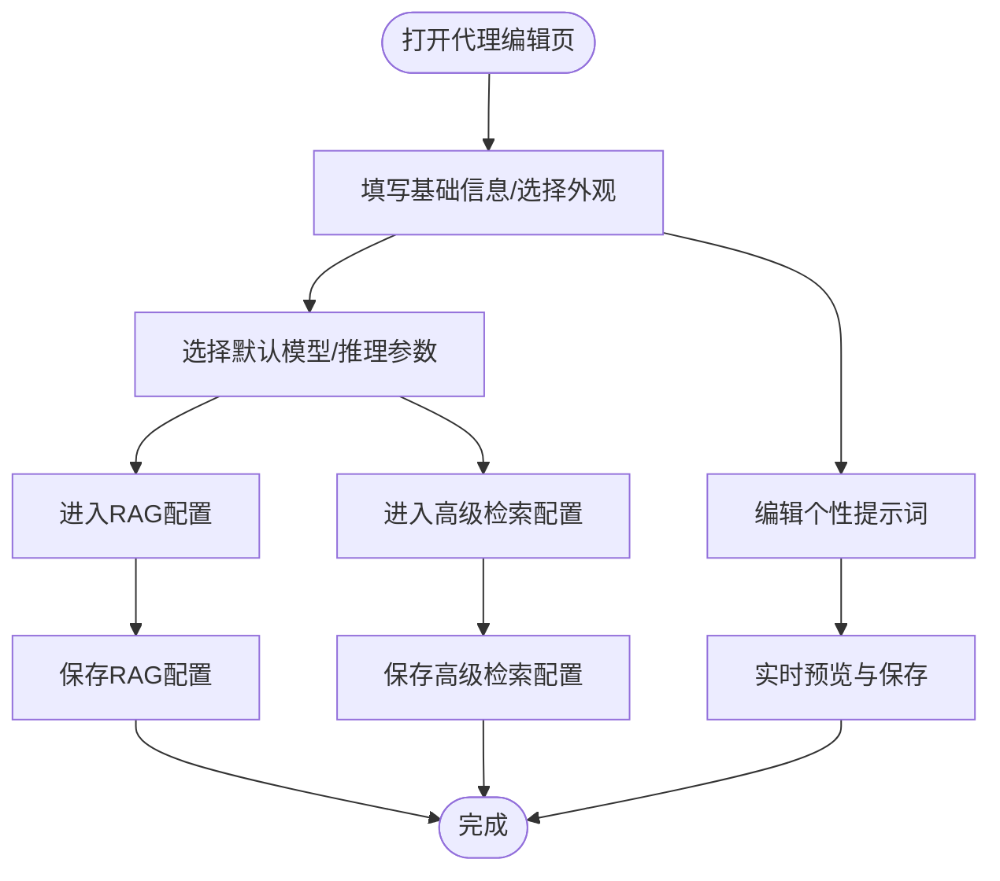
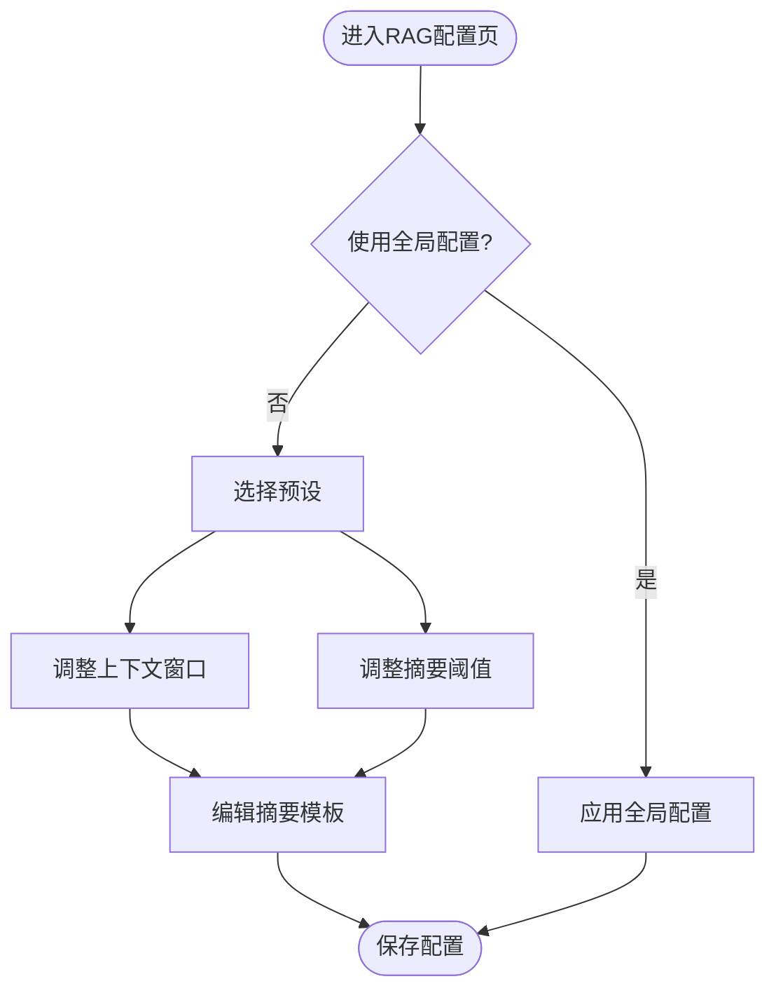
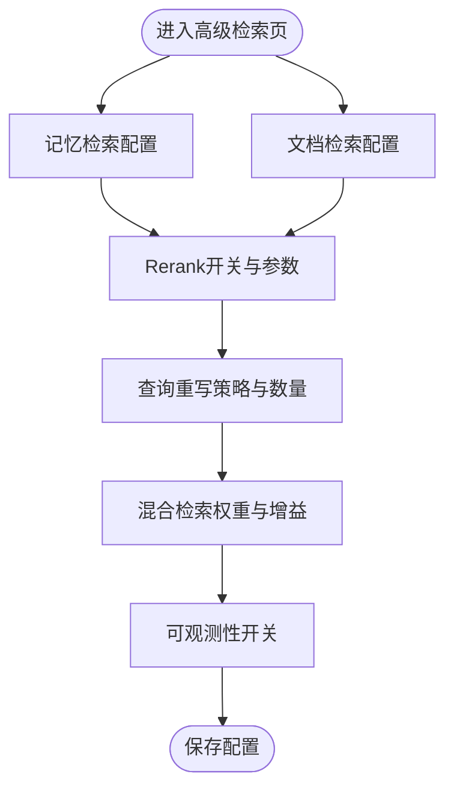
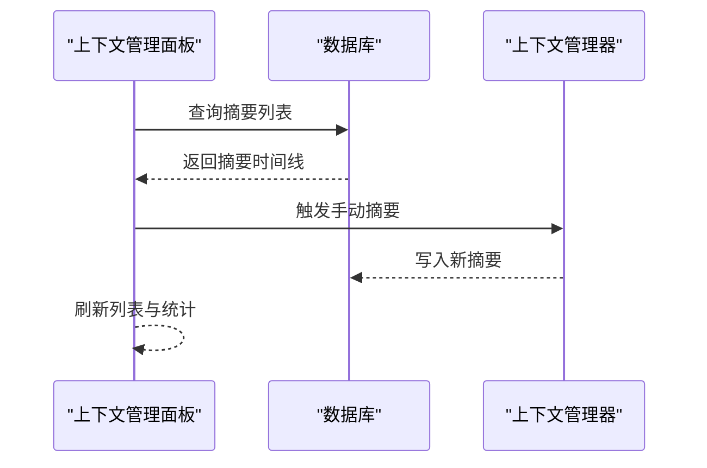
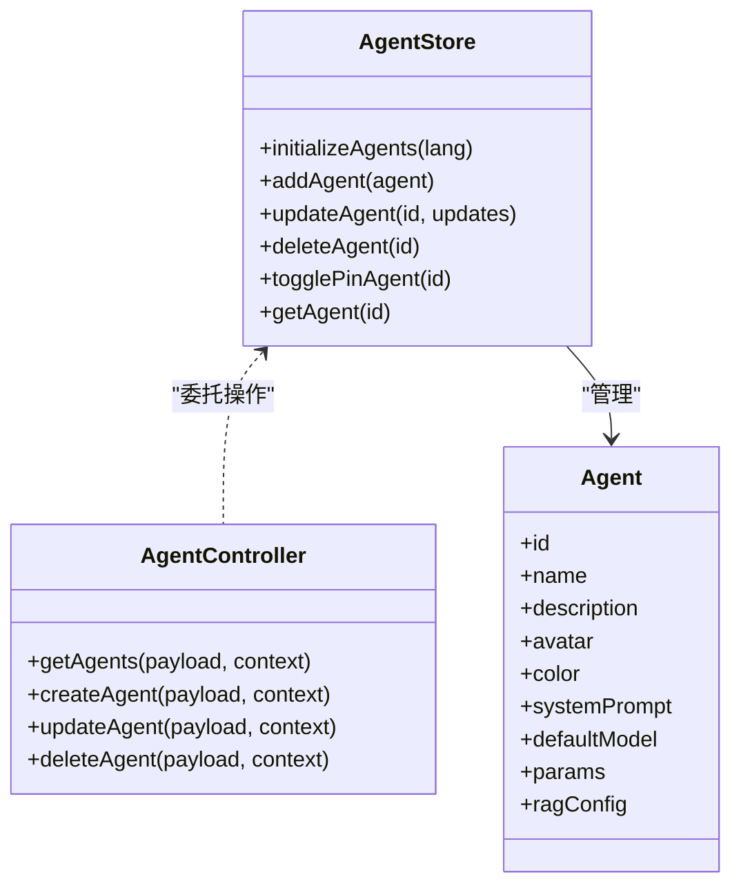
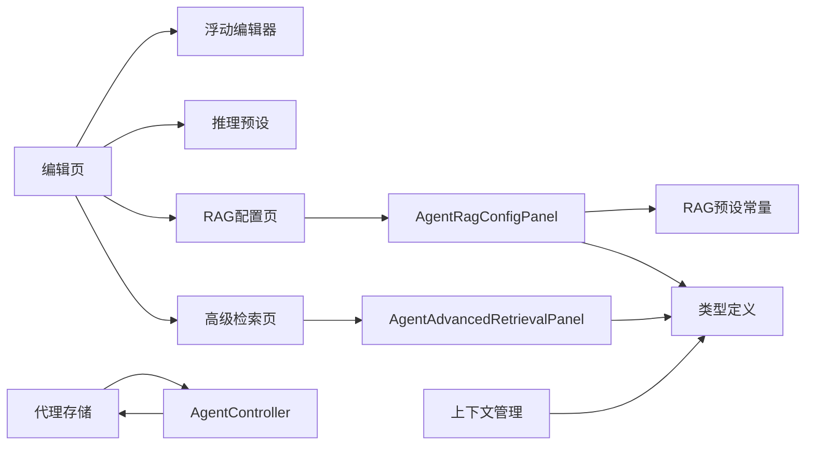

# 自定义代理创建

<cite>
**本文引用的文件**
- [app/chat/agent/edit/[agentId].tsx](file://app/chat/agent/edit/[agentId].tsx)
- [app/chat/agent/[agentId].tsx](file://app/chat/agent/[agentId].tsx)
- [src/features/settings/components/AgentRagConfigPanel.tsx](file://src/features/settings/components/AgentRagConfigPanel.tsx)
- [app/chat/agent/edit/rag-config/[agentId].tsx](file://app/chat/agent/edit/rag-config/[agentId].tsx)
- [src/features/settings/components/AgentAdvancedRetrievalPanel.tsx](file://src/features/settings/components/AgentAdvancedRetrievalPanel.tsx)
- [app/chat/agent/edit/advanced-retrieval/[agentId].tsx](file://app/chat/agent/edit/advanced-retrieval/[agentId].tsx)
- [src/components/chat/InferencePresets.tsx](file://src/components/chat/InferencePresets.tsx)
- [src/components/ui/FloatingTextEditorModal.tsx](file://src/components/ui/FloatingTextEditorModal.tsx)
- [src/features/chat/settings/ContextManagementPanel.tsx](file://src/features/chat/settings/ContextManagementPanel.tsx)
- [src/services/workbench/controllers/AgentController.ts](file://src/services/workbench/controllers/AgentController.ts)
- [src/store/agent-store.ts](file://src/store/agent-store.ts)
- [src/types/chat.ts](file://src/types/chat.ts)
- [src/lib/agent-presets.ts](file://src/lib/agent-presets.ts)
- [src/lib/rag/constants.ts](file://src/lib/rag/constants.ts)
- [src/features/settings/components/RagDebugPanel.tsx](file://src/features/settings/components/RagDebugPanel.tsx)
</cite>

## 目录
1. [简介](#简介)
2. [项目结构](#项目结构)
3. [核心组件](#核心组件)
4. [架构总览](#架构总览)
5. [详细组件分析](#详细组件分析)
6. [依赖关系分析](#依赖关系分析)
7. [性能考量](#性能考量)
8. [故障排查指南](#故障排查指南)
9. [结论](#结论)
10. [附录](#附录)

## 简介
本指南面向需要在Nexara中创建与配置自定义代理（Agent）的用户与开发者，覆盖从代理创建、基础与高级配置、实时预览与验证、到测试调试与性能优化的完整流程。文档基于仓库中的实际实现，帮助您快速上手并掌握代理系统的各项能力。

## 项目结构
围绕“自定义代理创建”的关键目录与文件如下：
- 代理编辑入口与会话管理：app/chat/agent/edit/[agentId].tsx、app/chat/agent/[agentId].tsx
- 代理存储与控制器：src/store/agent-store.ts、src/services/workbench/controllers/AgentController.ts
- 代理类型定义：src/types/chat.ts
- 提示词与推理参数编辑：src/components/ui/FloatingTextEditorModal.tsx、src/components/chat/InferencePresets.tsx
- RAG配置与高级检索：src/features/settings/components/AgentRagConfigPanel.tsx、app/chat/agent/edit/rag-config/[agentId].tsx、src/features/settings/components/AgentAdvancedRetrievalPanel.tsx、app/chat/agent/edit/advanced-retrieval/[agentId].tsx
- 上下文管理与摘要：src/features/chat/settings/ContextManagementPanel.tsx
- 预设与常量：src/lib/agent-presets.ts、src/lib/rag/constants.ts
- 调试与可观测性：src/features/settings/components/RagDebugPanel.tsx

图表来源
- [app/chat/agent/edit/[agentId].tsx](file://app/chat/agent/edit/[agentId].tsx#L57-L566)
- [app/chat/agent/edit/rag-config/[agentId].tsx](file://app/chat/agent/edit/rag-config/[agentId].tsx#L12-L49)
- [app/chat/agent/edit/advanced-retrieval/[agentId].tsx](file://app/chat/agent/edit/advanced-retrieval/[agentId].tsx#L11-L50)
- [app/chat/agent/[agentId].tsx](file://app/chat/agent/[agentId].tsx#L20-L205)
- [src/features/chat/settings/ContextManagementPanel.tsx:52-330](file://src/features/chat/settings/ContextManagementPanel.tsx#L52-L330)
- [src/components/ui/FloatingTextEditorModal.tsx:39-248](file://src/components/ui/FloatingTextEditorModal.tsx#L39-L248)
- [src/components/chat/InferencePresets.tsx:18-115](file://src/components/chat/InferencePresets.tsx#L18-L115)
- [src/features/settings/components/AgentRagConfigPanel.tsx:23-309](file://src/features/settings/components/AgentRagConfigPanel.tsx#L23-L309)
- [src/features/settings/components/AgentAdvancedRetrievalPanel.tsx:19-521](file://src/features/settings/components/AgentAdvancedRetrievalPanel.tsx#L19-L521)
- [src/store/agent-store.ts:17-77](file://src/store/agent-store.ts#L17-L77)
- [src/services/workbench/controllers/AgentController.ts:4-47](file://src/services/workbench/controllers/AgentController.ts#L4-L47)
- [src/types/chat.ts:15-314](file://src/types/chat.ts#L15-L314)
- [src/lib/agent-presets.ts:11-130](file://src/lib/agent-presets.ts#L11-L130)
- [src/lib/rag/constants.ts:23-80](file://src/lib/rag/constants.ts#L23-L80)
- [src/features/settings/components/RagDebugPanel.tsx:14-235](file://src/features/settings/components/RagDebugPanel.tsx#L14-L235)

章节来源
- [app/chat/agent/edit/[agentId].tsx](file://app/chat/agent/edit/[agentId].tsx#L57-L566)
- [src/store/agent-store.ts:17-77](file://src/store/agent-store.ts#L17-L77)

## 核心组件
- 代理编辑页：提供基础信息、外观、个性提示词、模型与推理参数、RAG与高级检索入口、危险区删除等。
- RAG配置面板：支持预设一键应用、摘要窗口与阈值、摘要模板编辑、继承/重置策略。
- 高级检索面板：提供检索限制、相似度阈值、Rerank、查询重写、混合检索、可观测性开关。
- 推理预设：温度等参数的快速切换，便于快速体验不同风格。
- 浮动文本编辑器：用于编辑系统提示词与摘要模板，支持实时保存与字符计数。
- 会话与上下文管理：代理会话列表、手动摘要、归档查看与统计。
- 存储与控制器：代理持久化、增删改查、初始化预设。
- 类型与常量：统一的Agent/Session/RAG配置结构与预设常量。

章节来源
- [src/features/settings/components/AgentRagConfigPanel.tsx:23-309](file://src/features/settings/components/AgentRagConfigPanel.tsx#L23-L309)
- [src/features/settings/components/AgentAdvancedRetrievalPanel.tsx:19-521](file://src/features/settings/components/AgentAdvancedRetrievalPanel.tsx#L19-L521)
- [src/components/chat/InferencePresets.tsx:18-115](file://src/components/chat/InferencePresets.tsx#L18-L115)
- [src/components/ui/FloatingTextEditorModal.tsx:39-248](file://src/components/ui/FloatingTextEditorModal.tsx#L39-L248)
- [src/features/chat/settings/ContextManagementPanel.tsx:52-330](file://src/features/chat/settings/ContextManagementPanel.tsx#L52-L330)
- [src/services/workbench/controllers/AgentController.ts:4-47](file://src/services/workbench/controllers/AgentController.ts#L4-L47)
- [src/store/agent-store.ts:17-77](file://src/store/agent-store.ts#L17-L77)
- [src/types/chat.ts:15-314](file://src/types/chat.ts#L15-L314)
- [src/lib/rag/constants.ts:23-80](file://src/lib/rag/constants.ts#L23-L80)

## 架构总览
代理创建与配置由“UI层-组件层-状态与类型-服务与控制器”四层协同完成。编辑页通过受控表单与悬浮编辑器实时更新代理配置；RAG与高级检索面板通过滑条与开关调整检索策略；上下文管理面板提供摘要与归档；存储与控制器负责数据持久化与对外接口。

图表来源
- [app/chat/agent/edit/[agentId].tsx](file://app/chat/agent/edit/[agentId].tsx#L57-L566)
- [src/features/settings/components/AgentRagConfigPanel.tsx:23-309](file://src/features/settings/components/AgentRagConfigPanel.tsx#L23-L309)
- [src/features/settings/components/AgentAdvancedRetrievalPanel.tsx:19-521](file://src/features/settings/components/AgentAdvancedRetrievalPanel.tsx#L19-L521)
- [src/store/agent-store.ts:17-77](file://src/store/agent-store.ts#L17-L77)
- [src/services/workbench/controllers/AgentController.ts:4-47](file://src/services/workbench/controllers/AgentController.ts#L4-L47)
- [src/types/chat.ts:15-314](file://src/types/chat.ts#L15-L314)

## 详细组件分析

### 代理编辑界面与实时预览
- 基础信息与外观：名称、描述、头像与主题色，支持从图库选择与预设图标。
- 个性提示词：点击进入浮动文本编辑器，支持多行编辑、字符计数、保存。
- 模型与推理参数：模型选择器、推理预设卡片，温度等参数即时生效。
- RAG与高级检索入口：分别跳转至对应配置页。
- 删除代理：危险区确认对话框。

图表来源
- [app/chat/agent/edit/[agentId].tsx](file://app/chat/agent/edit/[agentId].tsx#L57-L566)
- [src/components/ui/FloatingTextEditorModal.tsx:39-248](file://src/components/ui/FloatingTextEditorModal.tsx#L39-L248)
- [src/components/chat/InferencePresets.tsx:18-115](file://src/components/chat/InferencePresets.tsx#L18-L115)

章节来源
- [app/chat/agent/edit/[agentId].tsx](file://app/chat/agent/edit/[agentId].tsx#L57-L566)
- [src/components/ui/FloatingTextEditorModal.tsx:39-248](file://src/components/ui/FloatingTextEditorModal.tsx#L39-L248)
- [src/components/chat/InferencePresets.tsx:18-115](file://src/components/chat/InferencePresets.tsx#L18-L115)

### RAG配置与摘要策略
- 继承/自定义模式：优先使用助手级配置，否则回退到全局配置；可一键重置为全局。
- 预设快捷：平衡/写作/编程三类预设，一键套用。
- 摘要窗口与阈值：滑条调节上下文窗口与触发摘要的消息阈值。
- 摘要模板：浮动编辑器支持自定义摘要Prompt。
- 重置确认：防止误操作。

图表来源
- [src/features/settings/components/AgentRagConfigPanel.tsx:23-309](file://src/features/settings/components/AgentRagConfigPanel.tsx#L23-L309)
- [src/lib/rag/constants.ts:23-80](file://src/lib/rag/constants.ts#L23-L80)

章节来源
- [src/features/settings/components/AgentRagConfigPanel.tsx:23-309](file://src/features/settings/components/AgentRagConfigPanel.tsx#L23-L309)
- [app/chat/agent/edit/rag-config/[agentId].tsx](file://app/chat/agent/edit/rag-config/[agentId].tsx#L12-L49)
- [src/lib/rag/constants.ts:23-80](file://src/lib/rag/constants.ts#L23-L80)

### 高级检索与混合策略
- 检索限制与阈值：记忆与文档分别设置召回数量与相似度阈值。
- Rerank：开启后会禁用部分滑条，限定召回与精排数量。
- 查询重写：支持策略切换与变体数量配置。
- 混合检索：向量权重与BM25增益可调。
- 可观测性：检索进度、详情与指标记录开关。

图表来源
- [src/features/settings/components/AgentAdvancedRetrievalPanel.tsx:19-521](file://src/features/settings/components/AgentAdvancedRetrievalPanel.tsx#L19-L521)
- [app/chat/agent/edit/advanced-retrieval/[agentId].tsx](file://app/chat/agent/edit/advanced-retrieval/[agentId].tsx#L11-L50)

章节来源
- [src/features/settings/components/AgentAdvancedRetrievalPanel.tsx:19-521](file://src/features/settings/components/AgentAdvancedRetrievalPanel.tsx#L19-L521)
- [app/chat/agent/edit/advanced-retrieval/[agentId].tsx](file://app/chat/agent/edit/advanced-retrieval/[agentId].tsx#L11-L50)

### 上下文管理与摘要
- 加载与统计：按会话加载摘要时间线，展示消息数、归档数与Token用量。
- 手动摘要：触发摘要生成，支持批量阈值与消息数控制。
- 归档查看：垂直时间轴展示摘要内容，支持删除。
- 错误提示：异常时显示错误信息。

图表来源
- [src/features/chat/settings/ContextManagementPanel.tsx:52-330](file://src/features/chat/settings/ContextManagementPanel.tsx#L52-L330)

章节来源
- [src/features/chat/settings/ContextManagementPanel.tsx:52-330](file://src/features/chat/settings/ContextManagementPanel.tsx#L52-L330)

### 存储、类型与控制器
- 代理存储：提供初始化预设、增删改查、切换置顶、按ID获取。
- 类型定义：统一的Agent/Session/RAG配置结构，含推理参数、RAG开关与高级检索字段。
- 控制器：对外提供获取、创建、更新、删除代理的接口，内部委托存储。

图表来源
- [src/store/agent-store.ts:17-77](file://src/store/agent-store.ts#L17-L77)
- [src/services/workbench/controllers/AgentController.ts:4-47](file://src/services/workbench/controllers/AgentController.ts#L4-L47)
- [src/types/chat.ts:15-35](file://src/types/chat.ts#L15-L35)

章节来源
- [src/store/agent-store.ts:17-77](file://src/store/agent-store.ts#L17-L77)
- [src/services/workbench/controllers/AgentController.ts:4-47](file://src/services/workbench/controllers/AgentController.ts#L4-L47)
- [src/types/chat.ts:15-35](file://src/types/chat.ts#L15-L35)

### 预设与提示词工程
- 预设代理：包含默认提示词、模型与参数，便于快速体验。
- RAG预设：平衡/写作/编程三类，覆盖不同场景的切块、阈值与窗口。
- 提示词编辑：浮动编辑器支持多行输入、字符计数与保存，适合提示词工程实践。

章节来源
- [src/lib/agent-presets.ts:11-130](file://src/lib/agent-presets.ts#L11-L130)
- [src/lib/rag/constants.ts:23-80](file://src/lib/rag/constants.ts#L23-L80)
- [src/components/ui/FloatingTextEditorModal.tsx:39-248](file://src/components/ui/FloatingTextEditorModal.tsx#L39-L248)

## 依赖关系分析
- UI层依赖组件层与状态层；编辑页依赖浮动编辑器与推理预设；RAG与高级检索页依赖对应面板组件。
- 组件层依赖类型定义与常量；RAG面板依赖预设常量；上下文管理依赖数据库查询。
- 存储层与控制器解耦UI与业务逻辑；控制器依赖存储进行CRUD。

图表来源
- [app/chat/agent/edit/[agentId].tsx](file://app/chat/agent/edit/[agentId].tsx#L57-L566)
- [src/features/settings/components/AgentRagConfigPanel.tsx:23-309](file://src/features/settings/components/AgentRagConfigPanel.tsx#L23-L309)
- [src/features/settings/components/AgentAdvancedRetrievalPanel.tsx:19-521](file://src/features/settings/components/AgentAdvancedRetrievalPanel.tsx#L19-L521)
- [src/store/agent-store.ts:17-77](file://src/store/agent-store.ts#L17-L77)
- [src/services/workbench/controllers/AgentController.ts:4-47](file://src/services/workbench/controllers/AgentController.ts#L4-L47)
- [src/types/chat.ts:15-314](file://src/types/chat.ts#L15-L314)
- [src/lib/rag/constants.ts:23-80](file://src/lib/rag/constants.ts#L23-L80)

章节来源
- [src/store/agent-store.ts:17-77](file://src/store/agent-store.ts#L17-L77)
- [src/services/workbench/controllers/AgentController.ts:4-47](file://src/services/workbench/controllers/AgentController.ts#L4-L47)
- [src/types/chat.ts:15-314](file://src/types/chat.ts#L15-L314)

## 性能考量
- 上下文窗口与摘要阈值：合理设置上下文窗口与摘要阈值，避免频繁摘要导致的额外Token与延迟。
- Rerank与混合检索：在高召回需求场景启用Rerank，但注意提升计算成本；混合检索可权衡向量与BM25权重。
- 查询重写：适度增加变体数量可提升召回质量，但会增加推理次数。
- 推理参数：根据任务风格选择预设或微调温度，避免过高温度导致输出不稳定。
- 会话与归档：定期清理无用归档，降低存储压力。

## 故障排查指南
- 编辑器保存失败：检查浮动编辑器的保存回调与权限；确认网络/存储可用。
- RAG配置无效：确认是否处于“使用全局配置”模式，必要时重置为自定义配置。
- 手动摘要报错：查看上下文管理面板的错误提示，确认会话消息状态与Token用量。
- 向量库异常：使用RAG调试面板刷新统计，触发清理冗余向量，观察存储占用与冗余率变化。
- 代理删除确认：删除前确保备份重要配置，确认对话框已正确弹出。

章节来源
- [src/components/ui/FloatingTextEditorModal.tsx:39-248](file://src/components/ui/FloatingTextEditorModal.tsx#L39-L248)
- [src/features/settings/components/AgentRagConfigPanel.tsx:290-306](file://src/features/settings/components/AgentRagConfigPanel.tsx#L290-L306)
- [src/features/chat/settings/ContextManagementPanel.tsx:174-181](file://src/features/chat/settings/ContextManagementPanel.tsx#L174-L181)
- [src/features/settings/components/RagDebugPanel.tsx:14-235](file://src/features/settings/components/RagDebugPanel.tsx#L14-L235)

## 结论
通过上述组件与流程，Nexara提供了从基础信息、个性提示词、模型与推理参数，到RAG与高级检索的全链路代理配置能力。配合上下文管理、调试面板与预设工程，用户可以快速构建并优化自定义代理，满足多样化应用场景。

## 附录
- 最佳实践
  - 提示词工程：采用“角色-目标-约束-反馈”的结构，逐步迭代；利用浮动编辑器进行小步快跑。
  - RAG策略：先用预设快速验证效果，再按场景微调切块、阈值与窗口。
  - 推理参数：以任务类型选择预设，再根据稳定性与创造性需求微调温度。
  - 上下文管理：定期触发摘要，保持上下文窗口稳定；归档重要对话片段。
- 测试与调试
  - 使用会话列表创建新会话，结合上下文管理面板观察摘要行为。
  - 在RAG调试面板查看向量统计与冗余率，按需清理。
  - 通过控制器接口进行批量导入/导出代理配置，便于回归测试。