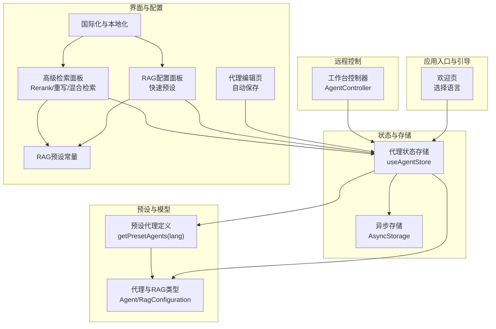
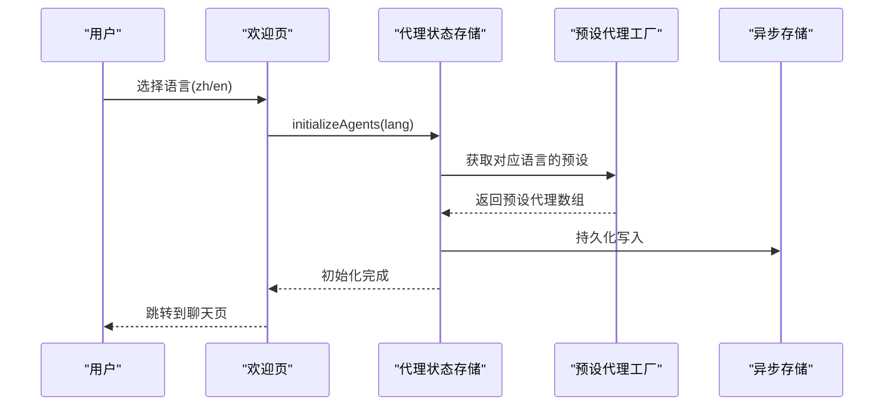
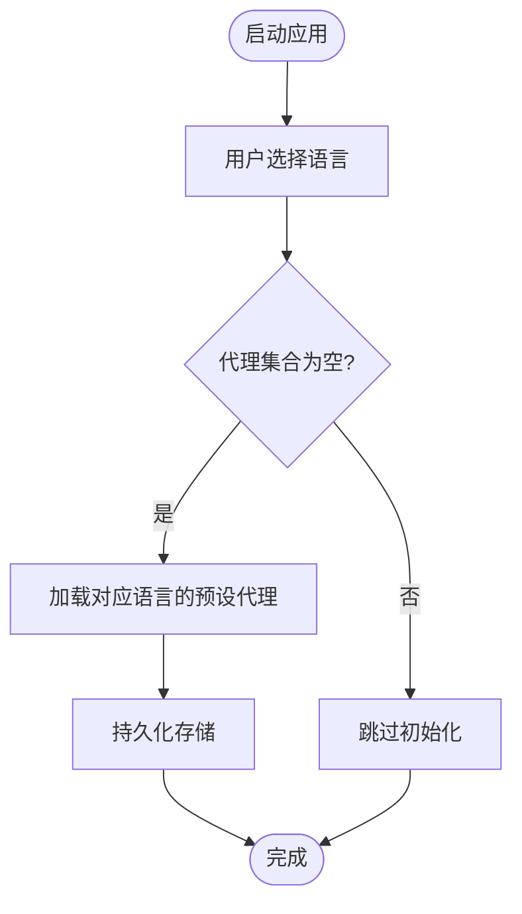
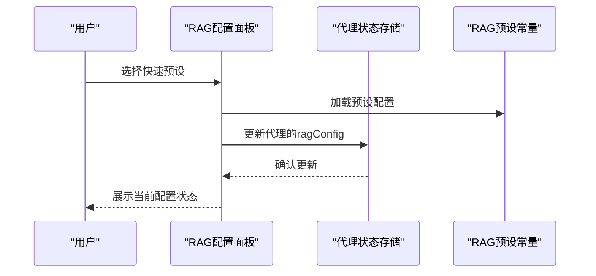
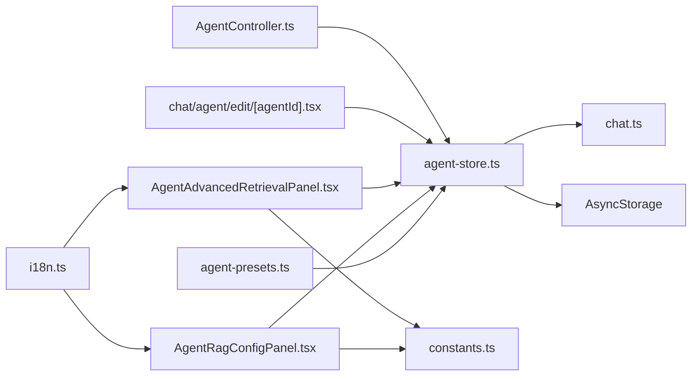

# 预设代理配置

<cite>
**本文档引用的文件**
- [agent-presets.ts](file://src/lib/agent-presets.ts)
- [agent-store.ts](file://src/store/agent-store.ts)
- [welcome.tsx](file://app/welcome.tsx)
- [chat/agent/edit/[agentId].tsx](file://app/chat/agent/edit/[agentId].tsx)
- [AgentController.ts](file://src/services/workbench/controllers/AgentController.ts)
- [AgentRagConfigPanel.tsx](file://src/features/settings/components/AgentRagConfigPanel.tsx)
- [AgentAdvancedRetrievalPanel.tsx](file://src/features/settings/components/AgentAdvancedRetrievalPanel.tsx)
- [constants.ts](file://src/lib/rag/constants.ts)
- [i18n.ts](file://src/lib/i18n.ts)
- [chat.ts](file://src/types/chat.ts)
</cite>

## 目录
1. [简介](#简介)
2. [项目结构](#项目结构)
3. [核心组件](#核心组件)
4. [架构总览](#架构总览)
5. [详细组件分析](#详细组件分析)
6. [依赖分析](#依赖分析)
7. [性能考量](#性能考量)
8. [故障排查指南](#故障排查指南)
9. [结论](#结论)
10. [附录](#附录)

## 简介
本文件面向Nexara的“预设代理配置”，提供从设计理念、分类体系、语言支持与本地化、初始化与自动配置、更新与维护策略，到定制化与最佳实践的全流程使用文档。读者将了解预设代理如何在首次启动时自动注入、如何通过中英文双语配置与本地化策略适配多语言环境、如何基于RAG预设快速调整检索行为，以及如何在现有基础上进行自定义扩展。

## 项目结构
围绕预设代理的关键文件与模块如下：
- 预设代理定义与语言切换：src/lib/agent-presets.ts
- 代理状态管理与初始化：src/store/agent-store.ts
- 首次启动引导与语言选择：app/welcome.tsx
- 代理编辑与持久化：app/chat/agent/edit/[agentId].tsx
- 远程工作台控制器：src/services/workbench/controllers/AgentController.ts
- RAG配置面板与预设应用：src/features/settings/components/AgentRagConfigPanel.tsx、src/features/settings/components/AgentAdvancedRetrievalPanel.tsx
- RAG预设常量：src/lib/rag/constants.ts
- 国际化与本地化：src/lib/i18n.ts
- 数据模型与类型：src/types/chat.ts

图表来源
- [welcome.tsx](file://app/welcome.tsx)
- [agent-store.ts](file://src/store/agent-store.ts)
- [agent-presets.ts](file://src/lib/agent-presets.ts)
- [chat/agent/edit/[agentId].tsx](file://app/chat/agent/edit/[agentId].tsx)
- [AgentRagConfigPanel.tsx](file://src/features/settings/components/AgentRagConfigPanel.tsx)
- [AgentAdvancedRetrievalPanel.tsx](file://src/features/settings/components/AgentAdvancedRetrievalPanel.tsx)
- [constants.ts](file://src/lib/rag/constants.ts)
- [i18n.ts](file://src/lib/i18n.ts)
- [chat.ts](file://src/types/chat.ts)

章节来源
- [agent-presets.ts](file://src/lib/agent-presets.ts)
- [agent-store.ts](file://src/store/agent-store.ts)
- [welcome.tsx](file://app/welcome.tsx)
- [chat.ts](file://src/types/chat.ts)

## 核心组件
- 预设代理定义与语言支持
  - 通过统一工厂函数根据语言返回一组预设代理，包含名称、描述、系统提示词、默认模型、温度参数、头像与颜色等。
  - 支持中英文双语，命名策略分别为中文四字与英文两词，便于本地化与国际化。
- 代理状态管理与初始化
  - 使用状态库管理代理集合，提供初始化、增删改查、置顶等能力；首次启动时仅在空状态时注入预设。
  - 采用持久化存储，保证用户数据在重启后可用。
- 首次启动与语言选择
  - 欢迎页引导用户选择语言，随后调用初始化方法写入对应语言的预设代理。
- RAG配置与预设
  - 提供快速预设（平衡/写作/代码）与高级检索（Rerank、查询重写、混合检索）配置面板，支持继承全局或自定义助手级配置。
- 远程工作台控制器
  - 提供获取、更新、创建、删除代理的接口，便于外部系统或工作台进行统一管理。

章节来源
- [agent-presets.ts](file://src/lib/agent-presets.ts)
- [agent-store.ts](file://src/store/agent-store.ts)
- [welcome.tsx](file://app/welcome.tsx)
- [AgentRagConfigPanel.tsx](file://src/features/settings/components/AgentRagConfigPanel.tsx)
- [AgentAdvancedRetrievalPanel.tsx](file://src/features/settings/components/AgentAdvancedRetrievalPanel.tsx)
- [AgentController.ts](file://src/services/workbench/controllers/AgentController.ts)

## 架构总览
预设代理的生命周期从“语言选择”开始，经由“初始化注入”，再到“编辑与持久化”，并在“RAG配置”中进一步细化。远程工作台通过控制器统一访问代理状态。

图表来源
- [welcome.tsx](file://app/welcome.tsx)
- [agent-store.ts](file://src/store/agent-store.ts)
- [agent-presets.ts](file://src/lib/agent-presets.ts)

## 详细组件分析

### 预设代理的设计理念与分类体系
- 设计理念
  - 以“角色化”为核心：每个预设代表一种典型的人工智能角色，具备明确的职责边界与沟通风格。
  - 以“可定制”为目标：通过系统提示词、默认模型、温度参数、头像与颜色等字段，允许用户在首次启动后进行个性化调整。
  - 以“可扩展”为前提：预设作为“基线配置”，用户可在其基础上进行微调或完全替换。
- 分类体系
  - 情感陪伴型：强调共情与日常陪伴，适合闲聊与情绪支持。
  - 专业翻译型：强调准确性与文化适应，适合多语言互译与本地化。
  - 技术指导型：强调严谨与最佳实践，适合调试、重构与架构设计。
  - 创意写作型：强调想象力与表达力，适合故事、诗歌与文案创作。
  - 全能中枢型：具备全局视角与系统级能力，适合复杂问题与跨域整合。
- 中英文双语策略
  - 名称与描述分别提供中文与英文版本，确保在不同语言环境下的一致体验。
  - 系统提示词同样提供双语版本，保障角色一致性与行为预期。

章节来源
- [agent-presets.ts](file://src/lib/agent-presets.ts)

### 语言支持机制与本地化策略
- 语言选择与切换
  - 首次启动通过欢迎页选择语言，随后初始化对应语言的预设代理。
  - 国际化资源集中管理，界面文案与RAG配置面板文案均来自统一的翻译键值。
- 本地化落地
  - 预设代理的名称、描述、系统提示词按语言分支提供。
  - RAG配置面板与高级检索面板的文案也随语言切换而更新。
- 本地化最佳实践
  - 保持键值稳定，避免硬编码文案。
  - 在新增语言时，同步完善翻译键值与文案。

章节来源
- [welcome.tsx](file://app/welcome.tsx)
- [i18n.ts](file://src/lib/i18n.ts)
- [agent-presets.ts](file://src/lib/agent-presets.ts)

### 初始化流程与自动配置机制
- 首次启动流程
  - 欢迎页选择语言后，调用代理状态存储的初始化方法。
  - 初始化仅在代理集合为空时执行，避免重复注入。
  - 预设代理写入后，进入聊天页。
- 自动配置要点
  - 默认模型与温度参数针对不同角色进行优化。
  - 全能中枢型代理额外包含RAG配置，便于开箱即用地进行知识检索与整合。

图表来源
- [welcome.tsx](file://app/welcome.tsx)
- [agent-store.ts](file://src/store/agent-store.ts)
- [agent-presets.ts](file://src/lib/agent-presets.ts)

章节来源
- [welcome.tsx](file://app/welcome.tsx)
- [agent-store.ts](file://src/store/agent-store.ts)

### RAG配置与预设应用
- 快速预设
  - 提供“平衡/写作/代码”三类预设，一键应用到当前代理。
  - 预设覆盖助手级配置与全局配置的差异，确保一致性。
- 高级检索
  - 支持Rerank二次精排、查询重写、混合检索等高级特性。
  - 提供可观测性开关，便于调试与性能分析。
- 面板交互
  - 配置变更通过自动保存机制持久化，减少用户操作负担。
  - 支持重置为全局默认，避免误配置带来的影响。

图表来源
- [AgentRagConfigPanel.tsx](file://src/features/settings/components/AgentRagConfigPanel.tsx)
- [constants.ts](file://src/lib/rag/constants.ts)
- [agent-store.ts](file://src/store/agent-store.ts)

章节来源
- [AgentRagConfigPanel.tsx](file://src/features/settings/components/AgentRagConfigPanel.tsx)
- [AgentAdvancedRetrievalPanel.tsx](file://src/features/settings/components/AgentAdvancedRetrievalPanel.tsx)
- [constants.ts](file://src/lib/rag/constants.ts)

### 远程工作台与控制器
- 控制器职责
  - 提供获取、更新、创建、删除代理的标准接口，便于外部系统或工作台统一管理。
- 数据一致性
  - 更新后返回最新代理对象，便于前端或工作台同步状态。

章节来源
- [AgentController.ts](file://src/services/workbench/controllers/AgentController.ts)
- [agent-store.ts](file://src/store/agent-store.ts)

### 代理编辑与定制化
- 自动保存机制
  - 表单变更通过防抖自动保存，减少手动操作。
- 头像与颜色
  - 支持头像替换与颜色选择，便于个性化定制。
- 参数微调
  - 温度等推理参数可按需调整，以适配不同场景。

章节来源
- [chat/agent/edit/[agentId].tsx](file://app/chat/agent/edit/[agentId].tsx)
- [agent-store.ts](file://src/store/agent-store.ts)

## 依赖分析
- 组件耦合
  - 预设代理工厂与状态存储紧密耦合，确保初始化时的数据一致性。
  - RAG配置面板依赖预设常量与状态存储，形成“配置—存储—UI”的闭环。
- 外部依赖
  - 使用异步存储进行持久化，保证数据可靠性。
  - 国际化资源集中管理，降低多语言维护成本。

图表来源
- [agent-presets.ts](file://src/lib/agent-presets.ts)
- [agent-store.ts](file://src/store/agent-store.ts)
- [chat.ts](file://src/types/chat.ts)
- [AgentRagConfigPanel.tsx](file://src/features/settings/components/AgentRagConfigPanel.tsx)
- [AgentAdvancedRetrievalPanel.tsx](file://src/features/settings/components/AgentAdvancedRetrievalPanel.tsx)
- [constants.ts](file://src/lib/rag/constants.ts)
- [chat/agent/edit/[agentId].tsx](file://app/chat/agent/edit/[agentId].tsx)
- [AgentController.ts](file://src/services/workbench/controllers/AgentController.ts)
- [i18n.ts](file://src/lib/i18n.ts)

章节来源
- [agent-presets.ts](file://src/lib/agent-presets.ts)
- [agent-store.ts](file://src/store/agent-store.ts)
- [chat.ts](file://src/types/chat.ts)
- [AgentRagConfigPanel.tsx](file://src/features/settings/components/AgentRagConfigPanel.tsx)
- [AgentAdvancedRetrievalPanel.tsx](file://src/features/settings/components/AgentAdvancedRetrievalPanel.tsx)
- [constants.ts](file://src/lib/rag/constants.ts)
- [chat/agent/edit/[agentId].tsx](file://app/chat/agent/edit/[agentId].tsx)
- [AgentController.ts](file://src/services/workbench/controllers/AgentController.ts)
- [i18n.ts](file://src/lib/i18n.ts)

## 性能考量
- 初始化性能
  - 首次启动仅在空状态时注入预设，避免重复写入带来的性能损耗。
- 存储效率
  - 使用异步存储进行持久化，建议在大批量更新时合并提交，减少频繁IO。
- 配置面板交互
  - 自动保存与防抖机制降低频繁写入，提升用户体验与性能稳定性。
- RAG检索
  - 预设与高级检索参数应结合实际硬件与网络条件进行权衡，避免过度召回导致性能下降。

## 故障排查指南
- 首次启动未出现预设代理
  - 检查初始化调用是否在欢迎页正确执行。
  - 确认代理集合为空状态，避免重复注入。
- 语言切换后文案不一致
  - 检查国际化键值是否存在，确保翻译资源完整。
- RAG配置不生效
  - 确认当前配置模式（继承全局或助手自定义）。
  - 如需恢复默认，使用“重置为全局设置”功能。
- 远程工作台无法更新代理
  - 检查控制器接口参数与权限，确保ID与更新内容有效。

章节来源
- [welcome.tsx](file://app/welcome.tsx)
- [agent-store.ts](file://src/store/agent-store.ts)
- [AgentRagConfigPanel.tsx](file://src/features/settings/components/AgentRagConfigPanel.tsx)
- [AgentController.ts](file://src/services/workbench/controllers/AgentController.ts)

## 结论
Nexara的预设代理配置以“角色化、可定制、可扩展”为核心，通过中英文双语与本地化策略、首次启动自动注入、RAG快速预设与高级检索、以及远程工作台统一管理，构建了完整的代理生命周期管理体系。建议在实际使用中结合业务场景选择合适的预设与参数，并通过持续的本地化与版本管理保持系统的稳定性与可维护性。

## 附录
- 预设代理清单
  - 情感陪伴型：适合日常闲聊与情绪支持。
  - 专业翻译型：适合多语言互译与本地化。
  - 技术指导型：适合调试、重构与架构设计。
  - 创意写作型：适合故事、诗歌与文案创作。
  - 全能中枢型：适合复杂问题与跨域整合。
- RAG预设说明
  - 平衡：通用场景，兼顾召回与精度。
  - 写作：长文场景，提高上下文与摘要质量。
  - 代码：精细场景，强调检索精度与阈值控制。
- 最佳实践
  - 基于预设进行微调，避免从零开始配置。
  - 定期评估RAG效果，结合快速预设进行对比优化。
  - 保持国际化键值稳定，确保多语言一致性。
  - 在远程工作台中规范使用控制器接口，确保数据一致性。