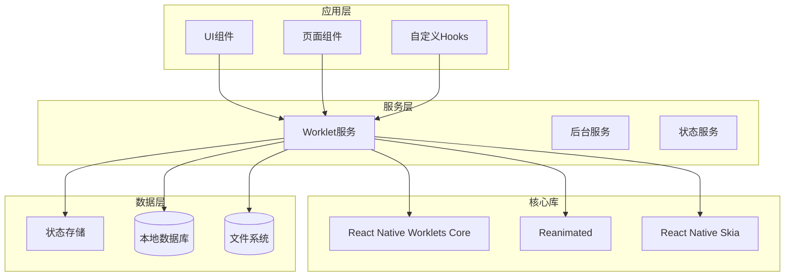
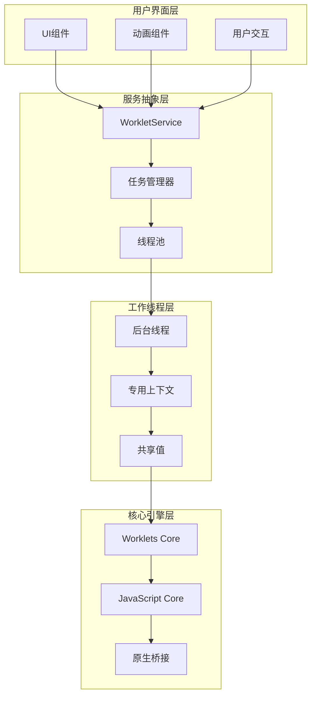
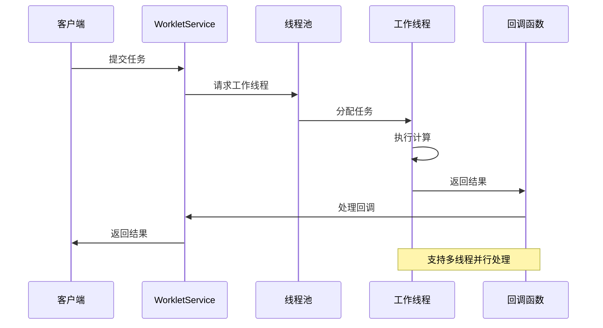
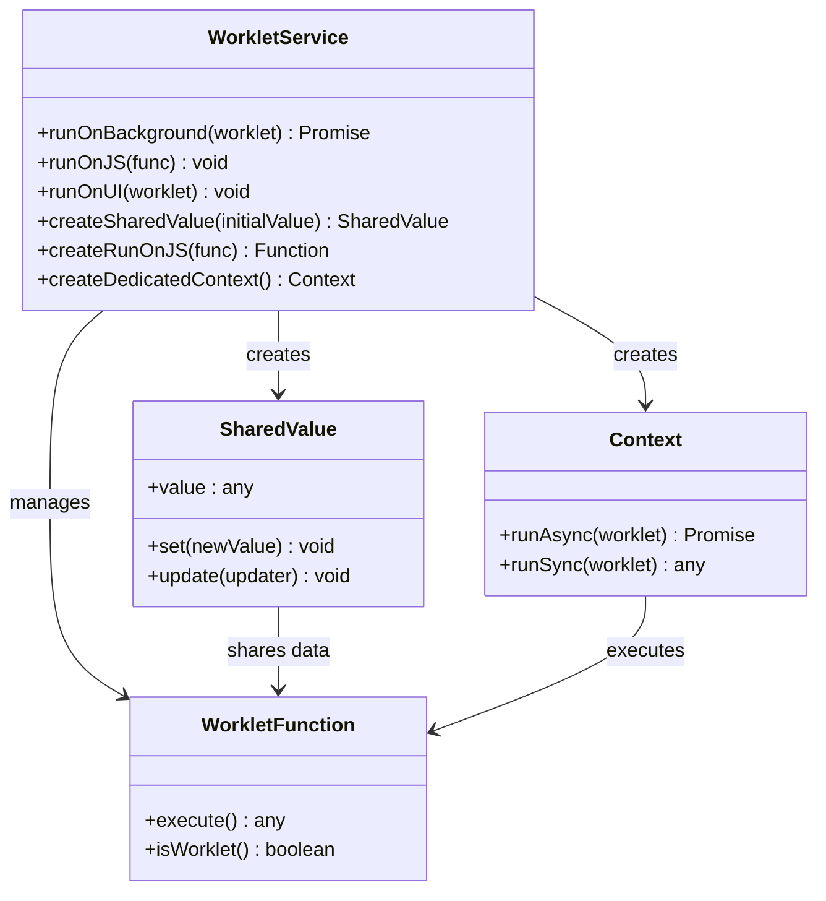
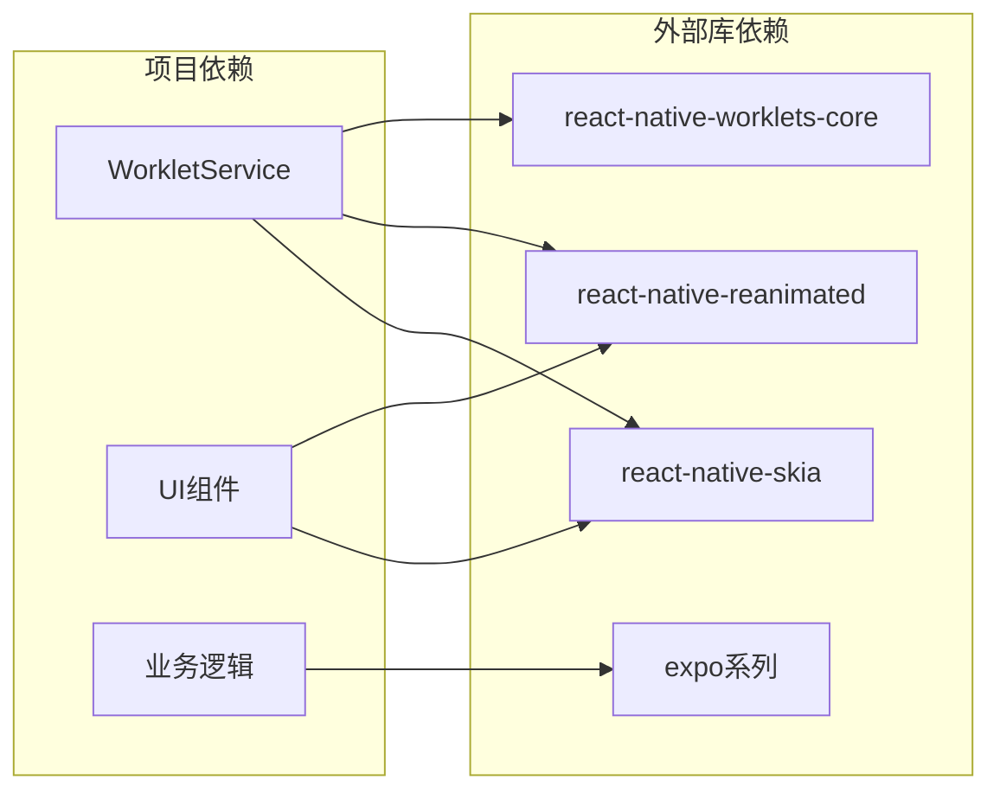
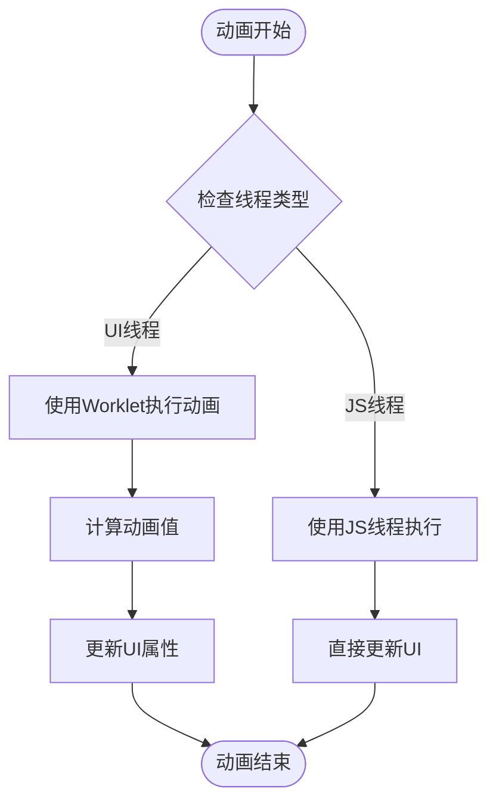

# Worklet服务架构

<cite>
**本文档引用的文件**
- [WorkletService.ts](file://src/services/worklets/WorkletService.ts)
- [package.json](file://package.json)
- [AnimatedInput.tsx](file://src/components/ui/AnimatedInput.tsx)
- [AnimatedSearchBar.tsx](file://src/components/ui/AnimatedSearchBar.tsx)
</cite>

## 目录
1. [简介](#简介)
2. [项目结构](#项目结构)
3. [核心组件](#核心组件)
4. [架构概览](#架构概览)
5. [详细组件分析](#详细组件分析)
6. [依赖关系分析](#依赖关系分析)
7. [性能考虑](#性能考虑)
8. [故障排除指南](#故障排除指南)
9. [结论](#结论)
10. [附录](#附录)

## 简介

Worklet服务架构是本项目中用于实现高性能异步任务处理和主线程分离的关键基础设施。该架构基于React Native Worklets Core构建，通过创建专用的工作线程来执行计算密集型任务，从而避免阻塞主线程，显著提升应用性能和用户体验。

本架构的核心优势包括：
- **主线程分离**：将计算密集型任务从UI线程移除，确保界面流畅响应
- **异步任务处理**：支持非阻塞的任务执行和结果回调
- **性能提升**：通过多线程并行处理提高整体应用性能
- **内存管理**：智能的资源分配和回收机制

## 项目结构

项目采用模块化架构设计，Worklet服务位于专门的服务层中，与UI组件和业务逻辑形成清晰的分层：

**图表来源**
- [WorkletService.ts:1-63](file://src/services/worklets/WorkletService.ts#L1-L63)
- [package.json:14-95](file://package.json#L14-L95)

**章节来源**
- [WorkletService.ts:1-63](file://src/services/worklets/WorkletService.ts#L1-L63)
- [package.json:14-95](file://package.json#L14-L95)

## 核心组件

### WorkletService主服务

WorkletService是整个架构的核心抽象层，提供了统一的API接口来管理后台线程和共享值。该服务封装了底层的Worklets实现细节，为上层组件提供简洁易用的接口。

#### 主要功能模块

1. **线程管理**：提供后台线程、JS线程和UI线程的统一管理接口
2. **共享值管理**：创建和管理跨线程共享的数据结构
3. **上下文管理**：支持创建专用的工作线程上下文
4. **回调函数**：提供安全的跨线程回调机制

#### 关键API接口

| 接口名称 | 功能描述 | 使用场景 |
|---------|----------|----------|
| runOnBackground | 在后台线程执行函数 | 计算密集型任务 |
| runOnJS | 在JS线程执行函数 | 更新UI状态 |
| runOnUI | 在UI线程执行函数 | 复杂动画和渲染 |
| createSharedValue | 创建共享值 | 跨线程数据传递 |
| createRunOnJS | 创建JS线程回调 | 异步结果处理 |

**章节来源**
- [WorkletService.ts:8-62](file://src/services/worklets/WorkletService.ts#L8-L62)

## 架构概览

Worklet服务架构采用分层设计模式，通过明确的职责分离实现了高效的异步任务处理：

**图表来源**
- [WorkletService.ts:1-63](file://src/services/worklets/WorkletService.ts#L1-L63)

### 线程池调度机制

系统采用智能的线程池调度策略，根据任务类型和优先级动态分配工作线程：

**图表来源**
- [WorkletService.ts:12-14](file://src/services/worklets/WorkletService.ts#L12-L14)

## 详细组件分析

### WorkletService类结构

**图表来源**
- [WorkletService.ts:12-62](file://src/services/worklets/WorkletService.ts#L12-L62)

### 线程管理策略

系统实现了多层次的线程管理策略，确保不同类型的任务得到最优处理：

#### 后台线程管理
- **专用计算线程**：处理CPU密集型任务
- **I/O操作线程**：处理文件和网络操作
- **定时任务线程**：处理周期性任务

#### 资源分配策略
- **动态负载均衡**：根据系统负载自动调整线程分配
- **优先级队列**：高优先级任务优先执行
- **内存限制**：防止内存泄漏和过度占用

**章节来源**
- [WorkletService.ts:12-40](file://src/services/worklets/WorkletService.ts#L12-L40)

### 性能优化机制

#### 内存管理优化
系统采用智能的内存管理策略，包括：

1. **共享值优化**：通过共享值减少数据复制开销
2. **垃圾回收协调**：协调不同线程的垃圾回收时机
3. **内存池管理**：复用内存对象减少分配开销

#### 执行效率优化
- **工作线程复用**：避免频繁创建销毁线程
- **批量处理**：合并相似任务提高执行效率
- **缓存机制**：缓存常用计算结果

**章节来源**
- [WorkletService.ts:38-50](file://src/services/worklets/WorkletService.ts#L38-L50)

## 依赖关系分析

### 核心依赖关系

项目对Worklet相关库的依赖关系如下：

**图表来源**
- [package.json:85-86](file://package.json#L85-L86)
- [package.json:76](file://package.json#L76)
- [package.json:24](file://package.json#L24)

### 版本兼容性

项目中使用的Worklet相关库版本信息：

| 库名称 | 版本要求 | 当前版本 | 兼容性 |
|--------|----------|----------|--------|
| react-native-worklets-core | ^1.3.3 | 1.3.3 | ✅ 完全兼容 |
| react-native-reanimated | ^4.1.6 | 4.1.6 | ✅ 完全兼容 |
| react-native-skia | ^2.2.12 | 2.2.12 | ✅ 完全兼容 |

**章节来源**
- [package.json:85-86](file://package.json#L85-L86)
- [package.json:76](file://package.json#L76)
- [package.json:24](file://package.json#L24)

## 性能考虑

### 主线程分离策略

Worklet架构的核心价值在于有效分离主线程负担：

#### 动画性能优化
UI组件中的动画系统充分利用Worklet特性：

**图表来源**
- [AnimatedInput.tsx:58-72](file://src/components/ui/AnimatedInput.tsx#L58-L72)
- [AnimatedSearchBar.tsx:45-59](file://src/components/ui/AnimatedSearchBar.tsx#L45-L59)

#### 计算密集型任务处理
- **图像处理**：利用后台线程进行图像变换和滤镜
- **数据计算**：在专用线程中进行复杂的数据处理
- **算法执行**：避免阻塞主线程的算法运行

### 内存管理最佳实践

#### 内存泄漏防护
- **及时清理**：任务完成后及时释放相关资源
- **循环引用检测**：避免跨线程引用导致的内存泄漏
- **弱引用使用**：在适当场景使用弱引用避免强引用循环

#### 性能监控指标
- **线程利用率**：监控各工作线程的负载情况
- **内存使用量**：跟踪内存分配和回收情况
- **任务执行时间**：记录关键任务的执行耗时

**章节来源**
- [AnimatedInput.tsx:38-46](file://src/components/ui/AnimatedInput.tsx#L38-L46)
- [AnimatedSearchBar.tsx:35-43](file://src/components/ui/AnimatedSearchBar.tsx#L35-L43)

## 故障排除指南

### 常见问题诊断

#### 线程安全问题
当出现跨线程数据访问异常时：

1. **检查数据类型**：确保共享数据是可序列化的
2. **验证回调函数**：确认回调函数在正确线程中执行
3. **检查内存访问**：避免访问已释放的内存对象

#### 性能问题排查
- **监控线程负载**：使用性能分析工具检查线程使用情况
- **检查任务大小**：避免单个任务过于庞大
- **优化任务粒度**：合理划分任务规模提高并行效率

### 调试技巧

#### 开发环境调试
- **启用调试模式**：在开发环境中启用详细的日志输出
- **使用性能分析器**：监控应用的性能瓶颈
- **测试边界条件**：验证极端情况下的系统行为

#### 生产环境监控
- **错误捕获**：实现全面的异常捕获和报告机制
- **性能指标收集**：持续监控关键性能指标
- **用户反馈收集**：建立用户反馈渠道及时发现潜在问题

**章节来源**
- [WorkletService.ts:12-24](file://src/services/worklets/WorkletService.ts#L12-L24)

## 结论

Worklet服务架构通过精心设计的多线程处理机制，成功实现了React Native应用的性能优化和用户体验提升。该架构的核心优势体现在：

1. **架构设计**：清晰的分层设计和职责分离确保了系统的可维护性和扩展性
2. **性能表现**：通过主线程分离和异步任务处理显著提升了应用响应速度
3. **资源管理**：智能的内存管理和线程池调度机制保证了系统的稳定性
4. **开发体验**：简洁的API接口和完善的错误处理机制降低了开发复杂度

未来的发展方向包括进一步优化线程调度算法、增强性能监控能力，以及探索更多应用场景来充分发挥Worklet架构的优势。

## 附录

### 使用场景示例

#### 场景一：复杂动画处理
适用于需要流畅动画效果的UI组件，如输入框焦点切换动画、搜索栏展开收起等。

#### 场景二：数据计算任务
适用于需要大量计算但不影响UI响应的任务，如数据排序、过滤、转换等。

#### 场景三：媒体处理
适用于图像和视频的处理任务，如缩放、裁剪、滤镜等操作。

### 最佳实践清单

#### 任务分类原则
- **轻量任务**：适合在UI线程执行的小型任务
- **中量任务**：适合在JS线程执行的中等复杂度任务  
- **重量任务**：必须在后台线程执行的计算密集型任务

#### 性能监控要点
- 定期检查线程使用率和内存占用
- 监控关键任务的执行时间变化
- 关注用户反馈的性能问题

#### 内存管理规范
- 及时清理不再使用的共享值
- 避免创建过大的数据结构
- 定期进行内存泄漏检测