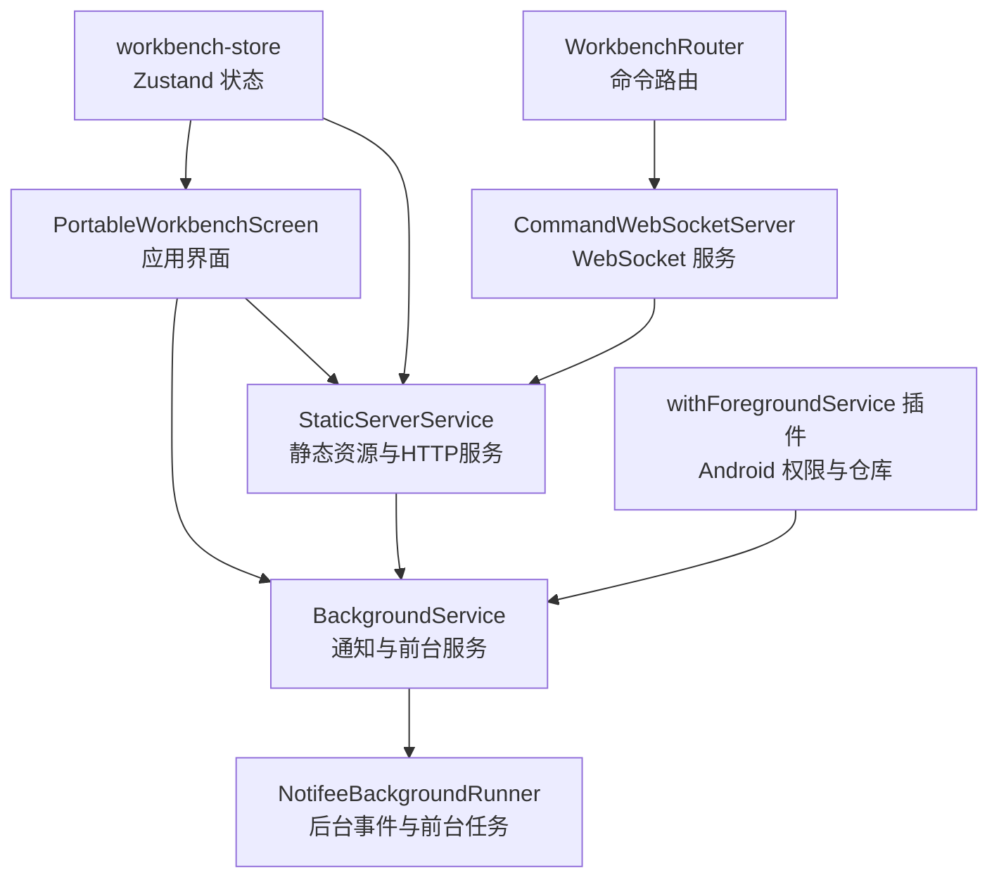
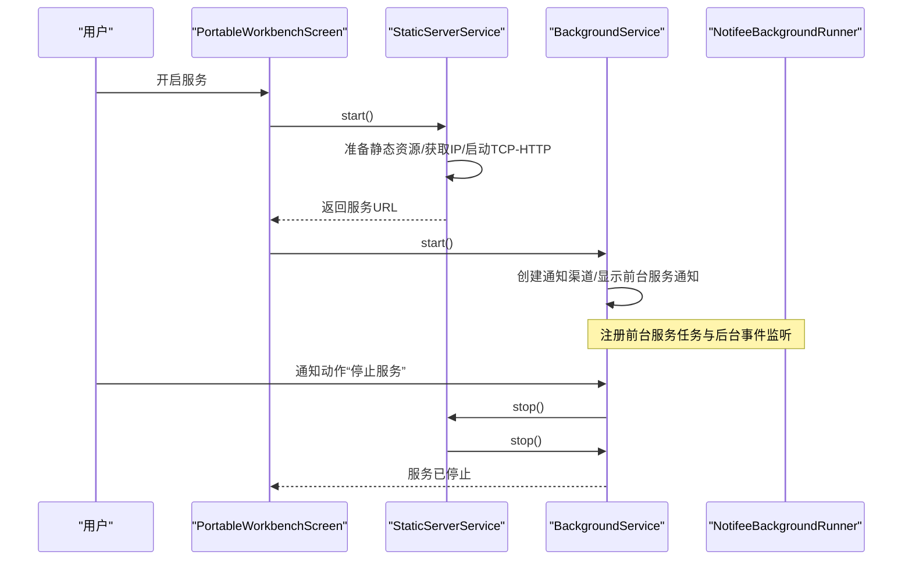
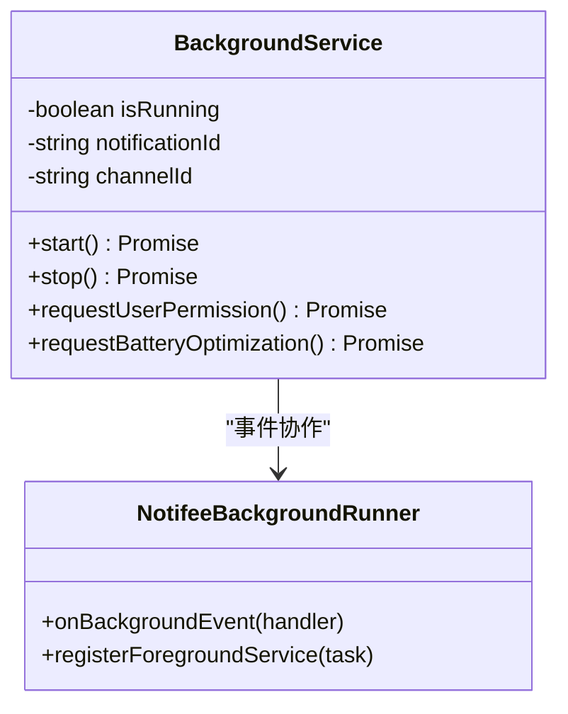
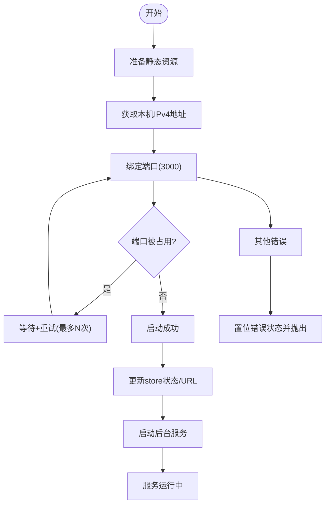
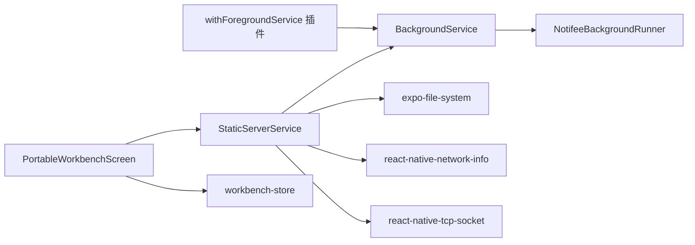

# 后台服务管理

<cite>
**本文引用的文件**
- [BackgroundService.ts](file://src/services/BackgroundService.ts)
- [NotifeeBackgroundRunner.ts](file://src/services/NotifeeBackgroundRunner.ts)
- [withForegroundService.js](file://plugins/withForegroundService.js)
- [StaticServerService.ts](file://src/services/workbench/StaticServerService.ts)
- [workbench.tsx](file://app/settings/workbench.tsx)
- [workbench-store.ts](file://src/store/workbench-store.ts)
- [CommandWebSocketServer.ts](file://src/services/workbench/CommandWebSocketServer.ts)
- [WorkbenchRouter.ts](file://src/services/workbench/WorkbenchRouter.ts)
</cite>

## 目录
1. [简介](#简介)
2. [项目结构](#项目结构)
3. [核心组件](#核心组件)
4. [架构总览](#架构总览)
5. [组件详细分析](#组件详细分析)
6. [依赖关系分析](#依赖关系分析)
7. [性能与稳定性考量](#性能与稳定性考量)
8. [故障排查指南](#故障排查指南)
9. [结论](#结论)
10. [附录：配置与最佳实践](#附录配置与最佳实践)

## 简介
本文件面向后台服务管理的技术文档，围绕 BackgroundService 类的设计与实现进行系统化剖析，涵盖以下主题：
- 前台服务的启动与停止流程
- 通知系统的集成方式（渠道、动作、前台服务类型）
- 权限管理与电池优化处理
- 服务生命周期管理、事件监听机制与用户交互处理
- Android 平台特定实现细节
- 服务监控、错误处理与性能优化最佳实践
- 具体代码示例路径与配置选项说明

## 项目结构
与后台服务管理直接相关的模块分布如下：
- 服务层：BackgroundService（通知与前台服务）、StaticServerService（静态资源与 TCP-HTTP 服务）、NotifeeBackgroundRunner（后台事件与前台任务注册）
- 插件层：withForegroundService（Android 清单与仓库配置）
- 应用层：PortableWorkbenchScreen（UI 控制开关与权限引导）
- 状态层：workbench-store（Zustand 存储）
- 路由与命令：WorkbenchRouter、CommandWebSocketServer（与后台服务协同）

**图表来源**
- [workbench.tsx:24-79](file://app/settings/workbench.tsx#L24-L79)
- [StaticServerService.ts:24-236](file://src/services/workbench/StaticServerService.ts#L24-L236)
- [BackgroundService.ts:8-71](file://src/services/BackgroundService.ts#L8-L71)
- [NotifeeBackgroundRunner.ts:1-27](file://src/services/NotifeeBackgroundRunner.ts#L1-L27)
- [withForegroundService.js:7-69](file://plugins/withForegroundService.js#L7-L69)
- [workbench-store.ts:22-55](file://src/store/workbench-store.ts#L22-L55)
- [CommandWebSocketServer.ts:1-212](file://src/services/workbench/CommandWebSocketServer.ts#L1-L212)
- [WorkbenchRouter.ts:18-72](file://src/services/workbench/WorkbenchRouter.ts#L18-L72)

**章节来源**
- [workbench.tsx:24-79](file://app/settings/workbench.tsx#L24-L79)
- [StaticServerService.ts:24-236](file://src/services/workbench/StaticServerService.ts#L24-L236)
- [BackgroundService.ts:8-71](file://src/services/BackgroundService.ts#L8-L71)
- [NotifeeBackgroundRunner.ts:1-27](file://src/services/NotifeeBackgroundRunner.ts#L1-L27)
- [withForegroundService.js:7-69](file://plugins/withForegroundService.js#L7-L69)
- [workbench-store.ts:22-55](file://src/store/workbench-store.ts#L22-L55)
- [CommandWebSocketServer.ts:1-212](file://src/services/workbench/CommandWebSocketServer.ts#L1-L212)
- [WorkbenchRouter.ts:18-72](file://src/services/workbench/WorkbenchRouter.ts#L18-L72)

## 核心组件
- BackgroundService：封装通知渠道创建、前台服务显示、通知动作监听、权限请求与电池优化引导等能力
- StaticServerService：负责静态资源准备、TCP-HTTP 服务启动与停止、端口占用重试、客户端连接与错误处理
- NotifeeBackgroundRunner：注册前台服务任务、处理后台通知动作（如“停止服务”）
- withForegroundService 插件：自动注入 Android 前台服务所需权限与仓库配置
- PortableWorkbenchScreen：用户交互入口，触发服务启停、权限请求与展示运行状态
- workbench-store：持久化存储服务状态、URL、访问码、连接数等
- CommandWebSocketServer 与 WorkbenchRouter：为工作台提供 WebSocket 通信与命令路由

**章节来源**
- [BackgroundService.ts:3-116](file://src/services/BackgroundService.ts#L3-L116)
- [StaticServerService.ts:21-301](file://src/services/workbench/StaticServerService.ts#L21-L301)
- [NotifeeBackgroundRunner.ts:1-27](file://src/services/NotifeeBackgroundRunner.ts#L1-L27)
- [withForegroundService.js:7-72](file://plugins/withForegroundService.js#L7-L72)
- [workbench.tsx:24-79](file://app/settings/workbench.tsx#L24-L79)
- [workbench-store.ts:5-20](file://src/store/workbench-store.ts#L5-L20)
- [CommandWebSocketServer.ts:33-212](file://src/services/workbench/CommandWebSocketServer.ts#L33-L212)
- [WorkbenchRouter.ts:18-72](file://src/services/workbench/WorkbenchRouter.ts#L18-L72)

## 架构总览
后台服务管理的整体流程如下：
- 用户在 UI 中开启服务，触发 StaticServerService.start()
- StaticServerService 准备静态资源、获取本机 IP、启动 TCP-HTTP 服务
- 启动成功后调用 BackgroundService.start()，创建通知渠道并以前台服务形式显示通知
- 用户通过通知动作或 UI 按钮触发停止，依次调用 StaticServerService.stop() 与 BackgroundService.stop()

**图表来源**
- [workbench.tsx:50-79](file://app/settings/workbench.tsx#L50-L79)
- [StaticServerService.ts:24-236](file://src/services/workbench/StaticServerService.ts#L24-L236)
- [BackgroundService.ts:8-83](file://src/services/BackgroundService.ts#L8-L83)
- [NotifeeBackgroundRunner.ts:5-25](file://src/services/NotifeeBackgroundRunner.ts#L5-L25)

## 组件详细分析

### BackgroundService 类设计与实现
- 设计要点
  - 单例模式：导出一个实例，避免重复启动
  - 状态标记：isRunning 防止重复启动
  - 通知渠道：channelId/nexara-service；重要性低、无灯光/震动
  - 前台服务类型：数据同步（dataSync），确保系统允许长时间运行
  - 动作按钮：通知中提供“停止服务”，支持前台与后台事件监听
  - 权限与电池优化：主动请求通知权限；Android 下提供打开系统设置的入口

- 关键方法
  - start()：权限请求 → 注册通知动作监听 → 创建通知渠道 → 显示前台服务通知
  - stop()：停止前台服务 → 取消通知 → 置位 isRunning
  - requestUserPermission()：请求通知权限
  - requestBatteryOptimization()：打开系统电池优化设置页（Android）

- 事件监听
  - onForegroundEvent：应用处于前台时响应通知动作
  - onBackgroundEvent：应用在后台但进程存活时响应通知动作
  - NotifeeBackgroundRunner.onBackgroundEvent：补充处理被杀状态下后台事件

- Android 特定实现
  - 使用 AndroidForegroundServiceType.FOREGROUND_SERVICE_TYPE_DATA_SYNC
  - 通过插件自动注入 FOREGROUND_SERVICE 与 FOREGROUND_SERVICE_DATA_SYNC 权限
  - 自动注入 Notifee 本地 Maven 仓库地址

**图表来源**
- [BackgroundService.ts:3-116](file://src/services/BackgroundService.ts#L3-L116)
- [NotifeeBackgroundRunner.ts:1-27](file://src/services/NotifeeBackgroundRunner.ts#L1-L27)

**章节来源**
- [BackgroundService.ts:3-116](file://src/services/BackgroundService.ts#L3-L116)
- [NotifeeBackgroundRunner.ts:1-27](file://src/services/NotifeeBackgroundRunner.ts#L1-L27)
- [withForegroundService.js:7-72](file://plugins/withForegroundService.js#L7-L72)

### StaticServerService 启停流程与错误处理
- 启动流程
  - 准备静态资源：下载并复制 HTML/JS/CSS 到本地目录
  - 获取本机 IPv4 地址，尝试绑定端口（默认 3000）
  - 若端口被占用，执行有限次数重试（指数退避）
  - 启动成功后更新 store 状态与 URL，并调用 backgroundService.start()

- 停止流程
  - 关闭 TCP 服务 → 调用 backgroundService.stop() → 清理 store 状态

- 错误处理
  - 端口占用：捕获 EADDRINUSE，重试直至耗尽
  - 文件读写：异常时返回 500 并关闭连接
  - 启停失败：记录错误并置位错误状态

**图表来源**
- [StaticServerService.ts:24-236](file://src/services/workbench/StaticServerService.ts#L24-L236)

**章节来源**
- [StaticServerService.ts:24-236](file://src/services/workbench/StaticServerService.ts#L24-L236)
- [workbench-store.ts:22-55](file://src/store/workbench-store.ts#L22-L55)

### NotifeeBackgroundRunner 与前台服务任务
- 作用
  - 注册前台服务任务：返回永不 resolve 的 Promise，保持前台服务常驻
  - 处理后台通知动作：当用户点击通知中的“停止服务”时，停止静态服务器并取消通知

- 与 BackgroundService 的协作
  - BackgroundService 在前台/后台均注册动作监听，优先在应用内处理
  - NotifeeBackgroundRunner 作为兜底，处理应用被杀后的后台事件

**章节来源**
- [NotifeeBackgroundRunner.ts:1-27](file://src/services/NotifeeBackgroundRunner.ts#L1-L27)

### 工作台 UI 与状态联动
- UI 行为
  - 开关切换：触发 StaticServerService.start()/stop() 与 CommandWebSocketServer.start()/stop()
  - 权限引导：提供“授予通知权限”“忽略电池优化”入口
  - 运行状态：根据 store 更新 UI 状态与提示

- 状态管理
  - serverStatus：idle/starting/running/error
  - serverUrl/accessCode/connectedClients：用于 UI 展示与分享
  - 仅持久化部分字段，避免冗余

**章节来源**
- [workbench.tsx:24-79](file://app/settings/workbench.tsx#L24-L79)
- [workbench-store.ts:5-20](file://src/store/workbench-store.ts#L5-L20)

### WebSocket 与命令路由（扩展能力）
- CommandWebSocketServer
  - 基于 TCP Socket 实现简易 HTTP/WS 服务，支持握手、帧解析、心跳与清理
  - 提供 start()/stop() 生命周期管理

- WorkbenchRouter
  - 注册命令处理器，按消息类型分发处理
  - 支持请求-响应模式与错误回包

**章节来源**
- [CommandWebSocketServer.ts:33-212](file://src/services/workbench/CommandWebSocketServer.ts#L33-L212)
- [WorkbenchRouter.ts:18-72](file://src/services/workbench/WorkbenchRouter.ts#L18-L72)

## 依赖关系分析
- 组件耦合
  - StaticServerService 依赖 BackgroundService（启动成功后调用）
  - PortableWorkbenchScreen 依赖 StaticServerService 与 BackgroundService（启停与权限）
  - NotifeeBackgroundRunner 与 BackgroundService 通过 Notifee 事件协作
  - 插件与 Android 清单/仓库配置强关联，影响前台服务可用性

- 外部依赖
  - @notifee/react-native：通知渠道、前台服务、事件监听
  - react-native-tcp-socket：TCP-HTTP 服务
  - expo-file-system/network-info：文件读写与网络信息
  - expo-keep-awake：运行时保持屏幕唤醒

**图表来源**
- [workbench.tsx:24-79](file://app/settings/workbench.tsx#L24-L79)
- [StaticServerService.ts:21-301](file://src/services/workbench/StaticServerService.ts#L21-L301)
- [BackgroundService.ts:1-116](file://src/services/BackgroundService.ts#L1-L116)
- [NotifeeBackgroundRunner.ts:1-27](file://src/services/NotifeeBackgroundRunner.ts#L1-L27)
- [withForegroundService.js:7-72](file://plugins/withForegroundService.js#L7-L72)
- [workbench-store.ts:22-55](file://src/store/workbench-store.ts#L22-L55)

## 性能与稳定性考量
- 端口占用与重试
  - 当端口被占用时，采用指数退避重试，降低竞争冲突
  - 重试上限避免无限等待

- 网络与 I/O
  - 采用分块写入（16KB）提升大文件传输稳定性
  - 对 socket 写入失败进行容错，避免崩溃

- 通知与前台服务
  - 使用低重要性通知，减少打扰
  - 设置 ongoing 与前台服务类型，降低被系统回收概率

- 电池优化
  - 提供一键跳转系统设置入口，便于用户忽略电池优化
  - 建议在 UI 中提供“最近任务锁定”提示，减少被系统清理

- WebSocket 与命令路由
  - 提供心跳与清理定时器，避免资源泄漏
  - 请求-响应模式与错误回包，提升健壮性

**章节来源**
- [StaticServerService.ts:147-177](file://src/services/workbench/StaticServerService.ts#L147-L177)
- [CommandWebSocketServer.ts:176-187](file://src/services/workbench/CommandWebSocketServer.ts#L176-L187)
- [WorkbenchRouter.ts:34-71](file://src/services/workbench/WorkbenchRouter.ts#L34-L71)

## 故障排查指南
- 无法启动静态服务
  - 检查端口占用：观察日志中 EADDRINUSE 与重试次数
  - 确认网络权限与 IP 获取：确保设备在同一局域网
  - 查看文件准备阶段异常：检查资源复制与缓存

- 通知不显示或无法停止
  - 确认通知权限是否授予：调用 requestUserPermission()
  - 检查 Android 前台服务权限：插件是否正确注入
  - 观察 Notifee 事件监听：确认 onForegroundEvent/onBackgroundEvent 是否注册

- 电池优化导致服务被杀
  - 引导用户忽略电池优化：使用 requestBatteryOptimization()
  - 提示用户将应用锁定在最近任务中

- WebSocket 客户端异常
  - 检查握手与认证流程：确保客户端按规范发送握手头
  - 关注路由处理器返回值与错误回包

**章节来源**
- [StaticServerService.ts:196-212](file://src/services/workbench/StaticServerService.ts#L196-L212)
- [BackgroundService.ts:85-113](file://src/services/BackgroundService.ts#L85-L113)
- [workbench.tsx:195-230](file://app/settings/workbench.tsx#L195-L230)
- [CommandWebSocketServer.ts:192-212](file://src/services/workbench/CommandWebSocketServer.ts#L192-L212)
- [WorkbenchRouter.ts:34-71](file://src/services/workbench/WorkbenchRouter.ts#L34-L71)

## 结论
本后台服务管理方案通过 Notifee 前台服务与通知系统，结合静态资源与 TCP-HTTP 服务，实现了稳定的本地工作台服务。配合插件自动注入权限与仓库、UI 的启停控制与权限引导、以及完善的错误处理与性能优化策略，能够在多种 Android 环境下可靠运行。建议在生产环境中进一步完善：
- 增加更细粒度的日志与监控上报
- 提供可配置的通知渠道与前台服务类型
- 加强 WebSocket 的鉴权与限流策略

## 附录：配置与最佳实践
- Android 权限与仓库配置
  - 自动注入 FOREGROUND_SERVICE 与 FOREGROUND_SERVICE_DATA_SYNC 权限
  - 注入 Notifee 本地 Maven 仓库地址，确保原生依赖可用

- 通知渠道与前台服务类型
  - 重要性：低
  - 前台服务类型：数据同步（dataSync）
  - 动作按钮：提供“停止服务”

- 权限与电池优化
  - 主动请求通知权限
  - 提供一键打开系统设置的入口，引导用户忽略电池优化

- 服务启停与 UI 协同
  - UI 开关统一调度 StaticServerService 与 BackgroundService
  - 状态持久化到 workbench-store，支持重启恢复

- 代码示例路径（不含具体代码内容）
  - 启动流程：[workbench.tsx:50-79](file://app/settings/workbench.tsx#L50-L79)、[StaticServerService.ts:24-236](file://src/services/workbench/StaticServerService.ts#L24-L236)、[BackgroundService.ts:8-71](file://src/services/BackgroundService.ts#L8-L71)
  - 停止流程：[StaticServerService.ts:238-248](file://src/services/workbench/StaticServerService.ts#L238-L248)、[BackgroundService.ts:73-83](file://src/services/BackgroundService.ts#L73-L83)
  - 通知动作监听：[BackgroundService.ts:18-30](file://src/services/BackgroundService.ts#L18-L30)、[NotifeeBackgroundRunner.ts:5-17](file://src/services/NotifeeBackgroundRunner.ts#L5-L17)
  - 权限与电池优化：[BackgroundService.ts:85-113](file://src/services/BackgroundService.ts#L85-L113)、[workbench.tsx:195-230](file://app/settings/workbench.tsx#L195-L230)
  - 端口占用与重试：[StaticServerService.ts:196-212](file://src/services/workbench/StaticServerService.ts#L196-L212)
  - 分块写入与错误处理：[StaticServerService.ts:147-177](file://src/services/workbench/StaticServerService.ts#L147-L177)
  - WebSocket 与路由：[CommandWebSocketServer.ts:192-212](file://src/services/workbench/CommandWebSocketServer.ts#L192-L212)、[WorkbenchRouter.ts:34-71](file://src/services/workbench/WorkbenchRouter.ts#L34-L71)