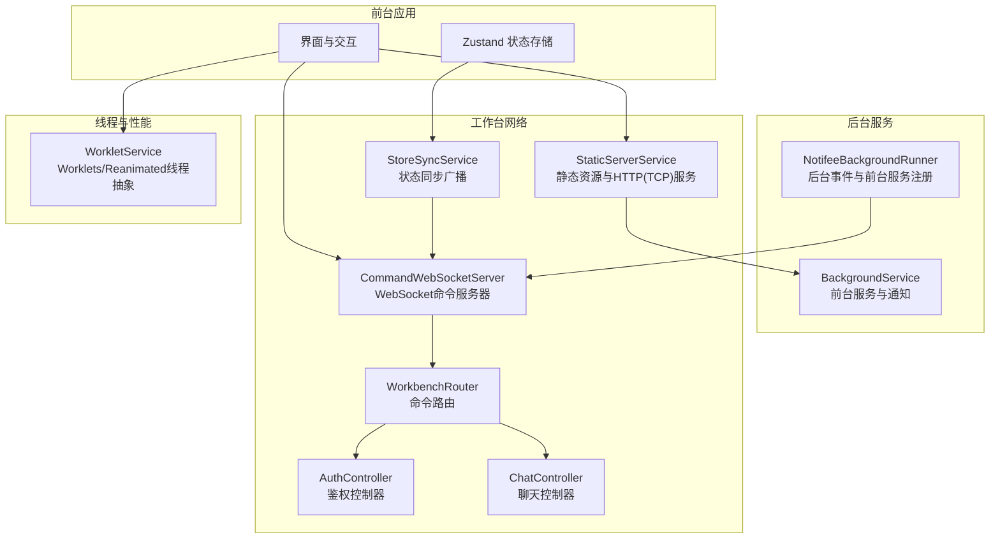
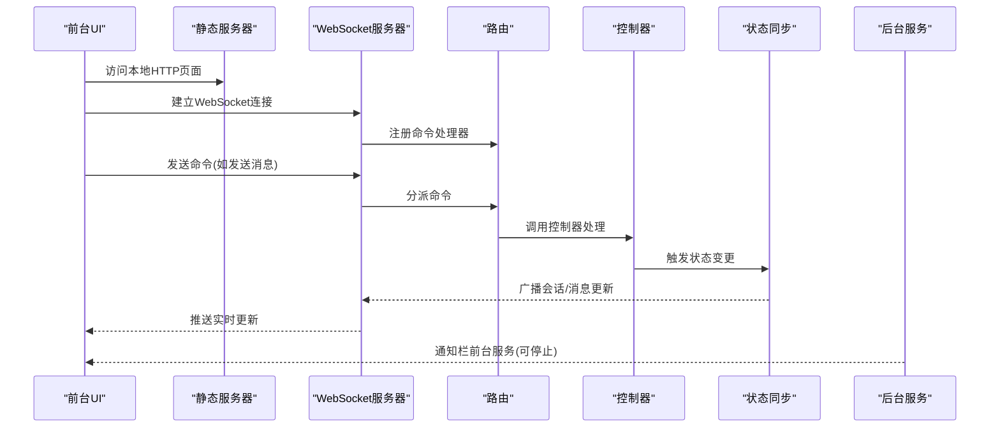
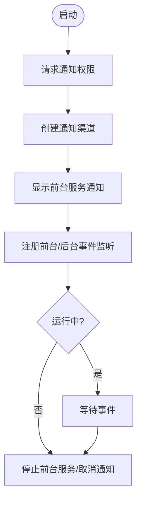
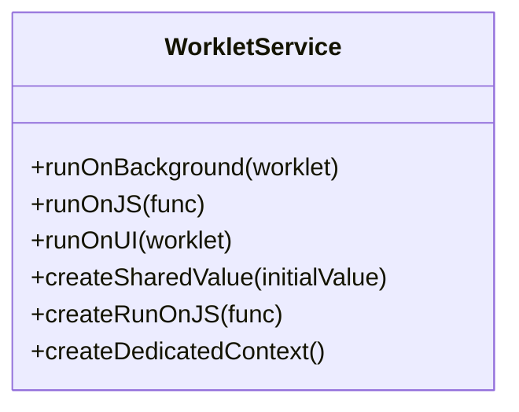
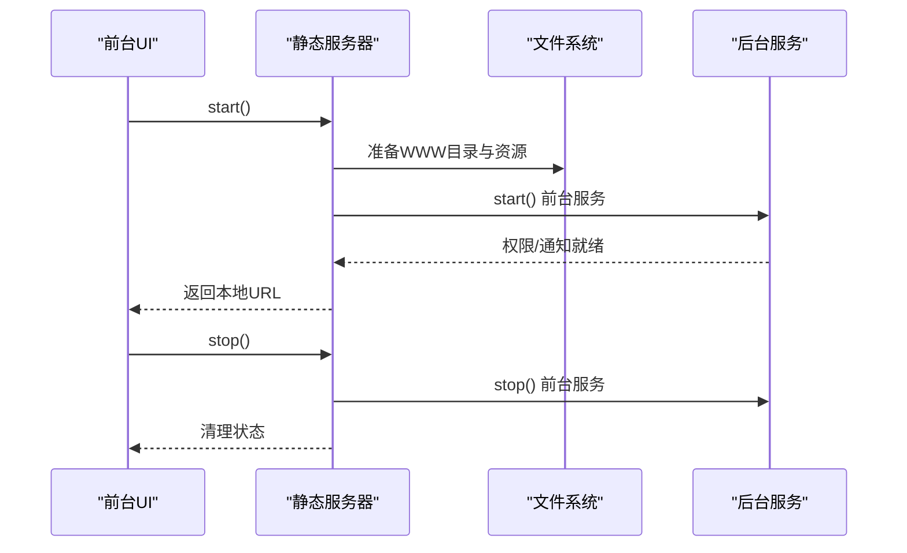
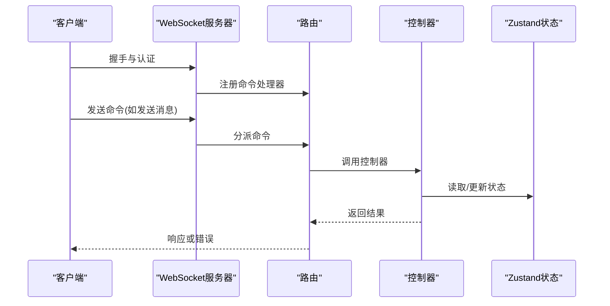
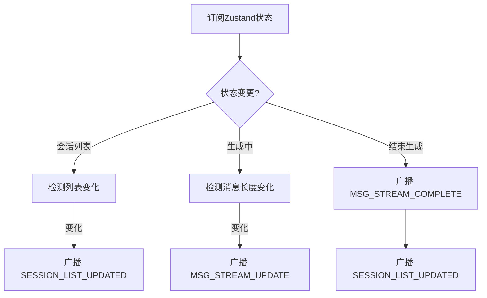
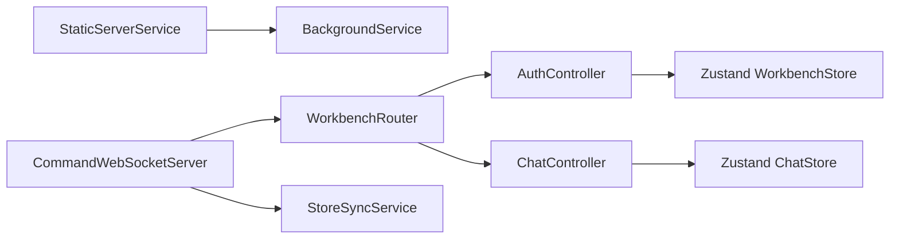

# 服务层设计

<cite>
**本文引用的文件**
- [BackgroundService.ts](file://src/services/BackgroundService.ts)
- [NotifeeBackgroundRunner.ts](file://src/services/NotifeeBackgroundRunner.ts)
- [WorkletService.ts](file://src/services/worklets/WorkletService.ts)
- [StaticServerService.ts](file://src/services/workbench/StaticServerService.ts)
- [CommandWebSocketServer.ts](file://src/services/workbench/CommandWebSocketServer.ts)
- [StoreSyncService.ts](file://src/services/workbench/StoreSyncService.ts)
- [WorkbenchRouter.ts](file://src/services/workbench/WorkbenchRouter.ts)
- [workbench-store.ts](file://src/store/workbench-store.ts)
- [AuthController.ts](file://src/services/workbench/controllers/AuthController.ts)
- [ChatController.ts](file://src/services/workbench/controllers/ChatController.ts)
</cite>

## 目录
1. [引言](#引言)
2. [项目结构](#项目结构)
3. [核心组件](#核心组件)
4. [架构总览](#架构总览)
5. [详细组件分析](#详细组件分析)
6. [依赖关系分析](#依赖关系分析)
7. [性能考量](#性能考量)
8. [故障排查指南](#故障排查指南)
9. [结论](#结论)
10. [附录](#附录)

## 引言
本文件系统性阐述 Nexara 的服务层设计，重点覆盖后台服务、通知服务与 Worklet 服务三大部分，并深入解析工作台（Workbench）的静态服务器、命令 WebSocket 服务器、路由与状态同步机制。文档从设计理念、实现机制、生命周期管理、任务调度与资源控制、通知系统集成与用户体验优化、Worklet 在性能优化中的作用与原理、服务间通信与依赖注入模式，以及服务监控、错误处理与性能调优最佳实践等方面进行全方位解读。

## 项目结构
服务层位于 src/services 及其子目录中，围绕“前台运行时 + 后台服务 + 通知通道 + 工作台网络服务”的整体架构展开。核心模块包括：
- 后台服务与通知：BackgroundService、NotifeeBackgroundRunner
- Worklet 线程与共享值：WorkletService
- 工作台静态服务器：StaticServerService
- 命令 WebSocket 服务器：CommandWebSocketServer
- 路由与控制器：WorkbenchRouter、AuthController、ChatController
- 状态同步：StoreSyncService
- 工作台状态存储：workbench-store

图表来源
- [StaticServerService.ts:24-236](file://src/services/workbench/StaticServerService.ts#L24-L236)
- [CommandWebSocketServer.ts:44-178](file://src/services/workbench/CommandWebSocketServer.ts#L44-L178)
- [WorkbenchRouter.ts:18-75](file://src/services/workbench/WorkbenchRouter.ts#L18-L75)
- [AuthController.ts:17-55](file://src/services/workbench/controllers/AuthController.ts#L17-L55)
- [ChatController.ts:5-130](file://src/services/workbench/controllers/ChatController.ts#L5-L130)
- [StoreSyncService.ts:15-124](file://src/services/workbench/StoreSyncService.ts#L15-L124)
- [BackgroundService.ts:8-83](file://src/services/BackgroundService.ts#L8-L83)
- [NotifeeBackgroundRunner.ts:5-28](file://src/services/NotifeeBackgroundRunner.ts#L5-L28)
- [WorkletService.ts:12-62](file://src/services/worklets/WorkletService.ts#L12-L62)

章节来源
- [StaticServerService.ts:24-236](file://src/services/workbench/StaticServerService.ts#L24-L236)
- [CommandWebSocketServer.ts:44-178](file://src/services/workbench/CommandWebSocketServer.ts#L44-L178)
- [WorkbenchRouter.ts:18-75](file://src/services/workbench/WorkbenchRouter.ts#L18-L75)
- [AuthController.ts:17-55](file://src/services/workbench/controllers/AuthController.ts#L17-L55)
- [ChatController.ts:5-130](file://src/services/workbench/controllers/ChatController.ts#L5-L130)
- [StoreSyncService.ts:15-124](file://src/services/workbench/StoreSyncService.ts#L15-L124)
- [BackgroundService.ts:8-83](file://src/services/BackgroundService.ts#L8-L83)
- [NotifeeBackgroundRunner.ts:5-28](file://src/services/NotifeeBackgroundRunner.ts#L5-L28)
- [WorkletService.ts:12-62](file://src/services/worklets/WorkletService.ts#L12-L62)

## 核心组件
- 后台服务与通知：通过 Notifee 提供前台服务与通知通道，支持用户在通知栏直接停止服务；同时提供权限请求与电池优化引导。
- Worklet 服务：封装 react-native-worklets-core 与 Reanimated 的 runOnUI/runOnJS，统一后台线程、JS/UI 线程与共享值的抽象。
- 静态服务器：基于 TCP Socket 实现简易 HTTP 服务器，打包并分发 Web 客户端资源，提供本地局域网访问。
- 命令 WebSocket 服务器：自定义 WebSocket 协议实现（含握手、帧解析、心跳、Ping/Pong），承载工作台命令与状态同步。
- 路由与控制器：集中式路由注册命令类型到控制器方法，控制器读取 Zustand 状态并执行业务逻辑。
- 状态同步：监听 Zustand 状态变化，按需向已认证客户端广播会话列表更新与消息流式更新。
- 工作台状态存储：持久化工作台状态（如访问码、令牌、连接数等），并与 UI 组件解耦。

章节来源
- [BackgroundService.ts:8-83](file://src/services/BackgroundService.ts#L8-L83)
- [WorkletService.ts:12-62](file://src/services/worklets/WorkletService.ts#L12-L62)
- [StaticServerService.ts:24-236](file://src/services/workbench/StaticServerService.ts#L24-L236)
- [CommandWebSocketServer.ts:44-178](file://src/services/workbench/CommandWebSocketServer.ts#L44-L178)
- [WorkbenchRouter.ts:18-75](file://src/services/workbench/WorkbenchRouter.ts#L18-L75)
- [StoreSyncService.ts:15-124](file://src/services/workbench/StoreSyncService.ts#L15-L124)
- [workbench-store.ts:22-56](file://src/store/workbench-store.ts#L22-L56)

## 架构总览
下图展示服务层的整体交互：前台 UI 通过静态服务器与 WebSocket 与后端服务通信；后台服务负责前台服务与通知；Worklet 抽象用于跨线程协作；路由与控制器解耦业务逻辑；状态同步服务将本地状态变更广播给已认证客户端。

图表来源
- [StaticServerService.ts:24-236](file://src/services/workbench/StaticServerService.ts#L24-L236)
- [CommandWebSocketServer.ts:44-178](file://src/services/workbench/CommandWebSocketServer.ts#L44-L178)
- [WorkbenchRouter.ts:18-75](file://src/services/workbench/WorkbenchRouter.ts#L18-L75)
- [ChatController.ts:75-95](file://src/services/workbench/controllers/ChatController.ts#L75-L95)
- [StoreSyncService.ts:34-123](file://src/services/workbench/StoreSyncService.ts#L34-L123)
- [BackgroundService.ts:8-83](file://src/services/BackgroundService.ts#L8-L83)

## 详细组件分析

### 后台服务与通知系统
- 生命周期管理
  - 启动：检查并请求通知权限；创建通知渠道；以前台服务形式显示常驻通知；注册前台事件与后台事件监听器，响应“停止服务”动作。
  - 停止：停止前台服务、取消通知、重置运行标志。
  - 电池优化：提供跳转系统设置的入口，便于用户解除电池优化限制。
- 用户体验优化
  - 使用低重要性通知通道，避免打扰；提供通知栏快捷操作，一键停止服务。
  - 前台服务类型明确为数据同步类，符合平台规范。
- 错误处理
  - 启停过程捕获异常并记录日志，避免崩溃；对常见网络断开错误进行静默清理。

图表来源
- [BackgroundService.ts:8-83](file://src/services/BackgroundService.ts#L8-L83)

章节来源
- [BackgroundService.ts:8-83](file://src/services/BackgroundService.ts#L8-L83)
- [NotifeeBackgroundRunner.ts:5-28](file://src/services/NotifeeBackgroundRunner.ts#L5-L28)

### Worklet 服务与性能优化
- 设计理念
  - 将后台线程、JS 线程与 UI 线程抽象为统一接口，屏蔽底层差异，降低跨线程编程复杂度。
- 关键能力
  - 后台线程：在默认上下文中异步执行计算密集型任务。
  - JS 线程回调：在 JS 线程执行回调，适合更新状态或触发 UI 更新。
  - UI 线程：通过 Reanimated 的 runOnUI 切换至 UI 线程，保证渲染安全。
  - 共享值：跨线程共享状态，减少主线程压力。
  - 上下文：支持创建专用上下文隔离任务。
- 性能影响
  - 将耗时计算移出主线程，避免阻塞 UI；通过共享值与回调机制实现高效状态同步。

图表来源
- [WorkletService.ts:12-62](file://src/services/worklets/WorkletService.ts#L12-L62)

章节来源
- [WorkletService.ts:12-62](file://src/services/worklets/WorkletService.ts#L12-L62)

### 工作台静态服务器与本地 HTTP 服务
- 功能职责
  - 打包并缓存 Web 客户端资源到应用文档目录；监听本地端口提供静态文件服务；支持 SPA 回退。
  - 获取本机 IPv4 地址，生成可访问 URL；启动后台服务并请求电池优化。
- 资源准备
  - 通过 Expo Asset 下载并复制 HTML、JS、CSS、图标等资源，确保路径与引用一致。
- 错误处理与重试
  - 端口占用时自动重试并指数回退；异常时设置状态为错误并清理资源。
- 与后台服务联动
  - 启停时同步控制 Notifee 前台服务与通知状态。

图表来源
- [StaticServerService.ts:24-236](file://src/services/workbench/StaticServerService.ts#L24-L236)
- [BackgroundService.ts:8-83](file://src/services/BackgroundService.ts#L8-L83)

章节来源
- [StaticServerService.ts:24-236](file://src/services/workbench/StaticServerService.ts#L24-L236)

### 命令 WebSocket 服务器与路由
- 服务器特性
  - 自定义 TCP-HTTP 服务器，内置简易 WebSocket 握手与帧解析；支持 Ping/Pong 心跳；写入队列与分片传输保障可靠性。
  - 支持端口占用重试与超时清理；仅允许 GET 方法；SPA 回退策略。
- 路由与控制器
  - 路由器注册命令类型到控制器方法；未注册命令返回错误；带 ID 的请求返回响应或错误。
  - 控制器通过 Zustand 读取/修改状态，执行业务操作（会话管理、消息生成、删除、再生等）。
- 安全与鉴权
  - 未认证客户端仅允许 AUTH 命令；鉴权成功后为客户端颁发短期令牌，定期清理过期令牌。

图表来源
- [CommandWebSocketServer.ts:44-178](file://src/services/workbench/CommandWebSocketServer.ts#L44-L178)
- [WorkbenchRouter.ts:18-75](file://src/services/workbench/WorkbenchRouter.ts#L18-L75)
- [AuthController.ts:17-55](file://src/services/workbench/controllers/AuthController.ts#L17-L55)
- [ChatController.ts:75-95](file://src/services/workbench/controllers/ChatController.ts#L75-L95)

章节来源
- [CommandWebSocketServer.ts:44-178](file://src/services/workbench/CommandWebSocketServer.ts#L44-L178)
- [WorkbenchRouter.ts:18-75](file://src/services/workbench/WorkbenchRouter.ts#L18-L75)
- [AuthController.ts:17-55](file://src/services/workbench/controllers/AuthController.ts#L17-L55)
- [ChatController.ts:75-95](file://src/services/workbench/controllers/ChatController.ts#L75-L95)

### 状态同步与广播
- 监听范围
  - 会话列表变更检测：当会话数量、ID 或标题发生变化时广播列表更新。
  - 流式生成：检测当前正在生成会话的最后一条消息长度变化，增量推送消息流；生成完成后广播完成事件并刷新会话列表。
- 广播策略
  - 使用二进制帧（避免严格 UTF-8 解码问题）；对大包进行日志提示；仅向已认证且完成握手的客户端广播。
- 与 WebSocket 服务器集成
  - 通过 CommandWebSocketServer.broadcast 推送消息；与 StoreSyncService 生命周期绑定。

图表来源
- [StoreSyncService.ts:34-123](file://src/services/workbench/StoreSyncService.ts#L34-L123)
- [CommandWebSocketServer.ts:446-458](file://src/services/workbench/CommandWebSocketServer.ts#L446-L458)

章节来源
- [StoreSyncService.ts:34-123](file://src/services/workbench/StoreSyncService.ts#L34-L123)
- [CommandWebSocketServer.ts:446-458](file://src/services/workbench/CommandWebSocketServer.ts#L446-L458)

### 服务间通信与依赖注入模式
- 依赖注入
  - 路由器通过注册函数注入控制器方法；控制器通过 useXxxStore 读取状态；WebSocket 服务器通过上下文注入 send 方法。
- 通信契约
  - 命令格式：{ id, type, payload }；响应格式：{ id, type: "${type}_RESPONSE", payload } 或 { id, type: "${type}_ERROR", error }。
- 状态一致性
  - StoreSyncService 作为观察者，将状态变化转化为广播事件，确保多客户端一致。

章节来源
- [WorkbenchRouter.ts:21-71](file://src/services/workbench/WorkbenchRouter.ts#L21-L71)
- [ChatController.ts:6-130](file://src/services/workbench/controllers/ChatController.ts#L6-L130)
- [StoreSyncService.ts:15-124](file://src/services/workbench/StoreSyncService.ts#L15-L124)

## 依赖关系分析
- 模块耦合
  - StaticServerService 依赖 BackgroundService 与网络信息库；CommandWebSocketServer 依赖 WorkbenchRouter、控制器与 StoreSyncService。
  - WorkbenchRouter 与控制器之间通过接口契约解耦；控制器依赖 Zustand 存储。
- 外部依赖
  - Notifee：前台服务与通知；Expo FileSystem/Asset：静态资源；Expo NetworkInfo：本机 IP；React Native TCP Socket：本地 HTTP/WebSocket 服务。
- 循环依赖
  - 通过延迟导入与单例注册避免循环；StoreSyncService 仅持有弱引用（server=null）。

图表来源
- [StaticServerService.ts:8-227](file://src/services/workbench/StaticServerService.ts#L8-L227)
- [CommandWebSocketServer.ts:134-170](file://src/services/workbench/CommandWebSocketServer.ts#L134-L170)
- [WorkbenchRouter.ts:18-75](file://src/services/workbench/WorkbenchRouter.ts#L18-L75)
- [AuthController.ts:17-55](file://src/services/workbench/controllers/AuthController.ts#L17-L55)
- [ChatController.ts:1-130](file://src/services/workbench/controllers/ChatController.ts#L1-L130)

章节来源
- [StaticServerService.ts:8-227](file://src/services/workbench/StaticServerService.ts#L8-L227)
- [CommandWebSocketServer.ts:134-170](file://src/services/workbench/CommandWebSocketServer.ts#L134-L170)
- [WorkbenchRouter.ts:18-75](file://src/services/workbench/WorkbenchRouter.ts#L18-L75)
- [AuthController.ts:17-55](file://src/services/workbench/controllers/AuthController.ts#L17-L55)
- [ChatController.ts:1-130](file://src/services/workbench/controllers/ChatController.ts#L1-L130)

## 性能考量
- 线程与并发
  - 使用 WorkletService 将 CPU 密集型任务迁移至后台线程，避免阻塞 UI；通过共享值与回调最小化跨线程数据拷贝。
- 网络与 I/O
  - WebSocket 写入采用队列与分片策略，结合 drain 事件与超时兜底，提升可靠性；静态服务器使用 16KB 分片写入，兼顾内存与吞吐。
- 资源与内存
  - 静态资源预打包与缓存，避免重复下载；会话历史过大时记录日志以便定位；StoreSyncService 对消息长度做增量广播，减少冗余。
- 电池与功耗
  - 前台服务类型明确；提供电池优化设置入口；端口占用重试采用指数回退，降低持续竞争。

## 故障排查指南
- 启动失败
  - 端口占用：查看端口占用日志与重试次数；确认前一实例是否残留；必要时重启设备或释放端口。
  - 权限不足：检查通知权限与电池优化设置；通过后台 Runner 的设置入口引导用户配置。
- 连接异常
  - 握手失败：确认客户端是否正确发送 Sec-WebSocket-Key；检查头部解析逻辑。
  - 心跳超时：客户端未发送 HEARTBEAT 或网络不稳定；检查客户端实现与网络环境。
- 广播不生效
  - 未认证：仅 AUTH 命令可用；认证后客户端才被标记为已认证。
  - 客户端状态：仅握手完成且已认证的客户端才会接收广播。
- 状态不同步
  - StoreSyncService 未订阅或已停止；检查订阅生命周期与状态变更条件。

章节来源
- [CommandWebSocketServer.ts:113-131](file://src/services/workbench/CommandWebSocketServer.ts#L113-L131)
- [CommandWebSocketServer.ts:471-484](file://src/services/workbench/CommandWebSocketServer.ts#L471-L484)
- [StaticServerService.ts:196-213](file://src/services/workbench/StaticServerService.ts#L196-L213)
- [BackgroundService.ts:85-113](file://src/services/BackgroundService.ts#L85-L113)
- [AuthController.ts:40-52](file://src/services/workbench/controllers/AuthController.ts#L40-L52)

## 结论
Nexara 的服务层以“前台服务 + 通知通道 + 本地静态服务器 + 命令 WebSocket + 路由与控制器 + 状态同步 + Worklet 线程抽象”为核心，实现了稳定、可扩展且高性能的工作台服务。通过严格的生命周期管理、健壮的错误处理与性能优化策略，系统在移动端环境下提供了流畅的用户体验与可靠的后台运行能力。建议在后续版本中进一步完善令牌与鉴权的安全策略、增强客户端连接健康检查与断线重连机制，并持续优化大包传输与状态同步的带宽占用。

## 附录
- 关键流程图与序列图已在相应章节中给出，可直接复用以辅助开发与运维。
- 若需扩展新命令，遵循 WorkbenchRouter 的注册模式并在控制器中实现幂等逻辑，确保与 StoreSyncService 的广播策略一致。