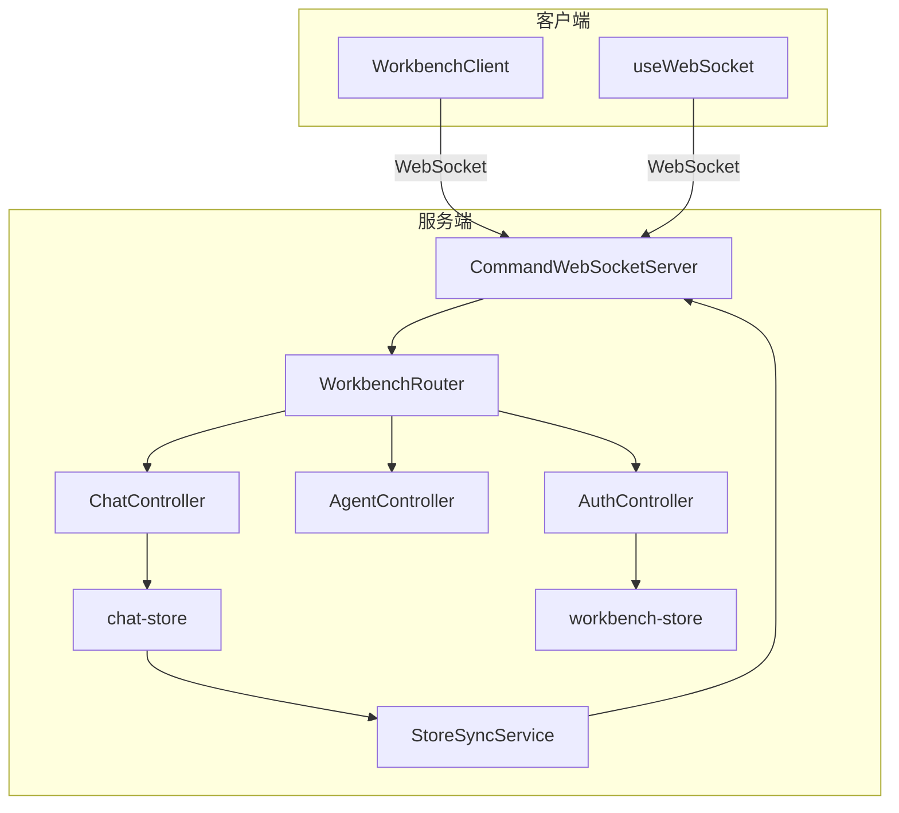
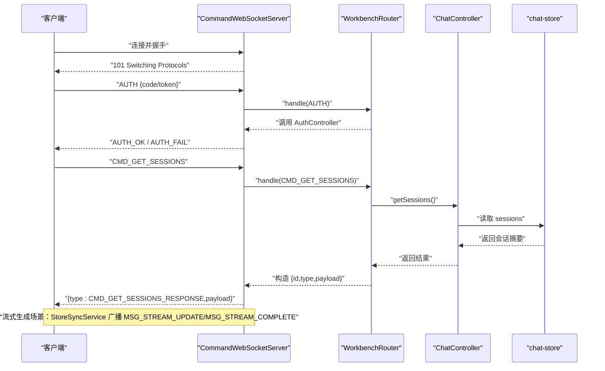
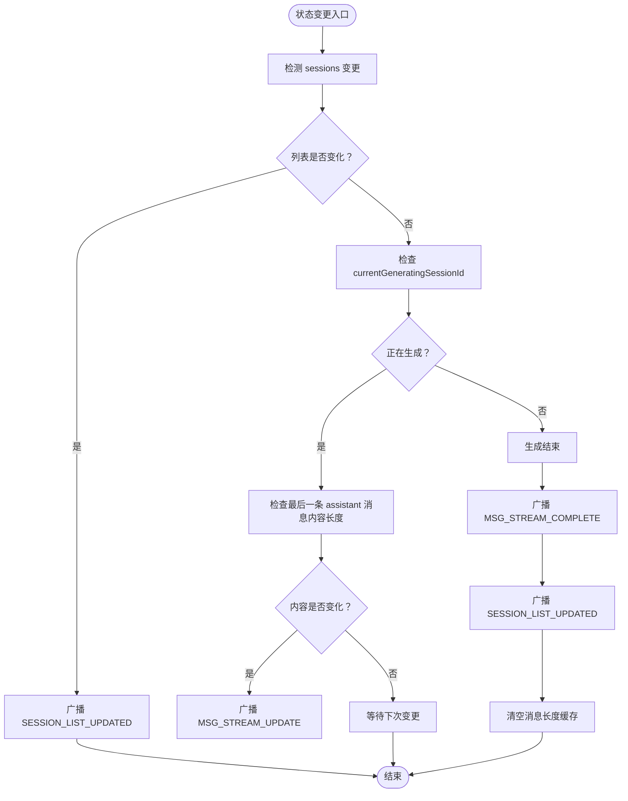
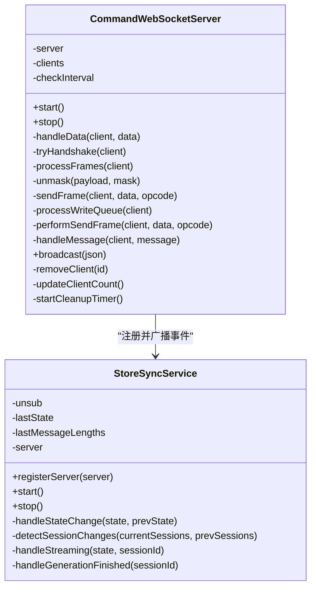
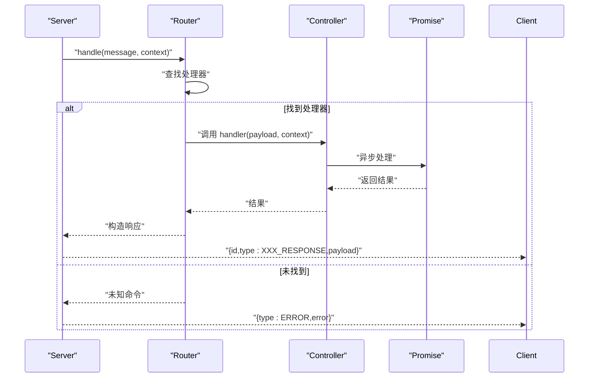
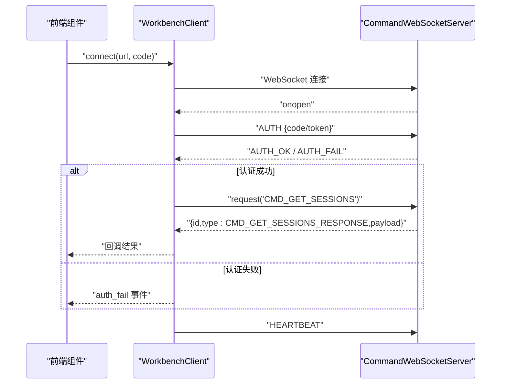
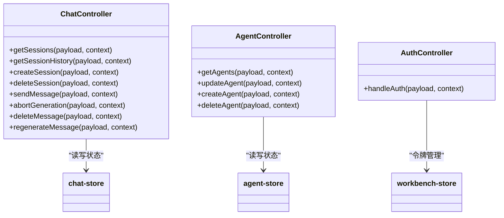
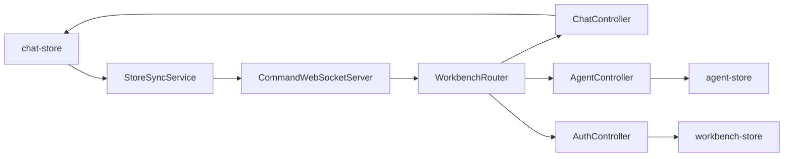

# 服务间通信机制

<cite>
**本文档引用的文件**
- [StoreSyncService.ts](file://src/services/workbench/StoreSyncService.ts)
- [CommandWebSocketServer.ts](file://src/services/workbench/CommandWebSocketServer.ts)
- [WorkbenchRouter.ts](file://src/services/workbench/WorkbenchRouter.ts)
- [WorkbenchClient.ts](file://web-client/src/services/WorkbenchClient.ts)
- [useWebSocket.ts](file://web-client/src/hooks/useWebSocket.ts)
- [chat-store.ts](file://src/store/chat-store.ts)
- [workbench-store.ts](file://src/store/workbench-store.ts)
- [ChatController.ts](file://src/services/workbench/controllers/ChatController.ts)
- [AgentController.ts](file://src/services/workbench/controllers/AgentController.ts)
- [AuthController.ts](file://src/services/workbench/controllers/AuthController.ts)
</cite>

## 目录
1. [引言](#引言)
2. [项目结构](#项目结构)
3. [核心组件](#核心组件)
4. [架构总览](#架构总览)
5. [详细组件分析](#详细组件分析)
6. [依赖关系分析](#依赖关系分析)
7. [性能考量](#性能考量)
8. [故障排查指南](#故障排查指南)
9. [结论](#结论)
10. [附录](#附录)

## 引言
本文件聚焦于服务层内部的服务间通信机制与数据流转，重点阐述以下内容：
- StoreSyncService 的作用、职责与实现原理
- WebSocket 通信协议与消息传递格式
- 服务间的依赖关系、事件驱动模式与状态同步机制
- 协议设计原则、错误处理策略与重连机制
- 监控方法、性能分析与调试技巧
- 具体的通信流程图与代码示例路径

## 项目结构
本项目采用“服务层 + 控制器 + 路由 + 存储”的分层架构：
- 服务层负责网络通信与命令路由（CommandWebSocketServer、WorkbenchRouter）
- 控制器封装业务命令（如聊天、代理、配置等）
- 存储层使用 Zustand 管理应用状态（chat-store、workbench-store）
- 前端 Web 客户端通过 WorkbenchClient 或 useWebSocket 与服务端交互

图表来源
- [CommandWebSocketServer.ts:33-178](file://src/services/workbench/CommandWebSocketServer.ts#L33-L178)
- [WorkbenchRouter.ts:18-72](file://src/services/workbench/WorkbenchRouter.ts#L18-L72)
- [StoreSyncService.ts:5-32](file://src/services/workbench/StoreSyncService.ts#L5-L32)
- [ChatController.ts:5-129](file://src/services/workbench/controllers/ChatController.ts#L5-L129)
- [AgentController.ts:4-47](file://src/services/workbench/controllers/AgentController.ts#L4-L47)
- [AuthController.ts:17-54](file://src/services/workbench/controllers/AuthController.ts#L17-L54)
- [chat-store.ts:108-210](file://src/store/chat-store.ts#L108-L210)
- [workbench-store.ts:22-55](file://src/store/workbench-store.ts#L22-L55)
- [WorkbenchClient.ts:18-94](file://web-client/src/services/WorkbenchClient.ts#L18-L94)
- [useWebSocket.ts:11-92](file://web-client/src/hooks/useWebSocket.ts#L11-L92)

章节来源
- [CommandWebSocketServer.ts:33-178](file://src/services/workbench/CommandWebSocketServer.ts#L33-L178)
- [WorkbenchRouter.ts:18-72](file://src/services/workbench/WorkbenchRouter.ts#L18-L72)
- [StoreSyncService.ts:5-32](file://src/services/workbench/StoreSyncService.ts#L5-L32)
- [WorkbenchClient.ts:18-94](file://web-client/src/services/WorkbenchClient.ts#L18-L94)
- [useWebSocket.ts:11-92](file://web-client/src/hooks/useWebSocket.ts#L11-L92)

## 核心组件
- StoreSyncService：订阅 Zustand chat-store，检测会话列表变化与流式生成状态，向客户端广播增量更新
- CommandWebSocketServer：基于 TCP Socket 实现的 WebSocket 服务器，负责握手、帧解析、写队列、心跳与清理
- WorkbenchRouter：命令路由，注册各控制器处理器，统一处理请求-响应与错误返回
- ChatController/AgentController/AuthController：具体业务命令的实现，读写对应存储
- chat-store/workbench-store：Zustand 状态管理，承载会话、消息、认证令牌等状态
- WorkbenchClient/useWebSocket：前端客户端，负责连接、鉴权、心跳、RPC 请求与事件监听

章节来源
- [StoreSyncService.ts:5-126](file://src/services/workbench/StoreSyncService.ts#L5-L126)
- [CommandWebSocketServer.ts:33-487](file://src/services/workbench/CommandWebSocketServer.ts#L33-L487)
- [WorkbenchRouter.ts:18-72](file://src/services/workbench/WorkbenchRouter.ts#L18-L72)
- [ChatController.ts:5-129](file://src/services/workbench/controllers/ChatController.ts#L5-L129)
- [AgentController.ts:4-47](file://src/services/workbench/controllers/AgentController.ts#L4-L47)
- [AuthController.ts:17-54](file://src/services/workbench/controllers/AuthController.ts#L17-L54)
- [chat-store.ts:108-210](file://src/store/chat-store.ts#L108-L210)
- [workbench-store.ts:22-55](file://src/store/workbench-store.ts#L22-L55)
- [WorkbenchClient.ts:18-317](file://web-client/src/services/WorkbenchClient.ts#L18-L317)
- [useWebSocket.ts:11-115](file://web-client/src/hooks/useWebSocket.ts#L11-L115)

## 架构总览
服务间通信采用“事件驱动 + 请求-响应”的混合模式：
- 事件驱动：StoreSyncService 订阅 chat-store，当会话列表或流式消息发生变化时，主动广播事件
- 请求-响应：客户端通过 WorkbenchClient 发送命令（如 CMD_GET_SESSIONS、CMD_SEND_MESSAGE），服务端路由到对应控制器处理，并返回响应或事件推送

图表来源
- [CommandWebSocketServer.ts:415-444](file://src/services/workbench/CommandWebSocketServer.ts#L415-L444)
- [WorkbenchRouter.ts:34-71](file://src/services/workbench/WorkbenchRouter.ts#L34-L71)
- [ChatController.ts:6-19](file://src/services/workbench/controllers/ChatController.ts#L6-L19)
- [chat-store.ts:108-210](file://src/store/chat-store.ts#L108-L210)

## 详细组件分析

### StoreSyncService：状态同步与事件广播
- 职责
  - 订阅 chat-store，检测会话列表变更与流式生成状态
  - 对会话列表变化广播 SESSION_LIST_UPDATED
  - 对流式消息广播 MSG_STREAM_UPDATE；生成完成后广播 MSG_STREAM_COMPLETE
- 设计要点
  - 使用 lastMessageLengths 缓存消息长度，仅在内容变化时推送，降低带宽
  - 生成结束时清空缓存并触发会话列表刷新
- 与服务端耦合
  - 通过 CommandWebSocketServer.broadcast 推送事件

图表来源
- [StoreSyncService.ts:34-123](file://src/services/workbench/StoreSyncService.ts#L34-L123)

章节来源
- [StoreSyncService.ts:5-126](file://src/services/workbench/StoreSyncService.ts#L5-L126)
- [chat-store.ts:108-210](file://src/store/chat-store.ts#L108-L210)

### CommandWebSocketServer：协议实现与连接管理
- 握手与帧解析
  - 解析 HTTP Upgrade 头，计算 Accept Key，返回 101 切换协议
  - 自定义帧解析：支持 126/127 扩展长度、掩码解码、Ping/Pong 心跳
- 写入与可靠性
  - 写队列保证原子性，分片写入（CHUNK_SIZE=1400），drain 回调与超时兜底
  - 二进制帧（Opcode 0x2）避免严格 UTF-8 解码问题
- 连接生命周期
  - 维护客户端集合，心跳超时清理（30s），端口占用重试（最多10次）
  - 支持广播与按客户端发送
- 错误处理
  - 非法握手直接关闭；常见网络错误静默移除客户端；写失败抑制部分异常

图表来源
- [CommandWebSocketServer.ts:33-487](file://src/services/workbench/CommandWebSocketServer.ts#L33-L487)
- [StoreSyncService.ts:5-32](file://src/services/workbench/StoreSyncService.ts#L5-L32)

章节来源
- [CommandWebSocketServer.ts:33-487](file://src/services/workbench/CommandWebSocketServer.ts#L33-L487)

### WorkbenchRouter：命令路由与错误处理
- 注册命令处理器（register），按 type 分发
- 统一处理请求-响应：若消息含 id，则自动返回 {id,type:XXX_RESPONSE}
- 错误处理：捕获异常并返回 {type:XXX_ERROR,error}

图表来源
- [WorkbenchRouter.ts:34-71](file://src/services/workbench/WorkbenchRouter.ts#L34-L71)

章节来源
- [WorkbenchRouter.ts:18-72](file://src/services/workbench/WorkbenchRouter.ts#L18-L72)

### 前端客户端：WorkbenchClient 与 useWebSocket
- WorkbenchClient
  - 连接管理：自动重连策略（UI 层手动控制）、心跳（10s）、状态事件
  - RPC 请求：自定义 id，超时（默认10s），响应匹配与错误透传
  - 鉴权：支持 token 与 access code，AUTH_OK/AUTH_FAIL 状态切换
- useWebSocket（演示用）
  - 简化握手与鉴权，接收 TOKEN/CHAT_RESPONSE 等事件并更新本地消息

图表来源
- [WorkbenchClient.ts:29-94](file://web-client/src/services/WorkbenchClient.ts#L29-L94)
- [CommandWebSocketServer.ts:431-434](file://src/services/workbench/CommandWebSocketServer.ts#L431-L434)

章节来源
- [WorkbenchClient.ts:18-317](file://web-client/src/services/WorkbenchClient.ts#L18-L317)
- [useWebSocket.ts:11-115](file://web-client/src/hooks/useWebSocket.ts#L11-L115)

### 控制器与存储：命令实现与状态承载
- ChatController
  - 会话管理：获取、创建、删除、历史加载
  - 消息操作：发送、中断、删除、重生成
  - 流式生成：启动后立即返回，后续由 StoreSyncService 推送增量
- AgentController
  - 代理管理：查询、更新、创建、删除
- AuthController
  - 鉴权：access code 或 token 验证，颁发新 token，定时清理过期 token

图表来源
- [ChatController.ts:5-129](file://src/services/workbench/controllers/ChatController.ts#L5-L129)
- [AgentController.ts:4-47](file://src/services/workbench/controllers/AgentController.ts#L4-L47)
- [AuthController.ts:17-54](file://src/services/workbench/controllers/AuthController.ts#L17-L54)
- [chat-store.ts:108-210](file://src/store/chat-store.ts#L108-L210)
- [workbench-store.ts:22-55](file://src/store/workbench-store.ts#L22-L55)

章节来源
- [ChatController.ts:5-129](file://src/services/workbench/controllers/ChatController.ts#L5-L129)
- [AgentController.ts:4-47](file://src/services/workbench/controllers/AgentController.ts#L4-L47)
- [AuthController.ts:17-54](file://src/services/workbench/controllers/AuthController.ts#L17-L54)

## 依赖关系分析
- 低耦合高内聚
  - StoreSyncService 仅依赖 CommandWebSocketServer 广播接口，不直接依赖控制器
  - CommandWebSocketServer 仅依赖 WorkbenchRouter，不直接访问业务存储
  - 控制器仅依赖对应 store，职责单一
- 事件与命令分离
  - 事件：StoreSyncService 主动推送（SESSION_LIST_UPDATED、MSG_STREAM_UPDATE、MSG_STREAM_COMPLETE）
  - 命令：WorkbenchClient 请求，WorkbenchRouter 分发，控制器处理
- 状态一致性
  - chat-store 为唯一真相源，StoreSyncService 仅做增量广播，避免重复序列化

图表来源
- [StoreSyncService.ts:5-32](file://src/services/workbench/StoreSyncService.ts#L5-L32)
- [CommandWebSocketServer.ts:33-41](file://src/services/workbench/CommandWebSocketServer.ts#L33-L41)
- [WorkbenchRouter.ts:18-28](file://src/services/workbench/WorkbenchRouter.ts#L18-L28)
- [ChatController.ts:1-3](file://src/services/workbench/controllers/ChatController.ts#L1-L3)
- [AgentController.ts:1-2](file://src/services/workbench/controllers/AgentController.ts#L1-L2)
- [AuthController.ts:1-2](file://src/services/workbench/controllers/AuthController.ts#L1-L2)
- [chat-store.ts:1-20](file://src/store/chat-store.ts#L1-L20)
- [workbench-store.ts:1-20](file://src/store/workbench-store.ts#L1-L20)

章节来源
- [StoreSyncService.ts:5-32](file://src/services/workbench/StoreSyncService.ts#L5-L32)
- [CommandWebSocketServer.ts:33-41](file://src/services/workbench/CommandWebSocketServer.ts#L33-L41)
- [WorkbenchRouter.ts:18-28](file://src/services/workbench/WorkbenchRouter.ts#L18-L28)
- [ChatController.ts:1-3](file://src/services/workbench/controllers/ChatController.ts#L1-L3)
- [AgentController.ts:1-2](file://src/services/workbench/controllers/AgentController.ts#L1-L2)
- [AuthController.ts:1-2](file://src/services/workbench/controllers/AuthController.ts#L1-L2)

## 性能考量
- 带宽优化
  - StoreSyncService 仅在消息内容变化时推送 MSG_STREAM_UPDATE，减少冗余
  - 会话列表变更采用 SESSION_LIST_UPDATED 通知，客户端按需拉取（CMD_GET_SESSIONS）
- 写入可靠性
  - 分片写入（CHUNK_SIZE=1400）+ 写队列 + drain 超时兜底，提升大包传输稳定性
- 心跳与清理
  - 10s 心跳，30s 超时断开，定期清理无效连接
- 序列化成本
  - 大会话历史（>10KB）记录日志便于定位，避免频繁大包传输

章节来源
- [StoreSyncService.ts:86-106](file://src/services/workbench/StoreSyncService.ts#L86-L106)
- [CommandWebSocketServer.ts:343-413](file://src/services/workbench/CommandWebSocketServer.ts#L343-L413)
- [CommandWebSocketServer.ts:471-484](file://src/services/workbench/CommandWebSocketServer.ts#L471-L484)

## 故障排查指南
- 连接与握手
  - 确认客户端收到 101 响应；若无，检查握手头与 Accept Key 计算
- 认证失败
  - AUTH_FAIL：检查 access code 或 token 是否正确；查看 AuthController 日志
  - AUTH_OK：保存 token，后续复用
- 请求超时
  - WorkbenchClient 默认超时 10s；检查控制器处理耗时与网络延迟
- 心跳与断线
  - 服务端 30s 超时清理；客户端 10s 心跳；若频繁断线，检查网络质量与 NAT 超时
- 大包传输
  - 服务端对 >5KB 帧打印日志；确认客户端是否正确处理分片与 base64 编解码

章节来源
- [CommandWebSocketServer.ts:203-239](file://src/services/workbench/CommandWebSocketServer.ts#L203-L239)
- [CommandWebSocketServer.ts:415-444](file://src/services/workbench/CommandWebSocketServer.ts#L415-L444)
- [AuthController.ts:17-54](file://src/services/workbench/controllers/AuthController.ts#L17-L54)
- [WorkbenchClient.ts:222-241](file://web-client/src/services/WorkbenchClient.ts#L222-L241)
- [CommandWebSocketServer.ts:374-377](file://src/services/workbench/CommandWebSocketServer.ts#L374-L377)

## 结论
本通信机制通过 StoreSyncService 与 CommandWebSocketServer 的协作，实现了低耦合、高可靠的服务间通信：
- 事件驱动确保状态变更的实时同步
- 请求-响应模式满足业务命令的确定性交互
- 完善的心跳、清理与错误处理保障了运行稳定性
- 前端客户端提供清晰的连接、鉴权与 RPC 能力

## 附录

### 消息格式与命令清单
- 通用消息结构
  - 请求：{id, type, payload}
  - 响应：{id, type:XXX_RESPONSE, payload}
  - 错误：{id, type:XXX_ERROR, error}
  - 事件：{type, payload}
- 常用命令
  - AUTH：鉴权
  - CMD_GET_SESSIONS / CMD_GET_HISTORY：会话查询
  - CMD_SEND_MESSAGE / CMD_ABORT_GENERATION / CMD_DELETE_MESSAGE / CMD_REGENERATE_MESSAGE：消息操作
  - CMD_GET_AGENTS / CMD_UPDATE_AGENT / CMD_CREATE_AGENT / CMD_DELETE_AGENT：代理管理
  - HEARTBEAT：心跳

章节来源
- [WorkbenchRouter.ts:34-71](file://src/services/workbench/WorkbenchRouter.ts#L34-L71)
- [ChatController.ts:6-129](file://src/services/workbench/controllers/ChatController.ts#L6-L129)
- [AgentController.ts:4-47](file://src/services/workbench/controllers/AgentController.ts#L4-L47)
- [AuthController.ts:17-54](file://src/services/workbench/controllers/AuthController.ts#L17-L54)
- [CommandWebSocketServer.ts:415-434](file://src/services/workbench/CommandWebSocketServer.ts#L415-L434)