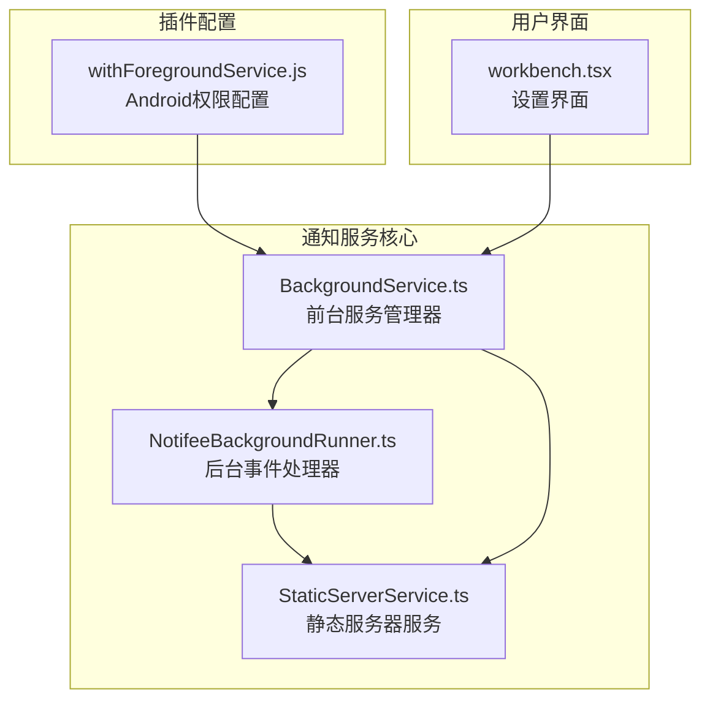
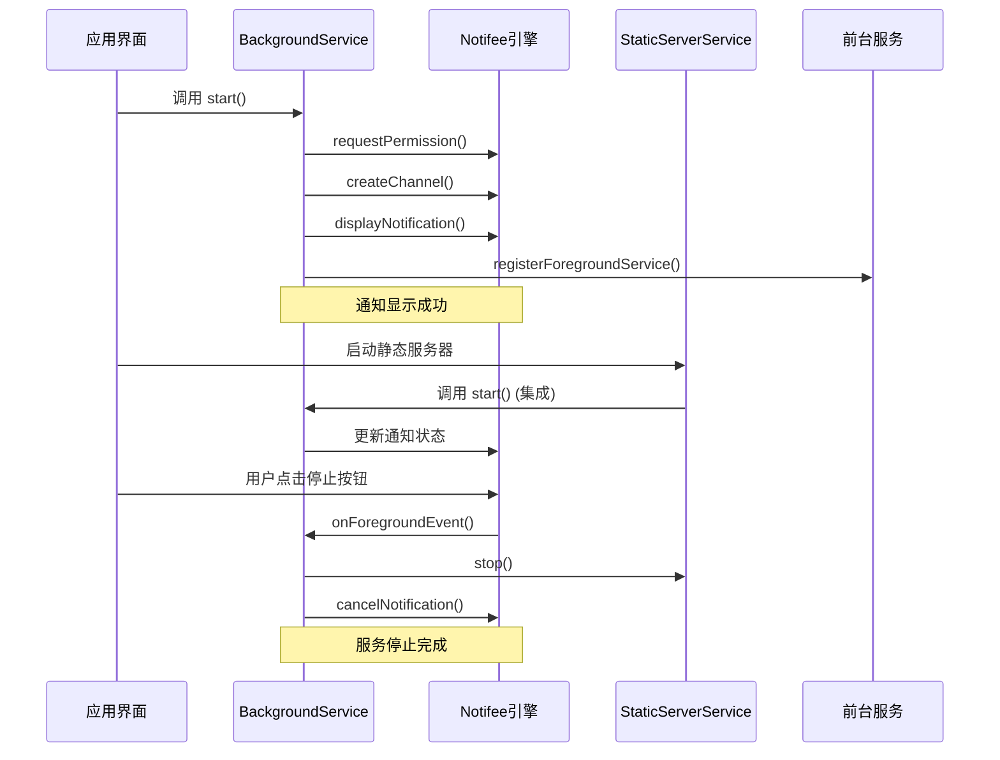
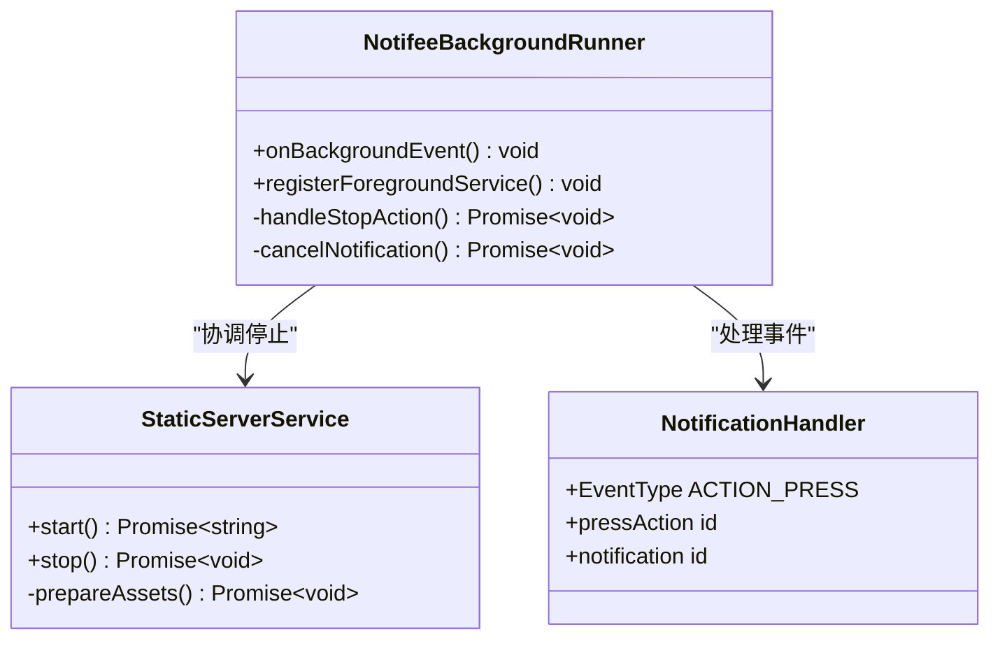
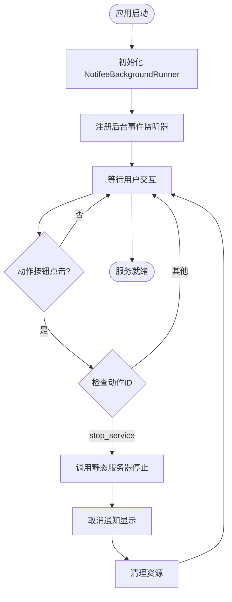
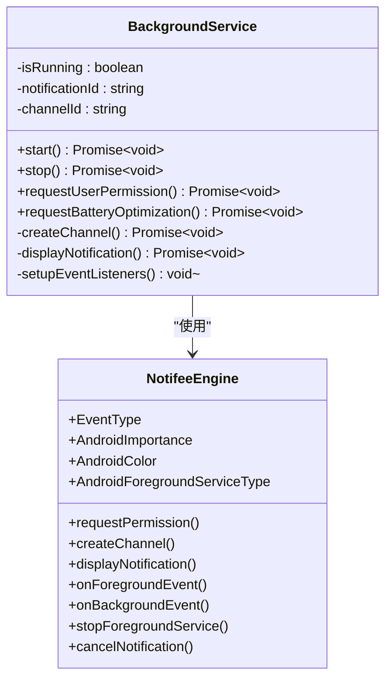
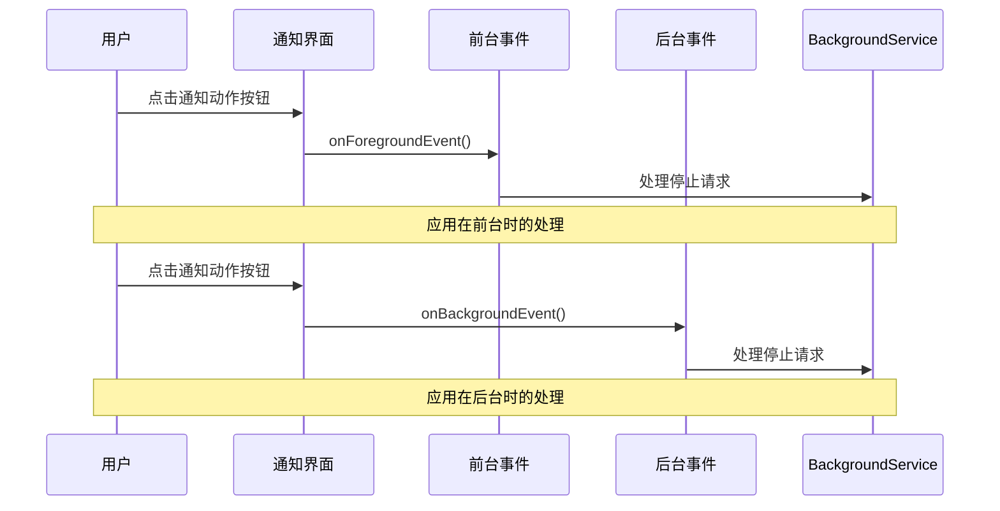
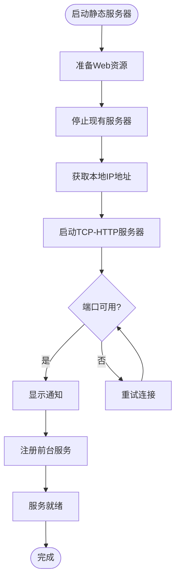
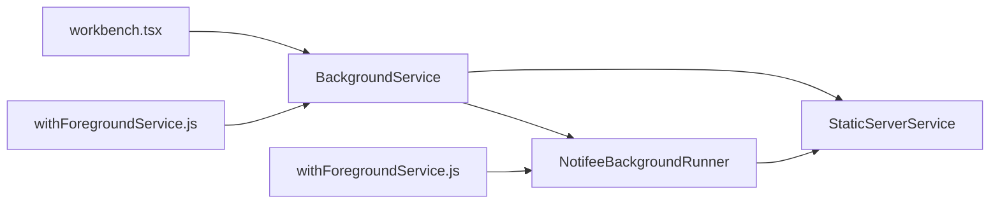

# 通知服务系统

<cite>
**本文档引用的文件**
- [NotifeeBackgroundRunner.ts](file://src/services/NotifeeBackgroundRunner.ts)
- [BackgroundService.ts](file://src/services/BackgroundService.ts)
- [StaticServerService.ts](file://src/services/workbench/StaticServerService.ts)
- [withForegroundService.js](file://plugins/withForegroundService.js)
- [workbench.tsx](file://app/settings/workbench.tsx)
</cite>

## 目录
1. [简介](#简介)
2. [项目结构](#项目结构)
3. [核心组件](#核心组件)
4. [架构概览](#架构概览)
5. [详细组件分析](#详细组件分析)
6. [依赖关系分析](#依赖关系分析)
7. [性能考虑](#性能考虑)
8. [故障排除指南](#故障排除指南)
9. [最佳实践](#最佳实践)
10. [结论](#结论)

## 简介

本通知服务系统是基于 Notifee React Native 库构建的后台服务通知解决方案，主要用于 Nexara 工作台应用中的静态服务器通知管理。该系统实现了完整的前后台事件处理机制，包括通知通道管理、动作按钮配置、权限请求和电池优化设置等功能。

系统的核心设计理念是通过前台服务确保应用在后台运行时仍能保持通知显示，同时提供用户友好的交互体验。通知服务与静态服务器服务紧密集成，当服务器启动或停止时自动管理通知状态。

## 项目结构

通知服务系统主要分布在以下目录和文件中：



**图表来源**
- [NotifeeBackgroundRunner.ts:1-28](file://src/services/NotifeeBackgroundRunner.ts#L1-L28)
- [BackgroundService.ts:1-117](file://src/services/BackgroundService.ts#L1-L117)
- [StaticServerService.ts:1-301](file://src/services/workbench/StaticServerService.ts#L1-L301)

**章节来源**
- [NotifeeBackgroundRunner.ts:1-28](file://src/services/NotifeeBackgroundRunner.ts#L1-L28)
- [BackgroundService.ts:1-117](file://src/services/BackgroundService.ts#L1-L117)
- [StaticServerService.ts:1-301](file://src/services/workbench/StaticServerService.ts#L1-L301)

## 核心组件

### NotifeeBackgroundRunner - 后台事件处理器

`NotifeeBackgroundRunner.ts` 是通知系统的核心后台事件处理器，负责处理应用在后台或被杀死状态下接收到的通知事件。

**主要功能：**
- 监听后台通知事件
- 处理动作按钮点击事件
- 协调静态服务器服务的停止
- 管理通知的取消和清理

**关键特性：**
- 使用 `onBackgroundEvent` 监听后台事件
- 实现 `registerForegroundService` 注册前台服务任务
- 支持异步事件处理和错误恢复

### BackgroundService - 前台服务管理器

`BackgroundService.ts` 提供了完整的前台服务生命周期管理，包括通知创建、权限管理和服务控制。

**核心职责：**
- 创建和管理通知通道
- 显示前台服务通知
- 处理用户交互事件
- 管理服务启动和停止

**通知配置：**
- 重要性级别：LOW
- 视觉样式：蓝色主题
- 行为设置：持续显示、前台服务类型

### StaticServerService - 静态服务器集成

`StaticServerService.ts` 作为通知服务的业务逻辑层，负责与静态服务器的集成和协调。

**集成点：**
- 服务器启动时自动显示通知
- 服务器停止时清理通知状态
- 与后台服务的双向通信

**章节来源**
- [NotifeeBackgroundRunner.ts:1-28](file://src/services/NotifeeBackgroundRunner.ts#L1-L28)
- [BackgroundService.ts:1-117](file://src/services/BackgroundService.ts#L1-L117)
- [StaticServerService.ts:1-301](file://src/services/workbench/StaticServerService.ts#L1-L301)

## 架构概览

通知服务系统采用分层架构设计，确保各组件职责清晰且松耦合：



**图表来源**
- [BackgroundService.ts:8-83](file://src/services/BackgroundService.ts#L8-L83)
- [NotifeeBackgroundRunner.ts:4-27](file://src/services/NotifeeBackgroundRunner.ts#L4-L27)

系统架构的关键特点：
- **事件驱动**：基于 Notifee 的事件系统实现响应式通知处理
- **前台服务**：确保通知在应用后台运行时仍可见
- **权限管理**：主动请求必要的系统权限
- **错误恢复**：提供完善的异常处理和资源清理机制

## 详细组件分析

### NotifeeBackgroundRunner 组件分析

#### 类关系图



**图表来源**
- [NotifeeBackgroundRunner.ts:1-28](file://src/services/NotifeeBackgroundRunner.ts#L1-L28)
- [StaticServerService.ts:238-248](file://src/services/workbench/StaticServerService.ts#L238-L248)

#### 事件处理流程



**图表来源**
- [NotifeeBackgroundRunner.ts:4-17](file://src/services/NotifeeBackgroundRunner.ts#L4-L17)

#### 前台服务注册

前台服务注册是通知系统的核心机制，确保应用在后台运行时仍能保持通知显示：

**注册流程：**
1. 调用 `notifee.registerForegroundService()`
2. 返回永不解析的 Promise 保持服务运行
3. 通过外部信号控制服务停止

**服务保持机制：**
- 服务承诺保持运行直到显式停止
- 避免系统回收前台服务
- 确保通知持续显示给用户

**章节来源**
- [NotifeeBackgroundRunner.ts:19-27](file://src/services/NotifeeBackgroundRunner.ts#L19-L27)

### BackgroundService 组件分析

#### 完整类结构



**图表来源**
- [BackgroundService.ts:3-117](file://src/services/BackgroundService.ts#L3-L117)

#### 通知通道管理

通知通道是 Android 通知系统的重要概念，用于分类和管理不同类型的通知：

**通道配置：**
- **ID**: `nexara-service`
- **名称**: `Nexara Background Service`
- **重要性**: LOW (最低级别)
- **视觉设置**: 关闭指示灯和震动
- **用途**: 后台服务状态通知

**重要性级别选择：**
- 选择 LOW 级别避免打扰用户
- 适合后台服务状态显示
- 符合系统电池优化策略

#### 通知事件处理



**图表来源**
- [BackgroundService.ts:18-30](file://src/services/BackgroundService.ts#L18-L30)

**章节来源**
- [BackgroundService.ts:32-64](file://src/services/BackgroundService.ts#L32-L64)
- [BackgroundService.ts:18-30](file://src/services/BackgroundService.ts#L18-L30)

### StaticServerService 集成分析

#### 服务启动流程



**图表来源**
- [StaticServerService.ts:24-236](file://src/services/workbench/StaticServerService.ts#L24-L236)

#### 通知集成点

静态服务器服务与通知系统的集成体现在多个关键位置：

**启动集成：**
- 服务器启动后自动调用 `backgroundService.start()`
- 主动请求电池优化权限
- 确保通知服务正常运行

**停止集成：**
- 服务器停止时调用 `backgroundService.stop()`
- 清理通知状态和资源
- 恢复到初始状态

**章节来源**
- [StaticServerService.ts:223-227](file://src/services/workbench/StaticServerService.ts#L223-L227)
- [StaticServerService.ts:245](file://src/services/workbench/StaticServerService.ts#L245)

## 依赖关系分析

### 外部依赖

通知服务系统依赖以下关键外部库和框架：

```mermaid
graph TB
subgraph "核心依赖"
A[@notifee/react-native<br/>通知引擎]
B[react-native-tcp-socket<br/>网络通信]
C[expo-file-system<br/>文件系统]
D[expo-asset<br/>资源管理]
end
subgraph "平台支持"
E[Android Manifest<br/>权限声明]
F[Build Gradle<br/>Maven仓库]
G[Network Info<br/>网络信息]
end
subgraph "内部依赖"
H[StaticServerService<br/>业务逻辑]
I[BackgroundService<br/>服务管理]
J[NotifeeBackgroundRunner<br/>事件处理]
end
A --> H
B --> H
C --> H
D --> H
E --> I
F --> I
G --> H
H --> I
I --> J
```

**图表来源**
- [withForegroundService.js:16-46](file://plugins/withForegroundService.js#L16-L46)
- [BackgroundService.ts:1](file://src/services/BackgroundService.ts#L1)

### 内部模块依赖



**图表来源**
- [workbench.tsx:197-212](file://app/settings/workbench.tsx#L197-L212)
- [withForegroundService.js:7-72](file://plugins/withForegroundService.js#L7-L72)

**章节来源**
- [withForegroundService.js:16-46](file://plugins/withForegroundService.js#L16-L46)
- [workbench.tsx:197-212](file://app/settings/workbench.tsx#L197-L212)

## 性能考虑

### 内存管理

通知服务系统在内存管理方面采用了多项优化策略：

**资源清理：**
- 服务器停止时自动清理所有相关资源
- 通知取消后释放内存占用
- 异常情况下确保资源正确释放

**内存泄漏防护：**
- 使用弱引用避免循环引用
- 及时注销事件监听器
- 控制通知对象的生命周期

### 网络性能

静态服务器部分的网络性能优化：

**连接池管理：**
- TCP连接的重用和复用
- 连接超时和重试机制
- 错误连接的快速清理

**数据传输优化：**
- 分块传输减少内存占用
- 缓冲区大小动态调整
- 大文件传输的流式处理

### 电池优化

系统针对移动设备的电池优化进行了专门设计：

**前台服务策略：**
- 使用前台服务确保通知持续显示
- 最小化后台活动减少电量消耗
- 智能休眠和唤醒机制

**权限最小化：**
- 仅请求必要的系统权限
- 提供用户控制选项
- 遵循平台最佳实践

## 故障排除指南

### 常见问题诊断

#### 通知不显示问题

**症状：** 应用启动后没有显示通知

**可能原因：**
1. 通知权限未授予
2. 通知通道创建失败
3. 前台服务注册异常

**解决步骤：**
1. 检查权限状态：`backgroundService.requestUserPermission()`
2. 验证通道配置：确认通道ID和名称
3. 查看日志输出：检查错误信息

#### 动作按钮无响应

**症状：** 点击通知动作按钮没有反应

**排查方法：**
1. 确认事件监听器已注册
2. 检查动作ID是否匹配
3. 验证回调函数执行情况

**章节来源**
- [BackgroundService.ts:85-92](file://src/services/BackgroundService.ts#L85-L92)
- [NotifeeBackgroundRunner.ts:5-17](file://src/services/NotifeeBackgroundRunner.ts#L5-L17)

### 日志分析

系统提供了详细的日志输出用于问题诊断：

**关键日志点：**
- 服务启动/停止状态
- 权限请求结果
- 通知显示/取消操作
- 错误异常信息

**调试建议：**
1. 启用详细日志模式
2. 重现问题场景
3. 分析日志时间线
4. 对比预期行为

### 平台特定问题

#### Android 权限问题

**常见问题：**
- 前台服务权限缺失
- 电池优化拦截
- 应用被系统杀死

**解决方案：**
1. 检查 AndroidManifest 权限声明
2. 引导用户手动设置电池优化
3. 实现应用自启动白名单

#### iOS 兼容性

**限制说明：**
- iOS 对后台通知有严格限制
- 不支持前台服务概念
- 需要使用系统通知框架

**适配策略：**
1. 使用原生 iOS 通知API
2. 遵循 Apple 平台规范
3. 测试不同iOS版本兼容性

## 最佳实践

### 用户体验优化

**通知设计原则：**
- 保持通知简洁明了
- 提供明确的操作反馈
- 避免频繁通知打扰用户

**交互设计：**
- 立即响应用户操作
- 提供撤销和重试选项
- 显示进度和状态信息

### 性能优化建议

**资源管理：**
- 及时释放不再使用的资源
- 使用连接池复用网络连接
- 控制内存使用峰值

**并发处理：**
- 异步处理耗时操作
- 避免阻塞主线程
- 实现优雅降级机制

### 安全考虑

**权限管理：**
- 最小权限原则
- 用户知情同意
- 定期权限检查

**数据保护：**
- 敏感信息加密存储
- 安全的网络传输
- 访问控制和认证

### 跨平台兼容性

**统一接口设计：**
- 抽象平台差异
- 提供一致的API
- 处理平台特定功能

**测试策略：**
- 多平台功能测试
- 兼容性回归测试
- 用户场景模拟测试

## 结论

通知服务系统通过精心设计的架构和实现，为 Nexara 应用提供了稳定可靠的通知管理能力。系统的主要优势包括：

**技术优势：**
- 完整的前后台事件处理机制
- 紧密的业务逻辑集成
- 良好的错误处理和恢复能力

**用户体验：**
- 透明的服务状态通知
- 直观的用户交互界面
- 可控的后台运行体验

**可维护性：**
- 清晰的模块划分
- 完善的文档和注释
- 易于扩展的架构设计

该系统为类似的应用场景提供了优秀的参考实现，特别是在需要长时间后台运行和用户交互的通知场景中。通过遵循本文档的最佳实践和配置指南，开发者可以快速部署和优化自己的通知服务系统。