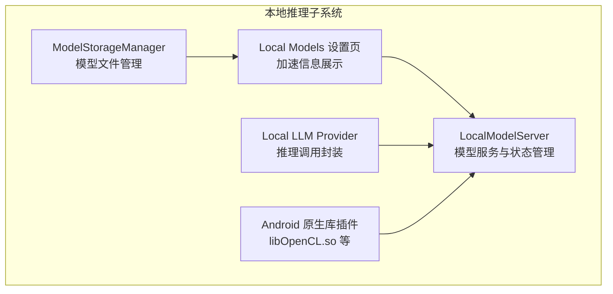
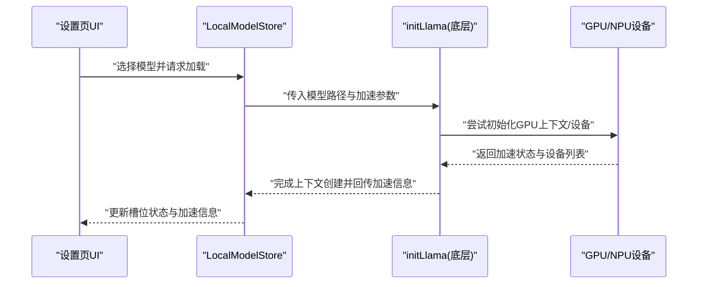
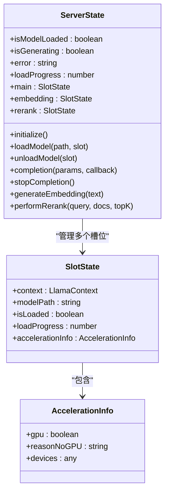
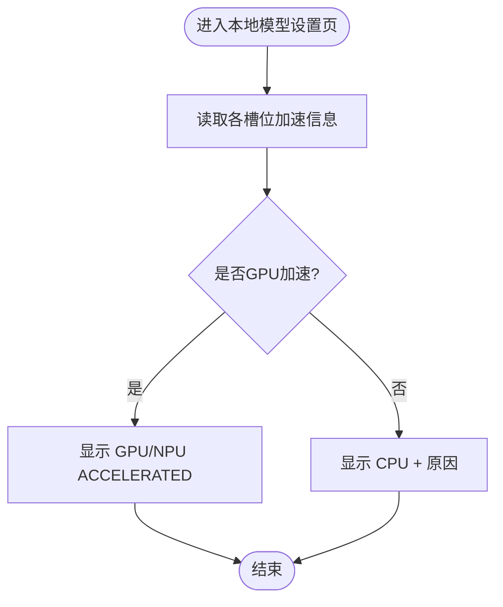
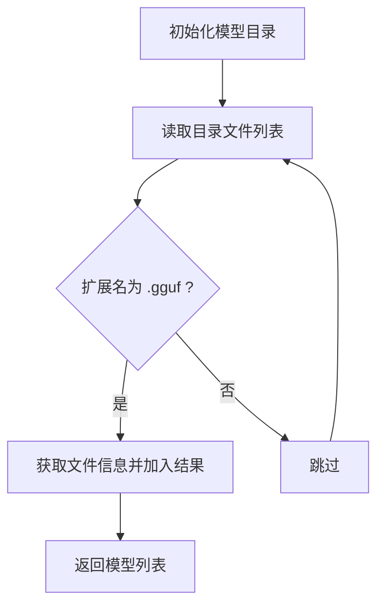
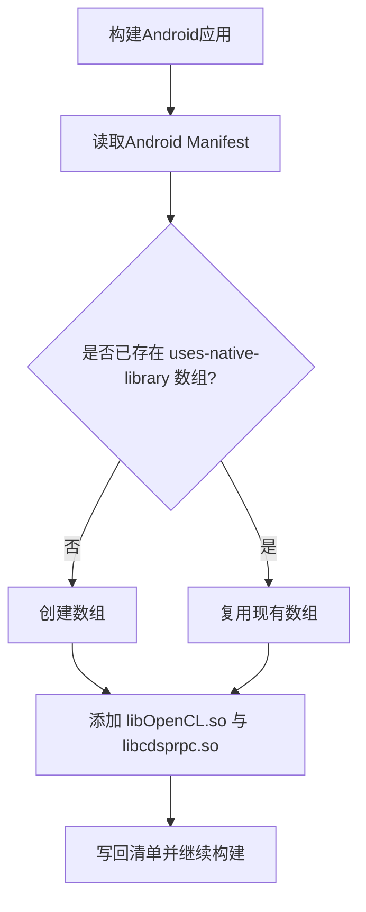
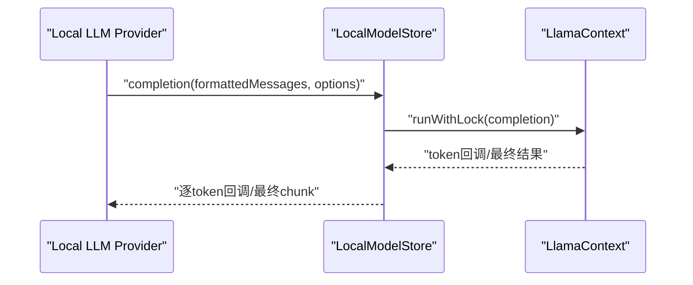
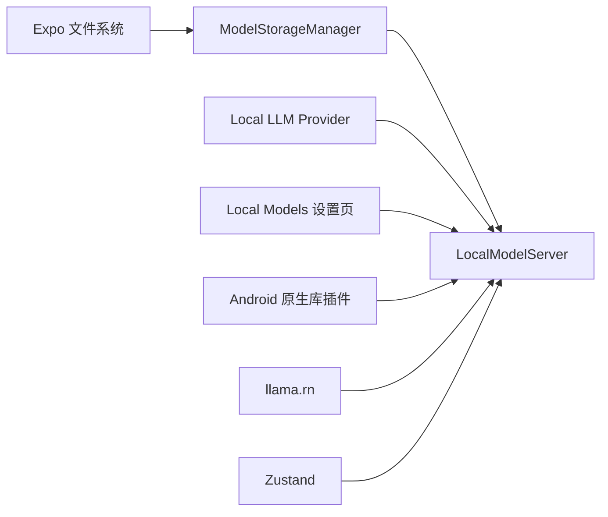

# GPU加速支持

<cite>
**本文引用的文件**
- [LocalModelServer.ts](file://src/lib/local-inference/LocalModelServer.ts)
- [local-models.tsx](file://app/settings/local-models.tsx)
- [ModelStorageManager.ts](file://src/lib/local-inference/ModelStorageManager.ts)
- [withNativeLibraryTags.js](file://plugins/withNativeLibraryTags.js)
- [README.md](file://README.md)
- [local-llm.ts](file://src/lib/llm/providers/local-llm.ts)
</cite>

## 目录
1. [简介](#简介)
2. [项目结构](#项目结构)
3. [核心组件](#核心组件)
4. [架构总览](#架构总览)
5. [详细组件分析](#详细组件分析)
6. [依赖关系分析](#依赖关系分析)
7. [性能考量](#性能考量)
8. [故障排查指南](#故障排查指南)
9. [结论](#结论)
10. [附录](#附录)

## 简介
本文件围绕本地推理中的GPU加速支持展开，系统性阐述GPU加速器的检测机制、设备枚举与兼容性验证流程；详解硬件加速的配置参数、性能调优与资源分配策略；解释CPU/GPU负载均衡、动态切换与故障转移机制；并结合当前代码实现，给出启用条件、限制因素与最佳实践建议。同时提供硬件兼容性检查、性能监控与故障诊断方法。

## 项目结构
本项目的本地推理能力由以下关键模块构成：
- 本地模型服务：负责模型加载、上下文管理、推理执行与状态持久化
- 本地模型设置页：展示加速信息、模型管理与状态监控
- 模型存储管理：负责模型文件的导入、列举与删除
- 原生库集成插件：为Android平台声明必要的原生库依赖
- 本地LLM提供方：封装本地推理的调用流程

**图表来源**
- [LocalModelServer.ts:1-381](file://src/lib/local-inference/LocalModelServer.ts#L1-L381)
- [local-models.tsx:1-447](file://app/settings/local-models.tsx#L1-L447)
- [ModelStorageManager.ts:1-103](file://src/lib/local-inference/ModelStorageManager.ts#L1-L103)
- [withNativeLibraryTags.js:1-41](file://plugins/withNativeLibraryTags.js#L1-L41)
- [local-llm.ts:77-105](file://src/lib/llm/providers/local-llm.ts#L77-L105)

**章节来源**
- [README.md:32-34](file://README.md#L32-L34)
- [README.md:104-106](file://README.md#L104-L106)

## 核心组件
- 本地模型服务（LocalModelServer）
  - 提供模型加载/卸载、推理执行、进度上报与加速信息回传
  - 支持三路槽位（主对话、嵌入、重排序），每路独立上下文
  - 通过底层初始化参数控制GPU层数、批大小等，用于加速与稳定性平衡
- 本地模型设置页（local-models.tsx）
  - 展示各槽位是否已加载、硬件加速状态（GPU/NPU加速或CPU软件路径）
  - 提供模型导入、删除、按槽位加载/卸载操作
- 模型存储管理（ModelStorageManager）
  - 统一管理模型文件目录、列举可用GGUF模型、导入与删除
- Android原生库插件（withNativeLibraryTags.js）
  - 在Android清单中声明OpenCL等原生库依赖，为GPU/NPU加速提供基础
- 本地LLM提供方（local-llm.ts）
  - 将消息格式化后调用本地模型服务执行推理，支持流式输出

**章节来源**
- [LocalModelServer.ts:11-41](file://src/lib/local-inference/LocalModelServer.ts#L11-L41)
- [local-models.tsx:19-41](file://app/settings/local-models.tsx#L19-L41)
- [ModelStorageManager.ts:13-49](file://src/lib/local-inference/ModelStorageManager.ts#L13-L49)
- [withNativeLibraryTags.js:1-41](file://plugins/withNativeLibraryTags.js#L1-L41)
- [local-llm.ts:77-105](file://src/lib/llm/providers/local-llm.ts#L77-L105)

## 架构总览
本地推理的GPU加速路径由“配置参数 → 初始化上下文 → 加速信息回传 → UI展示”构成，并在运行期通过互斥锁保障并发安全。

**图表来源**
- [LocalModelServer.ts:182-229](file://src/lib/local-inference/LocalModelServer.ts#L182-L229)
- [local-models.tsx:19-41](file://app/settings/local-models.tsx#L19-L41)

## 详细组件分析

### 本地模型服务（LocalModelServer）
- 槽位与状态
  - 主对话、嵌入、重排序三路独立槽位，每路维护上下文、加载进度、是否已加载与加速信息
- 初始化参数与加速策略
  - 通过底层初始化函数传入n_gpu_layers、n_batch、n_ubatch等参数，用于控制GPU层数与批处理大小
  - 文档注释明确指出禁用某些不稳定特性以提升稳定性
- 并发与互斥
  - 使用弱映射保存每个上下文的锁序列，确保同一上下文的推理串行执行，避免竞态
- 自动加载与持久化
  - 支持根据上次加载的模型路径自动恢复加载，结合延迟启动避免启动崩溃
- 推理与回退
  - 生成嵌入时若嵌入槽为空，尝试自动加载默认嵌入模型；否则回退到主槽位（严格区分）
  - 重排序时优先使用专用槽位，否则回退到主槽位

**图表来源**
- [LocalModelServer.ts:11-41](file://src/lib/local-inference/LocalModelServer.ts#L11-L41)

**章节来源**
- [LocalModelServer.ts:85-336](file://src/lib/local-inference/LocalModelServer.ts#L85-L336)

### 本地模型设置页（local-models.tsx）
- 硬件加速状态展示
  - GPU加速：显示“GPU/NPU ACCELERATED”
  - CPU软件路径：显示“CPU”并附带原因（如无GPU）
- 槽位状态与进度
  - 分别展示主对话、嵌入、重排序槽位的加载状态与进度百分比
- 模型管理
  - 导入、删除、按槽位加载/卸载模型
  - 当槽位已加载某模型时，再次点击可卸载

**图表来源**
- [local-models.tsx:19-41](file://app/settings/local-models.tsx#L19-L41)

**章节来源**
- [local-models.tsx:19-447](file://app/settings/local-models.tsx#L19-L447)

### 模型存储管理（ModelStorageManager）
- 目录初始化与模型列举
  - 确保模型目录存在，扫描目录下所有.GGUF文件并返回元信息
- 导入与删除
  - 通过文档选择器导入模型文件至本地目录
  - 删除指定模型文件

**图表来源**
- [ModelStorageManager.ts:27-49](file://src/lib/local-inference/ModelStorageManager.ts#L27-L49)

**章节来源**
- [ModelStorageManager.ts:13-103](file://src/lib/local-inference/ModelStorageManager.ts#L13-L103)

### Android原生库插件（withNativeLibraryTags.js）
- 作用
  - 在Android清单中声明对libOpenCL.so、libcdsprpc.so等原生库的依赖，为GPU/NPU加速提供基础
- 影响
  - 有助于在设备侧满足OpenCL等加速框架的运行前置条件

**图表来源**
- [withNativeLibraryTags.js:1-41](file://plugins/withNativeLibraryTags.js#L1-L41)

**章节来源**
- [withNativeLibraryTags.js:1-41](file://plugins/withNativeLibraryTags.js#L1-L41)

### 本地LLM提供方（local-llm.ts）
- 流程
  - 将消息格式化后调用本地模型服务执行completion
  - 支持流式输出回调，将底层token文本映射为统一chunk结构
- 与本地模型服务的协作
  - 通过store.completion发起推理，底层由LocalModelServer持有并执行

**图表来源**
- [local-llm.ts:77-105](file://src/lib/llm/providers/local-llm.ts#L77-L105)
- [LocalModelServer.ts:249-265](file://src/lib/local-inference/LocalModelServer.ts#L249-L265)

**章节来源**
- [local-llm.ts:77-105](file://src/lib/llm/providers/local-llm.ts#L77-L105)

## 依赖关系分析
- 组件耦合
  - LocalModelServer与ModelStorageManager：前者依赖后者提供的模型文件路径与列表
  - LocalModelServer与local-llm.ts：前者提供推理执行，后者封装调用
  - local-models.tsx与LocalModelServer：前者展示状态并触发加载/卸载
  - withNativeLibraryTags.js与构建流程：为Android平台提供原生库声明
- 外部依赖
  - llama.rn：提供本地推理能力与GPU加速上下文
  - Expo文件系统：提供模型文件的读写与目录管理
  - Zustand：提供状态持久化与跨组件共享

**图表来源**
- [LocalModelServer.ts:1-9](file://src/lib/local-inference/LocalModelServer.ts#L1-L9)
- [ModelStorageManager.ts:1-1](file://src/lib/local-inference/ModelStorageManager.ts#L1-L1)
- [local-models.tsx:1-10](file://app/settings/local-models.tsx#L1-L10)
- [withNativeLibraryTags.js:1-41](file://plugins/withNativeLibraryTags.js#L1-L41)
- [local-llm.ts:77-105](file://src/lib/llm/providers/local-llm.ts#L77-L105)

**章节来源**
- [LocalModelServer.ts:1-9](file://src/lib/local-inference/LocalModelServer.ts#L1-L9)
- [ModelStorageManager.ts:1-1](file://src/lib/local-inference/ModelStorageManager.ts#L1-L1)
- [local-models.tsx:1-10](file://app/settings/local-models.tsx#L1-L10)
- [withNativeLibraryTags.js:1-41](file://plugins/withNativeLibraryTags.js#L1-L41)
- [local-llm.ts:77-105](file://src/lib/llm/providers/local-llm.ts#L77-L105)

## 性能考量
- GPU加速参数
  - n_gpu_layers：控制加载到GPU的层数，数值越高通常加速越明显，但需考虑显存与稳定性
  - n_batch/n_ubatch：批处理大小，影响吞吐与内存占用，过大可能导致溢出
  - 文档注释明确指出禁用某些不稳定特性以换取稳定性
- 资源分配策略
  - 三路槽位独立上下文，避免相互争抢资源
  - 自动加载延迟启动，减少启动阶段资源竞争
- 并发与互斥
  - 同一上下文的推理通过互斥锁串行化，避免竞态与崩溃
- 回退策略
  - 嵌入模型缺失时自动加载默认嵌入模型；重排序优先专用槽位，否则回退主槽位
- 模型兼容性
  - 特定量化版本在部分ARM64设备可能存在崩溃风险，建议使用更稳定的量化版本

**章节来源**
- [LocalModelServer.ts:182-205](file://src/lib/local-inference/LocalModelServer.ts#L182-L205)
- [LocalModelServer.ts:267-335](file://src/lib/local-inference/LocalModelServer.ts#L267-L335)
- [local-models.tsx:265-279](file://app/settings/local-models.tsx#L265-L279)

## 故障排查指南
- 加速信息查看
  - 在设置页查看各槽位的硬件加速状态，判断是否走GPU/NPU或CPU软件路径
- 常见问题定位
  - 若出现崩溃或性能异常，优先检查是否启用了不稳定的特性（如注释中提到的不稳定项）
  - 检查模型文件是否存在且路径正确
  - 观察加载进度与错误信息，确认是否成功完成上下文创建
- 模型兼容性
  - 部分量化版本在特定设备上不稳定，建议更换为更稳定版本
- 原生库依赖
  - 确认Android构建已声明必要的原生库依赖，避免缺少运行时库导致加速失败

**章节来源**
- [local-models.tsx:19-41](file://app/settings/local-models.tsx#L19-L41)
- [LocalModelServer.ts:103-159](file://src/lib/local-inference/LocalModelServer.ts#L103-L159)
- [ModelStorageManager.ts:116-129](file://src/lib/local-inference/ModelStorageManager.ts#L116-L129)
- [withNativeLibraryTags.js:14-35](file://plugins/withNativeLibraryTags.js#L14-L35)

## 结论
本项目通过LocalModelServer统一管理本地推理的上下文与状态，结合UI展示加速信息与模型管理能力，形成完整的GPU加速闭环。通过合理的参数配置、资源分配与回退策略，能够在保证稳定性的同时获得较好的推理性能。建议在实际部署中关注设备兼容性与模型稳定性，持续优化批处理与GPU层数参数以达到最佳效果。

## 附录
- 启用条件
  - 开启本地模型开关
  - 存在可用的GGUF模型文件
  - Android构建已声明必要的原生库依赖
- 限制因素
  - 某些量化版本在特定设备上不稳定
  - GPU加速依赖设备驱动与原生库支持
  - 显存与批处理大小需平衡
- 最佳实践
  - 优先使用稳定的量化版本
  - 根据设备性能调整n_gpu_layers与批处理大小
  - 使用自动加载与延迟启动策略，避免启动阶段资源竞争
  - 在UI中实时监控加速状态与错误信息，及时发现并处理问题

**章节来源**
- [README.md:32-34](file://README.md#L32-L34)
- [README.md:104-106](file://README.md#L104-L106)
- [LocalModelServer.ts:182-205](file://src/lib/local-inference/LocalModelServer.ts#L182-L205)
- [withNativeLibraryTags.js:14-35](file://plugins/withNativeLibraryTags.js#L14-L35)