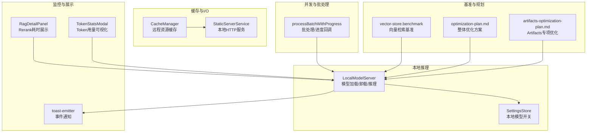
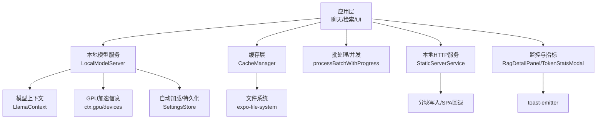
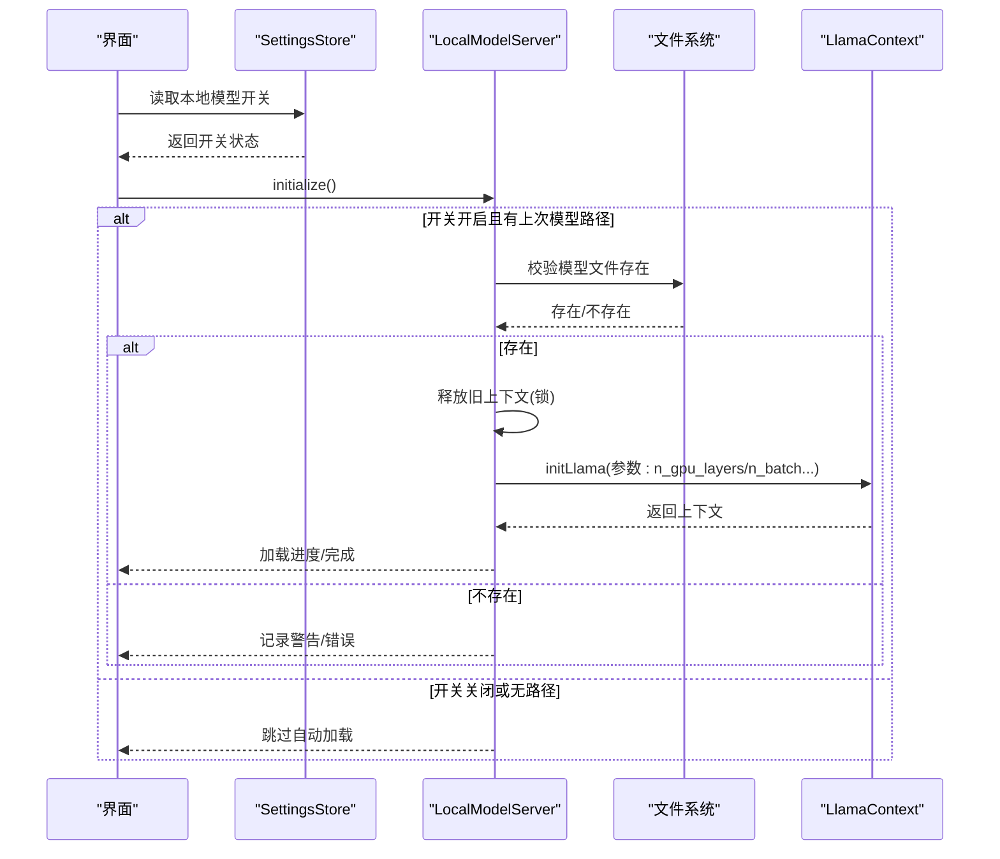
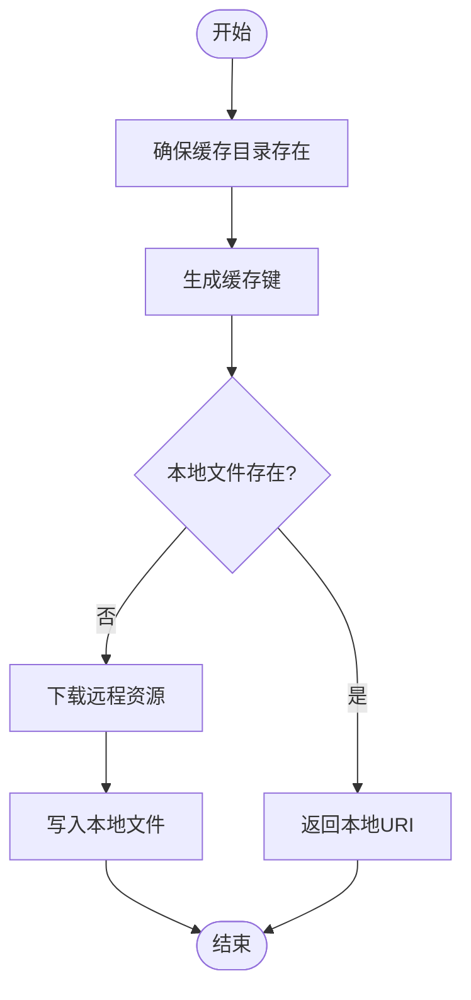
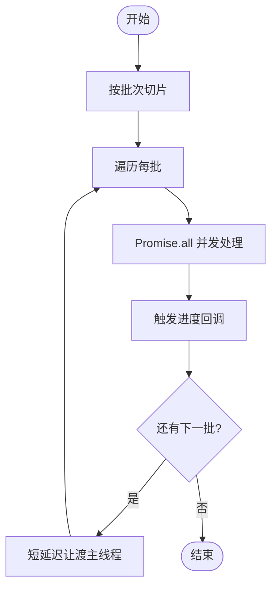
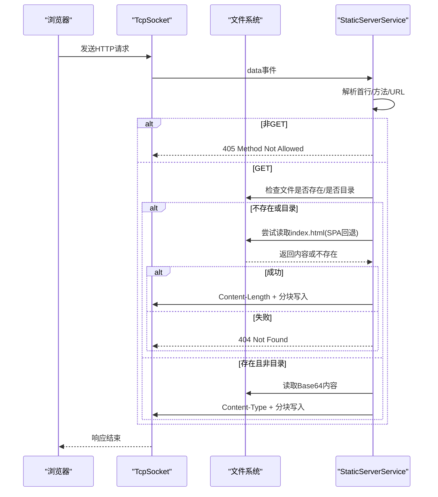
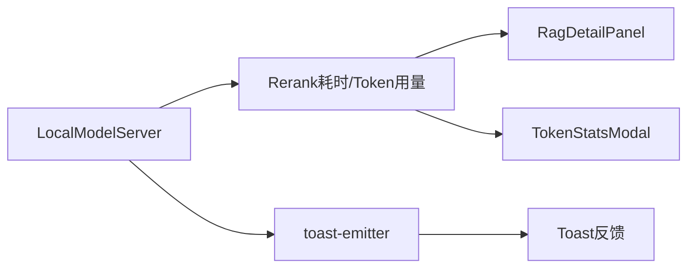
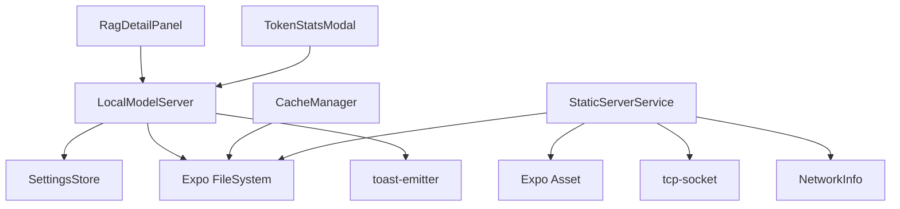

# 性能优化策略

<cite>
**本文引用的文件**
- [LocalModelServer.ts](file://src/lib/local-inference/LocalModelServer.ts)
- [cache-manager.ts](file://src/lib/cache/cache-manager.ts)
- [queue-utils.ts](file://src/lib/queue-utils.ts)
- [StaticServerService.ts](file://src/services/workbench/StaticServerService.ts)
- [settings-store.ts](file://src/store/settings-store.ts)
- [toast-emitter.ts](file://src/lib/utils/toast-emitter.ts)
- [vector-store.benchmark.ts](file://src/lib/rag/__tests__/vector-store.benchmark.ts)
- [RagDetailPanel.tsx](file://src/features/chat/components/RagDetailPanel.tsx)
- [TokenStatsModal.tsx](file://src/features/chat/components/TokenStatsModal.tsx)
- [workbench.tsx](file://app/settings/workbench.tsx)
- [local-models.tsx](file://app/settings/local-models.tsx)
- [artifacts-optimization-plan.md](file://docs/artifacts-optimization-plan.md)
- [optimization-plan.md](file://docs/optimization-plan.md)
</cite>

## 目录
1. [简介](#简介)
2. [项目结构](#项目结构)
3. [核心组件](#核心组件)
4. [架构总览](#架构总览)
5. [详细组件分析](#详细组件分析)
6. [依赖分析](#依赖分析)
7. [性能考量](#性能考量)
8. [故障排除指南](#故障排除指南)
9. [结论](#结论)
10. [附录](#附录)

## 简介
本文件面向本地推理性能优化，围绕内存管理、缓存策略、资源复用、批处理与并发、异步处理、模型量化与精度权衡、I/O 与网络传输、存储访问优化、性能监控与瓶颈定位、设备差异与基准、最佳实践与故障排除等方面，结合代码库中的实现与规划文档，给出系统化的技术文档与实操建议。

## 项目结构
从性能优化视角，项目中与本地推理密切相关的模块包括：
- 本地模型推理与资源管理：LocalModelServer
- 文件缓存与离线可用性：CacheManager
- 大批量任务的批处理与进度控制：processBatchWithProgress
- 本地静态资源服务与网络传输：StaticServerService
- 设置与开关：SettingsStore
- 通知与事件：ToastEmitter
- RAG 检索性能基准：vector-store.benchmark
- UI 层性能指标展示：RagDetailPanel、TokenStatsModal
- Workbench 权限与电池优化：workbench 页面入口

**图表来源**
- [LocalModelServer.ts:103-159](file://src/lib/local-inference/LocalModelServer.ts#L103-L159)
- [cache-manager.ts:17-31](file://src/lib/cache/cache-manager.ts#L17-L31)
- [queue-utils.ts:5-11](file://src/lib/queue-utils.ts#L5-L11)
- [StaticServerService.ts:24-40](file://src/services/workbench/StaticServerService.ts#L24-L40)
- [settings-store.ts:197-199](file://src/store/settings-store.ts#L197-L199)
- [toast-emitter.ts:10-15](file://src/lib/utils/toast-emitter.ts#L10-L15)
- [vector-store.benchmark.ts:10-23](file://src/lib/rag/__tests__/vector-store.benchmark.ts#L10-L23)
- [RagDetailPanel.tsx:91-101](file://src/features/chat/components/RagDetailPanel.tsx#L91-L101)
- [TokenStatsModal.tsx:54-85](file://src/features/chat/components/TokenStatsModal.tsx#L54-L85)
- [optimization-plan.md:1-800](file://docs/optimization-plan.md#L1-L800)
- [artifacts-optimization-plan.md:1-800](file://docs/artifacts-optimization-plan.md#L1-L800)

**章节来源**
- [LocalModelServer.ts:103-159](file://src/lib/local-inference/LocalModelServer.ts#L103-L159)
- [cache-manager.ts:17-31](file://src/lib/cache/cache-manager.ts#L17-L31)
- [queue-utils.ts:5-11](file://src/lib/queue-utils.ts#L5-L11)
- [StaticServerService.ts:24-40](file://src/services/workbench/StaticServerService.ts#L24-L40)
- [settings-store.ts:197-199](file://src/store/settings-store.ts#L197-L199)
- [toast-emitter.ts:10-15](file://src/lib/utils/toast-emitter.ts#L10-L15)
- [vector-store.benchmark.ts:10-23](file://src/lib/rag/__tests__/vector-store.benchmark.ts#L10-L23)
- [RagDetailPanel.tsx:91-101](file://src/features/chat/components/RagDetailPanel.tsx#L91-L101)
- [TokenStatsModal.tsx:54-85](file://src/features/chat/components/TokenStatsModal.tsx#L54-L85)
- [optimization-plan.md:1-800](file://docs/optimization-plan.md#L1-L800)
- [artifacts-optimization-plan.md:1-800](file://docs/artifacts-optimization-plan.md#L1-L800)

## 核心组件
- 本地模型服务（LocalModelServer）
  - 负责模型加载/卸载、推理执行、上下文锁、GPU 加速信息、自动加载与持久化。
  - 关键点：n_gpu_layers、n_batch/n_ubatch、use_mlock、加速信息回传。
- 文件缓存（CacheManager）
  - 远程资源（如 SVG）下载与本地缓存，目录初始化与清理。
- 批处理工具（processBatchWithProgress）
  - 分批处理、并发 Promise、进度回调、小延迟让渡 UI。
- 本地静态服务（StaticServerService）
  - TCP-HTTP 本地服务，SPA 回退、分块写入、端口占用重试。
- 设置与开关（SettingsStore）
  - 控制本地模型是否启用、持久化存储。
- 通知与事件（toast-emitter）
  - 统一事件派发，便于 UI 反馈加载/错误状态。
- 基准与监控（vector-store.benchmark、RagDetailPanel、TokenStatsModal）
  - 向量检索基准、Rerank 时间展示、Token 使用可视化。

**章节来源**
- [LocalModelServer.ts:11-55](file://src/lib/local-inference/LocalModelServer.ts#L11-L55)
- [cache-manager.ts:11-31](file://src/lib/cache/cache-manager.ts#L11-L31)
- [queue-utils.ts:5-11](file://src/lib/queue-utils.ts#L5-L11)
- [StaticServerService.ts:21-40](file://src/services/workbench/StaticServerService.ts#L21-L40)
- [settings-store.ts:58-61](file://src/store/settings-store.ts#L58-L61)
- [toast-emitter.ts:10-15](file://src/lib/utils/toast-emitter.ts#L10-L15)
- [vector-store.benchmark.ts:10-23](file://src/lib/rag/__tests__/vector-store.benchmark.ts#L10-L23)
- [RagDetailPanel.tsx:91-101](file://src/features/chat/components/RagDetailPanel.tsx#L91-L101)
- [TokenStatsModal.tsx:54-85](file://src/features/chat/components/TokenStatsModal.tsx#L54-L85)

## 架构总览
本地推理性能优化涉及“模型加载与上下文管理”“缓存与I/O”“批处理与并发”“网络与传输”“监控与可观测性”五个层面，形成闭环：参数调优 → 资源复用 → 并发控制 → I/O 优化 → 指标反馈 → 再优化。

**图表来源**
- [LocalModelServer.ts:161-236](file://src/lib/local-inference/LocalModelServer.ts#L161-L236)
- [cache-manager.ts:80-102](file://src/lib/cache/cache-manager.ts#L80-L102)
- [queue-utils.ts:5-11](file://src/lib/queue-utils.ts#L5-L11)
- [StaticServerService.ts:147-177](file://src/services/workbench/StaticServerService.ts#L147-L177)
- [RagDetailPanel.tsx:91-101](file://src/features/chat/components/RagDetailPanel.tsx#L91-L101)
- [TokenStatsModal.tsx:54-85](file://src/features/chat/components/TokenStatsModal.tsx#L54-L85)
- [toast-emitter.ts:10-15](file://src/lib/utils/toast-emitter.ts#L10-L15)

## 详细组件分析

### 本地模型服务（LocalModelServer）
- 自动加载与开关控制
  - 依据 SettingsStore 的开关与上次加载路径，延迟 3s 自动加载，避免启动崩溃。
- 上下文锁与资源复用
  - 通过 WeakMap + Promise 链式锁，确保同一 LlamaContext 的串行访问，防止竞态。
- 推理与向量化
  - completion 与 embedding/rerank 分槽位管理；embedding 明确不回退至主槽位。
- GPU 加速与参数
  - n_gpu_layers、n_batch/n_ubatch、use_mlock 等参数直接影响吞吐与稳定性。

**图表来源**
- [LocalModelServer.ts:103-159](file://src/lib/local-inference/LocalModelServer.ts#L103-L159)
- [LocalModelServer.ts:161-236](file://src/lib/local-inference/LocalModelServer.ts#L161-L236)
- [settings-store.ts:197-199](file://src/store/settings-store.ts#L197-L199)

**章节来源**
- [LocalModelServer.ts:103-159](file://src/lib/local-inference/LocalModelServer.ts#L103-L159)
- [LocalModelServer.ts:161-236](file://src/lib/local-inference/LocalModelServer.ts#L161-L236)
- [LocalModelServer.ts:267-335](file://src/lib/local-inference/LocalModelServer.ts#L267-L335)
- [settings-store.ts:197-199](file://src/store/settings-store.ts#L197-L199)

### 文件缓存（CacheManager）
- 目录准备与键生成
  - 确保缓存目录存在；根据 URL 生成稳定缓存键，避免非法字符。
- 下载与缓存
  - 若本地已存在则直接返回；否则下载并落盘；失败时抛错以便上层处理。
- 清理策略
  - 提供清空缓存目录的能力，并重置初始化状态。

**图表来源**
- [cache-manager.ts:17-31](file://src/lib/cache/cache-manager.ts#L17-L31)
- [cache-manager.ts:80-102](file://src/lib/cache/cache-manager.ts#L80-L102)

**章节来源**
- [cache-manager.ts:17-31](file://src/lib/cache/cache-manager.ts#L17-L31)
- [cache-manager.ts:80-102](file://src/lib/cache/cache-manager.ts#L80-L102)

### 批处理与并发（processBatchWithProgress）
- 分批处理
  - 将大列表按 batchSize 切片，内部 Promise.all 并发处理每批，减少 UI 阻塞。
- 进度回调
  - 每批完成后触发 onProgress，便于 UI 响应。
- 让渡主线程
  - 在批次之间插入短延迟，避免长时间占用 JS 线程。

**图表来源**
- [queue-utils.ts:5-11](file://src/lib/queue-utils.ts#L5-L11)
- [queue-utils.ts:33-45](file://src/lib/queue-utils.ts#L33-L45)

**章节来源**
- [queue-utils.ts:5-11](file://src/lib/queue-utils.ts#L5-L11)
- [queue-utils.ts:33-45](file://src/lib/queue-utils.ts#L33-L45)

### 本地静态服务（StaticServerService）
- 启动与资产准备
  - 准备 www 目录与 assets 子目录，拷贝打包后的 HTML/JS/CSS/图标。
- 请求处理
  - GET 方法、路径安全检查、SPA 回退、Content-Type 推断。
- 分块写入与错误处理
  - Base64 读取后转 Buffer，分块写入，避免一次性写入过大导致阻塞；异常时返回 500。
- 端口冲突重试
  - EADDRINUSE 时递增等待重试，最多 N 次。

**图表来源**
- [StaticServerService.ts:48-194](file://src/services/workbench/StaticServerService.ts#L48-L194)
- [StaticServerService.ts:147-177](file://src/services/workbench/StaticServerService.ts#L147-L177)

**章节来源**
- [StaticServerService.ts:24-40](file://src/services/workbench/StaticServerService.ts#L24-L40)
- [StaticServerService.ts:147-177](file://src/services/workbench/StaticServerService.ts#L147-L177)
- [StaticServerService.ts:196-214](file://src/services/workbench/StaticServerService.ts#L196-L214)

### 监控与指标（RagDetailPanel、TokenStatsModal、toast-emitter）
- Rerank 时间展示
  - 在检索详情面板展示 rerank 耗时，便于直观感知性能。
- Token 使用可视化
  - 以条形图与百分比展示各类 Token 消耗，支持估算标记。
- 事件通知
  - 通过事件发射器统一派发 toast，提升用户反馈一致性。

**图表来源**
- [RagDetailPanel.tsx:91-101](file://src/features/chat/components/RagDetailPanel.tsx#L91-L101)
- [TokenStatsModal.tsx:54-85](file://src/features/chat/components/TokenStatsModal.tsx#L54-L85)
- [toast-emitter.ts:10-15](file://src/lib/utils/toast-emitter.ts#L10-L15)

**章节来源**
- [RagDetailPanel.tsx:91-101](file://src/features/chat/components/RagDetailPanel.tsx#L91-L101)
- [TokenStatsModal.tsx:54-85](file://src/features/chat/components/TokenStatsModal.tsx#L54-L85)
- [toast-emitter.ts:10-15](file://src/lib/utils/toast-emitter.ts#L10-L15)

## 依赖分析
- LocalModelServer 依赖
  - SettingsStore：决定是否自动加载与加载哪些模型。
  - Expo FileSystem：模型与缓存文件路径管理。
  - 事件发射器：加载/错误状态通知。
- CacheManager 依赖
  - Expo FileSystem：目录与文件操作。
- StaticServerService 依赖
  - Expo Asset/FileSystem：打包资源复制与读取。
  - react-native-tcp-socket：本地 TCP-HTTP 服务。
  - react-native-network-info：获取本机 IP。
- UI 展示依赖
  - RagDetailPanel、TokenStatsModal 依赖 LocalModelServer 的运行时指标。

**图表来源**
- [LocalModelServer.ts:1-10](file://src/lib/local-inference/LocalModelServer.ts#L1-L10)
- [cache-manager.ts:2-3](file://src/lib/cache/cache-manager.ts#L2-L3)
- [StaticServerService.ts:1-8](file://src/services/workbench/StaticServerService.ts#L1-L8)

**章节来源**
- [LocalModelServer.ts:1-10](file://src/lib/local-inference/LocalModelServer.ts#L1-L10)
- [cache-manager.ts:2-3](file://src/lib/cache/cache-manager.ts#L2-L3)
- [StaticServerService.ts:1-8](file://src/services/workbench/StaticServerService.ts#L1-L8)

## 性能考量

### 内存管理优化
- 上下文锁与串行化
  - 通过锁确保同一上下文的串行访问，避免竞态与重复初始化带来的内存抖动。
- mlock 与批大小
  - use_mlock 有助于减少页错误；n_batch/n_ubatch 控制批内吞吐与内存占用平衡。
- 自动释放
  - 切换模型时先释放旧上下文，降低常驻内存压力。

**章节来源**
- [LocalModelServer.ts:74-82](file://src/lib/local-inference/LocalModelServer.ts#L74-L82)
- [LocalModelServer.ts:182-205](file://src/lib/local-inference/LocalModelServer.ts#L182-L205)
- [LocalModelServer.ts:166-169](file://src/lib/local-inference/LocalModelServer.ts#L166-L169)

### 缓存策略
- 远程资源缓存
  - 对 SVG 等静态资源进行本地缓存，减少重复下载与网络开销。
- 清理与兜底
  - 提供清理接口；失败时抛错由上层决定回退策略。

**章节来源**
- [cache-manager.ts:80-102](file://src/lib/cache/cache-manager.ts#L80-L102)
- [cache-manager.ts:107-114](file://src/lib/cache/cache-manager.ts#L107-L114)

### 资源复用机制
- 槽位复用
  - main/embedding/rerank 三槽位分别持有上下文，避免重复初始化。
- 自动加载与持久化
  - 重启后根据上次路径自动加载，减少冷启动时间。

**章节来源**
- [LocalModelServer.ts:96-98](file://src/lib/local-inference/LocalModelServer.ts#L96-L98)
- [LocalModelServer.ts:338-379](file://src/lib/local-inference/LocalModelServer.ts#L338-L379)

### 批处理优化
- 分批并发
  - Promise.all 并发处理每批，缩短总耗时。
- 进度与让渡
  - 进度回调与短延迟让渡主线程，保证 UI 流畅。

**章节来源**
- [queue-utils.ts:18-30](file://src/lib/queue-utils.ts#L18-L30)
- [queue-utils.ts:37-45](file://src/lib/queue-utils.ts#L37-L45)

### 并发控制与异步处理
- 串行锁
  - WeakMap + Promise 链式锁，确保同一上下文的串行化。
- 事件驱动
  - 通过事件发射器统一派发状态，便于 UI 与服务层解耦。

**章节来源**
- [LocalModelServer.ts:74-82](file://src/lib/local-inference/LocalModelServer.ts#L74-L82)
- [toast-emitter.ts:10-15](file://src/lib/utils/toast-emitter.ts#L10-L15)

### 模型量化、精度与计算效率
- 量化与显存/算力权衡
  - n_gpu_layers 越高，显存占用越高，但推理速度更快；需结合设备能力选择。
- 批大小与稳定性
  - n_batch/n_ubatch 调整可提升吞吐，但过大可能导致溢出或卡顿。
- 警告与兼容
  - 部分 ARM64 设备对 Q8 量化可能不稳定，建议优先 Q4/K_M。

**章节来源**
- [LocalModelServer.ts:192-199](file://src/lib/local-inference/LocalModelServer.ts#L192-L199)
- [local-models.tsx:266-278](file://app/settings/local-models.tsx#L266-L278)

### I/O 优化、网络传输与存储访问
- 本地静态服务
  - 分块写入避免一次性大块写入；SPA 回退减少路由请求。
- 端口冲突与重试
  - EADDRINUSE 时递增等待，提高成功率。
- 文件系统
  - Base64 读取 + Buffer 分块写入，降低内存峰值。

**章节来源**
- [StaticServerService.ts:147-177](file://src/services/workbench/StaticServerService.ts#L147-L177)
- [StaticServerService.ts:196-214](file://src/services/workbench/StaticServerService.ts#L196-L214)

### 性能监控指标、瓶颈识别与调优建议
- 指标采集
  - Rerank 耗时、Token 使用分布、检索耗时。
- 基准测试
  - 向量检索基准脚本提供不同规模下的平均耗时，作为阈值参考。
- 调优建议
  - 以指标为依据调整 n_gpu_layers、n_batch、模型量化等级与缓存策略。

**章节来源**
- [RagDetailPanel.tsx:91-101](file://src/features/chat/components/RagDetailPanel.tsx#L91-L101)
- [TokenStatsModal.tsx:54-85](file://src/features/chat/components/TokenStatsModal.tsx#L54-L85)
- [vector-store.benchmark.ts:10-23](file://src/lib/rag/__tests__/vector-store.benchmark.ts#L10-L23)

### 不同设备类型的性能基准与最佳实践
- ARM64/Q8 兼容性
  - 部分设备可能崩溃，建议优先 Q4/K_M。
- 电池优化与后台运行
  - Workbench 页面提供忽略电池优化入口，减少后台限制导致的服务中断。

**章节来源**
- [local-models.tsx:266-278](file://app/settings/local-models.tsx#L266-L278)
- [workbench.tsx:214-230](file://app/settings/workbench.tsx#L214-L230)

## 故障排除指南
- 模型加载失败
  - 检查文件是否存在、路径是否带 file:// 前缀、n_gpu_layers 是否过高。
- 推理卡顿或崩溃
  - 降低 n_gpu_layers、n_batch；确认设备对量化格式的支持。
- 缓存下载失败
  - 检查网络、URL 有效性；捕获错误并回退到在线直连。
- 本地服务端口占用
  - 等待重试或更换端口；确认无残留进程。
- UI 卡顿
  - 使用批处理工具分批渲染；为长列表启用虚拟化；减少一次性大对象渲染。

**章节来源**
- [LocalModelServer.ts:231-235](file://src/lib/local-inference/LocalModelServer.ts#L231-L235)
- [cache-manager.ts:95-101](file://src/lib/cache/cache-manager.ts#L95-L101)
- [StaticServerService.ts:196-214](file://src/services/workbench/StaticServerService.ts#L196-L214)
- [queue-utils.ts:33-45](file://src/lib/queue-utils.ts#L33-L45)

## 结论
通过上下文锁与参数调优实现稳定的本地推理，配合缓存与分块传输优化 I/O，利用批处理与并发控制保障 UI 流畅，辅以指标与基准持续迭代，可在多设备场景下获得一致的高性能体验。建议在生产环境逐步引入更细粒度的监控与自动化调参策略。

## 附录
- 相关规划文档
  - 整体优化方案与 Artifacts 专项优化方案提供了架构与性能优化方向的系统性指导。

**章节来源**
- [optimization-plan.md:1-800](file://docs/optimization-plan.md#L1-L800)
- [artifacts-optimization-plan.md:1-800](file://docs/artifacts-optimization-plan.md#L1-L800)