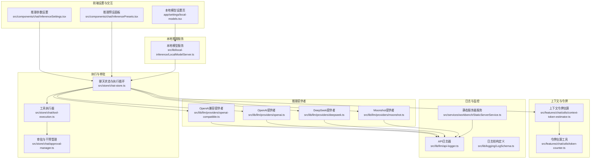
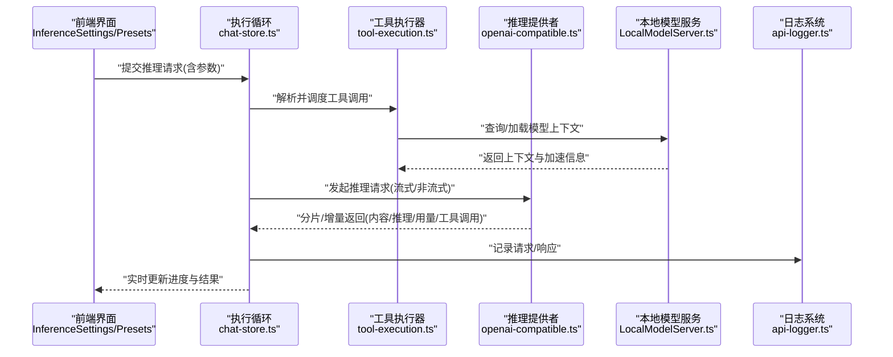
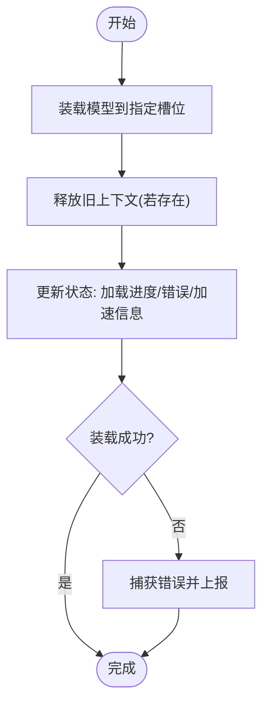
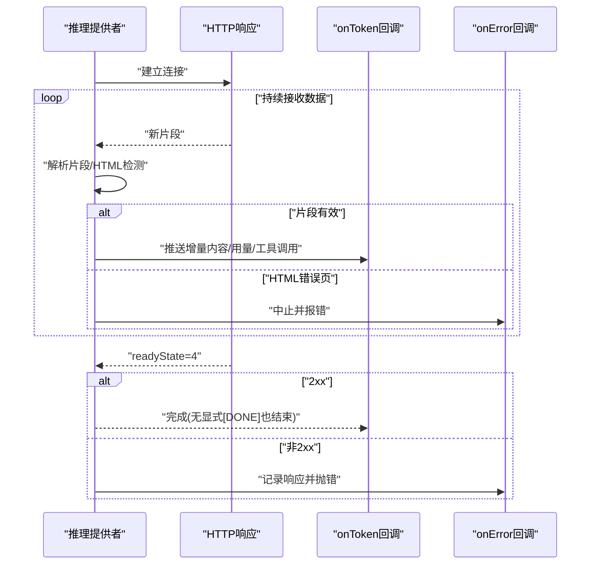
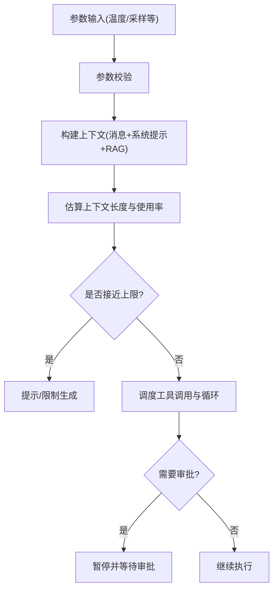
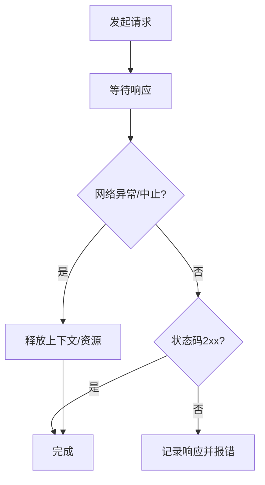
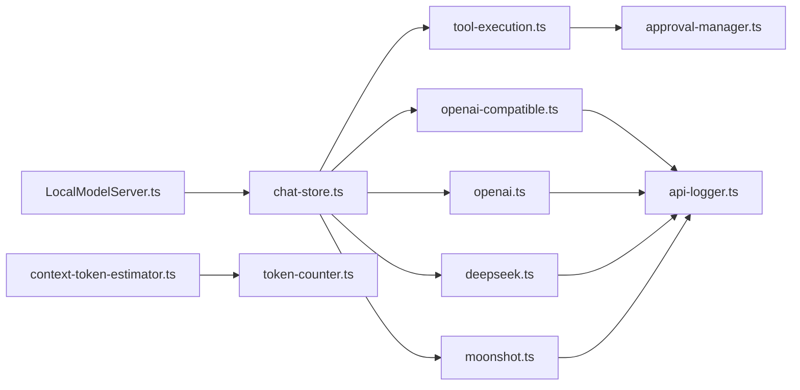

# 推理执行引擎

<cite>
**本文引用的文件**
- [src/lib/local-inference/LocalModelServer.ts](file://src/lib/local-inference/LocalModelServer.ts)
- [app/settings/local-models.tsx](file://app/settings/local-models.tsx)
- [src/components/chat/InferenceSettings.tsx](file://src/components/chat/InferenceSettings.tsx)
- [src/components/chat/InferencePresets.tsx](file://src/components/chat/InferencePresets.tsx)
- [src/lib/llm/providers/openai-compatible.ts](file://src/lib/llm/providers/openai-compatible.ts)
- [src/lib/llm/providers/openai.ts](file://src/lib/llm/providers/openai.ts)
- [src/lib/llm/providers/deepseek.ts](file://src/lib/llm/providers/deepseek.ts)
- [src/lib/llm/providers/moonshot.ts](file://src/lib/llm/providers/moonshot.ts)
- [src/lib/llm/api-logger.ts](file://src/lib/llm/api-logger.ts)
- [src/lib/logging/LogSchema.ts](file://src/lib/logging/LogSchema.ts)
- [src/features/chat/utils/context-token-estimator.ts](file://src/features/chat/utils/context-token-estimator.ts)
- [src/features/chat/utils/token-counter.ts](file://src/features/chat/utils/token-counter.ts)
- [src/store/chat-store.ts](file://src/store/chat-store.ts)
- [src/store/chat/tool-execution.ts](file://src/store/chat/tool-execution.ts)
- [src/store/chat/approval-manager.ts](file://src/store/chat/approval-manager.ts)
- [src/services/workbench/StaticServerService.ts](file://src/services/workbench/StaticServerService.ts)
</cite>

## 目录
1. [引言](#引言)
2. [项目结构](#项目结构)
3. [核心组件](#核心组件)
4. [架构总览](#架构总览)
5. [详细组件分析](#详细组件分析)
6. [依赖关系分析](#依赖关系分析)
7. [性能考量](#性能考量)
8. [故障排查指南](#故障排查指南)
9. [结论](#结论)
10. [附录](#附录)

## 引言
本技术文档聚焦于本地推理执行引擎，系统性阐述从“推理请求”到“流式响应”的完整处理链路，覆盖参数校验、上下文构建、执行调度、GPU/NPU 加速检测与集成、超时与中断处理、资源释放、质量控制（温度、采样策略）、以及性能监控与日志调试等主题。文档面向开发者与高级用户，既提供高层架构视图，也给出可操作的实现细节与排障建议。

## 项目结构
本地推理能力由“本地模型服务”“推理提供者适配层”“上下文与令牌估算”“执行与审批调度”“日志与监控”等模块协同完成。前端设置页负责展示硬件加速状态与模型兼容性提示；推理提供者统一处理流式与非流式响应；上下文估算保障会话不超上下文窗口；执行与审批模块负责工具调用与循环控制；日志系统贯穿请求/响应与内部事件。

图表来源
- [app/settings/local-models.tsx:19-41](file://app/settings/local-models.tsx#L19-L41)
- [src/components/chat/InferenceSettings.tsx:42-70](file://src/components/chat/InferenceSettings.tsx#L42-L70)
- [src/components/chat/InferencePresets.tsx:1-20](file://src/components/chat/InferencePresets.tsx#L1-L20)
- [src/lib/local-inference/LocalModelServer.ts:157-236](file://src/lib/local-inference/LocalModelServer.ts#L157-L236)
- [src/lib/llm/providers/openai-compatible.ts:170-338](file://src/lib/llm/providers/openai-compatible.ts#L170-L338)
- [src/lib/llm/providers/openai.ts:294-333](file://src/lib/llm/providers/openai.ts#L294-L333)
- [src/lib/llm/providers/deepseek.ts:338-377](file://src/lib/llm/providers/deepseek.ts#L338-L377)
- [src/lib/llm/providers/moonshot.ts:200-226](file://src/lib/llm/providers/moonshot.ts#L200-L226)
- [src/store/chat-store.ts:1208-1234](file://src/store/chat-store.ts#L1208-L1234)
- [src/store/chat/tool-execution.ts:153-176](file://src/store/chat/tool-execution.ts#L153-L176)
- [src/store/chat/approval-manager.ts:148-172](file://src/store/chat/approval-manager.ts#L148-L172)
- [src/features/chat/utils/context-token-estimator.ts:134-178](file://src/features/chat/utils/context-token-estimator.ts#L134-L178)
- [src/features/chat/utils/token-counter.ts:1-35](file://src/features/chat/utils/token-counter.ts#L1-L35)
- [src/lib/llm/api-logger.ts:1-59](file://src/lib/llm/api-logger.ts#L1-L59)
- [src/lib/logging/LogSchema.ts:1-42](file://src/lib/logging/LogSchema.ts#L1-L42)
- [src/services/workbench/StaticServerService.ts:98-162](file://src/services/workbench/StaticServerService.ts#L98-L162)

章节来源
- [app/settings/local-models.tsx:19-41](file://app/settings/local-models.tsx#L19-L41)
- [src/lib/local-inference/LocalModelServer.ts:157-236](file://src/lib/local-inference/LocalModelServer.ts#L157-L236)
- [src/lib/llm/providers/openai-compatible.ts:170-338](file://src/lib/llm/providers/openai-compatible.ts#L170-L338)
- [src/store/chat-store.ts:1208-1234](file://src/store/chat-store.ts#L1208-L1234)
- [src/features/chat/utils/context-token-estimator.ts:134-178](file://src/features/chat/utils/context-token-estimator.ts#L134-L178)
- [src/lib/llm/api-logger.ts:1-59](file://src/lib/llm/api-logger.ts#L1-L59)

## 核心组件
- 本地模型服务：负责模型装载、上下文生命周期管理、加速设备信息（GPU/NPU）采集与展示。
- 推理提供者：统一流式/非流式响应解析，处理部分 JSON 片段、HTML 错误页检测、网络异常与超时。
- 执行与审批：聊天循环、工具调用、速率限制、暂停/恢复、干预与审批状态管理。
- 上下文与令牌：估算当前会话上下文长度、系统提示词与 RAG 内容贡献、格式化显示。
- 日志与监控：结构化日志、API 请求/响应记录、静态服务的分块传输与内容长度注入。

章节来源
- [src/lib/local-inference/LocalModelServer.ts:157-236](file://src/lib/local-inference/LocalModelServer.ts#L157-L236)
- [src/lib/llm/providers/openai-compatible.ts:170-338](file://src/lib/llm/providers/openai-compatible.ts#L170-L338)
- [src/store/chat-store.ts:1208-1234](file://src/store/chat-store.ts#L1208-L1234)
- [src/features/chat/utils/context-token-estimator.ts:134-178](file://src/features/chat/utils/context-token-estimator.ts#L134-L178)
- [src/lib/llm/api-logger.ts:1-59](file://src/lib/llm/api-logger.ts#L1-L59)

## 架构总览
推理执行引擎采用“服务-适配-执行-监控”的分层架构。本地模型服务提供底层推理能力与硬件加速信息；推理提供者屏蔽上游 API 的差异；执行与审批模块协调工具调用与循环控制；上下文估算模块保障会话安全；日志系统贯穿全链路。

图表来源
- [src/components/chat/InferenceSettings.tsx:42-70](file://src/components/chat/InferenceSettings.tsx#L42-L70)
- [src/components/chat/InferencePresets.tsx:1-20](file://src/components/chat/InferencePresets.tsx#L1-L20)
- [src/store/chat-store.ts:1208-1234](file://src/store/chat-store.ts#L1208-L1234)
- [src/store/chat/tool-execution.ts:153-176](file://src/store/chat/tool-execution.ts#L153-L176)
- [src/lib/llm/providers/openai-compatible.ts:170-338](file://src/lib/llm/providers/openai-compatible.ts#L170-L338)
- [src/lib/local-inference/LocalModelServer.ts:157-236](file://src/lib/local-inference/LocalModelServer.ts#L157-L236)
- [src/lib/llm/api-logger.ts:1-59](file://src/lib/llm/api-logger.ts#L1-L59)

## 详细组件分析

### 本地模型服务与硬件加速检测
- 模型装载与上下文管理：支持主模型、嵌入与重排序槽位，装载前释放旧上下文，更新加载进度与加速信息。
- 加速信息采集：记录是否使用 GPU/NPU、未使用原因、设备列表，并在设置页以徽章形式展示。
- 自动加载与错误处理：启动后延迟自动加载，失败时通过 toast 与错误字段反馈。

图表来源
- [src/lib/local-inference/LocalModelServer.ts:157-236](file://src/lib/local-inference/LocalModelServer.ts#L157-L236)

章节来源
- [app/settings/local-models.tsx:19-41](file://app/settings/local-models.tsx#L19-L41)
- [src/lib/local-inference/LocalModelServer.ts:157-236](file://src/lib/local-inference/LocalModelServer.ts#L157-L236)

### 推理请求处理与流式响应
- 流式解析：逐行解析 data: 前缀的 JSON 片段，容忍部分片段导致的解析异常；遇到 HTML 响应时主动中止并提示配置问题。
- 非流式解析：一次性解析完整 JSON，提取内容、推理内容与用量。
- 终止与错误：readyState=4 且状态码非 2xx 时，记录响应并触发错误处理；0 状态表示中止或网络错误。

图表来源
- [src/lib/llm/providers/openai-compatible.ts:170-338](file://src/lib/llm/providers/openai-compatible.ts#L170-L338)
- [src/lib/llm/providers/openai.ts:294-333](file://src/lib/llm/providers/openai.ts#L294-L333)
- [src/lib/llm/providers/deepseek.ts:338-377](file://src/lib/llm/providers/deepseek.ts#L338-L377)
- [src/lib/llm/providers/moonshot.ts:200-226](file://src/lib/llm/providers/moonshot.ts#L200-L226)

章节来源
- [src/lib/llm/providers/openai-compatible.ts:170-338](file://src/lib/llm/providers/openai-compatible.ts#L170-L338)
- [src/lib/llm/providers/openai.ts:294-333](file://src/lib/llm/providers/openai.ts#L294-L333)
- [src/lib/llm/providers/deepseek.ts:338-377](file://src/lib/llm/providers/deepseek.ts#L338-L377)
- [src/lib/llm/providers/moonshot.ts:200-226](file://src/lib/llm/providers/moonshot.ts#L200-L226)

### 参数验证、上下文构建与执行调度
- 参数校验与温度调节：推理设置面板提供温度滑条与预设，支持在 UI 层直接调整采样参数。
- 上下文估算：按消息、系统提示词、RAG 检索三部分估算当前上下文长度，提供使用百分比与可视化颜色。
- 执行调度：聊天循环中根据工具调用风险等级与执行模式（手动/半自动）决定是否暂停等待审批；支持速率限制与挂起倒计时。

图表来源
- [src/components/chat/InferenceSettings.tsx:42-70](file://src/components/chat/InferenceSettings.tsx#L42-L70)
- [src/components/chat/InferencePresets.tsx:1-20](file://src/components/chat/InferencePresets.tsx#L1-L20)
- [src/features/chat/utils/context-token-estimator.ts:134-178](file://src/features/chat/utils/context-token-estimator.ts#L134-L178)
- [src/store/chat-store.ts:1208-1234](file://src/store/chat-store.ts#L1208-L1234)
- [src/store/chat/tool-execution.ts:207-234](file://src/store/chat/tool-execution.ts#L207-L234)

章节来源
- [src/components/chat/InferenceSettings.tsx:42-70](file://src/components/chat/InferenceSettings.tsx#L42-L70)
- [src/components/chat/InferencePresets.tsx:1-20](file://src/components/chat/InferencePresets.tsx#L1-L20)
- [src/features/chat/utils/context-token-estimator.ts:134-178](file://src/features/chat/utils/context-token-estimator.ts#L134-L178)
- [src/store/chat-store.ts:1208-1234](file://src/store/chat-store.ts#L1208-L1234)
- [src/store/chat/tool-execution.ts:207-234](file://src/store/chat/tool-execution.ts#L207-L234)

### 超时处理、中断机制与资源释放
- 超时与中断：提供者在 readyState=4 且状态码非 2xx 时触发错误处理；0 状态代表中止或网络异常。
- 资源释放：模型装载前释放旧上下文，避免内存与显存泄漏；工具执行器在速率限制后恢复调用。
- 干预与暂停：当达到循环上限或需要审批时，写入干预步骤并暂停，支持后续恢复。

图表来源
- [src/lib/llm/providers/openai-compatible.ts:315-338](file://src/lib/llm/providers/openai-compatible.ts#L315-L338)
- [src/lib/local-inference/LocalModelServer.ts:166-169](file://src/lib/local-inference/LocalModelServer.ts#L166-L169)
- [src/store/chat/tool-execution.ts:207-234](file://src/store/chat/tool-execution.ts#L207-L234)
- [src/store/chat-store.ts:1208-1234](file://src/store/chat-store.ts#L1208-L1234)

章节来源
- [src/lib/llm/providers/openai-compatible.ts:315-338](file://src/lib/llm/providers/openai-compatible.ts#L315-L338)
- [src/lib/local-inference/LocalModelServer.ts:166-169](file://src/lib/local-inference/LocalModelServer.ts#L166-L169)
- [src/store/chat/tool-execution.ts:207-234](file://src/store/chat/tool-execution.ts#L207-L234)
- [src/store/chat-store.ts:1208-1234](file://src/store/chat-store.ts#L1208-L1234)

### 推理质量控制与采样策略
- 温度参数：通过设置面板动态调整，影响输出随机性与多样性。
- 预设策略：提供常见推理场景的预设，便于快速选择合适的采样策略。
- 工具调用与推理内容：提供者在流式回调中同时推送内容与推理内容，便于质量追踪。

章节来源
- [src/components/chat/InferenceSettings.tsx:42-70](file://src/components/chat/InferenceSettings.tsx#L42-L70)
- [src/components/chat/InferencePresets.tsx:1-20](file://src/components/chat/InferencePresets.tsx#L1-L20)
- [src/lib/llm/providers/openai-compatible.ts:170-338](file://src/lib/llm/providers/openai-compatible.ts#L170-L338)

### 性能监控与日志记录
- 结构化日志：定义日志级别、条目与数据库行结构，支持按标签与会话聚合。
- API 日志：统一记录请求与响应，便于定位上游服务问题。
- 分块传输：静态服务在写入大内容时采用分块策略，注入 Content-Length，提升稳定性。

章节来源
- [src/lib/logging/LogSchema.ts:1-42](file://src/lib/logging/LogSchema.ts#L1-L42)
- [src/lib/llm/api-logger.ts:1-59](file://src/lib/llm/api-logger.ts#L1-L59)
- [src/services/workbench/StaticServerService.ts:98-162](file://src/services/workbench/StaticServerService.ts#L98-L162)

## 依赖关系分析
- 本地模型服务与执行循环强耦合：执行循环依赖模型上下文与加速信息，确保推理在正确设备上运行。
- 推理提供者与日志系统弱耦合：通过统一的 API 日志器记录请求/响应，便于跨提供者对比与诊断。
- 上下文估算与令牌工具：上下文估算依赖令牌估算工具，形成稳定的估算链路。
- 工具执行器与审批管理：工具执行器在速率限制与禁用工具时与审批管理协作，保证可控的执行节奏。

图表来源
- [src/lib/local-inference/LocalModelServer.ts:157-236](file://src/lib/local-inference/LocalModelServer.ts#L157-L236)
- [src/store/chat-store.ts:1208-1234](file://src/store/chat-store.ts#L1208-L1234)
- [src/store/chat/tool-execution.ts:153-176](file://src/store/chat/tool-execution.ts#L153-L176)
- [src/store/chat/approval-manager.ts:148-172](file://src/store/chat/approval-manager.ts#L148-L172)
- [src/lib/llm/providers/openai-compatible.ts:170-338](file://src/lib/llm/providers/openai-compatible.ts#L170-L338)
- [src/lib/llm/providers/openai.ts:294-333](file://src/lib/llm/providers/openai.ts#L294-L333)
- [src/lib/llm/providers/deepseek.ts:338-377](file://src/lib/llm/providers/deepseek.ts#L338-L377)
- [src/lib/llm/providers/moonshot.ts:200-226](file://src/lib/llm/providers/moonshot.ts#L200-L226)
- [src/features/chat/utils/context-token-estimator.ts:134-178](file://src/features/chat/utils/context-token-estimator.ts#L134-L178)
- [src/features/chat/utils/token-counter.ts:1-35](file://src/features/chat/utils/token-counter.ts#L1-L35)
- [src/lib/llm/api-logger.ts:1-59](file://src/lib/llm/api-logger.ts#L1-L59)

章节来源
- [src/lib/local-inference/LocalModelServer.ts:157-236](file://src/lib/local-inference/LocalModelServer.ts#L157-L236)
- [src/store/chat-store.ts:1208-1234](file://src/store/chat-store.ts#L1208-L1234)
- [src/store/chat/tool-execution.ts:153-176](file://src/store/chat/tool-execution.ts#L153-L176)
- [src/store/chat/approval-manager.ts:148-172](file://src/store/chat/approval-manager.ts#L148-L172)
- [src/lib/llm/providers/openai-compatible.ts:170-338](file://src/lib/llm/providers/openai-compatible.ts#L170-L338)
- [src/lib/llm/providers/openai.ts:294-333](file://src/lib/llm/providers/openai.ts#L294-L333)
- [src/lib/llm/providers/deepseek.ts:338-377](file://src/lib/llm/providers/deepseek.ts#L338-L377)
- [src/lib/llm/providers/moonshot.ts:200-226](file://src/lib/llm/providers/moonshot.ts#L200-L226)
- [src/features/chat/utils/context-token-estimator.ts:134-178](file://src/features/chat/utils/context-token-estimator.ts#L134-L178)
- [src/features/chat/utils/token-counter.ts:1-35](file://src/features/chat/utils/token-counter.ts#L1-L35)
- [src/lib/llm/api-logger.ts:1-59](file://src/lib/llm/api-logger.ts#L1-L59)

## 性能考量
- GPU/NPU 加速：通过本地模型服务采集加速信息并在设置页展示，便于用户选择合适模型与设备。
- 分块传输：静态服务在写入大内容时采用固定大小分块与 Content-Length 注入，降低内存峰值与写入失败风险。
- 令牌估算：基于启发式规则估算上下文长度，兼顾准确性与性能；建议结合模型规格与实际测试校准。
- 速率限制与暂停：工具执行器在限流时插入挂起步骤并恢复后切换回常规调用，避免过度占用资源。

章节来源
- [app/settings/local-models.tsx:19-41](file://app/settings/local-models.tsx#L19-L41)
- [src/services/workbench/StaticServerService.ts:98-162](file://src/services/workbench/StaticServerService.ts#L98-L162)
- [src/features/chat/utils/context-token-estimator.ts:134-178](file://src/features/chat/utils/context-token-estimator.ts#L134-L178)
- [src/store/chat/tool-execution.ts:207-234](file://src/store/chat/tool-execution.ts#L207-L234)

## 故障排查指南
- HTML 错误页：当响应以 < 开头时，通常为代理/网关错误页，需检查基础 URL 设置与路径后缀。
- 网络中断与超时：状态码 0 表示中止或网络异常，检查网络连通性与代理配置。
- 上游错误：非 2xx 状态时记录响应体，结合 API 日志器定位具体错误。
- 本地模型加载失败：查看本地模型服务的错误字段与日志，确认模型文件路径与设备兼容性。
- 工具禁用与限流：工具执行器会阻止禁用 MCP 工具调用并提示替代方案；速率限制后会等待并恢复。

章节来源
- [src/lib/llm/providers/openai-compatible.ts:170-178](file://src/lib/llm/providers/openai-compatible.ts#L170-L178)
- [src/lib/llm/providers/openai-compatible.ts:315-338](file://src/lib/llm/providers/openai-compatible.ts#L315-L338)
- [src/lib/llm/api-logger.ts:1-59](file://src/lib/llm/api-logger.ts#L1-L59)
- [src/lib/local-inference/LocalModelServer.ts:231-236](file://src/lib/local-inference/LocalModelServer.ts#L231-L236)
- [src/store/chat/tool-execution.ts:163-176](file://src/store/chat/tool-execution.ts#L163-L176)

## 结论
本推理执行引擎通过本地模型服务、统一的推理提供者、严谨的上下文估算与执行调度、完善的日志监控，实现了从参数校验到流式响应的闭环。GPU/NPU 加速信息与性能优化策略提升了用户体验，而超时、中断与资源释放机制保障了系统的稳定性。建议在实际部署中结合模型规格与设备特性进一步优化上下文估算与采样策略，并持续利用日志系统进行问题定位与性能调优。

## 附录
- 术语
  - 上下文长度：当前会话使用的 token 数量，用于判断是否接近模型上下文窗口上限。
  - 流式响应：分片增量返回的推理结果，适合实时展示与低延迟交互。
  - 温度：采样参数，控制输出随机性与多样性。
- 建议
  - 在设置页增加模型兼容性提示与设备推荐，减少加载失败概率。
  - 对上下文估算加入动态阈值与预警机制，提前提示用户清理或新建会话。
  - 在工具执行器中引入更细粒度的速率限制与排队策略，避免突发负载。