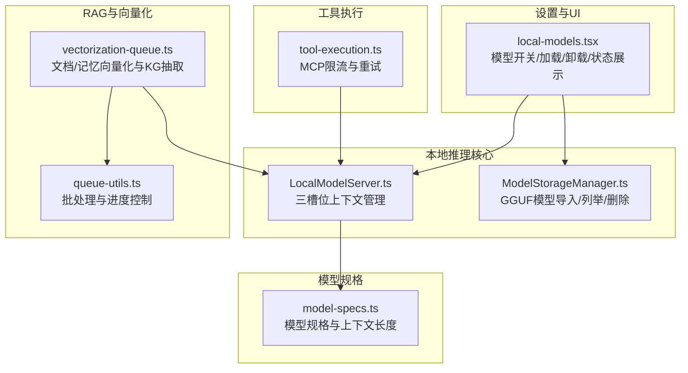
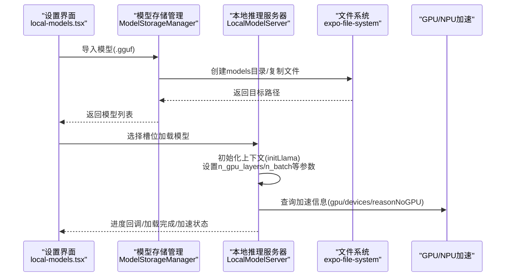
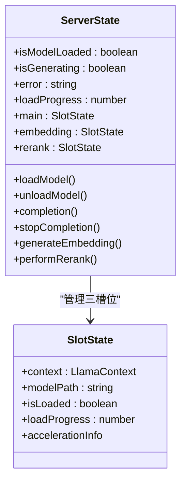
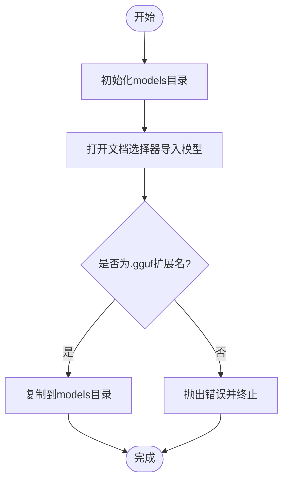
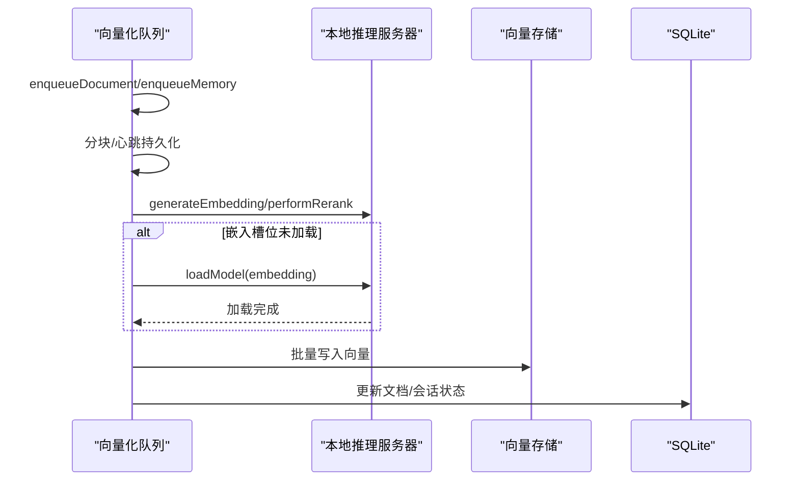
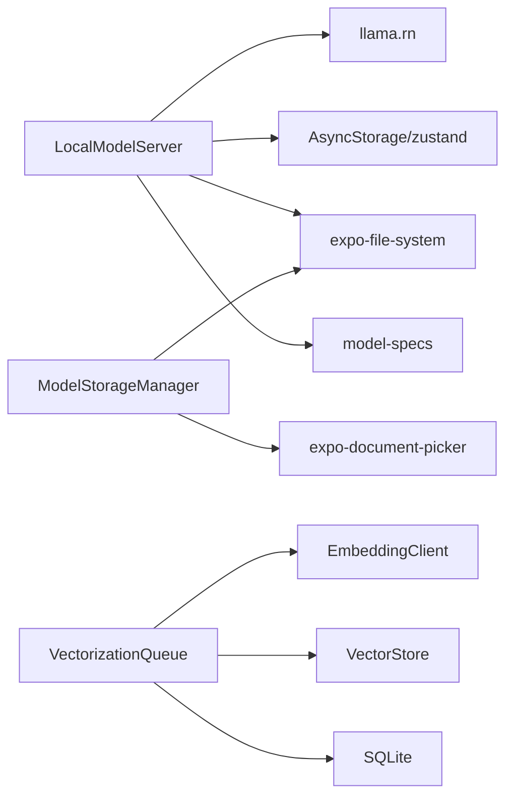

# 本地推理引擎

<cite>
**本文引用的文件**
- [LocalModelServer.ts](file://src/lib/local-inference/LocalModelServer.ts)
- [ModelStorageManager.ts](file://src/lib/local-inference/ModelStorageManager.ts)
- [local-models.tsx](file://app/settings/local-models.tsx)
- [model-specs.ts](file://src/lib/llm/model-specs.ts)
- [vectorization-queue.ts](file://src/lib/rag/vectorization-queue.ts)
- [queue-utils.ts](file://src/lib/queue-utils.ts)
- [tool-execution.ts](file://src/store/chat/tool-execution.ts)
</cite>

## 目录
1. [简介](#简介)
2. [项目结构](#项目结构)
3. [核心组件](#核心组件)
4. [架构总览](#架构总览)
5. [详细组件分析](#详细组件分析)
6. [依赖关系分析](#依赖关系分析)
7. [性能考量](#性能考量)
8. [故障排查指南](#故障排查指南)
9. [结论](#结论)
10. [附录](#附录)

## 简介
本文件系统性梳理 Nexara 本地推理引擎的技术实现，聚焦于本地推理架构、模型管理、推理执行与 GPU 加速支持，详解 GGUF 模型格式支持、模型加载与初始化流程，阐述“主对话/嵌入/重排序”三槽位设计与使用场景，总结性能优化策略（内存管理、并发控制、资源调度），并给出模型兼容性检查、错误处理与故障恢复机制。同时提供部署实践与性能基准参考路径，帮助读者快速理解与落地。

## 项目结构
本地推理相关代码主要集中在以下位置：
- 推理内核与状态管理：src/lib/local-inference/LocalModelServer.ts
- 模型存储与导入：src/lib/local-inference/ModelStorageManager.ts
- 设置界面与交互：app/settings/local-models.tsx
- 模型规格与检索：src/lib/llm/model-specs.ts
- 向量化与重排序流水线：src/lib/rag/vectorization-queue.ts
- 并发与批处理工具：src/lib/queue-utils.ts
- 工具执行与限流：src/store/chat/tool-execution.ts

图表来源
- [LocalModelServer.ts:1-381](file://src/lib/local-inference/LocalModelServer.ts#L1-L381)
- [ModelStorageManager.ts:1-103](file://src/lib/local-inference/ModelStorageManager.ts#L1-L103)
- [local-models.tsx:1-447](file://app/settings/local-models.tsx#L1-L447)
- [vectorization-queue.ts:1-800](file://src/lib/rag/vectorization-queue.ts#L1-L800)
- [queue-utils.ts:1-48](file://src/lib/queue-utils.ts#L1-L48)
- [model-specs.ts:1-347](file://src/lib/llm/model-specs.ts#L1-L347)
- [tool-execution.ts:207-234](file://src/store/chat/tool-execution.ts#L207-L234)

章节来源
- [LocalModelServer.ts:1-381](file://src/lib/local-inference/LocalModelServer.ts#L1-L381)
- [ModelStorageManager.ts:1-103](file://src/lib/local-inference/ModelStorageManager.ts#L1-L103)
- [local-models.tsx:1-447](file://app/settings/local-models.tsx#L1-L447)
- [model-specs.ts:1-347](file://src/lib/llm/model-specs.ts#L1-L347)
- [vectorization-queue.ts:1-800](file://src/lib/rag/vectorization-queue.ts#L1-L800)
- [queue-utils.ts:1-48](file://src/lib/queue-utils.ts#L1-L48)
- [tool-execution.ts:207-234](file://src/store/chat/tool-execution.ts#L207-L234)

## 核心组件
- 三槽位本地推理服务器：统一管理主对话、嵌入、重排序三个上下文，支持自动加载、进度上报、GPU 加速信息查询与互斥执行。
- 模型存储管理器：负责 GGUF 模型目录初始化、列举、导入与删除，确保模型文件可见与可加载。
- 设置界面：提供本地模型开关、模型导入、按槽位加载/卸载、硬件加速状态展示与错误提示。
- 向量化队列：串行化文档/记忆向量化与知识图谱抽取，支持断点续传、心跳检测与可重试错误处理。
- 并发与批处理：通用批处理工具，保障大任务不阻塞 UI 主循环。
- 工具执行：对 MCP 服务进行速率限制与重试，避免外部服务压力过大。

章节来源
- [LocalModelServer.ts:11-55](file://src/lib/local-inference/LocalModelServer.ts#L11-L55)
- [ModelStorageManager.ts:13-102](file://src/lib/local-inference/ModelStorageManager.ts#L13-L102)
- [local-models.tsx:43-447](file://app/settings/local-models.tsx#L43-L447)
- [vectorization-queue.ts:22-37](file://src/lib/rag/vectorization-queue.ts#L22-L37)
- [queue-utils.ts:5-48](file://src/lib/queue-utils.ts#L5-L48)
- [tool-execution.ts:207-234](file://src/store/chat/tool-execution.ts#L207-L234)

## 架构总览
本地推理以“三槽位上下文 + 存储管理 + 设置界面 + 向量化流水线”的方式协同工作。GGUF 模型通过存储管理器导入至应用文档目录；设置界面控制开关与按槽位加载；推理服务器负责初始化上下文、进度回调与 GPU 加速信息；向量化队列在后台串行处理文档/记忆向量化与 KG 抽取，必要时调用嵌入槽位生成向量。

图表来源
- [local-models.tsx:137-198](file://app/settings/local-models.tsx#L137-L198)
- [ModelStorageManager.ts:54-93](file://src/lib/local-inference/ModelStorageManager.ts#L54-L93)
- [LocalModelServer.ts:161-236](file://src/lib/local-inference/LocalModelServer.ts#L161-L236)

## 详细组件分析

### 三槽位本地推理服务器（LocalModelServer）
- 设计要点
  - 三槽位状态：main/embedding/rerank，分别持有独立 LlamaContext，支持独立加载/卸载与进度上报。
  - 自动加载：根据上次加载记录与文件存在性，启动后延迟自动加载，避免启动卡顿。
  - 互斥执行：同一上下文使用弱引用锁序列化 completion/embedding/rerank 调用，避免并发冲突。
  - GPU 加速：初始化时查询 ctx.gpu、devices、reasonNoGPU，供 UI 展示加速状态。
  - 参数优化：显式设置 n_gpu_layers、n_batch、n_ubatch，兼顾稳定性与性能。
- 关键流程
  - 加载：initLlama + 进度回调 + 成功后写入 lastLoadedModel/lastEmbeddingModel/lastRerankModel。
  - 推理：completion 使用 main 槽位；generateEmbedding 强制使用 embedding 槽位；performRerank 优先 rerank 槽位，否则回退 main。
  - 卸载：释放上下文并清空槽位状态。
- 错误处理
  - 捕获加载失败与推理异常，设置 error 字段并通过 toast 提示。
  - generateEmbedding 对空文本输入抛错，避免维度不一致问题。

图表来源
- [LocalModelServer.ts:11-55](file://src/lib/local-inference/LocalModelServer.ts#L11-L55)

章节来源
- [LocalModelServer.ts:57-381](file://src/lib/local-inference/LocalModelServer.ts#L57-L381)

### 模型存储管理器（ModelStorageManager）
- 功能
  - 初始化 models 目录（应用文档目录下）。
  - 列举目录下所有 .gguf 文件，返回名称、大小、URI、路径。
  - 通过系统文档选择器导入模型，校验扩展名并复制到 models 目录。
  - 删除指定模型文件。
- 与设置界面协作
  - 设置界面调用 listModels 同步 Provider 的模型列表，导入后刷新列表并提示。

图表来源
- [ModelStorageManager.ts:54-93](file://src/lib/local-inference/ModelStorageManager.ts#L54-L93)

章节来源
- [ModelStorageManager.ts:13-102](file://src/lib/local-inference/ModelStorageManager.ts#L13-L102)
- [local-models.tsx:59-101](file://app/settings/local-models.tsx#L59-L101)

### 设置界面（local-models.tsx）
- 功能
  - 控制本地模型总开关，启用时自动创建/启用本地 Provider 并同步模型列表。
  - 导入、删除模型，按槽位加载/卸载，展示各槽位加载进度与硬件加速状态。
  - 当模型被删除时，若对应槽位已加载则自动卸载。
- 与服务器联动
  - 调用 useLocalModelStore 的 loadModel/unloadModel，监听 error 并通过 toast 提示。

章节来源
- [local-models.tsx:43-447](file://app/settings/local-models.tsx#L43-L447)

### 向量化与重排序流水线（vectorization-queue.ts）
- 流程
  - 文档向量化：文本分块 -> 选择 Provider/模型 -> 批量向量提取 -> 存储 -> 可选 KG 抽取。
  - 记忆归档：对单轮对话切分为块 -> 向量化 -> 存储到会话向量库。
  - 断点续传：持久化任务状态，心跳超时标记为中断，唤醒后恢复。
  - 可重试错误：对“本地模型未加载/预测中/网络/超时/5xx”等错误指数退避重试。
- 与本地推理的衔接
  - generateEmbedding 与 performRerank 依赖已加载的 embedding/rerank/main 槽位。
  - 若 embedding 槽位未加载，自动尝试加载 lastEmbeddingModel 并提示。

图表来源
- [vectorization-queue.ts:44-504](file://src/lib/rag/vectorization-queue.ts#L44-L504)
- [LocalModelServer.ts:267-335](file://src/lib/local-inference/LocalModelServer.ts#L267-L335)

章节来源
- [vectorization-queue.ts:22-800](file://src/lib/rag/vectorization-queue.ts#L22-L800)
- [LocalModelServer.ts:267-335](file://src/lib/local-inference/LocalModelServer.ts#L267-L335)

### 并发与批处理（queue-utils.ts）
- 作用
  - 将大批量任务拆分为小批次，每批之间插入微小延时，避免 UI 线程阻塞。
  - 提供进度回调与错误收集，便于 UI 展示与日志追踪。
- 应用场景
  - 向量化过程中的分块处理、批量写入等。

章节来源
- [queue-utils.ts:5-48](file://src/lib/queue-utils.ts#L5-L48)

### 工具执行与限流（tool-execution.ts）
- 作用
  - 对 MCP 服务调用进行速率限制与等待，避免触发上游限流或过载。
  - 在限流期间更新步骤状态并等待，恢复后继续调用。
- 与本地推理的关系
  - 本地推理稳定运行是工具链路顺畅的前提，避免因本地模型忙导致工具调用失败。

章节来源
- [tool-execution.ts:207-234](file://src/store/chat/tool-execution.ts#L207-L234)

## 依赖关系分析
- LocalModelServer 依赖
  - llama.rn：初始化上下文、completion、embedding、rerank、进度回调与加速信息。
  - AsyncStorage/zustand：持久化槽位状态与自动加载配置。
  - Expo FileSystem：模型文件读写与目录管理。
- ModelStorageManager 依赖
  - expo-document-picker：系统文档选择器导入模型。
  - expo-file-system：目录创建、文件列举、复制与删除。
- vectorization-queue 依赖
  - EmbeddingClient：统一的嵌入客户端封装。
  - vector-store：向量存储写入。
  - SQLite：任务持久化与状态恢复。
- model-specs 依赖
  - 为模型检索与上下文长度推断提供规格数据库。

图表来源
- [LocalModelServer.ts:1-10](file://src/lib/local-inference/LocalModelServer.ts#L1-L10)
- [ModelStorageManager.ts:1-2](file://src/lib/local-inference/ModelStorageManager.ts#L1-L2)
- [vectorization-queue.ts:1-11](file://src/lib/rag/vectorization-queue.ts#L1-L11)
- [model-specs.ts:1-7](file://src/lib/llm/model-specs.ts#L1-L7)

章节来源
- [LocalModelServer.ts:1-10](file://src/lib/local-inference/LocalModelServer.ts#L1-L10)
- [ModelStorageManager.ts:1-2](file://src/lib/local-inference/ModelStorageManager.ts#L1-L2)
- [vectorization-queue.ts:1-11](file://src/lib/rag/vectorization-queue.ts#L1-L11)
- [model-specs.ts:1-7](file://src/lib/llm/model-specs.ts#L1-L7)

## 性能考量
- GPU/NPU 加速
  - 初始化时设置 n_gpu_layers 为较高层数，提升推理速度；同时保留 n_batch/n_ubatch 以避免溢出。
  - 通过 accelerationInfo 展示 GPU 可用性与原因，便于用户判断设备适配。
- 内存与上下文管理
  - 三槽位独立上下文，避免共享带来的资源竞争；互斥锁保证同一上下文内串行执行。
  - 自动加载延迟与后台卸载策略降低启动与后台占用。
- 并发与批处理
  - 向量化采用串行+断点续传，避免并发冲突；批处理工具在大任务中让出主线程，保持 UI 流畅。
- 任务重试与稳定性
  - 对“本地模型未加载/预测中/网络/超时/5xx”等错误进行指数退避重试，提高整体成功率。
- 模型规格与上下文长度
  - 通过 model-specs 提供上下文长度参考，辅助前端与 RAG 配置合理化。

章节来源
- [LocalModelServer.ts:182-205](file://src/lib/local-inference/LocalModelServer.ts#L182-L205)
- [vectorization-queue.ts:200-250](file://src/lib/rag/vectorization-queue.ts#L200-L250)
- [queue-utils.ts:5-48](file://src/lib/queue-utils.ts#L5-L48)
- [model-specs.ts:302-347](file://src/lib/llm/model-specs.ts#L302-L347)

## 故障排查指南
- 常见错误与处理
  - “本地模型未加载”：确认对应槽位已加载；若 embedding 未加载，系统会尝试自动加载 lastEmbeddingModel 并提示。
  - “上下文正在生成”：等待当前 completion 结束或调用 stopCompletion。
  - “向量化失败/警告”：检查网络/配额/超时；查看任务详情与错误友好提示；必要时重试。
  - “嵌入槽位为空”：确保已为 embedding 槽位加载专用嵌入模型。
- 恢复机制
  - 心跳检测：超过阈值未更新的任务标记为中断，应用唤醒后恢复。
  - 断点续传：持久化任务状态，支持从上次断点继续。
  - 可重试：对瞬态错误进行指数退避重试，最多三次。
- UI 提示
  - 设置界面与服务器错误字段配合 toast 输出，便于用户感知与反馈。

章节来源
- [vectorization-queue.ts:200-250](file://src/lib/rag/vectorization-queue.ts#L200-L250)
- [LocalModelServer.ts:267-335](file://src/lib/local-inference/LocalModelServer.ts#L267-L335)
- [local-models.tsx:421-425](file://app/settings/local-models.tsx#L421-L425)

## 结论
Nexara 本地推理引擎以“三槽位上下文 + 存储管理 + 设置界面 + 向量化流水线”为核心，结合 GGUF 模型格式与 llama.rn 推理内核，实现了稳定的本地推理能力。通过 GPU 加速、互斥执行、断点续传与可重试机制，系统在性能与可靠性之间取得平衡。配合模型规格数据库与工具限流策略，整体具备良好的可维护性与扩展性。

## 附录
- 实际部署建议
  - 优先使用支持 GPU/NPU 的设备，确保 n_gpu_layers 设置合理。
  - 为 embedding/rerank 槽位准备专用模型，避免回退到主对话槽位造成性能与语义偏差。
  - 启用自动加载并确保模型文件路径有效，避免启动后手动加载。
- 性能基准参考
  - 建议在目标设备上记录以下指标：首次加载耗时、completion 延迟、embedding 向量生成耗时、向量化吞吐（chunk/s）、KG 抽取耗时。
  - 参考路径：[LocalModelServer.ts:182-205](file://src/lib/local-inference/LocalModelServer.ts#L182-L205)、[vectorization-queue.ts:317-337](file://src/lib/rag/vectorization-queue.ts#L317-L337)