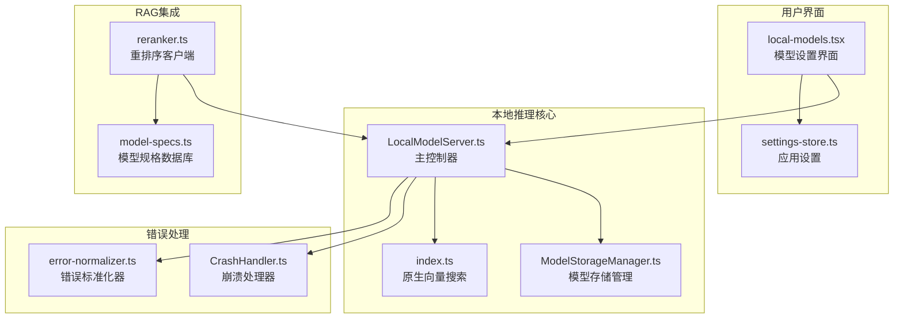
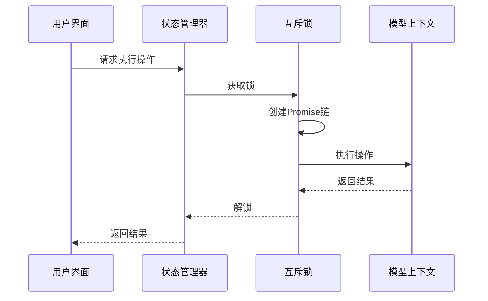
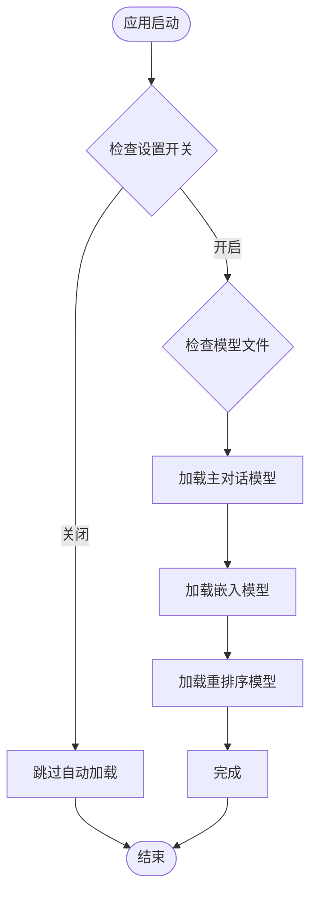
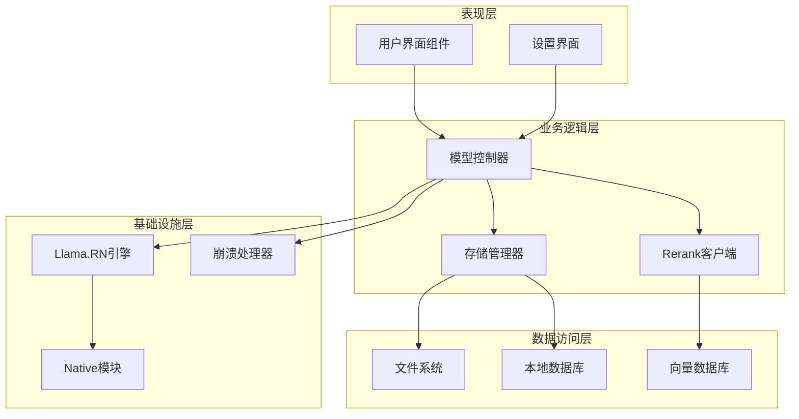
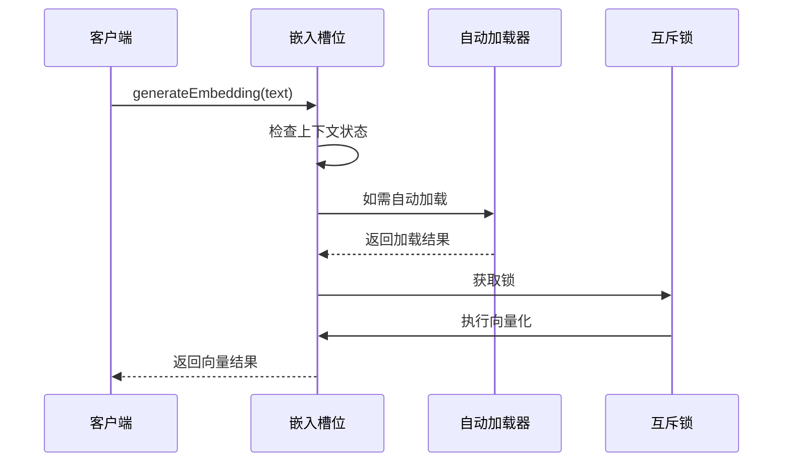
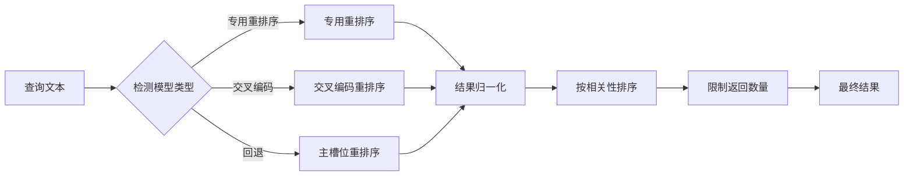
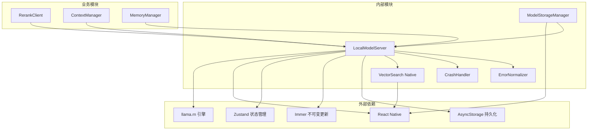

# 模型槽位管理系统

<cite>
**本文档引用的文件**
- [LocalModelServer.ts](file://src/lib/local-inference/LocalModelServer.ts)
- [local-models.tsx](file://app/settings/local-models.tsx)
- [reranker.ts](file://src/lib/rag/reranker.ts)
- [model-specs.ts](file://src/lib/llm/model-specs.ts)
- [ModelStorageManager.ts](file://src/lib/local-inference/ModelStorageManager.ts)
- [settings-store.ts](file://src/store/settings-store.ts)
- [index.ts](file://src/native/VectorSearch/index.ts)
- [CrashHandler.ts](file://src/lib/logging/CrashHandler.ts)
- [error-normalizer.ts](file://src/lib/llm/error-normalizer.ts)
</cite>

## 目录
1. [简介](#简介)
2. [项目结构](#项目结构)
3. [核心组件](#核心组件)
4. [架构概览](#架构概览)
5. [详细组件分析](#详细组件分析)
6. [依赖关系分析](#依赖关系分析)
7. [性能考虑](#性能考虑)
8. [故障排除指南](#故障排除指南)
9. [结论](#结论)

## 简介

模型槽位管理系统是 Nexara 本地推理引擎的核心组件，负责管理三个独立的模型槽位：主对话槽位（Main）、嵌入槽位（Embedding）和重排序槽位（Rerank）。该系统实现了高效的资源管理、并发控制和线程安全保障，为本地大语言模型的部署和使用提供了完整的解决方案。

系统基于 llama.rn 引擎构建，采用 Zustand 状态管理库实现响应式状态更新，并通过互斥锁机制确保多个槽位之间的线程安全。每个槽位都维护独立的上下文状态，支持动态加载、卸载和自动管理功能。

## 项目结构

模型槽位管理系统主要分布在以下目录和文件中：



**图表来源**
- [LocalModelServer.ts:1-381](file://src/lib/local-inference/LocalModelServer.ts#L1-L381)
- [local-models.tsx:1-447](file://app/settings/local-models.tsx#L1-L447)

**章节来源**
- [LocalModelServer.ts:1-381](file://src/lib/local-inference/LocalModelServer.ts#L1-L381)
- [local-models.tsx:1-447](file://app/settings/local-models.tsx#L1-L447)

## 核心组件

### 槽位状态管理器

系统的核心是 LocalModelServer，它管理三个独立的模型槽位，每个槽位都有完整的状态管理能力：

| 槽位类型 | 主要职责 | 状态字段 | 并发控制 |
|---------|----------|----------|----------|
| Main | 主对话推理 | context, modelPath, isLoaded, loadProgress | 互斥锁保护 |
| Embedding | 文本向量化 | context, modelPath, isLoaded, loadProgress | 互斥锁保护 |
| Rerank | 文档重排序 | context, modelPath, isLoaded, loadProgress | 互斥锁保护 |

### 互斥锁实现

系统采用 WeakMap 实现的互斥锁机制，确保同一上下文的连续访问：



**图表来源**
- [LocalModelServer.ts:74-82](file://src/lib/local-inference/LocalModelServer.ts#L74-L82)

### 自动加载机制

系统支持智能的自动加载功能，根据上次使用的模型路径自动重新加载：



**图表来源**
- [LocalModelServer.ts:103-159](file://src/lib/local-inference/LocalModelServer.ts#L103-L159)

**章节来源**
- [LocalModelServer.ts:11-98](file://src/lib/local-inference/LocalModelServer.ts#L11-L98)
- [LocalModelServer.ts:74-82](file://src/lib/local-inference/LocalModelServer.ts#L74-L82)

## 架构概览

模型槽位管理系统采用分层架构设计，确保各组件之间的松耦合和高内聚：



**图表来源**
- [LocalModelServer.ts:1-381](file://src/lib/local-inference/LocalModelServer.ts#L1-L381)
- [local-models.tsx:1-447](file://app/settings/local-models.tsx#L1-L447)

## 详细组件分析

### 主对话槽位（Main）

主对话槽位是系统的核心推理引擎，负责处理主要的对话生成任务：

#### 关键特性
- **上下文长度配置**：默认 2048 tokens，可根据设备性能调整
- **硬件加速**：支持 GPU/NPU 加速，自动检测可用设备
- **批处理优化**：设置合理的 n_batch 和 n_ubatch 参数
- **内存锁定**：使用 mlock 防止内存交换，提升稳定性

#### 并发控制策略
```mermaid
classDiagram
class MainSlot {
+LlamaContext context
+string modelPath
+boolean isLoaded
+number loadProgress
+AccelerationInfo accelerationInfo
+completion(params, callback) Promise
+stopCompletion() Promise
+release() Promise
}
class MutexLock {
+WeakMap~LlamaContext, Promise~ mutexMap
+runWithLock(ctx, operation) Promise
}
class MainSlot --> MutexLock : uses
```

**图表来源**
- [LocalModelServer.ts:250-265](file://src/lib/local-inference/LocalModelServer.ts#L250-L265)

**章节来源**
- [LocalModelServer.ts:182-236](file://src/lib/local-inference/LocalModelServer.ts#L182-L236)

### 嵌入槽位（Embedding）

嵌入槽位专门负责文本向量化任务，为向量检索和相似度计算提供支持：

#### 设计特点
- **专用向量化**：每个槽位独立维护嵌入上下文
- **自动加载机制**：当嵌入模型未加载时自动尝试加载
- **严格验证**：对输入文本进行严格验证，避免空文本
- **错误处理**：完善的错误捕获和用户提示机制

#### 数据流处理


**图表来源**
- [LocalModelServer.ts:267-317](file://src/lib/local-inference/LocalModelServer.ts#L267-L317)

**章节来源**
- [LocalModelServer.ts:267-317](file://src/lib/local-inference/LocalModelServer.ts#L267-L317)

### 重排序槽位（Rerank）

重排序槽位提供文档相关性重排序功能，支持多种重排序算法：

#### 支持的重排序模型
- **BGE Reranker**：通用重排序模型
- **Jina Reranker**：Jina AI 重排序模型  
- **Cohere Rerank**：Cohere 重排序模型
- **通用重排序**：支持多种格式的通用模型

#### 重排序流程


**图表来源**
- [LocalModelServer.ts:319-335](file://src/lib/local-inference/LocalModelServer.ts#L319-L335)
- [reranker.ts:23-81](file://src/lib/rag/reranker.ts#L23-L81)

**章节来源**
- [LocalModelServer.ts:319-335](file://src/lib/local-inference/LocalModelServer.ts#L319-L335)
- [reranker.ts:13-81](file://src/lib/rag/reranker.ts#L13-L81)

### 模型存储管理

系统提供完整的模型存储和管理功能：

#### 存储结构
- **模型目录**：`documentDirectory/models/`
- **文件格式**：GGUF 格式模型文件
- **元数据**：文件名、大小、路径信息

#### 管理功能
- **模型导入**：支持从系统文件选择器导入
- **模型删除**：安全删除不需要的模型文件
- **模型列表**：扫描并列出所有可用模型

**章节来源**
- [ModelStorageManager.ts:13-102](file://src/lib/local-inference/ModelStorageManager.ts#L13-L102)

### 设置和配置

系统提供灵活的配置选项和用户界面：

#### 全局设置
- **本地模型开关**：控制是否启用本地推理功能
- **自动加载配置**：决定是否自动加载上次使用的模型
- **硬件加速显示**：显示当前模型的硬件加速状态

#### 用户界面特性
- **状态指示器**：实时显示各槽位的加载状态
- **进度反馈**：显示模型加载进度
- **硬件信息**：显示 GPU/NPU 加速状态

**章节来源**
- [local-models.tsx:43-428](file://app/settings/local-models.tsx#L43-L428)
- [settings-store.ts:58-60](file://src/store/settings-store.ts#L58-L60)

## 依赖关系分析

模型槽位管理系统的关键依赖关系如下：



**图表来源**
- [LocalModelServer.ts:1-10](file://src/lib/local-inference/LocalModelServer.ts#L1-L10)
- [reranker.ts:1-3](file://src/lib/rag/reranker.ts#L1-L3)

### 循环依赖检查

经过分析，系统没有发现循环依赖关系：
- LocalModelServer 依赖外部引擎但不反向依赖其他模块
- 各业务模块通过接口依赖 LocalModelServer，而非直接依赖
- 存储管理器与控制器通过状态管理器解耦

**章节来源**
- [LocalModelServer.ts:1-10](file://src/lib/local-inference/LocalModelServer.ts#L1-L10)
- [reranker.ts:1-3](file://src/lib/rag/reranker.ts#L1-L3)

## 性能考虑

### 内存管理策略

系统采用了多层内存管理策略以确保最佳性能：

#### 内存锁定
- **mlock 参数**：防止模型内存被操作系统交换到磁盘
- **批量大小优化**：合理设置 n_batch 和 n_ubatch 参数
- **上下文复用**：避免频繁创建和销毁模型上下文

#### 资源释放
- **显式释放**：卸载模型时主动释放 GPU 内存
- **状态清理**：清除所有相关的状态和引用
- **垃圾回收**：依赖 JavaScript 垃圾回收机制

### 并发性能优化

#### 互斥锁设计
- **弱映射存储**：使用 WeakMap 存储锁状态，避免内存泄漏
- **Promise 链**：确保操作按顺序执行，避免竞态条件
- **错误恢复**：即使前一个操作失败，后续操作仍能正常执行

#### 缓存策略
- **模型缓存**：已加载的模型保持在内存中
- **状态缓存**：硬件加速信息和模型规格缓存
- **进度缓存**：加载进度状态持久化

### 硬件加速优化

系统支持多种硬件加速方式：

#### GPU 加速
- **自动检测**：运行时检测可用的 GPU 设备
- **加速状态**：显示详细的硬件加速信息
- **性能监控**：记录硬件加速的性能指标

#### NPU 支持
- **专用加速**：某些设备支持神经网络处理单元
- **兼容性检查**：确保模型与硬件的兼容性

**章节来源**
- [LocalModelServer.ts:182-205](file://src/lib/local-inference/LocalModelServer.ts#L182-L205)
- [LocalModelServer.ts:213-217](file://src/lib/local-inference/LocalModelServer.ts#L213-L217)

## 故障排除指南

### 常见问题诊断

#### 模型加载失败
**症状**：模型文件存在但加载失败
**可能原因**：
- 模型文件损坏或不完整
- 硬件不支持当前模型
- 内存不足导致加载失败

**解决步骤**：
1. 验证模型文件完整性
2. 检查硬件兼容性
3. 关闭其他应用释放内存
4. 重新导入模型文件

#### 嵌入向量生成错误
**症状**：generateEmbedding 抛出异常
**可能原因**：
- 输入文本为空或只包含空白字符
- 嵌入模型未正确加载
- 原生模块调用失败

**解决步骤**：
1. 确保输入文本非空
2. 检查嵌入槽位状态
3. 重新加载嵌入模型
4. 查看崩溃日志

#### 重排序功能异常
**症状**：performRerank 返回空结果
**可能原因**：
- 模型不支持交叉编码
- 查询文本过长
- 相关性分数过低

**解决步骤**：
1. 检查模型规格支持
2. 缩短查询文本长度
3. 调整阈值参数
4. 使用不同的重排序模型

### 错误处理机制

系统实现了多层次的错误处理机制：

#### 崩溃防护
- **全局异常捕获**：捕获未处理的 JavaScript 异常
- **原生层监控**：监控原生模块的崩溃情况
- **日志记录**：详细记录错误信息和堆栈跟踪

#### 用户反馈
- **Toast 通知**：向用户显示友好的错误信息
- **状态指示**：在界面上显示错误状态
- **重试机制**：提供自动重试功能

**章节来源**
- [CrashHandler.ts:8-52](file://src/lib/logging/CrashHandler.ts#L8-L52)
- [LocalModelServer.ts:231-235](file://src/lib/local-inference/LocalModelServer.ts#L231-L235)

### 性能监控

系统提供了全面的性能监控功能：

#### 关键指标
- **加载时间**：记录模型加载耗时
- **推理延迟**：测量对话生成响应时间
- **内存使用**：监控内存占用情况
- **GPU 利用率**：跟踪硬件加速效率

#### 监控工具
- **控制台日志**：详细的调试信息输出
- **性能统计**：收集和分析性能数据
- **告警机制**：异常情况自动告警

**章节来源**
- [LocalModelServer.ts:303-316](file://src/lib/local-inference/LocalModelServer.ts#L303-L316)
- [reranker.ts:58-62](file://src/lib/rag/reranker.ts#L58-L62)

## 结论

模型槽位管理系统是一个设计精良的本地推理引擎，具有以下显著特点：

### 技术优势
- **模块化设计**：三个独立槽位实现高度解耦
- **线程安全**：完善的互斥锁机制确保并发安全
- **智能管理**：自动加载、卸载和资源管理
- **错误处理**：多层次的错误捕获和恢复机制

### 使用场景
- **本地对话**：主对话槽位提供高质量的本地推理
- **向量检索**：嵌入槽位支持高效的向量相似度计算
- **文档重排序**：重排序槽位提升检索结果质量

### 发展前景
系统具备良好的扩展性和维护性，可以轻松添加新的模型类型和功能特性。通过持续优化内存管理和并发控制，系统可以在更多设备上提供流畅的本地推理体验。