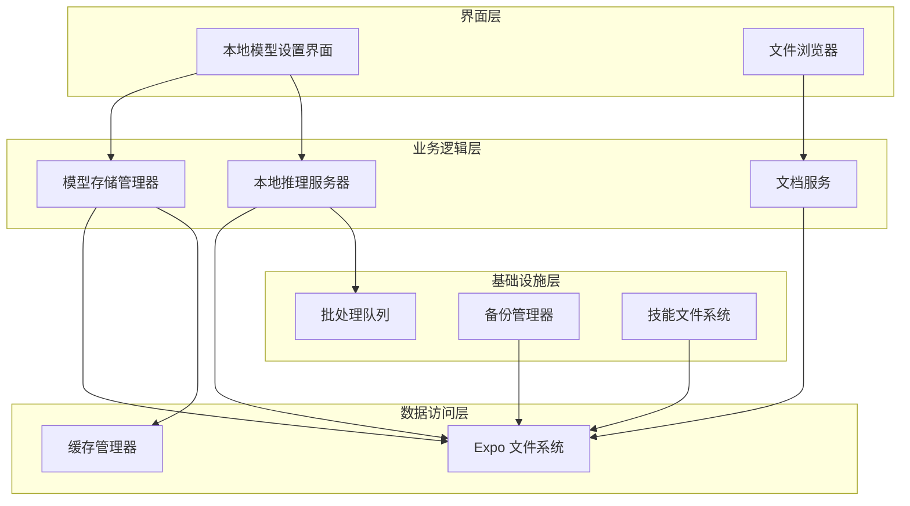
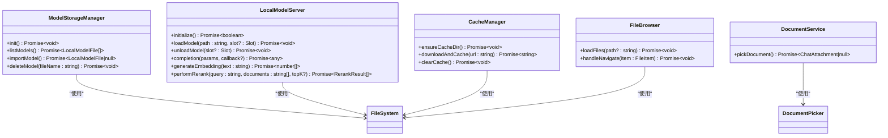
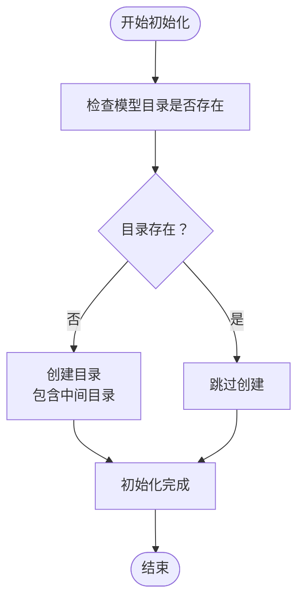
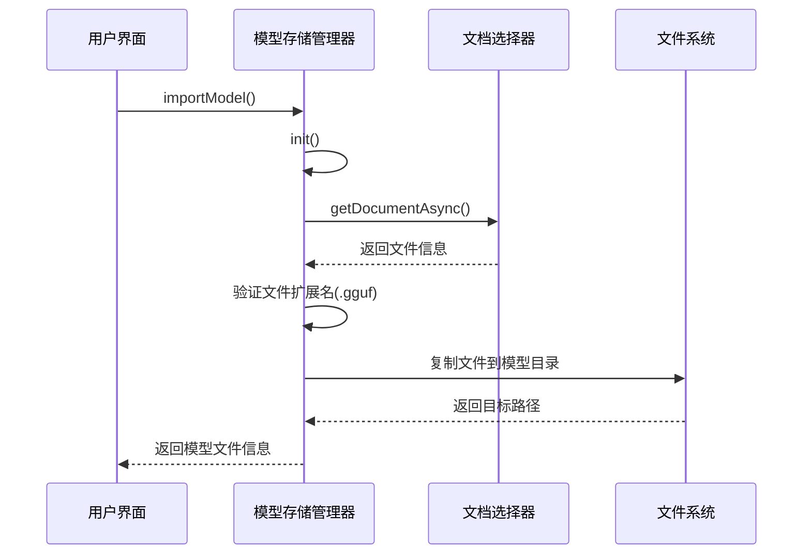
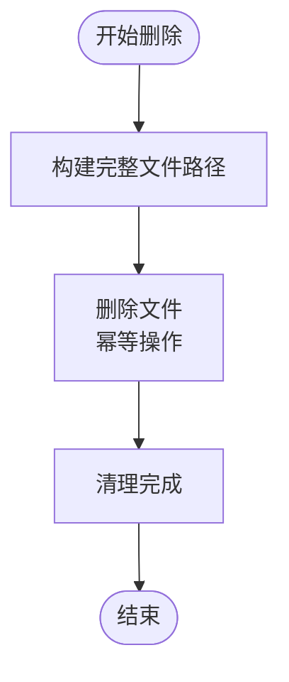
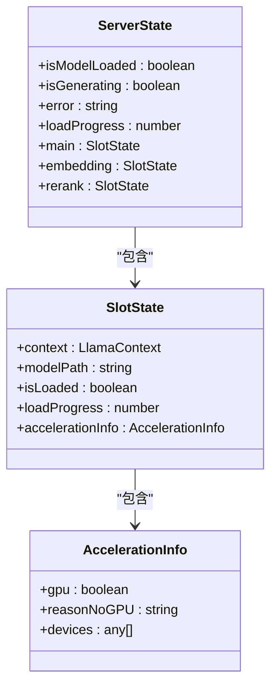
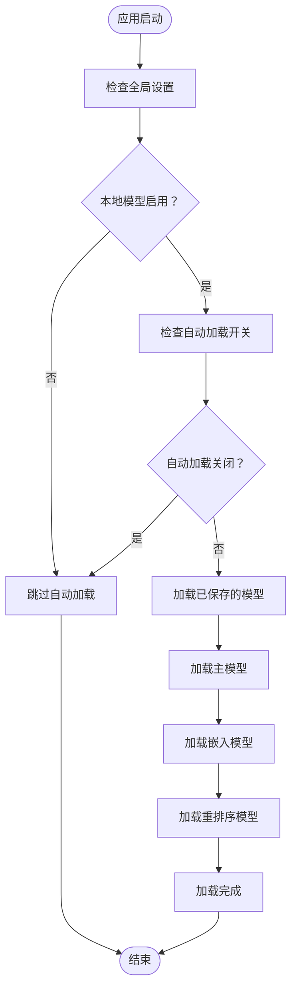
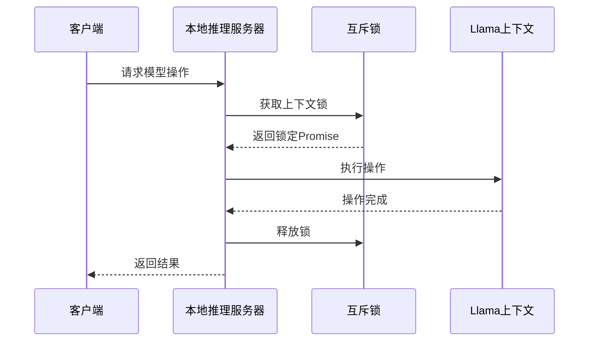
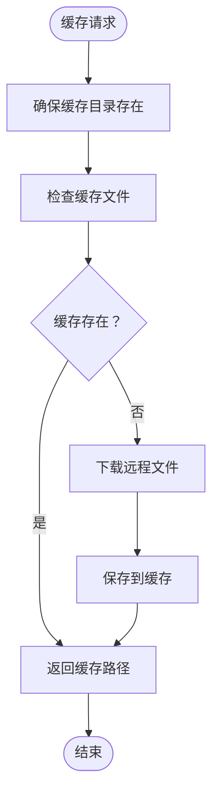
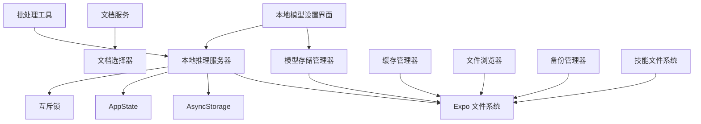

# 模型管理系统

<cite>
**本文档引用的文件**
- [ModelStorageManager.ts](file://src/lib/local-inference/ModelStorageManager.ts)
- [LocalModelServer.ts](file://src/lib/local-inference/LocalModelServer.ts)
- [local-models.tsx](file://app/settings/local-models.tsx)
- [document-service.ts](file://src/lib/file/document-service.ts)
- [FileBrowser.tsx](file://src/features/chat/components/WorkspaceSheet/FileBrowser.tsx)
- [cache-manager.ts](file://src/lib/cache/cache-manager.ts)
- [queue-utils.ts](file://src/lib/queue-utils.ts)
- [BackupManager.ts](file://src/lib/backup/BackupManager.ts)
- [filesystem.ts](file://src/lib/skills/definitions/filesystem.ts)
</cite>

## 目录
1. [简介](#简介)
2. [项目结构](#项目结构)
3. [核心组件](#核心组件)
4. [架构概览](#架构概览)
5. [详细组件分析](#详细组件分析)
6. [依赖关系分析](#依赖关系分析)
7. [性能考虑](#性能考虑)
8. [故障排除指南](#故障排除指南)
9. [结论](#结论)
10. [附录](#附录)

## 简介

本文件详细阐述了本地推理模型管理系统的完整技术实现，重点涵盖以下方面：

- 模型存储管理器的设计架构与实现细节
- GGUF模型格式的兼容性检查与验证流程
- 模型元数据提取与完整性验证机制
- 模型路径管理与文件系统操作策略
- 异步存储与并发控制机制
- 模型缓存机制与磁盘空间管理
- 导入导出流程、批量操作与错误恢复策略
- 实际使用示例与最佳实践建议

该系统基于React Native与Expo File System构建，采用模块化设计，确保可扩展性和易维护性。

## 项目结构

本地推理模型管理系统主要由以下层次组成：

- **界面层**：提供用户交互界面，支持模型导入、删除、加载与状态监控
- **业务逻辑层**：封装模型存储管理与本地推理服务器的协调逻辑
- **数据访问层**：通过Expo File System与设备文件系统交互
- **工具与基础设施层**：提供缓存管理、批处理队列、备份与恢复等辅助功能

**图表来源**
- [local-models.tsx:43-446](file://app/settings/local-models.tsx#L43-L446)
- [ModelStorageManager.ts:13-102](file://src/lib/local-inference/ModelStorageManager.ts#L13-L102)
- [LocalModelServer.ts:57-381](file://src/lib/local-inference/LocalModelServer.ts#L57-L381)

**章节来源**
- [local-models.tsx:43-446](file://app/settings/local-models.tsx#L43-L446)
- [ModelStorageManager.ts:13-102](file://src/lib/local-inference/ModelStorageManager.ts#L13-L102)
- [LocalModelServer.ts:57-381](file://src/lib/local-inference/LocalModelServer.ts#L57-L381)

## 核心组件

### 模型存储管理器 (ModelStorageManager)

模型存储管理器负责模型文件的生命周期管理，包括初始化、列表查询、导入、删除等操作。其核心特性包括：

- **目录初始化**：确保模型存储目录存在，避免运行时异常
- **模型发现**：扫描指定目录下的GGUF文件，构建模型清单
- **导入流程**：通过文档选择器导入模型文件，执行格式验证
- **删除操作**：安全删除指定模型文件，支持幂等操作

关键接口与职责：
- `init()`：初始化模型存储目录
- `listModels()`：枚举可用的GGUF模型
- `importModel()`：从系统文档选择器导入模型
- `deleteModel(fileName)`：删除指定模型文件

**章节来源**
- [ModelStorageManager.ts:13-102](file://src/lib/local-inference/ModelStorageManager.ts#L13-L102)

### 本地推理服务器 (LocalModelServer)

本地推理服务器提供多槽位模型加载与推理能力，支持主模型、嵌入向量模型与重排序模型的独立管理。核心功能包括：

- **多槽位架构**：主模型(main)、嵌入(embedding)、重排序(rerank)三类槽位
- **自动加载**：应用启动后根据持久化状态自动加载模型
- **并发控制**：使用互斥锁确保同一上下文的串行操作
- **硬件加速检测**：提供GPU/NPU加速状态反馈
- **推理接口**：统一的完成、嵌入生成与重排序接口

槽位状态管理：
- `context`：LLama上下文实例
- `modelPath`：当前加载模型的路径
- `isLoaded`：是否已加载标志
- `loadProgress`：加载进度百分比
- `accelerationInfo`：硬件加速信息

**章节来源**
- [LocalModelServer.ts:11-41](file://src/lib/local-inference/LocalModelServer.ts#L11-L41)
- [LocalModelServer.ts:57-381](file://src/lib/local-inference/LocalModelServer.ts#L57-L381)

### 文档服务 (DocumentService)

文档服务提供统一的文档选择与处理接口，支持多种文档格式的导入与预处理。主要功能包括：

- **多格式支持**：文本、Markdown、PDF、JSON、Office文档等
- **文档选择器集成**：通过Expo Document Picker提供跨平台文档选择
- **内容读取**：支持Base64与UTF-8编码的内容读取
- **错误处理**：完善的异常捕获与错误提示机制

**章节来源**
- [document-service.ts:5-29](file://src/lib/file/document-service.ts#L5-L29)

## 架构概览

系统采用分层架构设计，确保各组件职责清晰、耦合度低。整体架构遵循以下原则：

- **单一职责原则**：每个组件专注于特定功能领域
- **依赖倒置原则**：高层模块不依赖低层模块的具体实现
- **开闭原则**：对扩展开放，对修改封闭
- **里氏替换原则**：子类可以替换父类而不影响程序正确性

**图表来源**
- [ModelStorageManager.ts:13-102](file://src/lib/local-inference/ModelStorageManager.ts#L13-L102)
- [LocalModelServer.ts:57-381](file://src/lib/local-inference/LocalModelServer.ts#L57-L381)
- [document-service.ts:5-29](file://src/lib/file/document-service.ts#L5-L29)
- [cache-manager.ts:11-115](file://src/lib/cache/cache-manager.ts#L11-L115)
- [FileBrowser.tsx:22-90](file://src/features/chat/components/WorkspaceSheet/FileBrowser.tsx#L22-L90)

## 详细组件分析

### 模型存储管理器详细分析

#### 初始化流程

模型存储管理器在首次使用前确保模型目录的存在性：

**图表来源**
- [ModelStorageManager.ts:17-22](file://src/lib/local-inference/ModelStorageManager.ts#L17-L22)

#### 模型导入流程

导入流程严格验证文件格式并执行安全复制：

**图表来源**
- [ModelStorageManager.ts:54-93](file://src/lib/local-inference/ModelStorageManager.ts#L54-L93)

#### 模型删除流程

删除操作采用幂等设计，确保即使目标文件不存在也不会产生错误：

**图表来源**
- [ModelStorageManager.ts:98-101](file://src/lib/local-inference/ModelStorageManager.ts#L98-L101)

**章节来源**
- [ModelStorageManager.ts:13-102](file://src/lib/local-inference/ModelStorageManager.ts#L13-L102)

### 本地推理服务器详细分析

#### 多槽位架构设计

服务器采用三槽位设计，每槽位独立管理：

**图表来源**
- [LocalModelServer.ts:23-41](file://src/lib/local-inference/LocalModelServer.ts#L23-L41)
- [LocalModelServer.ts:11-21](file://src/lib/local-inference/LocalModelServer.ts#L11-L21)

#### 自动加载机制

应用启动后的智能模型加载流程：

**图表来源**
- [LocalModelServer.ts:103-159](file://src/lib/local-inference/LocalModelServer.ts#L103-L159)

#### 并发控制与互斥锁

为确保模型操作的线程安全，服务器实现了基于WeakMap的互斥锁机制：

**图表来源**
- [LocalModelServer.ts:74-82](file://src/lib/local-inference/LocalModelServer.ts#L74-L82)

**章节来源**
- [LocalModelServer.ts:57-381](file://src/lib/local-inference/LocalModelServer.ts#L57-L381)

### 文件系统与缓存管理

#### 缓存管理器

缓存管理器提供统一的文件缓存策略：

- **目录管理**：自动创建缓存目录，支持跨平台路径
- **下载缓存**：支持远程文件的下载与缓存
- **缓存清理**：提供完整的缓存清理机制

**图表来源**
- [cache-manager.ts:80-102](file://src/lib/cache/cache-manager.ts#L80-L102)

#### 技能文件系统集成

技能系统中的文件写入与RAG同步机制：

- **目录自动创建**：写入前自动创建必要的目录结构
- **内容编码处理**：支持Base64与UTF-8两种编码方式
- **RAG文档同步**：自动将写入的文档注册到RAG存储中

**章节来源**
- [cache-manager.ts:11-115](file://src/lib/cache/cache-manager.ts#L11-L115)
- [filesystem.ts:54-113](file://src/lib/skills/definitions/filesystem.ts#L54-L113)

### 批处理与队列管理

#### 批处理工具

提供大规模数据处理的批处理工具，确保UI响应性：

- **分块处理**：将大数据集分割为小块进行处理
- **进度回调**：提供处理进度的实时反馈
- **错误隔离**：单个任务失败不影响整体处理流程
- **延迟调度**：在批次间插入微小延迟，避免阻塞主线程

**章节来源**
- [queue-utils.ts:5-48](file://src/lib/queue-utils.ts#L5-L48)

### 备份与恢复机制

#### 备份管理器

提供完整的数据备份与恢复功能：

- **物理文件备份**：支持模型文件的二进制备份
- **版本兼容性**：检查备份版本与当前系统版本的兼容性
- **增量恢复**：支持部分数据的增量恢复
- **错误恢复**：在备份过程中出现错误时提供恢复策略

**章节来源**
- [BackupManager.ts:248-471](file://src/lib/backup/BackupManager.ts#L248-L471)

## 依赖关系分析

系统各组件之间的依赖关系如下：

**图表来源**
- [local-models.tsx:10-11](file://app/settings/local-models.tsx#L10-L11)
- [ModelStorageManager.ts:1-2](file://src/lib/local-inference/ModelStorageManager.ts#L1-L2)
- [LocalModelServer.ts:1-9](file://src/lib/local-inference/LocalModelServer.ts#L1-L9)

**章节来源**
- [local-models.tsx:10-11](file://app/settings/local-models.tsx#L10-L11)
- [ModelStorageManager.ts:1-2](file://src/lib/local-inference/ModelStorageManager.ts#L1-L2)
- [LocalModelServer.ts:1-9](file://src/lib/local-inference/LocalModelServer.ts#L1-L9)

## 性能考虑

### 内存管理

- **上下文生命周期**：合理管理Llama上下文的创建与销毁，避免内存泄漏
- **模型卸载策略**：在应用进入后台或内存紧张时主动卸载不使用的模型
- **缓存大小限制**：设置合理的缓存大小上限，防止内存占用过高

### I/O优化

- **异步操作**：所有文件操作均采用异步方式，避免阻塞主线程
- **批处理策略**：大量文件操作采用批处理方式，减少系统调用次数
- **进度反馈**：提供详细的进度反馈，改善用户体验

### 网络优化

- **缓存策略**：合理利用缓存管理器，减少重复网络请求
- **超时处理**：设置合理的网络请求超时时间
- **重试机制**：在网络不稳定时提供自动重试机制

## 故障排除指南

### 常见问题与解决方案

#### 模型加载失败

**症状**：模型文件显示为可加载但实际加载失败

**可能原因**：
- 模型文件损坏或不完整
- 硬件不支持特定的量化格式
- 内存不足导致加载失败

**解决方案**：
1. 验证模型文件的完整性
2. 尝试不同量化级别的模型
3. 关闭其他应用释放内存
4. 检查设备的GPU/NPU支持情况

#### 文件权限问题

**症状**：无法读取或写入模型文件

**可能原因**：
- 应用没有访问存储的权限
- 文件路径不正确
- 文件被其他进程占用

**解决方案**：
1. 检查应用的存储权限
2. 验证文件路径的有效性
3. 关闭占用文件的其他应用
4. 重新启动应用

#### 磁盘空间不足

**症状**：模型导入失败或缓存清理无效

**解决方案**：
1. 清理不必要的文件释放空间
2. 删除不再使用的模型文件
3. 清空应用缓存
4. 考虑使用外部存储设备

**章节来源**
- [LocalModelServer.ts:231-235](file://src/lib/local-inference/LocalModelServer.ts#L231-L235)
- [ModelStorageManager.ts:89-92](file://src/lib/local-inference/ModelStorageManager.ts#L89-L92)

## 结论

本地推理模型管理系统通过模块化设计实现了完整的模型生命周期管理。系统具备以下优势：

- **架构清晰**：分层设计确保各组件职责明确，易于维护和扩展
- **功能完整**：从模型导入到推理执行提供了完整的解决方案
- **性能优化**：采用异步操作、缓存策略和批处理机制提升性能
- **可靠性高**：完善的错误处理和恢复机制确保系统稳定性

未来可以考虑的功能增强包括：
- 更精细的模型元数据管理
- 支持更多模型格式
- 增强的模型验证和测试功能
- 更灵活的缓存策略

## 附录

### 实际使用示例

#### 导入模型的完整流程

1. 用户在设置界面点击"导入模型"
2. 系统调用文档选择器让用户选择GGUF文件
3. 系统验证文件扩展名为`.gguf`
4. 将文件复制到模型存储目录
5. 更新模型列表并同步到提供商配置

#### 加载模型的操作步骤

1. 用户在模型列表中选择目标模型
2. 系统调用本地推理服务器加载模型
3. 显示加载进度条
4. 加载完成后更新硬件加速状态
5. 用户可以开始使用模型进行推理

### 最佳实践建议

#### 模型管理最佳实践

- **命名规范**：使用有意义的模型名称，便于识别和管理
- **版本控制**：为不同版本的模型建立清晰的版本标识
- **备份策略**：定期备份重要的模型文件
- **容量规划**：根据设备存储容量合理安排模型数量

#### 性能优化建议

- **按需加载**：只加载当前需要的模型，避免同时加载多个大型模型
- **缓存利用**：充分利用缓存机制减少重复加载
- **内存监控**：定期监控内存使用情况，及时释放不需要的资源
- **异步处理**：所有耗时操作都应采用异步方式执行

#### 安全注意事项

- **文件验证**：导入模型前进行完整性验证
- **权限管理**：确保应用具有必要的文件系统访问权限
- **数据保护**：敏感模型文件应妥善保护，避免泄露
- **更新安全**：模型更新时应进行充分的测试验证