# UI组件库

<cite>
**本文档引用的文件**
- [src/components/ui/index.ts](file://src/components/ui/index.ts)
- [src/theme/colors.ts](file://src/theme/colors.ts)
- [src/theme/glass.ts](file://src/theme/glass.ts)
- [src/theme/animations.ts](file://src/theme/animations.ts)
- [src/theme/ThemeProvider.tsx](file://src/theme/ThemeProvider.tsx)
- [src/components/ui/Button.tsx](file://src/components/ui/Button.tsx)
- [src/components/ui/Card.tsx](file://src/components/ui/Card.tsx)
- [src/components/ui/GlassAlert.tsx](file://src/components/ui/GlassAlert.tsx)
- [src/components/ui/GlassHeader.tsx](file://src/components/ui/GlassHeader.tsx)
- [src/components/ui/GlassBottomSheet.tsx](file://src/components/ui/GlassBottomSheet.tsx)
- [src/components/ui/Typography.tsx](file://src/components/ui/Typography.tsx)
- [src/components/ui/Switch.tsx](file://src/components/ui/Switch.tsx)
- [src/components/ui/Toast.tsx](file://src/components/ui/Toast.tsx)
- [src/components/ui/PageLayout.tsx](file://src/components/ui/PageLayout.tsx)
- [src/lib/color-utils.ts](file://src/lib/color-utils.ts)
</cite>

## 目录
1. [简介](#简介)
2. [项目结构](#项目结构)
3. [核心组件](#核心组件)
4. [架构概览](#架构概览)
5. [详细组件分析](#详细组件分析)
6. [依赖关系分析](#依赖关系分析)
7. [性能考虑](#性能考虑)
8. [故障排除指南](#故障排除指南)
9. [结论](#结论)

## 简介

Nexara UI组件库是一个专为React Native应用设计的现代化UI组件集合，采用了先进的毛玻璃效果（Glassmorphism）设计理念。该组件库提供了统一的设计语言和交互体验，支持深色/浅色主题切换，并集成了丰富的动画效果和触觉反馈。

组件库的核心特色包括：
- **毛玻璃效果**：通过Expo Blur实现沉浸式视觉体验
- **动态色彩系统**：基于单一主色自动生成完整色阶
- **统一动画规范**：标准化的过渡动画和交互反馈
- **响应式设计**：适配不同屏幕尺寸和设备类型
- **无障碍支持**：完善的可访问性设计

## 项目结构

UI组件库采用模块化组织方式，主要分为以下几个核心部分：

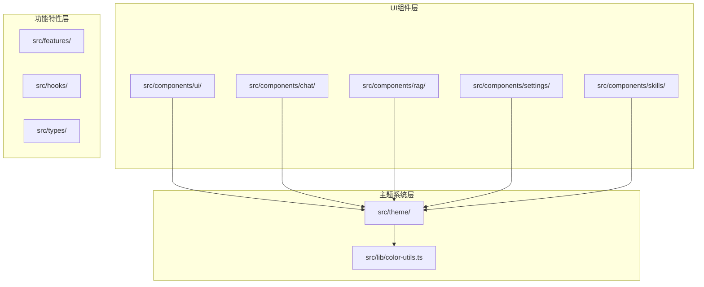

**图表来源**
- [src/components/ui/index.ts:1-25](file://src/components/ui/index.ts#L1-L25)
- [src/theme/colors.ts:1-42](file://src/theme/colors.ts#L1-L42)
- [src/theme/glass.ts:1-187](file://src/theme/glass.ts#L1-L187)

**章节来源**
- [src/components/ui/index.ts:1-25](file://src/components/ui/index.ts#L1-L25)
- [src/theme/colors.ts:1-42](file://src/theme/colors.ts#L1-L42)
- [src/theme/glass.ts:1-187](file://src/theme/glass.ts#L1-L187)

## 核心组件

### 主题系统

主题系统是整个UI组件库的基础，提供了统一的颜色管理、动画规范和布局标准。

#### 颜色系统

颜色系统采用双模式设计，支持浅色和深色主题的无缝切换：

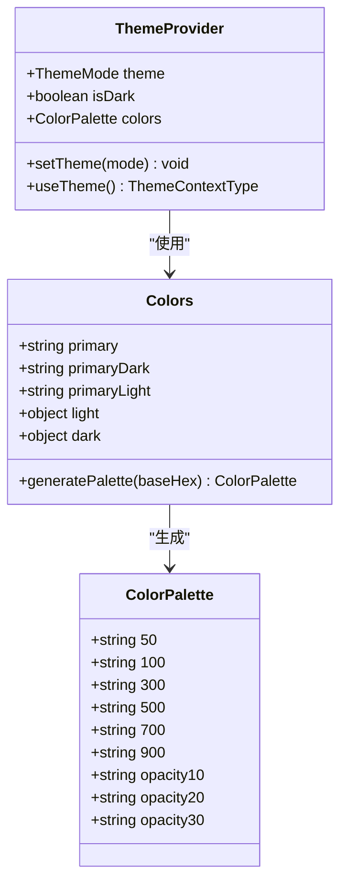

**图表来源**
- [src/theme/colors.ts:6-42](file://src/theme/colors.ts#L6-L42)
- [src/lib/color-utils.ts:40-90](file://src/lib/color-utils.ts#L40-L90)
- [src/theme/ThemeProvider.tsx:18-63](file://src/theme/ThemeProvider.tsx#L18-L63)

#### 毛玻璃效果系统

毛玻璃效果系统定义了三种不同的模糊强度级别，分别适用于不同的UI场景：

| 类型 | 强度 | 不透明度 | 使用场景 |
|------|------|----------|----------|
| Header | 50-70 | 0.15-0.25 | 顶栏、输入区域 | 
| Overlay | 30-50 | 0.75-0.80 | 浮动卡片、模态框、提示框 |
| Sheet | 25-40 | 0.96 | 底部弹窗、隐私遮罩 |

**章节来源**
- [src/theme/colors.ts:1-42](file://src/theme/colors.ts#L1-L42)
- [src/theme/glass.ts:12-68](file://src/theme/glass.ts#L12-L68)
- [src/theme/ThemeProvider.tsx:18-63](file://src/theme/ThemeProvider.tsx#L18-L63)

### 基础UI组件

#### 按钮组件

按钮组件支持多种变体和尺寸，提供丰富的交互反馈：

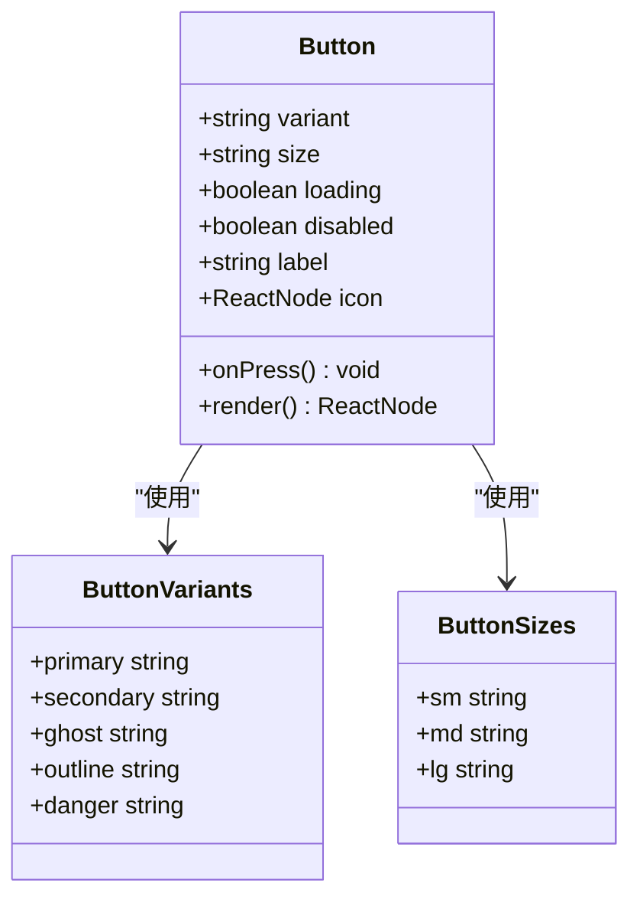

**图表来源**
- [src/components/ui/Button.tsx:13-25](file://src/components/ui/Button.tsx#L13-L25)
- [src/components/ui/Button.tsx:53-79](file://src/components/ui/Button.tsx#L53-L79)

#### 卡片组件

卡片组件提供三种不同的外观变体，支持点击反馈和毛玻璃效果：

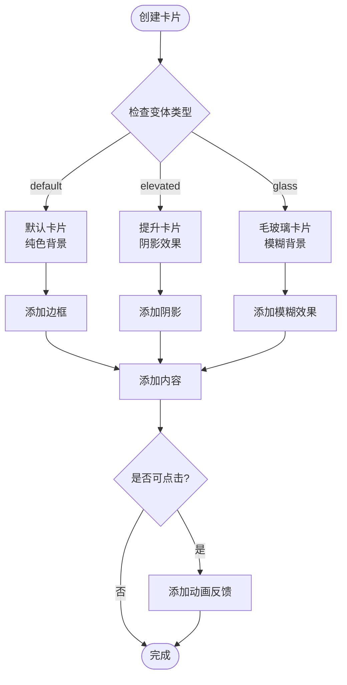

**图表来源**
- [src/components/ui/Card.tsx:28-45](file://src/components/ui/Card.tsx#L28-L45)
- [src/components/ui/Card.tsx:67-82](file://src/components/ui/Card.tsx#L67-L82)

**章节来源**
- [src/components/ui/Button.tsx:1-161](file://src/components/ui/Button.tsx#L1-L161)
- [src/components/ui/Card.tsx:1-105](file://src/components/ui/Card.tsx#L1-L105)

### 专用UI组件

#### 毛玻璃头部组件

GlassHeader组件专为有背景内容的页面设计，提供沉浸式的头部体验：

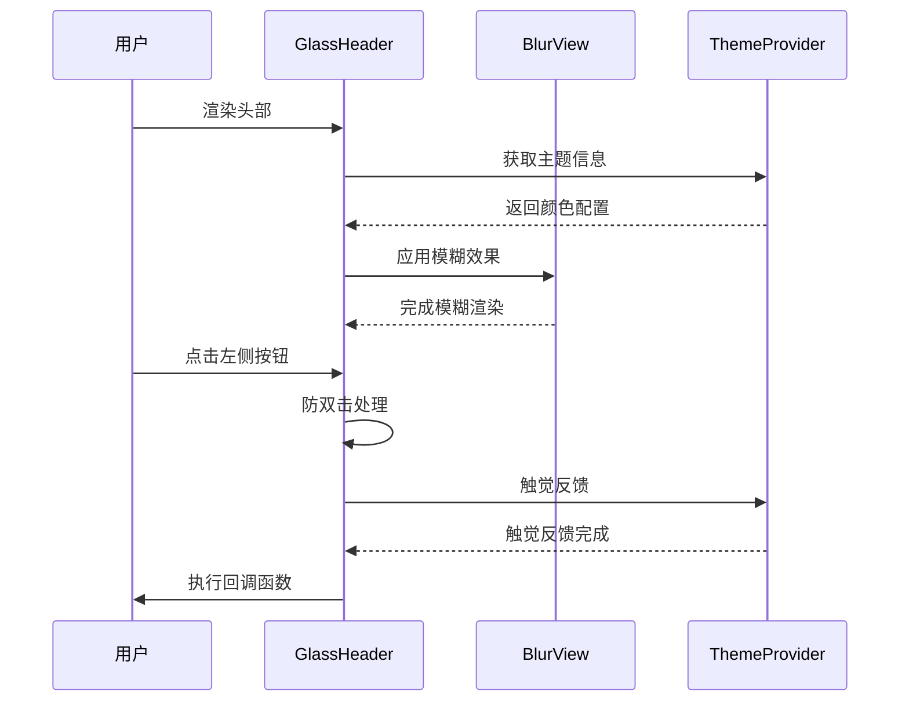

**图表来源**
- [src/components/ui/GlassHeader.tsx:66-90](file://src/components/ui/GlassHeader.tsx#L66-L90)
- [src/components/ui/GlassHeader.tsx:93-121](file://src/components/ui/GlassHeader.tsx#L93-L121)

#### 毛玻璃底部弹窗

GlassBottomSheet提供了一种优雅的底部弹窗解决方案：

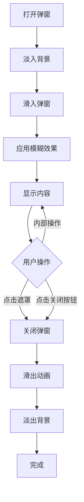

**图表来源**
- [src/components/ui/GlassBottomSheet.tsx:42-78](file://src/components/ui/GlassBottomSheet.tsx#L42-L78)
- [src/components/ui/GlassBottomSheet.tsx:79-144](file://src/components/ui/GlassBottomSheet.tsx#L79-L144)

**章节来源**
- [src/components/ui/GlassHeader.tsx:1-214](file://src/components/ui/GlassHeader.tsx#L1-L214)
- [src/components/ui/GlassBottomSheet.tsx:1-150](file://src/components/ui/GlassBottomSheet.tsx#L1-L150)

## 架构概览

UI组件库采用分层架构设计，确保了良好的可维护性和扩展性：

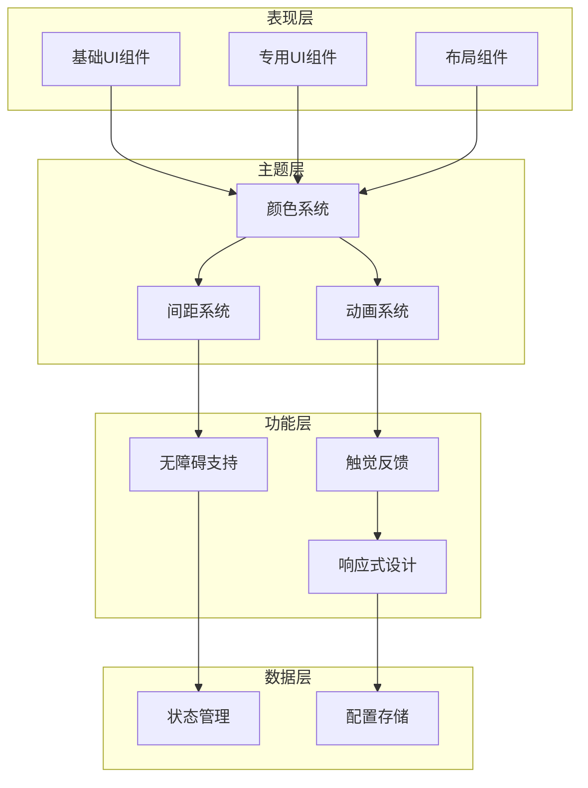

**图表来源**
- [src/theme/glass.ts:152-187](file://src/theme/glass.ts#L152-L187)
- [src/theme/animations.ts:12-76](file://src/theme/animations.ts#L12-L76)
- [src/theme/ThemeProvider.tsx:18-63](file://src/theme/ThemeProvider.tsx#L18-L63)

### 组件导出结构

组件库通过统一的导出入口管理所有组件的暴露接口：

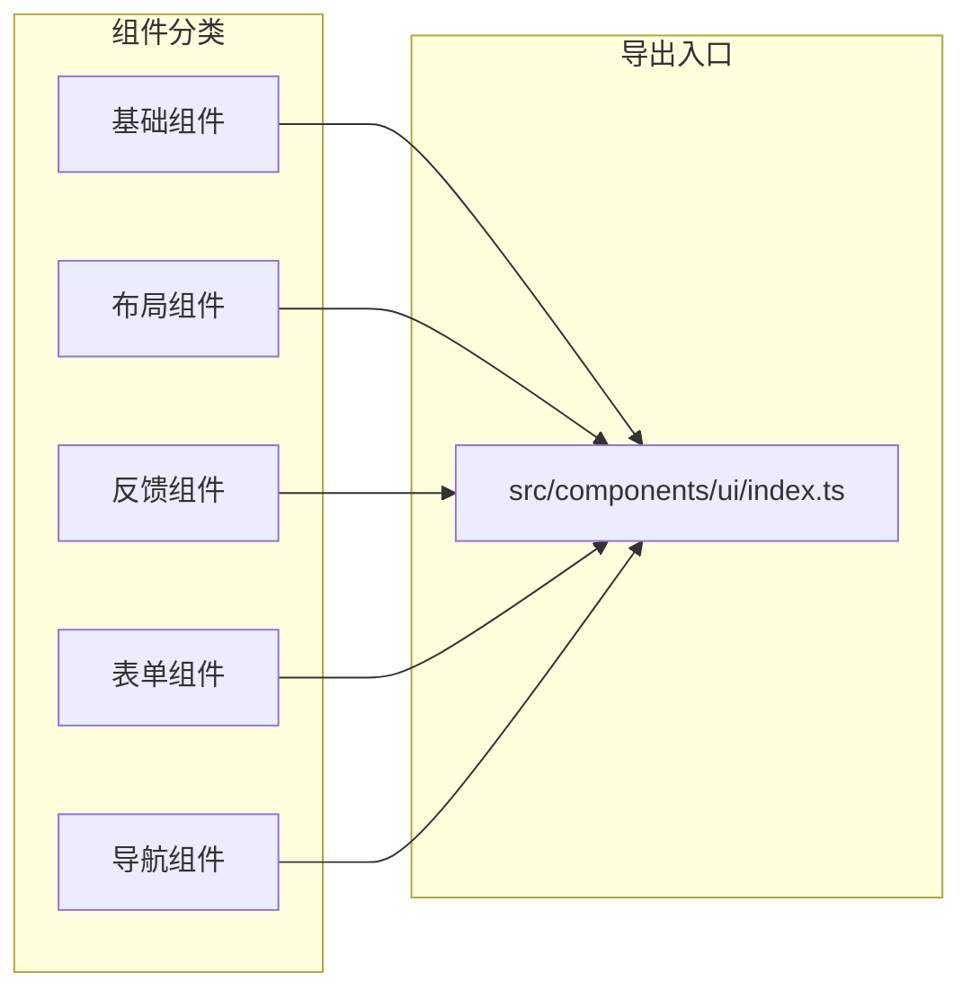

**图表来源**
- [src/components/ui/index.ts:1-25](file://src/components/ui/index.ts#L1-L25)

**章节来源**
- [src/components/ui/index.ts:1-25](file://src/components/ui/index.ts#L1-L25)
- [src/theme/glass.ts:1-187](file://src/theme/glass.ts#L1-L187)
- [src/theme/animations.ts:1-76](file://src/theme/animations.ts#L1-L76)

## 详细组件分析

### Typography文本组件

Typography组件提供了完整的文本样式系统，支持多种预定义的文本变体：

| 文本变体 | 字号 | 字重 | 用途 |
|----------|------|------|------|
| largeTitle | 32px | 粗体 | 页面主标题 |
| h1 | 24px | 粗体 | 一级标题 |
| h2 | 18px | 粗体 | 二级标题 |
| h3 | 16px | 粗体 | 三级标题 |
| body | 16px | 正常 | 正文内容 |
| label | 10px | 粗体 | 标签文字 |
| sectionHeader | 14px | 粗体 | 区块标题 |
| caption | 12px | 正常 | 辅助说明 |

**章节来源**
- [src/components/ui/Typography.tsx:11-49](file://src/components/ui/Typography.tsx#L11-L49)

### Switch开关组件

Switch组件实现了高度定制化的开关控件，具有流畅的动画效果：

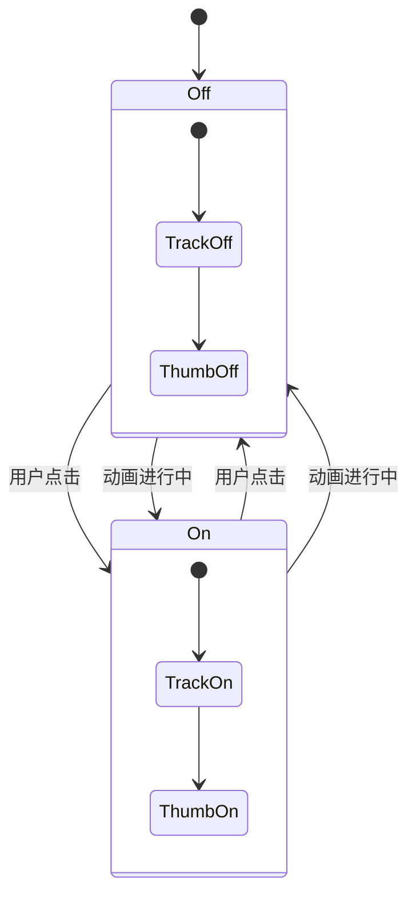

**图表来源**
- [src/components/ui/Switch.tsx:19-88](file://src/components/ui/Switch.tsx#L19-L88)

### Toast通知组件

Toast组件提供了四种类型的提示信息，每种类型都有相应的视觉和触觉反馈：

| 提示类型 | 图标 | 颜色 | 触觉反馈 |
|----------|------|------|----------|
| success | ✓ | 绿色 | 成功反馈 |
| error | ○ | 红色 | 错误反馈 |
| warning | △ | 橙色 | 警告反馈 |
| info | i | 灰色 | 轻触反馈 |

**章节来源**
- [src/components/ui/Switch.tsx:1-110](file://src/components/ui/Switch.tsx#L1-L110)
- [src/components/ui/Toast.tsx:1-110](file://src/components/ui/Toast.tsx#L1-L110)

### PageLayout页面布局组件

PageLayout组件提供了灵活的页面容器解决方案，支持安全区域适配：

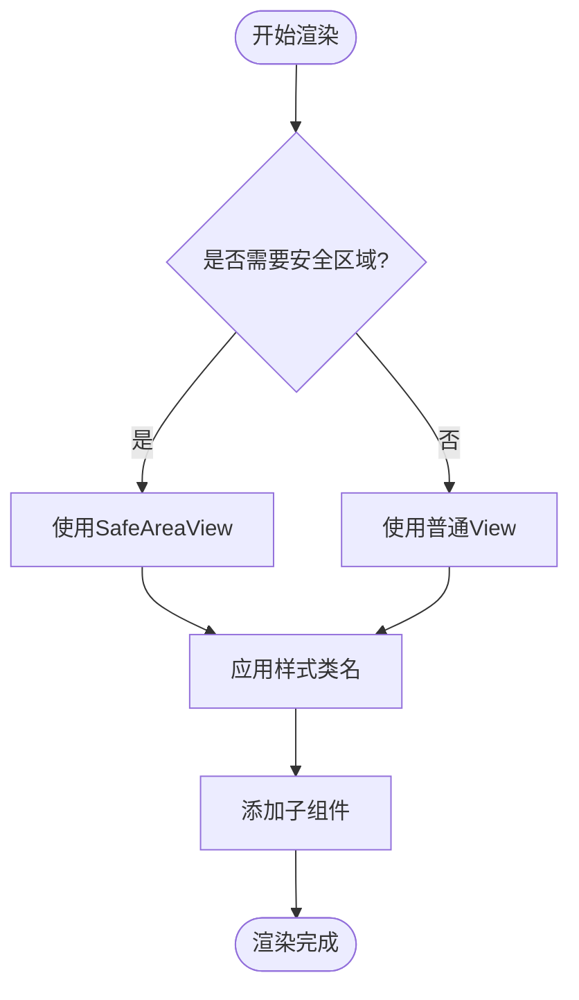

**图表来源**
- [src/components/ui/PageLayout.tsx:16-32](file://src/components/ui/PageLayout.tsx#L16-L32)

**章节来源**
- [src/components/ui/Toast.tsx:1-110](file://src/components/ui/Toast.tsx#L1-L110)
- [src/components/ui/PageLayout.tsx:1-33](file://src/components/ui/PageLayout.tsx#L1-L33)

## 依赖关系分析

UI组件库的依赖关系体现了清晰的分层架构：

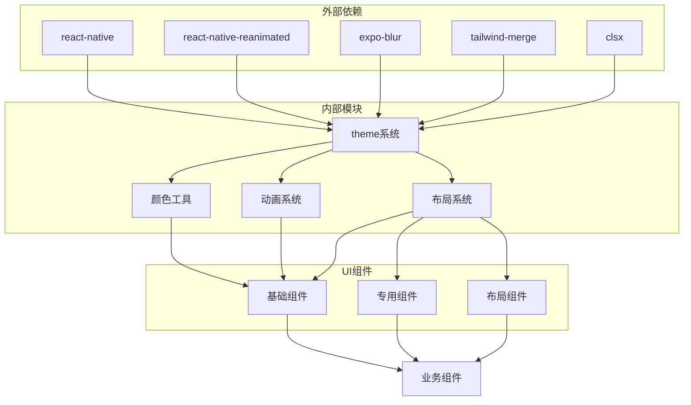

**图表来源**
- [src/theme/ThemeProvider.tsx:1-63](file://src/theme/ThemeProvider.tsx#L1-L63)
- [src/lib/color-utils.ts:1-90](file://src/lib/color-utils.ts#L1-L90)

### 关键依赖特性

| 依赖包 | 版本 | 用途 | 关键特性 |
|--------|------|------|----------|
| react-native | 最新 | 核心框架 | 原生组件支持 |
| react-native-reanimated | ^3.x | 动画系统 | 高性能动画 |
| expo-blur | 最新 | 毛玻璃效果 | 平台兼容性 |
| tailwind-merge | 最新 | 样式合并 | 冲突解决 |
| clsx | 最新 | 条件样式 | 类名组合 |

**章节来源**
- [src/theme/ThemeProvider.tsx:1-63](file://src/theme/ThemeProvider.tsx#L1-L63)
- [src/lib/color-utils.ts:1-90](file://src/lib/color-utils.ts#L1-L90)

## 性能考虑

UI组件库在设计时充分考虑了性能优化：

### 动画性能优化

- **Reanimated集成**：所有动画都使用Reanimated实现，确保主线程流畅运行
- **Spring动画**：采用物理引擎模拟，提供自然的动画效果
- **动画缓存**：避免重复创建动画配置对象

### 渲染性能优化

- **Memo化组件**：对频繁使用的组件启用React.memo优化
- **条件渲染**：根据状态动态决定渲染内容
- **懒加载**：大型组件按需加载

### 内存管理

- **资源清理**：及时清理定时器和事件监听器
- **状态优化**：避免不必要的状态更新
- **组件卸载**：确保组件卸载时释放所有资源

## 故障排除指南

### 常见问题及解决方案

#### 毛玻璃效果不生效

**问题描述**：在某些Android设备上毛玻璃效果显示异常

**解决方案**：
1. 检查Expo Blur版本兼容性
2. 确认设备支持硬件加速
3. 调整模糊强度参数

#### 动画卡顿

**问题描述**：组件动画出现卡顿现象

**解决方案**：
1. 检查动画配置参数
2. 减少同时运行的动画数量
3. 优化复杂动画的性能

#### 主题切换异常

**问题描述**：深色/浅色主题切换不生效

**解决方案**：
1. 确认Theme Context正确提供
2. 检查颜色值生成逻辑
3. 验证主题持久化存储

**章节来源**
- [src/theme/glass.ts:17-68](file://src/theme/glass.ts#L17-L68)
- [src/theme/animations.ts:12-76](file://src/theme/animations.ts#L12-L76)
- [src/theme/ThemeProvider.tsx:25-45](file://src/theme/ThemeProvider.tsx#L25-L45)

## 结论

Nexara UI组件库通过精心设计的主题系统、丰富的组件生态和完善的性能优化，为React Native应用提供了现代化的UI解决方案。组件库的主要优势包括：

1. **统一的设计语言**：通过主题系统确保视觉一致性
2. **优秀的用户体验**：流畅的动画和触觉反馈
3. **良好的可扩展性**：模块化的架构便于功能扩展
4. **完善的开发体验**：清晰的API设计和文档支持

未来可以考虑的功能增强方向：
- 添加更多组件变体和样式选项
- 集成更多的无障碍功能
- 优化移动端特定的交互体验
- 扩展到Web平台的支持