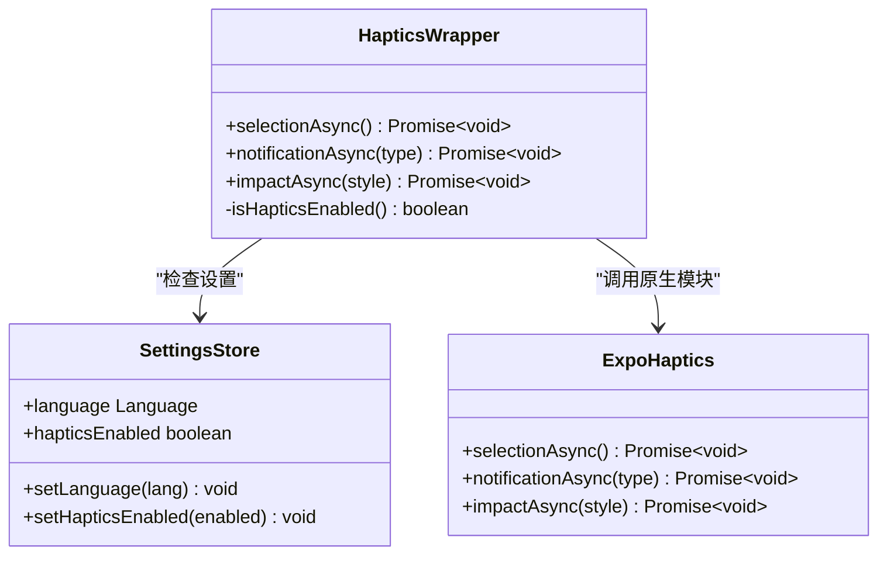
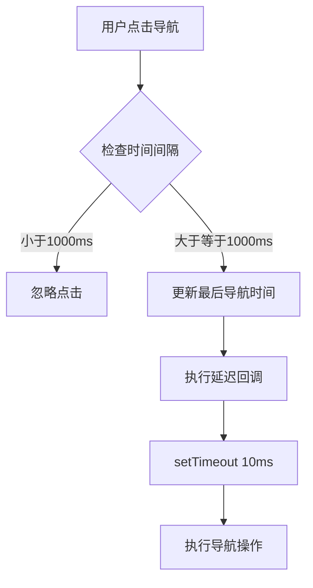
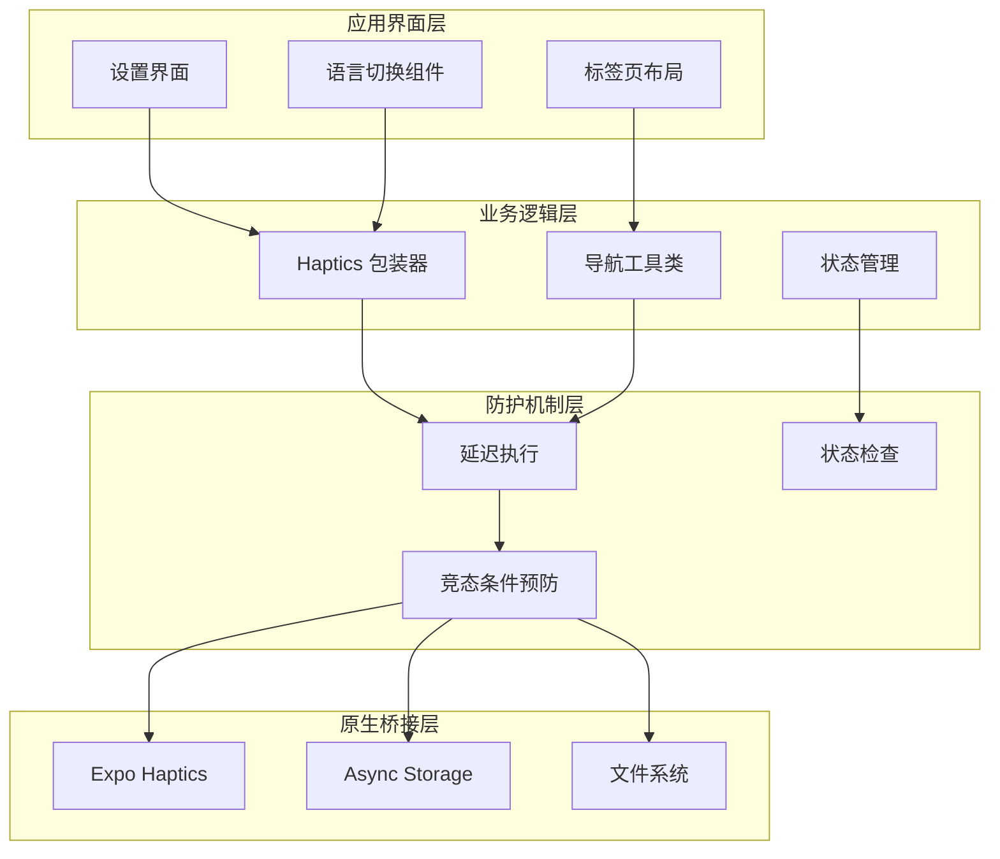
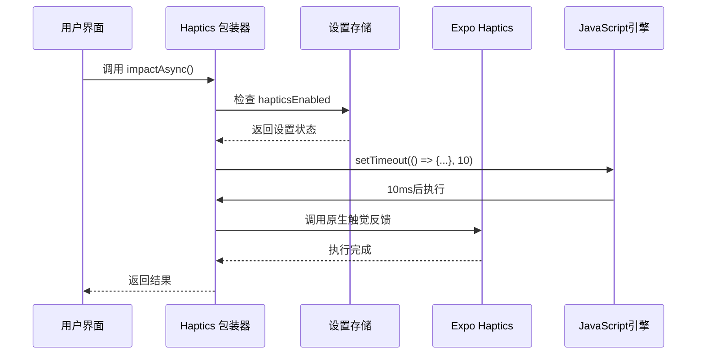
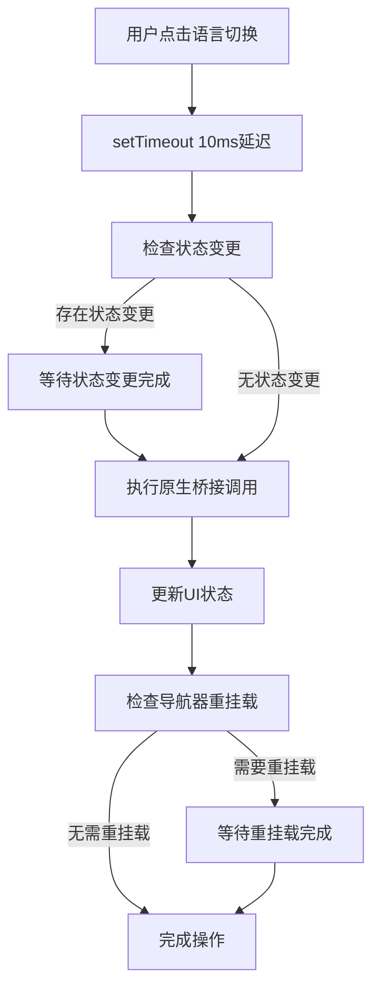
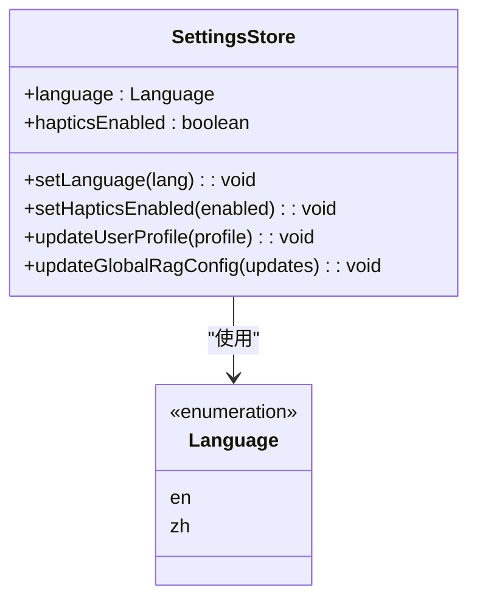
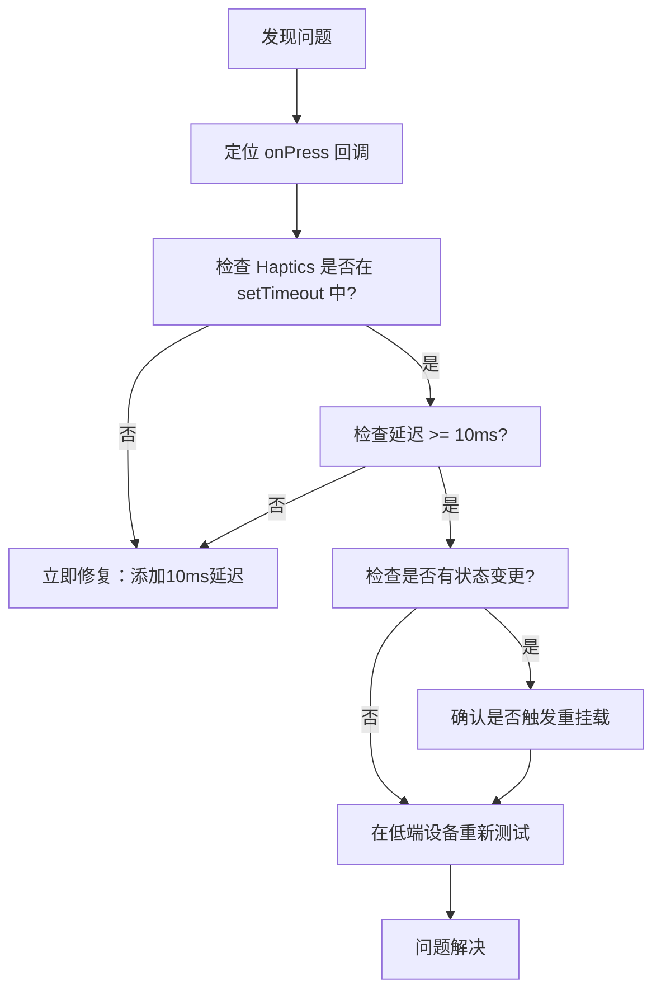

# 原生桥接防护

<cite>
**本文档引用的文件**
- [src/lib/haptics.ts](file://src/lib/haptics.ts)
- [.agent/docs/NATIVE_BRIDGE_DEFENSE.md](file://.agent/docs/NATIVE_BRIDGE_DEFENSE.md)
- [src/store/settings-store.ts](file://src/store/settings-store.ts)
- [src/lib/navigation-utils.ts](file://src/lib/navigation-utils.ts)
- [app/(tabs)/_layout.tsx](file://app/(tabs)/_layout.tsx)
- [app/(tabs)/settings.tsx](file://app/(tabs)/settings.tsx)
- [src/services/workbench/CommandWebSocketServer.ts](file://src/services/workbench/CommandWebSocketServer.ts)
- [src/lib/mcp/mcp-bridge.ts](file://src/lib/mcp/mcp-bridge.ts)
</cite>

## 目录
1. [简介](#简介)
2. [项目结构](#项目结构)
3. [核心组件](#核心组件)
4. [架构概览](#架构概览)
5. [详细组件分析](#详细组件分析)
6. [依赖关系分析](#依赖关系分析)
7. [性能考虑](#性能考虑)
8. [故障排除指南](#故障排除指南)
9. [结论](#结论)

## 简介

原生桥接防护是 Nexara 项目中一个关键的安全机制，旨在防止 JavaScript 和原生代码之间的死锁和竞态条件。该项目通过实施严格的延迟策略和状态管理机制，确保原生桥接调用不会与 UI 状态变更产生冲突。

该防护体系的核心理念是"所有原生桥接调用必须延迟10ms执行"，这一规则特别适用于 Haptics、SecureStore、FileSystem 等敏感的原生模块调用。

## 项目结构

项目采用模块化架构，将原生桥接防护功能分布在多个关键位置：

```mermaid
graph TB
subgraph "防护层"
A[src/lib/haptics.ts]
B[src/lib/navigation-utils.ts]
C[src/store/settings-store.ts]
end
subgraph "应用层"
D[app/(tabs)/_layout.tsx]
E[app/(tabs)/settings.tsx]
end
subgraph "服务层"
F[src/services/workbench/CommandWebSocketServer.ts]
G[src/lib/mcp/mcp-bridge.ts]
end
subgraph "文档层"
H[.agent/docs/NATIVE_BRIDGE_DEFENSE.md]
end
A --> D
B --> D
C --> A
D --> E
F --> G
H --> A
```

**图表来源**
- [src/lib/haptics.ts:1-52](file://src/lib/haptics.ts#L1-L52)
- [.agent/docs/NATIVE_BRIDGE_DEFENSE.md:1-126](file://.agent/docs/NATIVE_BRIDGE_DEFENSE.md#L1-L126)

**章节来源**
- [src/lib/haptics.ts:1-52](file://src/lib/haptics.ts#L1-L52)
- [.agent/docs/NATIVE_BRIDGE_DEFENSE.md:1-126](file://.agent/docs/NATIVE_BRIDGE_DEFENSE.md#L1-L126)

## 核心组件

### Haptics 包装器

Haptics 包装器是原生桥接防护的核心组件，它提供了统一的触觉反馈接口，并内置了延迟执行机制。



**图表来源**
- [src/lib/haptics.ts:13-47](file://src/lib/haptics.ts#L13-L47)
- [src/store/settings-store.ts:19-21](file://src/store/settings-store.ts#L19-L21)

### 导航工具类

导航工具类提供了防双击导航功能，确保导航操作不会过于频繁地触发原生桥接调用。



**图表来源**
- [src/lib/navigation-utils.ts:8-17](file://src/lib/navigation-utils.ts#L8-L17)

**章节来源**
- [src/lib/haptics.ts:1-52](file://src/lib/haptics.ts#L1-L52)
- [src/lib/navigation-utils.ts:1-17](file://src/lib/navigation-utils.ts#L1-L17)
- [src/store/settings-store.ts:19-21](file://src/store/settings-store.ts#L19-L21)

## 架构概览

原生桥接防护架构采用分层设计，确保每个层级都有明确的职责分工：



**图表来源**
- [app/(tabs)/settings.tsx:436-441](file://app/(tabs)/settings.tsx#L436-L441)
- [app/(tabs)/_layout.tsx:12-13](file://app/(tabs)/_layout.tsx#L12-L13)

## 详细组件分析

### Haptics 包装器实现

Haptics 包装器实现了完整的原生桥接防护机制：



**图表来源**
- [src/lib/haptics.ts:37-47](file://src/lib/haptics.ts#L37-L47)

### 语言切换防护机制

语言切换是原生桥接防护的关键场景之一，涉及状态管理和导航重挂载：



**图表来源**
- [.agent/docs/NATIVE_BRIDGE_DEFENSE.md:87-117](file://.agent/docs/NATIVE_BRIDGE_DEFENSE.md#L87-L117)

### 设置存储管理

设置存储提供了全局状态管理，确保原生桥接防护的一致性：



**图表来源**
- [src/store/settings-store.ts:75-93](file://src/store/settings-store.ts#L75-L93)

**章节来源**
- [src/lib/haptics.ts:13-47](file://src/lib/haptics.ts#L13-L47)
- [.agent/docs/NATIVE_BRIDGE_DEFENSE.md:87-117](file://.agent/docs/NATIVE_BRIDGE_DEFENSE.md#L87-L117)
- [src/store/settings-store.ts:75-93](file://src/store/settings-store.ts#L75-L93)

## 依赖关系分析

原生桥接防护系统的依赖关系呈现清晰的层次结构：

```mermaid
graph TD
subgraph "外部依赖"
A[expo-haptics]
B[@react-native-async-storage/async-storage]
C[expo-router]
end
subgraph "内部模块"
D[src/lib/haptics.ts]
E[src/lib/navigation-utils.ts]
F[src/store/settings-store.ts]
G[app/(tabs)/_layout.tsx]
H[app/(tabs)/settings.tsx]
end
subgraph "防护机制"
I[延迟执行]
J[状态检查]
K[竞态条件预防]
end
D --> A
F --> B
G --> C
H --> C
D --> I
E --> I
F --> J
G --> K
H --> K
```

**图表来源**
- [src/lib/haptics.ts:1](file://src/lib/haptics.ts#L1)
- [src/store/settings-store.ts:3](file://src/store/settings-store.ts#L3)
- [app/(tabs)/_layout.tsx:1](file://app/(tabs)/_layout.tsx#L1)

**章节来源**
- [src/lib/haptics.ts:1-52](file://src/lib/haptics.ts#L1-L52)
- [src/store/settings-store.ts:1-244](file://src/store/settings-store.ts#L1-L244)
- [app/(tabs)/_layout.tsx:1-60](file://app/(tabs)/_layout.tsx#L1-L60)

## 性能考虑

原生桥接防护系统在设计时充分考虑了性能影响：

### 延迟执行的影响
- **10ms 延迟**：提供足够的时间让 UI 状态稳定
- **异步执行**：避免阻塞主线程
- **错误处理**：捕获并记录原生调用失败

### 内存管理
- **状态持久化**：使用 AsyncStorage 确保设置持久保存
- **轻量级存储**：只存储必要的配置信息
- **自动修复**：损坏数据的自动恢复机制

### 并发控制
- **防双击机制**：1000ms 冷却期防止过度触发
- **竞态条件预防**：通过延迟确保操作顺序
- **资源清理**：及时释放连接和资源

## 故障排除指南

### 常见问题诊断

| 问题现象 | 技术原因 | 解决方案 |
|---------|---------|---------|
| "震动比其他地方强" | 线程阻塞 + 系统补偿 | 检查 Haptics 是否延迟 30ms+ |
| "点击后延迟才震动" | JS线程繁忙 | 检查是否有同步状态变更 |
| "切换页面白屏/黑屏" | 导航重挂载冲突 | 检查导航附近的原生调用 |
| "触感不一致" | 死锁前兆 | 对比其他交互的实现 |

### 调试流程



**图表来源**
- [.agent/docs/NATIVE_BRIDGE_DEFENSE.md:53-68](file://.agent/docs/NATIVE_BRIDGE_DEFENSE.md#L53-L68)

### 代码审查要点

1. **搜索 Haptics 调用**：使用正则表达式查找所有原生桥接调用
2. **检查状态变更**：验证状态更新是否与原生调用在同一事件循环中
3. **验证延迟机制**：确保所有原生调用都经过适当的延迟包装

**章节来源**
- [.agent/docs/NATIVE_BRIDGE_DEFENSE.md:42-68](file://.agent/docs/NATIVE_BRIDGE_DEFENSE.md#L42-L68)

## 结论

原生桥接防护系统通过多层次的设计和严格的执行策略，有效防止了 JavaScript 和原生代码之间的死锁和竞态条件。该系统的核心优势包括：

1. **统一的防护机制**：所有原生桥接调用都遵循相同的延迟规则
2. **智能的状态管理**：通过设置存储确保防护机制的一致性
3. **完善的错误处理**：提供详细的错误日志和自动恢复机制
4. **性能优化**：最小化延迟对用户体验的影响

该防护体系为移动应用开发提供了可靠的安全保障，特别是在处理触觉反馈、文件系统访问等敏感操作时，能够有效避免系统级的稳定性问题。