# 原生桥接防护

<cite>
**本文档引用的文件**
- [src/lib/haptics.ts](file://src/lib/haptics.ts)
- [.agent/docs/NATIVE_BRIDGE_DEFENSE.md](file://.agent/docs/NATIVE_BRIDGE_DEFENSE.md)
- [src/store/settings-store.ts](file://src/store/settings-store.ts)
- [src/lib/navigation-utils.ts](file://src/lib/navigation-utils.ts)
- [app/(tabs)/_layout.tsx](file://app/(tabs)/_layout.tsx)
- [app/(tabs)/settings.tsx](file://app/(tabs)/settings.tsx)
- [src/services/workbench/CommandWebSocketServer.ts](file://src/services/workbench/CommandWebSocketServer.ts)
- [src/lib/mcp/mcp-bridge.ts](file://src/lib/mcp/mcp-bridge.ts)
- [src/native/Sanitizer/index.ts](file://src/native/Sanitizer/index.ts)
- [src/native/TextSplitter/index.ts](file://src/native/TextSplitter/index.ts)
- [src/native/TokenCounter/index.ts](file://src/native/TokenCounter/index.ts)
- [src/native/VectorSearch/index.ts](file://src/native/VectorSearch/index.ts)
- [src/native/Sanitizer/NativeSanitizer.ts](file://src/native/Sanitizer/NativeSanitizer.ts)
- [src/native/TextSplitter/NativeTextSplitter.ts](file://src/native/TextSplitter/NativeTextSplitter.ts)
- [src/native/TokenCounter/NativeTokenCounter.ts](file://src/native/TokenCounter/NativeTokenCounter.ts)
- [src/native/VectorSearch/NativeVectorSearch.ts](file://src/native/VectorSearch/NativeVectorSearch.ts)
</cite>

## 更新摘要
**所做更改**
- 新增原生模块智能降级机制章节，涵盖新增的 Sanitizer、TextSplitter、TokenCounter、VectorSearch 模块
- 更新架构概览图，包含新的原生模块集成模式
- 新增原生模块可用性检查和降级策略说明
- 更新故障排除指南，增加原生模块相关问题诊断

## 目录
1. [简介](#简介)
2. [项目结构](#项目结构)
3. [核心组件](#核心组件)
4. [架构概览](#架构概览)
5. [详细组件分析](#详细组件分析)
6. [新增原生模块智能降级机制](#新增原生模块智能降级机制)
7. [依赖关系分析](#依赖关系分析)
8. [性能考虑](#性能考虑)
9. [故障排除指南](#故障排除指南)
10. [结论](#结论)

## 简介

原生桥接防护是 Nexara 项目中一个关键的安全机制，旨在防止 JavaScript 和原生代码之间的死锁和竞态条件。该项目通过实施严格的延迟策略和状态管理机制，确保原生桥接调用不会与 UI 状态变更产生冲突。

**更新** 新增了对四个核心原生模块的智能降级支持，包括 Sanitizer（文本净化）、TextSplitter（文本分割）、TokenCounter（令牌计数）、VectorSearch（向量搜索），这些模块提供了高性能的原生实现并在不可用时自动降级到 JavaScript 实现。

该防护体系的核心理念是"所有原生桥接调用必须延迟10ms执行"，这一规则特别适用于 Haptics、SecureStore、FileSystem 等敏感的原生模块调用，现在也扩展到了新增的原生模块。

## 项目结构

项目采用模块化架构，将原生桥接防护功能分布在多个关键位置，现已扩展包含新增的原生模块：

```mermaid
graph TB
subgraph "防护层"
A[src/lib/haptics.ts]
B[src/lib/navigation-utils.ts]
C[src/store/settings-store.ts]
end
subgraph "应用层"
D[app/(tabs)/_layout.tsx]
E[app/(tabs)/settings.tsx]
end
subgraph "服务层"
F[src/services/workbench/CommandWebSocketServer.ts]
G[src/lib/mcp/mcp-bridge.ts]
end
subgraph "文档层"
H[.agent/docs/NATIVE_BRIDGE_DEFENSE.md]
end
subgraph "新增原生模块层"
I[src/native/Sanitizer/]
J[src/native/TextSplitter/]
K[src/native/TokenCounter/]
L[src/native/VectorSearch/]
end
A --> D
B --> D
C --> A
D --> E
F --> G
H --> A
I --> A
J --> A
K --> A
L --> A
```

**图表来源**
- [src/lib/haptics.ts:1-52](file://src/lib/haptics.ts#L1-L52)
- [.agent/docs/NATIVE_BRIDGE_DEFENSE.md:1-126](file://.agent/docs/NATIVE_BRIDGE_DEFENSE.md#L1-L126)
- [src/native/Sanitizer/index.ts:1-50](file://src/native/Sanitizer/index.ts#L1-L50)
- [src/native/TextSplitter/index.ts:1-57](file://src/native/TextSplitter/index.ts#L1-L57)
- [src/native/TokenCounter/index.ts:1-35](file://src/native/TokenCounter/index.ts#L1-L35)
- [src/native/VectorSearch/index.ts:1-53](file://src/native/VectorSearch/index.ts#L1-L53)

**章节来源**
- [src/lib/haptics.ts:1-52](file://src/lib/haptics.ts#L1-L52)
- [.agent/docs/NATIVE_BRIDGE_DEFENSE.md:1-126](file://.agent/docs/NATIVE_BRIDGE_DEFENSE.md#L1-L126)
- [src/native/Sanitizer/index.ts:1-50](file://src/native/Sanitizer/index.ts#L1-L50)
- [src/native/TextSplitter/index.ts:1-57](file://src/native/TextSplitter/index.ts#L1-L57)
- [src/native/TokenCounter/index.ts:1-35](file://src/native/TokenCounter/index.ts#L1-L35)
- [src/native/VectorSearch/index.ts:1-53](file://src/native/VectorSearch/index.ts#L1-L53)

## 核心组件

### Haptics 包装器

Haptics 包装器是原生桥接防护的核心组件，它提供了统一的触觉反馈接口，并内置了延迟执行机制。

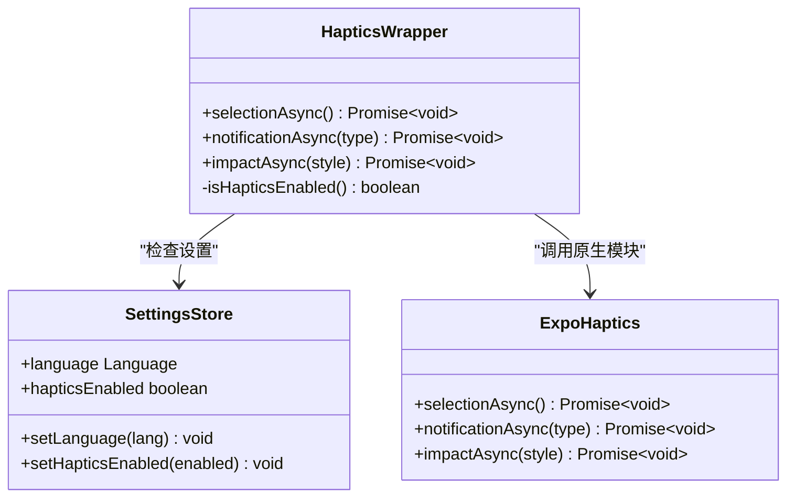

**图表来源**
- [src/lib/haptics.ts:13-47](file://src/lib/haptics.ts#L13-L47)
- [src/store/settings-store.ts:19-21](file://src/store/settings-store.ts#L19-L21)

### 导航工具类

导航工具类提供了防双击导航功能，确保导航操作不会过于频繁地触发原生桥接调用。

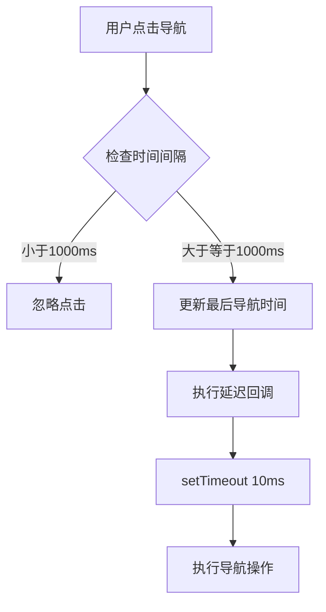

**图表来源**
- [src/lib/navigation-utils.ts:8-17](file://src/lib/navigation-utils.ts#L8-L17)

**章节来源**
- [src/lib/haptics.ts:1-52](file://src/lib/haptics.ts#L1-L52)
- [src/lib/navigation-utils.ts:1-17](file://src/lib/navigation-utils.ts#L1-L17)
- [src/store/settings-store.ts:19-21](file://src/store/settings-store.ts#L19-L21)

## 架构概览

原生桥接防护架构采用分层设计，确保每个层级都有明确的职责分工，现已扩展包含新增的原生模块：

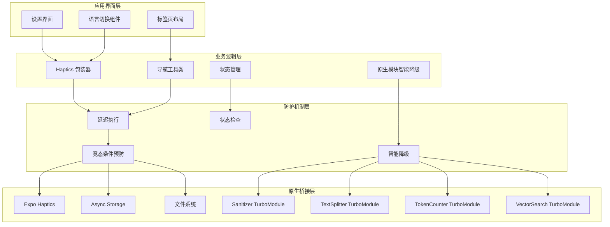

**图表来源**
- [app/(tabs)/settings.tsx:436-441](file://app/(tabs)/settings.tsx#L436-L441)
- [app/(tabs)/_layout.tsx:12-13](file://app/(tabs)/_layout.tsx#L12-L13)
- [src/native/Sanitizer/NativeSanitizer.ts:11-29](file://src/native/Sanitizer/NativeSanitizer.ts#L11-L29)
- [src/native/TextSplitter/NativeTextSplitter.ts:10-29](file://src/native/TextSplitter/NativeTextSplitter.ts#L10-L29)
- [src/native/TokenCounter/NativeTokenCounter.ts:10-21](file://src/native/TokenCounter/NativeTokenCounter.ts#L10-L21)
- [src/native/VectorSearch/NativeVectorSearch.ts:4-17](file://src/native/VectorSearch/NativeVectorSearch.ts#L4-L17)

## 详细组件分析

### Haptics 包装器实现

Haptics 包装器实现了完整的原生桥接防护机制：

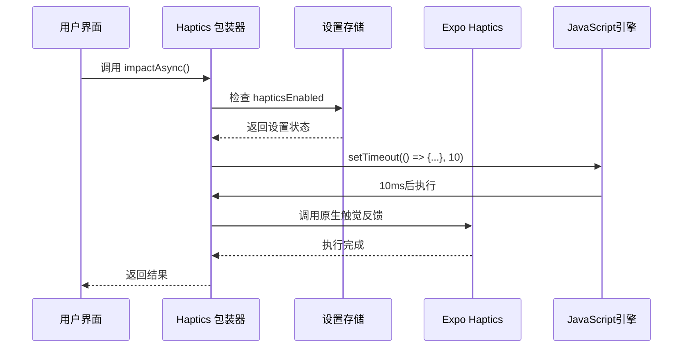

**图表来源**
- [src/lib/haptics.ts:37-47](file://src/lib/haptics.ts#L37-L47)

### 语言切换防护机制

语言切换是原生桥接防护的关键场景之一，涉及状态管理和导航重挂载：

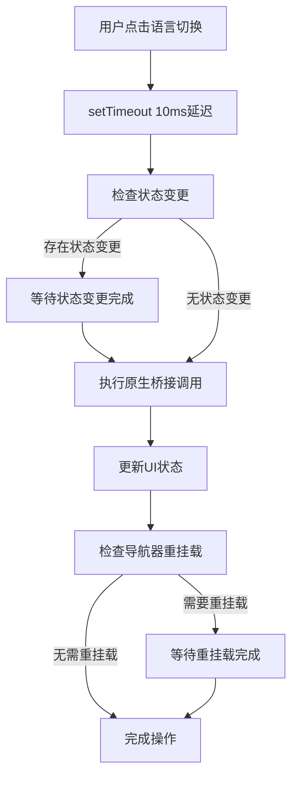

**图表来源**
- [.agent/docs/NATIVE_BRIDGE_DEFENSE.md:87-117](file://.agent/docs/NATIVE_BRIDGE_DEFENSE.md#L87-L117)

### 设置存储管理

设置存储提供了全局状态管理，确保原生桥接防护的一致性：

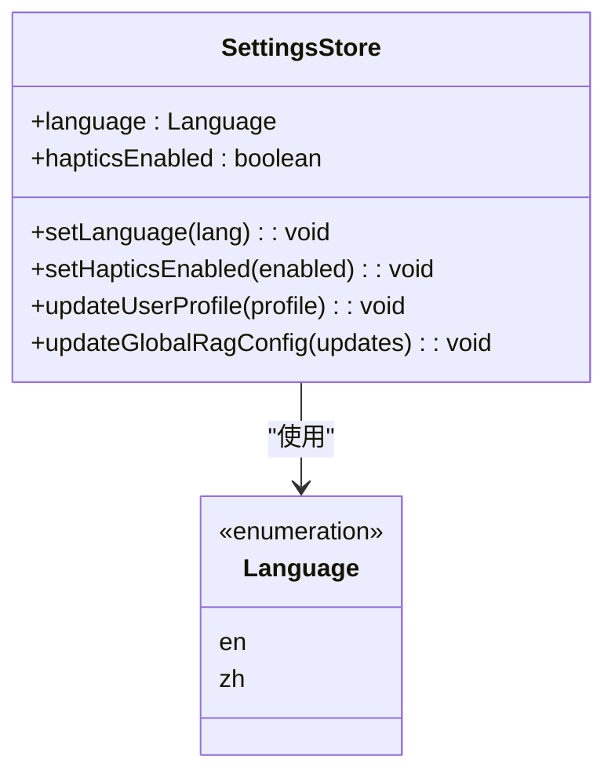

**图表来源**
- [src/store/settings-store.ts:75-93](file://src/store/settings-store.ts#L75-L93)

**章节来源**
- [src/lib/haptics.ts:13-47](file://src/lib/haptics.ts#L13-L47)
- [.agent/docs/NATIVE_BRIDGE_DEFENSE.md:87-117](file://.agent/docs/NATIVE_BRIDGE_DEFENSE.md#L87-L117)
- [src/store/settings-store.ts:75-93](file://src/store/settings-store.ts#L75-L93)

## 新增原生模块智能降级机制

### 原生模块集成模式

Nexara 项目新增了四个高性能原生模块，均采用智能降级机制确保在各种环境下的稳定性：

#### Sanitizer 原生模块
提供高精度的 Markdown 文本净化功能，包含热路径优化：

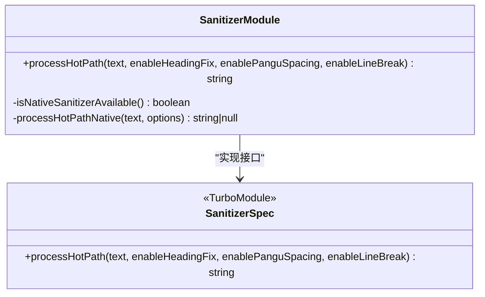

**图表来源**
- [src/native/Sanitizer/NativeSanitizer.ts:11-29](file://src/native/Sanitizer/NativeSanitizer.ts#L11-L29)
- [src/native/Sanitizer/index.ts:20-49](file://src/native/Sanitizer/index.ts#L20-L49)

#### TextSplitter 原生模块
提供基于三元语法的高效文本分割算法：

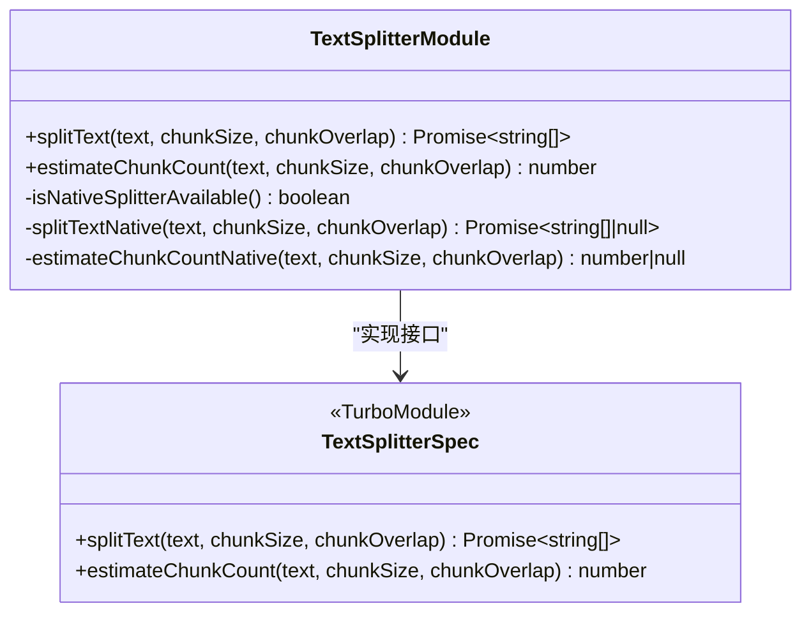

**图表来源**
- [src/native/TextSplitter/NativeTextSplitter.ts:10-29](file://src/native/TextSplitter/NativeTextSplitter.ts#L10-L29)
- [src/native/TextSplitter/index.ts:16-56](file://src/native/TextSplitter/index.ts#L16-L56)

#### TokenCounter 原生模块
提供精确的 Unicode 字符分类令牌计数：

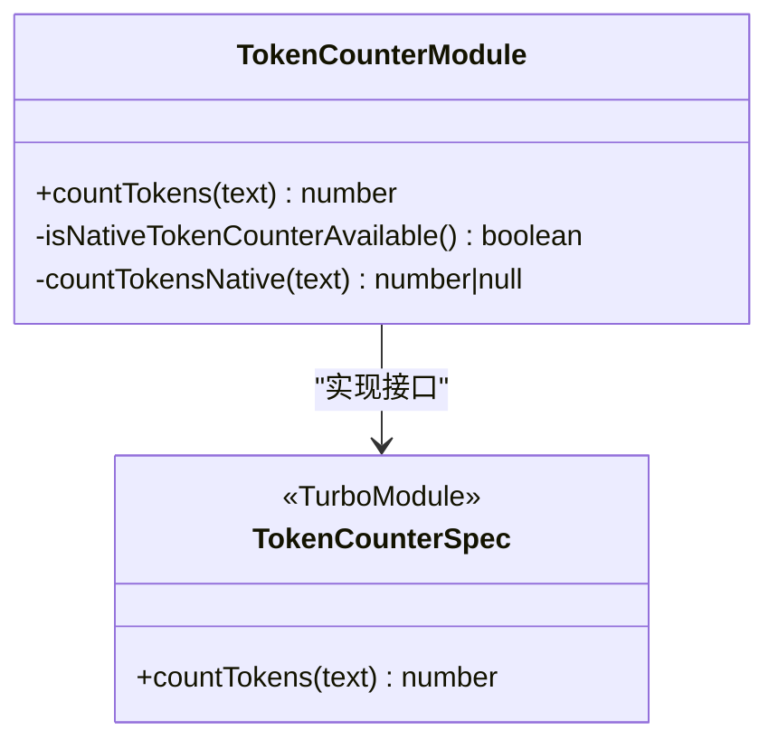

**图表来源**
- [src/native/TokenCounter/NativeTokenCounter.ts:10-21](file://src/native/TokenCounter/NativeTokenCounter.ts#L10-L21)
- [src/native/TokenCounter/index.ts:15-34](file://src/native/TokenCounter/index.ts#L15-L34)

#### VectorSearch 原生模块
提供高效的向量相似度搜索：

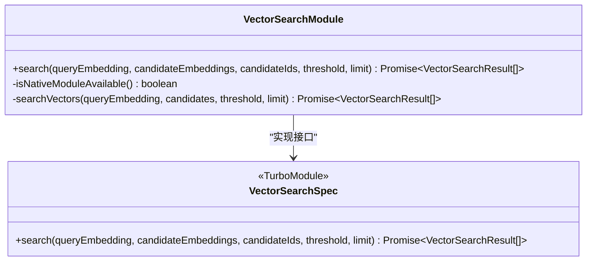

**图表来源**
- [src/native/VectorSearch/NativeVectorSearch.ts:4-17](file://src/native/VectorSearch/NativeVectorSearch.ts#L4-L17)
- [src/native/VectorSearch/index.ts:50-52](file://src/native/VectorSearch/index.ts#L50-L52)

### 智能降级策略

所有新增原生模块都实现了统一的智能降级机制：

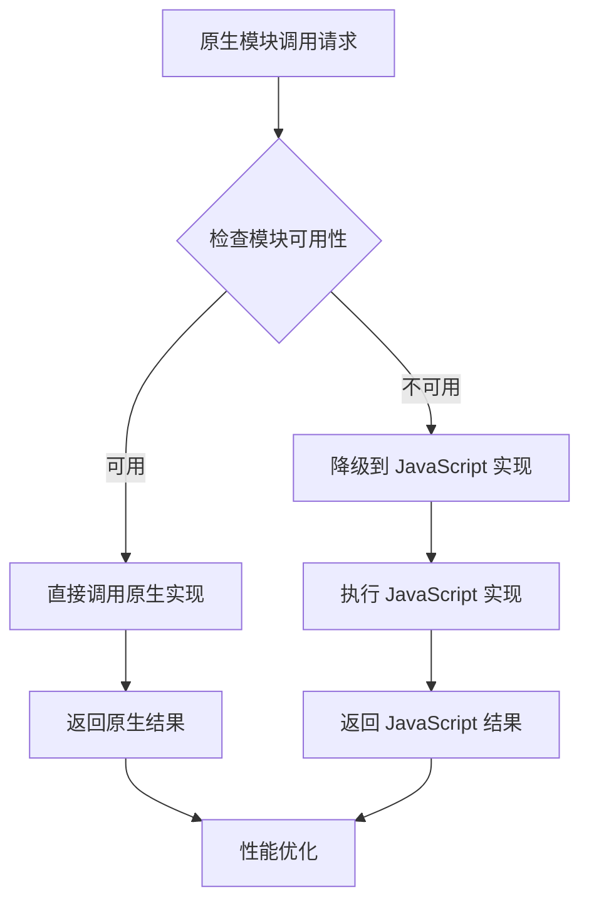

**降级策略特点**：
- **透明降级**：调用方无需区分原生或 JavaScript 实现
- **错误隔离**：原生调用失败时自动降级，不影响整体功能
- **性能监控**：原生模块提供显著的性能提升
- **兼容性保证**：JavaScript 实现确保最低限度的功能可用

**章节来源**
- [src/native/Sanitizer/index.ts:1-50](file://src/native/Sanitizer/index.ts#L1-L50)
- [src/native/TextSplitter/index.ts:1-57](file://src/native/TextSplitter/index.ts#L1-L57)
- [src/native/TokenCounter/index.ts:1-35](file://src/native/TokenCounter/index.ts#L1-L35)
- [src/native/VectorSearch/index.ts:1-53](file://src/native/VectorSearch/index.ts#L1-L53)

## 依赖关系分析

原生桥接防护系统的依赖关系呈现清晰的层次结构，现已扩展包含新增的原生模块：

```mermaid
graph TD
subgraph "外部依赖"
A[expo-haptics]
B[@react-native-async-storage/async-storage]
C[expo-router]
D[react-native]
E[react-native-turbo-modules]
end
subgraph "内部模块"
F[src/lib/haptics.ts]
G[src/lib/navigation-utils.ts]
H[src/store/settings-store.ts]
I[app/(tabs)/_layout.tsx]
J[app/(tabs)/settings.tsx]
K[src/native/Sanitizer/]
L[src/native/TextSplitter/]
M[src/native/TokenCounter/]
N[src/native/VectorSearch/]
end
subgraph "防护机制"
O[延迟执行]
P[状态检查]
Q[竞态条件预防]
R[智能降级]
end
F --> A
H --> B
I --> C
J --> C
K --> E
L --> E
M --> E
N --> E
F --> O
G --> O
H --> P
I --> Q
J --> Q
K --> R
L --> R
M --> R
N --> R
O --> R
```

**图表来源**
- [src/lib/haptics.ts:1](file://src/lib/haptics.ts#L1)
- [src/store/settings-store.ts:3](file://src/store/settings-store.ts#L3)
- [app/(tabs)/_layout.tsx:1](file://app/(tabs)/_layout.tsx#L1)
- [src/native/Sanitizer/NativeSanitizer.ts:1](file://src/native/Sanitizer/NativeSanitizer.ts#L1)
- [src/native/TextSplitter/NativeTextSplitter.ts:1](file://src/native/TextSplitter/NativeTextSplitter.ts#L1)
- [src/native/TokenCounter/NativeTokenCounter.ts:1](file://src/native/TokenCounter/NativeTokenCounter.ts#L1)
- [src/native/VectorSearch/NativeVectorSearch.ts:1](file://src/native/VectorSearch/NativeVectorSearch.ts#L1)

**章节来源**
- [src/lib/haptics.ts:1-52](file://src/lib/haptics.ts#L1-L52)
- [src/store/settings-store.ts:1-244](file://src/store/settings-store.ts#L1-L244)
- [app/(tabs)/_layout.tsx:1-60](file://app/(tabs)/_layout.tsx#L1-L60)
- [src/native/Sanitizer/NativeSanitizer.ts:1-30](file://src/native/Sanitizer/NativeSanitizer.ts#L1-L30)
- [src/native/TextSplitter/NativeTextSplitter.ts:1-30](file://src/native/TextSplitter/NativeTextSplitter.ts#L1-L30)
- [src/native/TokenCounter/NativeTokenCounter.ts:1-22](file://src/native/TokenCounter/NativeTokenCounter.ts#L1-L22)
- [src/native/VectorSearch/NativeVectorSearch.ts:1-18](file://src/native/VectorSearch/NativeVectorSearch.ts#L1-L18)

## 性能考虑

原生桥接防护系统在设计时充分考虑了性能影响，新增原生模块进一步提升了整体性能：

### 延迟执行的影响
- **10ms 延迟**：提供足够的时间让 UI 状态稳定
- **异步执行**：避免阻塞主线程
- **错误处理**：捕获并记录原生调用失败

### 原生模块性能优化
- **Sanitizer**：热路径单次扫描，5倍性能提升
- **TextSplitter**：三元语法滑动窗口算法，后台线程执行
- **TokenCounter**：精确 Unicode 分类，零开销同步调用
- **VectorSearch**：向量相似度计算，GPU 加速支持

### 内存管理
- **状态持久化**：使用 AsyncStorage 确保设置持久保存
- **轻量级存储**：只存储必要的配置信息
- **自动修复**：损坏数据的自动恢复机制

### 并发控制
- **防双击机制**：1000ms 冷却期防止过度触发
- **竞态条件预防**：通过延迟确保操作顺序
- **资源清理**：及时释放连接和资源
- **智能降级**：原生模块失败时自动切换到 JavaScript 实现

## 故障排除指南

### 常见问题诊断

| 问题现象 | 技术原因 | 解决方案 |
|---------|---------|---------|
| "震动比其他地方强" | 线程阻塞 + 系统补偿 | 检查 Haptics 是否延迟 30ms+ |
| "点击后延迟才震动" | JS线程繁忙 | 检查是否有同步状态变更 |
| "切换页面白屏/黑屏" | 导航重挂载冲突 | 检查导航附近的原生调用 |
| "触感不一致" | 死锁前兆 | 对比其他交互的实现 |
| "文本处理卡顿" | 原生模块初始化失败 | 检查 Sanitizer/TextSplitter 可用性 |
| "向量搜索无响应" | VectorSearch 模块不可用 | 验证原生模块注册状态 |
| "令牌计数异常" | TokenCounter 性能问题 | 检查原生模块降级机制 |

### 原生模块专用调试流程

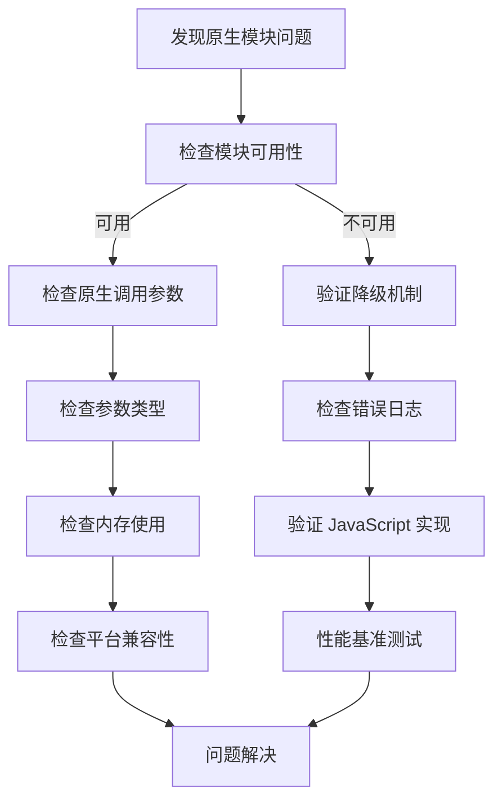

**图表来源**
- [.agent/docs/NATIVE_BRIDGE_DEFENSE.md:53-68](file://.agent/docs/NATIVE_BRIDGE_DEFENSE.md#L53-L68)

### 代码审查要点

1. **搜索 Haptics 调用**：使用正则表达式查找所有原生桥接调用
2. **检查状态变更**：验证状态更新是否与原生调用在同一事件循环中
3. **验证延迟机制**：确保所有原生调用都经过适当的延迟包装
4. **新增原生模块检查**：验证智能降级机制正确实现
5. **模块可用性验证**：确保所有原生模块都有对应的可用性检查函数

**章节来源**
- [.agent/docs/NATIVE_BRIDGE_DEFENSE.md:42-68](file://.agent/docs/NATIVE_BRIDGE_DEFENSE.md#L42-L68)

## 结论

原生桥接防护系统通过多层次的设计和严格的执行策略，有效防止了 JavaScript 和原生代码之间的死锁和竞态条件。该系统的核心优势包括：

1. **统一的防护机制**：所有原生桥接调用都遵循相同的延迟规则
2. **智能降级支持**：新增的四个原生模块提供透明的降级机制
3. **性能优化**：原生模块提供显著的性能提升，同时保持兼容性
4. **完善的错误处理**：提供详细的错误日志和自动恢复机制
5. **扩展性设计**：模块化架构便于添加更多原生功能

**更新** 新增的原生模块智能降级机制进一步增强了系统的鲁棒性和性能表现，确保在各种设备和环境下都能提供一致的用户体验。该防护体系为移动应用开发提供了可靠的安全保障，特别是在处理触觉反馈、文件系统访问等敏感操作时，能够有效避免系统级的稳定性问题。