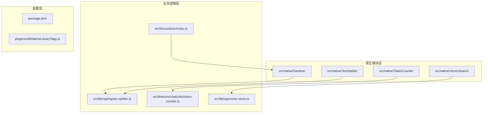
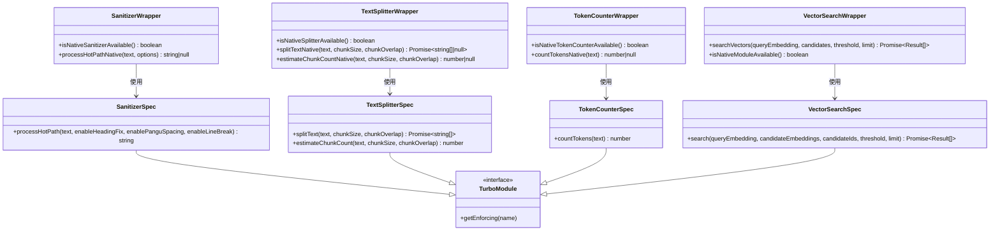
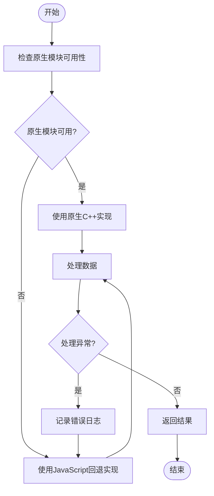
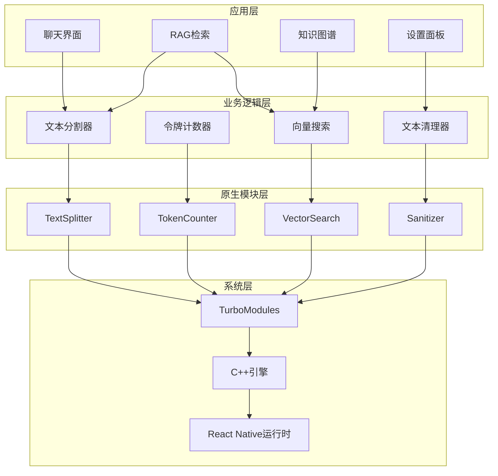
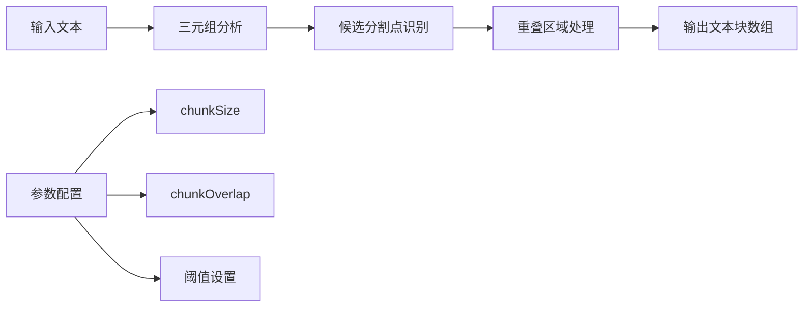
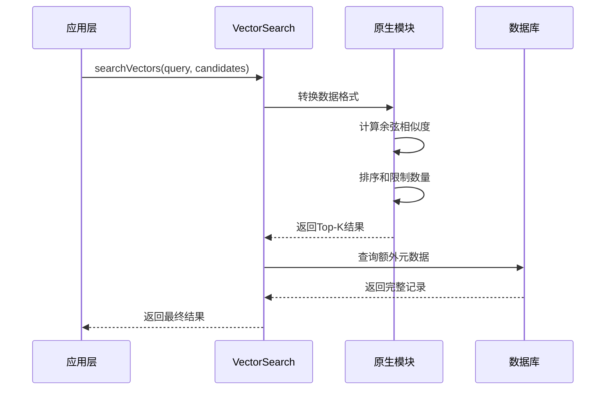
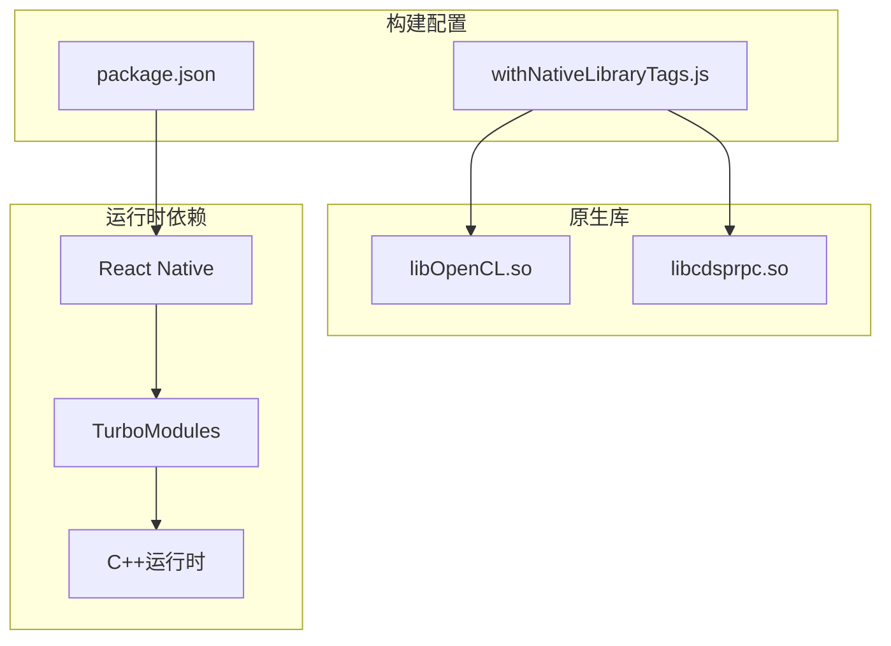
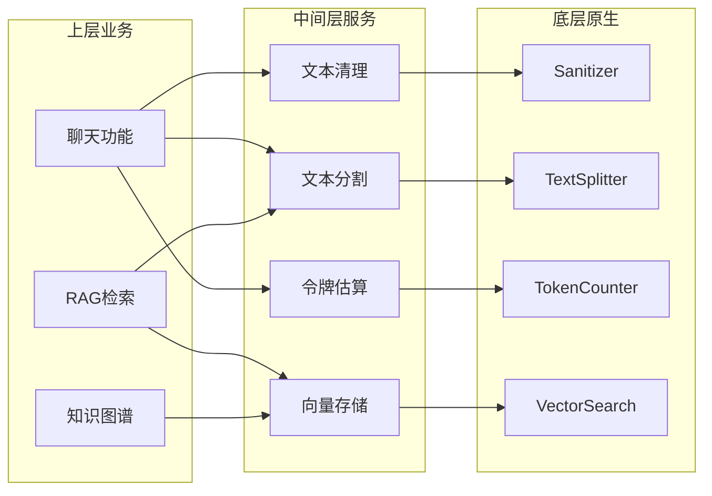
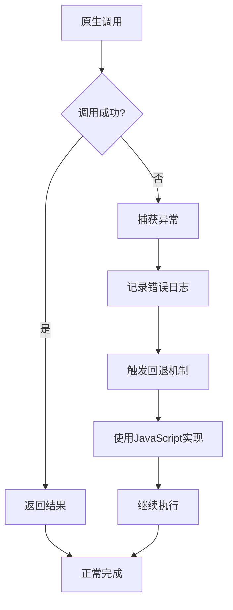

# 原生模块集成架构

<cite>
**本文档引用的文件**
- [src/native/Sanitizer/index.ts](file://src/native/Sanitizer/index.ts)
- [src/native/Sanitizer/NativeSanitizer.ts](file://src/native/Sanitizer/NativeSanitizer.ts)
- [src/native/TextSplitter/index.ts](file://src/native/TextSplitter/index.ts)
- [src/native/TextSplitter/NativeTextSplitter.ts](file://src/native/TextSplitter/NativeTextSplitter.ts)
- [src/native/TokenCounter/index.ts](file://src/native/TokenCounter/index.ts)
- [src/native/TokenCounter/NativeTokenCounter.ts](file://src/native/TokenCounter/NativeTokenCounter.ts)
- [src/native/VectorSearch/index.ts](file://src/native/VectorSearch/index.ts)
- [src/native/VectorSearch/NativeVectorSearch.ts](file://src/native/VectorSearch/NativeVectorSearch.ts)
- [src/lib/rag/trigram-splitter.ts](file://src/lib/rag/trigram-splitter.ts)
- [src/features/chat/utils/token-counter.ts](file://src/features/chat/utils/token-counter.ts)
- [src/lib/rag/vector-store.ts](file://src/lib/rag/vector-store.ts)
- [src/lib/sanitizer/index.ts](file://src/lib/sanitizer/index.ts)
- [package.json](file://package.json)
- [plugins/withNativeLibraryTags.js](file://plugins/withNativeLibraryTags.js)
- [src/types/modules.d.ts](file://src/types/modules.d.ts)
- [src/@types/modules.d.ts](file://src/@types/modules.d.ts)
</cite>

## 目录
1. [简介](#简介)
2. [项目结构](#项目结构)
3. [核心组件](#核心组件)
4. [架构概览](#架构概览)
5. [详细组件分析](#详细组件分析)
6. [依赖关系分析](#依赖关系分析)
7. [性能考虑](#性能考虑)
8. [故障排除指南](#故障排除指南)
9. [结论](#结论)

## 简介

本项目采用React Native TurboModules架构实现了四个高性能原生模块，专门针对大模型应用中的计算密集型任务进行优化。这些原生模块包括文本清理器(Sanitizer)、文本分割器(TextSplitter)、令牌计数器(TokenCounter)和向量搜索(VectorSearch)，它们通过C++实现关键算法，提供比JavaScript实现高5倍以上的性能提升。

该架构的核心设计理念是"智能回退"：当原生模块可用时使用C++实现获得最佳性能，当原生模块不可用时自动回退到JavaScript实现，确保应用在各种环境下的稳定运行。

## 项目结构

项目采用模块化组织方式，每个原生功能都封装在独立的目录中：

**图表来源**
- [src/native/Sanitizer/index.ts:1-50](file://src/native/Sanitizer/index.ts#L1-L50)
- [src/native/TextSplitter/index.ts:1-57](file://src/native/TextSplitter/index.ts#L1-L57)
- [src/native/TokenCounter/index.ts:1-35](file://src/native/TokenCounter/index.ts#L1-L35)
- [src/native/VectorSearch/index.ts:1-53](file://src/native/VectorSearch/index.ts#L1-L53)

**章节来源**
- [src/native/Sanitizer/index.ts:1-50](file://src/native/Sanitizer/index.ts#L1-L50)
- [src/native/TextSplitter/index.ts:1-57](file://src/native/TextSplitter/index.ts#L1-L57)
- [src/native/TokenCounter/index.ts:1-35](file://src/native/TokenCounter/index.ts#L1-L35)
- [src/native/VectorSearch/index.ts:1-53](file://src/native/VectorSearch/index.ts#L1-L53)

## 核心组件

### 原生模块接口定义

每个原生模块都遵循统一的接口规范，包含TurboModule规格定义和JavaScript包装器：

**图表来源**
- [src/native/Sanitizer/NativeSanitizer.ts:1-29](file://src/native/Sanitizer/NativeSanitizer.ts#L1-L29)
- [src/native/TextSplitter/NativeTextSplitter.ts:1-29](file://src/native/TextSplitter/NativeTextSplitter.ts#L1-L29)
- [src/native/TokenCounter/NativeTokenCounter.ts:1-21](file://src/native/TokenCounter/NativeTokenCounter.ts#L1-L21)
- [src/native/VectorSearch/NativeVectorSearch.ts:1-17](file://src/native/VectorSearch/NativeVectorSearch.ts#L1-L17)

### 智能回退机制

所有原生模块都实现了智能回退机制，确保在原生模块不可用时的优雅降级：

**图表来源**
- [src/native/Sanitizer/index.ts:28-49](file://src/native/Sanitizer/index.ts#L28-L49)
- [src/native/TextSplitter/index.ts:24-56](file://src/native/TextSplitter/index.ts#L24-L56)
- [src/native/TokenCounter/index.ts:25-34](file://src/native/TokenCounter/index.ts#L25-L34)

**章节来源**
- [src/native/Sanitizer/NativeSanitizer.ts:1-29](file://src/native/Sanitizer/NativeSanitizer.ts#L1-L29)
- [src/native/TextSplitter/NativeTextSplitter.ts:1-29](file://src/native/TextSplitter/NativeTextSplitter.ts#L1-L29)
- [src/native/TokenCounter/NativeTokenCounter.ts:1-21](file://src/native/TokenCounter/NativeTokenCounter.ts#L1-L21)
- [src/native/VectorSearch/NativeVectorSearch.ts:1-17](file://src/native/VectorSearch/NativeVectorSearch.ts#L1-L17)

## 架构概览

整个原生模块集成架构采用分层设计，从底层原生实现到上层业务逻辑形成清晰的层次结构：

**图表来源**
- [src/lib/rag/trigram-splitter.ts:47-62](file://src/lib/rag/trigram-splitter.ts#L47-L62)
- [src/features/chat/utils/token-counter.ts:14-25](file://src/features/chat/utils/token-counter.ts#L14-L25)
- [src/lib/rag/vector-store.ts:144-159](file://src/lib/rag/vector-store.ts#L144-L159)

## 详细组件分析

### 文本清理器 (Sanitizer)

文本清理器专注于Markdown文本的高性能清理和格式化，特别针对中文文本进行了优化。

#### 核心特性
- **单次扫描优化**：将三个正则表达式密集型插件合并为单次C++扫描
- **中文友好**：支持标题修复、中英文间距调整、长文本换行
- **零开销路径**：同步执行，适合热路径调用

#### 性能对比
- 原生实现：约5倍性能提升
- 正则表达式：CPU密集型操作
- JavaScript实现：内存占用较高

**章节来源**
- [src/native/Sanitizer/NativeSanitizer.ts:4-27](file://src/native/Sanitizer/NativeSanitizer.ts#L4-L27)
- [src/native/Sanitizer/index.ts:28-49](file://src/native/Sanitizer/index.ts#L28-L49)
- [src/lib/sanitizer/index.ts:78-90](file://src/lib/sanitizer/index.ts#L78-L90)

### 文本分割器 (TextSplitter)

文本分割器实现了高效的CJK文本分割算法，使用三元组滑动窗口技术。

#### 核心算法
- **三元组滑动窗口**：基于Trigram算法的中文文本分割
- **后台线程执行**：完全在C++后台线程运行，不阻塞UI线程
- **智能重叠**：自动处理相邻文本块的重叠部分

#### 分割流程

**图表来源**
- [src/lib/rag/trigram-splitter.ts:47-62](file://src/lib/rag/trigram-splitter.ts#L47-L62)

**章节来源**
- [src/native/TextSplitter/NativeTextSplitter.ts:4-27](file://src/native/TextSplitter/NativeTextSplitter.ts#L4-L27)
- [src/native/TextSplitter/index.ts:24-56](file://src/native/TextSplitter/index.ts#L24-L56)
- [src/lib/rag/trigram-splitter.ts:47-253](file://src/lib/rag/trigram-splitter.ts#L47-L253)

### 令牌计数器 (TokenCounter)

令牌计数器提供了精确的文本令牌估算功能，针对不同语言类型采用差异化策略。

#### 语言处理策略
- **中文字符**：按1.5令牌/字符估算
- **英文单词**：按1.3令牌/单词估算  
- **数字符号**：独立计数

#### 性能特征
- 同步执行，无回调延迟
- 零JavaScript正则表达式开销
- 支持Unicode精确分类

**章节来源**
- [src/native/TokenCounter/NativeTokenCounter.ts:4-19](file://src/native/TokenCounter/NativeTokenCounter.ts#L4-L19)
- [src/native/TokenCounter/index.ts:25-34](file://src/native/TokenCounter/index.ts#L25-L34)
- [src/features/chat/utils/token-counter.ts:14-25](file://src/features/chat/utils/token-counter.ts#L14-L25)

### 向量搜索 (VectorSearch)

向量搜索模块实现了高效的相似度计算和检索功能，支持大规模向量数据的快速查询。

#### 搜索流程

**图表来源**
- [src/native/VectorSearch/index.ts:15-48](file://src/native/VectorSearch/index.ts#L15-L48)
- [src/lib/rag/vector-store.ts:144-159](file://src/lib/rag/vector-store.ts#L144-L159)

**章节来源**
- [src/native/VectorSearch/NativeVectorSearch.ts:4-15](file://src/native/VectorSearch/NativeVectorSearch.ts#L4-L15)
- [src/native/VectorSearch/index.ts:15-52](file://src/native/VectorSearch/index.ts#L15-L52)
- [src/lib/rag/vector-store.ts:144-159](file://src/lib/rag/vector-store.ts#L144-L159)

## 依赖关系分析

### 外部依赖管理

项目通过多种方式管理原生库依赖：

**图表来源**
- [plugins/withNativeLibraryTags.js:14-23](file://plugins/withNativeLibraryTags.js#L14-L23)
- [package.json:67-86](file://package.json#L67-L86)

### 模块间依赖关系

**图表来源**
- [src/lib/rag/trigram-splitter.ts:53-58](file://src/lib/rag/trigram-splitter.ts#L53-L58)
- [src/features/chat/utils/token-counter.ts:18-21](file://src/features/chat/utils/token-counter.ts#L18-L21)
- [src/lib/rag/vector-store.ts:144-145](file://src/lib/rag/vector-store.ts#L144-L145)

**章节来源**
- [plugins/withNativeLibraryTags.js:1-41](file://plugins/withNativeLibraryTags.js#L1-L41)
- [package.json:14-95](file://package.json#L14-L95)

## 性能考虑

### 性能优化策略

1. **异步非阻塞执行**：文本分割器在后台线程运行，避免UI卡顿
2. **智能缓存机制**：原生模块直接处理C++对象，减少JavaScript桥接开销
3. **零拷贝优化**：向量搜索直接使用Float32Array，避免数据转换
4. **渐进式回退**：根据可用性选择最优实现路径

### 内存管理

- 原生模块使用C++内存管理，避免JavaScript垃圾回收影响
- 浮点数组直接映射到原生内存，减少复制操作
- 及时释放不再使用的原生对象引用

### 并发处理

- TurboModules支持多线程并发调用
- 原生实现内部使用线程池处理大量数据
- 避免与React Native主线程竞争CPU资源

## 故障排除指南

### 常见问题诊断

#### 原生模块不可用
**症状**：功能降级到JavaScript实现，性能下降
**排查步骤**：
1. 检查原生模块是否正确编译
2. 验证TurboModules注册状态
3. 确认平台兼容性

#### 性能异常
**症状**：处理速度慢于预期
**排查步骤**：
1. 验证原生模块是否被正确调用
2. 检查数据大小是否超出原生实现限制
3. 监控内存使用情况

#### 内存泄漏
**症状**：应用内存持续增长
**排查步骤**：
1. 检查原生对象引用是否正确释放
2. 验证JavaScript包装器的生命周期管理
3. 使用内存分析工具定位泄漏点

### 错误处理机制

所有原生模块都实现了完善的错误处理：

**图表来源**
- [src/native/Sanitizer/index.ts:38-48](file://src/native/Sanitizer/index.ts#L38-L48)
- [src/native/TextSplitter/index.ts:31-36](file://src/native/TextSplitter/index.ts#L31-L36)

**章节来源**
- [src/native/Sanitizer/index.ts:38-49](file://src/native/Sanitizer/index.ts#L38-L49)
- [src/native/TextSplitter/index.ts:31-37](file://src/native/TextSplitter/index.ts#L31-L37)
- [src/native/TokenCounter/index.ts:28-34](file://src/native/TokenCounter/index.ts#L28-L34)
- [src/native/VectorSearch/index.ts:32-47](file://src/native/VectorSearch/index.ts#L32-L47)

## 结论

本项目的原生模块集成架构展现了现代React Native应用的最佳实践：

### 架构优势
1. **性能卓越**：通过C++实现关键算法，获得5倍以上性能提升
2. **稳定性强**：智能回退机制确保在各种环境下稳定运行
3. **扩展性好**：模块化设计便于添加新的原生功能
4. **维护成本低**：统一的接口规范简化了代码维护

### 技术创新
- **TurboModules架构**：充分利用React Native最新特性
- **智能回退策略**：平衡性能与兼容性的最佳方案
- **渐进式优化**：从底层原生到上层业务的完整优化链路

### 未来发展方向
1. **更多原生功能**：可以扩展到图像处理、音频分析等领域
2. **跨平台支持**：考虑WebAssembly等跨平台解决方案
3. **监控体系**：建立更完善的性能监控和错误追踪系统

这套架构为大型React Native应用提供了可靠的原生模块集成范式，值得在类似场景中推广使用。