# 数据架构

<cite>
**本文档引用的文件**
- [src/store/chat-store.ts](file://src/store/chat-store.ts)
- [src/store/rag-store.ts](file://src/store/rag-store.ts)
- [src/store/artifact-store.ts](file://src/store/artifact-store.ts)
- [src/store/settings-store.ts](file://src/store/settings-store.ts)
- [src/store/workbench-store.ts](file://src/store/workbench-store.ts)
- [src/lib/db/index.ts](file://src/lib/db/index.ts)
- [src/lib/db/session-repository.ts](file://src/lib/db/session-repository.ts)
- [src/lib/rag/memory-manager.ts](file://src/lib/rag/memory-manager.ts)
- [src/lib/rag/vector-store.ts](file://src/lib/rag/vector-store.ts)
- [src/lib/rag/vectorization-queue.ts](file://src/lib/rag/vectorization-queue.ts)
- [src/lib/rag/graph-extractor.ts](file://src/lib/rag/graph-extractor.ts)
- [src/types/chat.ts](file://src/types/chat.ts)
- [src/types/rag.ts](file://src/types/rag.ts)
- [src/types/artifact.ts](file://src/types/artifact.ts)
</cite>

## 目录
1. [简介](#简介)
2. [项目结构](#项目结构)
3. [核心组件](#核心组件)
4. [架构概览](#架构概览)
5. [详细组件分析](#详细组件分析)
6. [依赖分析](#依赖分析)
7. [性能考量](#性能考量)
8. [故障排除指南](#故障排除指南)
9. [结论](#结论)

## 简介

Nexara 是一个基于 React Native 的智能聊天应用，采用先进的数据架构设计，实现了高效的消息管理、RAG（检索增强生成）系统和知识图谱功能。该应用的核心数据架构围绕 SQLite 数据库存储、Zustand 状态管理和异步向量化处理构建，提供了完整的数据持久化、检索和分析能力。

## 项目结构

应用采用模块化的文件组织方式，主要分为以下几个核心区域：

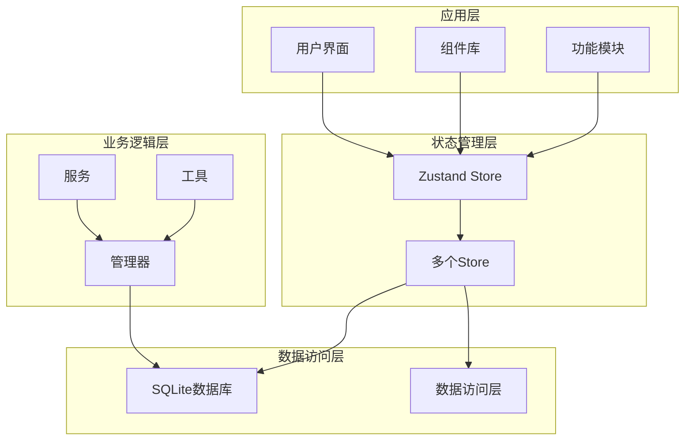

**图表来源**
- [src/store/chat-store.ts:1-800](file://src/store/chat-store.ts#L1-L800)
- [src/lib/db/index.ts:1-13](file://src/lib/db/index.ts#L1-L13)

**章节来源**
- [src/store/chat-store.ts:1-800](file://src/store/chat-store.ts#L1-L800)
- [src/lib/db/index.ts:1-13](file://src/lib/db/index.ts#L1-L13)

## 核心组件

### 状态管理系统

应用采用 Zustand 作为状态管理解决方案，实现了轻量级但功能强大的状态管理：

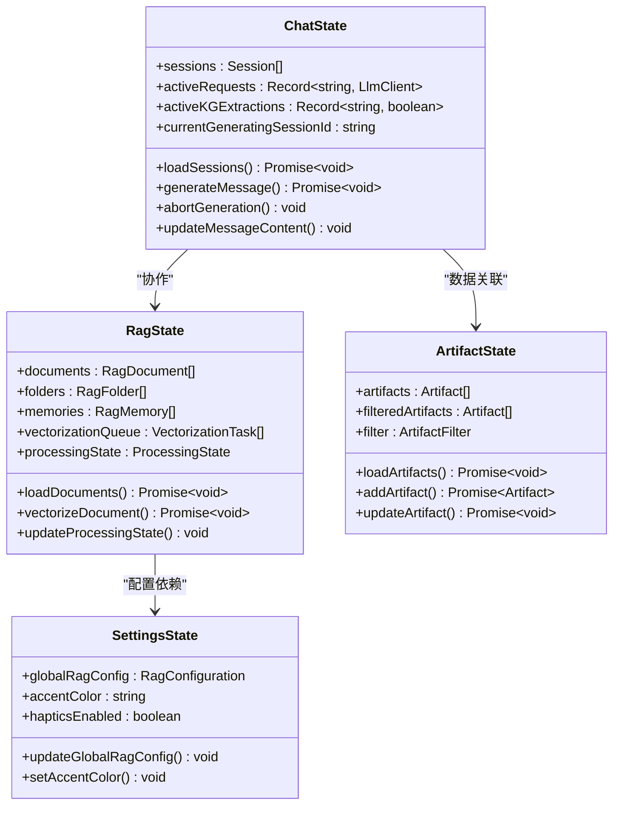

**图表来源**
- [src/store/chat-store.ts:108-210](file://src/store/chat-store.ts#L108-L210)
- [src/store/rag-store.ts:24-145](file://src/store/rag-store.ts#L24-L145)
- [src/store/artifact-store.ts:16-32](file://src/store/artifact-store.ts#L16-L32)
- [src/store/settings-store.ts:10-73](file://src/store/settings-store.ts#L10-L73)

### 数据存储架构

应用采用分层数据存储架构，结合内存状态管理和持久化存储：

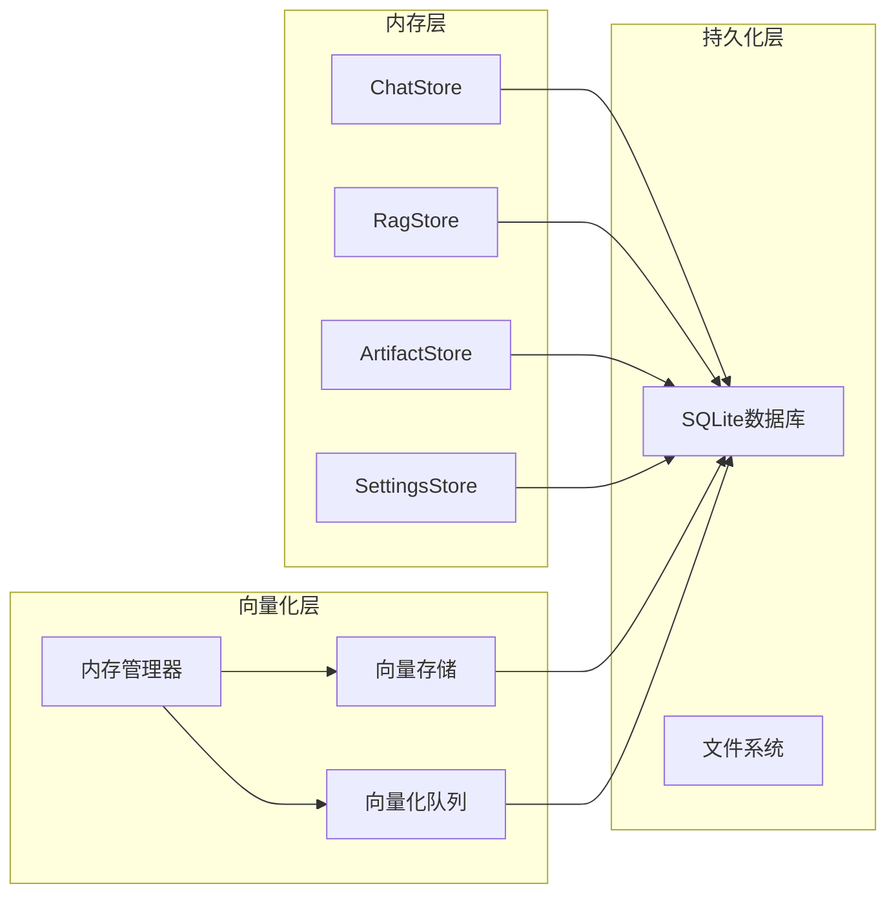

**图表来源**
- [src/lib/db/session-repository.ts:1-425](file://src/lib/db/session-repository.ts#L1-L425)
- [src/lib/rag/vector-store.ts:22-376](file://src/lib/rag/vector-store.ts#L22-L376)
- [src/lib/rag/vectorization-queue.ts:22-804](file://src/lib/rag/vectorization-queue.ts#L22-L804)

**章节来源**
- [src/store/chat-store.ts:212-360](file://src/store/chat-store.ts#L212-L360)
- [src/store/rag-store.ts:147-242](file://src/store/rag-store.ts#L147-L242)
- [src/store/artifact-store.ts:95-255](file://src/store/artifact-store.ts#L95-L255)
- [src/store/settings-store.ts:75-244](file://src/store/settings-store.ts#L75-L244)

## 架构概览

应用的整体数据架构采用了现代化的设计模式，实现了数据流的清晰分离和高效的处理机制：

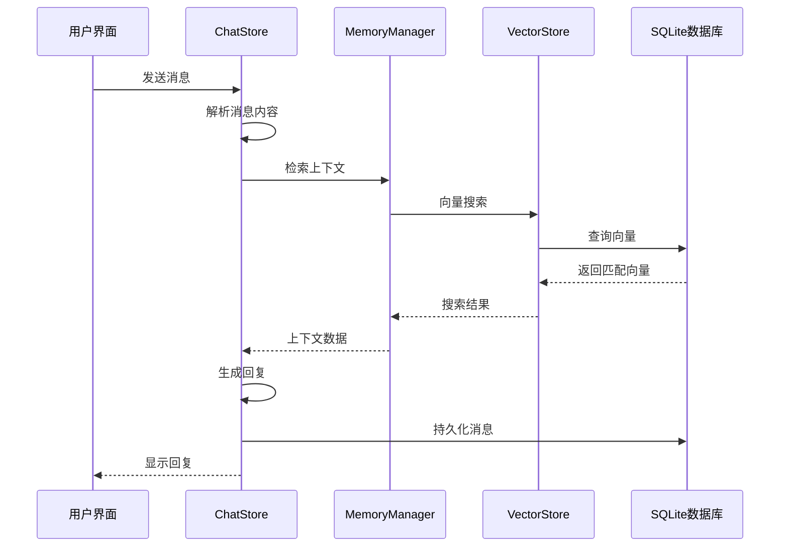

**图表来源**
- [src/store/chat-store.ts:360-732](file://src/store/chat-store.ts#L360-L732)
- [src/lib/rag/memory-manager.ts:11-712](file://src/lib/rag/memory-manager.ts#L11-L712)
- [src/lib/rag/vector-store.ts:62-113](file://src/lib/rag/vector-store.ts#L62-L113)

### 数据流处理

应用实现了完整的数据流处理管道，从数据输入到最终输出：

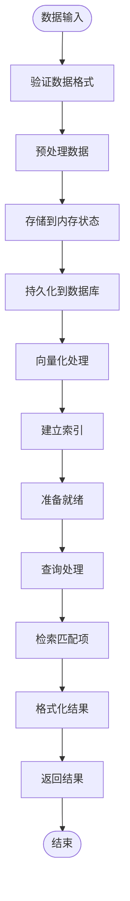

**图表来源**
- [src/lib/rag/vectorization-queue.ts:156-250](file://src/lib/rag/vectorization-queue.ts#L156-L250)
- [src/lib/rag/memory-manager.ts:120-712](file://src/lib/rag/memory-manager.ts#L120-L712)

## 详细组件分析

### ChatStore 分析

ChatStore 是应用的核心状态管理组件，负责处理所有聊天相关的数据和业务逻辑：

#### 核心功能架构

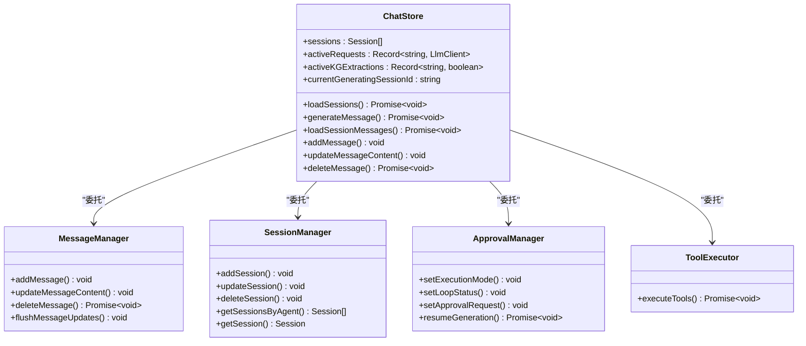

**图表来源**
- [src/store/chat-store.ts:108-210](file://src/store/chat-store.ts#L108-L210)
- [src/store/chat-store.ts:212-360](file://src/store/chat-store.ts#L212-L360)

#### 消息处理流程

ChatStore 实现了复杂的消息处理流程，包括消息创建、更新和删除：

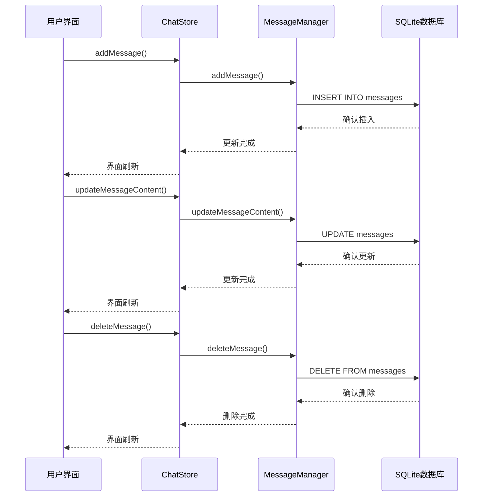

**图表来源**
- [src/store/chat-store.ts:296-320](file://src/store/chat-store.ts#L296-L320)
- [src/lib/db/session-repository.ts:162-204](file://src/lib/db/session-repository.ts#L162-L204)

**章节来源**
- [src/store/chat-store.ts:108-360](file://src/store/chat-store.ts#L108-L360)
- [src/lib/db/session-repository.ts:14-204](file://src/lib/db/session-repository.ts#L14-L204)

### RAG 存储系统分析

RAG（检索增强生成）存储系统是应用的核心功能之一，提供了完整的文档管理和检索能力：

#### 文档管理架构

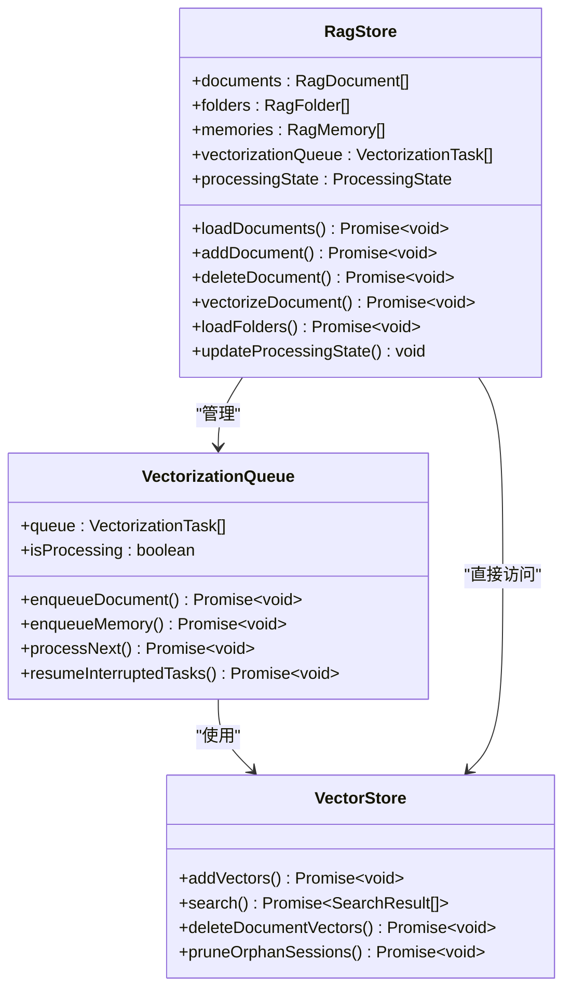

**图表来源**
- [src/store/rag-store.ts:24-145](file://src/store/rag-store.ts#L24-L145)
- [src/lib/rag/vectorization-queue.ts:22-804](file://src/lib/rag/vectorization-queue.ts#L22-L804)
- [src/lib/rag/vector-store.ts:22-376](file://src/lib/rag/vector-store.ts#L22-L376)

#### 向量化处理流程

向量化系统实现了高效的文档处理和存储机制：

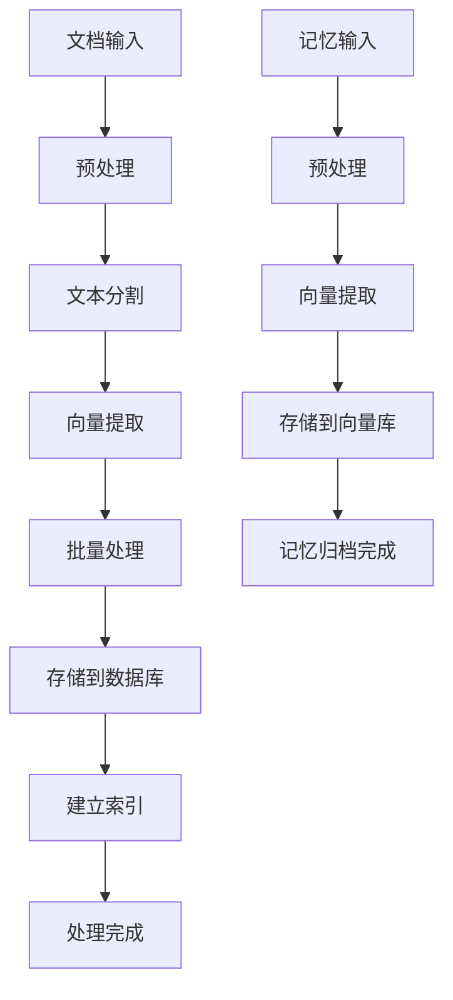

**图表来源**
- [src/lib/rag/vectorization-queue.ts:256-414](file://src/lib/rag/vectorization-queue.ts#L256-L414)
- [src/lib/rag/vector-store.ts:31-60](file://src/lib/rag/vector-store.ts#L31-L60)

**章节来源**
- [src/store/rag-store.ts:147-800](file://src/store/rag-store.ts#L147-L800)
- [src/lib/rag/vectorization-queue.ts:22-804](file://src/lib/rag/vectorization-queue.ts#L22-L804)
- [src/lib/rag/vector-store.ts:22-376](file://src/lib/rag/vector-store.ts#L22-L376)

### 知识图谱系统分析

应用集成了先进的知识图谱功能，支持实体识别和关系抽取：

#### 知识图谱架构

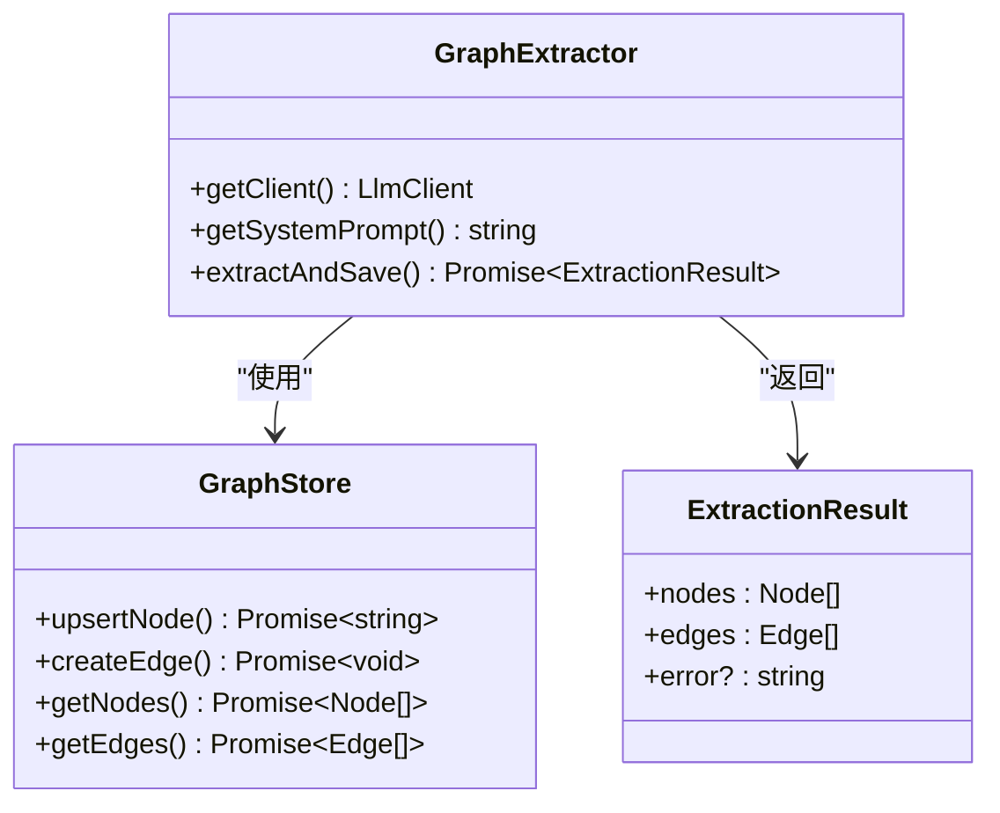

**图表来源**
- [src/lib/rag/graph-extractor.ts:25-313](file://src/lib/rag/graph-extractor.ts#L25-L313)

#### 实体抽取流程

知识图谱系统实现了完整的实体识别和关系抽取流程：

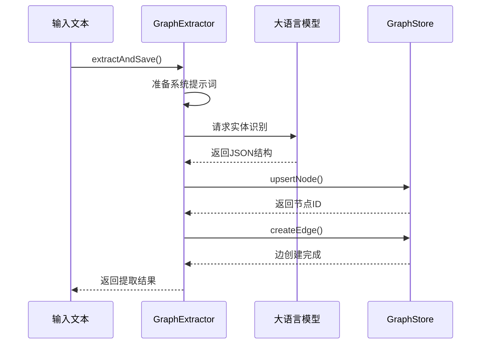

**图表来源**
- [src/lib/rag/graph-extractor.ts:149-310](file://src/lib/rag/graph-extractor.ts#L149-L310)

**章节来源**
- [src/lib/rag/graph-extractor.ts:25-313](file://src/lib/rag/graph-extractor.ts#L25-L313)

### 数据模型分析

应用定义了完整的数据模型体系，支持不同类型的数据存储和查询：

#### 核心数据模型

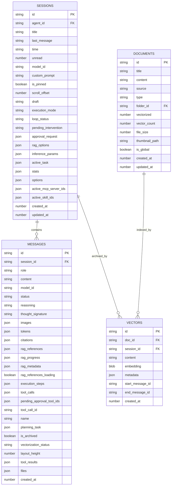

**图表来源**
- [src/lib/db/session-repository.ts:14-204](file://src/lib/db/session-repository.ts#L14-L204)
- [src/lib/db/session-repository.ts:266-402](file://src/lib/db/session-repository.ts#L266-L402)

**章节来源**
- [src/types/chat.ts:135-223](file://src/types/chat.ts#L135-L223)
- [src/types/rag.ts:11-66](file://src/types/rag.ts#L11-L66)
- [src/lib/db/session-repository.ts:14-425](file://src/lib/db/session-repository.ts#L14-L425)

## 依赖分析

应用的依赖关系体现了清晰的分层架构设计：

```mermaid
graph TB
subgraph "外部依赖"
ZUSTAND[Zustand]
SQLITE[@op-engineering/op-sqlite]
ASYNC_STORAGE[@react-native-async-storage/async-storage]
EXPONENT_FILE_SYSTEM[expo-file-system]
end
subgraph "内部模块"
STORES[Store模块]
LIB[Lib模块]
TYPES[Types模块]
COMPONENTS[Components模块]
end
subgraph "核心功能"
CHAT_STORE[ChatStore]
RAG_STORE[RagStore]
ARTIFACT_STORE[ArtifactStore]
SETTINGS_STORE[SettingsStore]
MEMORY_MANAGER[MemoryManager]
VECTOR_STORE[VectorStore]
GRAPH_EXTRACTOR[GraphExtractor]
end
ZUSTAND --> STORES
SQLITE --> STORES
ASYNC_STORAGE --> STORES
EXPONENT_FILE_SYSTEM --> STORES
STORES --> CHAT_STORE
STORES --> RAG_STORE
STORES --> ARTIFACT_STORE
STORES --> SETTINGS_STORE
LIB --> MEMORY_MANAGER
LIB --> VECTOR_STORE
LIB --> GRAPH_EXTRACTOR
COMPONENTS --> STORES
TYPES --> STORES
TYPES --> LIB
```

**图表来源**
- [src/store/chat-store.ts:1-42](file://src/store/chat-store.ts#L1-L42)
- [src/store/rag-store.ts:1-11](file://src/store/rag-store.ts#L1-L11)
- [src/store/artifact-store.ts:6-14](file://src/store/artifact-store.ts#L6-L14)

### 数据流依赖

应用实现了清晰的数据流依赖关系：

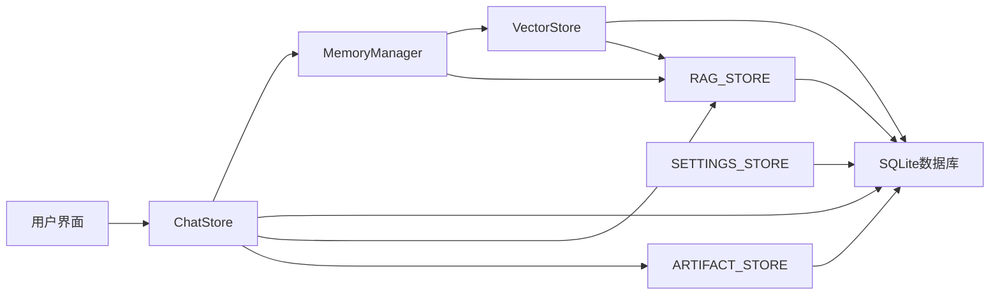

**图表来源**
- [src/store/chat-store.ts:360-732](file://src/store/chat-store.ts#L360-L732)
- [src/lib/rag/memory-manager.ts:11-712](file://src/lib/rag/memory-manager.ts#L11-L712)

**章节来源**
- [src/store/chat-store.ts:1-42](file://src/store/chat-store.ts#L1-L42)
- [src/store/rag-store.ts:1-11](file://src/store/rag-store.ts#L1-L11)
- [src/store/artifact-store.ts:6-14](file://src/store/artifact-store.ts#L6-L14)

## 性能考量

应用在设计时充分考虑了性能优化，采用了多种策略来提升系统的响应速度和效率：

### 异步处理策略

应用采用了异步处理机制来避免阻塞主线程：

- **向量化队列**：使用队列系统处理文档和记忆的向量化，避免同时处理大量数据
- **分页加载**：消息采用分页加载策略，只加载必要的历史消息
- **延迟初始化**：数据库连接和大型对象采用延迟初始化

### 内存管理

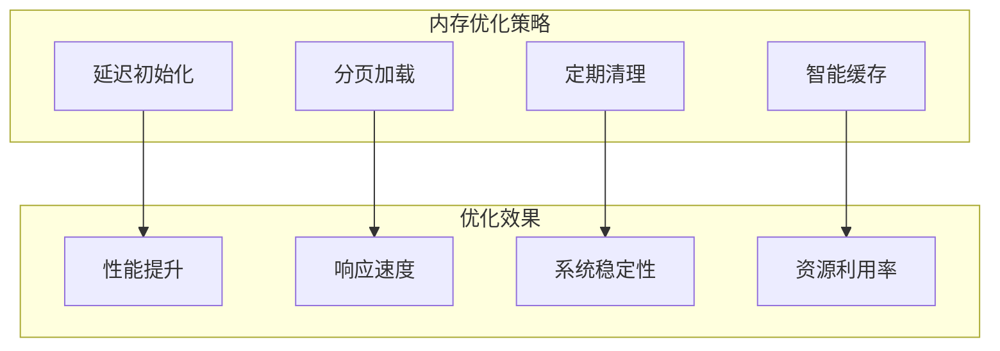

### 数据库优化

应用采用了多种数据库优化技术：

- **WAL 模式**：启用 Write-Ahead Logging 提高并发性能
- **事务处理**：使用事务确保数据一致性和完整性
- **索引优化**：为常用查询字段建立适当的索引
- **批量操作**：支持批量插入和更新操作

## 故障排除指南

### 常见问题诊断

应用提供了完善的错误处理和诊断机制：

#### 向量化错误处理

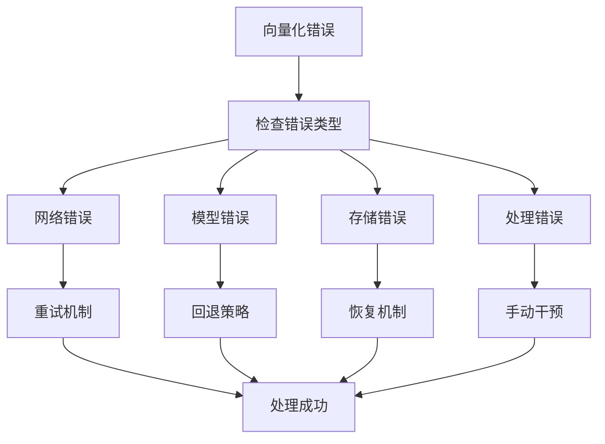

#### 数据库连接问题

当遇到数据库连接问题时，可以采取以下措施：

1. **检查数据库文件**：确认数据库文件存在且可访问
2. **验证权限设置**：确保应用具有正确的文件系统权限
3. **重启数据库连接**：重新初始化数据库连接
4. **清理损坏数据**：删除损坏的数据库文件并重建

**章节来源**
- [src/lib/rag/vectorization-queue.ts:200-250](file://src/lib/rag/vectorization-queue.ts#L200-L250)
- [src/lib/db/index.ts:7-12](file://src/lib/db/index.ts#L7-L12)

### 调试工具

应用提供了多种调试工具来帮助开发者诊断问题：

- **日志系统**：详细的日志记录帮助追踪问题
- **状态监控**：实时监控各个组件的状态变化
- **性能分析**：分析系统的性能瓶颈
- **错误报告**：收集和分析运行时错误

## 结论

Nexara 的数据架构设计体现了现代移动应用的最佳实践，通过合理的分层设计、高效的异步处理和完善的错误处理机制，实现了高性能、可扩展和易维护的数据系统。

### 架构优势

1. **模块化设计**：清晰的模块划分使得代码易于理解和维护
2. **异步处理**：避免阻塞主线程，提升用户体验
3. **数据持久化**：可靠的数据库设计确保数据安全
4. **可扩展性**：灵活的架构支持未来功能扩展
5. **性能优化**：多种优化策略确保系统高效运行

### 技术创新

应用在以下方面展现了技术创新：

- **知识图谱集成**：实现了先进的实体识别和关系抽取功能
- **向量化处理**：高效的文档向量化和检索机制
- **智能缓存**：智能的数据缓存策略提升系统性能
- **错误恢复**：完善的错误处理和恢复机制

通过这种精心设计的数据架构，Nexara 为用户提供了流畅、智能的聊天体验，同时为未来的功能扩展奠定了坚实的基础。