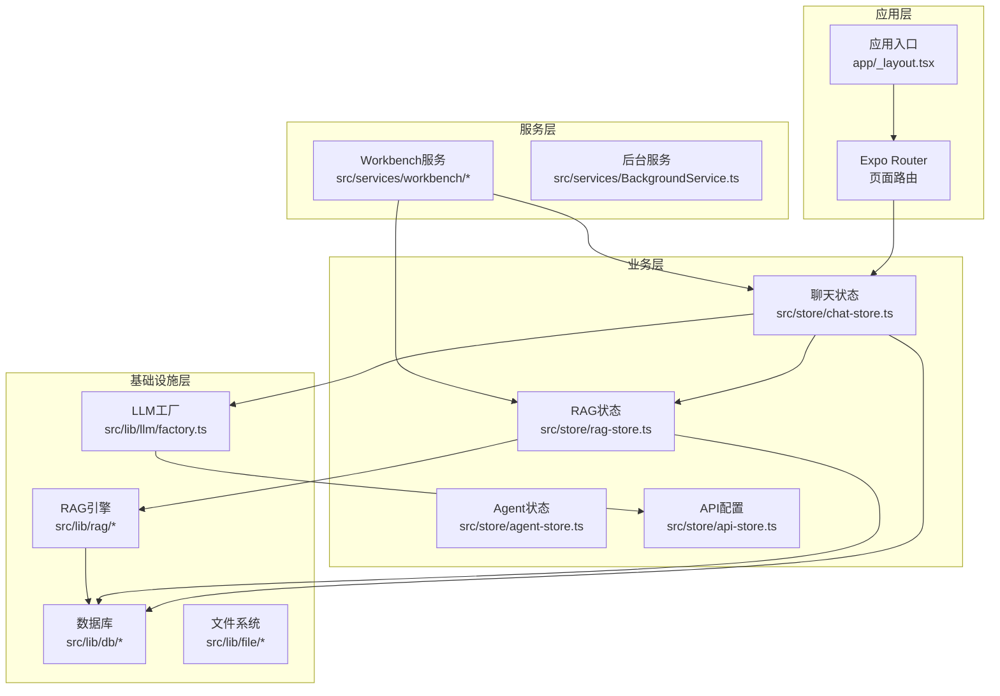
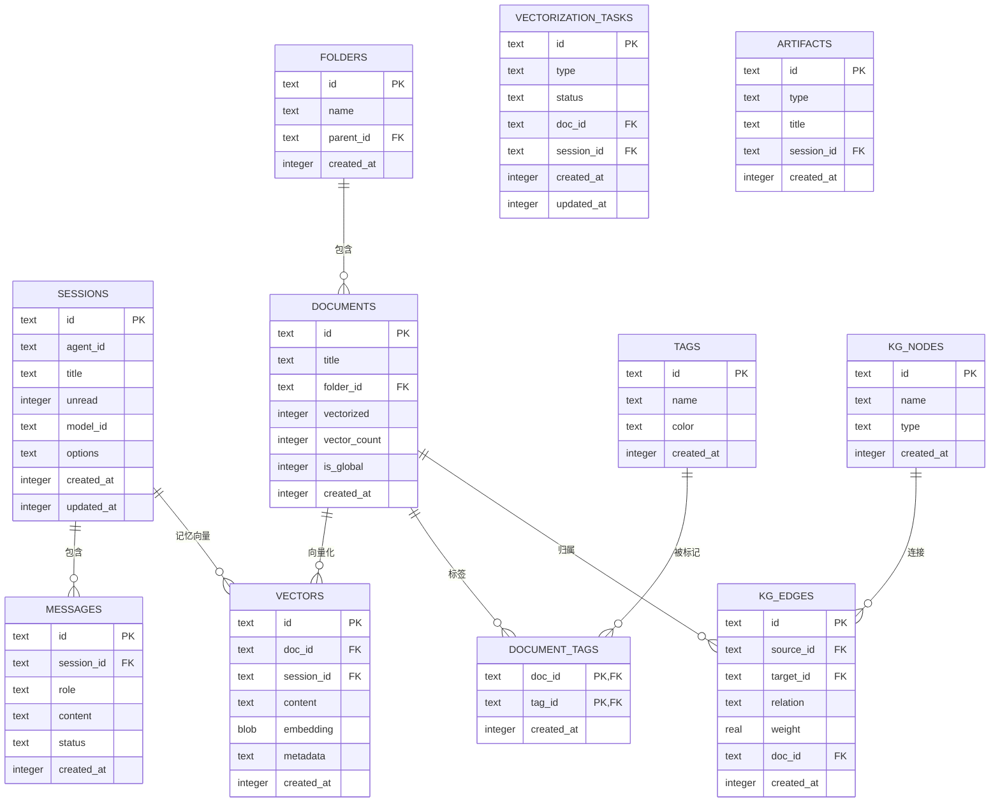
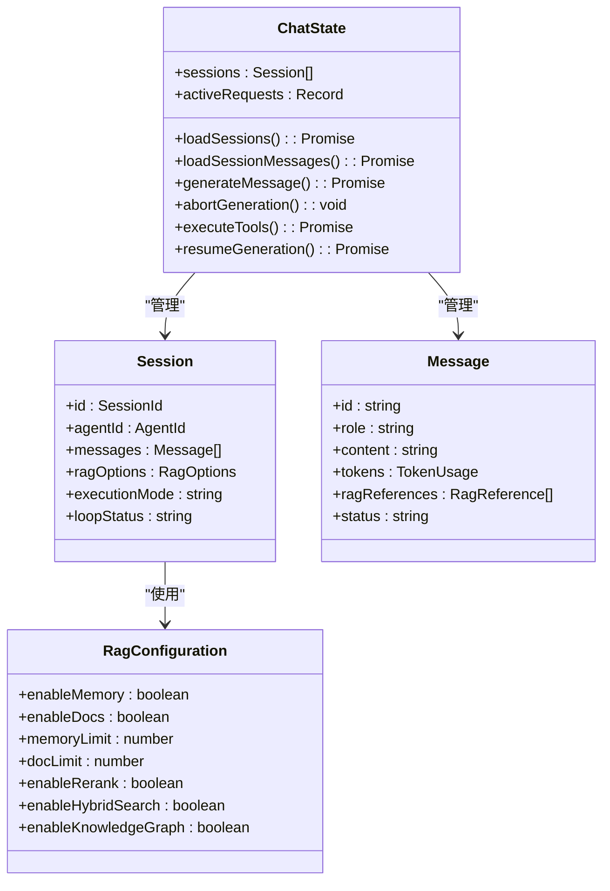
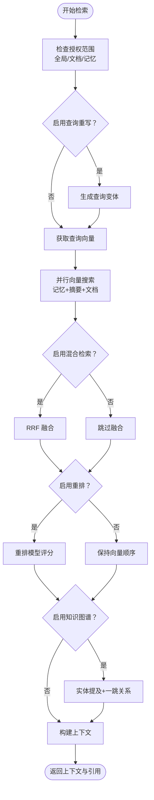
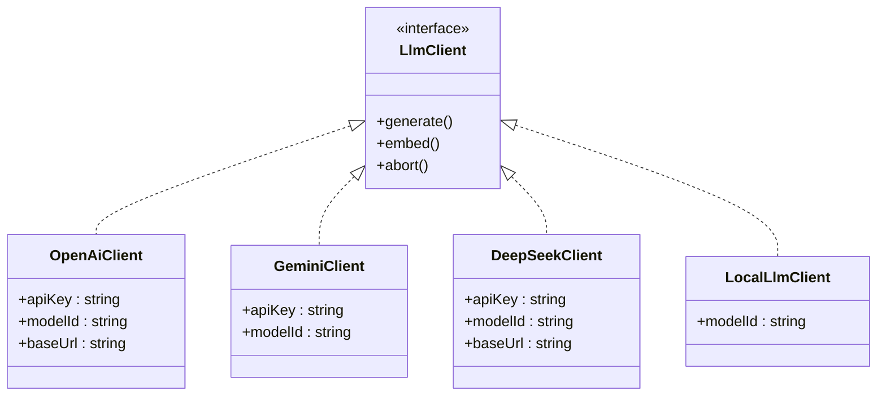
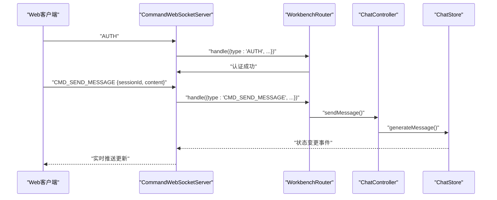
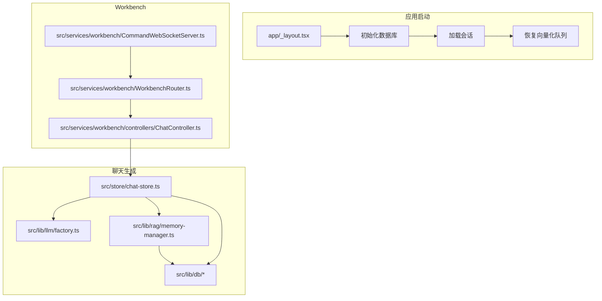
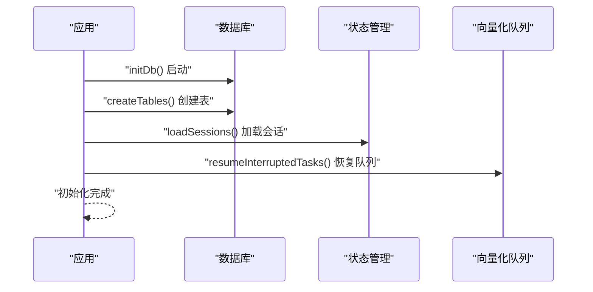
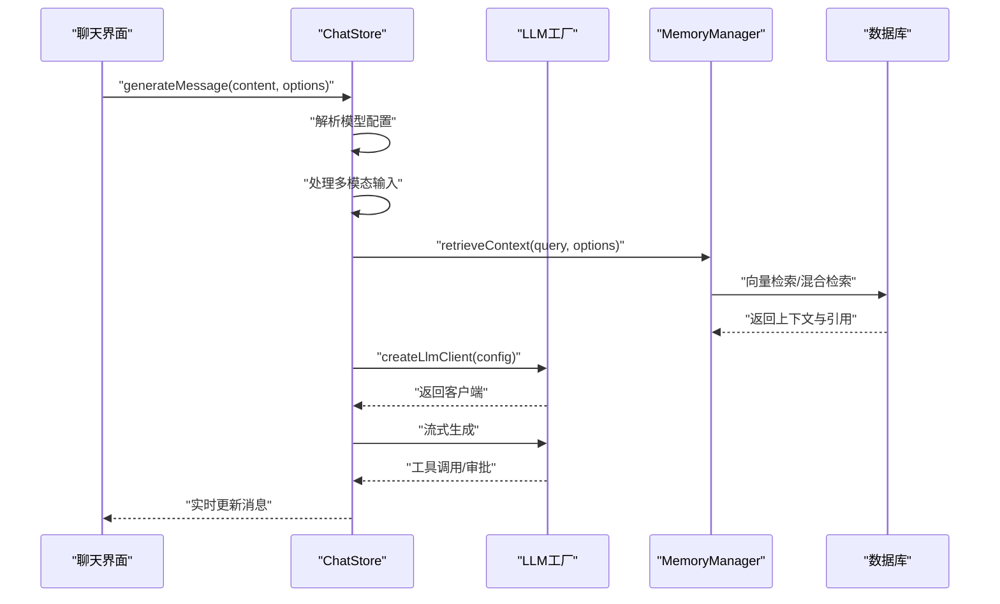
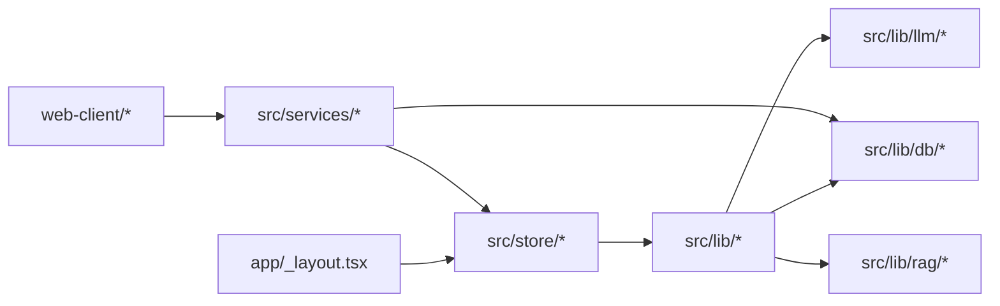

# 架构文档

<cite>
**本文档引用的文件**
- [README.md](file://README.md)
- [package.json](file://package.json)
- [app/_layout.tsx](file://app/_layout.tsx)
- [src/store/chat-store.ts](file://src/store/chat-store.ts)
- [src/lib/db/index.ts](file://src/lib/db/index.ts)
- [src/lib/db/schema.ts](file://src/lib/db/schema.ts)
- [src/lib/llm/factory.ts](file://src/lib/llm/factory.ts)
- [src/lib/rag/memory-manager.ts](file://src/lib/rag/memory-manager.ts)
- [src/store/rag-store.ts](file://src/store/rag-store.ts)
- [src/services/workbench/CommandWebSocketServer.ts](file://src/services/workbench/CommandWebSocketServer.ts)
- [src/services/workbench/WorkbenchRouter.ts](file://src/services/workbench/WorkbenchRouter.ts)
- [src/services/workbench/controllers/ChatController.ts](file://src/services/workbench/controllers/ChatController.ts)
- [src/types/chat.ts](file://src/types/chat.ts)
</cite>

## 目录
1. [简介](#简介)
2. [项目结构](#项目结构)
3. [核心组件](#核心组件)
4. [架构总览](#架构总览)
5. [详细组件分析](#详细组件分析)
6. [依赖关系分析](#依赖关系分析)
7. [性能考量](#性能考量)
8. [故障排查指南](#故障排查指南)
9. [结论](#结论)

## 简介
Nexara 是一个面向 Android 平台的 AI 助手客户端，采用本地优先的数据管理策略与多提供商模型接入。应用将对话、知识库与向量嵌入数据全部存储在设备本地的 SQLite 数据库中，并通过 12+ 个云 AI 提供商完成推理。核心特性包括多提供商聊天、RAG 知识引擎、Agent 系统、MCP 协议桥接、本地推理（实验性）、Workbench（实验性）以及丰富的 UI 渲染能力。

技术栈概览：
- 框架：Expo SDK 54 + React Native（新架构）
- 语言：TypeScript
- 状态管理：Zustand
- 数据库：op-sqlite（SQLite + FTS5 + 向量 BLOB）
- 本地推理：llama.rn
- 动画：Reanimated 4
- Web 面板：Vite + React 18 + TailwindCSS 4

## 项目结构
项目采用按功能域划分的组织方式，主要目录包括：
- app：应用入口与页面路由（Expo Router）
- src：核心业务逻辑与基础设施
  - components：UI 组件库
  - features：业务特性模块（聊天、设置等）
  - lib：底层库（数据库、LLM、RAG、文件系统等）
  - services：服务层（Workbench、后台服务等）
  - store：状态管理（Zustand）
  - types：类型定义
- web-client：配套的 Web 管理面板
- scripts：构建与辅助脚本

**图表来源**
- [app/_layout.tsx:1-191](file://app/_layout.tsx#L1-L191)
- [src/store/chat-store.ts:1-2579](file://src/store/chat-store.ts#L1-L2579)
- [src/store/rag-store.ts:1-1117](file://src/store/rag-store.ts#L1-L1117)

**章节来源**
- [README.md:1-161](file://README.md#L1-L161)
- [package.json:1-120](file://package.json#L1-L120)

## 核心组件
本节深入分析系统的关键组件及其职责与交互关系。

### 数据库与表结构
数据库采用 op-sqlite，提供 WAL 模式与外键约束，支持 FTS5 全文检索与向量 BLOB 存储。核心表包括：
- sessions：会话元数据与配置
- messages：消息内容与状态
- documents/folders/tags：知识库文档与标签体系
- vectors：向量与元数据
- kg_nodes/kg_edges：知识图谱节点与边
- vectorization_tasks：向量化任务队列（断点续传）
- audit_logs：审计日志
- artifacts：工件（工作区集成）

**图表来源**
- [src/lib/db/schema.ts:1-362](file://src/lib/db/schema.ts#L1-L362)

**章节来源**
- [src/lib/db/index.ts:1-13](file://src/lib/db/index.ts#L1-L13)
- [src/lib/db/schema.ts:1-362](file://src/lib/db/schema.ts#L1-L362)

### 聊天与会话管理
聊天状态管理采用 Zustand，负责：
- 会话生命周期管理（创建、加载、更新、删除）
- 消息管理（添加、更新、删除、分页加载）
- 生成流程控制（生成、中断、重新生成）
- 工具执行与审批流程（半自动/手动模式）
- RAG 检索与进度跟踪
- 多模态消息（文本、图片、文件）处理

**图表来源**
- [src/store/chat-store.ts:108-210](file://src/store/chat-store.ts#L108-L210)
- [src/types/chat.ts:169-223](file://src/types/chat.ts#L169-L223)
- [src/types/chat.ts:244-313](file://src/types/chat.ts#L244-L313)

**章节来源**
- [src/store/chat-store.ts:1-800](file://src/store/chat-store.ts#L1-L800)
- [src/types/chat.ts:1-314](file://src/types/chat.ts#L1-L314)

### RAG 引擎与检索流程
RAG 引擎提供多阶段检索与融合排序：
- 查询重写（Query Rewrite）
- 向量检索（向量 + 摘要）
- 关键词混合检索（Hybrid Search + RRF）
- 重排（Rerank）
- 知识图谱关联（KG）
- 上下文聚合与引用生成

**图表来源**
- [src/lib/rag/memory-manager.ts:11-712](file://src/lib/rag/memory-manager.ts#L11-L712)

**章节来源**
- [src/lib/rag/memory-manager.ts:1-800](file://src/lib/rag/memory-manager.ts#L1-L800)
- [src/store/rag-store.ts:1-800](file://src/store/rag-store.ts#L1-L800)

### LLM 工厂与多提供商适配
LLM 工厂根据提供商类型创建相应的客户端：
- OpenAI/Gemini/SiliconFlow 等标准提供商
- DeepSeek/Moonshot 等专用适配
- Vertex AI 与本地推理（llama.rn）
- 兼容 OpenAI 协议的第三方服务

**图表来源**
- [src/lib/llm/factory.ts:23-96](file://src/lib/llm/factory.ts#L23-L96)

**章节来源**
- [src/lib/llm/factory.ts:1-97](file://src/lib/llm/factory.ts#L1-L97)

### Workbench 服务与命令路由
Workbench 提供 WebSocket 服务器与命令路由，支持：
- 会话管理（获取、创建、删除、历史）
- 消息操作（发送、中断、删除、重新生成）
- 配置与备份管理
- 实时状态同步与广播

**图表来源**
- [src/services/workbench/CommandWebSocketServer.ts:44-178](file://src/services/workbench/CommandWebSocketServer.ts#L44-L178)
- [src/services/workbench/WorkbenchRouter.ts:18-75](file://src/services/workbench/WorkbenchRouter.ts#L18-L75)
- [src/services/workbench/controllers/ChatController.ts:75-95](file://src/services/workbench/controllers/ChatController.ts#L75-L95)

**章节来源**
- [src/services/workbench/CommandWebSocketServer.ts:1-488](file://src/services/workbench/CommandWebSocketServer.ts#L1-L488)
- [src/services/workbench/WorkbenchRouter.ts:1-75](file://src/services/workbench/WorkbenchRouter.ts#L1-L75)
- [src/services/workbench/controllers/ChatController.ts:1-130](file://src/services/workbench/controllers/ChatController.ts#L1-L130)

## 架构总览
系统采用分层架构，自上而下为应用层、业务层、服务层与基础设施层。应用启动时初始化数据库、加载会话、恢复中断任务，并注册后台服务与崩溃处理器。聊天生成流程贯穿状态管理、LLM 工厂、RAG 引擎与数据库层，最终通过 Workbench 实现实时同步。

**图表来源**
- [app/_layout.tsx:82-137](file://app/_layout.tsx#L82-L137)
- [src/store/chat-store.ts:360-732](file://src/store/chat-store.ts#L360-L732)
- [src/services/workbench/CommandWebSocketServer.ts:44-178](file://src/services/workbench/CommandWebSocketServer.ts#L44-L178)

**章节来源**
- [app/_layout.tsx:1-191](file://app/_layout.tsx#L1-L191)
- [src/store/chat-store.ts:1-800](file://src/store/chat-store.ts#L1-L800)

## 详细组件分析

### 应用启动与初始化流程
应用启动时执行以下关键步骤：
1. 初始化数据库（WAL 模式、外键约束）
2. 创建表结构（含 FTS5、向量表、知识图谱表）
3. 加载会话元数据（延迟加载消息以提升启动速度）
4. 恢复中断的向量化任务队列
5. 注册后台任务与崩溃处理器
6. 初始化主题与国际化

**图表来源**
- [app/_layout.tsx:87-137](file://app/_layout.tsx#L87-L137)
- [src/lib/db/index.ts:7-12](file://src/lib/db/index.ts#L7-L12)
- [src/lib/db/schema.ts:3-361](file://src/lib/db/schema.ts#L3-L361)

**章节来源**
- [app/_layout.tsx:1-191](file://app/_layout.tsx#L1-L191)
- [src/lib/db/index.ts:1-13](file://src/lib/db/index.ts#L1-L13)
- [src/lib/db/schema.ts:1-362](file://src/lib/db/schema.ts#L1-L362)

### 聊天生成与工具执行流程
聊天生成流程包含以下关键步骤：
1. 解析模型配置（会话 > Agent > 默认）
2. 处理多模态输入（图片、文件）
3. 客户端侧网络搜索（非原生提供商）
4. RAG 检索（记忆 + 文档）
5. 构建系统提示词（含工具、Web 搜索、RAG 上下文）
6. 流式生成与工具调用
7. 审批与续杯（Steerable Loop）

**图表来源**
- [src/store/chat-store.ts:360-732](file://src/store/chat-store.ts#L360-L732)
- [src/lib/rag/memory-manager.ts:11-712](file://src/lib/rag/memory-manager.ts#L11-L712)
- [src/lib/llm/factory.ts:23-96](file://src/lib/llm/factory.ts#L23-L96)

**章节来源**
- [src/store/chat-store.ts:1-800](file://src/store/chat-store.ts#L1-L800)
- [src/lib/rag/memory-manager.ts:1-800](file://src/lib/rag/memory-manager.ts#L1-L800)
- [src/lib/llm/factory.ts:1-97](file://src/lib/llm/factory.ts#L1-L97)

### RAG 配置与检索策略
RAG 配置支持细粒度控制：
- 切块与重叠（docChunkSize、memoryChunkSize、chunkOverlap）
- 上下文窗口与摘要（contextWindow、summaryThreshold、summaryModel）
- 检索限制与阈值（memoryLimit、memoryThreshold、docLimit、docThreshold）
- 高级功能（enableRerank、enableHybridSearch、enableKnowledgeGraph）
- 查询重写（enableQueryRewrite、queryRewriteStrategy、queryRewriteCount）

检索策略：
- 并行向量搜索（记忆 + 摘要 + 文档）
- 混合检索（向量 + BM25，RRF 融合）
- 重排（rerankModel）
- 知识图谱关联（实体提及 + 一跳关系）

**章节来源**
- [src/types/chat.ts:244-313](file://src/types/chat.ts#L244-L313)
- [src/lib/rag/memory-manager.ts:120-712](file://src/lib/rag/memory-manager.ts#L120-L712)

## 依赖关系分析
系统依赖关系清晰，遵循单一职责与松耦合原则：
- 应用层依赖业务层的状态管理
- 业务层依赖服务层的控制器与路由器
- 服务层依赖基础设施层的数据库与 LLM 工厂
- RAG 引擎依赖数据库与嵌入模型
- Workbench 通过 WebSocket 与前端通信

**图表来源**
- [app/_layout.tsx:1-191](file://app/_layout.tsx#L1-L191)
- [src/store/chat-store.ts:1-2579](file://src/store/chat-store.ts#L1-L2579)
- [src/services/workbench/CommandWebSocketServer.ts:1-488](file://src/services/workbench/CommandWebSocketServer.ts#L1-L488)

**章节来源**
- [package.json:14-95](file://package.json#L14-L95)

## 性能考量
- 数据库优化：WAL 模式提升并发性能；FTS5 全文检索；向量 BLOB 存储；索引优化
- RAG 性能：并行向量搜索、混合检索、重排优化；超时保护与进度回调
- UI 体验：延迟加载会话、消息分页、流式渲染、动画性能
- 网络效率：WebSocket 分帧传输、心跳检测、写队列与背压处理
- 本地推理：GPU 加速支持（实验性）

## 故障排查指南
常见问题与处理建议：
- 数据库初始化失败：检查 WAL 模式与外键设置，确认表结构创建成功
- RAG 检索超时：调整超时时间、检查嵌入模型可用性、优化检索配置
- WebSocket 连接异常：验证端口占用、心跳机制、客户端认证流程
- 向量化队列中断：检查任务状态、断点续传、错误日志
- 本地推理不稳定：验证模型兼容性、资源分配、GPU 加速配置

**章节来源**
- [app/_layout.tsx:87-137](file://app/_layout.tsx#L87-L137)
- [src/services/workbench/CommandWebSocketServer.ts:113-178](file://src/services/workbench/CommandWebSocketServer.ts#L113-L178)
- [src/lib/rag/memory-manager.ts:129-187](file://src/lib/rag/memory-manager.ts#L129-L187)

## 结论
Nexara 通过本地优先的数据架构与多提供商推理能力，实现了强大的 AI 助手功能。其分层设计、状态管理与服务解耦确保了系统的可维护性与扩展性。RAG 引擎的多阶段检索与融合排序提供了高质量的知识检索能力，Workbench 则为远程管理提供了便捷的 Web 界面。未来可进一步优化 UI 交互、CJK 排版与本地推理稳定性，持续提升用户体验。