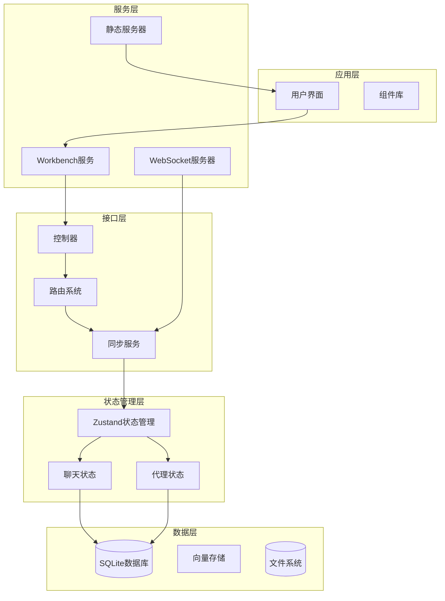
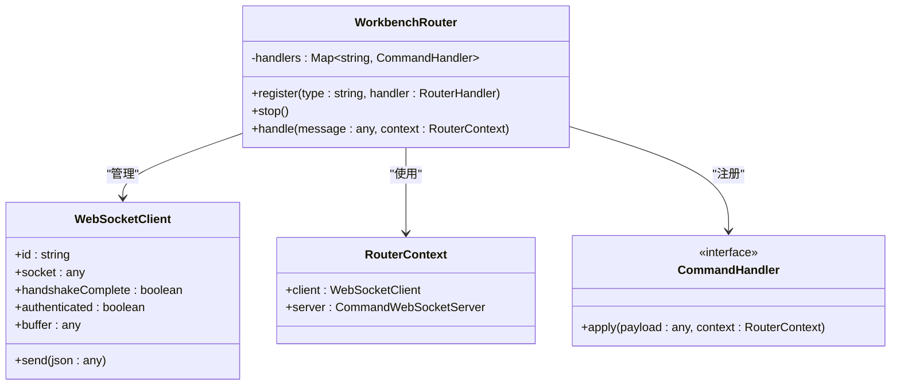
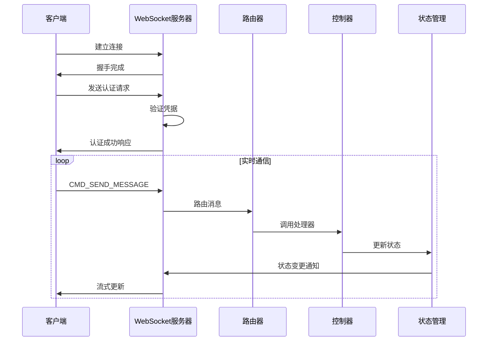
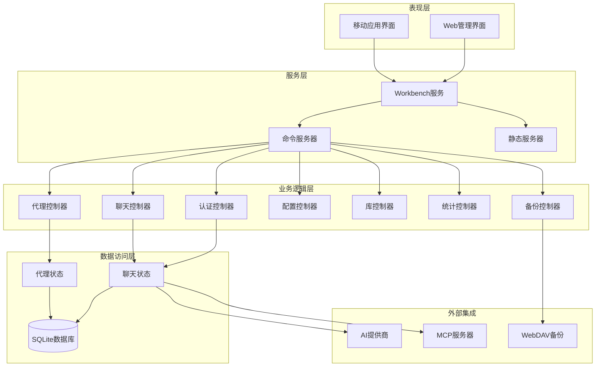
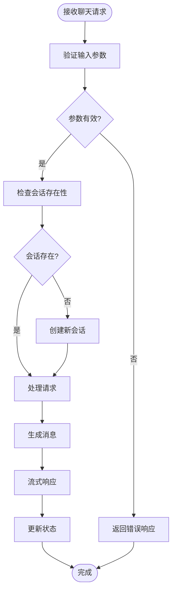
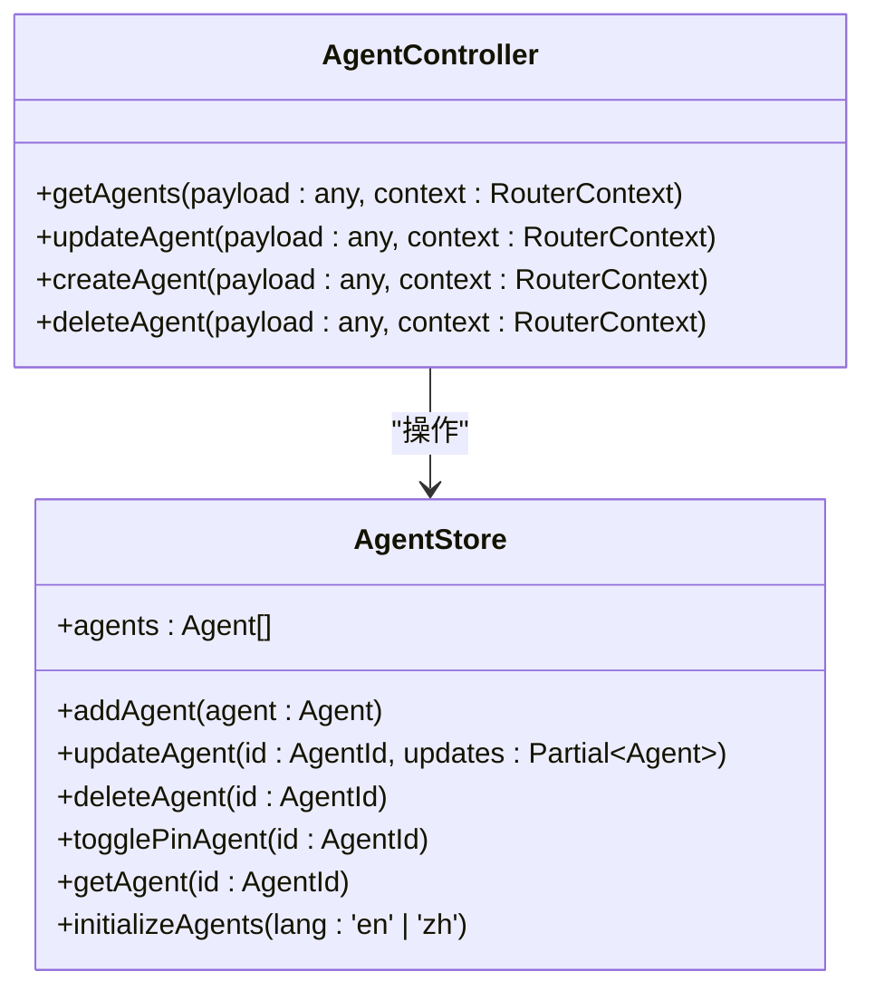
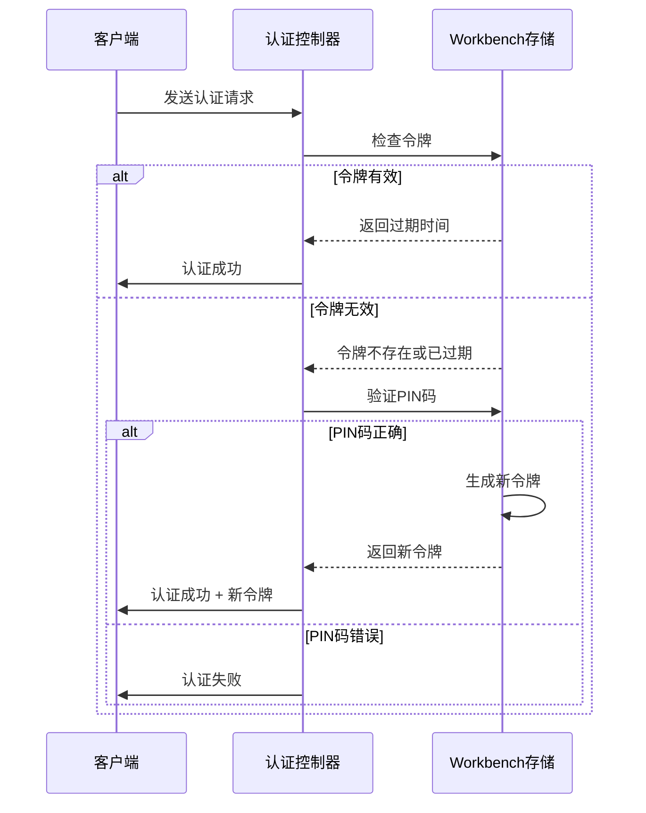
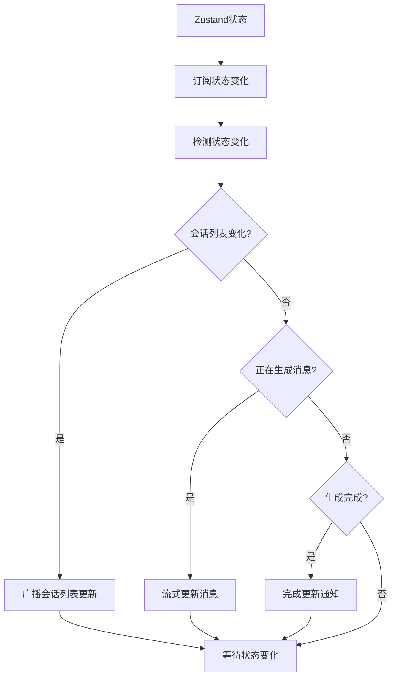

# 核心接口

<cite>
**本文档引用的文件**
- [README.md](file://README.md)
- [WorkbenchRouter.ts](file://src/services/workbench/WorkbenchRouter.ts)
- [CommandWebSocketServer.ts](file://src/services/workbench/CommandWebSocketServer.ts)
- [AuthController.ts](file://src/services/workbench/controllers/AuthController.ts)
- [AgentController.ts](file://src/services/workbench/controllers/AgentController.ts)
- [ChatController.ts](file://src/services/workbench/controllers/ChatController.ts)
- [StoreSyncService.ts](file://src/services/workbench/StoreSyncService.ts)
- [StaticServerService.ts](file://src/services/workbench/StaticServerService.ts)
- [chat-store.ts](file://src/store/chat-store.ts)
- [chat/index.ts](file://src/store/chat/index.ts)
- [agent-store.ts](file://src/store/agent-store.ts)
- [chat/session-manager.ts](file://src/store/chat/session-manager.ts)
- [chat/message-manager.ts](file://src/store/chat/message-manager.ts)
- [chat.ts](file://src/types/chat.ts)
- [api-types.ts](file://src/store/api-types.ts)
- [agent-presets.ts](file://src/lib/agent-presets.ts)
- [package.json](file://package.json)
</cite>

## 目录
1. [简介](#简介)
2. [项目结构](#项目结构)
3. [核心组件](#核心组件)
4. [架构概览](#架构概览)
5. [详细组件分析](#详细组件分析)
6. [依赖关系分析](#依赖关系分析)
7. [性能考量](#性能考量)
8. [故障排除指南](#故障排除指南)
9. [结论](#结论)

## 简介

Nexara 是一个专注于本地优先数据管理和多提供商模型访问的 Android AI 助手客户端。该项目的核心特点包括：

- **多提供商聊天**：支持 OpenAI、Anthropic、Gemini、Vertex AI、DeepSeek、Moonshot、智谱、SiliconFlow、GitHub Copilot、Cloudflare 等 12+ 云 AI 提供商
- **RAG 知识引擎**：基于 SQLite + FTS5 的内置向量存储，支持文档导入、分块向量化和上下文检索
- **代理系统**：预设代理和自定义代理创建，支持配置化系统提示词和模型绑定
- **MCP 协议**：通过 SSE 或 HTTP 传输连接外部 MCP 服务器
- **本地推理**：通过 llama.rn 在设备端运行 GGUF 模型
- **Workbench 实验性功能**：内置 WebSocket 和静态文件服务器，支持配套 Web 管理面板

## 项目结构

项目采用模块化架构，主要分为以下几个核心层次：



**图表来源**
- [WorkbenchRouter.ts:18-75](file://src/services/workbench/WorkbenchRouter.ts#L18-L75)
- [CommandWebSocketServer.ts:33-178](file://src/services/workbench/CommandWebSocketServer.ts#L33-L178)
- [chat-store.ts:212-210](file://src/store/chat-store.ts#L212-L210)

**章节来源**
- [README.md:1-161](file://README.md#L1-L161)
- [package.json:1-120](file://package.json#L1-L120)

## 核心组件

### Workbench 路由系统

Workbench 路由系统是整个 Web 管理面板的核心通信基础设施：



**图表来源**
- [WorkbenchRouter.ts:1-75](file://src/services/workbench/WorkbenchRouter.ts#L1-L75)

### WebSocket 服务器

WebSocket 服务器提供实时双向通信能力：



**图表来源**
- [CommandWebSocketServer.ts:134-178](file://src/services/workbench/CommandWebSocketServer.ts#L134-L178)
- [AuthController.ts:17-55](file://src/services/workbench/controllers/AuthController.ts#L17-L55)

**章节来源**
- [WorkbenchRouter.ts:18-75](file://src/services/workbench/WorkbenchRouter.ts#L18-L75)
- [CommandWebSocketServer.ts:33-178](file://src/services/workbench/CommandWebSocketServer.ts#L33-L178)

## 架构概览

Nexara 采用分层架构设计，确保了良好的可维护性和扩展性：



**图表来源**
- [CommandWebSocketServer.ts:134-167](file://src/services/workbench/CommandWebSocketServer.ts#L134-L167)
- [StoreSyncService.ts:5-127](file://src/services/workbench/StoreSyncService.ts#L5-L127)

## 详细组件分析

### 聊天控制器 (ChatController)

聊天控制器负责处理所有聊天相关的业务逻辑：



**图表来源**
- [ChatController.ts:75-128](file://src/services/workbench/controllers/ChatController.ts#L75-L128)

聊天控制器的主要功能包括：
- 会话管理：创建、删除、获取会话
- 消息处理：发送、删除、重新生成消息
- 生成控制：中止生成、删除消息
- 会话操作：创建会话、删除会话、获取历史

**章节来源**
- [ChatController.ts:1-130](file://src/services/workbench/controllers/ChatController.ts#L1-L130)

### 代理控制器 (AgentController)

代理控制器管理代理的生命周期：



**图表来源**
- [AgentController.ts:4-48](file://src/services/workbench/controllers/AgentController.ts#L4-L48)
- [agent-store.ts:7-77](file://src/store/agent-store.ts#L7-L77)

**章节来源**
- [AgentController.ts:1-48](file://src/services/workbench/controllers/AgentController.ts#L1-L48)
- [agent-store.ts:1-77](file://src/store/agent-store.ts#L1-L77)

### 认证控制器 (AuthController)

认证控制器处理用户身份验证：



**图表来源**
- [AuthController.ts:17-55](file://src/services/workbench/controllers/AuthController.ts#L17-L55)

**章节来源**
- [AuthController.ts:1-55](file://src/services/workbench/controllers/AuthController.ts#L1-L55)

### 状态同步服务 (StoreSyncService)

状态同步服务负责将应用状态变化实时同步到 Web 管理面板：



**图表来源**
- [StoreSyncService.ts:34-123](file://src/services/workbench/StoreSyncService.ts#L34-L123)

**章节来源**
- [StoreSyncService.ts:1-127](file://src/services/workbench/StoreSyncService.ts#L1-L127)

## 依赖关系分析

项目的核心依赖关系如下：

```mermaid
graph TB
subgraph "核心依赖"
Zustand[zustand - 状态管理]
Expo[expo - 跨平台框架]
RN[react-native - 移动端框架]
TS[typescript - 类型系统]
end
subgraph "数据库相关"
OpSQLite[@op-engineering/op-sqlite - SQLite驱动]
FileSystem[expo-file-system - 文件系统]
end
subgraph "网络相关"
TCP[tcp-socket - TCP套接字]
SSE[react-native-sse - 服务器推送事件]
Buffer[buffer - 缓冲区处理]
end
subgraph "AI相关"
LlamaRN[llama.rn - 本地推理]
Zod[zod - 数据验证]
end
subgraph "UI相关"
NativeWind[nativewind - 样式系统]
Reanimated[react-native-reanimated - 动画]
Skia[@shopify/react-native-skia - 图形]
end
Zustand --> Expo
Expo --> RN
RN --> NativeWind
RN --> Reanimated
RN --> Skia
OpSQLite --> FileSystem
TCP --> Buffer
LlamaRN --> RN
Zod --> TS
```

**图表来源**
- [package.json:14-95](file://package.json#L14-L95)

**章节来源**
- [package.json:1-120](file://package.json#L1-L120)

## 性能考量

### 状态管理优化

项目采用了多种性能优化策略：

1. **分层状态管理**：使用 Zustand 进行轻量级状态管理，避免不必要的重渲染
2. **防抖机制**：消息管理器实现了 500ms 的防抖机制，减少数据库写入频率
3. **增量更新**：只更新发生变化的状态部分，而非整个状态树
4. **内存优化**：会话数据采用按需加载策略，避免一次性加载大量历史消息

### 网络通信优化

1. **流式传输**：WebSocket 实现了流式消息传输，提升用户体验
2. **心跳机制**：30秒的心跳检测确保连接稳定性
3. **批量处理**：状态同步服务采用批量广播机制，减少网络开销

### 数据库优化

1. **双写模式**：同时写入内存和数据库，确保数据一致性
2. **索引优化**：SQLite 数据库使用适当的索引提高查询性能
3. **事务处理**：重要操作使用事务确保数据完整性

## 故障排除指南

### WebSocket 连接问题

常见问题及解决方案：

1. **连接失败**
   - 检查端口占用情况（3001端口）
   - 确认防火墙设置允许连接
   - 验证网络连通性

2. **认证失败**
   - 确认访问码或令牌的有效性
   - 检查令牌过期时间（24小时）
   - 验证客户端握手过程

3. **消息丢失**
   - 检查流式传输是否正常
   - 确认客户端心跳机制
   - 验证状态同步服务运行状态

### 状态同步问题

1. **状态不同步**
   - 检查 Zustand 订阅机制
   - 验证状态变更检测逻辑
   - 确认广播机制正常工作

2. **内存泄漏**
   - 检查状态订阅的正确注销
   - 验证定时器的清理
   - 确认事件监听器的移除

### 数据库问题

1. **数据不一致**
   - 检查双写模式的执行顺序
   - 验证事务的正确使用
   - 确认异常处理机制

2. **性能问题**
   - 分析查询执行计划
   - 检查索引使用情况
   - 优化批量操作

**章节来源**
- [CommandWebSocketServer.ts:471-484](file://src/services/workbench/CommandWebSocketServer.ts#L471-L484)
- [StoreSyncService.ts:26-32](file://src/services/workbench/StoreSyncService.ts#L26-L32)

## 结论

Nexara 项目展现了现代移动端 AI 应用的优秀架构设计。通过模块化的设计、清晰的分层架构和完善的性能优化策略，项目实现了：

1. **高可用性**：通过多重认证机制和错误处理确保系统稳定性
2. **高性能**：采用状态管理优化、流式传输和数据库优化提升整体性能
3. **可扩展性**：模块化设计和接口抽象为未来的功能扩展奠定了基础
4. **易维护性**：清晰的代码结构和完善的文档便于团队协作和长期维护

项目的 Workbench 功能为用户提供了强大的远程管理能力，结合本地推理和多提供商支持，为用户创造了完整的 AI 助手体验。随着项目的持续发展，这些核心接口将继续发挥重要作用，支撑更多创新功能的实现。