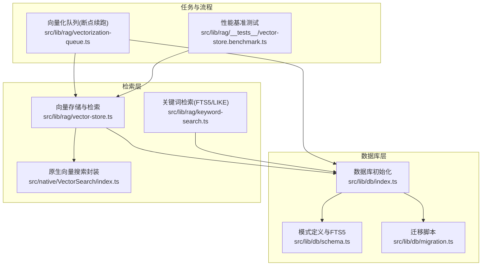
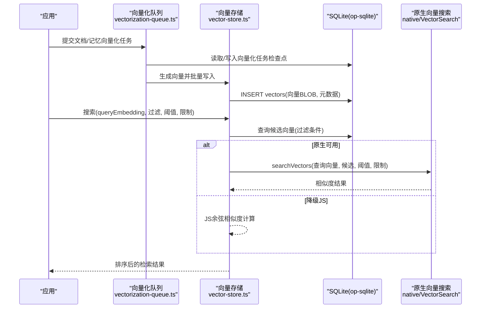
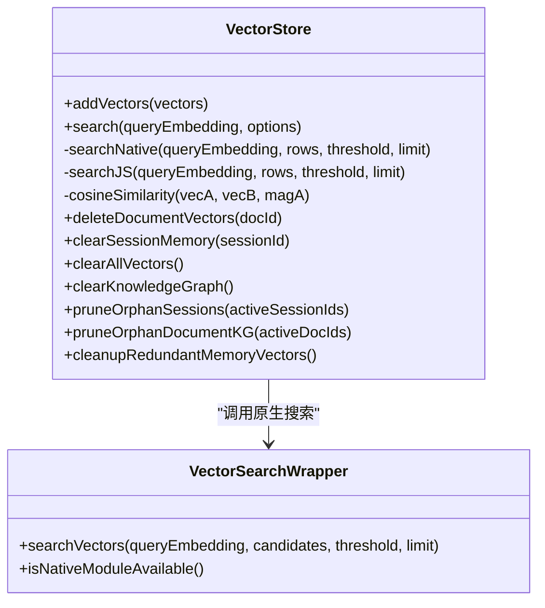
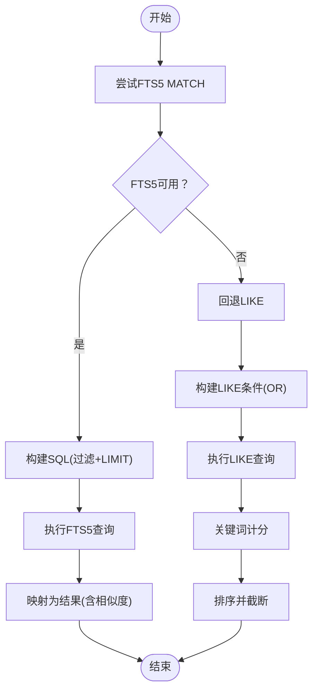
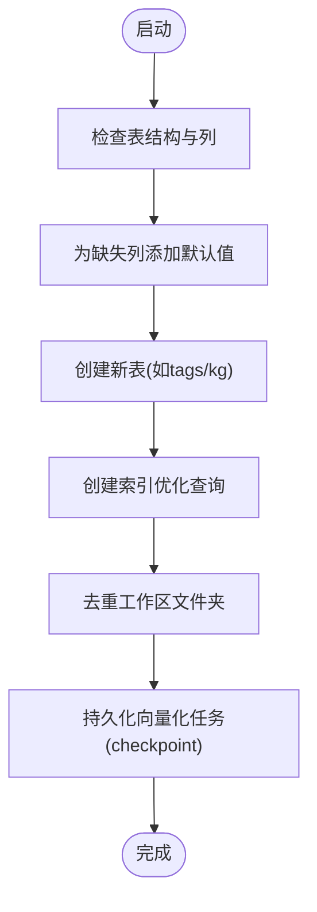
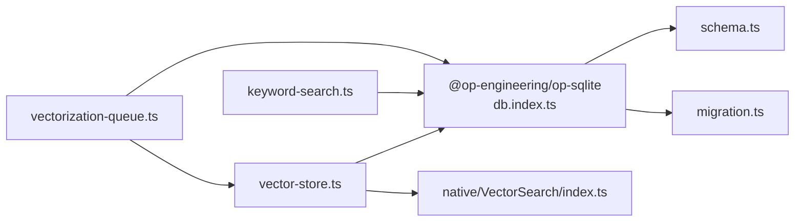

# 数据存储架构

<cite>
**本文引用的文件**
- [src/lib/db/index.ts](file://src/lib/db/index.ts)
- [src/lib/db/schema.ts](file://src/lib/db/schema.ts)
- [src/lib/db/migration.ts](file://src/lib/db/migration.ts)
- [src/lib/rag/vector-store.ts](file://src/lib/rag/vector-store.ts)
- [src/lib/rag/keyword-search.ts](file://src/lib/rag/keyword-search.ts)
- [src/lib/rag/vectorization-queue.ts](file://src/lib/rag/vectorization-queue.ts)
- [src/native/VectorSearch/index.ts](file://src/native/VectorSearch/index.ts)
- [src/lib/rag/__tests__/vector-store.benchmark.ts](file://src/lib/rag/__tests__/vector-store.benchmark.ts)
</cite>

## 目录
1. [简介](#简介)
2. [项目结构](#项目结构)
3. [核心组件](#核心组件)
4. [架构总览](#架构总览)
5. [详细组件分析](#详细组件分析)
6. [依赖关系分析](#依赖关系分析)
7. [性能考量](#性能考量)
8. [故障排查指南](#故障排查指南)
9. [结论](#结论)
10. [附录](#附录)

## 简介
本文件面向Nexara项目的数据库与向量检索子系统，围绕基于@op-engineering/op-sqlite的SQLite数据库架构展开，系统阐述以下主题：
- 数据库模式设计：表结构、索引策略、约束关系
- 向量存储实现：嵌入向量的存储、相似度计算、检索算法
- 数据迁移策略与版本管理：如何安全地处理schema变更与数据升级
- 内存管理与RAG流程：向量化处理、缓存策略、性能优化
- 数据库操作最佳实践：事务处理、并发控制、错误处理
- 具体SQL查询示例与性能调优建议

## 项目结构
数据库相关代码主要分布在如下位置：
- 数据库初始化与基础配置：src/lib/db/index.ts
- 数据库模式定义与FTS5虚拟表：src/lib/db/schema.ts
- 数据库迁移脚本：src/lib/db/migration.ts
- 向量存储与检索：src/lib/rag/vector-store.ts
- 关键词检索（FTS5/LIKE回退）：src/lib/rag/keyword-search.ts
- 向量化任务队列与断点续跑：src/lib/rag/vectorization-queue.ts
- 原生向量搜索封装：src/native/VectorSearch/index.ts
- 性能基准测试：src/lib/rag/__tests__/vector-store.benchmark.ts

图表来源
- [src/lib/db/index.ts:1-13](file://src/lib/db/index.ts#L1-L13)
- [src/lib/db/schema.ts:1-362](file://src/lib/db/schema.ts#L1-L362)
- [src/lib/db/migration.ts:1-354](file://src/lib/db/migration.ts#L1-L354)
- [src/lib/rag/vector-store.ts:1-376](file://src/lib/rag/vector-store.ts#L1-L376)
- [src/lib/rag/keyword-search.ts:1-204](file://src/lib/rag/keyword-search.ts#L1-L204)
- [src/native/VectorSearch/index.ts:1-53](file://src/native/VectorSearch/index.ts#L1-L53)
- [src/lib/rag/vectorization-queue.ts:1-804](file://src/lib/rag/vectorization-queue.ts#L1-L804)
- [src/lib/rag/__tests__/vector-store.benchmark.ts:44-77](file://src/lib/rag/__tests__/vector-store.benchmark.ts#L44-L77)

章节来源
- [src/lib/db/index.ts:1-13](file://src/lib/db/index.ts#L1-L13)
- [src/lib/db/schema.ts:1-362](file://src/lib/db/schema.ts#L1-L362)
- [src/lib/db/migration.ts:1-354](file://src/lib/db/migration.ts#L1-L354)
- [src/lib/rag/vector-store.ts:1-376](file://src/lib/rag/vector-store.ts#L1-L376)
- [src/lib/rag/keyword-search.ts:1-204](file://src/lib/rag/keyword-search.ts#L1-L204)
- [src/native/VectorSearch/index.ts:1-53](file://src/native/VectorSearch/index.ts#L1-L53)
- [src/lib/rag/vectorization-queue.ts:1-804](file://src/lib/rag/vectorization-queue.ts#L1-L804)
- [src/lib/rag/__tests__/vector-store.benchmark.ts:44-77](file://src/lib/rag/__tests__/vector-store.benchmark.ts#L44-L77)

## 核心组件
- 数据库初始化与WAL模式：通过op-sqlite打开数据库，启用WAL与外键约束，提升并发与一致性。
- 模式定义与FTS5：统一创建会话、消息、附件、文件夹、文档、向量、上下文摘要、标签、知识图谱、向量化任务、审计日志、工件等表，并在支持FTS5时创建虚拟表与触发器。
- 迁移脚本：安全地为既有表增加列、补全缺失字段、创建新表、去重与清理、索引优化等。
- 向量存储与检索：以BLOB存储浮点向量，支持原生模块加速与JS降级实现，提供过滤、阈值、限制等检索能力。
- 关键词检索：优先FTS5 MATCH，不可用时回退LIKE，带性能优化（截断长查询）。
- 向量化队列：串行处理文档与记忆向量化，断点续跑、心跳检测、重试与进度上报。
- 原生向量搜索封装：对原生模块进行薄封装，提供查询、候选集、阈值与限制参数。

章节来源
- [src/lib/db/index.ts:1-13](file://src/lib/db/index.ts#L1-L13)
- [src/lib/db/schema.ts:1-362](file://src/lib/db/schema.ts#L1-L362)
- [src/lib/db/migration.ts:1-354](file://src/lib/db/migration.ts#L1-L354)
- [src/lib/rag/vector-store.ts:1-376](file://src/lib/rag/vector-store.ts#L1-L376)
- [src/lib/rag/keyword-search.ts:1-204](file://src/lib/rag/keyword-search.ts#L1-L204)
- [src/lib/rag/vectorization-queue.ts:1-804](file://src/lib/rag/vectorization-queue.ts#L1-L804)
- [src/native/VectorSearch/index.ts:1-53](file://src/native/VectorSearch/index.ts#L1-L53)

## 架构总览
下图展示数据库、向量检索与任务队列之间的交互关系：

图表来源
- [src/lib/rag/vectorization-queue.ts:1-804](file://src/lib/rag/vectorization-queue.ts#L1-L804)
- [src/lib/rag/vector-store.ts:1-376](file://src/lib/rag/vector-store.ts#L1-L376)
- [src/native/VectorSearch/index.ts:1-53](file://src/native/VectorSearch/index.ts#L1-L53)
- [src/lib/db/index.ts:1-13](file://src/lib/db/index.ts#L1-L13)

## 详细组件分析

### 数据库模式设计
- 会话与消息：sessions与messages表，外键CASCADE删除消息；为消息建立复合索引以支持会话与时间排序查询。
- 附件与文件：attachments表，引用消息。
- 知识库组织：folders表支持层级结构，文档documents通过folder_id关联。
- 文档与向量：documents记录向量化状态与计数；vectors表以BLOB存储向量，metadata存储来源与类型等信息，支持按文档与会话过滤。
- 上下文摘要：context_summaries记录会话范围内的摘要，便于成本控制与检索优化。
- 标签系统：tags与document_tags多对多关联，支持智能分类。
- 知识图谱：kg_nodes与kg_edges，支持会话/代理作用域与去重。
- 向量化任务：vectorization_tasks持久化任务状态、断点索引、进度与错误信息。
- 审计日志：audit_logs记录操作、资源路径、会话/代理/技能等上下文。
- 工件：artifacts记录工作流产物，支持会话与类型索引。
- FTS5全文索引：vectors_fts虚拟表与触发器，支持快速关键词检索，不可用时回退LIKE。

章节来源
- [src/lib/db/schema.ts:1-362](file://src/lib/db/schema.ts#L1-L362)

### 向量存储实现机制
- 存储格式：向量以Float32数组二进制(BLOB)形式存储，便于高效序列化与原生处理。
- 相似度计算：优先使用原生模块searchVectors，否则在JS侧实现余弦相似度计算；对维度不一致进行告警与降级提示。
- 检索算法：支持按文档ID、会话ID、类型过滤；默认阈值与限制；原生路径返回候选ID与相似度，JS路径补充排序与截断。
- 清理策略：按文档/会话/全局清理向量；清理知识图谱孤立节点与边；清理冗余记忆向量。

图表来源
- [src/lib/rag/vector-store.ts:1-376](file://src/lib/rag/vector-store.ts#L1-L376)
- [src/native/VectorSearch/index.ts:1-53](file://src/native/VectorSearch/index.ts#L1-L53)

章节来源
- [src/lib/rag/vector-store.ts:1-376](file://src/lib/rag/vector-store.ts#L1-L376)
- [src/native/VectorSearch/index.ts:1-53](file://src/native/VectorSearch/index.ts#L1-L53)

### 关键词检索（FTS5/LIKE）
- 优先FTS5：使用MATCH进行分词与rank排序，支持会话与文档过滤；对超长查询进行截断以避免性能问题。
- 回退LIKE：当FTS5不可用时，按空格分词，构建LIKE OR条件，统计关键词命中次数作为相似度评分并排序。
- 性能优化：限制查询长度、合理使用索引与条件拼接。

图表来源
- [src/lib/rag/keyword-search.ts:1-204](file://src/lib/rag/keyword-search.ts#L1-L204)

章节来源
- [src/lib/rag/keyword-search.ts:1-204](file://src/lib/rag/keyword-search.ts#L1-L204)

### 数据迁移策略与版本管理
- 增量迁移：针对documents新增列（folder_id、vectorized、vector_count、file_size、content_hash、kg_processed_hash、thumbnail_path等）、为vectors新增start/end消息ID、为messages与sessions补齐缺失JSON字段。
- 新表创建：tags、document_tags、kg_nodes、kg_edges、vectorization_tasks、audit_logs、artifacts等。
- 索引优化：为folders、documents、vectorization_tasks、audit_logs、artifacts等建立必要索引。
- 去重与清理：工作区文件夹去重，减少冗余与提升查询效率。
- 断点续跑：vectorization_tasks持久化任务状态，支持心跳检测与恢复。

图表来源
- [src/lib/db/migration.ts:1-354](file://src/lib/db/migration.ts#L1-L354)

章节来源
- [src/lib/db/migration.ts:1-354](file://src/lib/db/migration.ts#L1-L354)

### 内存管理与RAG流程
- 向量化队列：串行处理，避免并发资源竞争；支持本地/云端模型切换；批量大小按模型类型调整；断点续跑与心跳检测；重试策略与友好错误提示。
- 记忆归档：将用户与AI对话片段切分为块，向量化后写入vectors，携带消息ID范围，便于精确清理。
- 成本控制：通过context_summaries与向量清理策略降低检索成本；对知识图谱抽取采用不同策略（全量/摘要优先/按需）。
- 原生加速：在可用时调用原生searchVectors，显著降低JS侧计算开销。

章节来源
- [src/lib/rag/vectorization-queue.ts:1-804](file://src/lib/rag/vectorization-queue.ts#L1-L804)
- [src/lib/rag/vector-store.ts:1-376](file://src/lib/rag/vector-store.ts#L1-L376)
- [src/native/VectorSearch/index.ts:1-53](file://src/native/VectorSearch/index.ts#L1-L53)

### 数据库操作最佳实践
- 事务处理：向量批量写入使用显式事务，失败回滚，保证一致性。
- 并发控制：WAL模式提升并发读写；外键约束确保参照完整性。
- 错误处理：向量检索对维度不一致进行告警与降级提示；关键词检索对FTS5不可用进行回退；队列对网络/服务端错误进行指数退避重试。
- 索引策略：为高频过滤字段（会话ID、文档ID、状态、时间戳）建立索引，减少全表扫描。
- 清理策略：定期清理孤儿会话/文档相关的向量与知识图谱节点/边，保持数据库整洁。

章节来源
- [src/lib/db/index.ts:1-13](file://src/lib/db/index.ts#L1-L13)
- [src/lib/rag/vector-store.ts:1-376](file://src/lib/rag/vector-store.ts#L1-L376)
- [src/lib/rag/keyword-search.ts:1-204](file://src/lib/rag/keyword-search.ts#L1-L204)
- [src/lib/rag/vectorization-queue.ts:1-804](file://src/lib/rag/vectorization-queue.ts#L1-L804)

## 依赖关系分析
- 组件耦合：VectorStore依赖db与原生模块；KeywordSearch依赖db；VectorizationQueue依赖db、VectorStore与EmbeddingClient；Native封装提供跨平台加速。
- 外部依赖：@op-engineering/op-sqlite提供SQLite访问；React Native原生模块提供向量搜索加速。
- 循环依赖：当前文件间无明显循环依赖，职责清晰分离。

图表来源
- [src/lib/db/index.ts:1-13](file://src/lib/db/index.ts#L1-L13)
- [src/lib/db/schema.ts:1-362](file://src/lib/db/schema.ts#L1-L362)
- [src/lib/db/migration.ts:1-354](file://src/lib/db/migration.ts#L1-L354)
- [src/lib/rag/vector-store.ts:1-376](file://src/lib/rag/vector-store.ts#L1-L376)
- [src/lib/rag/keyword-search.ts:1-204](file://src/lib/rag/keyword-search.ts#L1-L204)
- [src/lib/rag/vectorization-queue.ts:1-804](file://src/lib/rag/vectorization-queue.ts#L1-L804)
- [src/native/VectorSearch/index.ts:1-53](file://src/native/VectorSearch/index.ts#L1-L53)

章节来源
- [src/lib/db/index.ts:1-13](file://src/lib/db/index.ts#L1-L13)
- [src/lib/db/schema.ts:1-362](file://src/lib/db/schema.ts#L1-L362)
- [src/lib/db/migration.ts:1-354](file://src/lib/db/migration.ts#L1-L354)
- [src/lib/rag/vector-store.ts:1-376](file://src/lib/rag/vector-store.ts#L1-L376)
- [src/lib/rag/keyword-search.ts:1-204](file://src/lib/rag/keyword-search.ts#L1-L204)
- [src/lib/rag/vectorization-queue.ts:1-804](file://src/lib/rag/vectorization-queue.ts#L1-L804)
- [src/native/VectorSearch/index.ts:1-53](file://src/native/VectorSearch/index.ts#L1-L53)

## 性能考量
- 原生加速：在可用时调用原生searchVectors，显著降低JS侧计算开销；基准测试显示平均搜索时间应控制在合理范围内。
- FTS5优化：优先使用FTS5 MATCH，避免LIKE对超长查询的性能问题；对长查询进行截断。
- 索引优化：为会话ID、文档ID、状态、时间戳建立索引，减少全表扫描。
- 批量写入：向量批量插入使用事务，减少磁盘写入次数。
- 断点续跑：vectorization_tasks持久化任务状态，避免重复计算。
- 清理策略：定期清理孤儿数据与冗余向量，维持查询性能。

章节来源
- [src/lib/rag/__tests__/vector-store.benchmark.ts:44-77](file://src/lib/rag/__tests__/vector-store.benchmark.ts#L44-L77)
- [src/lib/rag/keyword-search.ts:1-204](file://src/lib/rag/keyword-search.ts#L1-L204)
- [src/lib/rag/vector-store.ts:1-376](file://src/lib/rag/vector-store.ts#L1-L376)
- [src/lib/rag/vectorization-queue.ts:1-804](file://src/lib/rag/vectorization-queue.ts#L1-L804)

## 故障排查指南
- 向量维度不匹配：JS侧对维度不一致进行告警与降级提示，建议检查嵌入模型维度一致性。
- FTS5不可用：自动回退LIKE，建议在构建配置中启用FTS5扩展以获得更好性能。
- 网络/服务端错误：向量化队列对可重试错误进行指数退避重试，建议检查API密钥、配额与网络连通性。
- 任务中断：通过vectorization_tasks的心跳检测与恢复逻辑，自动标记并恢复中断任务。
- 清理失败：对清理操作进行异常捕获与日志记录，必要时手动执行清理SQL。

章节来源
- [src/lib/rag/vector-store.ts:1-376](file://src/lib/rag/vector-store.ts#L1-L376)
- [src/lib/rag/keyword-search.ts:1-204](file://src/lib/rag/keyword-search.ts#L1-L204)
- [src/lib/rag/vectorization-queue.ts:1-804](file://src/lib/rag/vectorization-queue.ts#L1-L804)

## 结论
Nexara的数据存储架构以SQLite为核心，结合FTS5与原生向量搜索，实现了高性能、可扩展、可维护的知识检索体系。通过完善的迁移脚本、断点续跑与清理策略，系统在功能演进与性能优化之间取得了良好平衡。建议在生产环境中持续关注FTS5可用性、原生模块稳定性与索引维护，以确保检索性能与数据一致性。

## 附录
- 典型SQL示例（路径引用）
  - 创建向量表与触发器：[src/lib/db/schema.ts:186-216](file://src/lib/db/schema.ts#L186-L216)
  - 向量批量插入（事务）：[src/lib/rag/vector-store.ts:31-60](file://src/lib/rag/vector-store.ts#L31-L60)
  - 向量检索（过滤+阈值+限制）：[src/lib/rag/vector-store.ts:62-113](file://src/lib/rag/vector-store.ts#L62-L113)
  - 关键词检索（FTS5 MATCH）：[src/lib/rag/keyword-search.ts:33-74](file://src/lib/rag/keyword-search.ts#L33-L74)
  - 关键词检索（LIKE回退）：[src/lib/rag/keyword-search.ts:110-197](file://src/lib/rag/keyword-search.ts#L110-L197)
  - 向量化任务持久化（checkpoint）：[src/lib/rag/vectorization-queue.ts:654-685](file://src/lib/rag/vectorization-queue.ts#L654-L685)
  - 加载中断任务并恢复：[src/lib/rag/vectorization-queue.ts:716-767](file://src/lib/rag/vectorization-queue.ts#L716-L767)
  - 清理冗余记忆向量：[src/lib/rag/vector-store.ts:326-372](file://src/lib/rag/vector-store.ts#L326-L372)