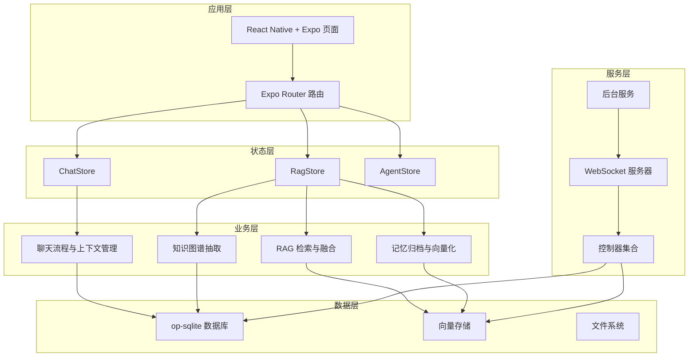
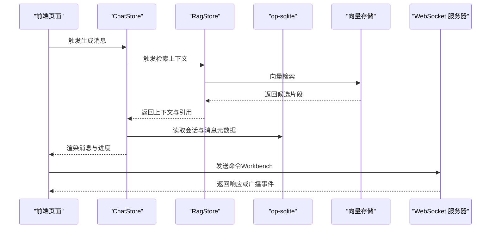
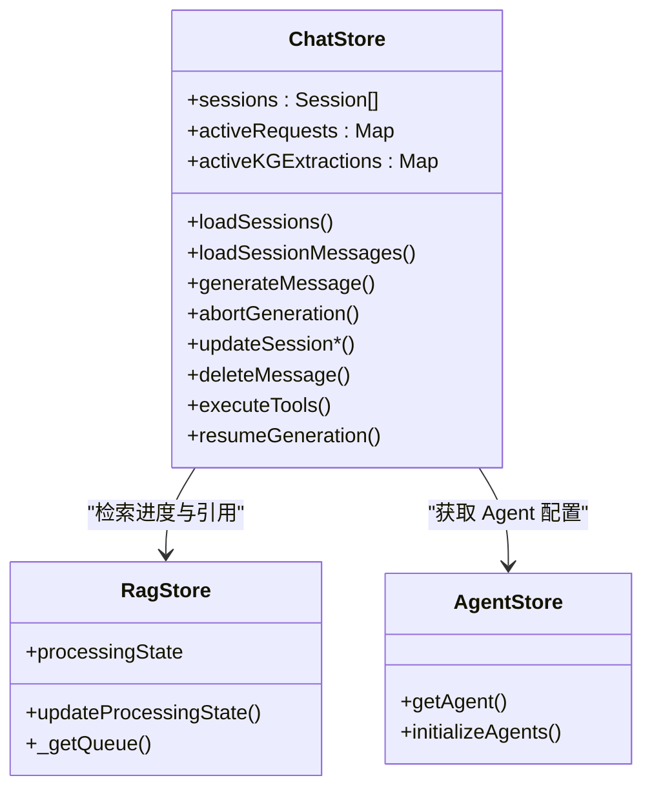
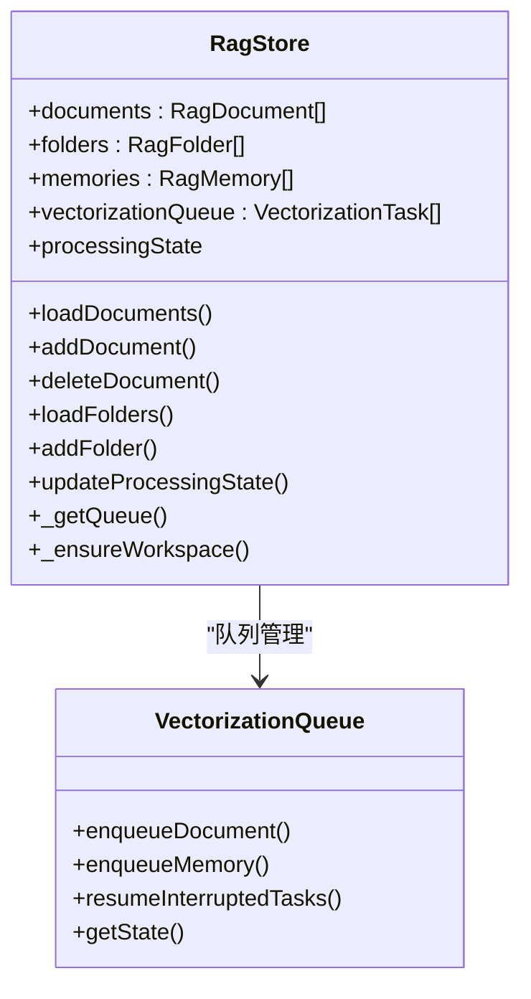
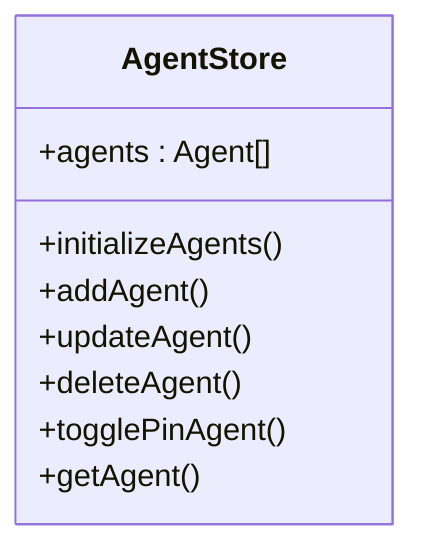
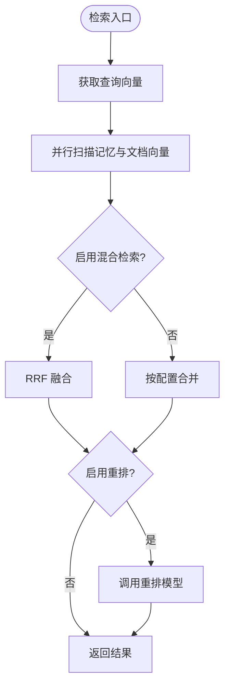
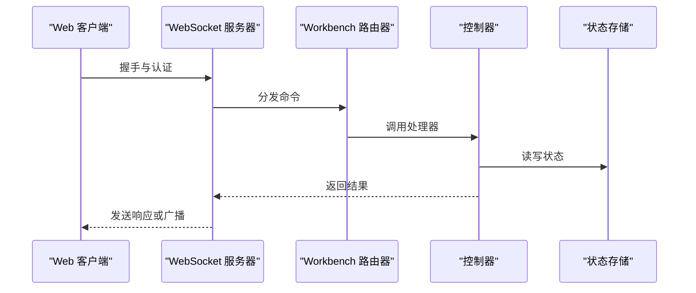
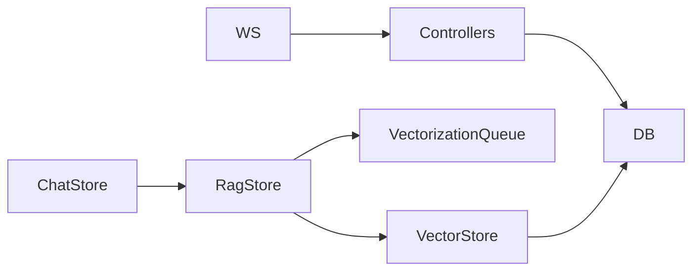

# 整体架构设计

<cite>
**本文档引用的文件**
- [README.md](file://README.md)
- [package.json](file://package.json)
- [app/_layout.tsx](file://app/_layout.tsx)
- [src/store/chat-store.ts](file://src/store/chat-store.ts)
- [src/store/rag-store.ts](file://src/store/rag-store.ts)
- [src/store/agent-store.ts](file://src/store/agent-store.ts)
- [src/lib/db/index.ts](file://src/lib/db/index.ts)
- [src/services/workbench/WorkbenchRouter.ts](file://src/services/workbench/WorkbenchRouter.ts)
- [src/services/BackgroundService.ts](file://src/services/BackgroundService.ts)
- [src/features/chat/utils/ContextManager.ts](file://src/features/chat/utils/ContextManager.ts)
- [src/lib/rag/memory-manager.ts](file://src/lib/rag/memory-manager.ts)
- [src/lib/llm/factory.ts](file://src/lib/llm/factory.ts)
- [src/services/workbench/CommandWebSocketServer.ts](file://src/services/workbench/CommandWebSocketServer.ts)
- [src/lib/rag/vector-store.ts](file://src/lib/rag/vector-store.ts)
- [src/lib/rag/vectorization-queue.ts](file://src/lib/rag/vectorization-queue.ts)
</cite>

## 目录
1. [简介](#简介)
2. [项目结构](#项目结构)
3. [核心组件](#核心组件)
4. [架构总览](#架构总览)
5. [详细组件分析](#详细组件分析)
6. [依赖分析](#依赖分析)
7. [性能考量](#性能考量)
8. [故障排查指南](#故障排查指南)
9. [结论](#结论)
10. [附录](#附录)

## 简介
Nexara 是一个面向 Android 的 AI 助手客户端，采用本地优先的数据管理策略，结合多提供商模型访问能力，实现对话、RAG 知识引擎、Agent 系统、MCP 协议桥接、本地推理与 Workbench 管理面板等核心能力。系统以 React Native + Expo 架构为基础，通过 Zustand 管理前端状态，使用 op-sqlite 提供 SQLite + FTS5 + 向量 BLOB 的本地数据库能力，并通过 WebSocket 与配套 Web 管理面板进行双向通信。

## 项目结构
项目采用按功能域划分的模块化组织方式，主要分为以下层次：
- 应用入口与路由层：Expo Router 驱动的页面布局与导航
- 状态管理层：Zustand Store（ChatStore、RagStore、AgentStore 等）
- 业务逻辑层：聊天、RAG、向量化、嵌入、重排、知识图谱等子模块
- 服务层：WebSocket 服务器、后台服务、控制器等
- 数据层：op-sqlite 数据库、向量存储、文件系统

**图表来源**
- [app/_layout.tsx:82-191](file://app/_layout.tsx#L82-L191)
- [src/store/chat-store.ts:212-360](file://src/store/chat-store.ts#L212-L360)
- [src/store/rag-store.ts:147-145](file://src/store/rag-store.ts#L147-L145)
- [src/store/agent-store.ts:17-77](file://src/store/agent-store.ts#L17-L77)
- [src/lib/db/index.ts:1-13](file://src/lib/db/index.ts#L1-L13)
- [src/services/workbench/CommandWebSocketServer.ts:33-178](file://src/services/workbench/CommandWebSocketServer.ts#L33-L178)

**章节来源**
- [README.md:1-161](file://README.md#L1-L161)
- [package.json:1-120](file://package.json#L1-L120)
- [app/_layout.tsx:82-191](file://app/_layout.tsx#L82-L191)

## 核心组件
- ChatStore：负责会话、消息、生成流程、工具执行、审批与循环控制等状态管理；与数据库、LLM 客户端、RAG 检索、技能系统协作。
- RagStore：负责文档、文件夹、标签、向量化队列、处理状态、知识图谱累积等；与向量存储、文件系统、嵌入与重排服务协作。
- AgentStore：负责 Agent 的初始化、增删改查与固定状态；与预设 Agent 数据与持久化存储协作。
- 数据库层：op-sqlite 提供 SQLite + FTS5 + 向量 BLOB 存储，支持事务、WAL 模式与全文检索。
- 服务层：WebSocket 服务器与路由器、后台服务、控制器集合，支撑 Workbench 管理面板与跨进程通信。

**章节来源**
- [src/store/chat-store.ts:108-210](file://src/store/chat-store.ts#L108-L210)
- [src/store/rag-store.ts:24-145](file://src/store/rag-store.ts#L24-L145)
- [src/store/agent-store.ts:7-16](file://src/store/agent-store.ts#L7-L16)
- [src/lib/db/index.ts:1-13](file://src/lib/db/index.ts#L1-L13)

## 架构总览
系统采用分层架构，前端通过 Zustand 管理状态，业务逻辑通过 Store 与服务模块协作，数据持久化由 op-sqlite 提供，RAG 检索与向量化通过向量存储与嵌入客户端完成，WebSocket 服务提供与 Web 管理面板的通信通道。

**图表来源**
- [src/store/chat-store.ts:360-730](file://src/store/chat-store.ts#L360-L730)
- [src/store/rag-store.ts:147-300](file://src/store/rag-store.ts#L147-L300)
- [src/lib/rag/vector-store.ts:62-113](file://src/lib/rag/vector-store.ts#L62-L113)
- [src/services/workbench/CommandWebSocketServer.ts:415-444](file://src/services/workbench/CommandWebSocketServer.ts#L415-L444)

## 详细组件分析

### ChatStore 分析
ChatStore 负责会话与消息的生命周期管理、生成流程编排、工具执行与审批循环、RAG 上下文注入与进度跟踪等。其核心职责包括：
- 会话加载与消息分页加载
- 生成消息（含多模态、文件、工具启用、思考级别、时间注入等选项）
- 会话与消息的增删改查
- 生成请求的并发管理与中断
- 与 RagStore 的检索进度与引用同步
- 与 AgentStore、ApiStore、SettingsStore 的集成

**图表来源**
- [src/store/chat-store.ts:108-210](file://src/store/chat-store.ts#L108-L210)
- [src/store/rag-store.ts:98-131](file://src/store/rag-store.ts#L98-L131)
- [src/store/agent-store.ts:64-69](file://src/store/agent-store.ts#L64-L69)

**章节来源**
- [src/store/chat-store.ts:212-360](file://src/store/chat-store.ts#L212-L360)
- [src/store/chat-store.ts:360-730](file://src/store/chat-store.ts#L360-L730)

### RagStore 分析
RagStore 负责文档与文件夹的管理、标签系统、向量化队列、处理状态与进度、知识图谱累积等。其核心职责包括：
- 文档的增删改查、内容更新与向量化
- 文件夹树形结构与递归计数
- 向量化队列的入队、处理、重试与断点恢复
- 处理状态的全局与消息级跟踪
- 物理工作区目录的维护与迁移

**图表来源**
- [src/store/rag-store.ts:24-145](file://src/store/rag-store.ts#L24-L145)
- [src/lib/rag/vectorization-queue.ts:22-38](file://src/lib/rag/vectorization-queue.ts#L22-L38)

**章节来源**
- [src/store/rag-store.ts:147-800](file://src/store/rag-store.ts#L147-L800)
- [src/lib/rag/vectorization-queue.ts:1-804](file://src/lib/rag/vectorization-queue.ts#L1-L804)

### AgentStore 分析
AgentStore 负责 Agent 的初始化、增删改查与固定状态，支持多语言预设 Agent 的加载与恢复。

**图表来源**
- [src/store/agent-store.ts:7-16](file://src/store/agent-store.ts#L7-L16)

**章节来源**
- [src/store/agent-store.ts:17-77](file://src/store/agent-store.ts#L17-L77)

### 数据库与向量存储
数据库层采用 op-sqlite，启用 WAL 模式与外键约束，支持 SQLite + FTS5 + 向量 BLOB 存储。向量存储提供原生与 JS 双实现的相似度检索，并支持知识图谱节点与边的清理与修剪。

**图表来源**
- [src/lib/rag/memory-manager.ts:11-712](file://src/lib/rag/memory-manager.ts#L11-L712)
- [src/lib/rag/vector-store.ts:62-113](file://src/lib/rag/vector-store.ts#L62-L113)

**章节来源**
- [src/lib/db/index.ts:1-13](file://src/lib/db/index.ts#L1-L13)
- [src/lib/rag/vector-store.ts:1-376](file://src/lib/rag/vector-store.ts#L1-L376)
- [src/lib/rag/memory-manager.ts:1-997](file://src/lib/rag/memory-manager.ts#L1-L997)

### 服务层与通信机制
服务层包含 WebSocket 服务器、路由器与控制器集合，支持认证、聊天、代理、配置、库、统计与备份等命令。后台服务通过通知前台服务维持长连接与心跳检测。

**图表来源**
- [src/services/workbench/CommandWebSocketServer.ts:33-178](file://src/services/workbench/CommandWebSocketServer.ts#L33-L178)
- [src/services/workbench/WorkbenchRouter.ts:18-75](file://src/services/workbench/WorkbenchRouter.ts#L18-L75)

**章节来源**
- [src/services/workbench/CommandWebSocketServer.ts:1-488](file://src/services/workbench/CommandWebSocketServer.ts#L1-L488)
- [src/services/workbench/WorkbenchRouter.ts:1-75](file://src/services/workbench/WorkbenchRouter.ts#L1-L75)
- [src/services/BackgroundService.ts:1-117](file://src/services/BackgroundService.ts#L1-L117)

## 依赖分析
- 技术栈选择
  - 前端框架：Expo SDK 54 + React Native（新架构），TypeScript，NativeWind（TailwindCSS）
  - 状态管理：Zustand（替代 Redux，简化状态逻辑与中间件复杂度）
  - 数据库：op-sqlite（SQLite + FTS5 + 向量 BLOB），支持 WAL 与全文检索
  - 本地推理：llama.rn（支持 GPU 加速）
  - 动画：Reanimated 4
  - Web 管理面板：Vite + React 18 + TailwindCSS 4
- 模块耦合
  - ChatStore 与 RagStore 通过检索进度与引用进行弱耦合
  - RagStore 与 VectorStore、VectorizationQueue 强耦合
  - WebSocket 服务器与控制器通过路由器解耦
  - 数据库层为所有模块共享

**图表来源**
- [src/store/chat-store.ts:212-360](file://src/store/chat-store.ts#L212-L360)
- [src/store/rag-store.ts:147-300](file://src/store/rag-store.ts#L147-L300)
- [src/lib/rag/vector-store.ts:1-376](file://src/lib/rag/vector-store.ts#L1-L376)
- [src/lib/rag/vectorization-queue.ts:1-804](file://src/lib/rag/vectorization-queue.ts#L1-L804)
- [src/services/workbench/CommandWebSocketServer.ts:1-488](file://src/services/workbench/CommandWebSocketServer.ts#L1-L488)

**章节来源**
- [README.md:48-61](file://README.md#L48-L61)
- [package.json:14-95](file://package.json#L14-L95)

## 性能考量
- 线程让渡与超时保护：RAG 检索与向量搜索在关键阶段插入微任务让渡与超时保护，避免 UI 阻塞与无限等待
- 并行检索与融合：记忆与文档向量检索并行执行，混合检索采用 RRF 融合提升召回质量
- 原生向量检索：在可用时优先使用原生模块进行相似度计算，降级到 JS 实现保证兼容性
- 断点续传与重试：向量化队列支持持久化检查点、心跳检测与指数退避重试
- 事务与 WAL：数据库启用事务与 WAL 模式，提升并发与写入性能

**章节来源**
- [src/store/chat-store.ts:665-687](file://src/store/chat-store.ts#L665-L687)
- [src/lib/rag/memory-manager.ts:336-350](file://src/lib/rag/memory-manager.ts#L336-L350)
- [src/lib/rag/vector-store.ts:103-113](file://src/lib/rag/vector-store.ts#L103-L113)
- [src/lib/rag/vectorization-queue.ts:200-250](file://src/lib/rag/vectorization-queue.ts#L200-L250)

## 故障排查指南
- WebSocket 连接问题：检查端口占用与握手流程，确认认证状态与心跳机制
- RAG 检索超时：检查嵌入模型可用性、网络状况与超时阈值，必要时启用混合检索与重排
- 向量化失败：查看队列重试次数与错误友好提示，确认嵌入模型配置与配额
- 数据库维度不匹配：检查向量维度一致性，必要时清理并重建向量
- 后台服务权限：确保通知与电池优化权限，必要时引导用户前往系统设置

**章节来源**
- [src/services/workbench/CommandWebSocketServer.ts:108-131](file://src/services/workbench/CommandWebSocketServer.ts#L108-L131)
- [src/lib/rag/vector-store.ts:200-210](file://src/lib/rag/vector-store.ts#L200-L210)
- [src/lib/rag/vectorization-queue.ts:617-624](file://src/lib/rag/vectorization-queue.ts#L617-L624)

## 结论
Nexara 通过 React Native + Expo 的现代化前端架构与 Zustand 的轻量状态管理，结合 op-sqlite 的本地数据库能力与完善的 RAG 流水线，实现了高性能、可扩展且本地优先的 AI 助手解决方案。WebSocket 服务与 Workbench 管理面板进一步增强了系统的可运维性与远程管理能力。未来可在 UI 交互、CJK 排版优化、本地推理稳定性与 Workbench 可靠性方面持续改进。

## 附录
- 技术栈对比与权衡
  - Zustand 替代 Redux：减少样板代码与中间件复杂度，提升开发效率
  - SQLite + FTS5 + 向量存储：兼顾全文检索与向量相似度，满足本地优先场景
  - WebSocket 与路由器：解耦命令处理与控制器，便于扩展与维护

**章节来源**
- [README.md:48-61](file://README.md#L48-L61)
- [package.json:14-95](file://package.json#L14-L95)