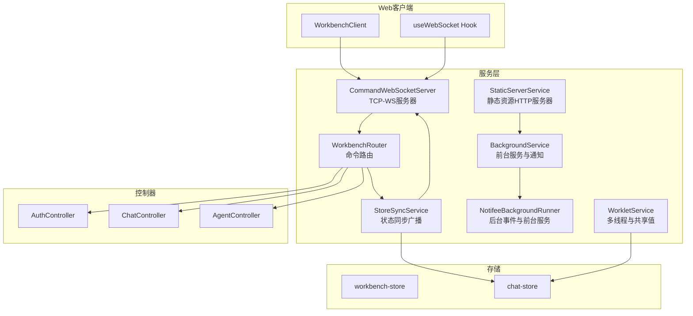
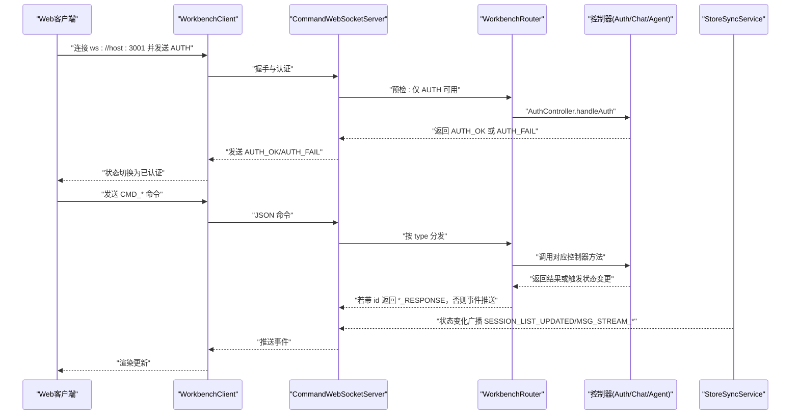
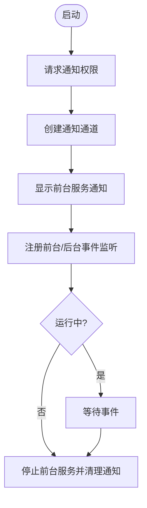
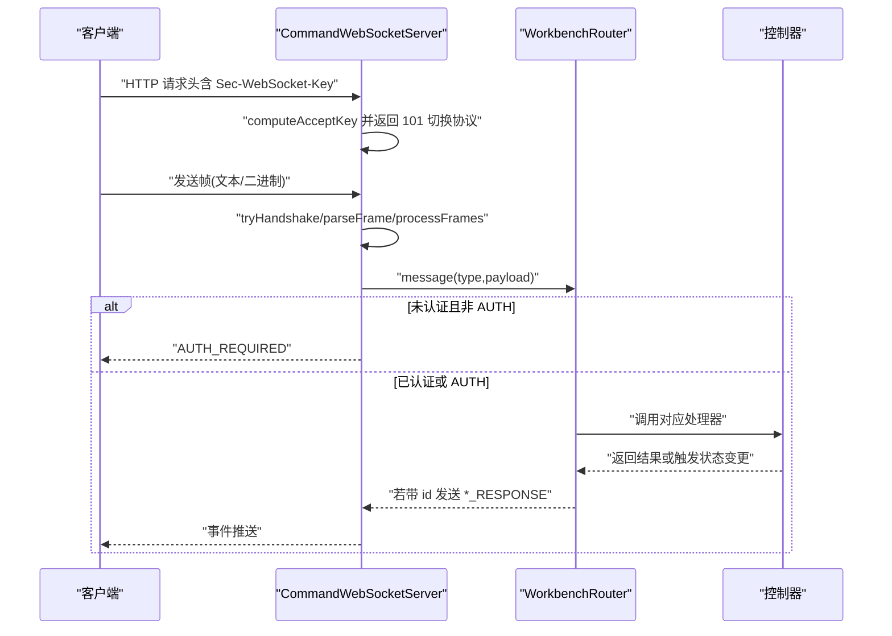
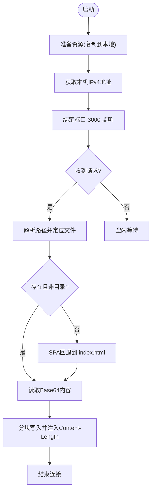
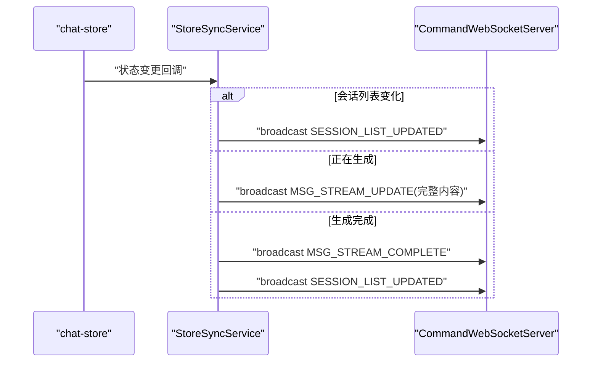
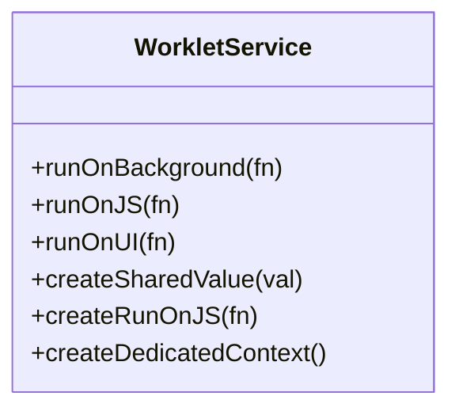
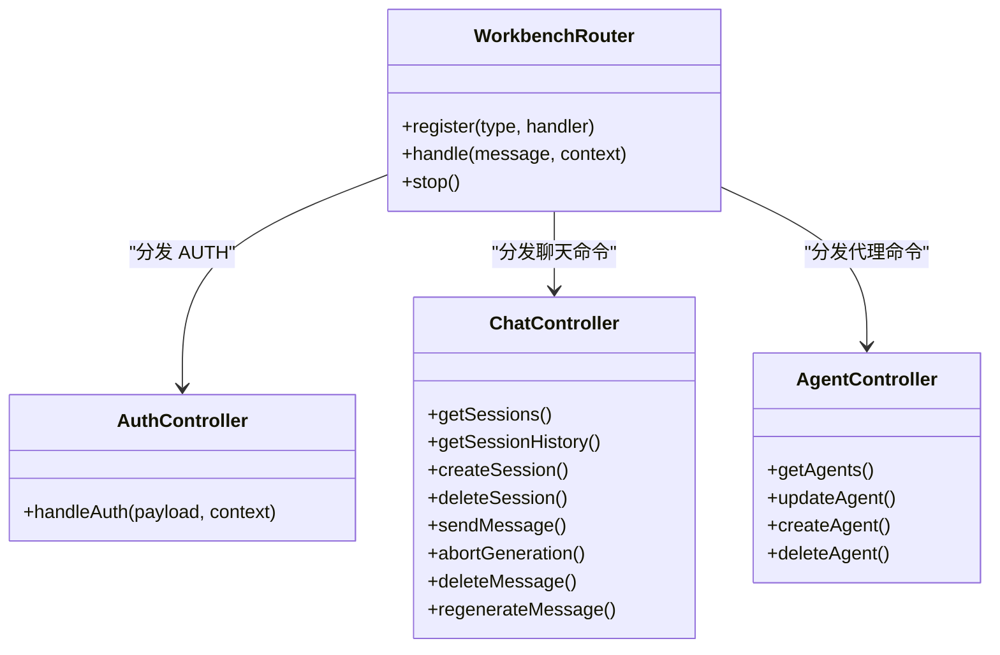
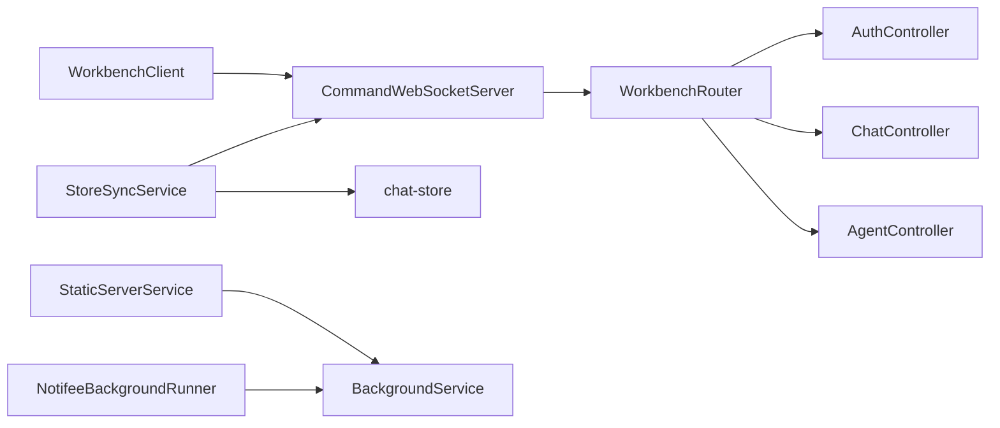

# 服务层设计

<cite>
**本文引用的文件**
- [BackgroundService.ts](file://src/services/BackgroundService.ts)
- [NotifeeBackgroundRunner.ts](file://src/services/NotifeeBackgroundRunner.ts)
- [WorkletService.ts](file://src/services/worklets/WorkletService.ts)
- [CommandWebSocketServer.ts](file://src/services/workbench/CommandWebSocketServer.ts)
- [StaticServerService.ts](file://src/services/workbench/StaticServerService.ts)
- [WorkbenchRouter.ts](file://src/services/workbench/WorkbenchRouter.ts)
- [StoreSyncService.ts](file://src/services/workbench/StoreSyncService.ts)
- [AuthController.ts](file://src/services/workbench/controllers/AuthController.ts)
- [ChatController.ts](file://src/services/workbench/controllers/ChatController.ts)
- [AgentController.ts](file://src/services/workbench/controllers/AgentController.ts)
- [workbench-store.ts](file://src/store/workbench-store.ts)
- [chat-store.ts](file://src/store/chat-store.ts)
- [WorkbenchClient.ts](file://web-client/src/services/WorkbenchClient.ts)
- [useWebSocket.ts](file://web-client/src/hooks/useWebSocket.ts)
</cite>

## 目录
1. [引言](#引言)
2. [项目结构](#项目结构)
3. [核心组件](#核心组件)
4. [架构总览](#架构总览)
5. [详细组件分析](#详细组件分析)
6. [依赖关系分析](#依赖关系分析)
7. [性能考量](#性能考量)
8. [故障排查指南](#故障排查指南)
9. [结论](#结论)
10. [附录](#附录)

## 引言
本设计文档聚焦 Nexara 项目的“服务层”，系统性阐述后台服务、WebSocket 通信、静态文件服务与高性能原生代码执行（Worklets）的设计与实现要点。文档同时给出扩展指南、错误处理与监控建议，并提供可直接参考的配置与使用场景。

## 项目结构
服务层主要由以下模块构成：
- 后台服务与前台通知：BackgroundService 负责前台服务与通知；NotifeeBackgroundRunner 处理后台事件与前台服务注册。
- WebSocket 服务：CommandWebSocketServer 提供 TCP 套接字上的 WebSocket 兼容协议，WorkbenchRouter 实现命令路由，StoreSyncService 实现状态同步广播。
- 静态文件服务：StaticServerService 在本地提供 Web 客户端资源，支持 SPA 回退与分块传输。
- 工作线程（Worklets）：WorkletService 封装 react-native-worklets-core 的多线程与共享值能力。
- 控制器与存储：各控制器封装业务命令，Store 提供状态持久化与跨组件共享。

**图表来源**
- [BackgroundService.ts:1-117](file://src/services/BackgroundService.ts#L1-L117)
- [NotifeeBackgroundRunner.ts:1-28](file://src/services/NotifeeBackgroundRunner.ts#L1-L28)
- [CommandWebSocketServer.ts:1-488](file://src/services/workbench/CommandWebSocketServer.ts#L1-L488)
- [StaticServerService.ts:1-301](file://src/services/workbench/StaticServerService.ts#L1-L301)
- [WorkbenchRouter.ts:1-75](file://src/services/workbench/WorkbenchRouter.ts#L1-L75)
- [StoreSyncService.ts:1-127](file://src/services/workbench/StoreSyncService.ts#L1-L127)
- [WorkletService.ts:1-63](file://src/services/worklets/WorkletService.ts#L1-L63)
- [AuthController.ts:1-55](file://src/services/workbench/controllers/AuthController.ts#L1-L55)
- [ChatController.ts:1-130](file://src/services/workbench/controllers/ChatController.ts#L1-L130)
- [AgentController.ts:1-48](file://src/services/workbench/controllers/AgentController.ts#L1-L48)
- [workbench-store.ts:1-56](file://src/store/workbench-store.ts#L1-L56)
- [chat-store.ts:1-200](file://src/store/chat-store.ts#L1-L200)
- [WorkbenchClient.ts:1-317](file://web-client/src/services/WorkbenchClient.ts#L1-L317)
- [useWebSocket.ts:1-115](file://web-client/src/hooks/useWebSocket.ts#L1-L115)

**章节来源**
- [BackgroundService.ts:1-117](file://src/services/BackgroundService.ts#L1-L117)
- [StaticServerService.ts:1-301](file://src/services/workbench/StaticServerService.ts#L1-L301)
- [CommandWebSocketServer.ts:1-488](file://src/services/workbench/CommandWebSocketServer.ts#L1-L488)
- [WorkbenchRouter.ts:1-75](file://src/services/workbench/WorkbenchRouter.ts#L1-L75)
- [StoreSyncService.ts:1-127](file://src/services/workbench/StoreSyncService.ts#L1-L127)
- [WorkletService.ts:1-63](file://src/services/worklets/WorkletService.ts#L1-L63)
- [workbench-store.ts:1-56](file://src/store/workbench-store.ts#L1-L56)
- [chat-store.ts:1-200](file://src/store/chat-store.ts#L1-L200)
- [WorkbenchClient.ts:1-317](file://web-client/src/services/WorkbenchClient.ts#L1-L317)
- [useWebSocket.ts:1-115](file://web-client/src/hooks/useWebSocket.ts#L1-L115)

## 核心组件
- 后台服务与通知：通过 Notifee 创建前台服务通知，支持停止动作按钮与权限请求；在静态服务器启动时自动启用。
- WebSocket 服务器：基于 TCP 套接字实现 WebSocket 握手与帧解析，支持 Ping/Pong、分片与掩码处理，提供命令路由与认证拦截。
- 静态资源服务器：提供 Web 客户端资源（HTML/JS/CSS），支持 SPA 回退与分块写入，自动打包并复制到本地目录。
- 状态同步服务：订阅应用状态变化，向已认证客户端广播会话列表更新与流式消息片段。
- 工作线程服务：抽象多线程执行、JS/UI 切换与共享值，便于高性能计算与 UI 更新解耦。
- 控制器与存储：控制器封装业务命令（认证、聊天、代理），存储提供持久化与状态管理。

**章节来源**
- [BackgroundService.ts:1-117](file://src/services/BackgroundService.ts#L1-L117)
- [NotifeeBackgroundRunner.ts:1-28](file://src/services/NotifeeBackgroundRunner.ts#L1-L28)
- [CommandWebSocketServer.ts:1-488](file://src/services/workbench/CommandWebSocketServer.ts#L1-L488)
- [StaticServerService.ts:1-301](file://src/services/workbench/StaticServerService.ts#L1-L301)
- [WorkbenchRouter.ts:1-75](file://src/services/workbench/WorkbenchRouter.ts#L1-L75)
- [StoreSyncService.ts:1-127](file://src/services/workbench/StoreSyncService.ts#L1-L127)
- [WorkletService.ts:1-63](file://src/services/worklets/WorkletService.ts#L1-L63)
- [AuthController.ts:1-55](file://src/services/workbench/controllers/AuthController.ts#L1-L55)
- [ChatController.ts:1-130](file://src/services/workbench/controllers/ChatController.ts#L1-L130)
- [AgentController.ts:1-48](file://src/services/workbench/controllers/AgentController.ts#L1-L48)
- [workbench-store.ts:1-56](file://src/store/workbench-store.ts#L1-L56)
- [chat-store.ts:1-200](file://src/store/chat-store.ts#L1-L200)

## 架构总览
服务层采用“服务 + 路由 + 控制器 + 存储”的分层设计，通过 TCP-HTTP 与 TCP-WS 提供本地网络服务，配合前台服务与通知确保后台可用性，Worklets 提升计算密集型任务的性能。

**图表来源**
- [WorkbenchClient.ts:1-317](file://web-client/src/services/WorkbenchClient.ts#L1-L317)
- [CommandWebSocketServer.ts:1-488](file://src/services/workbench/CommandWebSocketServer.ts#L1-L488)
- [WorkbenchRouter.ts:1-75](file://src/services/workbench/WorkbenchRouter.ts#L1-L75)
- [AuthController.ts:1-55](file://src/services/workbench/controllers/AuthController.ts#L1-L55)
- [ChatController.ts:1-130](file://src/services/workbench/controllers/ChatController.ts#L1-L130)
- [AgentController.ts:1-48](file://src/services/workbench/controllers/AgentController.ts#L1-L48)
- [StoreSyncService.ts:1-127](file://src/services/workbench/StoreSyncService.ts#L1-L127)

## 详细组件分析

### 后台服务与通知（BackgroundService）
- 设计原则
  - 使用 Notifee 创建前台服务通知，避免被系统回收。
  - 支持前台/后台事件监听，统一处理“停止服务”动作。
  - 提供权限请求与电池优化设置入口，提升长期运行稳定性。
- 关键机制
  - 通知通道创建与前台服务类型声明。
  - 事件监听器注册，区分前台/后台动作。
  - 启动/停止流程与异常捕获。
- 与静态服务器集成
  - 静态服务器启动时调用后台服务启动与电池优化请求。

**图表来源**
- [BackgroundService.ts:1-117](file://src/services/BackgroundService.ts#L1-L117)
- [StaticServerService.ts:223-227](file://src/services/workbench/StaticServerService.ts#L223-L227)

**章节来源**
- [BackgroundService.ts:1-117](file://src/services/BackgroundService.ts#L1-L117)
- [StaticServerService.ts:223-227](file://src/services/workbench/StaticServerService.ts#L223-L227)

### WebSocket 通信协议（CommandWebSocketServer）
- 协议实现
  - 基于 TCP 套接字模拟 WebSocket 握手与帧格式，支持文本与二进制帧、Ping/Pong、掩码与分片。
  - 认证拦截：未认证客户端仅允许 AUTH 命令；其余命令返回 AUTH_REQUIRED。
  - 写队列与分块写入：保证原子性与可靠性，避免桥接传输阻塞。
- 命令路由
  - 注册多个命令（认证、聊天、代理、配置、库、统计、备份），通过 WorkbenchRouter 分发。
  - 对带 id 的请求返回 *_RESPONSE，否则作为事件推送。
- 心跳与清理
  - 客户端每 10 秒发送 HEARTBEAT；超过 30 秒无心跳则断开。
  - 定期清理无效连接，维护连接数统计。

**图表来源**
- [CommandWebSocketServer.ts:1-488](file://src/services/workbench/CommandWebSocketServer.ts#L1-L488)
- [WorkbenchRouter.ts:1-75](file://src/services/workbench/WorkbenchRouter.ts#L1-L75)

**章节来源**
- [CommandWebSocketServer.ts:1-488](file://src/services/workbench/CommandWebSocketServer.ts#L1-L488)
- [WorkbenchRouter.ts:1-75](file://src/services/workbench/WorkbenchRouter.ts#L1-L75)

### 静态文件服务（StaticServerService）
- 设计目标
  - 在本地提供 Web 客户端资源，支持 SPA 路由回退与静态资源缓存。
- 实现要点
  - 将打包后的 HTML/JS/CSS 资源复制到本地目录，避免动态加载失败。
  - 仅允许 GET 方法，对非法路径返回 403/404。
  - 使用分块写入与 Content-Length，提升大文件传输稳定性。
  - 启动后自动获取本机 IPv4 地址并启动前台服务。
- 与后台服务联动
  - 启动时调用后台服务启动与电池优化请求。

**图表来源**
- [StaticServerService.ts:1-301](file://src/services/workbench/StaticServerService.ts#L1-L301)

**章节来源**
- [StaticServerService.ts:1-301](file://src/services/workbench/StaticServerService.ts#L1-L301)

### 状态同步服务（StoreSyncService）
- 目标
  - 将应用状态变化实时推送给已认证客户端，减少轮询与重复传输。
- 机制
  - 订阅聊天存储，检测会话列表变化与流式消息更新。
  - 流式消息以完整内容推送，确保一致性；生成完成后广播完成事件并刷新会话列表。
- 与 WebSocket 服务协作
  - 通过 CommandWebSocketServer.broadcast 推送事件。

**图表来源**
- [StoreSyncService.ts:1-127](file://src/services/workbench/StoreSyncService.ts#L1-L127)
- [CommandWebSocketServer.ts:446-458](file://src/services/workbench/CommandWebSocketServer.ts#L446-L458)

**章节来源**
- [StoreSyncService.ts:1-127](file://src/services/workbench/StoreSyncService.ts#L1-L127)
- [CommandWebSocketServer.ts:446-458](file://src/services/workbench/CommandWebSocketServer.ts#L446-L458)

### 工作线程服务（WorkletService）
- 设计原则
  - 抽象多线程执行、JS/UI 切换与共享值，降低上下文切换复杂度。
- 能力
  - 在后台线程执行函数、在 JS/UI 线程执行回调。
  - 创建共享值与专用上下文，便于跨线程状态传递。
- 性能优势
  - 将耗时计算与 UI 更新解耦，避免主线程阻塞。

**图表来源**
- [WorkletService.ts:1-63](file://src/services/worklets/WorkletService.ts#L1-L63)

**章节来源**
- [WorkletService.ts:1-63](file://src/services/worklets/WorkletService.ts#L1-L63)

### 控制器与命令定义
- 认证（AuthController）
  - 支持令牌与访问码两种认证方式；令牌定时清理。
- 聊天（ChatController）
  - 会话管理、历史查询、消息发送（异步生成）、中断生成、删除/重生成消息。
- 代理（AgentController）
  - 代理查询、更新、创建、删除。

**图表来源**
- [WorkbenchRouter.ts:1-75](file://src/services/workbench/WorkbenchRouter.ts#L1-L75)
- [AuthController.ts:1-55](file://src/services/workbench/controllers/AuthController.ts#L1-L55)
- [ChatController.ts:1-130](file://src/services/workbench/controllers/ChatController.ts#L1-L130)
- [AgentController.ts:1-48](file://src/services/workbench/controllers/AgentController.ts#L1-L48)

**章节来源**
- [WorkbenchRouter.ts:1-75](file://src/services/workbench/WorkbenchRouter.ts#L1-L75)
- [AuthController.ts:1-55](file://src/services/workbench/controllers/AuthController.ts#L1-L55)
- [ChatController.ts:1-130](file://src/services/workbench/controllers/ChatController.ts#L1-L130)
- [AgentController.ts:1-48](file://src/services/workbench/controllers/AgentController.ts#L1-L48)

## 依赖关系分析
- 组件耦合
  - CommandWebSocketServer 依赖 WorkbenchRouter、控制器与 StoreSyncService。
  - StoreSyncService 依赖 chat-store 与 CommandWebSocketServer。
  - StaticServerService 依赖 BackgroundService 与 Expo 文件系统。
  - Web 客户端通过 WorkbenchClient 与 CommandWebSocketServer 交互。
- 外部依赖
  - Notifee（前台服务与通知）
  - react-native-tcp-socket（TCP-WS/HTTP）
  - jsrsasign（WebSocket Accept 计算）
  - react-native-worklets-core（Worklets）

**图表来源**
- [WorkbenchClient.ts:1-317](file://web-client/src/services/WorkbenchClient.ts#L1-L317)
- [CommandWebSocketServer.ts:1-488](file://src/services/workbench/CommandWebSocketServer.ts#L1-L488)
- [WorkbenchRouter.ts:1-75](file://src/services/workbench/WorkbenchRouter.ts#L1-L75)
- [AuthController.ts:1-55](file://src/services/workbench/controllers/AuthController.ts#L1-L55)
- [ChatController.ts:1-130](file://src/services/workbench/controllers/ChatController.ts#L1-L130)
- [AgentController.ts:1-48](file://src/services/workbench/controllers/AgentController.ts#L1-L48)
- [StoreSyncService.ts:1-127](file://src/services/workbench/StoreSyncService.ts#L1-L127)
- [StaticServerService.ts:1-301](file://src/services/workbench/StaticServerService.ts#L1-L301)
- [BackgroundService.ts:1-117](file://src/services/BackgroundService.ts#L1-L117)
- [NotifeeBackgroundRunner.ts:1-28](file://src/services/NotifeeBackgroundRunner.ts#L1-L28)

**章节来源**
- [WorkbenchClient.ts:1-317](file://web-client/src/services/WorkbenchClient.ts#L1-L317)
- [CommandWebSocketServer.ts:1-488](file://src/services/workbench/CommandWebSocketServer.ts#L1-L488)
- [WorkbenchRouter.ts:1-75](file://src/services/workbench/WorkbenchRouter.ts#L1-L75)
- [StoreSyncService.ts:1-127](file://src/services/workbench/StoreSyncService.ts#L1-L127)
- [StaticServerService.ts:1-301](file://src/services/workbench/StaticServerService.ts#L1-L301)
- [BackgroundService.ts:1-117](file://src/services/BackgroundService.ts#L1-L117)
- [NotifeeBackgroundRunner.ts:1-28](file://src/services/NotifeeBackgroundRunner.ts#L1-L28)

## 性能考量
- 写入可靠性
  - WebSocket 写入采用队列与分块策略，避免桥接阻塞；必要时使用 drain 事件与超时保护。
- 传输效率
  - 大包日志记录与分块写入，结合 Content-Length 减少解析成本。
- 认证与路由
  - 未认证限制与快速失败，减少无效负载。
- 前台服务
  - 通过 Notifee 前台服务与通知，降低被系统回收概率，保障长连稳定。

[本节为通用性能建议，不直接分析具体文件]

## 故障排查指南
- WebSocket 连接问题
  - 确认客户端与服务端端口一致（静态服务器 3000，WebSocket 3001）。
  - 检查握手阶段日志与错误事件，关注“Broken pipe/ECONNRESET”等常见网络错误。
- 认证失败
  - 检查令牌是否过期或访问码是否正确；确认 AUTH_OK/AUTH_FAIL 事件。
- 静态资源无法加载
  - 确认资源复制成功与路径正确；检查 SPA 回退逻辑与 404/403 条件。
- 前台服务与通知
  - 若通知未显示或被回收，检查权限请求与前台服务类型；尝试电池优化白名单。

**章节来源**
- [CommandWebSocketServer.ts:84-100](file://src/services/workbench/CommandWebSocketServer.ts#L84-L100)
- [AuthController.ts:18-54](file://src/services/workbench/controllers/AuthController.ts#L18-L54)
- [StaticServerService.ts:68-125](file://src/services/workbench/StaticServerService.ts#L68-L125)
- [BackgroundService.ts:85-113](file://src/services/BackgroundService.ts#L85-L113)

## 结论
服务层通过后台通知、TCP-WS 与 TCP-HTTP 服务、状态同步与工作线程抽象，构建了稳定、可扩展且高性能的本地网络服务框架。控制器与存储清晰分离职责，便于新增命令与业务扩展。建议在新增服务时遵循“最小暴露面、明确错误处理、可观测性优先”的原则。

[本节为总结性内容，不直接分析具体文件]

## 附录

### 扩展指南
- 新增命令
  - 在 WorkbenchRouter 中注册命令类型与处理器。
  - 在控制器中实现业务逻辑，必要时触发 StoreSyncService 广播。
- 服务间通信
  - 通过 CommandWebSocketServer.broadcast 推送事件；通过 StoreSyncService 订阅状态变化。
- 错误处理与监控
  - 统一捕获与返回 *_ERROR；在客户端监听并展示。
  - 记录关键日志（握手、写入、心跳、清理）以便排障。
- 配置示例与使用场景
  - 启动静态服务器：调用静态服务器启动方法，自动获取本机地址并启动前台服务。
  - 启动 WebSocket 服务器：注册命令路由，启动后开启清理定时器与心跳。
  - 客户端连接：Web 客户端通过 WorkbenchClient 连接 ws://host:3001，先认证再发送命令。

**章节来源**
- [WorkbenchRouter.ts:21-71](file://src/services/workbench/WorkbenchRouter.ts#L21-L71)
- [CommandWebSocketServer.ts:134-178](file://src/services/workbench/CommandWebSocketServer.ts#L134-L178)
- [StaticServerService.ts:24-236](file://src/services/workbench/StaticServerService.ts#L24-L236)
- [WorkbenchClient.ts:29-94](file://web-client/src/services/WorkbenchClient.ts#L29-L94)