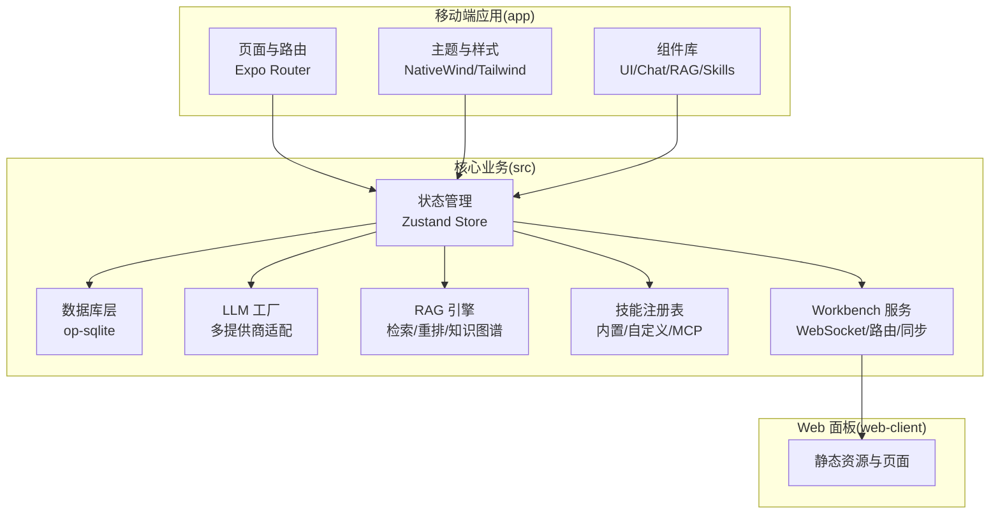
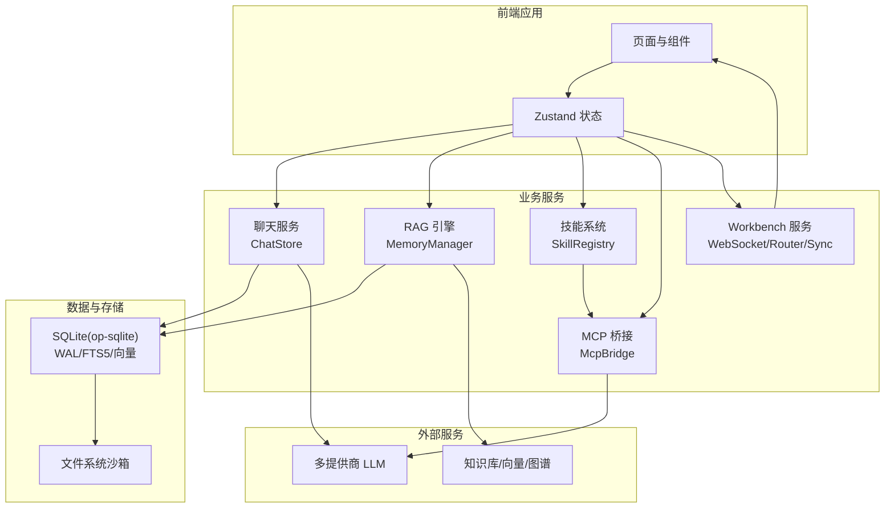
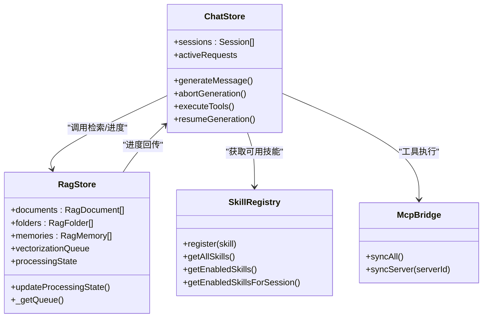
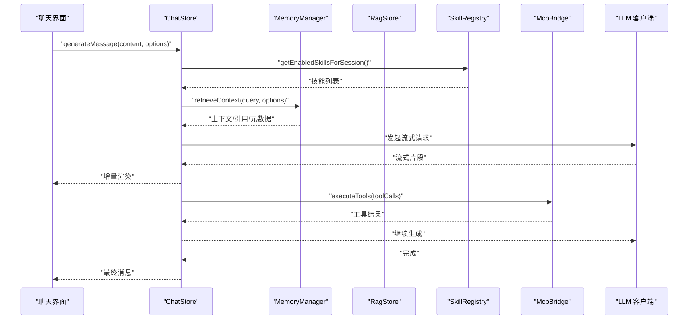
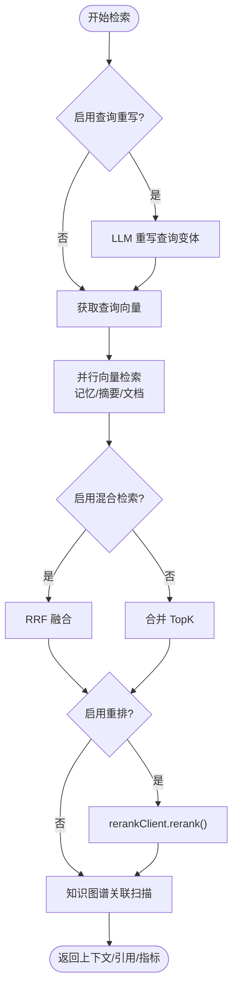
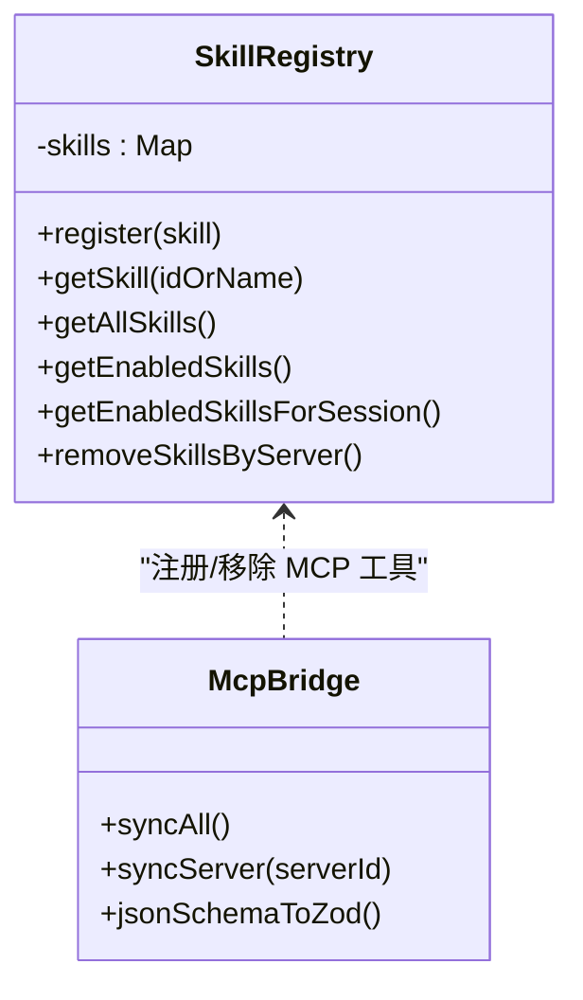
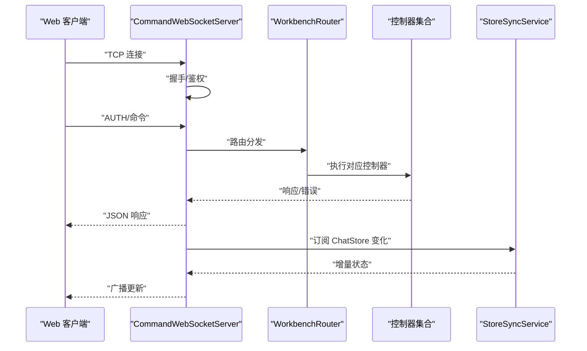
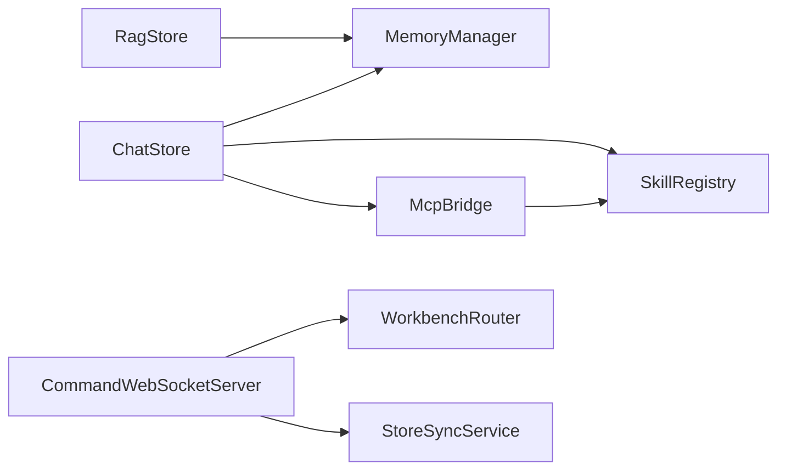

# 核心架构设计

<cite>
**本文档引用的文件**
- [README.md](file://README.md)
- [package.json](file://package.json)
- [app/_layout.tsx](file://app/_layout.tsx)
- [src/store/chat-store.ts](file://src/store/chat-store.ts)
- [src/lib/db/index.ts](file://src/lib/db/index.ts)
- [src/lib/mcp/mcp-bridge.ts](file://src/lib/mcp/mcp-bridge.ts)
- [src/services/workbench/WorkbenchRouter.ts](file://src/services/workbench/WorkbenchRouter.ts)
- [src/services/workbench/CommandWebSocketServer.ts](file://src/services/workbench/CommandWebSocketServer.ts)
- [src/services/workbench/StoreSyncService.ts](file://src/services/workbench/StoreSyncService.ts)
- [src/store/rag-store.ts](file://src/store/rag-store.ts)
- [src/lib/rag/memory-manager.ts](file://src/lib/rag/memory-manager.ts)
- [src/lib/llm/factory.ts](file://src/lib/llm/factory.ts)
- [src/lib/skills/registry.ts](file://src/lib/skills/registry.ts)
</cite>

## 目录
1. [引言](#引言)
2. [项目结构](#项目结构)
3. [核心组件](#核心组件)
4. [架构总览](#架构总览)
5. [详细组件分析](#详细组件分析)
6. [依赖关系分析](#依赖关系分析)
7. [性能考量](#性能考量)
8. [故障排查指南](#故障排查指南)
9. [结论](#结论)
10. [附录](#附录)

## 引言
本项目为面向 Android 的 AI 助手客户端，采用本地优先策略，将对话、知识库与向量嵌入存储于设备本地 SQLite，同时通过 12+ 云厂商推理接口提供强大的多提供商能力。系统围绕本地数据库、状态管理、RAG 引擎、代理系统与 MCP 协议展开，辅以内置 Workbench 网页面板，支持局域网远程管理。

技术选型概览：
- 框架与运行时：Expo SDK 54 + React Native（新架构）
- 状态管理：Zustand
- 数据库：op-sqlite（SQLite + FTS5 + 向量 BLOB）
- 本地推理：llama.rn
- 动画：Reanimated 4
- Web 面板：Vite + React 18 + TailwindCSS 4

## 项目结构
项目采用按功能域划分的模块化组织方式，核心目录与职责如下：
- app/：移动端页面与路由入口，基于 Expo Router
- src/：核心业务层，包含 store、lib、services、features、components、types 等
- web-client/：配套 Web 管理面板
- scripts/：构建与辅助脚本
- plugins/：原生插件封装

**图表来源**
- [app/_layout.tsx:1-191](file://app/_layout.tsx#L1-L191)
- [src/store/chat-store.ts:1-2579](file://src/store/chat-store.ts#L1-L2579)
- [src/lib/db/index.ts:1-13](file://src/lib/db/index.ts#L1-L13)
- [src/lib/llm/factory.ts:1-97](file://src/lib/llm/factory.ts#L1-L97)
- [src/lib/rag/memory-manager.ts:1-997](file://src/lib/rag/memory-manager.ts#L1-L997)
- [src/lib/skills/registry.ts:1-189](file://src/lib/skills/registry.ts#L1-L189)
- [src/services/workbench/CommandWebSocketServer.ts:1-488](file://src/services/workbench/CommandWebSocketServer.ts#L1-L488)

**章节来源**
- [README.md:1-161](file://README.md#L1-L161)
- [package.json:1-120](file://package.json#L1-L120)

## 核心组件
- 状态管理（Zustand）
  - 聊天状态：会话、消息、生成请求、工具执行、审批流程、MCP/技能开关等
  - RAG 状态：文档/文件夹/记忆、向量化队列、处理状态、知识图谱累积器
  - 设置与 API：提供商、模型、推理参数、技能配置
- 数据存储（SQLite + FTS5 + 向量 BLOB）
  - 会话与消息持久化、文档与向量、知识图谱节点与边、文件系统沙箱
- 通信机制（Workbench）
  - TCP 套接字 WebSocket 服务器、命令路由、鉴权、广播与增量同步
- LLM 工厂与多提供商适配
  - OpenAI、Anthropic、Gemini、Vertex AI、DeepSeek、Moonshot、Zhipu、SiliconFlow、GitHub Copilot、Cloudflare、OpenAI 兼容、本地 llama.rn
- RAG 引擎
  - 查询重写、向量检索、关键词混合检索（RRF）、重排、知识图谱关联、摘要与记忆融合
- 技能系统与 MCP
  - 内置技能、用户自定义技能、MCP 工具桥接、Schema 驱动参数校验与执行

**章节来源**
- [src/store/chat-store.ts:108-210](file://src/store/chat-store.ts#L108-L210)
- [src/store/rag-store.ts:24-145](file://src/store/rag-store.ts#L24-L145)
- [src/lib/db/index.ts:1-13](file://src/lib/db/index.ts#L1-L13)
- [src/lib/llm/factory.ts:23-96](file://src/lib/llm/factory.ts#L23-L96)
- [src/lib/mcp/mcp-bridge.ts:10-129](file://src/lib/mcp/mcp-bridge.ts#L10-L129)
- [src/lib/skills/registry.ts:8-189](file://src/lib/skills/registry.ts#L8-L189)

## 架构总览
系统采用“本地优先 + 多提供商 + 分层服务”的整体架构：
- 前端应用层：页面、组件、主题、导航
- 业务服务层：聊天、RAG、代理、技能、MCP、Workbench
- 数据与存储层：SQLite（WAL 模式）、向量与知识图谱、文件系统沙箱
- 通信层：本地 WebSocket 服务器与 Web 面板双向同步

**图表来源**
- [app/_layout.tsx:82-191](file://app/_layout.tsx#L82-L191)
- [src/store/chat-store.ts:360-730](file://src/store/chat-store.ts#L360-L730)
- [src/lib/rag/memory-manager.ts:11-712](file://src/lib/rag/memory-manager.ts#L11-L712)
- [src/lib/skills/registry.ts:1-189](file://src/lib/skills/registry.ts#L1-L189)
- [src/lib/mcp/mcp-bridge.ts:14-129](file://src/lib/mcp/mcp-bridge.ts#L14-L129)
- [src/services/workbench/CommandWebSocketServer.ts:44-178](file://src/services/workbench/CommandWebSocketServer.ts#L44-L178)

## 详细组件分析

### 状态管理架构（Zustand）
- 设计原则
  - 分层 Store：chat-store、rag-store、agent-store、api-store、settings-store 等各司其职
  - 本地优先：UI 状态与持久化状态分离，避免 Store 承担复杂业务逻辑
  - 持久化：结合 persist 与 AsyncStorage，保障会话与设置跨重启可用
- 关键交互
  - ChatStore 调用 LLM 工厂、RAG 引擎、技能系统与 MCP 桥接
  - RAG Store 管理向量化队列与处理状态，驱动 UI 进度条与指示器
  - Workbench StoreSyncService 基于 Zustand 订阅推送增量更新

**图表来源**
- [src/store/chat-store.ts:108-210](file://src/store/chat-store.ts#L108-L210)
- [src/store/rag-store.ts:24-145](file://src/store/rag-store.ts#L24-L145)
- [src/lib/skills/registry.ts:8-189](file://src/lib/skills/registry.ts#L8-L189)
- [src/lib/mcp/mcp-bridge.ts:10-129](file://src/lib/mcp/mcp-bridge.ts#L10-L129)

**章节来源**
- [src/store/chat-store.ts:1-2579](file://src/store/chat-store.ts#L1-L2579)
- [src/store/rag-store.ts:1-1117](file://src/store/rag-store.ts#L1-L1117)

### 聊天系统（会话、消息、生成与工具）
- 会话与消息管理
  - 支持分页加载、滚动偏移、草稿、标题/提示词/模型切换、推理参数更新
  - 生成消息时注入系统提示词、RAG 上下文、搜索上下文、工具能力
- 流式生成与中断
  - 通过 LLM 客户端流式输出，支持中断与续杯
- 工具与 MCP
  - 技能注册表统一管理内置/自定义/MCP 工具，按会话与提供商动态路由
  - MCP 桥接将外部工具转换为本地 Skill，执行时建立即时连接并断开

**图表来源**
- [src/store/chat-store.ts:360-730](file://src/store/chat-store.ts#L360-L730)
- [src/lib/rag/memory-manager.ts:11-712](file://src/lib/rag/memory-manager.ts#L11-L712)
- [src/lib/skills/registry.ts:130-172](file://src/lib/skills/registry.ts#L130-L172)
- [src/lib/mcp/mcp-bridge.ts:79-112](file://src/lib/mcp/mcp-bridge.ts#L79-L112)

**章节来源**
- [src/store/chat-store.ts:360-730](file://src/store/chat-store.ts#L360-L730)
- [src/lib/skills/registry.ts:1-189](file://src/lib/skills/registry.ts#L1-L189)
- [src/lib/mcp/mcp-bridge.ts:1-202](file://src/lib/mcp/mcp-bridge.ts#L1-L202)

### RAG 引擎（检索、重排、知识图谱）
- 检索流水线
  - 查询重写（可选）、向量检索（记忆/摘要/文档）、关键词混合检索（RRF）
  - 可选重排（rerank）、知识图谱关联（实体提及 + 一跳关系）
- 并发与超时
  - 向量检索并行执行，设置阶段级超时，保证 UI 响应
- 进度与指标
  - 通过 RagStore 的 processingState 提供阶段进度、网络统计与召回指标

**图表来源**
- [src/lib/rag/memory-manager.ts:11-712](file://src/lib/rag/memory-manager.ts#L11-L712)
- [src/store/rag-store.ts:98-131](file://src/store/rag-store.ts#L98-L131)

**章节来源**
- [src/lib/rag/memory-manager.ts:1-997](file://src/lib/rag/memory-manager.ts#L1-L997)
- [src/store/rag-store.ts:1-1117](file://src/store/rag-store.ts#L1-L1117)

### 代理系统与技能（Skill Registry）
- 内置技能：调试、任务管理、图表/Mermaid 渲染、工具管理等
- 用户自定义技能：持久化存储与热加载
- MCP 工具：桥接外部工具为本地 Skill，Schema 驱动参数校验与执行
- 会话感知路由：按会话激活的 MCP 服务器与技能 ID 过滤可用工具

**图表来源**
- [src/lib/skills/registry.ts:8-189](file://src/lib/skills/registry.ts#L8-L189)
- [src/lib/mcp/mcp-bridge.ts:10-129](file://src/lib/mcp/mcp-bridge.ts#L10-L129)

**章节来源**
- [src/lib/skills/registry.ts:1-189](file://src/lib/skills/registry.ts#L1-L189)
- [src/lib/mcp/mcp-bridge.ts:1-202](file://src/lib/mcp/mcp-bridge.ts#L1-L202)

### MCP 协议（外部工具桥接）
- 同步策略：覆盖式同步，清理禁用或不存在的服务器工具
- 参数校验：基于 JSON Schema 转 Zod，自动类型强制转换
- 执行模式：即时连接、原子执行、执行后断开，降低连接复杂度

**章节来源**
- [src/lib/mcp/mcp-bridge.ts:14-129](file://src/lib/mcp/mcp-bridge.ts#L14-L129)

### 通信机制（Workbench WebSocket 服务器）
- 服务器启动与路由注册：鉴权、会话、聊天、配置、库、统计、备份等命令
- 握手与帧处理：TCP 套接字实现 WebSocket 协议，支持 Ping/Pong、心跳检测、分片写入
- 状态同步：基于 ChatStore 订阅，广播会话列表更新与流式消息增量

**图表来源**
- [src/services/workbench/CommandWebSocketServer.ts:44-178](file://src/services/workbench/CommandWebSocketServer.ts#L44-L178)
- [src/services/workbench/WorkbenchRouter.ts:18-72](file://src/services/workbench/WorkbenchRouter.ts#L18-L72)
- [src/services/workbench/StoreSyncService.ts:15-124](file://src/services/workbench/StoreSyncService.ts#L15-L124)

**章节来源**
- [src/services/workbench/CommandWebSocketServer.ts:1-488](file://src/services/workbench/CommandWebSocketServer.ts#L1-L488)
- [src/services/workbench/WorkbenchRouter.ts:1-75](file://src/services/workbench/WorkbenchRouter.ts#L1-L75)
- [src/services/workbench/StoreSyncService.ts:1-127](file://src/services/workbench/StoreSyncService.ts#L1-L127)

## 依赖关系分析
- 组件耦合
  - ChatStore 与 MemoryManager、SkillRegistry、McpBridge 高内聚低耦合，通过接口与回调解耦
  - Workbench 服务通过 Router 与控制器解耦，便于扩展新命令
- 外部依赖
  - op-sqlite：本地数据库与向量存储
  - llama.rn：本地推理
  - 多提供商 LLM 客户端：OpenAI、Anthropic、Gemini、Vertex AI、DeepSeek、Moonshot、Zhipu、SiliconFlow、GitHub Copilot、Cloudflare、OpenAI 兼容
- 潜在环路
  - Store 之间通过 getter/setter 间接访问，避免直接 import 导致循环依赖

**图表来源**
- [src/store/chat-store.ts:1-2579](file://src/store/chat-store.ts#L1-L2579)
- [src/store/rag-store.ts:1-1117](file://src/store/rag-store.ts#L1-L1117)
- [src/lib/rag/memory-manager.ts:1-997](file://src/lib/rag/memory-manager.ts#L1-L997)
- [src/lib/skills/registry.ts:1-189](file://src/lib/skills/registry.ts#L1-L189)
- [src/lib/mcp/mcp-bridge.ts:1-202](file://src/lib/mcp/mcp-bridge.ts#L1-L202)
- [src/services/workbench/CommandWebSocketServer.ts:1-488](file://src/services/workbench/CommandWebSocketServer.ts#L1-L488)
- [src/services/workbench/WorkbenchRouter.ts:1-75](file://src/services/workbench/WorkbenchRouter.ts#L1-L75)
- [src/services/workbench/StoreSyncService.ts:1-127](file://src/services/workbench/StoreSyncService.ts#L1-L127)

**章节来源**
- [package.json:14-95](file://package.json#L14-L95)

## 性能考量
- 数据库性能
  - WAL 模式提升并发读写；FTS5 支持全文检索；向量 BLOB 存储减少 JOIN
- 检索性能
  - 并行向量检索 + RRF 融合；可选重排与知识图谱关联；阶段级超时与进度回调
- UI 响应
  - ChatStore 生成消息时让出线程，避免阻塞导航；StoreSyncService 增量广播
- 本地推理
  - llama.rn 三槽位（主对话/嵌入/重排），GPU 加速支持
- 网络与安全
  - WebSocket 服务器支持心跳与断线清理；MCP 工具参数 Schema 校验

[本节为通用性能讨论，无需特定文件引用]

## 故障排查指南
- 数据库初始化失败
  - 检查 WAL 模式与外键约束初始化日志
- RAG 检索超时
  - 查看检索阶段超时与进度回调，确认向量库与权限范围
- MCP 工具同步异常
  - 检查服务器状态与工具列表，确认覆盖式同步与 Schema 转换
- Workbench 连接问题
  - 端口占用与重试、握手失败、鉴权拦截、心跳超时
- 生成中断或卡顿
  - ChatStore 中断逻辑与 activeRequests 状态，检查 LLM 客户端流式输出

**章节来源**
- [src/lib/db/index.ts:7-12](file://src/lib/db/index.ts#L7-L12)
- [src/lib/rag/memory-manager.ts:129-187](file://src/lib/rag/memory-manager.ts#L129-L187)
- [src/lib/mcp/mcp-bridge.ts:121-128](file://src/lib/mcp/mcp-bridge.ts#L121-L128)
- [src/services/workbench/CommandWebSocketServer.ts:113-131](file://src/services/workbench/CommandWebSocketServer.ts#L113-L131)
- [src/store/chat-store.ts:323-337](file://src/store/chat-store.ts#L323-L337)

## 结论
Nexara 以本地优先为核心，结合多提供商推理、RAG 引擎、技能系统与 MCP 协议，构建了可扩展、可观测、可远程管理的 AI 助手平台。Zustand 状态管理与分层服务设计确保了模块内聚与低耦合，Workbench 服务进一步提升了运维效率。未来可在 UI 交互、CJK 排版、本地推理稳定性与 Workbench 可靠性方面持续优化。

[本节为总结性内容，无需特定文件引用]

## 附录
- 快速开始与技术栈详情请参阅项目自述文件与包配置

**章节来源**
- [README.md:62-142](file://README.md#L62-L142)
- [package.json:1-120](file://package.json#L1-L120)