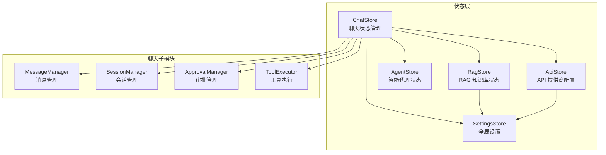
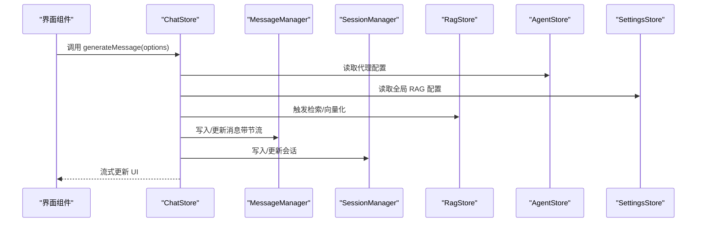
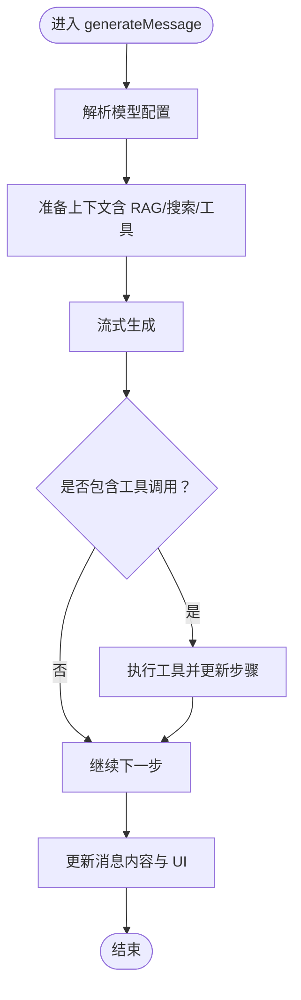
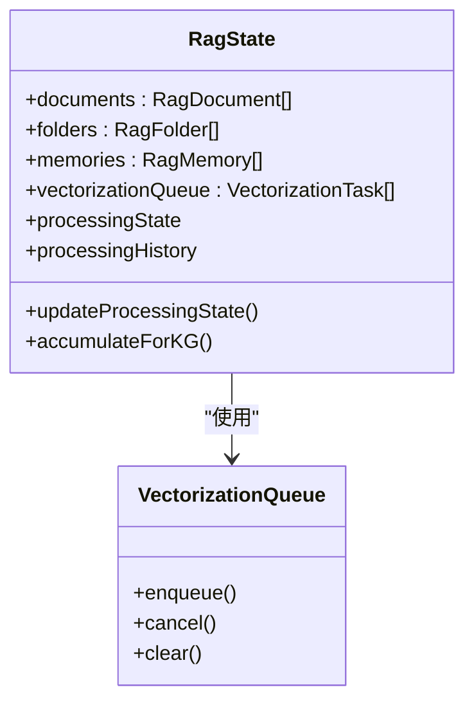
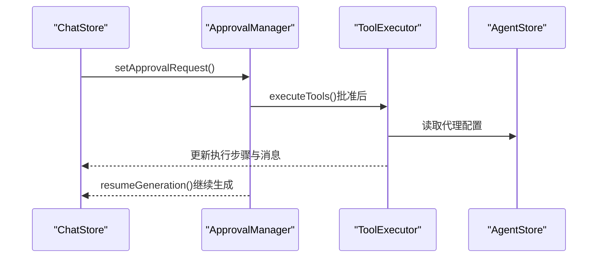
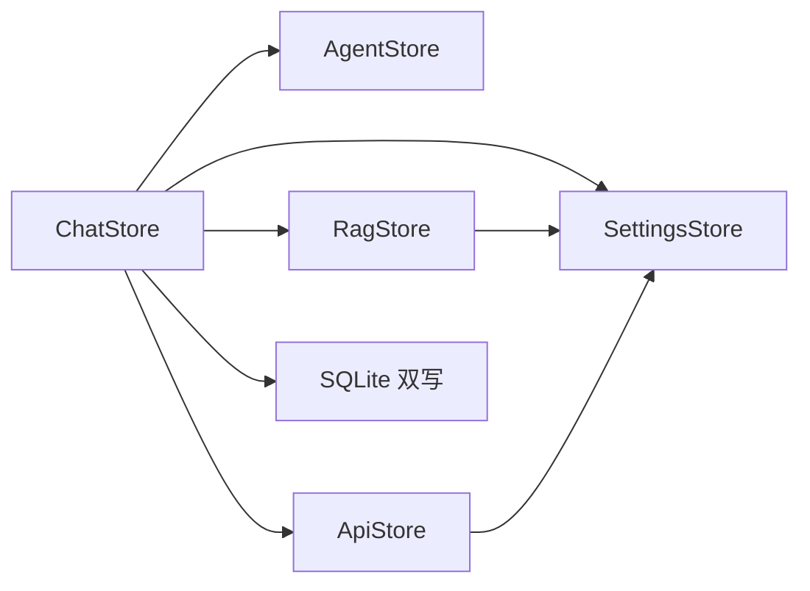

# 状态管理架构

<cite>
**本文档引用的文件**
- [src/store/chat-store.ts](file://src/store/chat-store.ts)
- [src/store/rag-store.ts](file://src/store/rag-store.ts)
- [src/store/settings-store.ts](file://src/store/settings-store.ts)
- [src/store/agent-store.ts](file://src/store/agent-store.ts)
- [src/store/api-store.ts](file://src/store/api-store.ts)
- [src/store/chat/index.ts](file://src/store/chat/index.ts)
- [src/store/chat/types.ts](file://src/store/chat/types.ts)
- [src/store/chat/message-manager.ts](file://src/store/chat/message-manager.ts)
- [src/store/chat/session-manager.ts](file://src/store/chat/session-manager.ts)
- [src/store/chat/approval-manager.ts](file://src/store/chat/approval-manager.ts)
- [src/store/chat/tool-execution.ts](file://src/store/chat/tool-execution.ts)
- [src/types/chat.ts](file://src/types/chat.ts)
- [src/store/api-types.ts](file://src/store/api-types.ts)
</cite>

## 目录
1. [简介](#简介)
2. [项目结构](#项目结构)
3. [核心组件](#核心组件)
4. [架构总览](#架构总览)
5. [详细组件分析](#详细组件分析)
6. [依赖分析](#依赖分析)
7. [性能考量](#性能考量)
8. [故障排查指南](#故障排查指南)
9. [结论](#结论)

## 简介
本文件系统性梳理 Nexara 项目的 Zustand 状态管理架构，重点阐述以下方面：
- Zustand 的使用模式与持久化策略
- 各 store 模块的职责划分：ChatStore（聊天）、RagStore（RAG 知识库）、AgentStore（智能代理）、SettingsStore（全局设置）
- store 之间的依赖关系与通信机制
- 通过 create 函数创建 store 与 persist 中间件的使用
- 最佳实践：状态结构设计、action 组织、异步状态更新

## 项目结构
Nexara 的状态管理采用模块化 store 设计，围绕聊天主流程构建，并与 RAG、代理、设置、API 等模块协同工作。整体结构如下：

**图表来源**
- [src/store/chat-store.ts:212-360](file://src/store/chat-store.ts#L212-L360)
- [src/store/chat/index.ts:8-11](file://src/store/chat/index.ts#L8-L11)
- [src/store/rag-store.ts:147-149](file://src/store/rag-store.ts#L147-L149)
- [src/store/settings-store.ts:75-76](file://src/store/settings-store.ts#L75-L76)
- [src/store/agent-store.ts:17-18](file://src/store/agent-store.ts#L17-L18)
- [src/store/api-store.ts:38-39](file://src/store/api-store.ts#L38-L39)

**章节来源**
- [src/store/chat-store.ts:1-120](file://src/store/chat-store.ts#L1-L120)
- [src/store/chat/index.ts:1-24](file://src/store/chat/index.ts#L1-L24)

## 核心组件
本项目基于 Zustand v4，广泛使用 persist 中间件实现状态持久化，结合模块化 manager 将复杂业务逻辑从 store 中剥离，提升可维护性。

- ChatStore：负责聊天会话、消息流式生成、工具调用、审批控制、RAG 集成等核心逻辑
- RagStore：负责知识库文档/文件夹/向量化队列、KG 抽取、检索进度与历史记录
- AgentStore：负责智能代理的生命周期管理（初始化、增删改、固定）
- SettingsStore：负责语言、主题、默认模型、RAG 全局配置、执行模式等全局设置
- ApiStore：负责提供商与模型配置、统计与搜索配置
- 聊天子模块：MessageManager、SessionManager、ApprovalManager、ToolExecutor

**章节来源**
- [src/store/chat-store.ts:108-210](file://src/store/chat-store.ts#L108-L210)
- [src/store/rag-store.ts:24-145](file://src/store/rag-store.ts#L24-L145)
- [src/store/agent-store.ts:7-15](file://src/store/agent-store.ts#L7-L15)
- [src/store/settings-store.ts:10-73](file://src/store/settings-store.ts#L10-L73)
- [src/store/api-store.ts:9-36](file://src/store/api-store.ts#L9-L36)
- [src/store/chat/types.ts:28-31](file://src/store/chat/types.ts#L28-L31)

## 架构总览
Zustand 在本项目中的使用遵循以下模式：
- 使用 create 创建 store，内部通过 manager 封装复杂逻辑
- 使用 persist 中间件配合 createJSONStorage 实现状态持久化
- 通过 useXxxStore.getState() 在 store 之间进行轻耦合通信
- 通过 SQLite 双写（内存 + 数据库）保障数据一致性与启动性能

**图表来源**
- [src/store/chat-store.ts:360-732](file://src/store/chat-store.ts#L360-L732)
- [src/store/chat/message-manager.ts:233-279](file://src/store/chat/message-manager.ts#L233-L279)
- [src/store/chat/session-manager.ts:55-67](file://src/store/chat/session-manager.ts#L55-L67)
- [src/store/rag-store.ts:631-732](file://src/store/rag-store.ts#L631-L732)
- [src/store/agent-store.ts:64-69](file://src/store/agent-store.ts#L64-L69)
- [src/store/settings-store.ts:115-180](file://src/store/settings-store.ts#L115-L180)

## 详细组件分析

### ChatStore：聊天状态管理
- 职责边界清晰：UI 状态与业务逻辑分离，复杂算法与非 UI 逻辑迁移至独立模块
- 状态结构：包含 sessions、activeRequests、activeKGExtractions、currentGeneratingSessionId 等
- 关键动作：
  - generateMessage：解析模型配置、准备上下文、触发检索、流式生成、工具调用、审批控制
  - loadSessions/loadSessionMessages：按需加载会话与消息，支持分页
  - updateMessageContent/updateSessionOptions 等：通过 manager 实现节流与双写
- 依赖关系：依赖 AgentStore、ApiStore、SettingsStore、RagStore；通过 manager 与数据库交互

**图表来源**
- [src/store/chat-store.ts:360-732](file://src/store/chat-store.ts#L360-L732)
- [src/store/chat/tool-execution.ts:24-376](file://src/store/chat/tool-execution.ts#L24-L376)

**章节来源**
- [src/store/chat-store.ts:108-210](file://src/store/chat-store.ts#L108-L210)
- [src/store/chat-store.ts:360-732](file://src/store/chat-store.ts#L360-L732)
- [src/store/chat-store.ts:800-1599](file://src/store/chat-store.ts#L800-L1599)

### RagStore：RAG 知识库状态
- 职责：文档/文件夹管理、向量化队列、KG 抽取、检索进度与历史记录
- 关键点：
  - 使用 VectorizationQueue 异步处理向量化
  - processingState/processingHistory 管理检索状态与历史
  - partialize/onRehydrateStorage 优化持久化体积与恢复逻辑
  - 与 SettingsStore 协作，受全局 RAG 配置影响

**图表来源**
- [src/store/rag-store.ts:24-145](file://src/store/rag-store.ts#L24-L145)
- [src/store/rag-store.ts:147-149](file://src/store/rag-store.ts#L147-L149)
- [src/store/rag-store.ts:940-960](file://src/store/rag-store.ts#L940-L960)

**章节来源**
- [src/store/rag-store.ts:24-145](file://src/store/rag-store.ts#L24-L145)
- [src/store/rag-store.ts:964-1028](file://src/store/rag-store.ts#L964-L1028)
- [src/store/rag-store.ts:1064-1096](file://src/store/rag-store.ts#L1064-L1096)

### AgentStore：智能代理状态
- 职责：代理初始化、增删改查、固定/取消固定
- 与 ChatStore 协作：在会话创建时继承默认 MCP 服务器与工具能力判断

**章节来源**
- [src/store/agent-store.ts:7-15](file://src/store/agent-store.ts#L7-L15)
- [src/store/agent-store.ts:17-76](file://src/store/agent-store.ts#L17-L76)

### SettingsStore：全局设置
- 职责：语言、主题、默认模型、RAG 全局配置、执行模式、技能开关、日志开关等
- 与 ChatStore/RagStore 协作：提供上下文窗口、RAG 配置、执行模式等

**章节来源**
- [src/store/settings-store.ts:10-73](file://src/store/settings-store.ts#L10-L73)
- [src/store/settings-store.ts:115-180](file://src/store/settings-store.ts#L115-L180)
- [src/store/settings-store.ts:187-195](file://src/store/settings-store.ts#L187-L195)

### ApiStore：API 提供商配置
- 职责：提供商与模型配置、启用/禁用、统计、搜索配置
- 与 ChatStore 协作：在生成消息时解析模型能力与参数

**章节来源**
- [src/store/api-store.ts:9-36](file://src/store/api-store.ts#L9-L36)
- [src/store/api-store.ts:38-160](file://src/store/api-store.ts#L38-L160)

### 聊天子模块：消息/会话/审批/工具执行
- MessageManager：消息的节流更新、SQLite 双写、计费统计
- SessionManager：会话的双写持久化、滚动偏移、MCP/技能开关
- ApprovalManager：半自动/手动模式下的审批流程与续杯控制
- ToolExecutor：工具调用、步骤可视化、Artifact 自动提取

**图表来源**
- [src/store/chat/approval-manager.ts:13-170](file://src/store/chat/approval-manager.ts#L13-L170)
- [src/store/chat/tool-execution.ts:24-376](file://src/store/chat/tool-execution.ts#L24-L376)
- [src/store/chat-store.ts:351-354](file://src/store/chat-store.ts#L351-L354)

**章节来源**
- [src/store/chat/message-manager.ts:18-442](file://src/store/chat/message-manager.ts#L18-L442)
- [src/store/chat/session-manager.ts:15-281](file://src/store/chat/session-manager.ts#L15-L281)
- [src/store/chat/approval-manager.ts:9-173](file://src/store/chat/approval-manager.ts#L9-L173)
- [src/store/chat/tool-execution.ts:20-379](file://src/store/chat/tool-execution.ts#L20-L379)

## 依赖分析
- ChatStore 依赖关系最广：AgentStore、ApiStore、SettingsStore、RagStore、SQLite 双写
- RagStore 依赖 SettingsStore 的全局 RAG 配置
- ApiStore 与 SettingsStore 互相影响（模型能力与默认模型）
- 聊天子模块通过 ManagerContext 与 ChatStore 解耦

**图表来源**
- [src/store/chat-store.ts:21-25](file://src/store/chat-store.ts#L21-L25)
- [src/store/rag-store.ts:9-9](file://src/store/rag-store.ts#L9-L9)
- [src/store/settings-store.ts:4-4](file://src/store/settings-store.ts#L4-L4)

**章节来源**
- [src/store/chat-store.ts:21-25](file://src/store/chat-store.ts#L21-L25)
- [src/store/rag-store.ts:9-9](file://src/store/rag-store.ts#L9-L9)
- [src/store/settings-store.ts:4-4](file://src/store/settings-store.ts#L4-L4)

## 性能考量
- 流式更新节流：消息内容更新采用 100ms 节流，向量化队列采用 500ms DB 防抖
- SQLite 双写：UI 立即响应，后台异步持久化，避免阻塞主线程
- 持久化体积控制：RagStore 使用 partialize 仅持久化必要字段，onRehydrateStorage 恢复 Set 等结构
- 启动优化：ChatStore 仅加载会话元数据，消息按需加载

**章节来源**
- [src/store/chat/message-manager.ts:15-75](file://src/store/chat/message-manager.ts#L15-L75)
- [src/store/chat/message-manager.ts:233-279](file://src/store/chat/message-manager.ts#L233-L279)
- [src/store/rag-store.ts:1102-1114](file://src/store/rag-store.ts#L1102-L1114)

## 故障排查指南
- 生成异常：检查 activeRequests 与 abortGeneration，确认会话状态与工具调用完整性
- 消息丢失：确认 DB 防抖定时器是否被正确清理与触发
- 检索卡住：检查 RagStore processingState 与队列状态，必要时清空队列
- 审批未生效：确认 ApprovalManager 的 resumeGeneration 流程与 pendingApprovalToolIds

**章节来源**
- [src/store/chat-store.ts:323-337](file://src/store/chat-store.ts#L323-L337)
- [src/store/chat/message-manager.ts:48-75](file://src/store/chat/message-manager.ts#L48-L75)
- [src/store/rag-store.ts:1036-1050](file://src/store/rag-store.ts#L1036-L1050)
- [src/store/chat/approval-manager.ts:21-146](file://src/store/chat/approval-manager.ts#L21-L146)

## 结论
Nexara 的状态管理以 Zustand 为核心，通过 persist 中间件实现可靠持久化，借助模块化 manager 将复杂逻辑与 UI 解耦，形成高内聚、低耦合的架构。ChatStore 作为中枢协调各模块，RagStore 与 SettingsStore 提供强大的检索与配置能力，ApiStore 与 AgentStore 保障模型与代理的灵活性。该架构在性能、可维护性与扩展性上取得良好平衡，适合复杂聊天与智能代理场景。