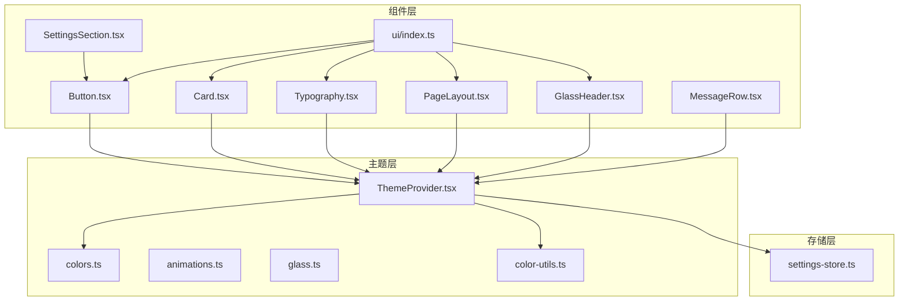
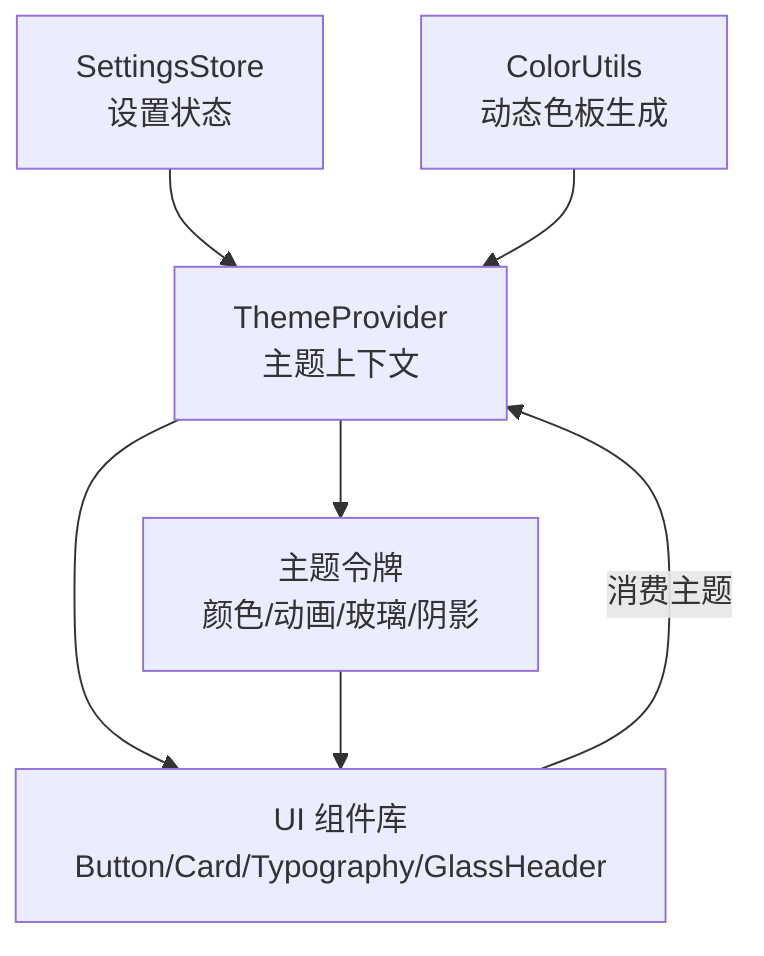
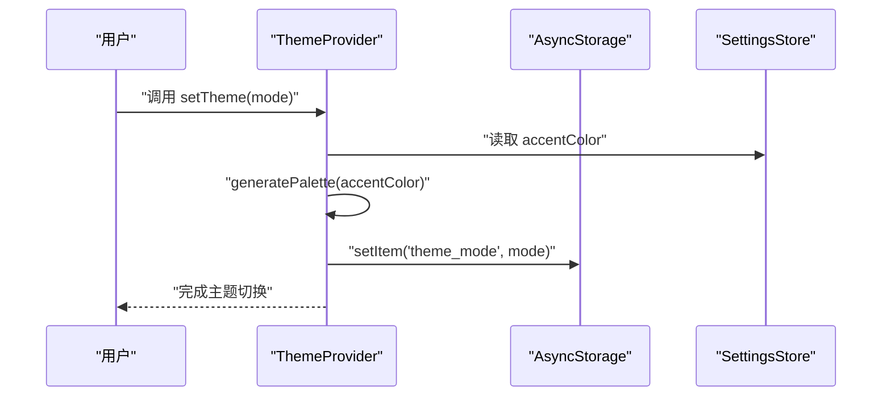
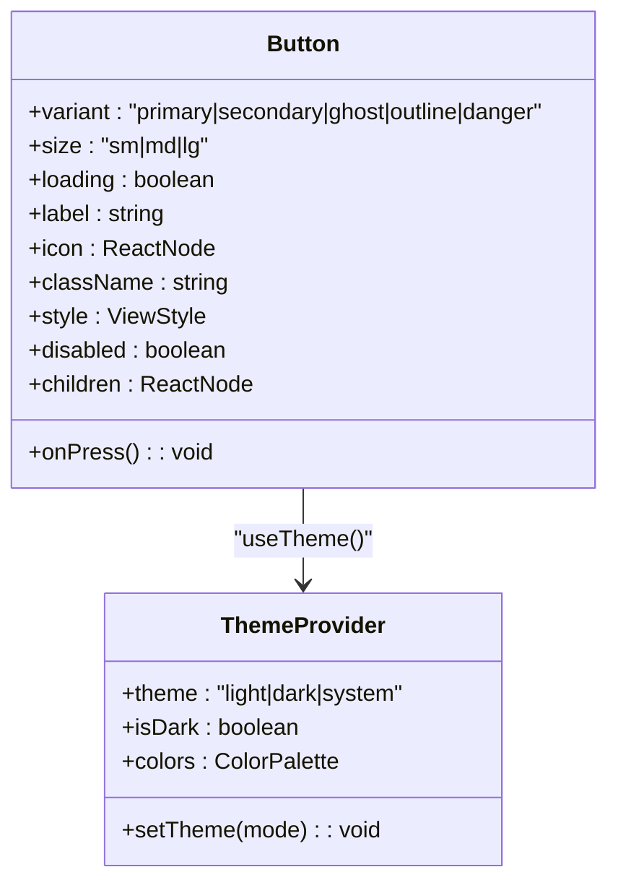
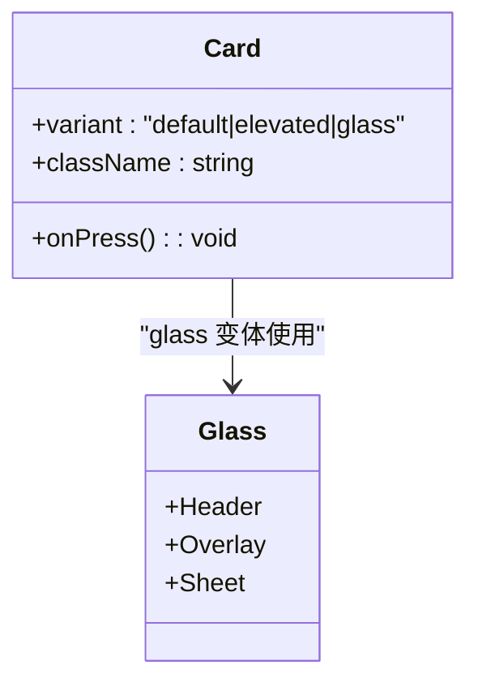
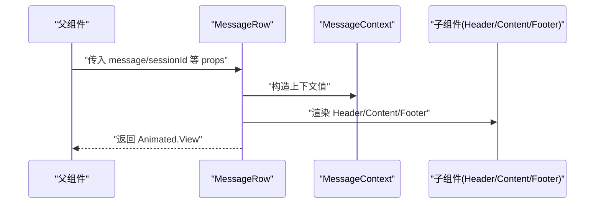
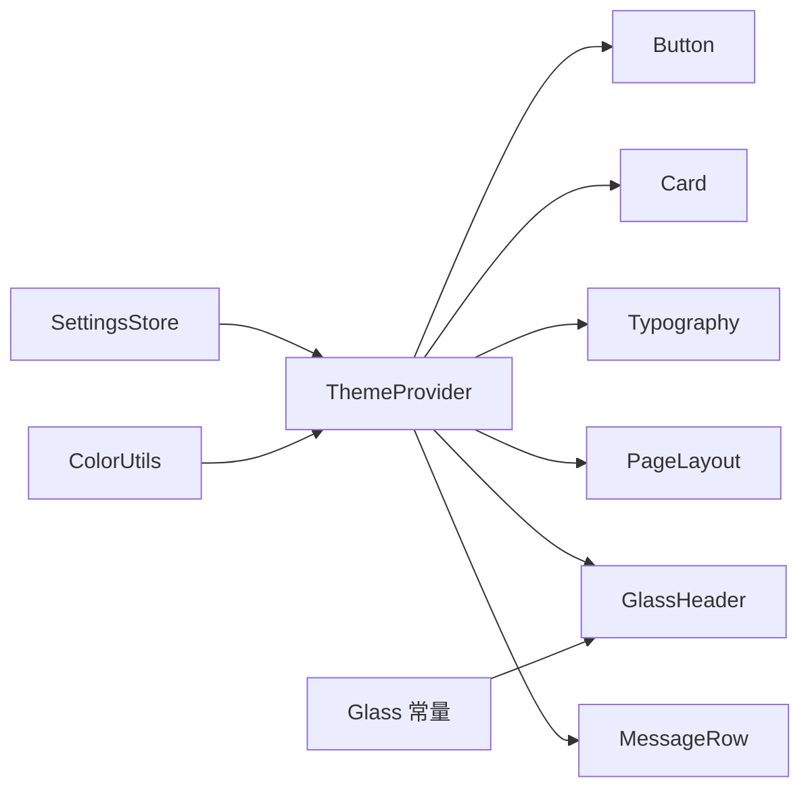

# 组件系统架构

<cite>
**本文引用的文件**
- [src/theme/ThemeProvider.tsx](file://src/theme/ThemeProvider.tsx)
- [src/theme/colors.ts](file://src/theme/colors.ts)
- [src/theme/animations.ts](file://src/theme/animations.ts)
- [src/theme/glass.ts](file://src/theme/glass.ts)
- [src/lib/color-utils.ts](file://src/lib/color-utils.ts)
- [src/store/settings-store.ts](file://src/store/settings-store.ts)
- [src/components/ui/index.ts](file://src/components/ui/index.ts)
- [src/components/ui/Button.tsx](file://src/components/ui/Button.tsx)
- [src/components/ui/Card.tsx](file://src/components/ui/Card.tsx)
- [src/components/ui/Typography.tsx](file://src/components/ui/Typography.tsx)
- [src/components/ui/PageLayout.tsx](file://src/components/ui/PageLayout.tsx)
- [src/components/ui/GlassHeader.tsx](file://src/components/ui/GlassHeader.tsx)
- [src/features/chat/components/message/MessageRow.tsx](file://src/features/chat/components/message/MessageRow.tsx)
- [src/features/settings/components/SettingsSection.tsx](file://src/features/settings/components/SettingsSection.tsx)
</cite>

## 目录
1. [引言](#引言)
2. [项目结构](#项目结构)
3. [核心组件](#核心组件)
4. [架构总览](#架构总览)
5. [详细组件分析](#详细组件分析)
6. [依赖关系分析](#依赖关系分析)
7. [性能考量](#性能考量)
8. [故障排查指南](#故障排查指南)
9. [结论](#结论)
10. [附录](#附录)

## 引言
本文件面向 Nexara 项目的组件系统，系统化阐述 UI 组件的分层设计与模块化组织原则，覆盖基础 UI 组件、功能组件与页面组件的层次结构；解释主题系统（ThemeProvider、颜色系统、动画系统）的设计与实现；说明组件间通信机制（props、事件、状态共享）；梳理组件生命周期管理；给出组件开发最佳实践与测试方法，并提供具体组件示例与使用模式。

## 项目结构
Nexara 采用“按领域/功能分层 + 组件聚合导出”的组织方式：
- 主题层：统一提供主题上下文、颜色、动画、玻璃拟态与阴影等设计令牌
- 组件层：ui 目录提供基础 UI 组件，features 目录提供业务功能组件
- 存储层：Zustand 状态管理，集中管理设置、聊天、RAG 等状态
- 页面层：应用路由下的页面组件，组合基础与功能组件

图表来源
- [src/theme/ThemeProvider.tsx:1-63](file://src/theme/ThemeProvider.tsx#L1-L63)
- [src/theme/colors.ts:1-42](file://src/theme/colors.ts#L1-L42)
- [src/theme/animations.ts:1-76](file://src/theme/animations.ts#L1-L76)
- [src/theme/glass.ts:1-187](file://src/theme/glass.ts#L1-L187)
- [src/lib/color-utils.ts:1-90](file://src/lib/color-utils.ts#L1-L90)
- [src/store/settings-store.ts:1-244](file://src/store/settings-store.ts#L1-L244)
- [src/components/ui/index.ts:1-25](file://src/components/ui/index.ts#L1-L25)
- [src/components/ui/Button.tsx:1-161](file://src/components/ui/Button.tsx#L1-L161)
- [src/components/ui/Card.tsx:1-105](file://src/components/ui/Card.tsx#L1-L105)
- [src/components/ui/Typography.tsx:1-49](file://src/components/ui/Typography.tsx#L1-L49)
- [src/components/ui/PageLayout.tsx:1-33](file://src/components/ui/PageLayout.tsx#L1-L33)
- [src/components/ui/GlassHeader.tsx:1-214](file://src/components/ui/GlassHeader.tsx#L1-L214)
- [src/features/chat/components/message/MessageRow.tsx:1-130](file://src/features/chat/components/message/MessageRow.tsx#L1-L130)
- [src/features/settings/components/SettingsSection.tsx:1-21](file://src/features/settings/components/SettingsSection.tsx#L1-L21)

章节来源
- [src/components/ui/index.ts:1-25](file://src/components/ui/index.ts#L1-L25)
- [src/theme/ThemeProvider.tsx:1-63](file://src/theme/ThemeProvider.tsx#L1-L63)

## 核心组件
本节聚焦基础 UI 组件与主题系统，阐明其职责与协作方式。

- 主题系统
  - ThemeProvider：提供主题模式（light/dark/system）、动态色板、深浅模式切换与持久化
  - 颜色系统：品牌色、状态色、灰阶/语义色常量，配合动态色板生成器
  - 动画系统：统一动画时长、配置与布局动画集合
  - 玻璃拟态与阴影：统一模糊强度、透明度、基色与阴影规范
- 基础 UI 组件
  - Button：多变体、多尺寸、加载态、动效与触觉反馈
  - Card：普通、 Elevated、Glass 三种变体，支持点击动效与模糊背景
  - Typography：标题、正文、标签等文本变体与颜色映射
  - PageLayout：页面容器，支持安全区与背景色
  - GlassHeader：毛玻璃风格顶栏，支持左右动作、副标题、遮罩与边框

章节来源
- [src/theme/ThemeProvider.tsx:1-63](file://src/theme/ThemeProvider.tsx#L1-L63)
- [src/theme/colors.ts:1-42](file://src/theme/colors.ts#L1-L42)
- [src/theme/animations.ts:1-76](file://src/theme/animations.ts#L1-L76)
- [src/theme/glass.ts:1-187](file://src/theme/glass.ts#L1-L187)
- [src/lib/color-utils.ts:1-90](file://src/lib/color-utils.ts#L1-L90)
- [src/components/ui/Button.tsx:1-161](file://src/components/ui/Button.tsx#L1-L161)
- [src/components/ui/Card.tsx:1-105](file://src/components/ui/Card.tsx#L1-L105)
- [src/components/ui/Typography.tsx:1-49](file://src/components/ui/Typography.tsx#L1-L49)
- [src/components/ui/PageLayout.tsx:1-33](file://src/components/ui/PageLayout.tsx#L1-L33)
- [src/components/ui/GlassHeader.tsx:1-214](file://src/components/ui/GlassHeader.tsx#L1-L214)

## 架构总览
组件系统围绕“主题上下文 + 设计令牌 + 组件库”的三层架构展开，主题上下文贯穿所有组件，确保全局一致的外观与交互体验。

图表来源
- [src/theme/ThemeProvider.tsx:1-63](file://src/theme/ThemeProvider.tsx#L1-L63)
- [src/theme/colors.ts:1-42](file://src/theme/colors.ts#L1-L42)
- [src/theme/animations.ts:1-76](file://src/theme/animations.ts#L1-L76)
- [src/theme/glass.ts:1-187](file://src/theme/glass.ts#L1-L187)
- [src/lib/color-utils.ts:1-90](file://src/lib/color-utils.ts#L1-L90)
- [src/store/settings-store.ts:1-244](file://src/store/settings-store.ts#L1-L244)

## 详细组件分析

### 主题系统与颜色体系
- 设计目标
  - 提供统一的主题模式与动态色板，保证品牌一致性与可访问性
  - 支持系统跟随、浅色/深色切换与持久化
- 关键实现
  - 主题上下文：暴露 theme、setTheme、isDark、colors
  - 动态色板：基于主色生成 50~900 与透明度辅助色
  - 设置持久化：通过 AsyncStorage 保存主题模式
- 使用建议
  - 所有组件应通过 useTheme 获取颜色与模式，避免硬编码色值
  - 主色通过设置中心修改，自动触发色板重建

图表来源
- [src/theme/ThemeProvider.tsx:18-54](file://src/theme/ThemeProvider.tsx#L18-L54)
- [src/store/settings-store.ts:95-104](file://src/store/settings-store.ts#L95-L104)
- [src/lib/color-utils.ts:64-89](file://src/lib/color-utils.ts#L64-L89)

章节来源
- [src/theme/ThemeProvider.tsx:1-63](file://src/theme/ThemeProvider.tsx#L1-L63)
- [src/store/settings-store.ts:1-244](file://src/store/settings-store.ts#L1-L244)
- [src/lib/color-utils.ts:1-90](file://src/lib/color-utils.ts#L1-L90)
- [src/theme/colors.ts:1-42](file://src/theme/colors.ts#L1-L42)
- [src/theme/animations.ts:1-76](file://src/theme/animations.ts#L1-L76)
- [src/theme/glass.ts:1-187](file://src/theme/glass.ts#L1-L187)

### 基础 UI 组件：Button
- 职责与特性
  - 多变体（primary/secondary/ghost/outline/danger）、多尺寸、加载态、图标与文本组合
  - 动效：按压缩放（Spring）、触觉反馈、禁用态与透明度控制
  - 主题集成：根据主题模式与变体选择文本/背景色
- 设计原则
  - 通过 useTheme 获取颜色，避免硬编码
  - 使用 AnimatedPressable 实现轻量动效
  - 保持最小可用接口，通过 className/style 扩展

图表来源
- [src/components/ui/Button.tsx:13-25](file://src/components/ui/Button.tsx#L13-L25)
- [src/theme/ThemeProvider.tsx:9-14](file://src/theme/ThemeProvider.tsx#L9-L14)

章节来源
- [src/components/ui/Button.tsx:1-161](file://src/components/ui/Button.tsx#L1-L161)
- [src/theme/ThemeProvider.tsx:1-63](file://src/theme/ThemeProvider.tsx#L1-L63)

### 基础 UI 组件：Card
- 职责与特性
  - 三种变体：default/elevated/glass
  - 支持点击动效与按压缩放
  - Glass 变体内置模糊视图与半透明背景
- 设计原则
  - 通过 useTheme 控制边框与背景
  - 按需启用 onPress，统一动效与触觉反馈

图表来源
- [src/components/ui/Card.tsx:14-18](file://src/components/ui/Card.tsx#L14-L18)
- [src/theme/glass.ts:12-68](file://src/theme/glass.ts#L12-L68)

章节来源
- [src/components/ui/Card.tsx:1-105](file://src/components/ui/Card.tsx#L1-L105)
- [src/theme/glass.ts:1-187](file://src/theme/glass.ts#L1-L187)

### 基础 UI 组件：Typography
- 职责与特性
  - 文本变体（largeTitle/h1/h2/h3/body/label/sectionHeader/caption）
  - 文本颜色映射（primary/secondary/tertiary/brand/danger）
- 设计原则
  - 通过变体与颜色类名组合，保证一致性与可维护性

章节来源
- [src/components/ui/Typography.tsx:1-49](file://src/components/ui/Typography.tsx#L1-L49)

### 基础 UI 组件：PageLayout
- 职责与特性
  - 页面容器，支持安全区与背景色
  - 在 Tab 导航场景中减少状态重渲染带来的副作用
- 设计原则
  - 简洁封装，避免多余嵌套

章节来源
- [src/components/ui/PageLayout.tsx:1-33](file://src/components/ui/PageLayout.tsx#L1-L33)

### 基础 UI 组件：GlassHeader
- 职责与特性
  - 毛玻璃顶栏，支持左右动作、副标题、遮罩与边框
  - 集成防双击与触觉反馈
- 设计原则
  - 通过 Glass 常量统一模糊与透明度
  - 保持可扩展性（headerRight 自定义区域）

章节来源
- [src/components/ui/GlassHeader.tsx:1-214](file://src/components/ui/GlassHeader.tsx#L1-L214)
- [src/theme/glass.ts:1-187](file://src/theme/glass.ts#L1-L187)

### 功能组件：消息行 MessageRow
- 职责与特性
  - 负责单条消息的渲染与交互，包含头部、内容、底部与上下文菜单
  - 通过 MessageContext 共享上下文数据与回调
  - 集成动画进入/退出、本地状态与外部状态（Zustand）
- 设计原则
  - 使用 React.memo 降低重渲染
  - 通过 useMemo 优化派生状态
  - 将复杂逻辑拆分为子组件，提升可维护性

图表来源
- [src/features/chat/components/message/MessageRow.tsx:19-38](file://src/features/chat/components/message/MessageRow.tsx#L19-L38)
- [src/features/chat/components/message/MessageRow.tsx:70-90](file://src/features/chat/components/message/MessageRow.tsx#L70-L90)

章节来源
- [src/features/chat/components/message/MessageRow.tsx:1-130](file://src/features/chat/components/message/MessageRow.tsx#L1-L130)

### 页面组件：设置分组 SettingsSection
- 职责与特性
  - 将设置项组织为带标题的卡片分组
  - 内部组合 SettingsCard 与 SettingsSectionHeader
- 设计原则
  - 通过组合而非继承实现复用
  - 保持最小接口，便于扩展

章节来源
- [src/features/settings/components/SettingsSection.tsx:1-21](file://src/features/settings/components/SettingsSection.tsx#L1-L21)
- [src/components/ui/index.ts:18-25](file://src/components/ui/index.ts#L18-L25)

## 依赖关系分析
- 组件对主题的依赖
  - Button、Card、Typography、PageLayout、GlassHeader、MessageRow 均依赖 useTheme 获取颜色与模式
- 主题对存储的依赖
  - ThemeProvider 读取 SettingsStore 中的 accentColor 并持久化主题模式
- 主题内部依赖
  - ThemeProvider 依赖 color-utils 生成动态色板
  - GlassHeader 依赖 glass 常量进行模糊与透明度配置

图表来源
- [src/store/settings-store.ts:1-244](file://src/store/settings-store.ts#L1-L244)
- [src/theme/ThemeProvider.tsx:1-63](file://src/theme/ThemeProvider.tsx#L1-L63)
- [src/lib/color-utils.ts:1-90](file://src/lib/color-utils.ts#L1-L90)
- [src/theme/glass.ts:1-187](file://src/theme/glass.ts#L1-L187)
- [src/components/ui/Button.tsx:1-161](file://src/components/ui/Button.tsx#L1-L161)
- [src/components/ui/Card.tsx:1-105](file://src/components/ui/Card.tsx#L1-L105)
- [src/components/ui/Typography.tsx:1-49](file://src/components/ui/Typography.tsx#L1-L49)
- [src/components/ui/PageLayout.tsx:1-33](file://src/components/ui/PageLayout.tsx#L1-L33)
- [src/components/ui/GlassHeader.tsx:1-214](file://src/components/ui/GlassHeader.tsx#L1-L214)
- [src/features/chat/components/message/MessageRow.tsx:1-130](file://src/features/chat/components/message/MessageRow.tsx#L1-L130)

章节来源
- [src/theme/ThemeProvider.tsx:1-63](file://src/theme/ThemeProvider.tsx#L1-L63)
- [src/store/settings-store.ts:1-244](file://src/store/settings-store.ts#L1-L244)
- [src/lib/color-utils.ts:1-90](file://src/lib/color-utils.ts#L1-L90)
- [src/theme/glass.ts:1-187](file://src/theme/glass.ts#L1-L187)

## 性能考量
- 渲染优化
  - 使用 React.memo 包裹重型消息行组件，减少重渲染
  - 使用 useMemo 缓存派生状态与样式计算
- 动效与触觉
  - 使用 Reanimated 的 Spring 动效与触觉反馈，避免主线程阻塞
- 主题与样式
  - 通过 useTheme 消费主题，避免重复计算颜色与样式
- 存储与持久化
  - SettingsStore 使用持久化中间件，减少启动时初始化成本

章节来源
- [src/features/chat/components/message/MessageRow.tsx:40-40](file://src/features/chat/components/message/MessageRow.tsx#L40-L40)
- [src/features/chat/components/message/MessageRow.tsx:56-68](file://src/features/chat/components/message/MessageRow.tsx#L56-L68)
- [src/components/ui/Button.tsx:89-103](file://src/components/ui/Button.tsx#L89-L103)
- [src/components/ui/Card.tsx:47-61](file://src/components/ui/Card.tsx#L47-L61)
- [src/store/settings-store.ts:208-243](file://src/store/settings-store.ts#L208-L243)

## 故障排查指南
- 主题切换无效
  - 检查 ThemeProvider 是否包裹根节点
  - 确认 setTheme 调用与 AsyncStorage 写入是否成功
- 动态色板异常
  - 校验 accentColor 是否为合法十六进制色值
  - 确认 generatePalette 返回的色阶是否符合预期
- 毛玻璃效果不明显
  - 检查 Glass 常量与平台差异（Android 模糊强度限制）
  - 确认遮罩透明度与背景色配置
- 动效卡顿
  - 确保使用 useAnimatedStyle 与 SharedValue
  - 避免在动画回调中执行耗时操作

章节来源
- [src/theme/ThemeProvider.tsx:25-45](file://src/theme/ThemeProvider.tsx#L25-L45)
- [src/store/settings-store.ts:95-104](file://src/store/settings-store.ts#L95-L104)
- [src/lib/color-utils.ts:64-89](file://src/lib/color-utils.ts#L64-L89)
- [src/theme/glass.ts:17-27](file://src/theme/glass.ts#L17-L27)
- [src/components/ui/Button.tsx:89-107](file://src/components/ui/Button.tsx#L89-L107)
- [src/components/ui/Card.tsx:63-65](file://src/components/ui/Card.tsx#L63-L65)

## 结论
Nexara 的组件系统通过“主题上下文 + 设计令牌 + 组件库”的分层架构，实现了跨页面的一致性与可维护性。基础 UI 组件承担通用职责，功能组件聚焦业务场景，页面组件负责编排。主题系统以动态色板为核心，结合动画与玻璃拟态，形成统一的视觉与交互语言。通过 Zustand 状态管理与合理的依赖关系，组件间通信清晰、性能可控。

## 附录

### 组件通信机制
- Props 传递
  - 基础组件通过 variant/size/loading/disabled 等属性控制外观与行为
  - 功能组件通过 sessionId、message 等属性承载业务数据
- 事件处理
  - Button、Card、GlassHeader 等组件提供 onPress 回调，统一触觉反馈
- 状态共享
  - ThemeProvider 提供全局主题状态
  - MessageRow 通过 Context 共享消息相关上下文
  - SettingsStore 提供设置与偏好状态

章节来源
- [src/components/ui/Button.tsx:13-25](file://src/components/ui/Button.tsx#L13-L25)
- [src/components/ui/Card.tsx:14-18](file://src/components/ui/Card.tsx#L14-L18)
- [src/components/ui/GlassHeader.tsx:17-38](file://src/components/ui/GlassHeader.tsx#L17-L38)
- [src/features/chat/components/message/MessageRow.tsx:6-18](file://src/features/chat/components/message/MessageRow.tsx#L6-L18)
- [src/theme/ThemeProvider.tsx:9-14](file://src/theme/ThemeProvider.tsx#L9-L14)

### 组件生命周期管理
- 挂载
  - ThemeProvider 在首次渲染时读取持久化主题并初始化颜色
  - PageLayout 在 safeArea 场景下正确包裹内容
- 更新
  - Button/Card 使用 SharedValue 管理动画状态，响应 props 变更
  - MessageRow 使用 memo 与 useMemo 降低更新频率
- 卸载
  - 组件内部无特殊清理逻辑，遵循 React 生命周期

章节来源
- [src/theme/ThemeProvider.tsx:25-38](file://src/theme/ThemeProvider.tsx#L25-L38)
- [src/components/ui/Button.tsx:89-107](file://src/components/ui/Button.tsx#L89-L107)
- [src/components/ui/Card.tsx:47-61](file://src/components/ui/Card.tsx#L47-L61)
- [src/features/chat/components/message/MessageRow.tsx:40-40](file://src/features/chat/components/message/MessageRow.tsx#L40-L40)

### 组件开发最佳实践
- 设计原则
  - 单一职责：每个组件聚焦一个功能点
  - 最小接口：通过 className/style 扩展，避免过度 props
  - 可组合：通过子组件与 Context 组合实现复杂 UI
- 样式管理
  - 使用 Tailwind 类名与 twMerge 合并
  - 通过 useTheme 获取颜色，避免硬编码
- 性能优化
  - 对重型组件使用 memo
  - 使用 useMemo 缓存派生状态
  - 使用 Reanimated 进行动效
- 测试方法
  - 单元测试：针对 props 与状态变化的边界条件
  - 组件快照：验证渲染一致性
  - 用户交互测试：验证动效与触觉反馈

### 组件示例与使用模式
- 基础组件
  - Button：多变体与尺寸组合，加载态与图标
  - Card：普通与 Glass 变体，点击动效
  - Typography：标题与正文变体，颜色映射
  - PageLayout：安全区与背景色
  - GlassHeader：左右动作与副标题
- 功能组件
  - MessageRow：消息渲染与上下文共享
- 页面组件
  - SettingsSection：设置项分组

章节来源
- [src/components/ui/Button.tsx:1-161](file://src/components/ui/Button.tsx#L1-L161)
- [src/components/ui/Card.tsx:1-105](file://src/components/ui/Card.tsx#L1-L105)
- [src/components/ui/Typography.tsx:1-49](file://src/components/ui/Typography.tsx#L1-L49)
- [src/components/ui/PageLayout.tsx:1-33](file://src/components/ui/PageLayout.tsx#L1-L33)
- [src/components/ui/GlassHeader.tsx:1-214](file://src/components/ui/GlassHeader.tsx#L1-L214)
- [src/features/chat/components/message/MessageRow.tsx:1-130](file://src/features/chat/components/message/MessageRow.tsx#L1-L130)
- [src/features/settings/components/SettingsSection.tsx:1-21](file://src/features/settings/components/SettingsSection.tsx#L1-L21)