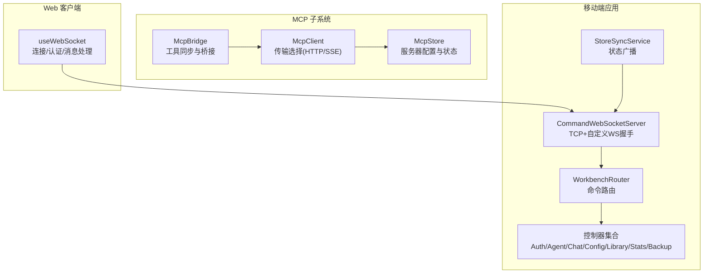
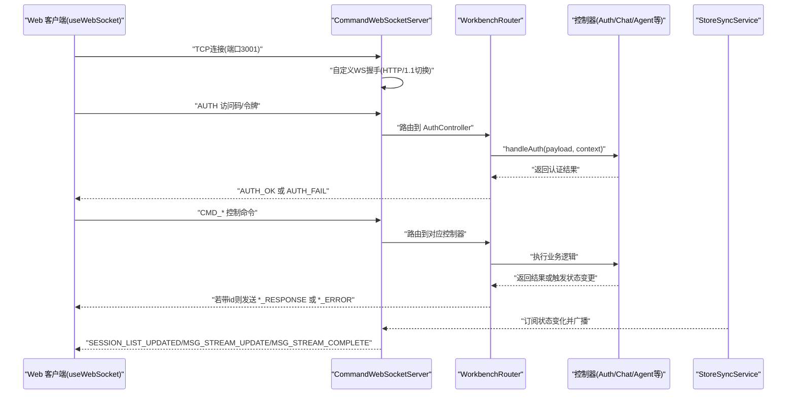
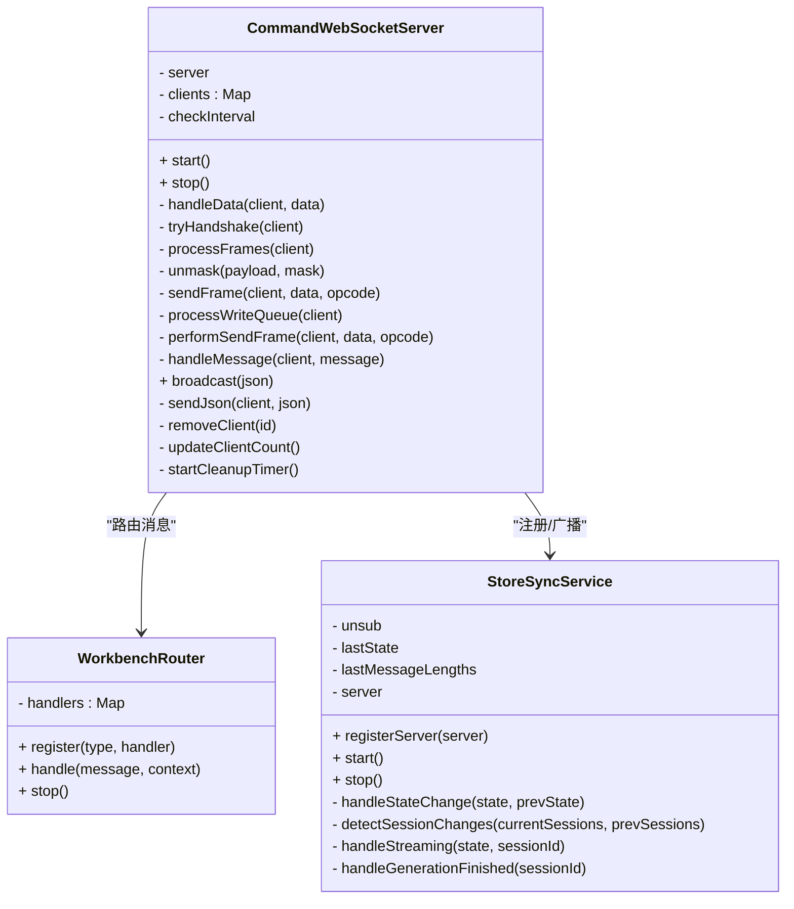
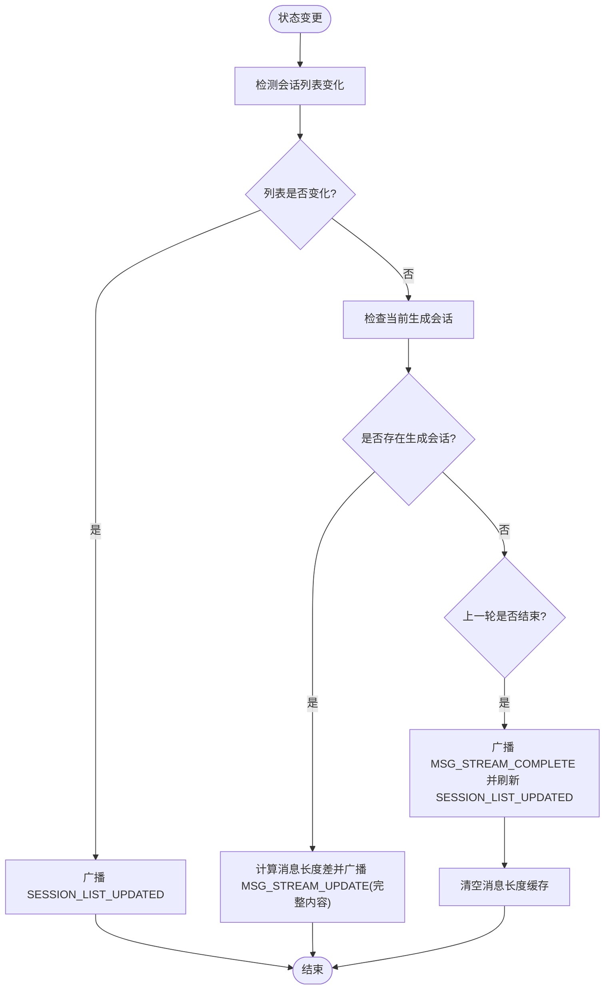
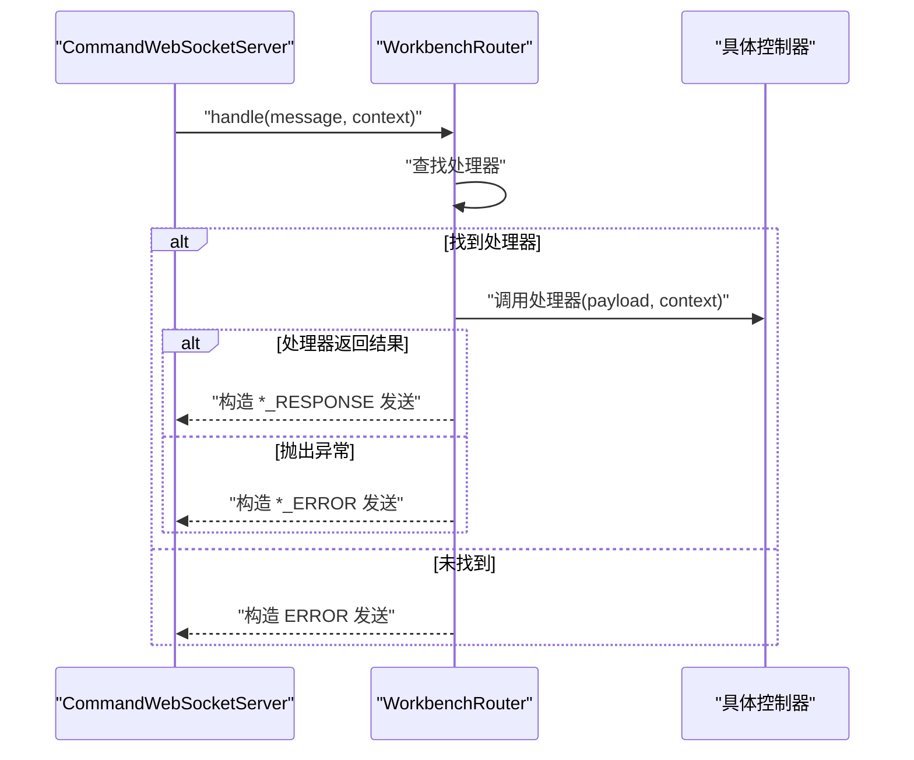
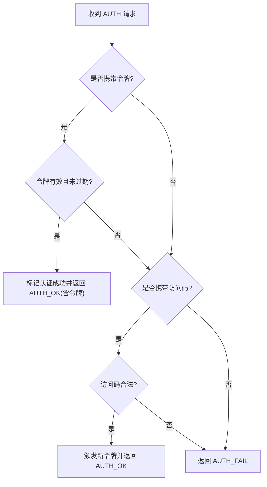
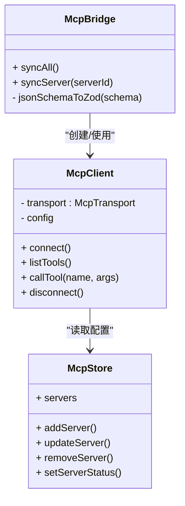
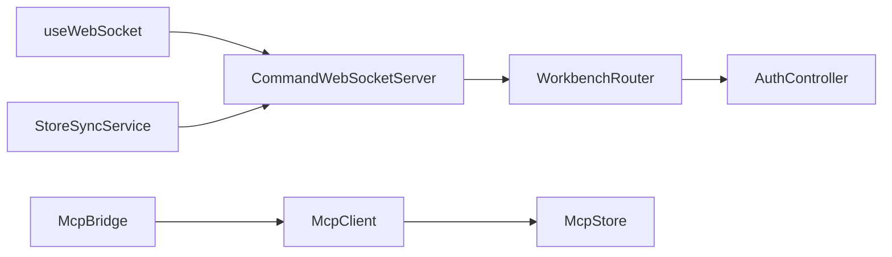

# 通信架构

<cite>
**本文引用的文件**
- [CommandWebSocketServer.ts](file://src/services/workbench/CommandWebSocketServer.ts)
- [StoreSyncService.ts](file://src/services/workbench/StoreSyncService.ts)
- [WorkbenchRouter.ts](file://src/services/workbench/WorkbenchRouter.ts)
- [AuthController.ts](file://src/services/workbench/controllers/AuthController.ts)
- [mcp-bridge.ts](file://src/lib/mcp/mcp-bridge.ts)
- [mcp-client.ts](file://src/lib/mcp/mcp-client.ts)
- [mcp-store.ts](file://src/store/mcp-store.ts)
- [useWebSocket.ts](file://web-client/src/hooks/useWebSocket.ts)
</cite>

## 目录
1. [引言](#引言)
2. [项目结构](#项目结构)
3. [核心组件](#核心组件)
4. [架构总览](#架构总览)
5. [详细组件分析](#详细组件分析)
6. [依赖关系分析](#依赖关系分析)
7. [性能考量](#性能考量)
8. [故障排查指南](#故障排查指南)
9. [结论](#结论)
10. [附录](#附录)

## 引言
本文件面向 Nexara 项目的通信架构，聚焦以下主题：
- 基于 TCP 的自定义 WebSocket 服务端实现与控制面命令交互
- 实时状态同步与流式更新机制
- MCP 协议的传输层抽象与桥接策略
- 流式数据处理与错误恢复思路
- 扩展指南（新增协议、性能优化、安全加固）
- 典型通信示例与调试方法

## 项目结构
本项目通信相关代码主要分布在如下位置：
- 服务端通信与路由：src/services/workbench
- MCP 协议桥接与传输：src/lib/mcp 与 src/store/mcp-store.ts
- Web 客户端 WebSocket 客户端：web-client/src/hooks/useWebSocket.ts

图表来源
- [CommandWebSocketServer.ts:1-488](file://src/services/workbench/CommandWebSocketServer.ts#L1-L488)
- [WorkbenchRouter.ts:1-75](file://src/services/workbench/WorkbenchRouter.ts#L1-L75)
- [StoreSyncService.ts:1-127](file://src/services/workbench/StoreSyncService.ts#L1-L127)
- [mcp-bridge.ts:1-202](file://src/lib/mcp/mcp-bridge.ts#L1-L202)
- [mcp-client.ts:1-52](file://src/lib/mcp/mcp-client.ts#L1-L52)
- [mcp-store.ts:1-72](file://src/store/mcp-store.ts#L1-L72)
- [useWebSocket.ts:1-115](file://web-client/src/hooks/useWebSocket.ts#L1-L115)

章节来源
- [CommandWebSocketServer.ts:1-488](file://src/services/workbench/CommandWebSocketServer.ts#L1-L488)
- [WorkbenchRouter.ts:1-75](file://src/services/workbench/WorkbenchRouter.ts#L1-L75)
- [StoreSyncService.ts:1-127](file://src/services/workbench/StoreSyncService.ts#L1-L127)
- [mcp-bridge.ts:1-202](file://src/lib/mcp/mcp-bridge.ts#L1-L202)
- [mcp-client.ts:1-52](file://src/lib/mcp/mcp-client.ts#L1-L52)
- [mcp-store.ts:1-72](file://src/store/mcp-store.ts#L1-L72)
- [useWebSocket.ts:1-115](file://web-client/src/hooks/useWebSocket.ts#L1-L115)

## 核心组件
- CommandWebSocketServer：基于 TCP 的自定义 WebSocket 服务端，负责握手、帧解析、消息路由、写队列与心跳清理。
- WorkbenchRouter：命令路由分发器，将消息类型映射到具体控制器处理，并统一响应/错误包装。
- StoreSyncService：订阅应用状态变化，按需广播会话列表变更、流式消息增量更新与生成完成事件。
- AuthController：认证控制器，支持访问码与令牌两种方式，维护活动令牌过期清理。
- McpBridge/McpClient：MCP 工具同步与调用桥接，支持 HTTP 与 SSE 两种传输，动态注册本地技能。
- useWebSocket：Web 客户端连接与消息处理钩子，负责认证、流式消息拼接与状态管理。

章节来源
- [CommandWebSocketServer.ts:33-178](file://src/services/workbench/CommandWebSocketServer.ts#L33-L178)
- [WorkbenchRouter.ts:18-72](file://src/services/workbench/WorkbenchRouter.ts#L18-L72)
- [StoreSyncService.ts:5-32](file://src/services/workbench/StoreSyncService.ts#L5-L32)
- [AuthController.ts:17-54](file://src/services/workbench/controllers/AuthController.ts#L17-L54)
- [mcp-bridge.ts:10-37](file://src/lib/mcp/mcp-bridge.ts#L10-L37)
- [mcp-client.ts:6-21](file://src/lib/mcp/mcp-client.ts#L6-L21)
- [useWebSocket.ts:11-92](file://web-client/src/hooks/useWebSocket.ts#L11-L92)

## 架构总览
下图展示从 Web 客户端到服务端命令处理与状态广播的整体流程：

图表来源
- [useWebSocket.ts:16-92](file://web-client/src/hooks/useWebSocket.ts#L16-L92)
- [CommandWebSocketServer.ts:44-178](file://src/services/workbench/CommandWebSocketServer.ts#L44-L178)
- [WorkbenchRouter.ts:34-71](file://src/services/workbench/WorkbenchRouter.ts#L34-L71)
- [AuthController.ts:18-53](file://src/services/workbench/controllers/AuthController.ts#L18-L53)
- [StoreSyncService.ts:34-48](file://src/services/workbench/StoreSyncService.ts#L34-L48)

## 详细组件分析

### CommandWebSocketServer 组件分析
- 连接管理
  - 使用 TCP 服务监听端口，为每个连接分配唯一标识与缓冲区，记录握手状态、认证状态、写队列与心跳时间。
  - 提供连接清理定时器，超时未心跳的客户端会被销毁并移除。
- 消息路由
  - 在握手完成后进入帧解析阶段，支持文本与 Ping/Pong，Close 帧会主动关闭连接。
  - 支持大包分片写入，采用固定分片大小与 base64 编码跨 RN 桥传输，保证可靠性。
- 写队列与并发
  - 写操作入队并串行执行，避免竞态；当底层 socket drain 时才继续，必要时设置超时兜底。
- 广播与心跳
  - 广播仅对已认证且握手完成的客户端生效；心跳超时清理保障资源回收。

图表来源
- [CommandWebSocketServer.ts:33-488](file://src/services/workbench/CommandWebSocketServer.ts#L33-L488)
- [WorkbenchRouter.ts:18-72](file://src/services/workbench/WorkbenchRouter.ts#L18-L72)
- [StoreSyncService.ts:5-127](file://src/services/workbench/StoreSyncService.ts#L5-L127)

章节来源
- [CommandWebSocketServer.ts:44-178](file://src/services/workbench/CommandWebSocketServer.ts#L44-L178)
- [CommandWebSocketServer.ts:192-297](file://src/services/workbench/CommandWebSocketServer.ts#L192-L297)
- [CommandWebSocketServer.ts:307-413](file://src/services/workbench/CommandWebSocketServer.ts#L307-L413)
- [CommandWebSocketServer.ts:446-484](file://src/services/workbench/CommandWebSocketServer.ts#L446-L484)

### StoreSyncService 组件分析
- 订阅与差异检测
  - 订阅聊天状态，检测会话列表变化（长度、ID 序列、标题等），必要时广播“列表已更新”信号。
- 流式更新
  - 当存在正在生成的会话时，跟踪最后一条助手消息的长度变化，周期性广播完整内容以确保一致性。
- 结束通知
  - 生成结束后广播完成事件，并刷新会话列表（因最后一条消息与更新时间已定）。
- 缓存清理
  - 清空消息长度缓存，避免后续重复广播。

图表来源
- [StoreSyncService.ts:34-123](file://src/services/workbench/StoreSyncService.ts#L34-L123)

章节来源
- [StoreSyncService.ts:15-32](file://src/services/workbench/StoreSyncService.ts#L15-L32)
- [StoreSyncService.ts:79-107](file://src/services/workbench/StoreSyncService.ts#L79-L107)
- [StoreSyncService.ts:109-123](file://src/services/workbench/StoreSyncService.ts#L109-L123)

### WorkbenchRouter 组件分析
- 注册与分发
  - 通过类型字符串注册处理器，处理时根据是否存在请求 id 自动封装响应或错误消息。
- 错误处理
  - 捕获控制器抛出异常，统一返回 *_ERROR 消息；未知命令返回 ERROR。

图表来源
- [WorkbenchRouter.ts:34-71](file://src/services/workbench/WorkbenchRouter.ts#L34-L71)

章节来源
- [WorkbenchRouter.ts:21-28](file://src/services/workbench/WorkbenchRouter.ts#L21-L28)
- [WorkbenchRouter.ts:42-71](file://src/services/workbench/WorkbenchRouter.ts#L42-L71)

### 认证流程（AuthController）
- 令牌验证优先：若令牌有效且未过期，直接认证通过并返回令牌。
- 访问码校验：支持常规访问码与开发回退码，通过后颁发新令牌并记录过期时间。
- 定时清理：每小时扫描一次活动令牌，移除过期项。

图表来源
- [AuthController.ts:18-53](file://src/services/workbench/controllers/AuthController.ts#L18-L53)

章节来源
- [AuthController.ts:6-15](file://src/services/workbench/controllers/AuthController.ts#L6-L15)
- [AuthController.ts:18-53](file://src/services/workbench/controllers/AuthController.ts#L18-L53)

### MCP 协议传输层设计
- 传输选择
  - McpClient 根据配置选择 HTTP 或 SSE 传输，默认向后兼容 HTTP。
- 工具同步
  - McpBridge 遍历启用的服务器，逐一拉取工具清单，覆盖式同步本地技能注册表，并将输入 Schema 转换为 Zod 校验。
- 调用执行
  - 每次工具调用新建客户端连接，执行后立即断开，实现无状态原子调用。
- 状态管理
  - McpStore 维护服务器列表、状态与错误信息，提供 CRUD 与状态更新接口。

图表来源
- [mcp-client.ts:6-51](file://src/lib/mcp/mcp-client.ts#L6-L51)
- [mcp-bridge.ts:14-129](file://src/lib/mcp/mcp-bridge.ts#L14-L129)
- [mcp-store.ts:32-71](file://src/store/mcp-store.ts#L32-L71)

章节来源
- [mcp-client.ts:10-21](file://src/lib/mcp/mcp-client.ts#L10-L21)
- [mcp-bridge.ts:14-129](file://src/lib/mcp/mcp-bridge.ts#L14-L129)
- [mcp-store.ts:6-18](file://src/store/mcp-store.ts#L6-L18)

### 流式数据处理机制
- 客户端侧
  - Web 客户端在收到流式片段时，将内容追加到最后一段助手消息中，形成逐步渲染体验。
- 服务端侧
  - StoreSyncService 周期性比较消息长度，若发生变化则广播完整内容，确保一致性与幂等。
- 分片与可靠性
  - 服务端写入采用固定分片大小与 base64 编码，结合 drain 事件与超时兜底，提升跨 RN 桥传输的稳定性。

章节来源
- [useWebSocket.ts:64-87](file://web-client/src/hooks/useWebSocket.ts#L64-L87)
- [StoreSyncService.ts:79-107](file://src/services/workbench/StoreSyncService.ts#L79-L107)
- [CommandWebSocketServer.ts:370-413](file://src/services/workbench/CommandWebSocketServer.ts#L370-L413)

## 依赖关系分析
- 服务端
  - CommandWebSocketServer 依赖 WorkbenchRouter 与 StoreSyncService，控制器通过 Router 注册。
- 认证链路
  - Web 客户端通过 useWebSocket 发起认证，服务端由 AuthController 处理。
- MCP 子系统
  - McpBridge 依赖 McpClient 与 McpStore；McpClient 根据配置选择传输实现。

图表来源
- [useWebSocket.ts:16-92](file://web-client/src/hooks/useWebSocket.ts#L16-L92)
- [CommandWebSocketServer.ts:38-40](file://src/services/workbench/CommandWebSocketServer.ts#L38-L40)
- [WorkbenchRouter.ts:135-167](file://src/services/workbench/WorkbenchRouter.ts#L135-L167)
- [AuthController.ts:18-53](file://src/services/workbench/controllers/AuthController.ts#L18-L53)
- [StoreSyncService.ts:39-40](file://src/services/workbench/StoreSyncService.ts#L39-L40)
- [mcp-bridge.ts:14-37](file://src/lib/mcp/mcp-bridge.ts#L14-L37)
- [mcp-client.ts:10-21](file://src/lib/mcp/mcp-client.ts#L10-L21)
- [mcp-store.ts:32-71](file://src/store/mcp-store.ts#L32-L71)

章节来源
- [CommandWebSocketServer.ts:135-167](file://src/services/workbench/CommandWebSocketServer.ts#L135-L167)
- [WorkbenchRouter.ts:18-32](file://src/services/workbench/WorkbenchRouter.ts#L18-L32)
- [StoreSyncService.ts:11-13](file://src/services/workbench/StoreSyncService.ts#L11-L13)
- [mcp-bridge.ts:14-37](file://src/lib/mcp/mcp-bridge.ts#L14-L37)
- [mcp-client.ts:10-21](file://src/lib/mcp/mcp-client.ts#L10-L21)
- [mcp-store.ts:32-71](file://src/store/mcp-store.ts#L32-L71)

## 性能考量
- 写入可靠性
  - 固定分片大小与 base64 编码有助于跨 RN 桥稳定传输；drain 事件与超时兜底降低阻塞风险。
- 广播策略
  - StoreSyncService 对频繁的“最后消息更新”采用完整内容广播，简化客户端一致性处理；可按需引入增量更新以节省带宽。
- 心跳与清理
  - 定时清理长时间无心跳的连接，避免资源泄漏；建议根据网络环境调整超时阈值。
- MCP 调用
  - 工具调用采用即时连接/断开模式，适合无状态原子操作；若存在长耗时场景，可评估复用连接并增加重连/熔断策略。

## 故障排查指南
- 无法连接服务端
  - 检查端口占用与防火墙；服务端启动时若端口被占用会自动重试，观察日志中的重试提示。
- 握手失败
  - 确认客户端发送了完整的头部并包含有效的密钥字段；服务端会在缺失时主动关闭连接。
- 认证失败
  - 核对访问码或令牌有效期；令牌过期会触发清理；确认客户端已保存并回传令牌。
- 写入异常
  - 观察“Failed to write to socket”警告；通常为对端断开或桥接问题；检查分片与 drain 事件处理。
- 流式显示异常
  - 确认服务端广播的是完整内容而非增量；客户端会将新片段追加到最后一段助手消息。

章节来源
- [CommandWebSocketServer.ts:113-130](file://src/services/workbench/CommandWebSocketServer.ts#L113-L130)
- [CommandWebSocketServer.ts:203-239](file://src/services/workbench/CommandWebSocketServer.ts#L203-L239)
- [AuthController.ts:25-53](file://src/services/workbench/controllers/AuthController.ts#L25-L53)
- [CommandWebSocketServer.ts:389-412](file://src/services/workbench/CommandWebSocketServer.ts#L389-L412)
- [useWebSocket.ts:64-87](file://web-client/src/hooks/useWebSocket.ts#L64-L87)

## 结论
本通信架构以 CommandWebSocketServer 为核心，结合 WorkbenchRouter 与 StoreSyncService 实现了可靠的控制面命令交互与实时状态同步；MCP 子系统通过 McpBridge/McpClient 提供灵活的外部工具接入能力。整体设计在本地局域网环境下兼顾了可靠性与易用性，同时为后续扩展（如新增协议、性能优化与安全加固）提供了清晰的切入点。

## 附录

### 通信示例与调试方法
- Web 客户端连接与认证
  - 使用 useWebSocket 钩子发起连接，连接成功后立即发送认证请求；认证成功后保存访问码以便后续会话复用。
- 控制命令发送
  - 认证通过后发送 CMD_* 类型命令；若命令带有 id，服务端会返回 *_RESPONSE 或 *_ERROR。
- 流式消息处理
  - 服务端广播完整内容，客户端将其追加到最后一段助手消息；注意区分不同消息类型以正确渲染。
- 调试要点
  - 查看服务端日志中的握手、写入与清理信息；确认客户端状态机（未连接/连接中/已连接/已认证/认证失败/断开）变化。
  - 若出现连接抖动，检查端口占用与网络环境；对于 MCP 调用失败，核对服务器配置与传输类型。

章节来源
- [useWebSocket.ts:16-92](file://web-client/src/hooks/useWebSocket.ts#L16-L92)
- [CommandWebSocketServer.ts:44-178](file://src/services/workbench/CommandWebSocketServer.ts#L44-L178)
- [WorkbenchRouter.ts:47-71](file://src/services/workbench/WorkbenchRouter.ts#L47-L71)
- [StoreSyncService.ts:79-107](file://src/services/workbench/StoreSyncService.ts#L79-L107)