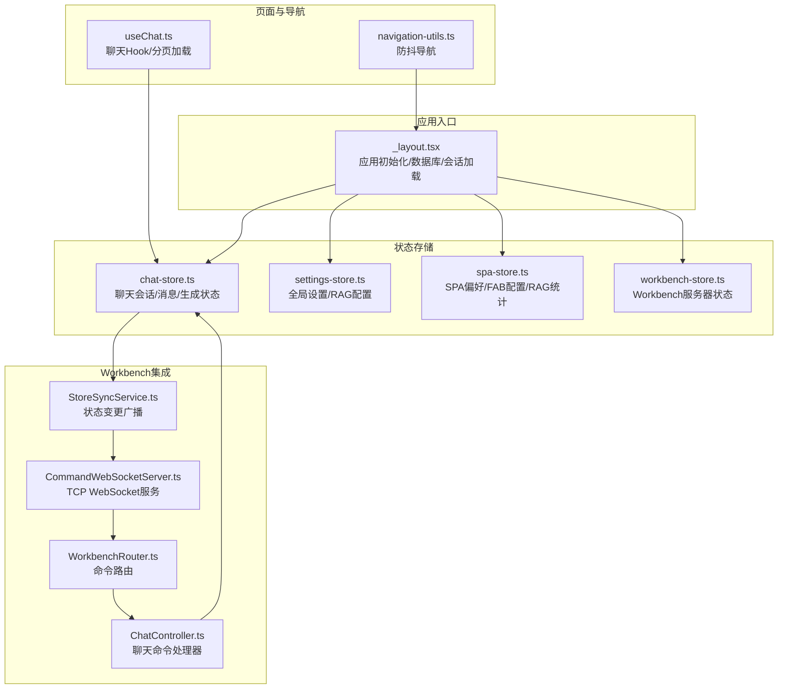
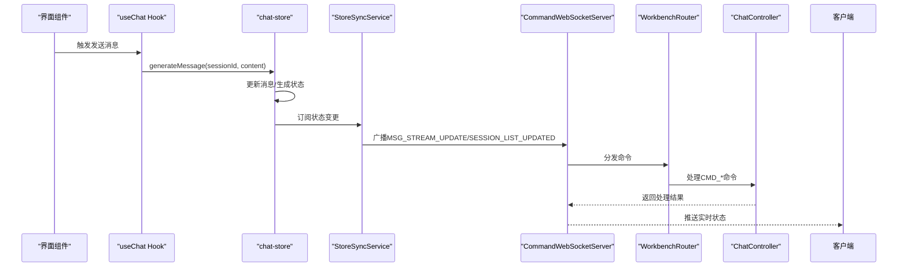
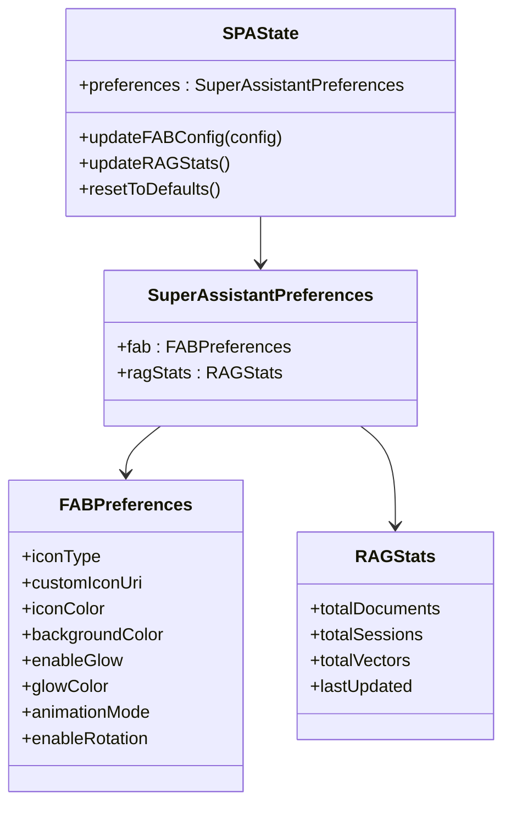
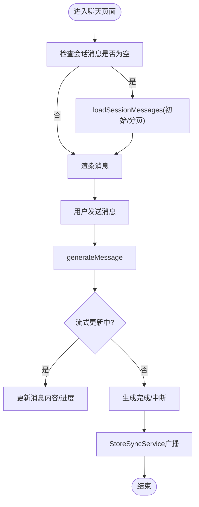
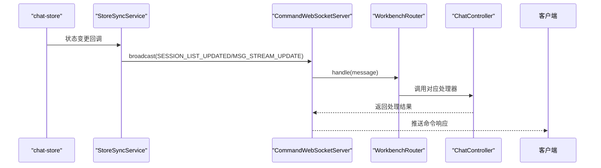
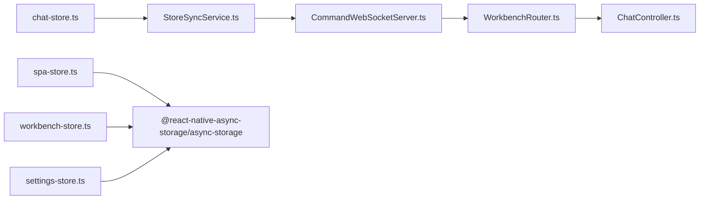

# SPA状态管理

<cite>
**本文档引用的文件**
- [spa-store.ts](file://src/store/spa-store.ts)
- [super-assistant.ts](file://src/types/super-assistant.ts)
- [chat-store.ts](file://src/store/chat-store.ts)
- [settings-store.ts](file://src/store/settings-store.ts)
- [workbench-store.ts](file://src/store/workbench-store.ts)
- [StoreSyncService.ts](file://src/services/workbench/StoreSyncService.ts)
- [WorkbenchRouter.ts](file://src/services/workbench/WorkbenchRouter.ts)
- [CommandWebSocketServer.ts](file://src/services/workbench/CommandWebSocketServer.ts)
- [ChatController.ts](file://src/services/workbench/controllers/ChatController.ts)
- [_layout.tsx](file://app/_layout.tsx)
- [useChat.ts](file://src/features/chat/hooks/useChat.ts)
- [navigation-utils.ts](file://src/lib/navigation-utils.ts)
</cite>

## 目录
1. [简介](#简介)
2. [项目结构](#项目结构)
3. [核心组件](#核心组件)
4. [架构总览](#架构总览)
5. [详细组件分析](#详细组件分析)
6. [依赖关系分析](#依赖关系分析)
7. [性能考量](#性能考量)
8. [故障排查指南](#故障排查指南)
9. [结论](#结论)
10. [附录](#附录)

## 简介
本文件面向Nexara SPA（单页应用）状态管理系统，系统性阐述SPA状态的架构设计与实现策略，涵盖路由状态、页面状态与应用状态的管理；说明SPA状态与Workbench系统的集成机制（状态同步与数据交换）；解释SPA状态的持久化策略、状态恢复与导航控制机制；提供SPA状态的扩展方法与自定义路由的实现指南；并给出性能优化与用户体验改进建议。

## 项目结构
Nexara采用基于Zustand的状态管理方案，结合SQLite数据库与本地持久化，形成“内存态+持久化”的双层状态体系。核心目录与职责如下：
- 应用入口与初始化：通过应用根布局进行数据库初始化、会话加载与后台任务注册，确保SPA启动即具备可用状态。
- 状态存储：以Zustand为核心，按功能域划分多个store（聊天、设置、SPA偏好、Workbench等），每个store独立持久化。
- Workbench集成：通过命令式WebSocket服务与路由器，将SPA状态同步至Workbench客户端，实现跨端状态共享与实时交互。
- 导航与体验：提供防抖导航工具与分页加载策略，保障复杂场景下的流畅体验。

**图表来源**
- [_layout.tsx:82-137](file://app/_layout.tsx#L82-L137)
- [chat-store.ts:212-239](file://src/store/chat-store.ts#L212-L239)
- [settings-store.ts:75-207](file://src/store/settings-store.ts#L75-L207)
- [spa-store.ts:16-74](file://src/store/spa-store.ts#L16-L74)
- [workbench-store.ts:22-55](file://src/store/workbench-store.ts#L22-L55)
- [CommandWebSocketServer.ts:33-178](file://src/services/workbench/CommandWebSocketServer.ts#L33-L178)
- [WorkbenchRouter.ts:18-75](file://src/services/workbench/WorkbenchRouter.ts#L18-L75)
- [StoreSyncService.ts:5-32](file://src/services/workbench/StoreSyncService.ts#L5-L32)
- [ChatController.ts:5-129](file://src/services/workbench/controllers/ChatController.ts#L5-L129)
- [useChat.ts:4-26](file://src/features/chat/hooks/useChat.ts#L4-L26)
- [navigation-utils.ts:8-17](file://src/lib/navigation-utils.ts#L8-L17)

**章节来源**
- [_layout.tsx:82-137](file://app/_layout.tsx#L82-L137)
- [chat-store.ts:212-239](file://src/store/chat-store.ts#L212-L239)
- [settings-store.ts:75-207](file://src/store/settings-store.ts#L75-L207)
- [spa-store.ts:16-74](file://src/store/spa-store.ts#L16-L74)
- [workbench-store.ts:22-55](file://src/store/workbench-store.ts#L22-L55)
- [CommandWebSocketServer.ts:33-178](file://src/services/workbench/CommandWebSocketServer.ts#L33-L178)
- [WorkbenchRouter.ts:18-75](file://src/services/workbench/WorkbenchRouter.ts#L18-L75)
- [StoreSyncService.ts:5-32](file://src/services/workbench/StoreSyncService.ts#L5-L32)
- [ChatController.ts:5-129](file://src/services/workbench/controllers/ChatController.ts#L5-L129)
- [useChat.ts:4-26](file://src/features/chat/hooks/useChat.ts#L4-L26)
- [navigation-utils.ts:8-17](file://src/lib/navigation-utils.ts#L8-L17)

## 核心组件
- SPA偏好状态（spa-store）：管理超级助手的FAB配置、RAG统计数据与默认偏好，支持持久化与重置。
- 聊天状态（chat-store）：管理会话列表、消息流、生成状态、RAG进度与工具执行，支持分页加载与流式更新。
- 设置状态（settings-store）：管理语言、主题色、默认模型、RAG全局配置、技能开关等。
- Workbench状态（workbench-store）：管理Workbench服务器状态、连接数、访问码与令牌。
- Workbench集成（CommandWebSocketServer/WorkbenchRouter/StoreSyncService/ChatController）：提供命令路由、状态广播与聊天命令处理。
- 页面与导航（useChat/navigation-utils）：提供聊天Hook与防抖导航，支撑分页加载与交互防抖。

**章节来源**
- [spa-store.ts:7-14](file://src/store/spa-store.ts#L7-L14)
- [chat-store.ts:108-210](file://src/store/chat-store.ts#L108-L210)
- [settings-store.ts:10-73](file://src/store/settings-store.ts#L10-L73)
- [workbench-store.ts:5-20](file://src/store/workbench-store.ts#L5-L20)
- [CommandWebSocketServer.ts:33-48](file://src/services/workbench/CommandWebSocketServer.ts#L33-L48)
- [WorkbenchRouter.ts:18-32](file://src/services/workbench/WorkbenchRouter.ts#L18-L32)
- [StoreSyncService.ts:5-24](file://src/services/workbench/StoreSyncService.ts#L5-L24)
- [ChatController.ts:5-20](file://src/services/workbench/controllers/ChatController.ts#L5-L20)
- [useChat.ts:4-15](file://src/features/chat/hooks/useChat.ts#L4-L15)
- [navigation-utils.ts:8-17](file://src/lib/navigation-utils.ts#L8-L17)

## 架构总览
SPA状态管理采用“内存态+持久化+跨端同步”的三层架构：
- 内存态：Zustand store承载运行时状态，保证高性能与细粒度更新。
- 持久化：每类store使用独立的持久化命名空间，避免冲突并提升迁移可控性。
- 跨端同步：通过WebSocket命令路由，将SPA状态变化广播至Workbench客户端，实现双向数据交换。

**图表来源**
- [useChat.ts:43-77](file://src/features/chat/hooks/useChat.ts#L43-L77)
- [chat-store.ts:360-505](file://src/store/chat-store.ts#L360-L505)
- [StoreSyncService.ts:34-48](file://src/services/workbench/StoreSyncService.ts#L34-L48)
- [CommandWebSocketServer.ts:415-444](file://src/services/workbench/CommandWebSocketServer.ts#L415-L444)
- [WorkbenchRouter.ts:34-71](file://src/services/workbench/WorkbenchRouter.ts#L34-L71)
- [ChatController.ts:75-95](file://src/services/workbench/controllers/ChatController.ts#L75-L95)

## 详细组件分析

### SPA偏好状态（spa-store）
- 数据结构：包含FAB配置与RAG统计数据，支持深度合并更新与默认值回退。
- 行为能力：动态更新FAB配置、异步统计RAG指标并写入状态、重置为默认偏好。
- 持久化策略：使用AsyncStorage与JSON序列化，命名空间隔离，避免与其他store冲突。

**图表来源**
- [spa-store.ts:7-14](file://src/store/spa-store.ts#L7-L14)
- [spa-store.ts:33-63](file://src/store/spa-store.ts#L33-L63)
- [super-assistant.ts:24-41](file://src/types/super-assistant.ts#L24-L41)

**章节来源**
- [spa-store.ts:16-74](file://src/store/spa-store.ts#L16-L74)
- [super-assistant.ts:24-58](file://src/types/super-assistant.ts#L24-L58)

### 聊天状态（chat-store）
- 数据结构：会话数组、活跃请求映射、当前生成会话ID、KG抽取状态等。
- 行为能力：会话增删改查、消息分页加载、生成/中断、RAG进度更新、工具执行与审批流程。
- 性能特性：分页加载消息、流式更新、超时保护与UI让渡，避免阻塞主线程。

**图表来源**
- [useChat.ts:17-26](file://src/features/chat/hooks/useChat.ts#L17-L26)
- [chat-store.ts:241-287](file://src/store/chat-store.ts#L241-L287)
- [chat-store.ts:360-505](file://src/store/chat-store.ts#L360-L505)
- [StoreSyncService.ts:79-107](file://src/services/workbench/StoreSyncService.ts#L79-L107)

**章节来源**
- [chat-store.ts:108-210](file://src/store/chat-store.ts#L108-L210)
- [chat-store.ts:212-239](file://src/store/chat-store.ts#L212-L239)
- [chat-store.ts:241-287](file://src/store/chat-store.ts#L241-L287)
- [chat-store.ts:360-505](file://src/store/chat-store.ts#L360-L505)
- [useChat.ts:4-26](file://src/features/chat/hooks/useChat.ts#L4-L26)

### 设置状态（settings-store）
- 数据结构：语言、主题色、默认模型、RAG全局配置、技能开关、本地模型开关、日志开关等。
- 行为能力：更新默认模型、调整RAG配置、切换技能启用状态、管理首次启动标记。
- 持久化策略：选择性持久化关键字段，提供水合后的数据修复逻辑。

**章节来源**
- [settings-store.ts:10-73](file://src/store/settings-store.ts#L10-L73)
- [settings-store.ts:115-180](file://src/store/settings-store.ts#L115-L180)
- [settings-store.ts:208-242](file://src/store/settings-store.ts#L208-L242)

### Workbench集成（CommandWebSocketServer/WorkbenchRouter/StoreSyncService/ChatController）
- 命令路由：WorkbenchRouter将命令类型映射到控制器处理函数，支持请求-响应与错误回传。
- 状态同步：StoreSyncService订阅chat-store状态变化，区分会话列表变更与流式更新，向客户端广播事件。
- 服务器：CommandWebSocketServer负责握手、帧解析、心跳检测、写队列与分片发送，确保可靠传输。
- 控制器：ChatController提供会话列表、历史、创建、删除、发送、中断、删除消息与重新生成等命令。

**图表来源**
- [StoreSyncService.ts:34-48](file://src/services/workbench/StoreSyncService.ts#L34-L48)
- [CommandWebSocketServer.ts:415-444](file://src/services/workbench/CommandWebSocketServer.ts#L415-L444)
- [WorkbenchRouter.ts:34-71](file://src/services/workbench/WorkbenchRouter.ts#L34-L71)
- [ChatController.ts:6-19](file://src/services/workbench/controllers/ChatController.ts#L6-L19)

**章节来源**
- [WorkbenchRouter.ts:18-75](file://src/services/workbench/WorkbenchRouter.ts#L18-L75)
- [StoreSyncService.ts:5-32](file://src/services/workbench/StoreSyncService.ts#L5-L32)
- [CommandWebSocketServer.ts:33-178](file://src/services/workbench/CommandWebSocketServer.ts#L33-L178)
- [ChatController.ts:5-129](file://src/services/workbench/controllers/ChatController.ts#L5-L129)

### 页面状态与导航控制（useChat/navigation-utils）
- useChat：封装消息发送、分页加载、生成中断、会话统计等，自动触发消息加载与分页。
- navigation-utils：提供防抖导航工具，避免快速点击导致的重复导航。

**章节来源**
- [useChat.ts:4-117](file://src/features/chat/hooks/useChat.ts#L4-L117)
- [navigation-utils.ts:8-17](file://src/lib/navigation-utils.ts#L8-L17)

## 依赖关系分析
- 组件耦合：chat-store与StoreSyncService存在直接订阅关系；CommandWebSocketServer持有StoreSyncService实例；WorkbenchRouter集中注册各控制器；ChatController依赖chat-store与agent-store。
- 持久化耦合：各store独立持久化，避免跨域污染；spa-store与workbench-store仅持久化必要字段。
- 外部依赖：AsyncStorage用于本地持久化；TCP Socket用于WebSocket服务；Zustand用于状态管理。

**图表来源**
- [chat-store.ts:212-239](file://src/store/chat-store.ts#L212-L239)
- [StoreSyncService.ts:5-32](file://src/services/workbench/StoreSyncService.ts#L5-L32)
- [CommandWebSocketServer.ts:33-48](file://src/services/workbench/CommandWebSocketServer.ts#L33-L48)
- [WorkbenchRouter.ts:18-32](file://src/services/workbench/WorkbenchRouter.ts#L18-L32)
- [ChatController.ts:1-5](file://src/services/workbench/controllers/ChatController.ts#L1-L5)
- [spa-store.ts:1-6](file://src/store/spa-store.ts#L1-L6)
- [workbench-store.ts:1-5](file://src/store/workbench-store.ts#L1-L5)
- [settings-store.ts:1-5](file://src/store/settings-store.ts#L1-L5)

**章节来源**
- [chat-store.ts:212-239](file://src/store/chat-store.ts#L212-L239)
- [StoreSyncService.ts:5-32](file://src/services/workbench/StoreSyncService.ts#L5-L32)
- [CommandWebSocketServer.ts:33-48](file://src/services/workbench/CommandWebSocketServer.ts#L33-L48)
- [WorkbenchRouter.ts:18-32](file://src/services/workbench/WorkbenchRouter.ts#L18-L32)
- [ChatController.ts:1-5](file://src/services/workbench/controllers/ChatController.ts#L1-L5)
- [spa-store.ts:1-6](file://src/store/spa-store.ts#L1-L6)
- [workbench-store.ts:1-5](file://src/store/workbench-store.ts#L1-L5)
- [settings-store.ts:1-5](file://src/store/settings-store.ts#L1-L5)

## 性能考量
- 线程让渡：RAG检索前主动yield线程，避免阻塞UI，确保导航与交互顺畅。
- 超时保护：RAG检索设置30秒超时，防止数据库锁或逻辑异常导致UI无响应。
- 分页加载：消息分页加载，减少初始渲染压力；仅在需要时拉取历史。
- 流式更新：流式更新消息内容，避免全量重绘；仅在内容长度变化时广播增量。
- 写队列与分片：WebSocket写操作采用队列与分片，提升可靠性与吞吐。
- 防抖导航：防止快速点击导致的重复导航，降低无效状态切换开销。

**章节来源**
- [chat-store.ts:665-687](file://src/store/chat-store.ts#L665-L687)
- [chat-store.ts:720-732](file://src/store/chat-store.ts#L720-L732)
- [chat-store.ts:241-287](file://src/store/chat-store.ts#L241-L287)
- [StoreSyncService.ts:86-106](file://src/services/workbench/StoreSyncService.ts#L86-L106)
- [CommandWebSocketServer.ts:307-341](file://src/services/workbench/CommandWebSocketServer.ts#L307-L341)
- [navigation-utils.ts:8-17](file://src/lib/navigation-utils.ts#L8-L17)

## 故障排查指南
- 会话加载失败：检查数据库初始化与迁移是否成功，确认会话元数据加载逻辑。
- 生成阻塞：确认是否存在长时间占用主线程的操作，必要时增加线程让渡与超时保护。
- WebSocket连接问题：检查端口占用、握手失败与心跳超时，关注错误日志与客户端断连清理。
- 状态不同步：确认StoreSyncService订阅是否生效，命令路由是否正确注册，控制器返回是否正常。
- 持久化异常：检查AsyncStorage可用性与JSON序列化/反序列化过程，必要时清理损坏数据。

**章节来源**
- [_layout.tsx:87-137](file://app/_layout.tsx#L87-L137)
- [chat-store.ts:665-687](file://src/store/chat-store.ts#L665-L687)
- [CommandWebSocketServer.ts:108-131](file://src/services/workbench/CommandWebSocketServer.ts#L108-L131)
- [CommandWebSocketServer.ts:471-484](file://src/services/workbench/CommandWebSocketServer.ts#L471-L484)
- [StoreSyncService.ts:15-32](file://src/services/workbench/StoreSyncService.ts#L15-L32)
- [WorkbenchRouter.ts:34-71](file://src/services/workbench/WorkbenchRouter.ts#L34-L71)

## 结论
Nexara SPA状态管理通过Zustand实现高性能内存态，结合SQLite与AsyncStorage提供可靠的持久化能力；通过Workbench集成实现跨端状态同步与实时交互。整体架构清晰、模块解耦良好，具备良好的扩展性与可维护性。建议在后续迭代中持续优化RAG检索路径、增强错误恢复与可观测性，并完善自定义路由与状态扩展的开发指南。

## 附录

### 状态持久化策略
- spa-store：持久化命名空间“spa-storage”，仅保存必要字段，支持重置为默认偏好。
- workbench-store：持久化命名空间“workbench-storage”，仅保存访问码与令牌等关键信息。
- settings-store：持久化命名空间“settings-storage-v2”，选择性持久化配置项，提供水合修复。
- chat-store：持久化命名空间“chat-storage”，会话元数据优先加载，消息按需分页。

**章节来源**
- [spa-store.ts:69-74](file://src/store/spa-store.ts#L69-L74)
- [workbench-store.ts:46-55](file://src/store/workbench-store.ts#L46-L55)
- [settings-store.ts:208-242](file://src/store/settings-store.ts#L208-L242)
- [chat-store.ts:213-239](file://src/store/chat-store.ts#L213-L239)

### 状态恢复与导航控制机制
- 应用启动：数据库初始化、表创建与迁移完成后，加载会话元数据，触发自动备份与队列恢复。
- 页面导航：useChat根据会话消息状态自动触发分页加载；navigation-utils提供防抖导航，避免重复触发。

**章节来源**
- [_layout.tsx:87-137](file://app/_layout.tsx#L87-L137)
- [useChat.ts:17-26](file://src/features/chat/hooks/useChat.ts#L17-L26)
- [navigation-utils.ts:8-17](file://src/lib/navigation-utils.ts#L8-L17)

### 扩展方法与自定义路由实现指南
- 新增store：遵循现有命名规范与持久化配置，确保命名空间唯一且字段选择合理。
- 自定义路由：在WorkbenchRouter中注册新命令类型与处理器，确保请求-响应与错误处理完整。
- 状态同步：在StoreSyncService中订阅新store状态变化，按需广播事件，注意区分列表变更与流式更新。
- 命令处理：在对应控制器中实现命令处理逻辑，确保幂等与错误回传。

**章节来源**
- [WorkbenchRouter.ts:18-75](file://src/services/workbench/WorkbenchRouter.ts#L18-L75)
- [StoreSyncService.ts:34-48](file://src/services/workbench/StoreSyncService.ts#L34-L48)
- [ChatController.ts:5-129](file://src/services/workbench/controllers/ChatController.ts#L5-L129)