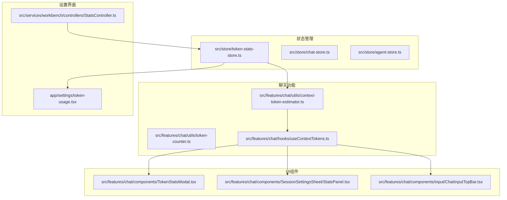
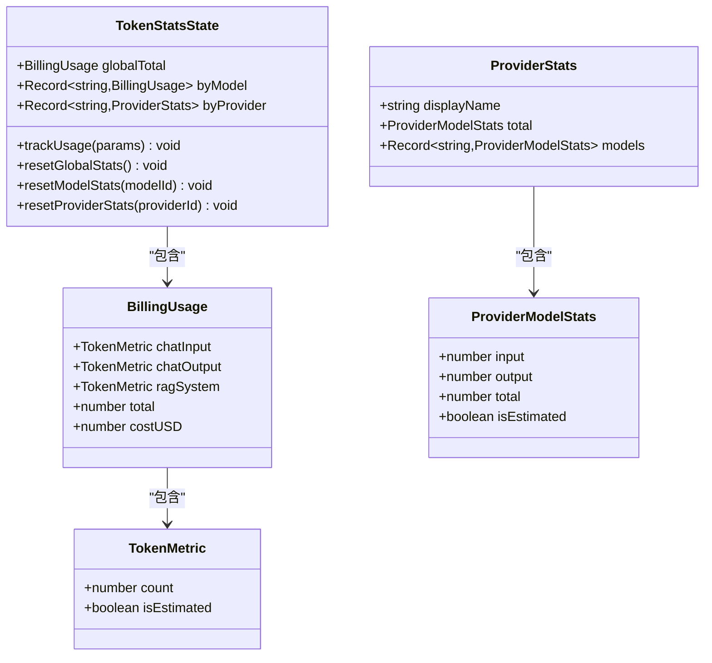
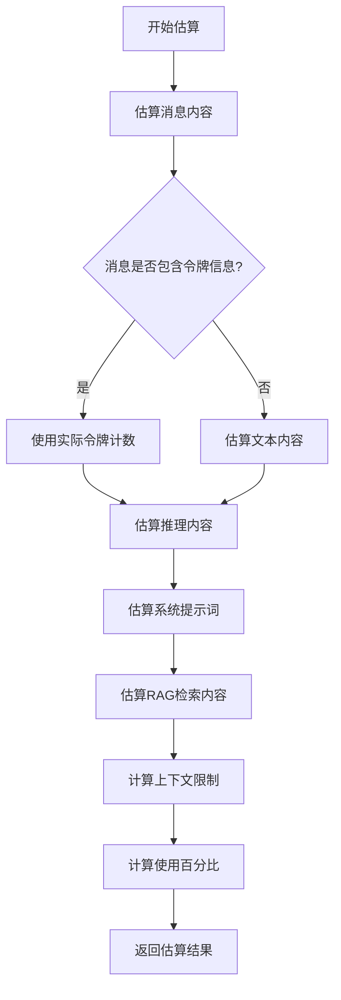
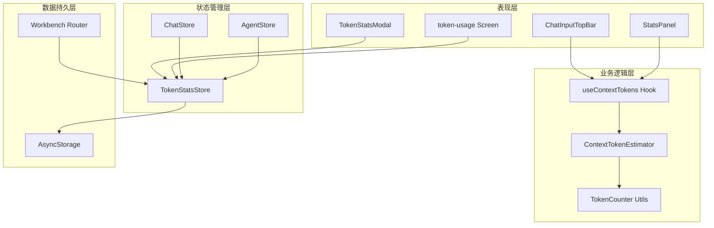
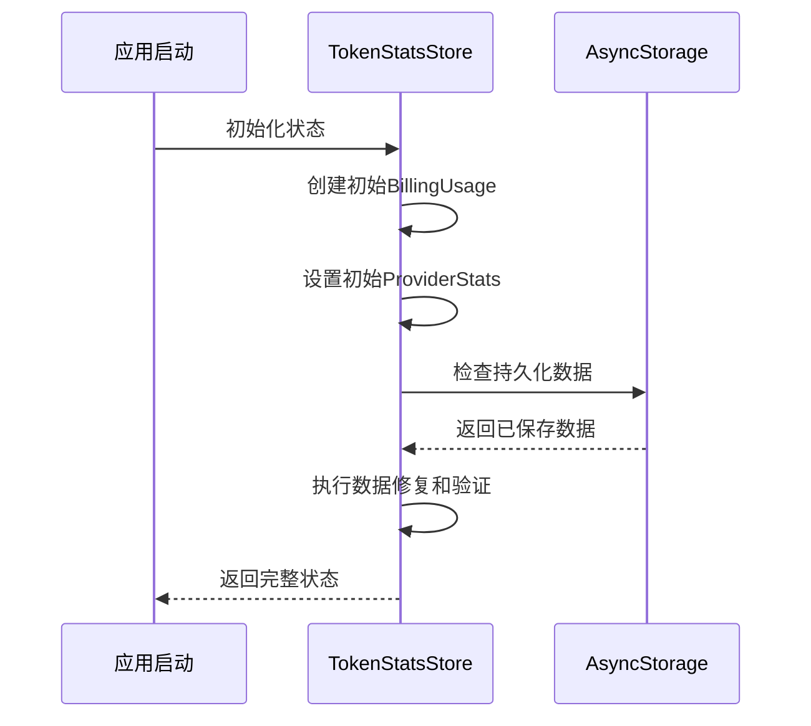
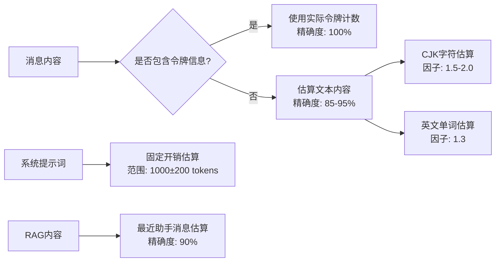
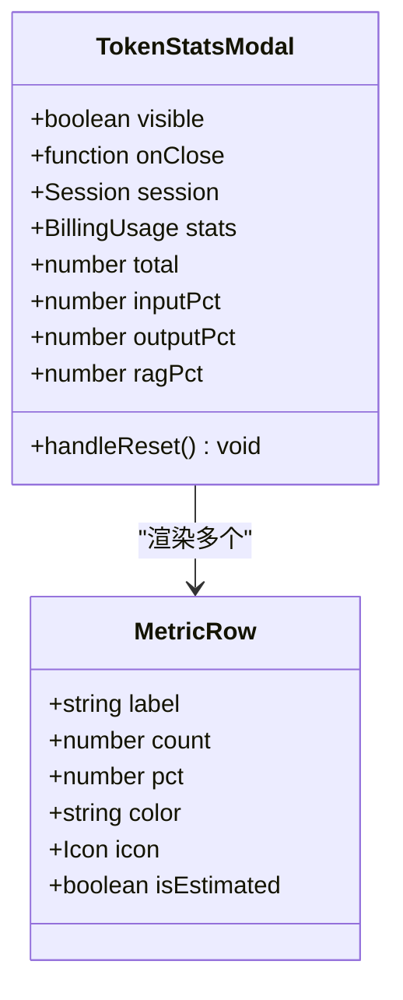
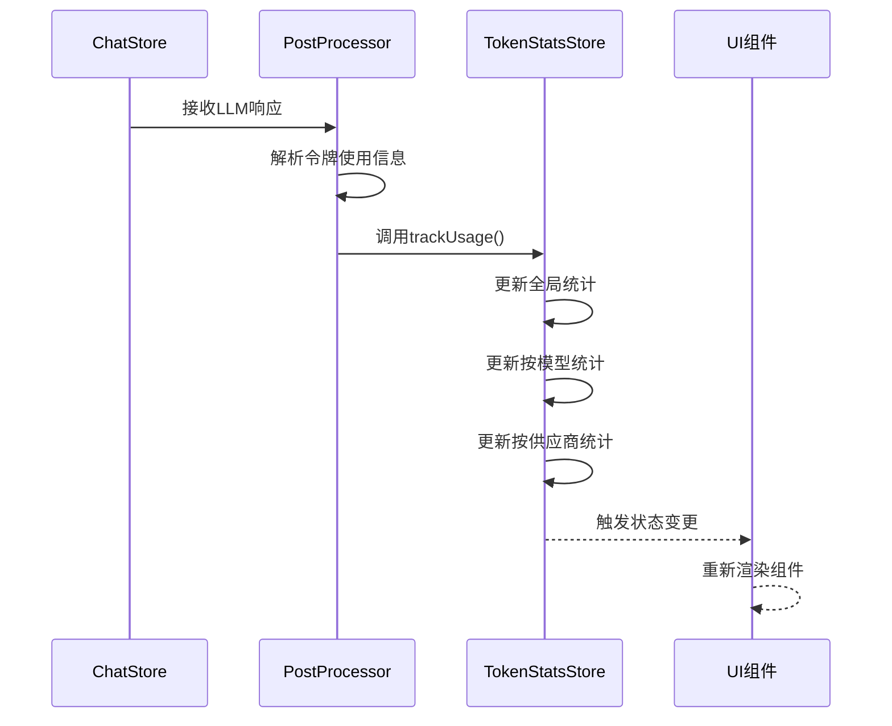
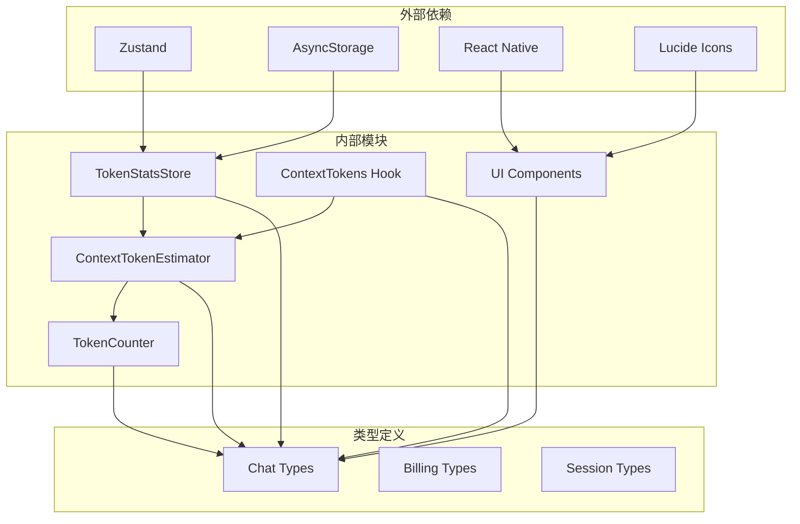

# 令牌统计状态管理

<cite>
**本文档引用的文件**
- [src/store/token-stats-store.ts](file://src/store/token-stats-store.ts)
- [src/features/chat/utils/token-counter.ts](file://src/features/chat/utils/token-counter.ts)
- [src/features/chat/utils/context-token-estimator.ts](file://src/features/chat/utils/context-token-estimator.ts)
- [src/features/chat/hooks/useContextTokens.ts](file://src/features/chat/hooks/useContextTokens.ts)
- [src/types/chat.ts](file://src/types/chat.ts)
- [src/features/chat/components/TokenStatsModal.tsx](file://src/features/chat/components/TokenStatsModal.tsx)
- [src/features/chat/components/SessionSettingsSheet/StatsPanel.tsx](file://src/features/chat/components/SessionSettingsSheet/StatsPanel.tsx)
- [src/features/chat/components/input/ChatInputTopBar.tsx](file://src/features/chat/components/input/ChatInputTopBar.tsx)
- [src/services/workbench/controllers/StatsController.ts](file://src/services/workbench/controllers/StatsController.ts)
- [app/settings/token-usage.tsx](file://app/settings/token-usage.tsx)
- [plans/token-stats-audit-report.md](file://plans/token-stats-audit-report.md)
</cite>

## 更新摘要
**变更内容**
- 增强了防御性编程模式，包括改进的null-safety检查和类型转换保护
- 完善了数据验证机制，确保更好的错误处理和数据完整性
- 在UI组件中实施了更严格的数据安全措施
- 加强了状态恢复时的容错能力

## 目录
1. [简介](#简介)
2. [项目结构](#项目结构)
3. [核心组件](#核心组件)
4. [架构概览](#架构概览)
5. [详细组件分析](#详细组件分析)
6. [依赖关系分析](#依赖关系分析)
7. [性能考虑](#性能考虑)
8. [故障排除指南](#故障排除指南)
9. [结论](#结论)
10. [附录](#附录)

## 简介

Nexara令牌统计状态管理系统是一个完整的令牌使用监控和分析解决方案，专注于为AI聊天应用提供精确的令牌统计和上下文管理功能。该系统通过三个主要维度来跟踪令牌使用情况：

- **计费统计**：跟踪输入令牌、输出令牌和RAG系统令牌的总使用量
- **上下文估算**：实时估算当前会话的上下文长度，帮助用户了解接近上下文限制的风险
- **可视化展示**：提供直观的统计面板和图表，帮助用户理解令牌使用模式

系统采用现代化的React Native架构，结合Zustand状态管理和AsyncStorage持久化存储，确保统计数据的准确性和可靠性。**最新版本增强了防御性编程模式，包括改进的null-safety检查、类型转换保护和数据验证机制，确保更好的错误处理和数据完整性。**

## 项目结构

Nexara令牌统计状态管理系统在项目中分布于多个关键目录中：

**图表来源**
- [src/store/token-stats-store.ts:1-272](file://src/store/token-stats-store.ts#L1-L272)
- [src/features/chat/utils/context-token-estimator.ts:1-235](file://src/features/chat/utils/context-token-estimator.ts#L1-L235)
- [src/features/chat/hooks/useContextTokens.ts:1-102](file://src/features/chat/hooks/useContextTokens.ts#L1-L102)

**章节来源**
- [src/store/token-stats-store.ts:1-272](file://src/store/token-stats-store.ts#L1-L272)
- [src/features/chat/utils/context-token-estimator.ts:1-235](file://src/features/chat/utils/context-token-estimator.ts#L1-L235)

## 核心组件

### 令牌统计存储（TokenStatsStore）

令牌统计存储是整个系统的核心，负责维护和管理所有令牌使用数据。它采用Zustand状态管理库，提供高性能的状态更新和持久化存储。

#### 数据结构设计

系统定义了三种主要的数据结构来组织令牌统计信息：

**图表来源**
- [src/store/token-stats-store.ts:31-56](file://src/store/token-stats-store.ts#L31-L56)
- [src/types/chat.ts:37-50](file://src/types/chat.ts#L37-L50)

#### 统计聚合机制

系统实现了高效的令牌统计聚合算法，能够处理多种类型的令牌使用场景：

1. **深度复制保护**：使用深拷贝避免状态污染
2. **条件累加**：仅在令牌计数为正数时进行累加
3. **估算标记**：自动标记降级估算的统计数据
4. **多维度分类**：支持按模型和供应商维度的统计

**章节来源**
- [src/store/token-stats-store.ts:58-88](file://src/store/token-stats-store.ts#L58-L88)
- [src/store/token-stats-store.ts:90-122](file://src/store/token-stats-store.ts#L90-L122)

### 上下文令牌估算器

上下文令牌估算器专门用于估算当前会话的上下文长度，这是用户最关心的功能之一。

#### 估算算法

系统采用了多阶段的估算策略：

**图表来源**
- [src/features/chat/utils/context-token-estimator.ts:134-178](file://src/features/chat/utils/context-token-estimator.ts#L134-L178)

#### 估算精度控制

为了平衡准确性与性能，系统实现了以下优化策略：

- **缓存机制**：使用useMemo避免重复计算
- **降级策略**：当无法获取精确数据时使用估算值
- **性能优先**：避免复杂的字符串解析操作
- **内存优化**：只在必要时创建新的对象实例

**章节来源**
- [src/features/chat/utils/context-token-estimator.ts:18-58](file://src/features/chat/utils/context-token-estimator.ts#L18-L58)
- [src/features/chat/utils/context-token-estimator.ts:85-104](file://src/features/chat/utils/context-token-estimator.ts#L85-L104)

### 令牌计数器工具

令牌计数器提供了基础的文本令牌估算功能，支持中英文混合文本的快速估算。

#### 多语言处理策略

系统针对不同语言采用了差异化的估算策略：

| 语言类型 | 处理方式 | 估算因子 |
|---------|---------|---------|
| 中文字符 | 按字符计数 | 1.5-2.0 tokens/字符 |
| 英文单词 | 按单词计数 | ~1.3 tokens/word |
| 数字和符号 | 基于单词规则 | 1 token/独立符号 |

**章节来源**
- [src/features/chat/utils/token-counter.ts:8-35](file://src/features/chat/utils/token-counter.ts#L8-L35)

## 架构概览

Nexara令牌统计状态管理系统采用分层架构设计，确保各个组件之间的职责清晰分离：

**图表来源**
- [src/features/chat/components/input/ChatInputTopBar.tsx:120-186](file://src/features/chat/components/input/ChatInputTopBar.tsx#L120-L186)
- [src/features/chat/components/SessionSettingsSheet/StatsPanel.tsx:14-249](file://src/features/chat/components/SessionSettingsSheet/StatsPanel.tsx#L14-L249)
- [src/features/chat/hooks/useContextTokens.ts:26-77](file://src/features/chat/hooks/useContextTokens.ts#L26-L77)

### 实时更新机制

系统实现了多层次的实时更新机制：

1. **状态监听**：使用Zustand的订阅机制自动响应状态变化
2. **组件刷新**：React组件根据状态变化自动重新渲染
3. **缓存策略**：useMemo和useCallback避免不必要的重渲染
4. **批量更新**：将多个相关的状态更新合并到一次渲染中

**章节来源**
- [src/features/chat/hooks/useContextTokens.ts:58-77](file://src/features/chat/hooks/useContextTokens.ts#L58-L77)
- [src/store/token-stats-store.ts:124-177](file://src/store/token-stats-store.ts#L124-L177)

## 详细组件分析

### 令牌统计存储实现

令牌统计存储是系统的核心数据层，负责维护所有令牌使用数据的生命周期。

#### 状态初始化

系统在启动时会初始化完整的状态结构，确保所有字段都有合理的默认值：

**图表来源**
- [src/store/token-stats-store.ts:181-268](file://src/store/token-stats-store.ts#L181-L268)

#### 数据修复机制

为了确保数据完整性，系统实现了强大的数据修复机制：

| 修复场景 | 修复策略 | 验证方法 |
|---------|---------|---------|
| 缺失字段 | 使用默认值填充 | 类型检查和存在性验证 |
| 无效数据 | 重置为安全默认值 | 数值范围验证 |
| 结构损坏 | 重建完整数据结构 | 递归验证所有子字段 |
| 类型不匹配 | 强制类型转换 | typeof操作符检查 |

**更新** 增强了防御性编程模式，包括改进的null-safety检查和类型转换保护

**章节来源**
- [src/store/token-stats-store.ts:181-268](file://src/store/token-stats-store.ts#L181-L268)

### 上下文令牌估算实现

上下文令牌估算器是用户交互最频繁的组件，需要在性能和准确性之间找到最佳平衡点。

#### 估算精度分析

系统根据不同数据源采用了差异化的估算精度：

**图表来源**
- [src/features/chat/utils/context-token-estimator.ts:41-104](file://src/features/chat/utils/context-token-estimator.ts#L41-L104)

#### 性能优化策略

为了确保估算过程的高效性，系统采用了多项优化技术：

- **早期退出**：当输入为空时立即返回零值
- **缓存利用**：复用已计算的中间结果
- **批量处理**：一次性处理多个消息的令牌估算
- **内存池**：重用临时对象避免频繁分配

**章节来源**
- [src/features/chat/utils/context-token-estimator.ts:134-178](file://src/features/chat/utils/context-token-estimator.ts#L134-L178)

### 可视化组件实现

系统提供了多种可视化组件来展示令牌统计信息，每种组件都有其特定的用途和设计目标。

#### TokenStatsModal组件

TokenStatsModal是专门用于展示详细令牌统计的模态框组件：

**图表来源**
- [src/features/chat/components/TokenStatsModal.tsx:16-52](file://src/features/chat/components/TokenStatsModal.tsx#L16-L52)

#### StatsPanel组件

StatsPanel提供了会话级别的统计概览，重点关注上下文使用情况：

| 统计类别 | 数据来源 | 显示格式 | 颜色编码 |
|---------|---------|---------|---------|
| 上下文使用 | useContextTokens | "当前值 / 上限" | 绿色(0-50%) → 黄色(50-80%) → 红色(80-100%) |
| 消息历史 | 消息数组 | 数字计数 | 蓝色 |
| 系统提示词 | Agent配置 | 估算值 | 橙色 |
| RAG检索内容 | 最近助手消息 | 估算值 | 绿色 |

**更新** 在UI组件中实施了更严格的防御性编程模式

**章节来源**
- [src/features/chat/components/SessionSettingsSheet/StatsPanel.tsx:147-245](file://src/features/chat/components/SessionSettingsSheet/StatsPanel.tsx#L147-L245)

### 与聊天系统的集成

令牌统计系统与聊天系统实现了深度集成，确保统计数据的实时性和准确性。

#### 数据同步机制

**图表来源**
- [src/store/token-stats-store.ts:131-155](file://src/store/token-stats-store.ts#L131-L155)

#### 状态传播路径

令牌使用数据在系统中的传播路径如下：

1. **原始数据**：来自LLM API响应的令牌使用信息
2. **处理层**：PostProcessor解析和标准化数据
3. **存储层**：TokenStatsStore持久化存储
4. **UI层**：各种组件订阅并显示数据
5. **导出层**：Workbench控制器提供外部访问

**章节来源**
- [src/services/workbench/controllers/StatsController.ts:4-22](file://src/services/workbench/controllers/StatsController.ts#L4-L22)

## 依赖关系分析

Nexara令牌统计状态管理系统具有清晰的依赖关系层次结构：

**图表来源**
- [src/store/token-stats-store.ts:1-5](file://src/store/token-stats-store.ts#L1-L5)
- [src/features/chat/utils/context-token-estimator.ts:14-16](file://src/features/chat/utils/context-token-estimator.ts#L14-L16)

### 循环依赖检测

系统经过仔细设计，避免了任何循环依赖：

- **存储层**：独立于UI组件，仅暴露必要的接口
- **工具层**：纯函数实现，无状态依赖
- **类型层**：独立的类型定义，无运行时依赖
- **UI层**：仅依赖工具层和存储层的公共接口

**章节来源**
- [src/types/chat.ts:1-200](file://src/types/chat.ts#L1-L200)

## 性能考虑

### 内存优化策略

系统采用了多项内存优化技术来确保在移动设备上的流畅运行：

1. **对象池模式**：重用临时对象避免频繁分配
2. **浅拷贝优化**：在可能的情况下使用浅拷贝减少内存占用
3. **延迟计算**：使用useMemo和useCallback避免不必要的计算
4. **垃圾回收友好**：及时释放不再使用的对象引用

### 计算性能优化

为了提高估算和统计的计算效率，系统实现了以下优化：

- **缓存机制**：useMemo缓存昂贵的计算结果
- **批量处理**：将多个相关的计算合并到一次处理中
- **早期返回**：对空输入或无效数据立即返回
- **算法简化**：使用近似算法替代精确但耗时的计算

### 存储性能优化

系统在数据存储方面也进行了专门的优化：

- **增量更新**：只更新发生变化的部分
- **压缩存储**：对存储的数据进行压缩以减少磁盘占用
- **异步写入**：避免阻塞主线程的存储操作
- **数据清理**：定期清理过期或无效的数据

## 故障排除指南

### 常见问题诊断

#### 数据丢失问题

**症状**：重启应用后令牌统计数据消失

**诊断步骤**：
1. 检查AsyncStorage是否正常工作
2. 验证持久化配置是否正确
3. 确认数据序列化/反序列化过程

**解决方案**：
- 重新初始化存储配置
- 清理损坏的存储数据
- 实施数据备份机制

#### 估算不准确问题

**症状**：上下文估算值与实际使用情况不符

**诊断步骤**：
1. 检查消息令牌信息的完整性
2. 验证估算算法的适用性
3. 确认模型上下文限制的准确性

**解决方案**：
- 更新估算算法参数
- 补充缺失的消息令牌信息
- 调整模型规格配置

#### 性能问题

**症状**：UI渲染缓慢或卡顿

**诊断步骤**：
1. 分析组件的重渲染频率
2. 检查useMemo和useCallback的使用
3. 监控内存使用情况

**解决方案**：
- 优化组件的依赖项设置
- 减少不必要的状态更新
- 实施更精细的缓存策略

**更新** 增强了防御性编程模式，包括改进的null-safety检查和类型转换保护

**章节来源**
- [src/store/token-stats-store.ts:181-268](file://src/store/token-stats-store.ts#L181-L268)

### 调试工具和技巧

系统提供了多种调试工具来帮助开发者诊断问题：

1. **状态检查器**：监控Zustand状态的变化
2. **性能分析器**：分析组件渲染性能
3. **内存监控器**：跟踪内存使用情况
4. **日志系统**：记录关键事件和错误信息

## 结论

Nexara令牌统计状态管理系统是一个设计精良、功能完整的令牌使用监控解决方案。系统通过以下关键特性实现了卓越的用户体验：

### 技术优势

1. **架构清晰**：分层设计确保了良好的可维护性和扩展性
2. **性能优异**：多层缓存和优化策略保证了流畅的用户体验
3. **数据可靠**：完善的错误处理和数据修复机制确保了数据完整性
4. **用户体验**：直观的可视化界面和实时更新机制提升了用户满意度

**更新** 最新版本增强了防御性编程模式，包括改进的null-safety检查、类型转换保护和数据验证机制，确保更好的错误处理和数据完整性

### 功能特色

1. **多维度统计**：同时提供计费统计和上下文估算两种视角
2. **智能估算**：针对不同语言和场景采用差异化的估算策略
3. **实时反馈**：状态变化的即时反映和UI更新
4. **深度集成**：与聊天系统的无缝集成和数据同步

### 发展方向

未来可以考虑的功能增强包括：

1. **更精确的估算算法**：集成实际的tokenizer实现
2. **历史趋势分析**：提供令牌使用的历史趋势图表
3. **预算管理**：添加使用限额和预警功能
4. **多平台支持**：扩展到Web和其他平台

## 附录

### API参考

#### TokenStatsStore接口

| 方法 | 参数 | 返回值 | 描述 |
|------|------|--------|------|
| trackUsage | AggregateParams | void | 跟踪令牌使用情况并更新统计 |
| resetGlobalStats | void | void | 重置全局统计信息 |
| resetModelStats | string | void | 重置指定模型的统计信息 |
| resetProviderStats | string | void | 重置指定供应商的统计信息 |

#### ContextTokenEstimator接口

| 函数 | 参数 | 返回值 | 描述 |
|------|------|--------|------|
| estimateContextTokens | Session, Agent, number | ContextTokenEstimate | 估算上下文令牌使用情况 |
| useContextTokens | string | ContextUsageInfo | React Hook获取上下文使用信息 |
| formatContextUsage | number, number | object | 格式化上下文使用显示 |

### 配置选项

系统支持以下配置选项来满足不同的使用需求：

- **估算精度**：可调整估算算法的保守程度
- **缓存策略**：配置缓存的大小和过期时间
- **通知设置**：配置使用量预警和通知
- **数据保留**：设置统计数据的保留期限

### 防御性编程实践

**更新** 系统实施了全面的防御性编程模式：

1. **null-safety检查**：使用`??`空值合并操作符和`||`默认值确保数据完整性
2. **类型转换保护**：使用`Number()`函数确保数值转换的安全性
3. **数据验证机制**：在状态恢复时进行数据结构验证和修复
4. **错误处理**：在数据损坏时提供降级处理和容错能力
5. **UI组件安全**：在所有UI组件中实施严格的数据安全措施

这些增强的防御性编程模式显著提高了系统的稳定性和可靠性，确保在各种异常情况下都能保持正常运行。