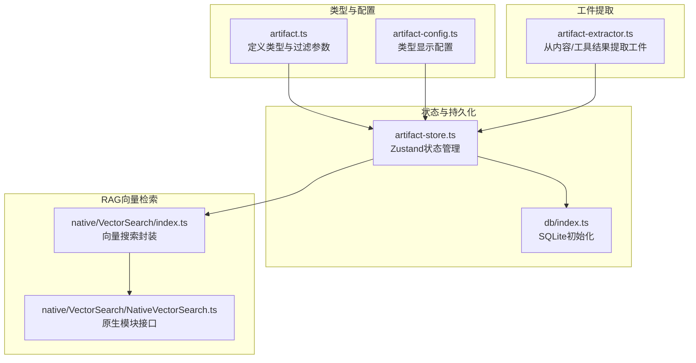
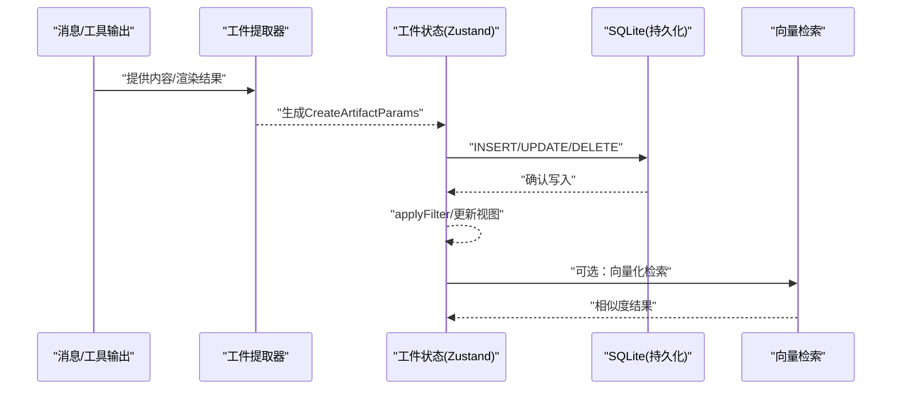
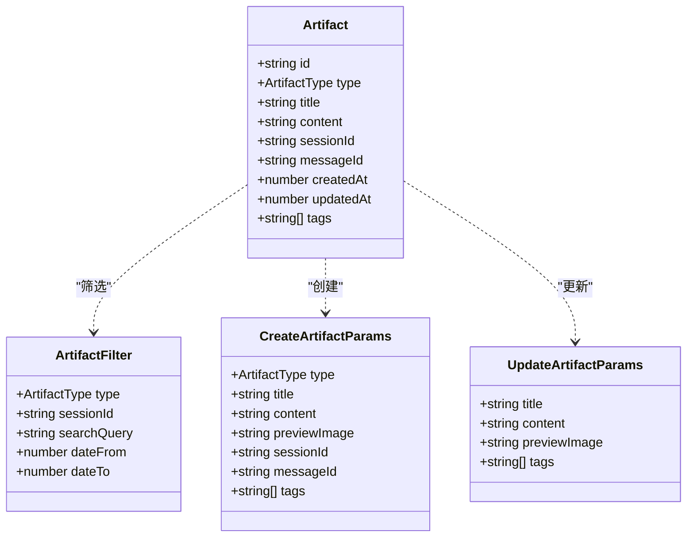
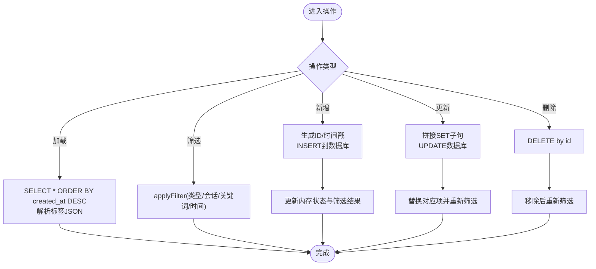
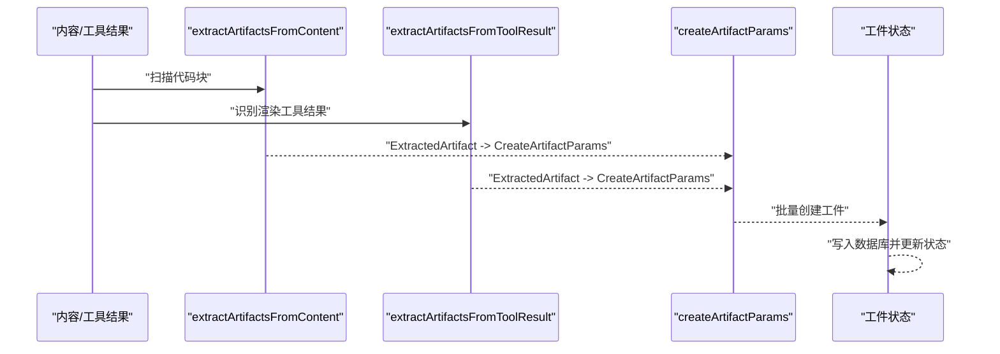
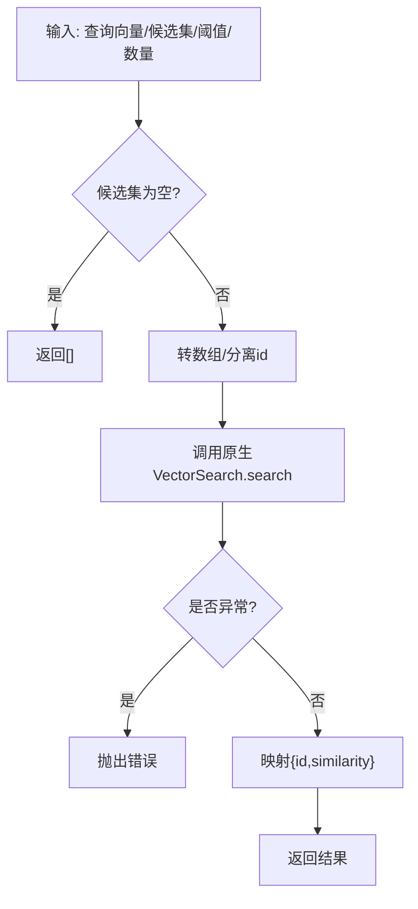
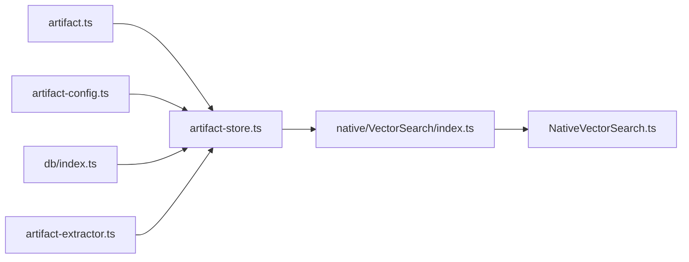

# 工件状态管理

<cite>
**本文引用的文件**
- [artifact.ts](file://src/types/artifact.ts)
- [artifact-store.ts](file://src/store/artifact-store.ts)
- [artifact-config.ts](file://src/constants/artifact-config.ts)
- [artifact-extractor.ts](file://src/features/chat/utils/artifact-extractor.ts)
- [index.ts](file://src/lib/db/index.ts)
- [index.ts](file://src/native/VectorSearch/index.ts)
- [NativeVectorSearch.ts](file://src/native/VectorSearch/NativeVectorSearch.ts)
</cite>

## 目录
1. [简介](#简介)
2. [项目结构](#项目结构)
3. [核心组件](#核心组件)
4. [架构总览](#架构总览)
5. [详细组件分析](#详细组件分析)
6. [依赖分析](#依赖分析)
7. [性能考虑](#性能考虑)
8. [故障排查指南](#故障排查指南)
9. [结论](#结论)
10. [附录](#附录)

## 简介
本文件面向Nexara的“工件状态管理系统”，系统性阐述工件的数据结构、状态管理策略、持久化与缓存机制，并结合RAG向量化检索能力给出集成方案。文档覆盖以下关键点：
- 工件的创建、更新、删除、查询与筛选流程
- 工件与RAG系统的集成：向量化检索、内存管理与知识抽取
- 持久化策略、缓存与性能优化建议
- 扩展接口与自定义工件类型的实现指南
- 工件状态在系统中的协作关系与数据流转

## 项目结构
围绕工件状态管理的相关模块分布如下：
- 类型与常量：定义工件类型、过滤参数与显示配置
- 存储层：基于SQLite的本地持久化与Zustand状态管理
- 工件提取器：从消息内容与工具结果中自动抽取工件
- RAG向量检索：原生模块封装的向量相似度搜索

**图示来源**
- [artifact.ts:1-45](file://src/types/artifact.ts#L1-L45)
- [artifact-config.ts:1-78](file://src/constants/artifact-config.ts#L1-L78)
- [artifact-store.ts:1-255](file://src/store/artifact-store.ts#L1-L255)
- [index.ts:1-13](file://src/lib/db/index.ts#L1-L13)
- [artifact-extractor.ts:1-229](file://src/features/chat/utils/artifact-extractor.ts#L1-L229)
- [index.ts:1-53](file://src/native/VectorSearch/index.ts#L1-L53)
- [NativeVectorSearch.ts:1-18](file://src/native/VectorSearch/NativeVectorSearch.ts#L1-L18)

**章节来源**
- [artifact.ts:1-45](file://src/types/artifact.ts#L1-L45)
- [artifact-config.ts:1-78](file://src/constants/artifact-config.ts#L1-L78)
- [artifact-store.ts:1-255](file://src/store/artifact-store.ts#L1-L255)
- [index.ts:1-13](file://src/lib/db/index.ts#L1-L13)
- [artifact-extractor.ts:1-229](file://src/features/chat/utils/artifact-extractor.ts#L1-L229)
- [index.ts:1-53](file://src/native/VectorSearch/index.ts#L1-L53)
- [NativeVectorSearch.ts:1-18](file://src/native/VectorSearch/NativeVectorSearch.ts#L1-L18)

## 核心组件
- 工件类型与过滤参数：定义工件字段、类型枚举、创建/更新参数与筛选条件
- 工件存储与状态：Zustand状态容器，负责加载、增删改查、筛选与会话/消息维度查询
- 数据库与持久化：SQLite WAL模式、外键约束启用；统一通过db执行SQL
- 工件提取器：从Markdown代码块与工具渲染结果中识别并生成工件
- 类型配置：为每种工件类型提供标签、图标、颜色与文件扩展名等显示信息
- 向量检索：原生模块封装的向量相似度搜索，支持阈值与返回数量限制

**章节来源**
- [artifact.ts:6-45](file://src/types/artifact.ts#L6-L45)
- [artifact-store.ts:16-32](file://src/store/artifact-store.ts#L16-L32)
- [index.ts:1-13](file://src/lib/db/index.ts#L1-L13)
- [artifact-extractor.ts:8-30](file://src/features/chat/utils/artifact-extractor.ts#L8-L30)
- [artifact-config.ts:8-78](file://src/constants/artifact-config.ts#L8-L78)
- [index.ts:15-53](file://src/native/VectorSearch/index.ts#L15-L53)

## 架构总览
下图展示工件状态管理在系统中的位置与交互关系：消息/工具输出经提取器生成工件，写入SQLite并同步到Zustand状态；查询与筛选由状态层提供；RAG向量检索可作为知识抽取与召回的补充。

**图示来源**
- [artifact-extractor.ts:157-200](file://src/features/chat/utils/artifact-extractor.ts#L157-L200)
- [artifact-store.ts:124-231](file://src/store/artifact-store.ts#L124-L231)
- [index.ts:1-13](file://src/lib/db/index.ts#L1-L13)
- [index.ts:15-53](file://src/native/VectorSearch/index.ts#L15-L53)

## 详细组件分析

### 工件数据模型与类型配置
- 数据模型字段：标识符、类型、标题、内容、预览图、会话与消息关联时间戳、标签数组
- 类型枚举：支持图表、流程图、数学公式、HTML、SVG等
- 显示配置：为每种类型提供标签、图标、颜色与文件扩展名，便于UI渲染与文件识别

**图示来源**
- [artifact.ts:8-45](file://src/types/artifact.ts#L8-L45)

**章节来源**
- [artifact.ts:6-45](file://src/types/artifact.ts#L6-L45)
- [artifact-config.ts:8-78](file://src/constants/artifact-config.ts#L8-L78)

### 工件状态与持久化
- 加载：按创建时间倒序读取全部工件，解析标签JSON，应用当前筛选条件
- 新增：生成唯一ID与时间戳，写入数据库，同时更新内存状态与筛选结果
- 更新：动态拼接SET子句，仅更新传入字段，统一更新时间戳
- 删除：按ID删除，同步更新内存与筛选结果
- 查询：按会话ID与消息ID快速过滤
- 筛选：支持类型、会话、关键词与时间范围组合筛选

**图示来源**
- [artifact-store.ts:102-254](file://src/store/artifact-store.ts#L102-L254)

**章节来源**
- [artifact-store.ts:16-32](file://src/store/artifact-store.ts#L16-L32)
- [artifact-store.ts:64-93](file://src/store/artifact-store.ts#L64-L93)
- [artifact-store.ts:102-254](file://src/store/artifact-store.ts#L102-L254)
- [index.ts:1-13](file://src/lib/db/index.ts#L1-L13)

### 工件提取与RAG集成
- 内容提取：从Markdown代码块中识别语言标签，映射到工件类型，生成标题与内容
- 工具结果提取：针对特定渲染工具（如图表渲染）进行专项匹配，再合并通用扫描结果
- RAG向量化：通过原生模块进行向量相似度搜索，支持阈值与返回数量控制，可用于知识抽取与检索增强

**图示来源**
- [artifact-extractor.ts:119-142](file://src/features/chat/utils/artifact-extractor.ts#L119-L142)
- [artifact-extractor.ts:157-200](file://src/features/chat/utils/artifact-extractor.ts#L157-L200)
- [artifact-extractor.ts:205-228](file://src/features/chat/utils/artifact-extractor.ts#L205-L228)
- [artifact-store.ts:124-170](file://src/store/artifact-store.ts#L124-L170)

**章节来源**
- [artifact-extractor.ts:8-30](file://src/features/chat/utils/artifact-extractor.ts#L8-L30)
- [artifact-extractor.ts:119-200](file://src/features/chat/utils/artifact-extractor.ts#L119-L200)
- [artifact-extractor.ts:205-228](file://src/features/chat/utils/artifact-extractor.ts#L205-L228)
- [index.ts:15-53](file://src/native/VectorSearch/index.ts#L15-L53)
- [NativeVectorSearch.ts:4-17](file://src/native/VectorSearch/NativeVectorSearch.ts#L4-L17)

### 向量检索与内存管理
- 接口封装：将Float32Array查询向量与候选向量数组转为原生可接受格式，返回相似度结果
- 错误处理：缺失原生模块时抛出明确错误，捕获原生异常并包装
- 性能要点：候选集为空直接返回空结果；阈值与返回数量可调，避免无效计算

**图示来源**
- [index.ts:15-48](file://src/native/VectorSearch/index.ts#L15-L48)
- [NativeVectorSearch.ts:5-14](file://src/native/VectorSearch/NativeVectorSearch.ts#L5-L14)

**章节来源**
- [index.ts:15-53](file://src/native/VectorSearch/index.ts#L15-L53)
- [NativeVectorSearch.ts:1-18](file://src/native/VectorSearch/NativeVectorSearch.ts#L1-L18)

## 依赖分析
- 类型依赖：状态层依赖类型定义与配置常量
- 存储依赖：状态层依赖数据库初始化模块
- 提取依赖：提取器依赖类型定义
- 向量依赖：向量检索依赖原生模块注册

**图示来源**
- [artifact.ts:1-45](file://src/types/artifact.ts#L1-L45)
- [artifact-config.ts:1-78](file://src/constants/artifact-config.ts#L1-L78)
- [artifact-store.ts:1-255](file://src/store/artifact-store.ts#L1-L255)
- [index.ts:1-13](file://src/lib/db/index.ts#L1-L13)
- [artifact-extractor.ts:1-229](file://src/features/chat/utils/artifact-extractor.ts#L1-L229)
- [index.ts:1-53](file://src/native/VectorSearch/index.ts#L1-L53)
- [NativeVectorSearch.ts:1-18](file://src/native/VectorSearch/NativeVectorSearch.ts#L1-L18)

**章节来源**
- [artifact-store.ts:1-255](file://src/store/artifact-store.ts#L1-L255)
- [artifact-extractor.ts:1-229](file://src/features/chat/utils/artifact-extractor.ts#L1-L229)
- [index.ts:1-13](file://src/lib/db/index.ts#L1-L13)
- [index.ts:1-53](file://src/native/VectorSearch/index.ts#L1-L53)
- [NativeVectorSearch.ts:1-18](file://src/native/VectorSearch/NativeVectorSearch.ts#L1-L18)

## 性能考虑
- 数据库层面
  - 启用WAL模式以提升并发读写性能
  - 开启外键约束保证数据一致性
- 状态与筛选
  - 在内存中维护全量工件与筛选结果，避免重复查询
  - 筛选逻辑按需组合，尽量减少不必要的字符串匹配
- 向量检索
  - 候选集为空时短路返回，避免无意义调用
  - 合理设置阈值与返回数量，平衡召回与性能
- 缓存建议
  - 可在状态层增加最近访问缓存，热点工件优先命中
  - 对大体量内容可采用懒加载与分页策略

**章节来源**
- [index.ts:7-12](file://src/lib/db/index.ts#L7-L12)
- [artifact-store.ts:64-93](file://src/store/artifact-store.ts#L64-L93)
- [index.ts:25-27](file://src/native/VectorSearch/index.ts#L25-L27)
- [index.ts:18-20](file://src/native/VectorSearch/index.ts#L18-L20)

## 故障排查指南
- 数据库错误
  - 现象：加载/增删改失败，控制台打印错误
  - 处理：检查数据库初始化是否成功，确认SQL语法与表结构
- 原生模块不可用
  - 现象：向量搜索抛出“模块未找到”错误
  - 处理：确认原生模块已正确注册与打包，平台兼容性
- 标签解析异常
  - 现象：标签字段解析失败导致为空
  - 处理：确保标签字段为合法JSON字符串，必要时回退为空数组
- 提取标题为空
  - 现象：标题生成逻辑未命中，使用默认类型名称
  - 处理：检查内容格式与正则匹配，确保内容具备可提取特征

**章节来源**
- [artifact-store.ts:118-121](file://src/store/artifact-store.ts#L118-L121)
- [artifact-store.ts:166-169](file://src/store/artifact-store.ts#L166-L169)
- [artifact-store.ts:227-230](file://src/store/artifact-store.ts#L227-L230)
- [index.ts:21-23](file://src/native/VectorSearch/index.ts#L21-L23)
- [artifact-extractor.ts:34-105](file://src/features/chat/utils/artifact-extractor.ts#L34-L105)

## 结论
本系统通过清晰的类型定义、Zustand状态管理与SQLite持久化，实现了对工件的全生命周期管理；结合内容与工具结果的自动化提取，以及原生向量检索能力，为RAG场景提供了良好的基础。建议在生产环境中进一步完善缓存策略、监控与可观测性，并持续扩展工件类型与显示配置。

## 附录

### 扩展接口与自定义工件类型实现指南
- 新增类型枚举：在类型定义中添加新的工件类型
- 显示配置：在类型配置中为新类型提供标签、图标、颜色与扩展名
- 提取规则：在提取器中添加语言映射与标题生成规则
- UI适配：根据类型配置渲染对应组件与文件扩展名
- 状态与持久化：无需修改，Zustand与数据库层天然支持新类型

**章节来源**
- [artifact.ts:6](file://src/types/artifact.ts#L6)
- [artifact-config.ts:8-78](file://src/constants/artifact-config.ts#L8-L78)
- [artifact-extractor.ts:12-30](file://src/features/chat/utils/artifact-extractor.ts#L12-L30)