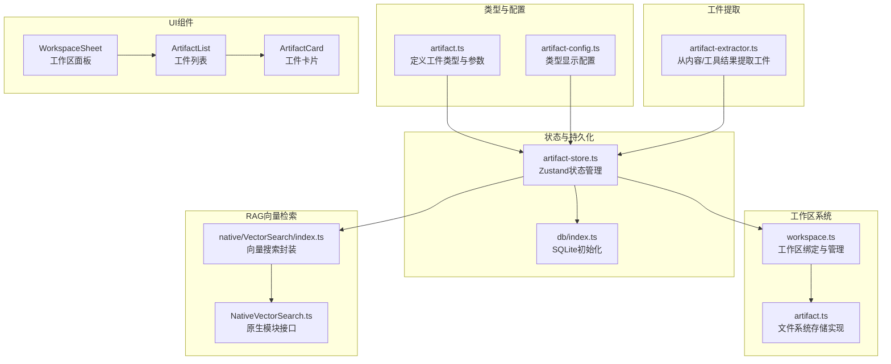
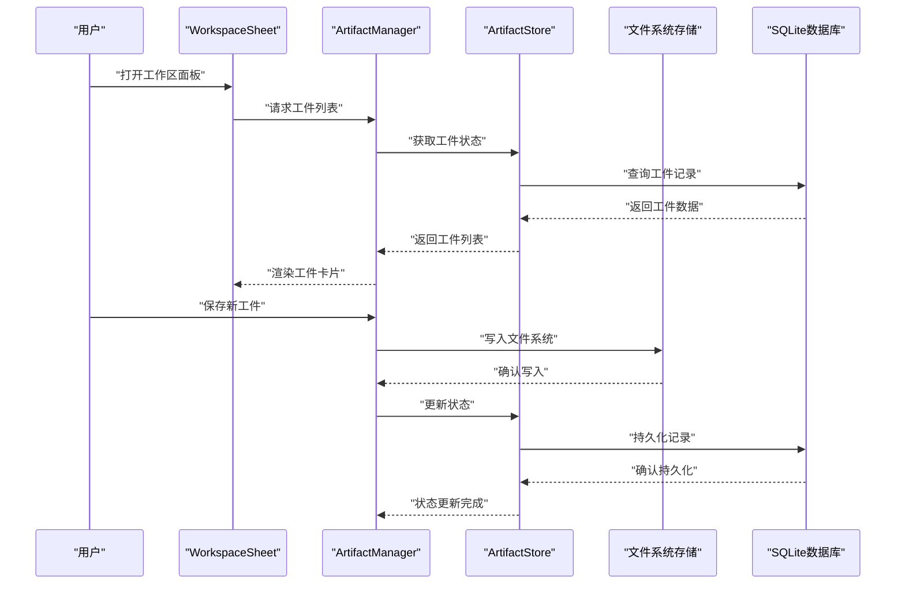
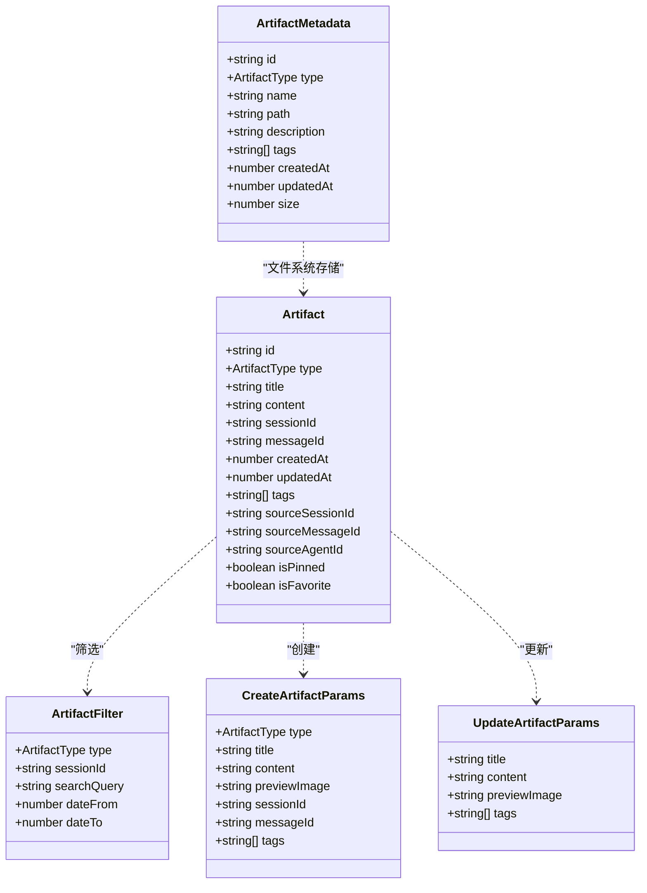
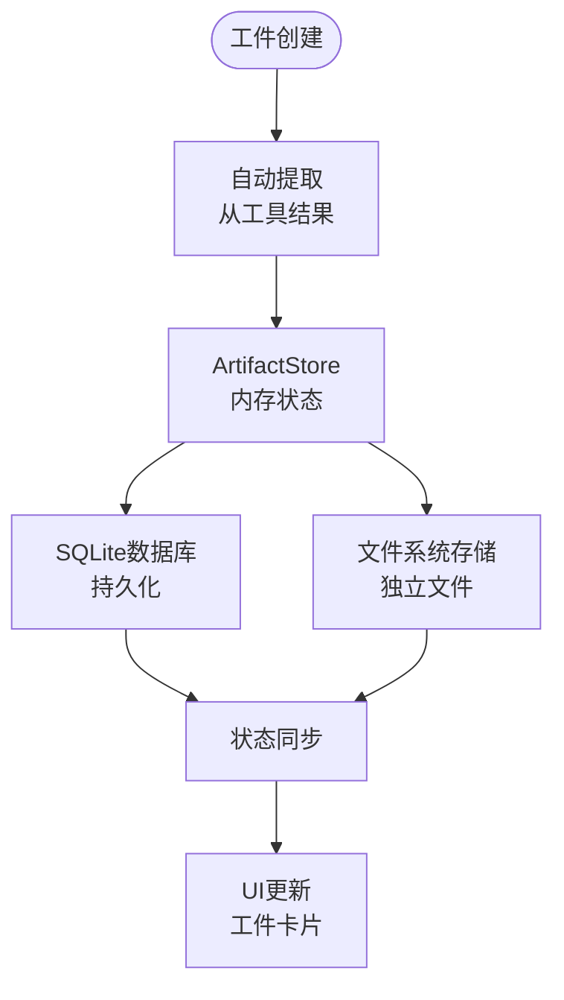
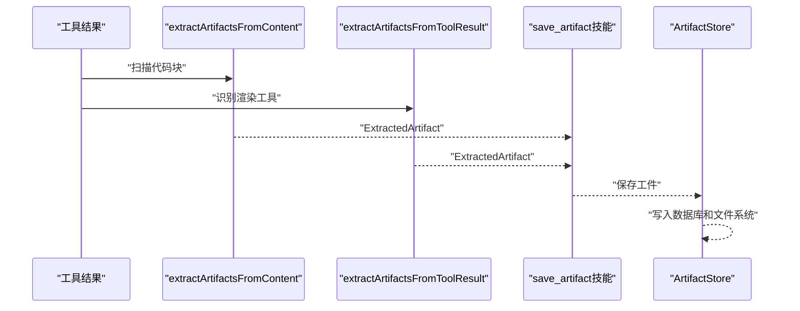
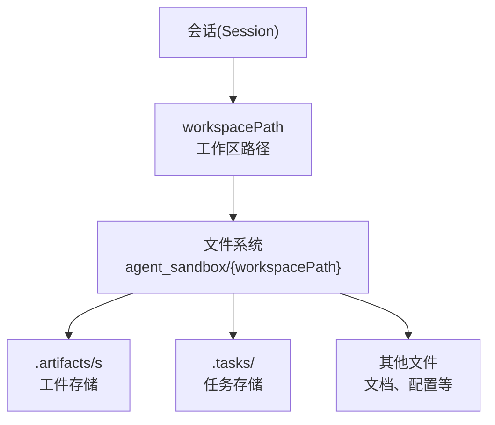
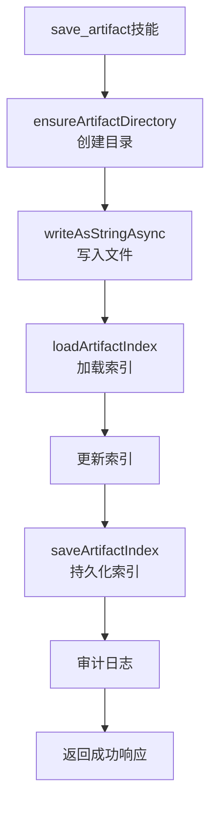
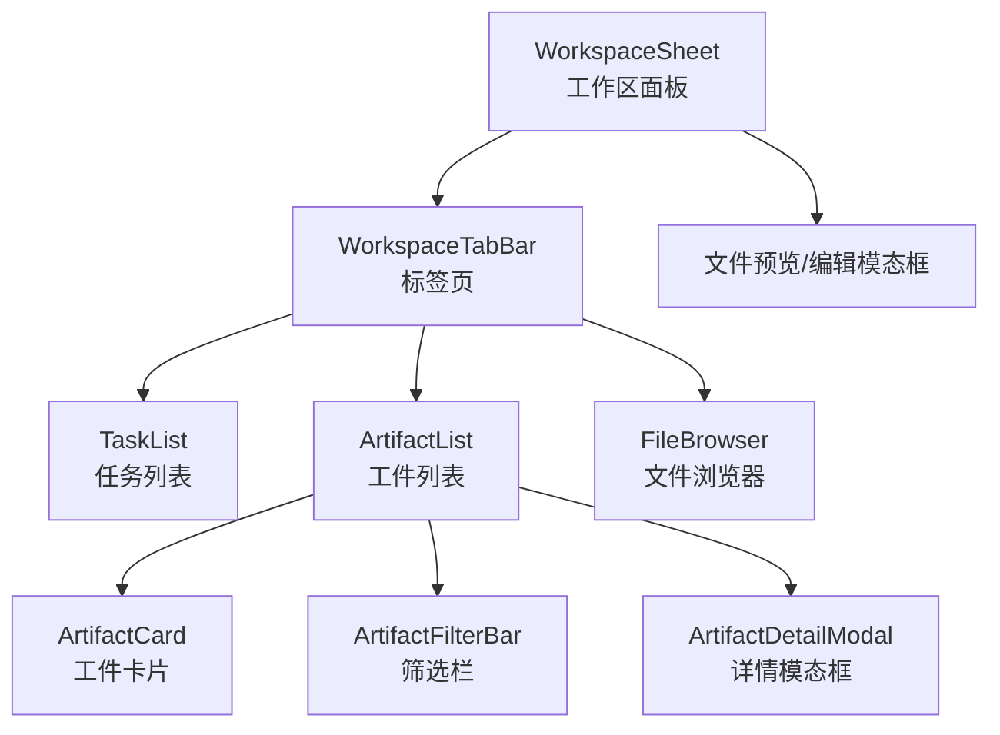
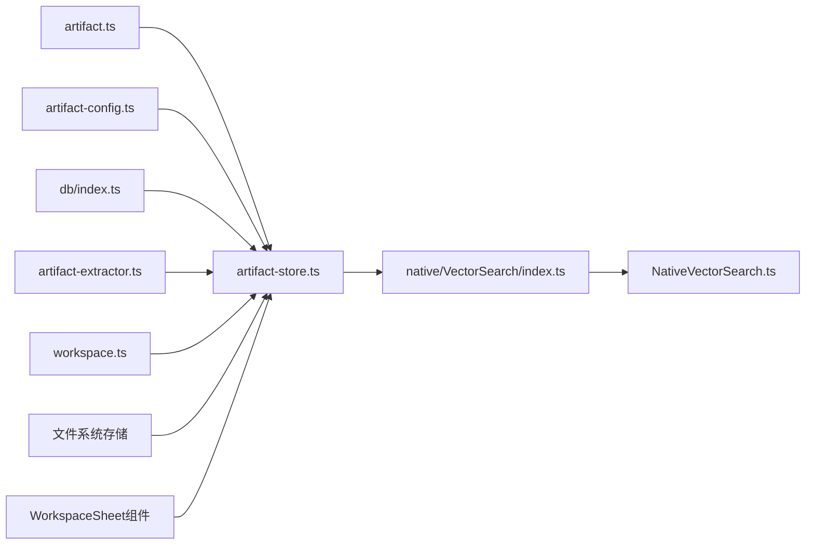

# 工件状态管理

<cite>
**本文引用的文件**
- [artifact.ts](file://src/types/artifact.ts)
- [artifact-store.ts](file://src/store/artifact-store.ts)
- [artifact-config.ts](file://src/constants/artifact-config.ts)
- [artifact-extractor.ts](file://src/features/chat/utils/artifact-extractor.ts)
- [index.ts](file://src/lib/db/index.ts)
- [index.ts](file://src/native/VectorSearch/index.ts)
- [NativeVectorSearch.ts](file://src/native/VectorSearch/NativeVectorSearch.ts)
- [workspace.ts](file://worktree/src/lib/skills/definitions/workspace.ts)
- [artifact.ts](file://worktree/src/lib/skills/definitions/artifact.ts)
- [index.ts](file://src/features/chat/components/WorkspaceSheet/index.tsx)
- [ArtifactList.tsx](file://src/features/chat/components/WorkspaceSheet/ArtifactList.tsx)
- [artifacts-workspace-integration-plan.md](file://plans/artifacts-workspace-integration-plan.md)
- [artifact-system-implementation-plan.md](file://.agent/docs/plans/artifact-system-implementation-plan.md)
</cite>

## 更新摘要
**所做更改**
- 更新了工件系统完全替代传统任务管理状态管理模式的架构描述
- 新增了工作区绑定机制和文件系统存储策略
- 扩展了工件类型和存储方式，从内联消息存储转向独立文件系统存储
- 增加了UI组件和工作区面板的集成方案
- 更新了数据流和持久化策略

## 目录
1. [简介](#简介)
2. [项目结构](#项目结构)
3. [核心组件](#核心组件)
4. [架构总览](#架构总览)
5. [详细组件分析](#详细组件分析)
6. [工作区绑定机制](#工作区绑定机制)
7. [文件系统存储策略](#文件系统存储策略)
8. [UI组件集成](#ui组件集成)
9. [依赖分析](#依赖分析)
10. [性能考虑](#性能考虑)
11. [故障排查指南](#故障排查指南)
12. [结论](#结论)
13. [附录](#附录)

## 简介
本文档全面阐述Nexara工件状态管理系统，该系统已完全替代传统的任务管理状态管理模式，引入了全新的工件存储和工作区绑定机制。系统通过工件类型定义、状态管理、文件系统存储和工作区集成，实现了对生成内容的全生命周期管理。

**更新重点**：系统现已从传统的消息内联存储模式转向基于工作区的文件系统存储，提供更强大的持久化能力和跨会话访问功能。

## 项目结构
围绕工件状态管理的新架构分布如下：

**图示来源**
- [artifact.ts:1-45](file://src/types/artifact.ts#L1-L45)
- [artifact-config.ts:1-78](file://src/constants/artifact-config.ts#L1-L78)
- [artifact-store.ts:1-255](file://src/store/artifact-store.ts#L1-L255)
- [artifact-extractor.ts:1-229](file://src/features/chat/utils/artifact-extractor.ts#L1-L229)
- [workspace.ts:1-176](file://worktree/src/lib/skills/definitions/workspace.ts#L1-L176)
- [artifact.ts:1-422](file://worktree/src/lib/skills/definitions/artifact.ts#L1-L422)
- [index.ts:1-328](file://src/features/chat/components/WorkspaceSheet/index.tsx#L1-L328)
- [ArtifactList.tsx:1-208](file://src/features/chat/components/WorkspaceSheet/ArtifactList.tsx#L1-L208)

## 核心组件
- **工件类型与过滤参数**：定义工件字段、类型枚举、创建/更新参数与筛选条件
- **工件存储与状态**：Zustand状态容器，负责加载、增删改查、筛选与会话维度查询
- **文件系统存储**：基于Expo FileSystem的独立文件存储，支持工作区绑定
- **工作区绑定**：会话级别的工作区路径绑定，确保文件操作的作用域
- **UI组件集成**：WorkspaceSheet工作区面板，ArtifactList工件列表，ArtifactCard工件卡片
- **向量检索**：原生模块封装的向量相似度搜索，支持阈值与返回数量限制

**章节来源**
- [artifact.ts:6-45](file://src/types/artifact.ts#L6-L45)
- [artifact-store.ts:16-32](file://src/store/artifact-store.ts#L16-L32)
- [workspace.ts:30-52](file://worktree/src/lib/skills/definitions/workspace.ts#L30-L52)
- [artifact.ts:81-195](file://worktree/src/lib/skills/definitions/artifact.ts#L81-L195)
- [index.ts:1-328](file://src/features/chat/components/WorkspaceSheet/index.tsx#L1-L328)

## 架构总览
新架构展示了工件系统如何完全替代传统任务管理模式：

**图示来源**
- [index.ts:118-133](file://src/features/chat/components/WorkspaceSheet/index.tsx#L118-L133)
- [artifact.ts:120-195](file://worktree/src/lib/skills/definitions/artifact.ts#L120-L195)
- [artifact-store.ts:102-170](file://src/store/artifact-store.ts#L102-L170)

## 详细组件分析

### 工件数据模型与类型配置
新架构支持更丰富的工件类型和存储方式：

**图示来源**
- [artifact.ts:8-45](file://src/types/artifact.ts#L8-L45)
- [artifact.ts:18-28](file://worktree/src/lib/skills/definitions/artifact.ts#L18-L28)

**章节来源**
- [artifact.ts:6-45](file://src/types/artifact.ts#L6-L45)
- [artifact-config.ts:8-78](file://src/constants/artifact-config.ts#L8-L78)
- [artifact.ts:18-28](file://worktree/src/lib/skills/definitions/artifact.ts#L18-L28)

### 工件状态与持久化
新架构采用双重存储策略：

**图示来源**
- [artifact-extractor.ts:157-200](file://src/features/chat/utils/artifact-extractor.ts#L157-L200)
- [artifact-store.ts:124-170](file://src/store/artifact-store.ts#L124-L170)
- [artifact.ts:120-195](file://worktree/src/lib/skills/definitions/artifact.ts#L120-L195)

**章节来源**
- [artifact-store.ts:16-32](file://src/store/artifact-store.ts#L16-L32)
- [artifact-store.ts:64-93](file://src/store/artifact-store.ts#L64-L93)
- [artifact-store.ts:102-254](file://src/store/artifact-store.ts#L102-L254)

### 工件提取与RAG集成
新架构增强了工件提取能力：

**图示来源**
- [artifact-extractor.ts:119-200](file://src/features/chat/utils/artifact-extractor.ts#L119-L200)
- [artifact.ts:120-195](file://worktree/src/lib/skills/definitions/artifact.ts#L120-L195)

**章节来源**
- [artifact-extractor.ts:8-30](file://src/features/chat/utils/artifact-extractor.ts#L8-L30)
- [artifact-extractor.ts:119-200](file://src/features/chat/utils/artifact-extractor.ts#L119-L200)
- [artifact-extractor.ts:205-228](file://src/features/chat/utils/artifact-extractor.ts#L205-L228)

## 工作区绑定机制
新架构引入了工作区绑定机制，确保文件操作的作用域：

**图示来源**
- [workspace.ts:30-52](file://worktree/src/lib/skills/definitions/workspace.ts#L30-L52)
- [artifact.ts:30-51](file://worktree/src/lib/skills/definitions/artifact.ts#L30-L51)

**章节来源**
- [workspace.ts:135-175](file://worktree/src/lib/skills/definitions/workspace.ts#L135-L175)
- [artifact.ts:30-51](file://worktree/src/lib/skills/definitions/artifact.ts#L30-L51)

## 文件系统存储策略
新架构采用基于Expo FileSystem的独立存储：

**图示来源**
- [artifact.ts:120-195](file://worktree/src/lib/skills/definitions/artifact.ts#L120-L195)
- [artifact.ts:58-79](file://worktree/src/lib/skills/definitions/artifact.ts#L58-L79)

**章节来源**
- [artifact.ts:81-195](file://worktree/src/lib/skills/definitions/artifact.ts#L81-L195)
- [artifact.ts:58-79](file://worktree/src/lib/skills/definitions/artifact.ts#L58-L79)

## UI组件集成
新架构提供了完整的UI组件生态系统：

**图示来源**
- [index.ts:1-328](file://src/features/chat/components/WorkspaceSheet/index.tsx#L1-L328)
- [ArtifactList.tsx:1-208](file://src/features/chat/components/WorkspaceSheet/ArtifactList.tsx#L1-L208)

**章节来源**
- [index.ts:1-328](file://src/features/chat/components/WorkspaceSheet/index.tsx#L1-L328)
- [ArtifactList.tsx:1-208](file://src/features/chat/components/WorkspaceSheet/ArtifactList.tsx#L1-L208)

## 依赖分析
新架构的依赖关系更加复杂和模块化：

**图示来源**
- [artifact.ts:1-45](file://src/types/artifact.ts#L1-L45)
- [artifact-store.ts:1-255](file://src/store/artifact-store.ts#L1-L255)
- [workspace.ts:1-176](file://worktree/src/lib/skills/definitions/workspace.ts#L1-L176)
- [index.ts:1-328](file://src/features/chat/components/WorkspaceSheet/index.tsx#L1-L328)

**章节来源**
- [artifact-store.ts:1-255](file://src/store/artifact-store.ts#L1-L255)
- [artifact-extractor.ts:1-229](file://src/features/chat/utils/artifact-extractor.ts#L1-L229)
- [workspace.ts:1-176](file://worktree/src/lib/skills/definitions/workspace.ts#L1-L176)

## 性能考虑
新架构在性能方面有显著改进：

- **文件系统存储**：独立文件存储避免了消息大小限制，支持大文件工件
- **工作区隔离**：每个会话独立的工作区路径，避免数据冲突
- **异步操作**：文件系统操作采用异步模式，不影响UI响应
- **缓存策略**：结合内存状态和文件系统缓存，提升访问速度
- **索引优化**：文件系统索引支持快速查找和筛选

**章节来源**
- [artifact.ts:120-195](file://worktree/src/lib/skills/definitions/artifact.ts#L120-L195)
- [workspace.ts:22-52](file://worktree/src/lib/skills/definitions/workspace.ts#L22-L52)

## 故障排查指南
新架构可能遇到的问题和解决方案：

- **工作区路径错误**
  - 现象：文件无法保存或读取
  - 处理：检查会话的workspacePath配置，确认目录存在
- **文件系统权限**
  - 现象：写入失败或权限错误
  - 处理：验证Expo FileSystem权限，检查目录创建权限
- **索引损坏**
  - 现象：工件列表显示异常
  - 处理：重建index.json文件，重新加载工件索引
- **内存泄漏**
  - 现象：长时间使用后内存占用增加
  - 处理：定期清理不需要的工件，优化状态管理

**章节来源**
- [workspace.ts:144-175](file://worktree/src/lib/skills/definitions/workspace.ts#L144-L175)
- [artifact.ts:58-79](file://worktree/src/lib/skills/definitions/artifact.ts#L58-L79)

## 结论
新架构通过工作区绑定机制和文件系统存储策略，完全替代了传统的任务管理状态管理模式。系统现在能够：

- 支持更大规模的工件存储
- 提供跨会话的工件访问能力
- 实现更灵活的工作区管理
- 增强了系统的可扩展性和可维护性

建议在生产环境中继续完善工作区管理功能，优化文件系统操作性能，并增强工件的版本控制和共享能力。

## 附录

### 扩展接口与自定义工件类型实现指南
新架构下的扩展指南：

- **新增工件类型**：在artifact.ts中扩展ArtifactType枚举
- **文件系统存储**：在artifact.ts中添加新的类型处理器
- **UI组件适配**：在WorkspaceSheet中添加对应的组件
- **工作区集成**：确保新类型符合工作区存储规范
- **状态管理**：无需修改，Zustand状态管理天然支持新类型

**章节来源**
- [artifact.ts:6](file://src/types/artifact.ts#L6)
- [artifact.ts:16](file://worktree/src/lib/skills/definitions/artifact.ts#L16)
- [artifact-config.ts:8-78](file://src/constants/artifact-config.ts#L8-L78)