# 工件状态管理

<cite>
**本文引用的文件**
- [artifact.ts](file://src/types/artifact.ts)
- [artifact-store.ts](file://src/store/artifact-store.ts)
- [artifact-config.ts](file://src/constants/artifact-config.ts)
- [artifact-parser.ts](file://src/lib/artifact-parser.ts)
- [RendererRegistry.ts](file://src/components/chat/renderers/RendererRegistry.ts)
- [index.ts](file://src/components/chat/renderers/index.ts)
- [types.ts](file://src/components/chat/renderers/types.ts)
- [echarts-renderer-config.tsx](file://src/components/chat/renderers/echarts-renderer-config.tsx)
- [mermaid-renderer-config.tsx](file://src/components/chat/renderers/mermaid-renderer-config.tsx)
- [ArtifactLibrary.tsx](file://src/components/rag/ArtifactLibrary.tsx)
- [index.ts](file://src/lib/db/index.ts)
- [index.ts](file://src/native/VectorSearch/index.ts)
- [NativeVectorSearch.ts](file://src/native/VectorSearch/NativeVectorSearch.ts)
- [workspace.ts](file://worktree/src/lib/skills/definitions/workspace.ts)
- [artifact.ts](file://worktree/src/lib/skills/definitions/artifact.ts)
- [index.ts](file://src/features/chat/components/WorkspaceSheet/index.tsx)
- [ArtifactList.tsx](file://src/features/chat/components/WorkspaceSheet/ArtifactList.tsx)
- [artifacts-workspace-integration-plan.md](file://plans/artifacts-workspace-integration-plan.md)
- [artifact-system-implementation-plan.md](file://.agent/docs/plans/artifact-system-implementation-plan.md)
</cite>

## 更新摘要
**所做更改**
- 完全重构了工件系统架构，从传统的消息内联存储转向基于模板系统的渲染器架构
- 新增了渲染器注册框架、工件解析系统和工件库界面
- 引入了统一的渲染器接口和配置系统
- 增强了工件解析的健壮性和类型检测能力
- 新增了全局工件库界面，支持跨会话搜索和管理

## 目录
1. [简介](#简介)
2. [项目结构](#项目结构)
3. [核心组件](#核心组件)
4. [架构总览](#架构总览)
5. [详细组件分析](#详细组件分析)
6. [渲染器架构](#渲染器架构)
7. [工件解析系统](#工件解析系统)
8. [工件库界面](#工件库界面)
9. [工作区绑定机制](#工作区绑定机制)
10. [文件系统存储策略](#文件系统存储策略)
11. [UI组件集成](#ui组件集成)
12. [依赖分析](#依赖分析)
13. [性能考虑](#性能考虑)
14. [故障排查指南](#故障排查指南)
15. [结论](#结论)
16. [附录](#附录)

## 简介
本文档全面阐述Nexara工件状态管理系统，该系统已完全重构为基于模板系统的渲染器架构。新架构通过统一的渲染器接口、智能解析系统和全局工件库，实现了对生成内容的全生命周期管理。

**更新重点**：系统现已从传统的消息内联存储模式转向基于模板系统的渲染器架构，提供更强大的扩展性、解析能力和跨会话访问功能。

## 项目结构
围绕重构后的工件系统架构分布如下：

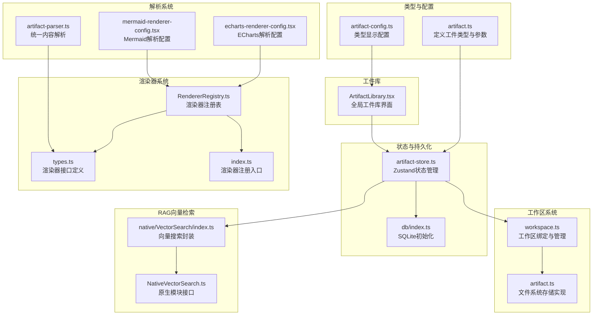

**图示来源**
- [artifact.ts:1-51](file://src/types/artifact.ts#L1-L51)
- [artifact-config.ts:1-78](file://src/constants/artifact-config.ts#L1-L78)
- [artifact-store.ts:1-343](file://src/store/artifact-store.ts#L1-L343)
- [RendererRegistry.ts:1-54](file://src/components/chat/renderers/RendererRegistry.ts#L1-L54)
- [types.ts:1-72](file://src/components/chat/renderers/types.ts#L1-L72)
- [index.ts:1-19](file://src/components/chat/renderers/index.ts#L1-L19)
- [artifact-parser.ts:1-238](file://src/lib/artifact-parser.ts#L1-L238)
- [echarts-renderer-config.tsx:1-39](file://src/components/chat/renderers/echarts-renderer-config.tsx#L1-L39)
- [mermaid-renderer-config.tsx:1-38](file://src/components/chat/renderers/mermaid-renderer-config.tsx#L1-L38)
- [ArtifactLibrary.tsx:1-399](file://src/components/rag/ArtifactLibrary.tsx#L1-L399)

## 核心组件
- **工件类型与过滤参数**：定义工件字段、类型枚举、创建/更新参数与筛选条件
- **工件存储与状态**：Zustand状态容器，负责加载、增删改查、筛选与会话维度查询
- **渲染器注册框架**：统一的渲染器注册表，支持动态注册和查询
- **渲染器接口定义**：标准化的渲染器配置接口，支持解析、元数据提取和内容渲染
- **工件解析系统**：统一的内容解析器，增强健壮性和类型检测能力
- **工件库界面**：全局工件库，支持跨会话搜索、类型筛选和排序
- **文件系统存储**：基于Expo FileSystem的独立文件存储，支持工作区绑定
- **工作区绑定**：会话级别的工作区路径绑定，确保文件操作的作用域
- **向量检索**：原生模块封装的向量相似度搜索，支持阈值与返回数量限制

**章节来源**
- [artifact.ts:6](file://src/types/artifact.ts#L6)
- [artifact-store.ts:18-36](file://src/store/artifact-store.ts#L18-L36)
- [RendererRegistry.ts:10-54](file://src/components/chat/renderers/RendererRegistry.ts#L10-L54)
- [types.ts:14-45](file://src/components/chat/renderers/types.ts#L14-L45)
- [artifact-parser.ts:17-238](file://src/lib/artifact-parser.ts#L17-L238)
- [ArtifactLibrary.tsx:46-48](file://src/components/rag/ArtifactLibrary.tsx#L46-L48)

## 架构总览
新架构展示了工件系统如何完全重构为基于模板系统的渲染器架构：

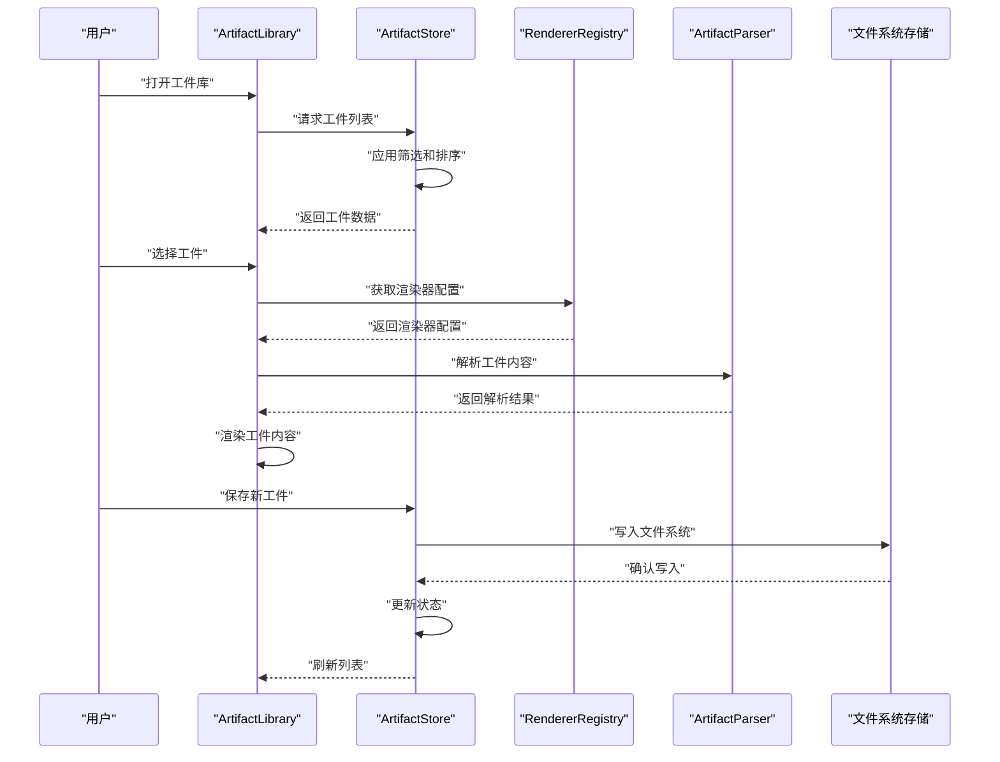

**图示来源**
- [ArtifactLibrary.tsx:60-112](file://src/components/rag/ArtifactLibrary.tsx#L60-L112)
- [artifact-store.ts:138-158](file://src/store/artifact-store.ts#L138-L158)
- [RendererRegistry.ts:26-28](file://src/components/chat/renderers/RendererRegistry.ts#L26-L28)
- [artifact-parser.ts:134-149](file://src/lib/artifact-parser.ts#L134-L149)

## 详细组件分析

### 工件数据模型与类型配置
重构后的架构支持更丰富的工件类型和存储方式：

```mermaid
classDiagram
class Artifact {
+string id
+ArtifactType type
+string title
+string content
+string sessionId
+string messageId
+number createdAt
+number updatedAt
+string[] tags
}
class ArtifactFilter {
+ArtifactType type
+string sessionId
+string searchQuery
+number dateFrom
+number dateTo
+string[] tags
+ArtifactSortField sortBy
+ArtifactSortOrder sortOrder
}
class CreateArtifactParams {
+ArtifactType type
+string title
+string content
+string previewImage
+string sessionId
+string messageId
+string[] tags
}
class UpdateArtifactParams {
+string title
+string content
+string previewImage
+string[] tags
}
class ArtifactRendererConfig {
+string type
+string badgeLabel
+parseContent(content : string) ParseResult
+getMetadata(data : any) RendererCardMetadata
+renderBadgeIcon(size : number, color : string) ReactNode
+renderContent(props : RendererContentProps) ReactNode
}
Artifact ..> ArtifactFilter : "筛选"
Artifact ..> CreateArtifactParams : "创建"
Artifact ..> UpdateArtifactParams : "更新"
ArtifactRendererConfig ..> Artifact : "渲染"
```

**图示来源**
- [artifact.ts:8-51](file://src/types/artifact.ts#L8-L51)
- [types.ts:17-45](file://src/components/chat/renderers/types.ts#L17-L45)

**章节来源**
- [artifact.ts:6](file://src/types/artifact.ts#L6)
- [artifact-config.ts:8-78](file://src/constants/artifact-config.ts#L8-L78)
- [types.ts:14-72](file://src/components/chat/renderers/types.ts#L14-L72)

### 工件状态与持久化
重构后的架构采用双重存储策略：

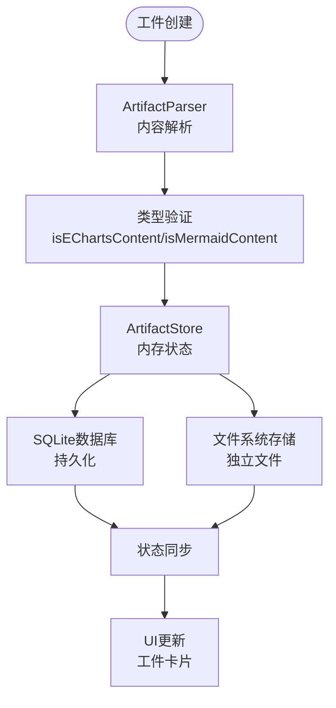

**图示来源**
- [artifact-parser.ts:134-149](file://src/lib/artifact-parser.ts#L134-L149)
- [artifact-store.ts:160-206](file://src/store/artifact-store.ts#L160-L206)
- [artifact.ts:120-195](file://worktree/src/lib/skills/definitions/artifact.ts#L120-L195)

**章节来源**
- [artifact-store.ts:18-36](file://src/store/artifact-store.ts#L18-L36)
- [artifact-store.ts:138-342](file://src/store/artifact-store.ts#L138-L342)

### 工件提取与RAG集成
重构后的架构增强了工件提取能力：

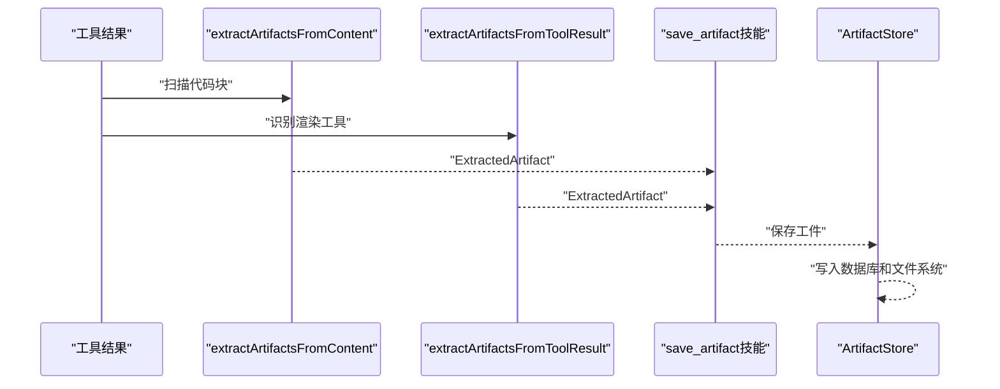

**图示来源**
- [artifact-parser.ts:209-238](file://src/lib/artifact-parser.ts#L209-L238)
- [artifact-store.ts:160-206](file://src/store/artifact-store.ts#L160-L206)

**章节来源**
- [artifact-parser.ts:1-238](file://src/lib/artifact-parser.ts#L1-L238)
- [artifact-store.ts:138-342](file://src/store/artifact-store.ts#L138-L342)

## 渲染器架构
新架构引入了统一的渲染器注册框架：

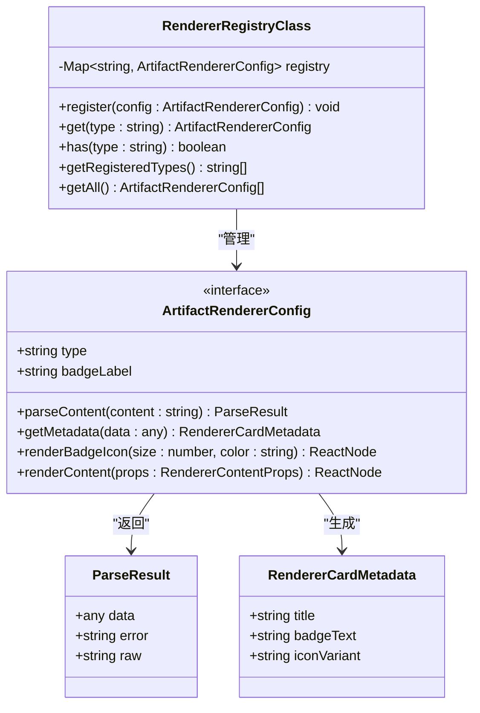

**图示来源**
- [RendererRegistry.ts:10-54](file://src/components/chat/renderers/RendererRegistry.ts#L10-L54)
- [types.ts:17-58](file://src/components/chat/renderers/types.ts#L17-L58)

**章节来源**
- [RendererRegistry.ts:10-54](file://src/components/chat/renderers/RendererRegistry.ts#L10-L54)
- [types.ts:14-72](file://src/components/chat/renderers/types.ts#L14-L72)

## 工件解析系统
新架构增强了工件解析的健壮性和类型检测能力：

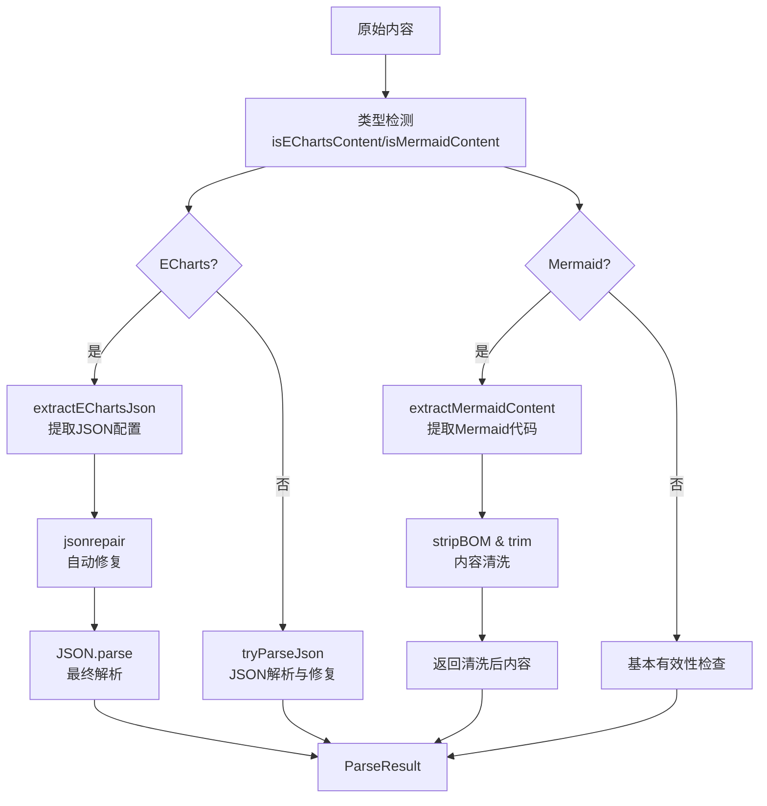

**图示来源**
- [artifact-parser.ts:45-73](file://src/lib/artifact-parser.ts#L45-L73)
- [artifact-parser.ts:134-149](file://src/lib/artifact-parser.ts#L134-L149)
- [artifact-parser.ts:181-204](file://src/lib/artifact-parser.ts#L181-L204)

**章节来源**
- [artifact-parser.ts:17-238](file://src/lib/artifact-parser.ts#L17-L238)

## 工件库界面
新架构提供了完整的全局工件库界面：

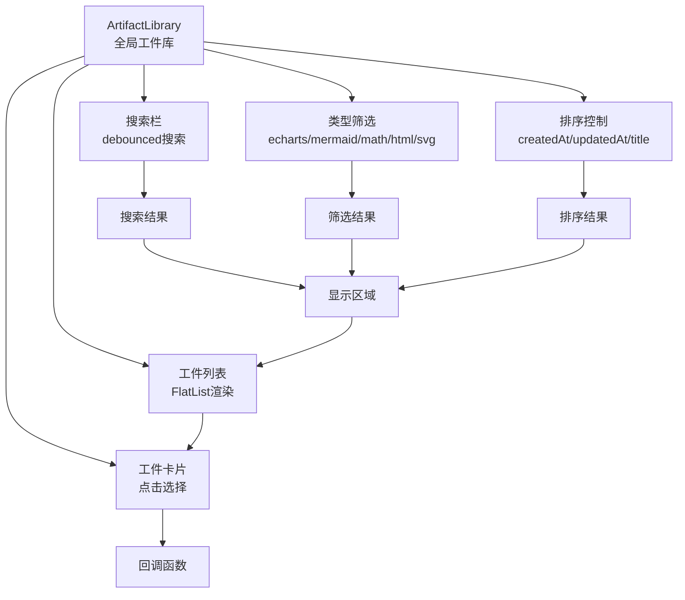

**图示来源**
- [ArtifactLibrary.tsx:46-112](file://src/components/rag/ArtifactLibrary.tsx#L46-L112)
- [ArtifactLibrary.tsx:119-159](file://src/components/rag/ArtifactLibrary.tsx#L119-L159)

**章节来源**
- [ArtifactLibrary.tsx:1-399](file://src/components/rag/ArtifactLibrary.tsx#L1-L399)

## 工作区绑定机制
重构后的架构引入了工作区绑定机制，确保文件操作的作用域：

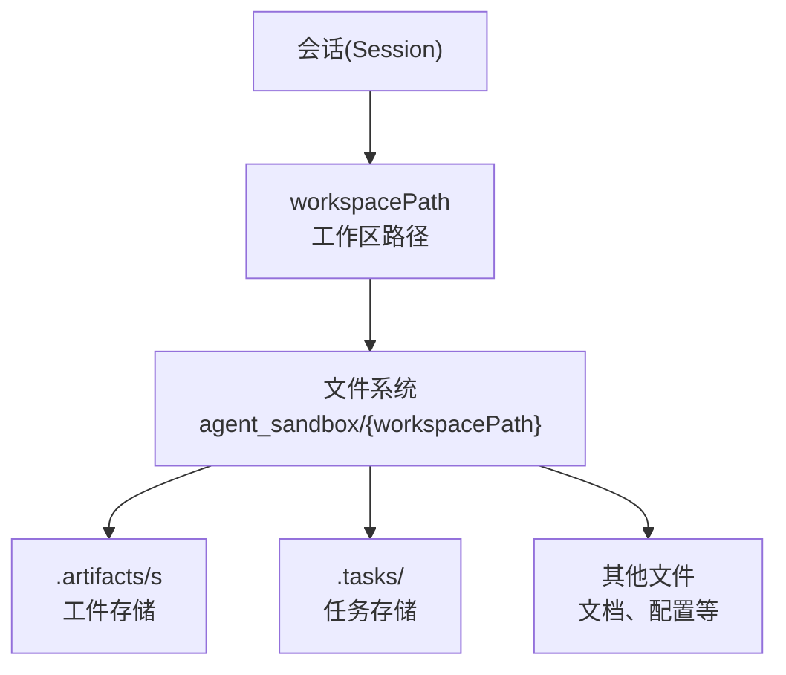

**图示来源**
- [workspace.ts:30-52](file://worktree/src/lib/skills/definitions/workspace.ts#L30-L52)
- [artifact.ts:30-51](file://worktree/src/lib/skills/definitions/artifact.ts#L30-L51)

**章节来源**
- [workspace.ts:135-175](file://worktree/src/lib/skills/definitions/workspace.ts#L135-L175)
- [artifact.ts:30-51](file://worktree/src/lib/skills/definitions/artifact.ts#L30-L51)

## 文件系统存储策略
重构后的架构采用基于Expo FileSystem的独立存储：

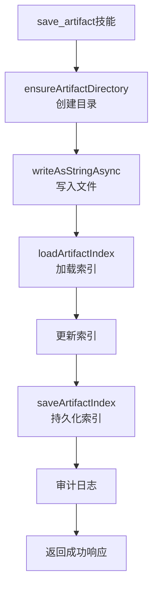

**图示来源**
- [artifact.ts:120-195](file://worktree/src/lib/skills/definitions/artifact.ts#L120-L195)
- [artifact.ts:58-79](file://worktree/src/lib/skills/definitions/artifact.ts#L58-L79)

**章节来源**
- [artifact.ts:81-195](file://worktree/src/lib/skills/definitions/artifact.ts#L81-L195)
- [artifact.ts:58-79](file://worktree/src/lib/skills/definitions/artifact.ts#L58-L79)

## UI组件集成
重构后的架构提供了完整的UI组件生态系统：

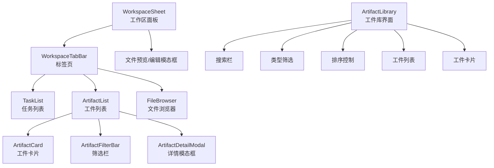

**图示来源**
- [index.ts:1-328](file://src/features/chat/components/WorkspaceSheet/index.tsx#L1-L328)
- [ArtifactList.tsx:1-208](file://src/features/chat/components/WorkspaceSheet/ArtifactList.tsx#L1-L208)
- [ArtifactLibrary.tsx:161-264](file://src/components/rag/ArtifactLibrary.tsx#L161-L264)

**章节来源**
- [index.ts:1-328](file://src/features/chat/components/WorkspaceSheet/index.tsx#L1-L328)
- [ArtifactList.tsx:1-208](file://src/features/chat/components/WorkspaceSheet/ArtifactList.tsx#L1-L208)
- [ArtifactLibrary.tsx:1-399](file://src/components/rag/ArtifactLibrary.tsx#L1-L399)

## 依赖分析
重构后的架构依赖关系更加复杂和模块化：

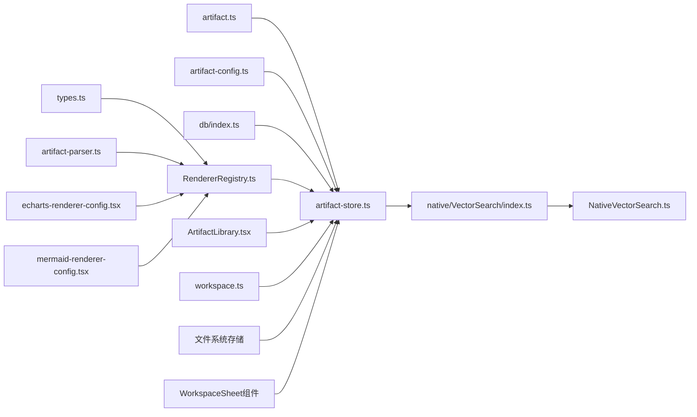

**图示来源**
- [artifact.ts:1-51](file://src/types/artifact.ts#L1-L51)
- [artifact-store.ts:1-343](file://src/store/artifact-store.ts#L1-L343)
- [RendererRegistry.ts:1-54](file://src/components/chat/renderers/RendererRegistry.ts#L1-L54)
- [types.ts:1-72](file://src/components/chat/renderers/types.ts#L1-L72)
- [artifact-parser.ts:1-238](file://src/lib/artifact-parser.ts#L1-L238)
- [ArtifactLibrary.tsx:1-399](file://src/components/rag/ArtifactLibrary.tsx#L1-L399)

**章节来源**
- [artifact-store.ts:1-343](file://src/store/artifact-store.ts#L1-L343)
- [RendererRegistry.ts:1-54](file://src/components/chat/renderers/RendererRegistry.ts#L1-L54)
- [artifact-parser.ts:1-238](file://src/lib/artifact-parser.ts#L1-L238)
- [ArtifactLibrary.tsx:1-399](file://src/components/rag/ArtifactLibrary.tsx#L1-L399)

## 性能考虑
重构后的架构在性能方面有显著改进：

- **渲染器注册表**：集中管理渲染器配置，支持动态注册和查询
- **内容解析缓存**：解析后的数据可以缓存，避免重复解析
- **工件库搜索优化**：支持debounced搜索，减少频繁查询
- **类型检测**：快速类型检测避免不必要的解析操作
- **文件系统存储**：独立文件存储避免了消息大小限制，支持大文件工件
- **工作区隔离**：每个会话独立的工作区路径，避免数据冲突
- **异步操作**：文件系统操作采用异步模式，不影响UI响应
- **缓存策略**：结合内存状态和文件系统缓存，提升访问速度
- **索引优化**：文件系统索引支持快速查找和筛选

**章节来源**
- [artifact-parser.ts:209-238](file://src/lib/artifact-parser.ts#L209-L238)
- [ArtifactLibrary.tsx:57](file://src/components/rag/ArtifactLibrary.tsx#L57)
- [artifact.ts:120-195](file://worktree/src/lib/skills/definitions/artifact.ts#L120-L195)
- [workspace.ts:22-52](file://worktree/src/lib/skills/definitions/workspace.ts#L22-L52)

## 故障排查指南
重构后的架构可能遇到的问题和解决方案：

- **渲染器注册失败**
  - 现象：工件无法正确渲染
  - 处理：检查RendererRegistry.register()调用，确认渲染器配置正确
- **内容解析错误**
  - 现象：工件内容显示异常或解析失败
  - 处理：检查artifact-parser.ts中的解析逻辑，验证输入格式
- **工件库搜索无响应**
  - 现象：搜索框输入无反应
  - 处理：检查debounced搜索实现，确认搜索API调用
- **类型检测失败**
  - 现象：工件类型识别错误
  - 处理：检查isEChartsContent/isMermaidContent函数的正则表达式
- **工作区路径错误**
  - 现象：文件无法保存或读取
  - 处理：检查会话的workspacePath配置，确认目录存在
- **文件系统权限**
  - 现象：写入失败或权限错误
  - 处理：验证Expo FileSystem权限，检查目录创建权限
- **索引损坏**
  - 现象：工件列表显示异常
  - 处理：重建index.json文件，重新加载工件索引
- **内存泄漏**
  - 现象：长时间使用后内存占用增加
  - 处理：定期清理不需要的工件，优化状态管理

**章节来源**
- [RendererRegistry.ts:16-21](file://src/components/chat/renderers/RendererRegistry.ts#L16-L21)
- [artifact-parser.ts:209-238](file://src/lib/artifact-parser.ts#L209-L238)
- [ArtifactLibrary.tsx:65-75](file://src/components/rag/ArtifactLibrary.tsx#L65-L75)
- [workspace.ts:144-175](file://worktree/src/lib/skills/definitions/workspace.ts#L144-L175)
- [artifact.ts:58-79](file://worktree/src/lib/skills/definitions/artifact.ts#L58-L79)

## 结论
重构后的架构通过统一的渲染器注册框架、智能解析系统和全局工件库，完全替代了传统的任务管理状态管理模式。系统现在能够：

- 支持更大规模的工件存储
- 提供跨会话的工件访问能力
- 实现更灵活的工作区管理
- 增强了系统的可扩展性和可维护性
- 提供统一的渲染器接口和配置系统
- 增强了工件解析的健壮性和类型检测能力
- 新增了全局工件库界面，支持跨会话搜索和管理

建议在生产环境中继续完善渲染器扩展机制，优化解析性能，并增强工件的版本控制和共享能力。

## 附录

### 扩展接口与自定义工件类型实现指南
重构后的架构下的扩展指南：

- **新增渲染器类型**：实现ArtifactRendererConfig接口，包含type、badgeLabel、parseContent、getMetadata、renderBadgeIcon、renderContent方法
- **注册渲染器**：在renderers/index.ts中导入并注册新的渲染器配置
- **内容解析**：在artifact-parser.ts中添加相应的解析函数和类型检测
- **UI组件适配**：在工件库界面中添加对应类型的筛选和显示逻辑
- **工作区集成**：确保新类型符合工作区存储规范
- **状态管理**：无需修改，Zustand状态管理天然支持新类型

**章节来源**
- [types.ts:17-45](file://src/components/chat/renderers/types.ts#L17-L45)
- [index.ts:8-18](file://src/components/chat/renderers/index.ts#L8-L18)
- [artifact-parser.ts:134-204](file://src/lib/artifact-parser.ts#L134-L204)
- [ArtifactLibrary.tsx:24-41](file://src/components/rag/ArtifactLibrary.tsx#L24-L41)
- [artifact.ts:6](file://src/types/artifact.ts#L6)
- [artifact-config.ts:8-78](file://src/constants/artifact-config.ts#L8-L78)