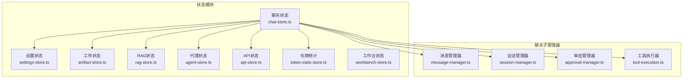
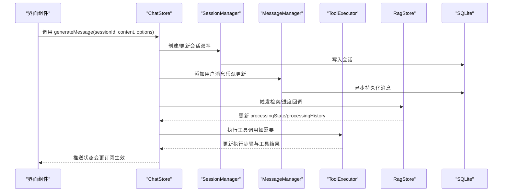
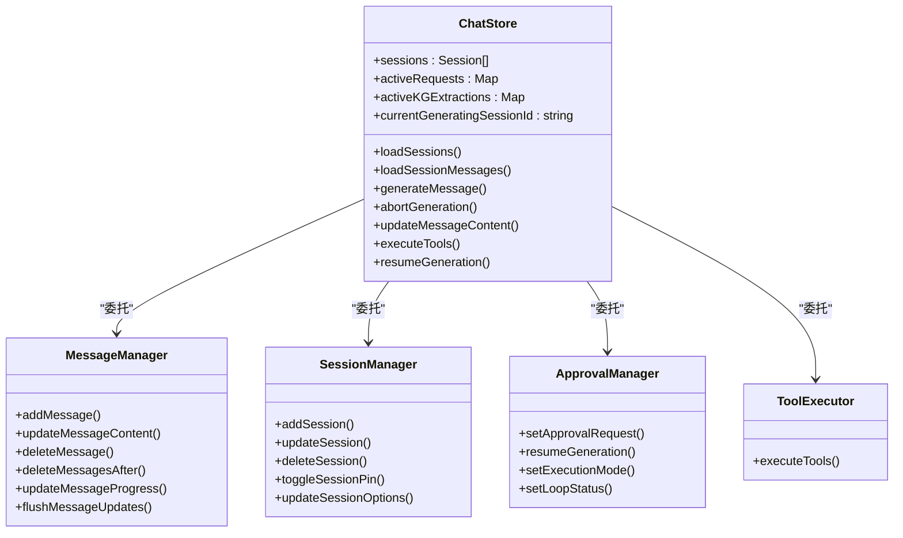
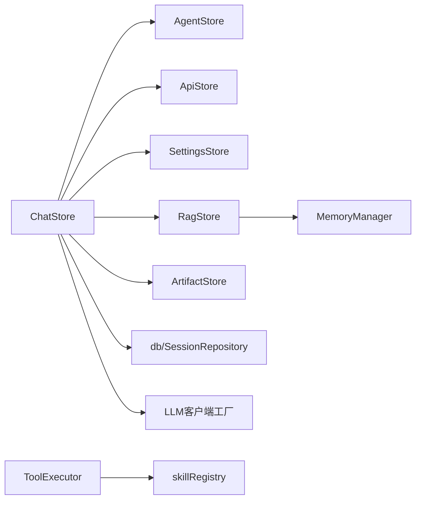

# 状态管理

<cite>
**本文引用的文件**
- [src/store/chat-store.ts](file://src/store/chat-store.ts)
- [src/store/settings-store.ts](file://src/store/settings-store.ts)
- [src/store/artifact-store.ts](file://src/store/artifact-store.ts)
- [src/store/rag-store.ts](file://src/store/rag-store.ts)
- [src/store/agent-store.ts](file://src/store/agent-store.ts)
- [src/store/api-store.ts](file://src/store/api-store.ts)
- [src/store/token-stats-store.ts](file://src/store/token-stats-store.ts)
- [src/store/workbench-store.ts](file://src/store/workbench-store.ts)
- [src/store/chat/index.ts](file://src/store/chat/index.ts)
- [src/store/chat/message-manager.ts](file://src/store/chat/message-manager.ts)
- [src/store/chat/session-manager.ts](file://src/store/chat/session-manager.ts)
- [src/store/chat/approval-manager.ts](file://src/store/chat/approval-manager.ts)
- [src/store/chat/tool-execution.ts](file://src/store/chat/tool-execution.ts)
- [src/types/chat.ts](file://src/types/chat.ts)
- [src/types/artifact.ts](file://src/types/artifact.ts)
</cite>

## 目录
1. [引言](#引言)
2. [项目结构](#项目结构)
3. [核心组件](#核心组件)
4. [架构总览](#架构总览)
5. [详细组件分析](#详细组件分析)
6. [依赖分析](#依赖分析)
7. [性能考量](#性能考量)
8. [故障排查指南](#故障排查指南)
9. [结论](#结论)
10. [附录](#附录)

## 引言
本文件面向Nexara状态管理系统，围绕Zustand状态库的使用模式与架构设计进行系统化技术文档编写。重点涵盖：
- 状态划分与职责边界：聊天、设置、工件、RAG、代理、API、令牌统计、工作台等模块
- 异步状态更新与双写策略：Zustand内存态 + SQLite持久化
- 状态订阅与组件绑定：如何在UI中高效订阅与响应状态变化
- 状态同步与一致性：会话、消息、工具执行、RAG进度等跨模块协作
- 状态持久化策略：基于persist中间件与自定义存储策略
- 性能优化：节流/防抖、分页加载、增量更新、布局缓存
- 状态调试与开发辅助：Hydration修复、错误兜底、统计追踪
- 最佳实践与常见陷阱：避免竞态、内存泄漏、状态膨胀、UI阻塞

## 项目结构
Nexara采用“按领域划分”的store组织方式，每个store模块负责单一职责，并通过Zustand的create与persist中间件实现状态持久化与Hydration。

图表来源
- [src/store/chat-store.ts:212-360](file://src/store/chat-store.ts#L212-L360)
- [src/store/chat/index.ts:8-11](file://src/store/chat/index.ts#L8-L11)
- [src/store/chat/message-manager.ts:18-442](file://src/store/chat/message-manager.ts#L18-L442)
- [src/store/chat/session-manager.ts:15-281](file://src/store/chat/session-manager.ts#L15-L281)
- [src/store/chat/approval-manager.ts:9-173](file://src/store/chat/approval-manager.ts#L9-L173)
- [src/store/chat/tool-execution.ts:20-379](file://src/store/chat/tool-execution.ts#L20-L379)

章节来源
- [src/store/chat-store.ts:108-210](file://src/store/chat-store.ts#L108-L210)
- [src/store/chat/index.ts:1-24](file://src/store/chat/index.ts#L1-L24)

## 核心组件
- 聊天状态（ChatStore）：统一协调会话、消息、生成流程、工具执行、审批与RAG进度；通过管理器模块实现职责分离。
- 设置状态（SettingsStore）：语言、主题、RAG全局配置、执行模式、技能开关、本地模型开关、日志开关等。
- 工件状态（ArtifactStore）：对生成内容（图表、Mermaid、数学公式等）进行增删改查与筛选。
- RAG状态（RagStore）：文档/文件夹/记忆管理、向量化队列、KG抽取、检索进度与统计。
- 代理状态（AgentStore）：代理初始化、增删改、固定与获取。
- API状态（ApiStore）：多提供商配置、模型启用/禁用、统计与搜索配置。
- 令牌统计（TokenStatsStore）：全局/模型/供应商维度的用量聚合与重水合修复。
- 工作台状态（WorkbenchStore）：服务端状态、访问码、客户端连接数与令牌管理。

章节来源
- [src/store/chat-store.ts:108-210](file://src/store/chat-store.ts#L108-L210)
- [src/store/settings-store.ts:10-73](file://src/store/settings-store.ts#L10-L73)
- [src/store/artifact-store.ts:16-32](file://src/store/artifact-store.ts#L16-L32)
- [src/store/rag-store.ts:24-145](file://src/store/rag-store.ts#L24-L145)
- [src/store/agent-store.ts:7-15](file://src/store/agent-store.ts#L7-L15)
- [src/store/api-store.ts:9-36](file://src/store/api-store.ts#L9-L36)
- [src/store/token-stats-store.ts:31-40](file://src/store/token-stats-store.ts#L31-L40)
- [src/store/workbench-store.ts:5-20](file://src/store/workbench-store.ts#L5-L20)

## 架构总览
Zustand通过create与persist中间件实现状态持久化与Hydration；聊天主状态通过管理器模块解耦复杂业务逻辑，确保store文件保持轻量与热路径稳定。

图表来源
- [src/store/chat-store.ts:360-730](file://src/store/chat-store.ts#L360-L730)
- [src/store/chat/session-manager.ts:18-94](file://src/store/chat/session-manager.ts#L18-L94)
- [src/store/chat/message-manager.ts:204-334](file://src/store/chat/message-manager.ts#L204-L334)
- [src/store/chat/tool-execution.ts:23-379](file://src/store/chat/tool-execution.ts#L23-L379)
- [src/store/rag-store.ts:127-131](file://src/store/rag-store.ts#L127-L131)

## 详细组件分析

### 聊天状态（ChatStore）
- 职责：会话生命周期管理、消息增删改、生成流程编排、工具执行、审批与续杯、RAG检索与进度、KG抽取状态、分页加载与草稿。
- 关键点：
  - 管理器模式：createMessageManager/createSessionManager/createApprovalManager/createToolExecutor将复杂逻辑外置，保持store热路径简洁。
  - 双写策略：消息与会话均在Zustand内存态与SQLite之间同步，确保UI即时反馈与数据持久化。
  - 异步生成：创建用户消息后，构建上下文（含RAG检索、Web搜索、工具可用性），调用LLM客户端流式输出，期间通过RagStore推进检索进度。
  - 审批与续杯：半自动/手动模式下，通过approvalManager处理工具审批与续杯额度，支持人工干预与批量工具执行。
  - 文件与图片：根据模型能力选择原生文档输入或文本提取策略，统一注入到消息内容。
  - 令牌统计：通过MessageManager的节流更新与flushMessageUpdates，结合TokenStatsStore进行全局/模型/供应商维度聚合。

图表来源
- [src/store/chat-store.ts:212-360](file://src/store/chat-store.ts#L212-L360)
- [src/store/chat/message-manager.ts:18-442](file://src/store/chat/message-manager.ts#L18-L442)
- [src/store/chat/session-manager.ts:15-281](file://src/store/chat/session-manager.ts#L15-L281)
- [src/store/chat/approval-manager.ts:9-173](file://src/store/chat/approval-manager.ts#L9-L173)
- [src/store/chat/tool-execution.ts:20-379](file://src/store/chat/tool-execution.ts#L20-L379)

章节来源
- [src/store/chat-store.ts:108-210](file://src/store/chat-store.ts#L108-L210)
- [src/store/chat-store.ts:360-730](file://src/store/chat-store.ts#L360-L730)
- [src/store/chat/message-manager.ts:204-334](file://src/store/chat/message-manager.ts#L204-L334)
- [src/store/chat/session-manager.ts:18-94](file://src/store/chat/session-manager.ts#L18-L94)
- [src/store/chat/approval-manager.ts:12-80](file://src/store/chat/approval-manager.ts#L12-L80)
- [src/store/chat/tool-execution.ts:23-138](file://src/store/chat/tool-execution.ts#L23-L138)

### 设置状态（SettingsStore）
- 职责：语言、用户资料、触觉反馈、主题色、默认模型、RAG全局配置、执行模式、技能开关、本地模型开关、日志开关、首启标记。
- 持久化：通过persist中间件与createJSONStorage持久化到AsyncStorage，partialize仅保存必要字段，onRehydrateStorage进行Hydration修复与校验。

章节来源
- [src/store/settings-store.ts:10-73](file://src/store/settings-store.ts#L10-L73)
- [src/store/settings-store.ts:208-242](file://src/store/settings-store.ts#L208-L242)

### 工件状态（ArtifactStore）
- 职责：工件的增删改查、筛选、按会话/消息查询；与数据库交互，支持标签、预览图、标题等字段。
- 关键点：applyFilter在内存中进行，减少数据库压力；rowToArtifact解析JSON标签；异步写入后同步更新filteredArtifacts。

章节来源
- [src/store/artifact-store.ts:16-32](file://src/store/artifact-store.ts#L16-L32)
- [src/store/artifact-store.ts:64-93](file://src/store/artifact-store.ts#L64-L93)
- [src/store/artifact-store.ts:102-122](file://src/store/artifact-store.ts#L102-L122)

### RAG状态（RagStore）
- 职责：文档/文件夹/记忆管理、向量化队列、KG抽取、检索进度与统计、物理沙箱目录管理、批量操作。
- 关键点：VectorizationQueue统一调度；processingState/processingHistory用于UI进度指示；_ensureWorkspace确保工作区目录存在；支持全局/私有文档切换与KG抽取策略。

章节来源
- [src/store/rag-store.ts:24-145](file://src/store/rag-store.ts#L24-L145)
- [src/store/rag-store.ts:147-241](file://src/store/rag-store.ts#L147-L241)
- [src/store/rag-store.ts:243-368](file://src/store/rag-store.ts#L243-L368)

### 代理状态（AgentStore）
- 职责：代理初始化（按语言）、增删改、固定/取消固定、按ID获取；首次启动时从预设初始化。

章节来源
- [src/store/agent-store.ts:7-15](file://src/store/agent-store.ts#L7-L15)
- [src/store/agent-store.ts:22-30](file://src/store/agent-store.ts#L22-L30)

### API状态（ApiStore）
- 职责：提供商增删改、启用/禁用、模型启用/禁用映射、统计更新、搜索配置。
- 关键点：enabledModels与providers双向同步，toggleModel同时维护SSOT；updateStats聚合全局统计。

章节来源
- [src/store/api-store.ts:9-36](file://src/store/api-store.ts#L9-L36)
- [src/store/api-store.ts:97-123](file://src/store/api-store.ts#L97-L123)
- [src/store/api-store.ts:125-147](file://src/store/api-store.ts#L125-L147)

### 令牌统计（TokenStatsStore）
- 职责：全局/模型/供应商维度的用量聚合，支持重水合修复与字段校验，保障数据完整性。
- 关键点：accumulate/accumulateProviderStats深拷贝累加，避免状态污染；onRehydrateStorage逐字段修复。

章节来源
- [src/store/token-stats-store.ts:31-40](file://src/store/token-stats-store.ts#L31-L40)
- [src/store/token-stats-store.ts:58-88](file://src/store/token-stats-store.ts#L58-L88)
- [src/store/token-stats-store.ts:181-268](file://src/store/token-stats-store.ts#L181-L268)

### 工作台状态（WorkbenchStore）
- 职责：服务端状态、URL、访问码、连接客户端数、活动令牌管理；部分字段持久化。

章节来源
- [src/store/workbench-store.ts:5-20](file://src/store/workbench-store.ts#L5-L20)
- [src/store/workbench-store.ts:46-54](file://src/store/workbench-store.ts#L46-L54)

## 依赖分析
- ChatStore依赖多个store与工具模块：AgentStore、ApiStore、SettingsStore、RagStore、ArtifactStore、db与llm客户端工厂。
- 管理器模块内部依赖：SessionRepository（SQLite封装）、skillRegistry（工具注册中心）、MemoryManager（RAG检索与摘要）。
- 类型定义：chat.ts与artifact.ts提供强类型支撑，确保跨模块协作的一致性。

图表来源
- [src/store/chat-store.ts:21-43](file://src/store/chat-store.ts#L21-L43)
- [src/store/chat/tool-execution.ts:11-18](file://src/store/chat/tool-execution.ts#L11-L18)
- [src/store/rag-store.ts:6-8](file://src/store/rag-store.ts#L6-L8)

章节来源
- [src/store/chat-store.ts:21-43](file://src/store/chat-store.ts#L21-L43)
- [src/store/chat/tool-execution.ts:11-18](file://src/store/chat/tool-execution.ts#L11-L18)
- [src/store/rag-store.ts:6-8](file://src/store/rag-store.ts#L6-L8)

## 性能考量
- 节流与防抖
  - 消息更新：MessageManager对高频更新进行100ms节流与500ms数据库防抖，平衡UI流畅度与数据一致性。
  - 滚动偏移：SessionManager对高频滚动偏移仅更新Zustand，避免频繁写库。
- 分页加载
  - ChatStore按需加载会话消息，避免一次性加载大量历史导致内存与渲染压力。
- 布局缓存
  - MessageManager对消息布局高度进行阈值更新（±10px），减少不必要的重绘。
- 模型能力感知
  - SessionManager根据模型能力自动设置toolsEnabled默认值，减少无效工具调用。
- 检索与进度
  - RagStore的processingState/processingHistory用于UI进度指示，避免阻塞主线程；MemoryManager检索带超时保护（30秒）。
- 统计与估算
  - TokenStatsStore对估算标记（isEstimated）进行聚合，避免误判成本。

章节来源
- [src/store/chat/message-manager.ts:15-75](file://src/store/chat/message-manager.ts#L15-L75)
- [src/store/chat/message-manager.ts:271-279](file://src/store/chat/message-manager.ts#L271-L279)
- [src/store/chat-store.ts:665-687](file://src/store/chat-store.ts#L665-L687)
- [src/store/rag-store.ts:98-131](file://src/store/rag-store.ts#L98-L131)
- [src/store/token-stats-store.ts:58-88](file://src/store/token-stats-store.ts#L58-L88)

## 故障排查指南
- Hydration修复
  - SettingsStore与TokenStatsStore在onRehydrateStorage中进行字段校验与修复，防止损坏数据导致崩溃。
- 数据库异常
  - MessageManager/SessionManager对DB写入失败进行告警与降级处理（UI仍更新，DB失败不影响后续刷新）。
- 检索超时
  - ChatStore对RAG检索设置30秒超时，失败时清理processingState并提示用户。
- 工具执行拦截
  - ToolExecutor对被禁用工具与MCP服务器禁用进行拦截与反馈，避免无效调用。
- 令牌统计异常
  - TokenStatsStore对缺失字段进行默认值填充，确保聚合统计可用。

章节来源
- [src/store/settings-store.ts:233-240](file://src/store/settings-store.ts#L233-L240)
- [src/store/token-stats-store.ts:181-268](file://src/store/token-stats-store.ts#L181-L268)
- [src/store/chat/message-manager.ts:224-230](file://src/store/chat/message-manager.ts#L224-L230)
- [src/store/chat-store.ts:677-687](file://src/store/chat-store.ts#L677-L687)
- [src/store/chat/tool-execution.ts:163-197](file://src/store/chat/tool-execution.ts#L163-L197)
- [src/store/token-stats-store.ts:181-268](file://src/store/token-stats-store.ts#L181-L268)

## 结论
Nexara的状态管理以Zustand为核心，结合管理器模式与持久化中间件，实现了高内聚、低耦合的状态体系。通过双写策略、节流防抖、分页加载与进度可视化，兼顾了用户体验与系统稳定性。未来可在以下方面持续优化：
- 进一步细化store粒度，减少跨模块耦合
- 引入更细粒度的订阅与选择器，降低无关重渲染
- 增强离线与冲突解决策略，提升数据一致性
- 完善状态快照与回放能力，便于调试与审计

## 附录

### 状态订阅与最佳实践
- 订阅策略
  - 使用useStore(selector)选择器订阅局部状态，避免全量订阅导致的不必要重渲染。
  - 对高频更新字段（如滚动偏移、进度）采用浅比较与memo化。
- 更新策略
  - 优先使用管理器模块进行批量更新，确保原子性与一致性。
  - 对外部副作用（如DB写入、网络请求）采用异步处理，保持UI流畅。
- 错误处理
  - 对DB写入与网络请求失败进行降级处理与用户提示。
  - 对估算类统计（如RAG开销）明确标注isEstimated，避免误导。

### 常见陷阱与规避
- 竞态条件：通过flushMessageUpdates与步骤追加的原子更新，避免缓冲区竞争导致的步骤丢失。
- 内存泄漏：及时清理超时Promise与定时器，避免闭包持有过期引用。
- 状态膨胀：利用partialize与选择性Hydration，仅持久化必要字段。
- UI阻塞：将重型操作（如RAG检索、文件读取）放入异步任务，必要时设置超时与中断。