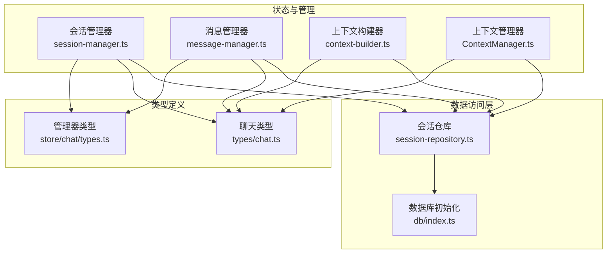
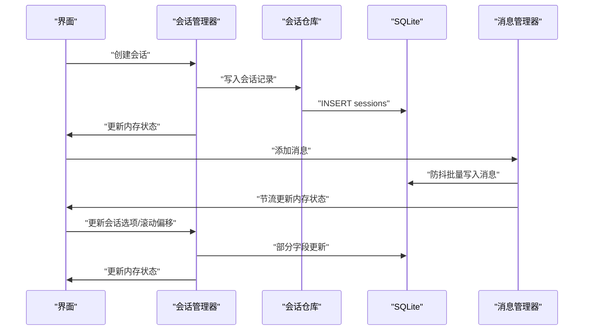
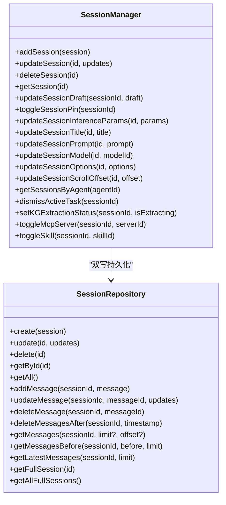
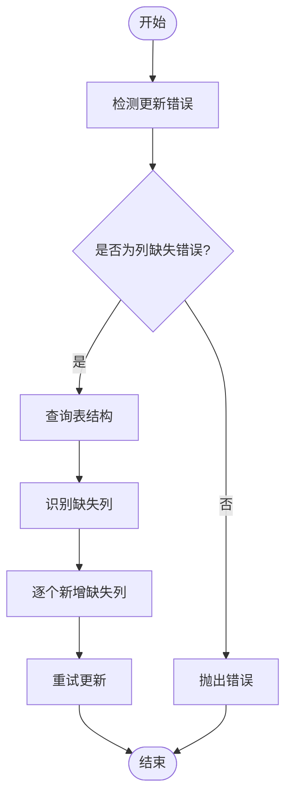
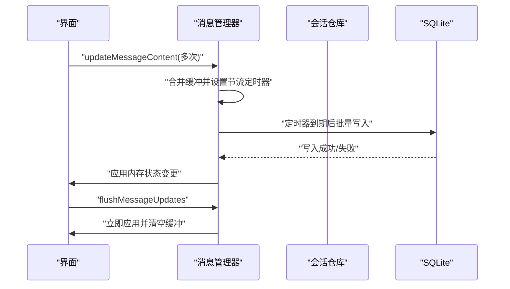
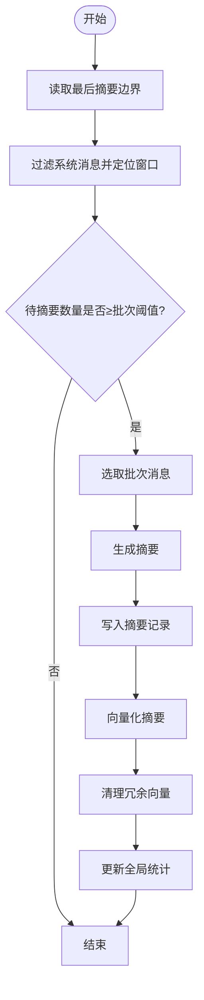
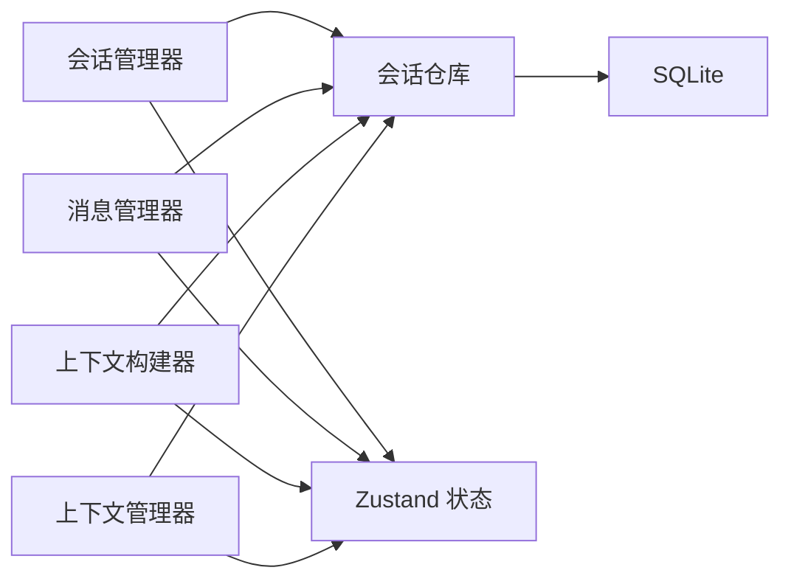

# 会话管理

<cite>
**本文引用的文件**
- [src/store/chat/session-manager.ts](file://src/store/chat/session-manager.ts)
- [src/lib/db/session-repository.ts](file://src/lib/db/session-repository.ts)
- [src/types/chat.ts](file://src/types/chat.ts)
- [src/store/chat/types.ts](file://src/store/chat/types.ts)
- [src/store/chat/message-manager.ts](file://src/store/chat/message-manager.ts)
- [src/features/chat/utils/ContextManager.ts](file://src/features/chat/utils/ContextManager.ts)
- [src/store/chat/context-builder.ts](file://src/store/chat/context-builder.ts)
- [src/lib/db/index.ts](file://src/lib/db/index.ts)
</cite>

## 目录
1. [简介](#简介)
2. [项目结构](#项目结构)
3. [核心组件](#核心组件)
4. [架构总览](#架构总览)
5. [详细组件分析](#详细组件分析)
6. [依赖关系分析](#依赖关系分析)
7. [性能考量](#性能考量)
8. [故障排查指南](#故障排查指南)
9. [结论](#结论)
10. [附录](#附录)

## 简介
本技术文档围绕 Nexara 的会话管理系统展开，系统采用 SQLite 与内存状态双写模式，结合 Zustand 状态管理，实现会话的创建、更新、删除与加载；同时提供会话选项、推理参数、滚动偏移、草稿、任务与 MCP/技能开关等细粒度控制。文档将深入解析会话状态结构、持久化策略、生命周期管理、与代理的关系、会话选项配置与滚动偏移管理，并给出最佳实践、性能优化与常见问题解决方案。

## 项目结构
会话管理相关的关键模块分布如下：
- 状态与管理
  - 会话管理器：负责会话的增删改查与高频状态更新（如滚动偏移）
  - 消息管理器：负责消息的增删改与流式更新的防抖持久化
  - 上下文构建器：负责 RAG/Web 搜索、系统提示词拼装与工具注入
  - 上下文管理器：负责会话上下文摘要生成、向量化与清理
- 数据访问层
  - 会话仓库：封装 SQLite 会话与消息的 CRUD 操作，具备自修复能力
  - 数据库初始化：WAL 模式与外键约束启用
- 类型定义
  - 会话、消息、推理参数、RAG 配置等核心类型

**图表来源**
- [src/store/chat/session-manager.ts:15-281](file://src/store/chat/session-manager.ts#L15-L281)
- [src/store/chat/message-manager.ts:18-442](file://src/store/chat/message-manager.ts#L18-L442)
- [src/store/chat/context-builder.ts:17-348](file://src/store/chat/context-builder.ts#L17-L348)
- [src/features/chat/utils/ContextManager.ts:28-482](file://src/features/chat/utils/ContextManager.ts#L28-L482)
- [src/lib/db/session-repository.ts:1-425](file://src/lib/db/session-repository.ts#L1-L425)
- [src/lib/db/index.ts:1-13](file://src/lib/db/index.ts#L1-L13)
- [src/types/chat.ts:169-223](file://src/types/chat.ts#L169-L223)
- [src/store/chat/types.ts:77-103](file://src/store/chat/types.ts#L77-L103)

**章节来源**
- [src/store/chat/session-manager.ts:15-281](file://src/store/chat/session-manager.ts#L15-L281)
- [src/lib/db/session-repository.ts:1-425](file://src/lib/db/session-repository.ts#L1-L425)
- [src/types/chat.ts:169-223](file://src/types/chat.ts#L169-L223)
- [src/store/chat/types.ts:77-103](file://src/store/chat/types.ts#L77-L103)
- [src/store/chat/message-manager.ts:18-442](file://src/store/chat/message-manager.ts#L18-L442)
- [src/store/chat/context-builder.ts:17-348](file://src/store/chat/context-builder.ts#L17-L348)
- [src/features/chat/utils/ContextManager.ts:28-482](file://src/features/chat/utils/ContextManager.ts#L28-L482)
- [src/lib/db/index.ts:1-13](file://src/lib/db/index.ts#L1-L13)

## 核心组件
- 会话管理器（SessionManager）
  - 提供会话的创建、更新、删除、查询、草稿更新、置顶切换、推理参数更新、标题/提示词/模型更新、选项合并、滚动偏移更新、按代理筛选、任务解除、MCP 服务器与技能开关等能力
  - 采用“内存优先、异步落库”的双写策略，确保 UI 流畅与数据持久化
- 会话仓库（SessionRepository）
  - 封装 SQLite 会话与消息的 CRUD，支持部分字段更新与自修复（Schema Drift Auto-Fix）
  - 提供完整会话加载、分页消息加载、游标翻页加载等
- 消息管理器（MessageManager）
  - 针对高频流式更新（如内容、token、RAG 引用、工具调用等）采用节流与防抖，合并批量写入 SQLite
  - 支持向量化状态同步、布局高度缓存、删除消息与截断等
- 上下文构建器（ContextBuilder）
  - 组合 RAG 检索、Web 搜索、系统提示词注入（含工具描述、任务状态、时间注入等），并产出最终系统提示词
- 上下文管理器（ContextManager）
  - 实现会话上下文摘要生成、向量化、统计追踪与冗余向量清理，保障长上下文的可扩展性
- 数据库初始化（db/index.ts）
  - 初始化 SQLite，开启 WAL 模式与外键约束，提升并发与一致性

**章节来源**
- [src/store/chat/session-manager.ts:15-281](file://src/store/chat/session-manager.ts#L15-L281)
- [src/lib/db/session-repository.ts:11-155](file://src/lib/db/session-repository.ts#L11-L155)
- [src/store/chat/message-manager.ts:18-442](file://src/store/chat/message-manager.ts#L18-L442)
- [src/store/chat/context-builder.ts:17-348](file://src/store/chat/context-builder.ts#L17-L348)
- [src/features/chat/utils/ContextManager.ts:28-482](file://src/features/chat/utils/ContextManager.ts#L28-L482)
- [src/lib/db/index.ts:7-12](file://src/lib/db/index.ts#L7-L12)

## 架构总览
会话管理采用“状态层（Zustand）+ 数据层（SQLite）+ 业务层（管理器/构建器）”三层架构，其中：
- 状态层负责即时 UI 响应与高频更新
- 数据层负责持久化与跨进程/重启恢复
- 业务层负责领域逻辑（会话生命周期、上下文构建、摘要与向量化）

**图表来源**
- [src/store/chat/session-manager.ts:19-53](file://src/store/chat/session-manager.ts#L19-L53)
- [src/lib/db/session-repository.ts:14-50](file://src/lib/db/session-repository.ts#L14-L50)
- [src/store/chat/message-manager.ts:205-231](file://src/store/chat/message-manager.ts#L205-L231)

## 详细组件分析

### 会话管理器（SessionManager）
- 设计要点
  - 双写策略：先写 SQLite，再更新 Zustand 内存状态，失败时记录告警并继续内存操作
  - 自动补全：根据模型能力自动设置工具开关默认值；继承 MCP 默认服务器集合
  - 高频更新优化：滚动偏移仅更新内存，避免频繁落库
  - 会话清理：删除会话时清理知识图谱节点与边，确保无悬挂数据
- 关键方法与行为
  - addSession：丰富默认字段后双写
  - updateSession/updateSessionDraft/toggleSessionPin/updateSessionInferenceParams/updateSessionTitle/updateSessionPrompt/updateSessionModel/updateSessionOptions/updateSessionScrollOffset/deleteSession/getSession/getSessionsByAgent/dismissActiveTask/setKGExtractionStatus/toggleMcpServer/toggleSkill
- 与代理的关系
  - 会话包含 agentId 字段，可通过 getSessionsByAgent 按代理聚合展示
  - 模型能力决定工具默认开关，体现代理能力与会话配置的联动

**图表来源**
- [src/store/chat/session-manager.ts:15-281](file://src/store/chat/session-manager.ts#L15-L281)
- [src/lib/db/session-repository.ts:405-425](file://src/lib/db/session-repository.ts#L405-L425)

**章节来源**
- [src/store/chat/session-manager.ts:15-281](file://src/store/chat/session-manager.ts#L15-L281)

### 会话仓库（SessionRepository）
- 设计要点
  - 部分字段更新：动态拼接 SET 子句，仅更新传入字段
  - 自修复能力：检测“列不存在”错误时自动新增缺失列并重试
  - 完整会话加载：支持按会话 ID 加载消息，或游标分页加载
- 关键能力
  - 会话 CRUD：create/getById/getAll/update/delete
  - 消息 CRUD：add/update/delete/deleteMessagesAfter；分页与游标加载
  - 完整会话：getFullSession/getAllFullSessions

**图表来源**
- [src/lib/db/session-repository.ts:107-147](file://src/lib/db/session-repository.ts#L107-L147)

**章节来源**
- [src/lib/db/session-repository.ts:11-155](file://src/lib/db/session-repository.ts#L11-L155)
- [src/lib/db/session-repository.ts:266-315](file://src/lib/db/session-repository.ts#L266-L315)
- [src/lib/db/session-repository.ts:320-341](file://src/lib/db/session-repository.ts#L320-L341)

### 消息管理器（MessageManager）
- 设计要点
  - 节流与防抖：高频更新（内容、token、RAG 引用、工具调用等）合并后批量写入 SQLite
  - 计费统计：基于 pending 与当前状态差值计算 chatInput/chatOutput/ragSystem 用量
  - 安全删除：若删除的是正在生成的最后一条消息，触发中止生成
  - 布局高度缓存：仅在显著变化时更新，避免频繁写入
- 关键能力
  - addMessage：乐观更新内存，异步持久化
  - updateMessageContent：缓冲合并，节流刷新
  - deleteMessage/deleteMessagesAfter：删除消息并同步内存
  - vectorizeMessage：触发向量化
  - updateMessageProgress/updateMessageLayout：进度与布局更新（内存优先）
  - setVectorizationStatus：批量更新向量化状态并归档
  - flushMessageUpdates：强制刷新缓冲

**图表来源**
- [src/store/chat/message-manager.ts:48-75](file://src/store/chat/message-manager.ts#L48-L75)
- [src/store/chat/message-manager.ts:233-279](file://src/store/chat/message-manager.ts#L233-L279)
- [src/store/chat/message-manager.ts:437-439](file://src/store/chat/message-manager.ts#L437-L439)

**章节来源**
- [src/store/chat/message-manager.ts:18-442](file://src/store/chat/message-manager.ts#L18-L442)

### 上下文构建器（ContextBuilder）
- 设计要点
  - RAG 检索：根据会话与临时配置合并，支持记忆与文档检索、全局/受限范围
  - Web 搜索：非原生搜索模型时执行客户端搜索，产出上下文与来源
  - 系统提示词：注入时间、任务状态、工具描述与模型特定增强，支持本地化
- 关键流程
  - performRagRetrieval：整合检索结果并更新消息引用与进度
  - buildSystemPrompt：拼装系统提示词，注入工具与任务上下文

**章节来源**
- [src/store/chat/context-builder.ts:84-176](file://src/store/chat/context-builder.ts#L84-L176)
- [src/store/chat/context-builder.ts:181-347](file://src/store/chat/context-builder.ts#L181-L347)

### 上下文管理器（ContextManager）
- 设计要点
  - 摘要生成：基于配置窗口与批次阈值，识别待摘要区间并生成摘要
  - 向量化：将摘要嵌入并写入向量库
  - 统计追踪：记录摘要 token 使用并上报全局统计
  - 冗余清理：删除被摘要覆盖的记忆向量，降低冗余
- 关键流程
  - checkAndSummarize：检查并生成摘要
  - generateSummary：选择合适模型并生成摘要
  - vectorizeSummary：向量化摘要
  - cleanupSummarizedMemoryVectors：清理冗余向量

**图表来源**
- [src/features/chat/utils/ContextManager.ts:29-180](file://src/features/chat/utils/ContextManager.ts#L29-L180)
- [src/features/chat/utils/ContextManager.ts:182-347](file://src/features/chat/utils/ContextManager.ts#L182-L347)
- [src/features/chat/utils/ContextManager.ts:407-441](file://src/features/chat/utils/ContextManager.ts#L407-L441)

**章节来源**
- [src/features/chat/utils/ContextManager.ts:28-482](file://src/features/chat/utils/ContextManager.ts#L28-L482)

### 会话状态结构与生命周期
- 会话状态结构（Session）
  - 基本信息：id、agentId、title、lastMessage、time、unread、messages
  - 模型与推理：modelId、customPrompt、inferenceParams、options、ragOptions
  - 交互与任务：isPinned、draft、activeTask、executionMode、loopStatus、approvalRequest
  - MCP/技能：activeMcpServerIds、activeSkillIds
  - 计费与统计：stats.billing、totalTokens
  - 滚动与草稿：scrollOffset、draft
- 生命周期管理
  - 创建：addSession（自动补全默认值）
  - 更新：updateSession/updateSessionOptions/updateSessionInferenceParams/updateSessionScrollOffset
  - 删除：deleteSession（清理 KG 数据与会话记录）
  - 查询：getSession/getSessionsByAgent/getFullSession

**章节来源**
- [src/types/chat.ts:169-223](file://src/types/chat.ts#L169-L223)
- [src/store/chat/session-manager.ts:19-94](file://src/store/chat/session-manager.ts#L19-L94)

### 会话与代理的关系
- 会话绑定代理：agentId 字段标识所属代理
- 代理能力影响会话：默认模型、系统提示词、推理参数与 RAG 配置可作为会话基线
- 工具与 MCP：会话可独立启用/禁用 MCP 服务器与技能，形成“会话级 SSOT”

**章节来源**
- [src/store/chat/session-manager.ts:22-40](file://src/store/chat/session-manager.ts#L22-L40)
- [src/store/chat/session-manager.ts:250-278](file://src/store/chat/session-manager.ts#L250-L278)

### 会话选项配置与滚动偏移管理
- 会话选项（options/ragOptions）
  - webSearch、reasoning、thinkingLevel、toolsEnabled、loopCount、strictMode、enableTimeInjection
  - ragOptions：enableMemory、enableDocs、activeDocIds/activeFolderIds、isGlobal、enableKnowledgeGraph
- 滚动偏移（scrollOffset）
  - updateSessionScrollOffset 仅更新内存，避免高频写库
  - 适合在页面滚动时持续更新，离开页面时由业务侧决定是否持久化

**章节来源**
- [src/types/chat.ts:188-206](file://src/types/chat.ts#L188-L206)
- [src/store/chat/session-manager.ts:215-221](file://src/store/chat/session-manager.ts#L215-L221)

## 依赖关系分析
- 组件耦合
  - SessionManager 依赖 SessionRepository 与数据库；与 Zustand 状态上下文交互
  - MessageManager 依赖 SessionRepository 与数据库；与 Zustand 状态上下文交互
  - ContextBuilder 依赖 RAG/MemoryManager、技能注册表与设置存储
  - ContextManager 依赖数据库、向量库与统计存储
- 外部依赖
  - SQLite（@op-engineering/op-sqlite）
  - WAL 模式与外键约束提升并发与一致性
- 潜在环路
  - 管理器间无直接循环依赖，通过仓库与状态上下文间接协作

**图表来源**
- [src/store/chat/session-manager.ts:15-281](file://src/store/chat/session-manager.ts#L15-L281)
- [src/store/chat/message-manager.ts:18-442](file://src/store/chat/message-manager.ts#L18-L442)
- [src/store/chat/context-builder.ts:17-348](file://src/store/chat/context-builder.ts#L17-L348)
- [src/features/chat/utils/ContextManager.ts:28-482](file://src/features/chat/utils/ContextManager.ts#L28-L482)
- [src/lib/db/session-repository.ts:1-425](file://src/lib/db/session-repository.ts#L1-L425)
- [src/lib/db/index.ts:1-13](file://src/lib/db/index.ts#L1-L13)

**章节来源**
- [src/lib/db/index.ts:7-12](file://src/lib/db/index.ts#L7-L12)
- [src/lib/db/session-repository.ts:1-425](file://src/lib/db/session-repository.ts#L1-L425)

## 性能考量
- 双写策略
  - 写入顺序：先 SQLite，后内存；失败时记录告警并继续内存更新，保证 UI 流畅
- 高频更新优化
  - 消息管理器：节流（约 10fps）+ 防抖（500ms）批量写入 SQLite，减少 IO 压力
  - 会话滚动偏移：仅内存更新，避免频繁写库
- 数据库优化
  - WAL 模式：提升并发读写性能
  - 外键约束：保证引用完整性
- 上下文摘要与向量化
  - 摘要批量生成与向量化，完成后清理冗余向量，降低存储与检索成本

**章节来源**
- [src/store/chat/session-manager.ts:42-52](file://src/store/chat/session-manager.ts#L42-L52)
- [src/store/chat/message-manager.ts:15-16](file://src/store/chat/message-manager.ts#L15-L16)
- [src/store/chat/message-manager.ts:48-75](file://src/store/chat/message-manager.ts#L48-L75)
- [src/store/chat/session-manager.ts:215-221](file://src/store/chat/session-manager.ts#L215-L221)
- [src/lib/db/index.ts:8-12](file://src/lib/db/index.ts#L8-L12)
- [src/features/chat/utils/ContextManager.ts:166-176](file://src/features/chat/utils/ContextManager.ts#L166-L176)

## 故障排查指南
- 会话更新失败（DB）
  - 现象：控制台告警“DB update failed”
  - 处理：检查网络/权限；确认 SQLite 可用；必要时重启应用以重建连接
- Schema Drift（列缺失）
  - 现象：更新时报“no such column”
  - 处理：仓库自动修复新增缺失列并重试；若仍失败，检查数据库版本迁移
- 摘要生成失败
  - 现象：摘要未生成或报错
  - 处理：检查模型可用性与回退逻辑；确认会话存在后再插入摘要；查看统计追踪是否正常
- 消息删除冲突
  - 现象：删除消息时生成中断
  - 处理：若删除的是正在生成的最后一条消息，系统会自动中止生成；确认 UI 状态一致

**章节来源**
- [src/store/chat/session-manager.ts:46-61](file://src/store/chat/session-manager.ts#L46-L61)
- [src/lib/db/session-repository.ts:110-147](file://src/lib/db/session-repository.ts#L110-L147)
- [src/features/chat/utils/ContextManager.ts:177-180](file://src/features/chat/utils/ContextManager.ts#L177-L180)
- [src/store/chat/message-manager.ts:283-294](file://src/store/chat/message-manager.ts#L283-L294)

## 结论
Nexara 的会话管理系统通过“内存优先、异步落库”的双写策略，在保证 UI 响应的同时确保数据持久化；借助会话仓库的自修复能力与数据库 WAL 模式，系统具备良好的可扩展性与稳定性。消息管理器的节流与防抖机制有效平衡了流式体验与 IO 成本；上下文构建与摘要管理进一步提升了长上下文场景下的性能与成本控制。建议在生产环境中关注 Schema 自修复日志、高频更新的缓冲策略与数据库监控，以维持最佳性能与可靠性。

## 附录
- API 使用指南（路径参考）
  - 创建会话：[addSession:19-53](file://src/store/chat/session-manager.ts#L19-L53)
  - 更新会话：[updateSession:55-67](file://src/store/chat/session-manager.ts#L55-L67)
  - 删除会话：[deleteSession:69-94](file://src/store/chat/session-manager.ts#L69-L94)
  - 获取会话：[getSession:96-98](file://src/store/chat/session-manager.ts#L96-L98)
  - 更新草稿：[updateSessionDraft:100-112](file://src/store/chat/session-manager.ts#L100-L112)
  - 置顶切换：[toggleSessionPin:114-129](file://src/store/chat/session-manager.ts#L114-L129)
  - 更新推理参数：[updateSessionInferenceParams:131-143](file://src/store/chat/session-manager.ts#L131-L143)
  - 更新标题/提示词/模型：[updateSessionTitle/updateSessionPrompt/updateSessionModel:146-186](file://src/store/chat/session-manager.ts#L146-L186)
  - 合并会话选项：[updateSessionOptions:188-213](file://src/store/chat/session-manager.ts#L188-L213)
  - 更新滚动偏移：[updateSessionScrollOffset:215-221](file://src/store/chat/session-manager.ts#L215-L221)
  - 按代理筛选：[getSessionsByAgent:223-229](file://src/store/chat/session-manager.ts#L223-L229)
  - 解除活动任务：[dismissActiveTask:231-243](file://src/store/chat/session-manager.ts#L231-L243)
  - 切换 MCP 服务器：[toggleMcpServer:250-263](file://src/store/chat/session-manager.ts#L250-L263)
  - 切换技能：[toggleSkill:265-278](file://src/store/chat/session-manager.ts#L265-L278)
  - 添加消息：[addMessage:205-231](file://src/store/chat/message-manager.ts#L205-L231)
  - 更新消息内容：[updateMessageContent:233-279](file://src/store/chat/message-manager.ts#L233-L279)
  - 删除消息/截断：[deleteMessage/deleteMessagesAfter:281-334](file://src/store/chat/message-manager.ts#L281-L334)
  - 向量化消息：[vectorizeMessage:338-357](file://src/store/chat/message-manager.ts#L338-L357)
  - 更新进度/布局：[updateMessageProgress/updateMessageLayout:359-396](file://src/store/chat/message-manager.ts#L359-L396)
  - 设置向量化状态：[setVectorizationStatus:399-435](file://src/store/chat/message-manager.ts#L399-L435)
  - 强制刷新：[flushMessageUpdates:437-439](file://src/store/chat/message-manager.ts#L437-L439)
  - 生成摘要：[checkAndSummarize/generateSummary:29-180](file://src/features/chat/utils/ContextManager.ts#L29-L180)
  - 向量化摘要：[vectorizeSummary:349-401](file://src/features/chat/utils/ContextManager.ts#L349-L401)
  - 清理冗余向量：[cleanupSummarizedMemoryVectors:407-441](file://src/features/chat/utils/ContextManager.ts#L407-L441)
  - 数据库初始化：[initDb:7-12](file://src/lib/db/index.ts#L7-L12)
  - 会话 CRUD：[SessionRepository:14-155](file://src/lib/db/session-repository.ts#L14-L155)
  - 消息 CRUD：[SessionRepository:162-260](file://src/lib/db/session-repository.ts#L162-L260)
  - 分页与游标加载：[getMessages/getMessagesBefore/getLatestMessages:266-315](file://src/lib/db/session-repository.ts#L266-L315)
  - 完整会话加载：[getFullSession/getAllFullSessions:320-341](file://src/lib/db/session-repository.ts#L320-L341)