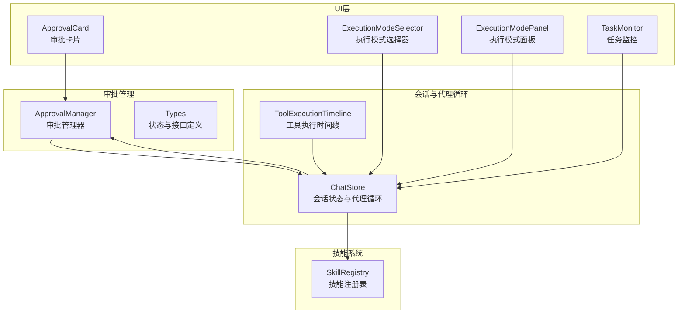
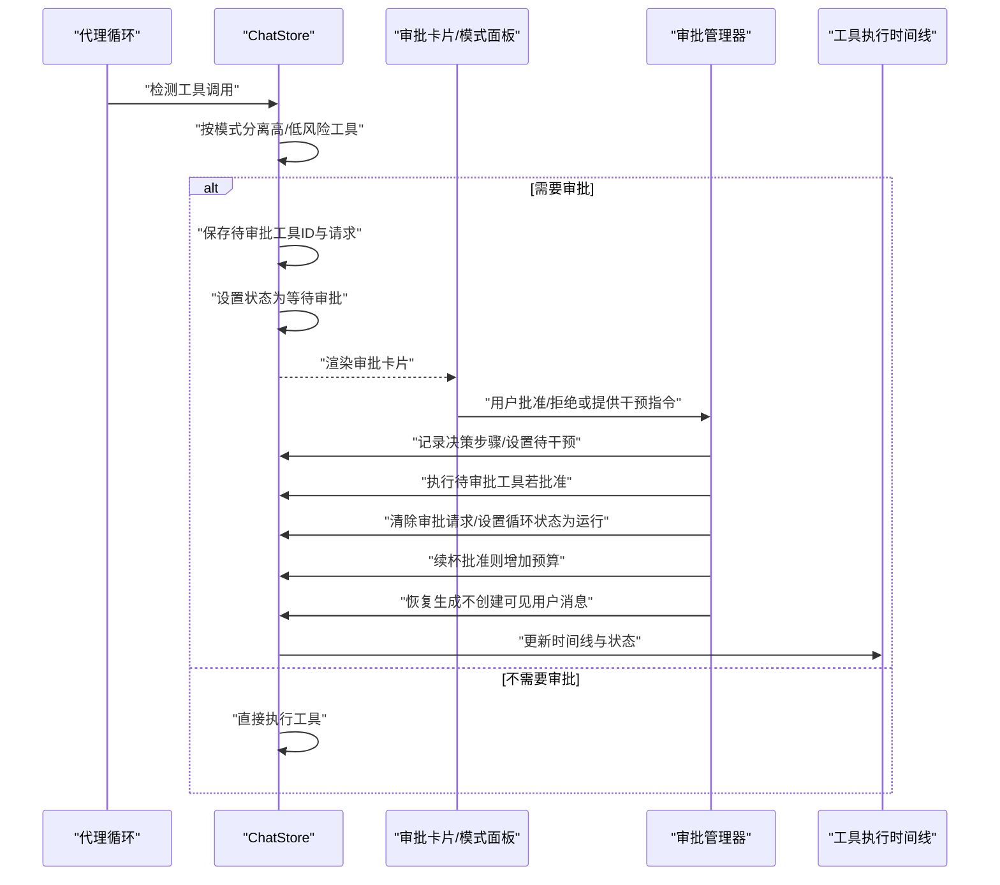
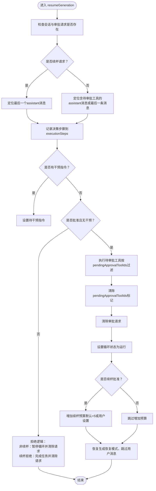
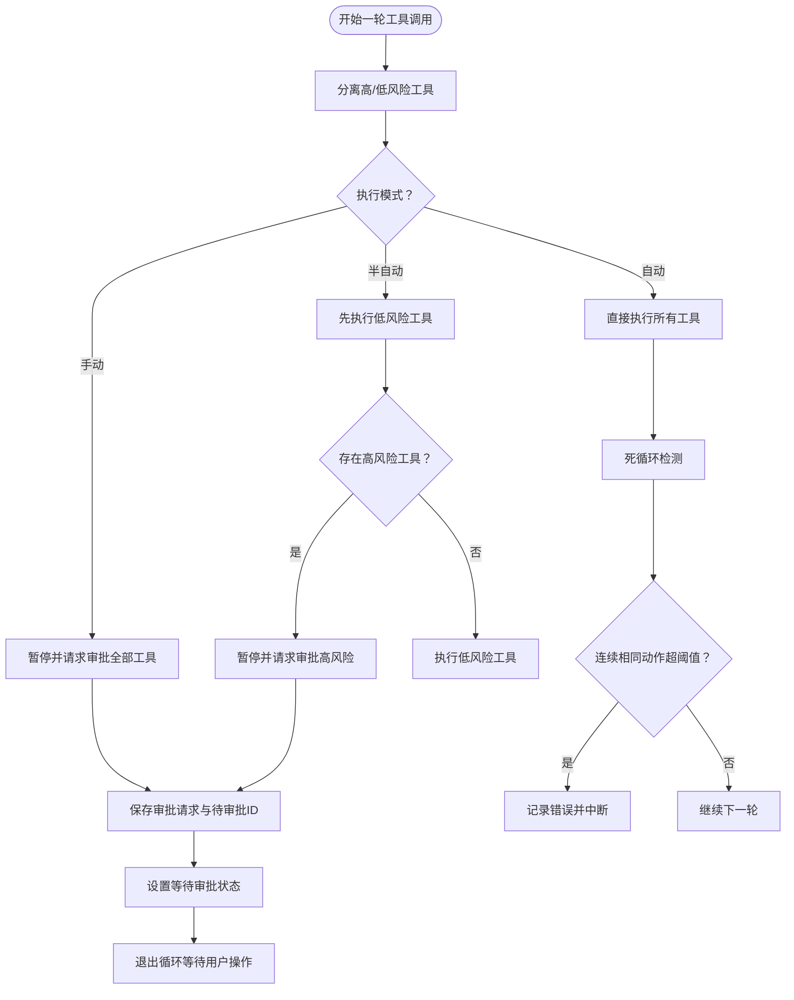
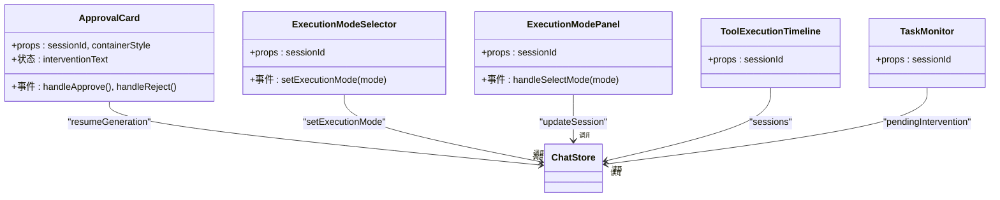
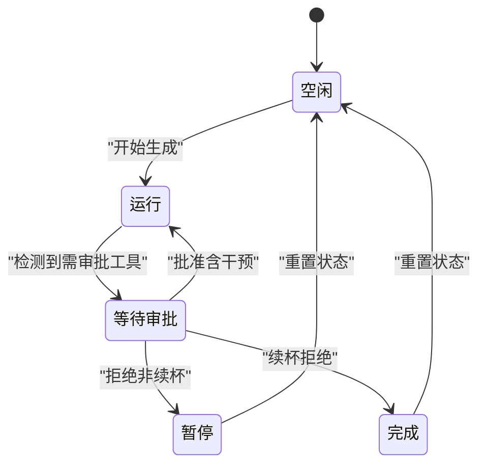
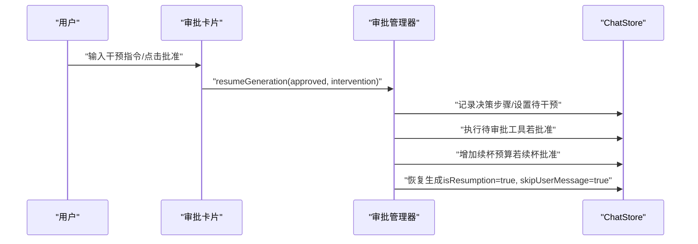
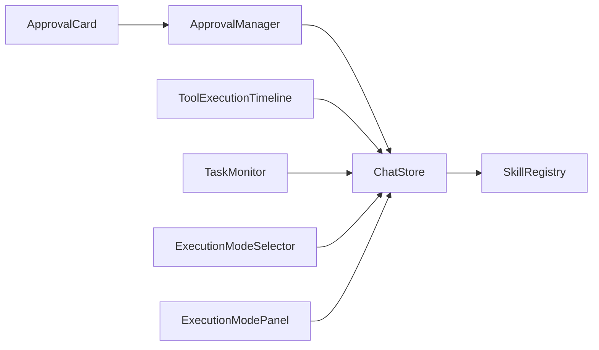

# 审批管理

<cite>
**本文引用的文件**
- [src/store/chat/approval-manager.ts](file://src/store/chat/approval-manager.ts)
- [src/store/chat-store.ts](file://src/store/chat-store.ts)
- [src/store/chat/types.ts](file://src/store/chat/types.ts)
- [src/features/chat/components/ApprovalCard.tsx](file://src/features/chat/components/ApprovalCard.tsx)
- [src/features/chat/components/ExecutionModeSelector.tsx](file://src/features/chat/components/ExecutionModeSelector.tsx)
- [src/features/chat/components/SessionSettingsSheet/ExecutionModePanel.tsx](file://src/features/chat/components/SessionSettingsSheet/ExecutionModePanel.tsx)
- [src/components/skills/ToolExecutionTimeline.tsx](file://src/components/skills/ToolExecutionTimeline.tsx)
- [src/features/chat/components/TaskMonitor.tsx](file://src/features/chat/components/TaskMonitor.tsx)
- [src/lib/skills/registry.ts](file://src/lib/skills/registry.ts)
</cite>

## 目录
1. [简介](#简介)
2. [项目结构](#项目结构)
3. [核心组件](#核心组件)
4. [架构总览](#架构总览)
5. [详细组件分析](#详细组件分析)
6. [依赖关系分析](#依赖关系分析)
7. [性能考量](#性能考量)
8. [故障排查指南](#故障排查指南)
9. [结论](#结论)
10. [附录](#附录)

## 简介
本文件面向Nexara审批管理系统，系统性阐述审批管理器的设计架构与实现细节，覆盖以下主题：
- 审批请求的创建、处理与状态跟踪
- 审批状态管理、干预请求处理与续杯批准流程
- 审批与智能代理循环的关系、手动执行模式与半自动执行模式
- 安全策略、权限控制与审批历史记录方法
- 实际代码示例路径与审批流程最佳实践

## 项目结构
审批管理相关代码主要分布在以下模块：
- 审批管理器：负责审批请求的接收、决策记录与后续流程推进
- 会话状态与代理循环：负责工具调用决策、暂停与恢复
- UI组件：审批卡片、执行模式选择面板、工具执行时间线与任务监控
- 技能注册表：提供工具高风险判定与会话感知的可用技能集合

**图表来源**
- [src/store/chat/approval-manager.ts:1-173](file://src/store/chat/approval-manager.ts#L1-L173)
- [src/store/chat-store.ts:108-2579](file://src/store/chat-store.ts#L108-L2579)
- [src/store/chat/types.ts:115-163](file://src/store/chat/types.ts#L115-L163)
- [src/features/chat/components/ApprovalCard.tsx:1-166](file://src/features/chat/components/ApprovalCard.tsx#L1-L166)
- [src/features/chat/components/ExecutionModeSelector.tsx:53-79](file://src/features/chat/components/ExecutionModeSelector.tsx#L53-L79)
- [src/features/chat/components/SessionSettingsSheet/ExecutionModePanel.tsx:1-32](file://src/features/chat/components/SessionSettingsSheet/ExecutionModePanel.tsx#L1-L32)
- [src/components/skills/ToolExecutionTimeline.tsx:109-175](file://src/components/skills/ToolExecutionTimeline.tsx#L109-L175)
- [src/features/chat/components/TaskMonitor.tsx:162-180](file://src/features/chat/components/TaskMonitor.tsx#L162-L180)
- [src/lib/skills/registry.ts:1-189](file://src/lib/skills/registry.ts#L1-L189)

**章节来源**
- [src/store/chat/approval-manager.ts:1-173](file://src/store/chat/approval-manager.ts#L1-L173)
- [src/store/chat-store.ts:108-2579](file://src/store/chat-store.ts#L108-L2579)
- [src/store/chat/types.ts:115-163](file://src/store/chat/types.ts#L115-L163)
- [src/features/chat/components/ApprovalCard.tsx:1-166](file://src/features/chat/components/ApprovalCard.tsx#L1-L166)
- [src/features/chat/components/ExecutionModeSelector.tsx:53-79](file://src/features/chat/components/ExecutionModeSelector.tsx#L53-L79)
- [src/features/chat/components/SessionSettingsSheet/ExecutionModePanel.tsx:1-32](file://src/features/chat/components/SessionSettingsSheet/ExecutionModePanel.tsx#L1-L32)
- [src/components/skills/ToolExecutionTimeline.tsx:109-175](file://src/components/skills/ToolExecutionTimeline.tsx#L109-L175)
- [src/features/chat/components/TaskMonitor.tsx:162-180](file://src/features/chat/components/TaskMonitor.tsx#L162-L180)
- [src/lib/skills/registry.ts:1-189](file://src/lib/skills/registry.ts#L1-L189)

## 核心组件
- 审批管理器（ApprovalManager）
  - 负责设置审批请求、记录干预决策、执行待审批工具、推进生成流程、维护执行模式与循环状态
  - 关键方法：设置审批请求、恢复生成、设置执行模式、设置循环状态、设置待干预指令
- 会话状态与代理循环（ChatStore）
  - 负责工具调用决策（自动/半自动/手动）、暂停与恢复、续杯阈值检查、死循环检测、后处理与状态清理
- UI组件
  - 审批卡片：展示审批请求、提供批准/拒绝与干预指令输入
  - 执行模式选择器/面板：切换自动/半自动/手动模式
  - 工具执行时间线：展示审批请求与干预记录
  - 任务监控：展示待决策状态
- 技能注册表（SkillRegistry）
  - 提供工具高风险判定与会话感知的可用技能集合，支撑代理循环的审批决策

**章节来源**
- [src/store/chat/types.ts:115-163](file://src/store/chat/types.ts#L115-L163)
- [src/store/chat-store.ts:2000-2300](file://src/store/chat-store.ts#L2000-L2300)
- [src/features/chat/components/ApprovalCard.tsx:1-166](file://src/features/chat/components/ApprovalCard.tsx#L1-L166)
- [src/components/skills/ToolExecutionTimeline.tsx:109-175](file://src/components/skills/ToolExecutionTimeline.tsx#L109-L175)
- [src/features/chat/components/TaskMonitor.tsx:162-180](file://src/features/chat/components/TaskMonitor.tsx#L162-L180)
- [src/lib/skills/registry.ts:1-189](file://src/lib/skills/registry.ts#L1-L189)

## 架构总览
审批管理贯穿“代理循环决策—UI审批—管理器恢复—生成继续”的闭环。

**图表来源**
- [src/store/chat-store.ts:2000-2300](file://src/store/chat-store.ts#L2000-L2300)
- [src/store/chat/approval-manager.ts:21-146](file://src/store/chat/approval-manager.ts#L21-L146)
- [src/features/chat/components/ApprovalCard.tsx:38-52](file://src/features/chat/components/ApprovalCard.tsx#L38-L52)
- [src/components/skills/ToolExecutionTimeline.tsx:109-175](file://src/components/skills/ToolExecutionTimeline.tsx#L109-L175)

## 详细组件分析

### 审批管理器（ApprovalManager）
职责与流程要点：
- 设置审批请求：将“工具名/参数/原因”写入会话状态
- 恢复生成：
  - 记录干预决策到执行时间线
  - 若批准且无干预：仅执行待审批工具（基于pendingApprovalToolIds）
  - 清理待审批标记、清除审批请求、设置循环状态为运行
  - 续杯批准：增加预算（优先使用用户设置的循环限制）
  - 恢复生成：以恢复模式继续，不创建可见用户消息
- 状态维护：设置执行模式、循环状态、待干预指令

**图表来源**
- [src/store/chat/approval-manager.ts:21-146](file://src/store/chat/approval-manager.ts#L21-L146)

**章节来源**
- [src/store/chat/approval-manager.ts:1-173](file://src/store/chat/approval-manager.ts#L1-L173)

### 代理循环与审批决策（ChatStore）
- 工具调用决策
  - 分离高风险/低风险工具，依据执行模式决定是否暂停
  - 半自动模式：先执行低风险工具，再对高风险工具请求审批
  - 手动模式：所有工具均需审批
- 审批请求保存
  - 保存待审批工具ID列表，以便恢复时精确执行
  - 设置等待审批状态，并在消息内容中追加时间线步骤
- 续杯与循环控制
  - 达到硬性阈值时暂停并请求续杯
  - 通过循环计数与预算控制避免无限循环
- 死循环检测
  - 基于工具调用签名检测连续相同动作，超过阈值自动中断
- 后处理与状态清理
  - 等待审批退出时不清理，避免状态丢失
  - 循环结束统一重置状态，确保UI一致性

**图表来源**
- [src/store/chat-store.ts:2000-2300](file://src/store/chat-store.ts#L2000-L2300)

**章节来源**
- [src/store/chat-store.ts:2000-2300](file://src/store/chat-store.ts#L2000-L2300)

### UI组件与交互
- 审批卡片（ApprovalCard）
  - 展示审批原因、工具名与参数摘要
  - 支持批准/拒绝与可选干预指令输入
  - 根据续杯/工具审批类型采用不同颜色与图标
- 执行模式选择器与面板
  - 支持在自动/半自动/手动之间切换
  - 切换后影响代理循环的审批决策
- 工具执行时间线（ToolExecutionTimeline）
  - 展示审批请求与干预记录，便于回溯
- 任务监控（TaskMonitor）
  - 展示待决策状态与干预指令

**图表来源**
- [src/features/chat/components/ApprovalCard.tsx:1-166](file://src/features/chat/components/ApprovalCard.tsx#L1-L166)
- [src/features/chat/components/ExecutionModeSelector.tsx:53-79](file://src/features/chat/components/ExecutionModeSelector.tsx#L53-L79)
- [src/features/chat/components/SessionSettingsSheet/ExecutionModePanel.tsx:1-32](file://src/features/chat/components/SessionSettingsSheet/ExecutionModePanel.tsx#L1-L32)
- [src/components/skills/ToolExecutionTimeline.tsx:109-175](file://src/components/skills/ToolExecutionTimeline.tsx#L109-L175)
- [src/features/chat/components/TaskMonitor.tsx:162-180](file://src/features/chat/components/TaskMonitor.tsx#L162-L180)

**章节来源**
- [src/features/chat/components/ApprovalCard.tsx:1-166](file://src/features/chat/components/ApprovalCard.tsx#L1-L166)
- [src/features/chat/components/ExecutionModeSelector.tsx:53-79](file://src/features/chat/components/ExecutionModeSelector.tsx#L53-L79)
- [src/features/chat/components/SessionSettingsSheet/ExecutionModePanel.tsx:1-32](file://src/features/chat/components/SessionSettingsSheet/ExecutionModePanel.tsx#L1-L32)
- [src/components/skills/ToolExecutionTimeline.tsx:109-175](file://src/components/skills/ToolExecutionTimeline.tsx#L109-L175)
- [src/features/chat/components/TaskMonitor.tsx:162-180](file://src/features/chat/components/TaskMonitor.tsx#L162-L180)

### 审批状态管理与历史记录
- 状态枚举与管理
  - 状态：空闲/运行/暂停/等待审批/完成
  - 管理器提供设置状态与执行模式的方法
- 历史记录
  - 干预请求与结果以执行步骤形式写入消息的executionSteps
  - 续杯批准/拒绝在时间线中体现为明确的决策节点
- 审批请求结构
  - 包含工具名、参数、原因与类型（工具审批/续杯）

**图表来源**
- [src/store/chat/types.ts:117-142](file://src/store/chat/types.ts#L117-L142)
- [src/store/chat/approval-manager.ts:21-146](file://src/store/chat/approval-manager.ts#L21-L146)

**章节来源**
- [src/store/chat/types.ts:117-142](file://src/store/chat/types.ts#L117-L142)
- [src/store/chat/approval-manager.ts:21-146](file://src/store/chat/approval-manager.ts#L21-L146)

### 干预请求处理与续杯批准流程
- 干预请求
  - 用户可在审批卡片中输入干预指令
  - 管理器将干预指令写入待干预状态，随后在恢复生成时传递给生成器
- 续杯批准
  - 达到循环上限时触发续杯请求
  - 批准后增加续杯预算（默认+5或用户设置），并以恢复模式继续生成
  - 拒绝则完成任务并清除请求

**图表来源**
- [src/features/chat/components/ApprovalCard.tsx:38-52](file://src/features/chat/components/ApprovalCard.tsx#L38-L52)
- [src/store/chat/approval-manager.ts:21-146](file://src/store/chat/approval-manager.ts#L21-L146)
- [src/store/chat-store.ts:2000-2300](file://src/store/chat-store.ts#L2000-L2300)

**章节来源**
- [src/features/chat/components/ApprovalCard.tsx:1-166](file://src/features/chat/components/ApprovalCard.tsx#L1-L166)
- [src/store/chat/approval-manager.ts:21-146](file://src/store/chat/approval-manager.ts#L21-L146)
- [src/store/chat-store.ts:2000-2300](file://src/store/chat-store.ts#L2000-L2300)

### 审批与智能代理循环的关系、手动与半自动模式
- 模式差异
  - 自动：直接执行所有工具，无审批
  - 半自动：先执行低风险工具，高风险工具需审批
  - 手动：所有工具均需审批
- 恢复逻辑
  - resumption模式下跳过审批检测，避免重复暂停
  - 仅在非resumption或手动拒绝时真正暂停

**章节来源**
- [src/store/chat-store.ts:2000-2300](file://src/store/chat-store.ts#L2000-L2300)
- [src/features/chat/components/ExecutionModeSelector.tsx:53-79](file://src/features/chat/components/ExecutionModeSelector.tsx#L53-L79)
- [src/features/chat/components/SessionSettingsSheet/ExecutionModePanel.tsx:1-32](file://src/features/chat/components/SessionSettingsSheet/ExecutionModePanel.tsx#L1-L32)

### 安全策略、权限控制与审批历史记录方法
- 安全策略
  - 基于技能注册表的高风险判定，半自动模式优先放行低风险工具
  - 死循环检测防止恶意/异常循环
- 权限控制
  - 会话级工具路由：结合MCP服务器与自定义技能的激活列表
  - 全局开关：工具总开关与会话级开关共同决定可用技能集
- 历史记录方法
  - 审批请求与干预记录以执行步骤形式写入消息内容
  - 时间线组件展示审批与干预详情，支持回溯

**章节来源**
- [src/lib/skills/registry.ts:126-189](file://src/lib/skills/registry.ts#L126-L189)
- [src/store/chat-store.ts:2000-2300](file://src/store/chat-store.ts#L2000-L2300)
- [src/components/skills/ToolExecutionTimeline.tsx:109-175](file://src/components/skills/ToolExecutionTimeline.tsx#L109-L175)

## 依赖关系分析
- 审批管理器依赖会话状态与工具执行接口
- 代理循环依赖技能注册表进行高风险判定
- UI组件依赖审批管理器与会话状态进行交互
- 工具执行时间线与任务监控依赖会话状态进行展示

**图表来源**
- [src/store/chat/approval-manager.ts:1-173](file://src/store/chat/approval-manager.ts#L1-L173)
- [src/store/chat-store.ts:108-2579](file://src/store/chat-store.ts#L108-L2579)
- [src/lib/skills/registry.ts:1-189](file://src/lib/skills/registry.ts#L1-L189)
- [src/features/chat/components/ApprovalCard.tsx:1-166](file://src/features/chat/components/ApprovalCard.tsx#L1-L166)
- [src/components/skills/ToolExecutionTimeline.tsx:109-175](file://src/components/skills/ToolExecutionTimeline.tsx#L109-L175)
- [src/features/chat/components/TaskMonitor.tsx:162-180](file://src/features/chat/components/TaskMonitor.tsx#L162-L180)
- [src/features/chat/components/ExecutionModeSelector.tsx:53-79](file://src/features/chat/components/ExecutionModeSelector.tsx#L53-L79)
- [src/features/chat/components/SessionSettingsSheet/ExecutionModePanel.tsx:1-32](file://src/features/chat/components/SessionSettingsSheet/ExecutionModePanel.tsx#L1-L32)

**章节来源**
- [src/store/chat/approval-manager.ts:1-173](file://src/store/chat/approval-manager.ts#L1-L173)
- [src/store/chat-store.ts:108-2579](file://src/store/chat-store.ts#L108-L2579)
- [src/lib/skills/registry.ts:1-189](file://src/lib/skills/registry.ts#L1-L189)

## 性能考量
- 工具调用过滤：仅执行待审批工具，避免重复执行低风险工具
- 死循环检测：降低无效计算开销
- 状态清理与幂等：异常与正常分支均重置状态，避免UI卡滞
- 恢复模式：不创建可见用户消息，减少UI更新成本

## 故障排查指南
- 等待审批状态未清除
  - 检查代理循环是否在等待审批时提前退出
  - 确认管理器是否正确清除审批请求与设置循环状态
- 干预指令未生效
  - 确认UI是否正确传递干预指令
  - 检查管理器是否设置待干预状态并在恢复生成时传入
- 续杯预算未增加
  - 确认审批类型为续杯且批准
  - 检查用户设置的循环限制是否覆盖默认值
- 死循环中断频繁
  - 检查工具调用签名生成逻辑与阈值配置
- UI显示异常
  - 确认异常分支是否重置循环状态与审批请求

**章节来源**
- [src/store/chat-store.ts:2000-2300](file://src/store/chat-store.ts#L2000-L2300)
- [src/store/chat/approval-manager.ts:21-146](file://src/store/chat/approval-manager.ts#L21-L146)
- [src/features/chat/components/TaskMonitor.tsx:162-180](file://src/features/chat/components/TaskMonitor.tsx#L162-L180)

## 结论
Nexara审批管理系统通过“代理循环决策—UI审批—管理器恢复—生成继续”的闭环，实现了对工具调用的精细化控制。系统在安全策略、权限控制与历史记录方面具备完善的机制，同时通过死循环检测与状态清理保障稳定性。建议在生产环境中持续关注审批请求的准确性与UI交互的反馈及时性，以提升用户体验与系统可靠性。

## 附录
- 实际代码示例路径（不含具体代码内容）
  - 审批管理器实现：[src/store/chat/approval-manager.ts:1-173](file://src/store/chat/approval-manager.ts#L1-L173)
  - 代理循环与审批决策：[src/store/chat-store.ts:2000-2300](file://src/store/chat-store.ts#L2000-L2300)
  - 类型与状态定义：[src/store/chat/types.ts:115-163](file://src/store/chat/types.ts#L115-L163)
  - 审批卡片组件：[src/features/chat/components/ApprovalCard.tsx:1-166](file://src/features/chat/components/ApprovalCard.tsx#L1-L166)
  - 执行模式选择器/面板：[src/features/chat/components/ExecutionModeSelector.tsx:53-79](file://src/features/chat/components/ExecutionModeSelector.tsx#L53-L79), [src/features/chat/components/SessionSettingsSheet/ExecutionModePanel.tsx:1-32](file://src/features/chat/components/SessionSettingsSheet/ExecutionModePanel.tsx#L1-L32)
  - 工具执行时间线：[src/components/skills/ToolExecutionTimeline.tsx:109-175](file://src/components/skills/ToolExecutionTimeline.tsx#L109-L175)
  - 任务监控：[src/features/chat/components/TaskMonitor.tsx:162-180](file://src/features/chat/components/TaskMonitor.tsx#L162-L180)
  - 技能注册表：[src/lib/skills/registry.ts:1-189](file://src/lib/skills/registry.ts#L1-L189)