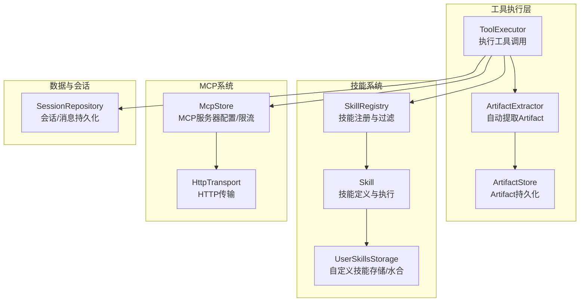
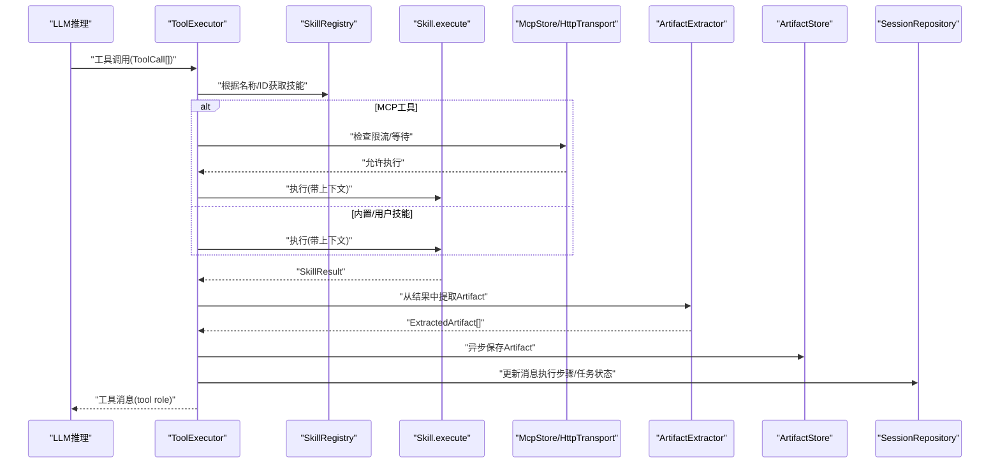
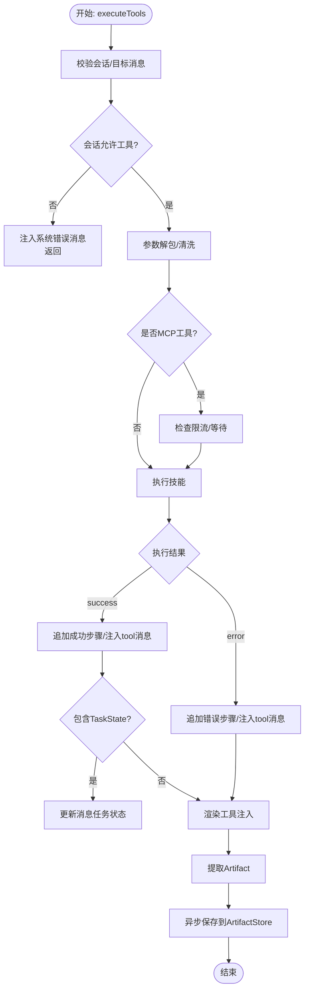
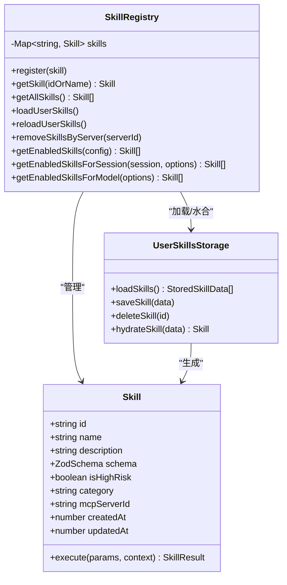
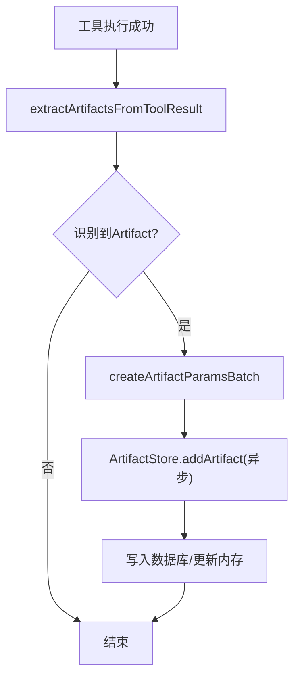
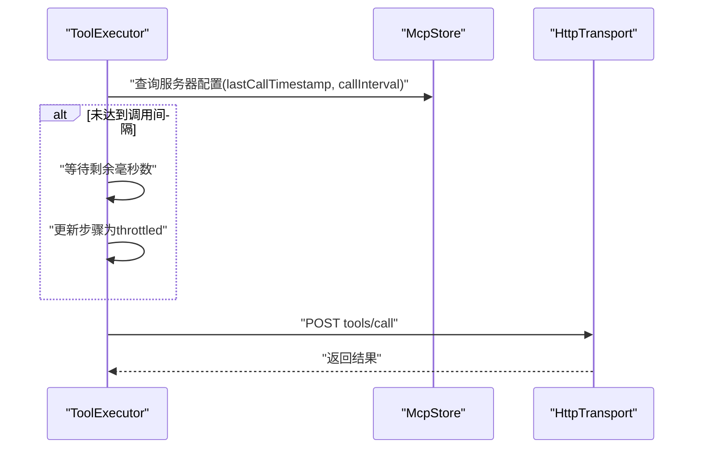
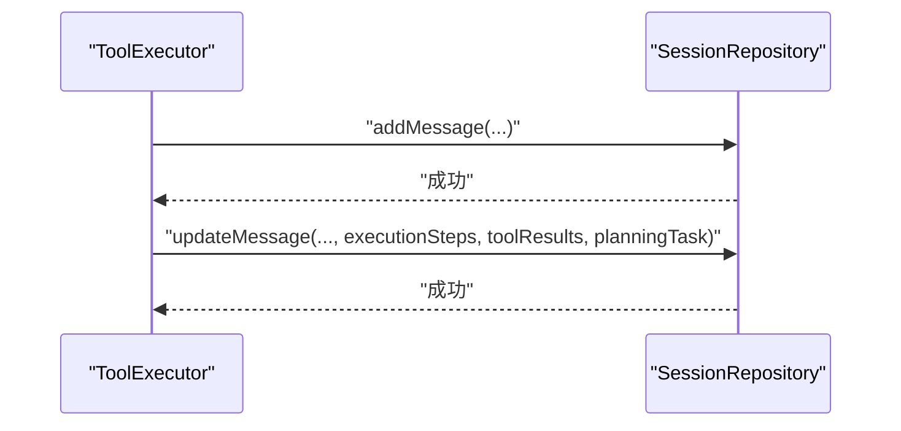
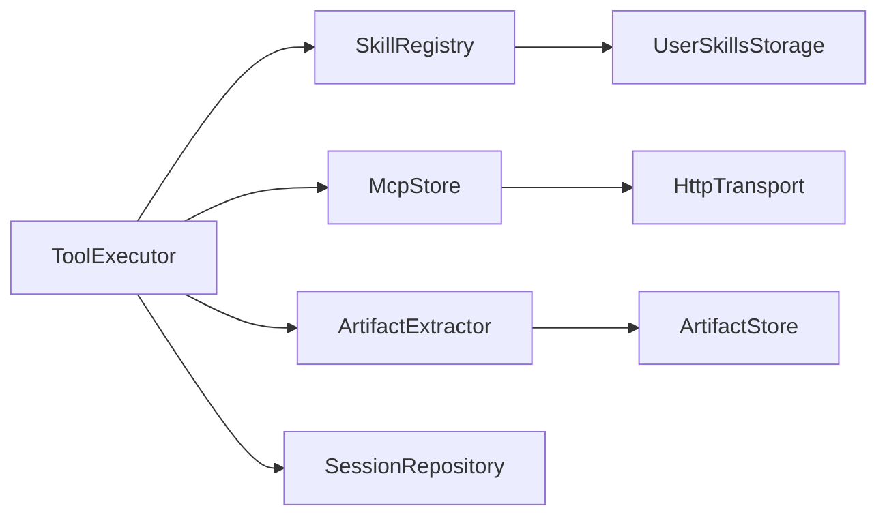

# 工具执行

<cite>
**本文引用的文件**
- [src/store/chat/tool-execution.ts](file://src/store/chat/tool-execution.ts)
- [src/types/skills.ts](file://src/types/skills.ts)
- [src/lib/skills/registry.ts](file://src/lib/skills/registry.ts)
- [src/lib/skills/storage.ts](file://src/lib/skills/storage.ts)
- [src/features/chat/utils/artifact-extractor.ts](file://src/features/chat/utils/artifact-extractor.ts)
- [src/store/artifact-store.ts](file://src/store/artifact-store.ts)
- [src/store/mcp-store.ts](file://src/store/mcp-store.ts)
- [src/lib/mcp/transports/http-transport.ts](file://src/lib/mcp/transports/http-transport.ts)
- [src/lib/db/session-repository.ts](file://src/lib/db/session-repository.ts)
- [src/store/chat-store.ts](file://src/store/chat-store.ts)
</cite>

## 目录
1. [简介](#简介)
2. [项目结构](#项目结构)
3. [核心组件](#核心组件)
4. [架构总览](#架构总览)
5. [详细组件分析](#详细组件分析)
6. [依赖关系分析](#依赖关系分析)
7. [性能考量](#性能考量)
8. [故障排查指南](#故障排查指南)
9. [结论](#结论)
10. [附录](#附录)

## 简介
本文件面向Nexara工具执行系统，围绕“工具执行器”的设计与实现进行深入技术说明。内容涵盖工具调用解析、执行与结果处理机制；工具执行状态管理、工具结果缓存与工具执行历史记录；工具与技能系统的集成、工具参数验证与工具执行错误处理；并发控制与限流、工具执行监控方法；以及性能优化策略与工具集成最佳实践。

## 项目结构
与工具执行直接相关的关键模块分布如下：
- 工具执行器：负责解析LLM输出的工具调用、执行技能、更新执行步骤与消息历史，并进行结果注入与Artifact提取。
- 技能系统：注册中心、技能定义、自定义技能存储与水合执行。
- Artifact系统：自动提取工具结果中的图表/公式等结构化内容，并持久化到本地数据库。
- MCP系统：MCP服务器配置与限流控制，HTTP传输层。
- 会话与消息持久化：SQLite数据访问层，支撑工具执行历史与状态持久化。

**图示来源**
- [src/store/chat/tool-execution.ts:20-378](file://src/store/chat/tool-execution.ts#L20-L378)
- [src/lib/skills/registry.ts:1-189](file://src/lib/skills/registry.ts#L1-L189)
- [src/lib/skills/storage.ts:1-152](file://src/lib/skills/storage.ts#L1-L152)
- [src/features/chat/utils/artifact-extractor.ts:1-229](file://src/features/chat/utils/artifact-extractor.ts#L1-L229)
- [src/store/artifact-store.ts:1-255](file://src/store/artifact-store.ts#L1-L255)
- [src/store/mcp-store.ts:1-72](file://src/store/mcp-store.ts#L1-L72)
- [src/lib/mcp/transports/http-transport.ts:66-157](file://src/lib/mcp/transports/http-transport.ts#L66-L157)
- [src/lib/db/session-repository.ts:1-425](file://src/lib/db/session-repository.ts#L1-L425)

**章节来源**
- [src/store/chat/tool-execution.ts:1-379](file://src/store/chat/tool-execution.ts#L1-L379)
- [src/lib/skills/registry.ts:1-189](file://src/lib/skills/registry.ts#L1-L189)
- [src/features/chat/utils/artifact-extractor.ts:1-229](file://src/features/chat/utils/artifact-extractor.ts#L1-L229)
- [src/store/artifact-store.ts:1-255](file://src/store/artifact-store.ts#L1-L255)
- [src/store/mcp-store.ts:1-72](file://src/store/mcp-store.ts#L1-L72)
- [src/lib/mcp/transports/http-transport.ts:66-157](file://src/lib/mcp/transports/http-transport.ts#L66-L157)
- [src/lib/db/session-repository.ts:1-425](file://src/lib/db/session-repository.ts#L1-L425)

## 核心组件
- 工具执行器（ToolExecutor）：统一入口，负责解析工具调用、参数解包、MCP限流、执行技能、更新执行步骤、注入UI渲染结果、持久化任务状态、触发Artifact自动提取与异步保存。
- 技能系统（SkillRegistry/Skill/UserSkillsStorage）：注册内置/用户自定义技能，提供按会话过滤、动态重载、安全水合执行。
- Artifact系统（ArtifactExtractor/ArtifactStore）：从工具结果中抽取结构化内容（图表/公式/HTML/SVG），并持久化到本地数据库。
- MCP系统（McpStore/HttpTransport）：维护MCP服务器配置与限流，封装HTTP调用。
- 会话与消息持久化（SessionRepository）：支撑工具执行历史、执行步骤、任务状态等的持久化。

**章节来源**
- [src/store/chat/tool-execution.ts:20-378](file://src/store/chat/tool-execution.ts#L20-L378)
- [src/types/skills.ts:1-74](file://src/types/skills.ts#L1-L74)
- [src/lib/skills/registry.ts:1-189](file://src/lib/skills/registry.ts#L1-L189)
- [src/lib/skills/storage.ts:1-152](file://src/lib/skills/storage.ts#L1-L152)
- [src/features/chat/utils/artifact-extractor.ts:1-229](file://src/features/chat/utils/artifact-extractor.ts#L1-L229)
- [src/store/artifact-store.ts:1-255](file://src/store/artifact-store.ts#L1-L255)
- [src/store/mcp-store.ts:1-72](file://src/store/mcp-store.ts#L1-L72)
- [src/lib/mcp/transports/http-transport.ts:66-157](file://src/lib/mcp/transports/http-transport.ts#L66-L157)
- [src/lib/db/session-repository.ts:1-425](file://src/lib/db/session-repository.ts#L1-L425)

## 架构总览
工具执行从LLM推理阶段产生的工具调用开始，经过参数解析与验证、技能选择与执行、结果注入与历史记录、Artifact提取与持久化，最终回到会话状态更新与UI反馈。

**图示来源**
- [src/store/chat/tool-execution.ts:24-378](file://src/store/chat/tool-execution.ts#L24-L378)
- [src/lib/skills/registry.ts:48-189](file://src/lib/skills/registry.ts#L48-L189)
- [src/lib/skills/storage.ts:88-152](file://src/lib/skills/storage.ts#L88-L152)
- [src/features/chat/utils/artifact-extractor.ts:157-229](file://src/features/chat/utils/artifact-extractor.ts#L157-L229)
- [src/store/artifact-store.ts:124-170](file://src/store/artifact-store.ts#L124-L170)
- [src/lib/db/session-repository.ts:162-241](file://src/lib/db/session-repository.ts#L162-L241)

## 详细组件分析

### 工具执行器（ToolExecutor）
- 输入：会话ID、工具调用数组、目标消息ID（可选）。
- 关键流程：
  - 会话与目标消息校验，必要时回退到最后一条assistant消息。
  - 全局工具开关拦截：若会话禁用工具，则构造“系统提示”式错误结果并注入消息历史。
  - 参数解包：兼容字符串/对象两种参数形式，智能解包parameters/arguments嵌套。
  - MCP限流：基于MCP服务器配置的调用间隔，执行等待并在步骤中标注throttled。
  - 执行技能：优先走SkillRegistry，找不到则返回错误；捕获异常并包装为错误结果。
  - 结果注入：统一追加执行步骤（tool_call/tool_result/error/throttled），注入tool角色消息到历史。
  - 任务状态持久化：若结果包含TaskState，更新消息的计划任务字段；特殊动作触发立即刷新。
  - 渲染注入：对渲染工具（如echarts/mermaid）成功时，直接将Markdown代码块注入父assistant消息的toolResults。
  - Artifact自动提取：从成功结果中抽取图表/公式/HTML/SVG等，批量异步写入ArtifactStore。

**图示来源**
- [src/store/chat/tool-execution.ts:24-378](file://src/store/chat/tool-execution.ts#L24-L378)

**章节来源**
- [src/store/chat/tool-execution.ts:24-378](file://src/store/chat/tool-execution.ts#L24-L378)

### 技能系统（SkillRegistry/Skill/UserSkillsStorage）
- Skill接口：统一的execute(params, context)返回格式，支持schema参数校验、高危标记、类别与来源MCP服务器ID。
- SkillRegistry：注册内置/调试/任务/渲染等核心技能；加载用户自定义技能并水合为可执行对象；提供按会话过滤的可用技能列表（融合全局开关、MCP服务器白名单、会话技能白名单、原生网络搜索路由）。
- UserSkillsStorage：用户技能的文件系统持久化（JSON），提供加载/保存/删除；hydrateSkill将存储数据“水合”为可执行技能，包含安全沙箱与默认参数合并。

**图示来源**
- [src/types/skills.ts:8-47](file://src/types/skills.ts#L8-L47)
- [src/lib/skills/registry.ts:1-189](file://src/lib/skills/registry.ts#L1-L189)
- [src/lib/skills/storage.ts:1-152](file://src/lib/skills/storage.ts#L1-L152)

**章节来源**
- [src/types/skills.ts:1-74](file://src/types/skills.ts#L1-L74)
- [src/lib/skills/registry.ts:1-189](file://src/lib/skills/registry.ts#L1-L189)
- [src/lib/skills/storage.ts:1-152](file://src/lib/skills/storage.ts#L1-L152)

### Artifact自动提取与持久化
- 自动提取：从工具结果中识别代码块语言（echarts/mermaid/math/html/svg），生成标题并抽取内容；对渲染工具做专门匹配。
- 批量参数：将提取结果转换为创建参数（含sessionId/messageId），批量提交给ArtifactStore。
- 持久化：ArtifactStore通过SQLite插入，异步写入不阻塞工具执行；支持查询、筛选、更新、删除。

**图示来源**
- [src/features/chat/utils/artifact-extractor.ts:157-229](file://src/features/chat/utils/artifact-extractor.ts#L157-L229)
- [src/store/artifact-store.ts:124-170](file://src/store/artifact-store.ts#L124-L170)

**章节来源**
- [src/features/chat/utils/artifact-extractor.ts:1-229](file://src/features/chat/utils/artifact-extractor.ts#L1-L229)
- [src/store/artifact-store.ts:1-255](file://src/store/artifact-store.ts#L1-L255)

### MCP系统与限流控制
- McpStore：维护服务器列表、状态、上次调用时间戳、调用间隔（秒）。
- HttpTransport：封装HTTP调用，支持tools/list与tools/call；具备回退URL与错误处理。
- ToolExecutor：在执行MCP工具前检查activeMcpServerIds，若未启用则直接返回错误；否则根据lastCallTimestamp与callInterval计算等待时长并更新步骤为throttled。

**图示来源**
- [src/store/mcp-store.ts:6-18](file://src/store/mcp-store.ts#L6-L18)
- [src/lib/mcp/transports/http-transport.ts:90-157](file://src/lib/mcp/transports/http-transport.ts#L90-L157)
- [src/store/chat/tool-execution.ts:202-234](file://src/store/chat/tool-execution.ts#L202-L234)

**章节来源**
- [src/store/mcp-store.ts:1-72](file://src/store/mcp-store.ts#L1-L72)
- [src/lib/mcp/transports/http-transport.ts:66-157](file://src/lib/mcp/transports/http-transport.ts#L66-L157)
- [src/store/chat/tool-execution.ts:163-234](file://src/store/chat/tool-execution.ts#L163-L234)

### 会话与消息持久化
- SessionRepository：提供会话与消息的CRUD，支持批量更新字段、自修复缺失列（Schema Drift），并同步更新会话updated_at。
- ToolExecutor：通过消息更新接口追加executionSteps、toolResults、planningTask等字段；在特定动作（如任务完成）时触发flushMessageUpdates以保证持久化及时性。

**图示来源**
- [src/lib/db/session-repository.ts:162-241](file://src/lib/db/session-repository.ts#L162-L241)
- [src/store/chat/tool-execution.ts:285-314](file://src/store/chat/tool-execution.ts#L285-L314)

**章节来源**
- [src/lib/db/session-repository.ts:1-425](file://src/lib/db/session-repository.ts#L1-L425)
- [src/store/chat/tool-execution.ts:285-314](file://src/store/chat/tool-execution.ts#L285-L314)

## 依赖关系分析
- ToolExecutor依赖SkillRegistry进行技能解析与执行；依赖McpStore/McpTransport进行MCP工具限流与调用；依赖ArtifactExtractor与ArtifactStore进行结果结构化与持久化；依赖SessionRepository进行消息与会话状态持久化。
- SkillRegistry依赖UserSkillsStorage进行用户技能的加载与水合；提供按会话过滤的可用技能集合。
- ArtifactExtractor依赖工具结果内容与语言映射规则，生成标准化的ExtractedArtifact。
- McpStore与HttpTransport共同保障MCP工具的稳定调用与限流。

**图示来源**
- [src/store/chat/tool-execution.ts:1-379](file://src/store/chat/tool-execution.ts#L1-L379)
- [src/lib/skills/registry.ts:1-189](file://src/lib/skills/registry.ts#L1-L189)
- [src/lib/skills/storage.ts:1-152](file://src/lib/skills/storage.ts#L1-L152)
- [src/features/chat/utils/artifact-extractor.ts:1-229](file://src/features/chat/utils/artifact-extractor.ts#L1-L229)
- [src/store/artifact-store.ts:1-255](file://src/store/artifact-store.ts#L1-L255)
- [src/store/mcp-store.ts:1-72](file://src/store/mcp-store.ts#L1-L72)
- [src/lib/mcp/transports/http-transport.ts:66-157](file://src/lib/mcp/transports/http-transport.ts#L66-L157)
- [src/lib/db/session-repository.ts:1-425](file://src/lib/db/session-repository.ts#L1-L425)

**章节来源**
- [src/store/chat/tool-execution.ts:1-379](file://src/store/chat/tool-execution.ts#L1-L379)
- [src/lib/skills/registry.ts:1-189](file://src/lib/skills/registry.ts#L1-L189)
- [src/lib/skills/storage.ts:1-152](file://src/lib/skills/storage.ts#L1-L152)
- [src/features/chat/utils/artifact-extractor.ts:1-229](file://src/features/chat/utils/artifact-extractor.ts#L1-L229)
- [src/store/artifact-store.ts:1-255](file://src/store/artifact-store.ts#L1-L255)
- [src/store/mcp-store.ts:1-72](file://src/store/mcp-store.ts#L1-L72)
- [src/lib/mcp/transports/http-transport.ts:66-157](file://src/lib/mcp/transports/http-transport.ts#L66-L157)
- [src/lib/db/session-repository.ts:1-425](file://src/lib/db/session-repository.ts#L1-L425)

## 性能考量
- 并发与限流
  - MCP工具调用采用callInterval限流，避免服务端过载；等待期间更新执行步骤为throttled，提升可观测性。
  - ToolExecutor内部串行遍历工具调用，避免竞态；通过flushMessageUpdates确保关键节点（如任务完成）及时落盘。
- 结果处理与持久化
  - Artifact保存采用异步写入，不阻塞主执行流程；批量参数创建减少多次调用开销。
  - 会话与消息更新采用原子化字段更新，避免不必要的全量写入。
- 参数解析与校验
  - 智能参数解包减少无效调用；Zod schema用于用户自定义技能参数校验，降低运行期错误概率。
- UI与渲染
  - 渲染工具成功时直接注入Markdown代码块到父消息的toolResults，避免额外渲染步骤。

**章节来源**
- [src/store/chat/tool-execution.ts:202-234](file://src/store/chat/tool-execution.ts#L202-L234)
- [src/features/chat/utils/artifact-extractor.ts:222-229](file://src/features/chat/utils/artifact-extractor.ts#L222-L229)
- [src/lib/db/session-repository.ts:209-241](file://src/lib/db/session-repository.ts#L209-L241)
- [src/lib/skills/storage.ts:107-117](file://src/lib/skills/storage.ts#L107-L117)

## 故障排查指南
- 工具被禁用
  - 现象：工具调用被拦截并注入系统错误消息。
  - 处理：检查会话选项toolsEnabled；确认工具是否在会话技能白名单中。
  - 参考：[src/store/chat/tool-execution.ts:47-90](file://src/store/chat/tool-execution.ts#L47-L90)
- 参数为空或不完整
  - 现象：对特定工具（如任务管理）在流式初期缺少action时，执行器直接返回，避免崩溃循环。
  - 处理：确保LLM输出包含完整参数；必要时在前端补充参数。
  - 参考：[src/store/chat/tool-execution.ts:92-103](file://src/store/chat/tool-execution.ts#L92-L103)
- MCP工具限流
  - 现象：执行步骤显示throttled并等待剩余时间。
  - 处理：调整MCP服务器callInterval；或在UI中展示等待状态。
  - 参考：[src/store/chat/tool-execution.ts:202-234](file://src/store/chat/tool-execution.ts#L202-L234)
- 技能执行异常
  - 现象：技能执行抛错，结果status为error并附加系统提示。
  - 处理：查看错误消息与反射建议；检查参数合法性与工具可用性。
  - 参考：[src/store/chat/tool-execution.ts:259-271](file://src/store/chat/tool-execution.ts#L259-L271)
- Artifact提取失败
  - 现象：提取过程异常但不影响工具执行结果。
  - 处理：检查工具结果内容格式；确认代码块语言映射。
  - 参考：[src/features/chat/utils/artifact-extractor.ts:370-373](file://src/features/chat/utils/artifact-extractor.ts#L370-L373)
- 会话/消息持久化异常
  - 现象：Schema列缺失导致更新失败。
  - 处理：依赖自修复逻辑自动添加缺失列；如仍失败，检查数据库权限与表结构。
  - 参考：[src/lib/db/session-repository.ts:110-147](file://src/lib/db/session-repository.ts#L110-L147)

**章节来源**
- [src/store/chat/tool-execution.ts:47-90](file://src/store/chat/tool-execution.ts#L47-L90)
- [src/store/chat/tool-execution.ts:92-103](file://src/store/chat/tool-execution.ts#L92-L103)
- [src/store/chat/tool-execution.ts:202-234](file://src/store/chat/tool-execution.ts#L202-L234)
- [src/store/chat/tool-execution.ts:259-271](file://src/store/chat/tool-execution.ts#L259-L271)
- [src/features/chat/utils/artifact-extractor.ts:370-373](file://src/features/chat/utils/artifact-extractor.ts#L370-L373)
- [src/lib/db/session-repository.ts:110-147](file://src/lib/db/session-repository.ts#L110-L147)

## 结论
Nexara工具执行系统通过ToolExecutor将LLM推理、技能系统、MCP限流、Artifact提取与会话持久化有机整合，形成闭环的工具执行流水线。系统在安全性（参数校验、高危标记、拦截与反射）、可观测性（执行步骤、限流状态、错误注入）与性能（异步持久化、限流等待、原子更新）方面均有明确设计与实现。结合本文提供的最佳实践与排障指南，可在复杂场景中稳定地扩展与演进工具链。

## 附录
- 工具与技能集成最佳实践
  - 使用Zod schema为自定义技能提供参数校验，确保输入安全与可预测。
  - 对高风险工具设置isHighRisk标记，并在半自动/手动模式下纳入审批流程。
  - 利用会话级过滤（activeMcpServerIds/activeSkillIds）精细化控制工具可用范围。
  - 对渲染类工具（echarts/mermaid）直接注入Markdown代码块，提升UI渲染效率。
  - 将工具执行结果中的结构化内容（图表/公式/HTML/SVG）自动提取并持久化，便于后续检索与复用。
  - 在MCP工具调用中合理设置callInterval，避免服务端压力过大；在UI中展示throttled状态提升用户体验。
  - 对关键动作（如任务完成）触发flushMessageUpdates，确保状态及时落盘。

**章节来源**
- [src/lib/skills/storage.ts:107-117](file://src/lib/skills/storage.ts#L107-L117)
- [src/lib/skills/registry.ts:127-172](file://src/lib/skills/registry.ts#L127-L172)
- [src/store/chat/tool-execution.ts:319-340](file://src/store/chat/tool-execution.ts#L319-L340)
- [src/features/chat/utils/artifact-extractor.ts:157-229](file://src/features/chat/utils/artifact-extractor.ts#L157-L229)
- [src/store/chat/tool-execution.ts:202-234](file://src/store/chat/tool-execution.ts#L202-L234)
- [src/lib/db/session-repository.ts:309-315](file://src/lib/db/session-repository.ts#L309-L315)