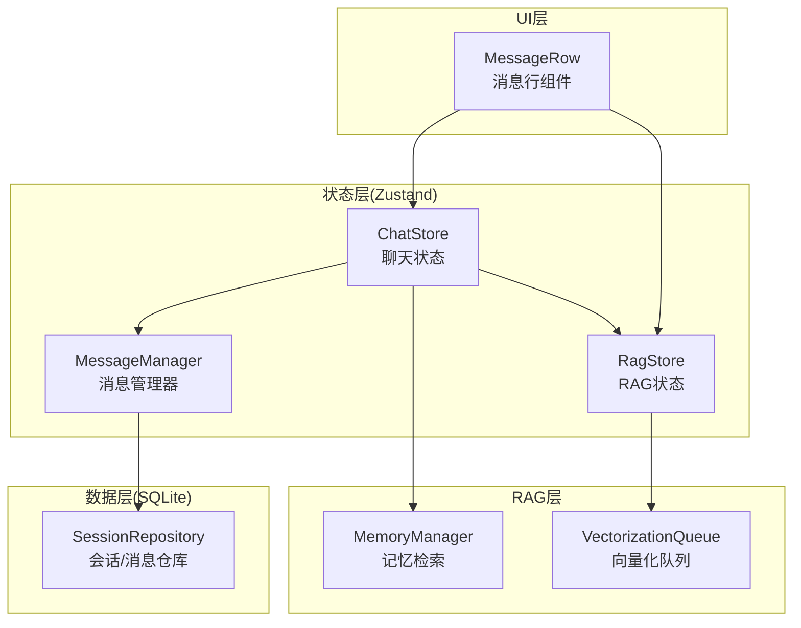
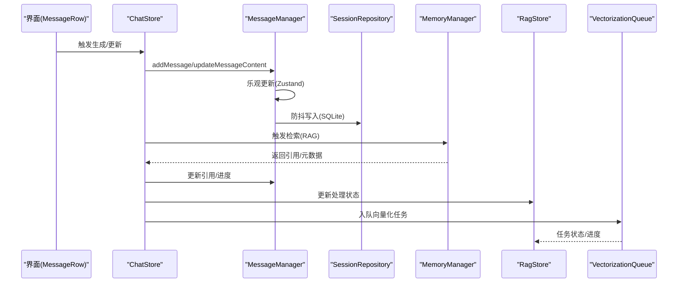
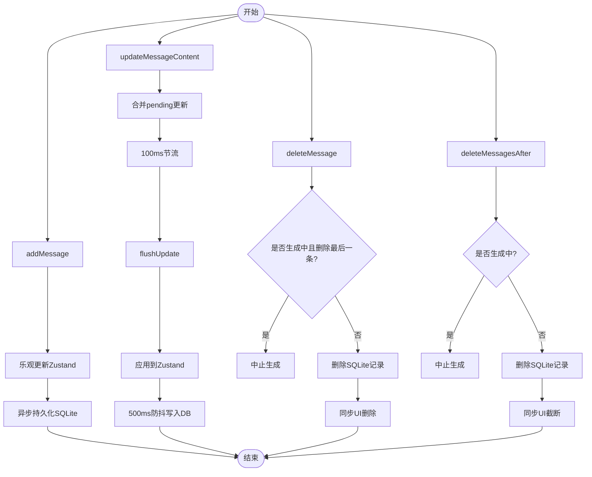
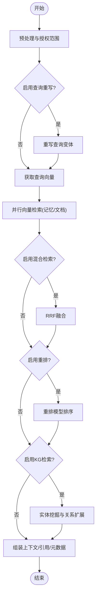
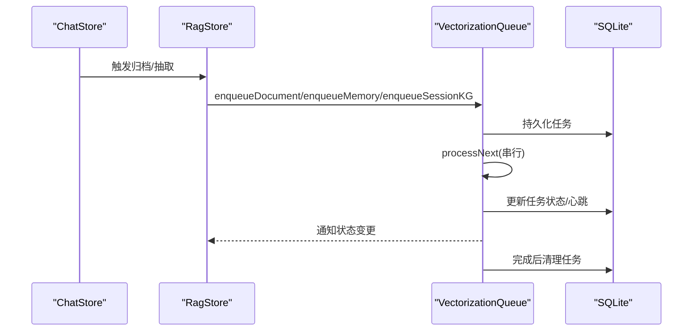
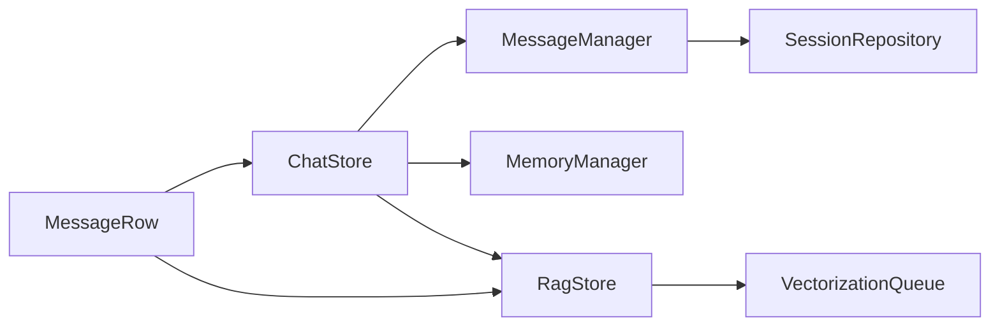

# 消息管理

<cite>
**本文引用的文件**
- [message-manager.ts](file://src/store/chat/message-manager.ts)
- [chat-store.ts](file://src/store/chat-store.ts)
- [chat.ts](file://src/store/chat/index.ts)
- [types.ts](file://src/store/chat/types.ts)
- [chat.ts](file://src/types/chat.ts)
- [session-repository.ts](file://src/lib/db/session-repository.ts)
- [memory-manager.ts](file://src/lib/rag/memory-manager.ts)
- [vectorization-queue.ts](file://src/lib/rag/vectorization-queue.ts)
- [rag-store.ts](file://src/store/rag-store.ts)
- [MessageRow.tsx](file://src/features/chat/components/message/MessageRow.tsx)
- [message-utils.ts](file://src/features/chat/utils/message-utils.ts)
- [error-normalizer.ts](file://src/lib/llm/error-normalizer.ts)
</cite>

## 目录
1. [简介](#简介)
2. [项目结构](#项目结构)
3. [核心组件](#核心组件)
4. [架构总览](#架构总览)
5. [详细组件分析](#详细组件分析)
6. [依赖关系分析](#依赖关系分析)
7. [性能考量](#性能考量)
8. [故障排查指南](#故障排查指南)
9. [结论](#结论)
10. [附录](#附录)

## 简介
本文件面向Nexara消息管理系统，系统性阐述消息管理器的设计架构与实现细节，覆盖消息的创建、更新、删除与批量操作；消息状态结构、内容处理与进度跟踪；消息与RAG引用的关系、消息布局管理与向量化状态；以及性能优化策略、内存管理与错误处理方法。文档同时提供流程图与时序图帮助理解关键路径，并给出最佳实践与常见问题排查建议。

## 项目结构
消息管理相关代码主要分布在以下层次：
- 状态层（Zustand）：消息管理器负责UI状态与持久化同步
- 数据层（SQLite）：通过仓库层进行持久化
- RAG层：消息与检索引用、向量化队列与状态管理
- UI层：消息行组件负责布局与渲染

图表来源
- [message-manager.ts:18-442](file://src/store/chat/message-manager.ts#L18-L442)
- [chat-store.ts:1-200](file://src/store/chat-store.ts#L1-L200)
- [session-repository.ts:1-200](file://src/lib/db/session-repository.ts#L1-L200)
- [memory-manager.ts:1-200](file://src/lib/rag/memory-manager.ts#L1-L200)
- [vectorization-queue.ts:1-120](file://src/lib/rag/vectorization-queue.ts#L1-L120)
- [MessageRow.tsx:1-130](file://src/features/chat/components/message/MessageRow.tsx#L1-L130)

章节来源
- [message-manager.ts:1-442](file://src/store/chat/message-manager.ts#L1-L442)
- [chat-store.ts:1-200](file://src/store/chat-store.ts#L1-L200)
- [session-repository.ts:1-200](file://src/lib/db/session-repository.ts#L1-L200)

## 核心组件
- 消息管理器（MessageManager）：负责消息的创建、更新、删除、批量归档、布局与向量化状态管理；采用乐观更新与防抖写入策略，平衡流畅性与一致性。
- 会话仓库（SessionRepository）：提供消息的增删改查与自修复能力，确保Schema演进下的兼容性。
- 记忆检索（MemoryManager）：实现查询重写、向量检索、混合检索、重排与知识图谱关联检索。
- 向量化队列（VectorizationQueue）：统一管理文档与记忆向量化任务，支持重试、断点恢复与进度上报。
- 聊天状态（ChatStore）：协调消息生成、RAG归档与后处理流程。
- 消息行组件（MessageRow）：负责消息渲染、布局高度缓存与交互。

章节来源
- [message-manager.ts:18-442](file://src/store/chat/message-manager.ts#L18-L442)
- [session-repository.ts:159-268](file://src/lib/db/session-repository.ts#L159-L268)
- [memory-manager.ts:1-200](file://src/lib/rag/memory-manager.ts#L1-L200)
- [vectorization-queue.ts:1-120](file://src/lib/rag/vectorization-queue.ts#L1-L120)
- [chat-store.ts:1-200](file://src/store/chat-store.ts#L1-L200)
- [MessageRow.tsx:1-130](file://src/features/chat/components/message/MessageRow.tsx#L1-L130)

## 架构总览
消息管理采用“乐观更新 + 防抖持久化”的双写模式，确保UI即时反馈与数据最终一致。RAG检索完成后，消息状态与引用信息通过管理器更新，同时触发向量化归档流程。

图表来源
- [chat-store.ts:688-711](file://src/store/chat-store.ts#L688-L711)
- [message-manager.ts:205-231](file://src/store/chat/message-manager.ts#L205-L231)
- [session-repository.ts:162-200](file://src/lib/db/session-repository.ts#L162-L200)
- [memory-manager.ts:1-120](file://src/lib/rag/memory-manager.ts#L1-L120)
- [rag-store.ts:993-1013](file://src/store/rag-store.ts#L993-L1013)
- [vectorization-queue.ts:1-120](file://src/lib/rag/vectorization-queue.ts#L1-L120)

## 详细组件分析

### 消息管理器（MessageManager）
- 设计要点
  - 乐观更新：先更新Zustand状态，再异步持久化，保证流畅体验。
  - 防抖写入：对高频更新（如流式输出）进行500ms防抖，减少SQLite写入压力。
  - 分批持久化：对令牌用量、RAG引用、进度等进行聚合写入，避免重复IO。
  - 竞态修复：通过缓冲区与定时器确保最终一致性，避免UI与DB状态不一致。
  - 批量操作：支持按时间戳截断消息、批量归档与状态更新。
  - 布局优化：仅在高度变化超过阈值时更新，避免频繁写入与重排。
  - 向量化状态：支持批量设置向量化状态，并联动归档标志位。

- 关键流程
  - 创建消息：乐观插入会话消息列表，后台异步写入SQLite。
  - 更新消息：合并pending更新，100ms节流刷新，同时防抖写入DB。
  - 删除消息：若删除的是生成中的最后一条消息则中止生成；后台删除并同步UI。
  - 截断消息：删除指定时间戳之后的消息，必要时中止生成。
  - 布局高度：仅在显著变化时更新，避免微小抖动导致的频繁写入。
  - 向量化状态：批量更新消息向量化状态，成功时自动归档。

图表来源
- [message-manager.ts:205-334](file://src/store/chat/message-manager.ts#L205-L334)

章节来源
- [message-manager.ts:18-442](file://src/store/chat/message-manager.ts#L18-L442)

### 会话仓库（SessionRepository）
- 设计要点
  - 自修复Schema：检测缺失列并自动添加，提升版本演进的鲁棒性。
  - 完整字段映射：消息字段涵盖内容、RAG引用、进度、向量化状态、布局高度等。
  - 原子更新：支持部分字段更新，自动维护updated_at。
  - 删除级联：删除会话时自动删除其消息，保持数据一致性。

- 关键能力
  - 添加消息：完整序列化消息字段并写入messages表。
  - 更新消息：动态拼接SET子句，支持任意字段组合更新。
  - 删除消息：按ID删除消息。
  - 截断消息：按时间戳删除之后的消息。

章节来源
- [session-repository.ts:159-268](file://src/lib/db/session-repository.ts#L159-L268)
- [session-repository.ts:373-402](file://src/lib/db/session-repository.ts#L373-L402)

### 记忆检索（MemoryManager）
- 设计要点
  - 查询重写：可选启用，支持多策略生成查询变体。
  - 向量检索：并行检索记忆与文档，支持摘要向量召回。
  - 混合检索：RRF融合向量与关键词检索结果，可配置权重。
  - 重排：可选启用，使用重排模型提升排序质量。
  - 知识图谱：基于召回文本进行实体挖掘与一跳关系扩展。
  - 超时保护：各阶段设置合理超时，避免长时间阻塞。
  - 指标追踪：记录检索耗时、召回数量、最大相似度等指标。

- 关键流程
  - 预处理：计算授权文档集合、决定是否启用重写与检索。
  - 查询重写：生成变体并统计Token用量。
  - 向量检索：并行获取嵌入与检索结果。
  - 混合检索：RRF融合向量与关键词结果。
  - 重排：可选使用重排模型优化排序。
  - 知识图谱：基于召回文本扩展实体与关系。
  - 结果组装：生成上下文、引用与元数据。

图表来源
- [memory-manager.ts:1-200](file://src/lib/rag/memory-manager.ts#L1-L200)
- [memory-manager.ts:336-474](file://src/lib/rag/memory-manager.ts#L336-L474)
- [memory-manager.ts:527-712](file://src/lib/rag/memory-manager.ts#L527-L712)

章节来源
- [memory-manager.ts:1-200](file://src/lib/rag/memory-manager.ts#L1-L200)
- [memory-manager.ts:336-712](file://src/lib/rag/memory-manager.ts#L336-L712)

### 向量化队列（VectorizationQueue）
- 设计要点
  - 串行处理：避免并发资源竞争，保证任务有序完成。
  - 断点恢复：持久化任务状态，支持重启后继续。
  - 可重试：对网络/本地模型类瞬态错误进行指数退避重试。
  - 进度上报：统一的任务状态与进度，便于UI与RAG状态同步。
  - 任务类型：文档向量化、记忆归档、会话KG批量抽取。

- 关键流程
  - 入队：根据任务类型构造任务并持久化。
  - 处理：串行取出任务，更新心跳与状态。
  - 处理分支：文档/记忆/会话KG分别处理。
  - 完成：标记完成或失败，清理持久化记录。

图表来源
- [vectorization-queue.ts:1-120](file://src/lib/rag/vectorization-queue.ts#L1-L120)
- [vectorization-queue.ts:161-250](file://src/lib/rag/vectorization-queue.ts#L161-L250)
- [rag-store.ts:993-1013](file://src/store/rag-store.ts#L993-L1013)

章节来源
- [vectorization-queue.ts:1-120](file://src/lib/rag/vectorization-queue.ts#L1-L120)
- [vectorization-queue.ts:161-250](file://src/lib/rag/vectorization-queue.ts#L161-L250)
- [rag-store.ts:993-1013](file://src/store/rag-store.ts#L993-L1013)

### 消息行组件（MessageRow）
- 设计要点
  - 渲染优化：使用React.memo与useMemo减少重渲染。
  - 布局高度缓存：仅在显著变化时更新，避免频繁写入与重排。
  - 处理状态：根据向量化状态与时间差判断是否处于处理中。
  - 交互：上下文菜单、图片查看、文本选择等。

章节来源
- [MessageRow.tsx:1-130](file://src/features/chat/components/message/MessageRow.tsx#L1-L130)

### 消息内容与引用处理
- 消息内容提取：提供工具函数提取消息的语义内容，包含思考步骤与检索片段摘要，便于向量化与检索。
- RAG引用：消息包含RAG引用列表与元数据，支持检索进度与统计信息展示。

章节来源
- [message-utils.ts:1-58](file://src/features/chat/utils/message-utils.ts#L1-L58)
- [chat.ts:77-106](file://src/types/chat.ts#L77-L106)

## 依赖关系分析
- MessageManager依赖Zustand状态与SessionRepository，实现乐观更新与防抖持久化。
- ChatStore协调消息生成、RAG检索与后处理，调用MessageManager与MemoryManager。
- MemoryManager依赖向量存储、嵌入客户端与重排器，实现检索与KG扩展。
- VectorizationQueue依赖RAG存储与嵌入客户端，实现异步向量化与KG抽取。
- MessageRow依赖ChatStore与RagStore，渲染消息并响应用户交互。

图表来源
- [message-manager.ts:18-442](file://src/store/chat/message-manager.ts#L18-L442)
- [chat-store.ts:1-200](file://src/store/chat-store.ts#L1-L200)
- [memory-manager.ts:1-200](file://src/lib/rag/memory-manager.ts#L1-L200)
- [vectorization-queue.ts:1-120](file://src/lib/rag/vectorization-queue.ts#L1-L120)
- [MessageRow.tsx:1-130](file://src/features/chat/components/message/MessageRow.tsx#L1-L130)

章节来源
- [chat-store.ts:1-200](file://src/store/chat-store.ts#L1-L200)
- [message-manager.ts:18-442](file://src/store/chat/message-manager.ts#L18-L442)

## 性能考量
- UI流畅性
  - 乐观更新：立即反映到UI，避免等待DB写入。
  - 节流与防抖：100ms节流刷新，500ms防抖DB写入，平衡渲染与IO。
  - 布局高度缓存：仅在显著变化时更新，减少重排与写入。
- IO优化
  - 防抖写入：聚合多次更新，减少SQLite写入次数。
  - 自修复Schema：自动补齐缺失列，避免因Schema漂移导致的失败。
- 检索性能
  - 并行检索：记忆与文档向量检索并行执行，缩短总耗时。
  - RRF融合：向量与关键词结果融合，提升召回质量。
  - 重排可选：仅在需要时启用，避免额外延迟。
- 向量化性能
  - 串行队列：避免并发资源竞争，提高吞吐。
  - 可重试与断点：指数退避与持久化状态，提升稳定性。
- 内存管理
  - 消息内容提取：过滤噪声内容，仅保留关键语义片段。
  - 布局高度阈值：避免微小抖动导致的频繁写入，降低内存抖动。

[本节为通用性能指导，无需特定文件来源]

## 故障排查指南
- DB写入失败
  - 现象：控制台出现DB写入失败警告。
  - 排查：检查网络与磁盘空间；确认Schema自修复是否成功。
  - 处理：重试或等待下次刷新；必要时手动修复表结构。
- 生成中断
  - 现象：删除生成中的最后一条消息时中止生成。
  - 排查：确认当前生成会话ID与消息ID。
  - 处理：重新发送消息或等待生成完成。
- RAG检索超时
  - 现象：检索阶段超时或返回空结果。
  - 排查：检查网络与模型可用性；确认查询重写与嵌入配置。
  - 处理：调整超时阈值或禁用重写/重排以定位问题。
- 向量化失败
  - 现象：向量化任务失败或重试耗尽。
  - 排查：查看错误友好消息与重试次数；检查本地模型状态。
  - 处理：等待重试或切换模型；必要时清理任务记录。
- 错误标准化
  - 现象：统一错误分类与用户友好提示。
  - 排查：确认错误类别与重试建议。
  - 处理：根据类别采取相应措施（重试/更换模型/检查配额）。

章节来源
- [message-manager.ts:281-310](file://src/store/chat/message-manager.ts#L281-L310)
- [session-repository.ts:110-147](file://src/lib/db/session-repository.ts#L110-L147)
- [memory-manager.ts:158-187](file://src/lib/rag/memory-manager.ts#L158-L187)
- [vectorization-queue.ts:200-236](file://src/lib/rag/vectorization-queue.ts#L200-L236)
- [error-normalizer.ts:1-52](file://src/lib/llm/error-normalizer.ts#L1-L52)

## 结论
Nexara消息管理系统通过“乐观更新 + 防抖持久化”的设计，在保证UI流畅的同时确保数据一致性；结合RAG检索与向量化队列，实现了高效的知识检索与长期记忆归档；通过布局缓存与并行检索等策略，进一步优化了性能与用户体验。建议在生产环境中持续监控RAG检索与向量化任务状态，配合错误标准化与重试机制，确保系统的稳定运行。

[本节为总结性内容，无需特定文件来源]

## 附录
- 最佳实践
  - 使用MessageManager提供的批量操作接口进行截断与归档，避免直接操作底层状态。
  - 在UI层仅监听必要的状态字段，利用React.memo与useMemo减少重渲染。
  - 合理配置RAG检索参数（重写、重排、混合检索），在准确性与性能间取得平衡。
  - 对向量化任务设置合理的超时与重试策略，确保任务最终完成。
- 常用代码示例路径
  - 创建消息：[message-manager.ts:205-231](file://src/store/chat/message-manager.ts#L205-L231)
  - 更新消息内容：[message-manager.ts:233-279](file://src/store/chat/message-manager.ts#L233-L279)
  - 删除消息：[message-manager.ts:281-310](file://src/store/chat/message-manager.ts#L281-L310)
  - 截断消息：[message-manager.ts:312-334](file://src/store/chat/message-manager.ts#L312-L334)
  - 更新进度：[message-manager.ts:359-373](file://src/store/chat/message-manager.ts#L359-L373)
  - 更新布局：[message-manager.ts:375-396](file://src/store/chat/message-manager.ts#L375-L396)
  - 设置向量化状态：[message-manager.ts:399-435](file://src/store/chat/message-manager.ts#L399-L435)
  - 添加消息到仓库：[session-repository.ts:162-200](file://src/lib/db/session-repository.ts#L162-L200)
  - 更新消息到仓库：[session-repository.ts:214-241](file://src/lib/db/session-repository.ts#L214-L241)
  - 删除消息到仓库：[session-repository.ts:246-259](file://src/lib/db/session-repository.ts#L246-L259)
  - 记忆检索主流程：[memory-manager.ts:1-200](file://src/lib/rag/memory-manager.ts#L1-L200)
  - 向量化队列入队：[vectorization-queue.ts:82-115](file://src/lib/rag/vectorization-queue.ts#L82-L115)
  - 向量化队列处理：[vectorization-queue.ts:161-250](file://src/lib/rag/vectorization-queue.ts#L161-L250)
  - 消息内容提取：[message-utils.ts:12-57](file://src/features/chat/utils/message-utils.ts#L12-L57)
  - 消息类型定义：[chat.ts:135-167](file://src/types/chat.ts#L135-L167)