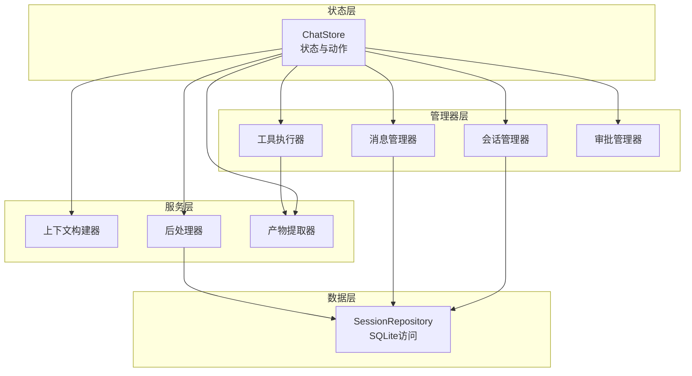
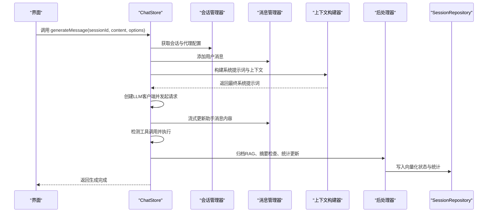
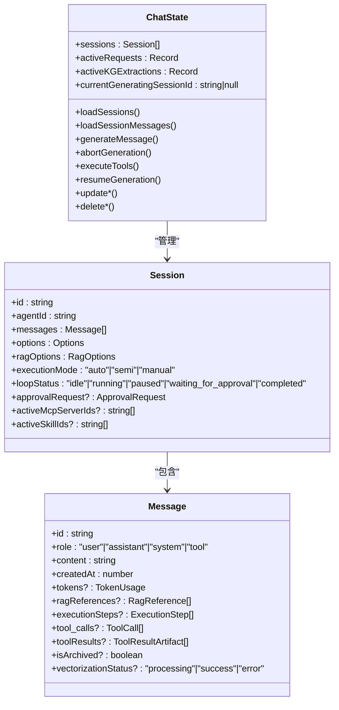
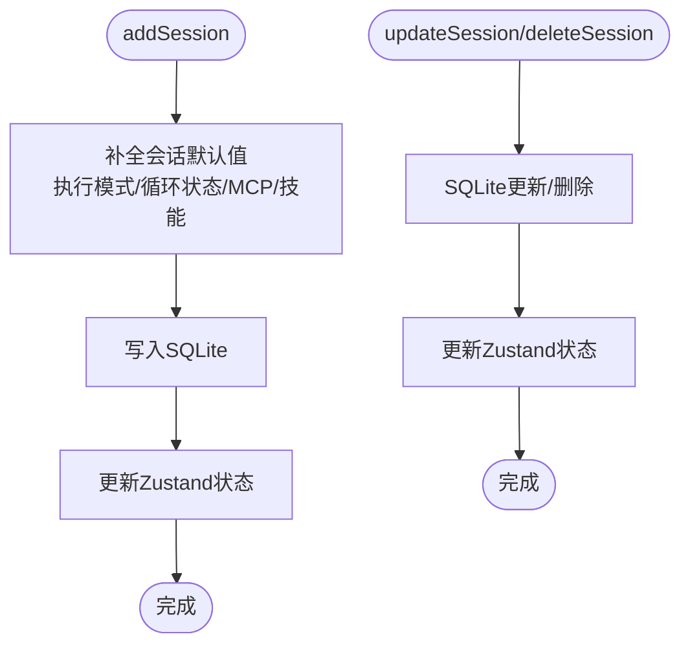
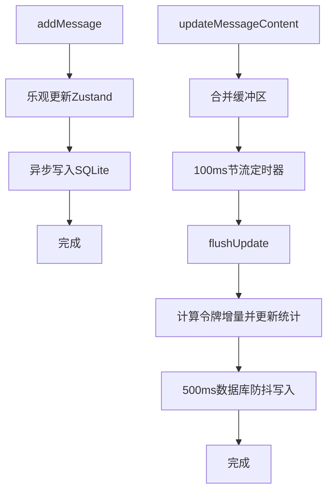
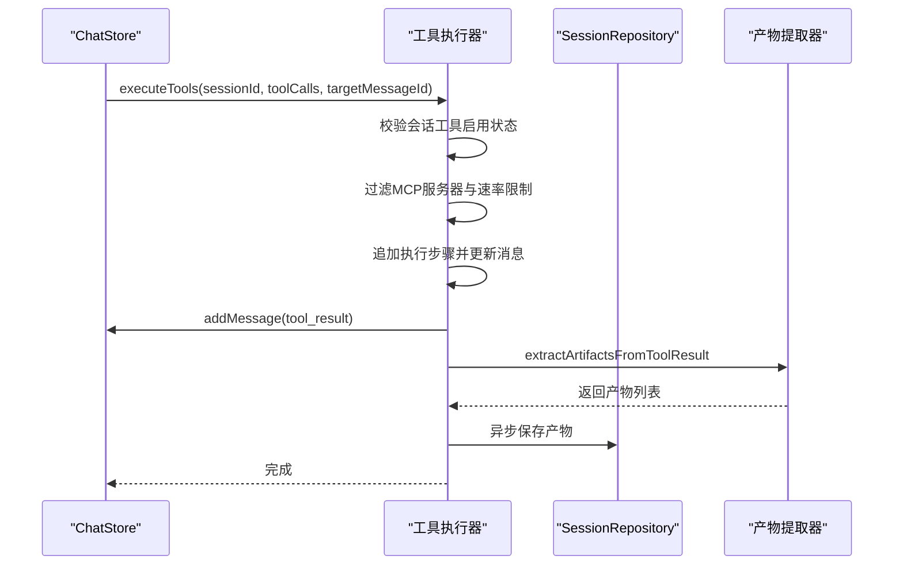
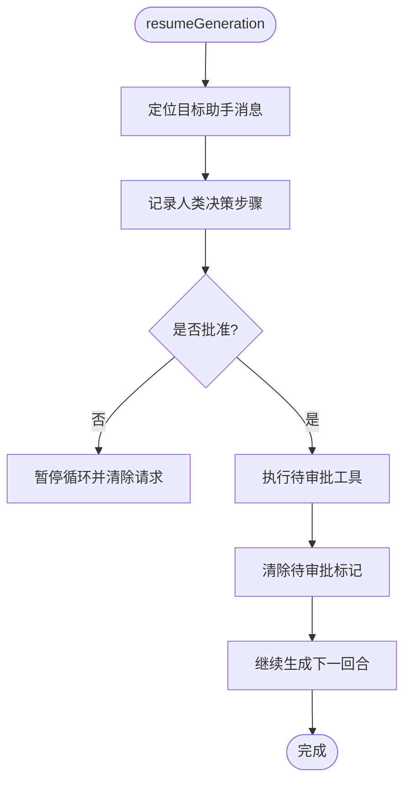
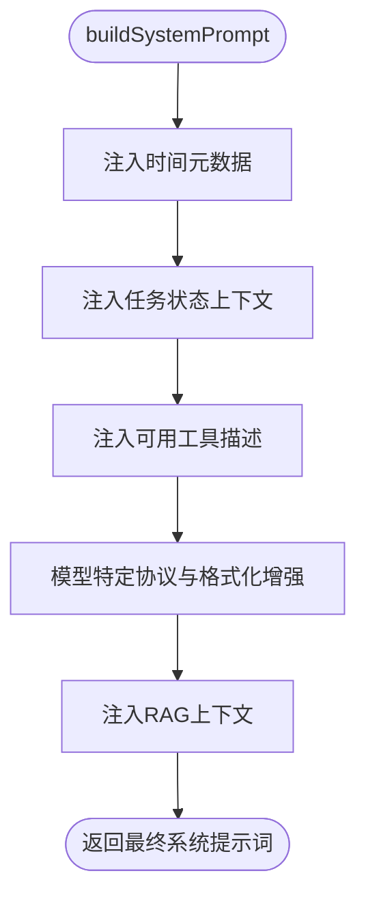
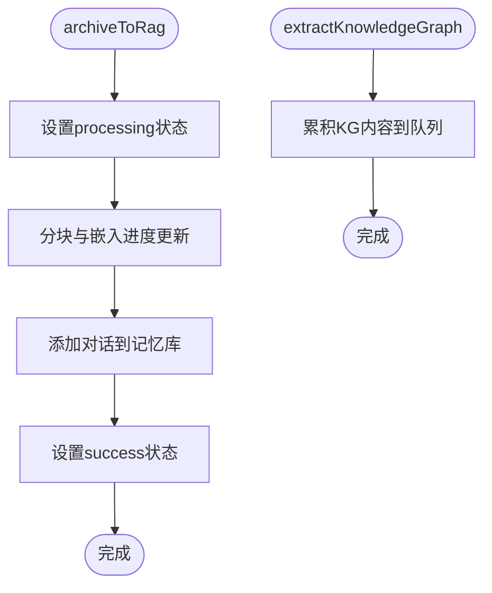
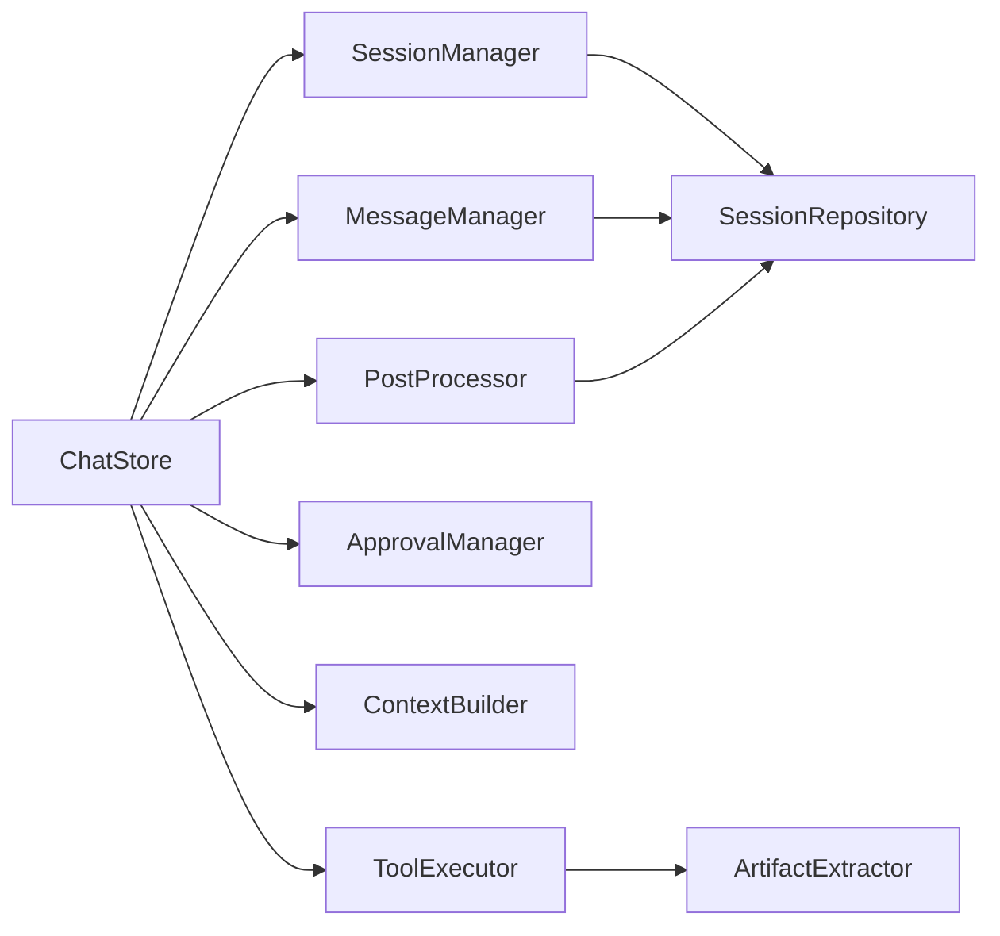

# 聊天状态管理

<cite>
**本文档引用的文件**
- [src/store/chat-store.ts](file://src/store/chat-store.ts)
- [src/store/chat/index.ts](file://src/store/chat/index.ts)
- [src/store/chat/types.ts](file://src/store/chat/types.ts)
- [src/store/chat/session-manager.ts](file://src/store/chat/session-manager.ts)
- [src/store/chat/message-manager.ts](file://src/store/chat/message-manager.ts)
- [src/store/chat/tool-execution.ts](file://src/store/chat/tool-execution.ts)
- [src/store/chat/approval-manager.ts](file://src/store/chat/approval-manager.ts)
- [src/store/chat/context-builder.ts](file://src/store/chat/context-builder.ts)
- [src/store/chat/post-processor.ts](file://src/store/chat/post-processor.ts)
- [src/types/chat.ts](file://src/types/chat.ts)
- [src/lib/db/session-repository.ts](file://src/lib/db/session-repository.ts)
- [src/features/chat/utils/artifact-extractor.ts](file://src/features/chat/utils/artifact-extractor.ts)
</cite>

## 目录
1. [简介](#简介)
2. [项目结构](#项目结构)
3. [核心组件](#核心组件)
4. [架构总览](#架构总览)
5. [详细组件分析](#详细组件分析)
6. [依赖关系分析](#依赖关系分析)
7. [性能考量](#性能考量)
8. [故障排查指南](#故障排查指南)
9. [结论](#结论)
10. [附录](#附录)

## 简介
本文件面向Nexara聊天状态管理系统，聚焦ChatStore的设计架构与实现细节，系统阐述会话管理、消息处理、工具执行等核心功能；详解状态结构设计、异步操作处理与状态持久化策略；明确会话管理器、消息管理器与工具执行器的职责分工与协作机制；给出聊天状态生命周期管理、错误处理与性能优化方法，并提供实际代码示例与最佳实践指导。

## 项目结构
ChatStore采用“状态容器 + 管理器模块”的分层设计，结合Zustand状态管理与SQLite持久化，形成高性能、可扩展的聊天状态管理体系。核心文件组织如下：
- ChatStore入口与聚合：负责状态定义、动作分发与模块装配
- 管理器模块：会话管理器、消息管理器、工具执行器、审批管理器
- 数据访问层：SessionRepository封装SQLite读写
- 工具与上下文：上下文构建器、后处理器、产物提取器
- 类型定义：统一的会话、消息、工具调用等类型

**图表来源**
- [src/store/chat-store.ts:212-355](file://src/store/chat-store.ts#L212-L355)
- [src/store/chat/session-manager.ts:15-281](file://src/store/chat/session-manager.ts#L15-L281)
- [src/store/chat/message-manager.ts:18-442](file://src/store/chat/message-manager.ts#L18-L442)
- [src/store/chat/tool-execution.ts:20-379](file://src/store/chat/tool-execution.ts#L20-L379)
- [src/store/chat/approval-manager.ts:9-173](file://src/store/chat/approval-manager.ts#L9-L173)
- [src/store/chat/context-builder.ts:1-348](file://src/store/chat/context-builder.ts#L1-L348)
- [src/store/chat/post-processor.ts:1-250](file://src/store/chat/post-processor.ts#L1-L250)
- [src/lib/db/session-repository.ts:1-425](file://src/lib/db/session-repository.ts#L1-L425)

**章节来源**
- [src/store/chat-store.ts:108-211](file://src/store/chat-store.ts#L108-L211)
- [src/store/chat/index.ts:1-24](file://src/store/chat/index.ts#L1-L24)

## 核心组件
- ChatStore：Zustand状态容器，聚合会话、消息、工具、审批等管理器，提供统一的动作接口与持久化策略
- 会话管理器：负责会话的创建、更新、删除与查询，双写SQLite与内存状态
- 消息管理器：负责消息的添加、更新、删除、向量化与布局优化，采用防抖与缓冲机制
- 工具执行器：解析工具调用、执行技能、记录执行步骤、注入产物与错误自愈
- 审批管理器：支持半自动/手动模式的审批流程与续杯控制
- 上下文构建器：整合RAG检索、Web搜索、系统提示词与工具描述
- 后处理器：负责RAG归档、KG抽取累积、上下文摘要与统计更新
- 数据访问层：SessionRepository提供会话与消息的CRUD与分页查询

**章节来源**
- [src/store/chat/types.ts:28-163](file://src/store/chat/types.ts#L28-L163)
- [src/types/chat.ts:135-223](file://src/types/chat.ts#L135-L223)

## 架构总览
ChatStore通过模块化管理器实现高内聚、低耦合的状态管理，结合SQLite持久化与Zustand内存状态，形成“热路径在内存、冷数据落磁盘”的高效架构。生成消息的主流程包含：解析模型配置、准备上下文、执行RAG检索、调用LLM、流式更新消息、工具执行、后处理与持久化。

**图表来源**
- [src/store/chat-store.ts:360-733](file://src/store/chat-store.ts#L360-L733)
- [src/store/chat/context-builder.ts:181-347](file://src/store/chat/context-builder.ts#L181-L347)
- [src/store/chat/post-processor.ts:44-249](file://src/store/chat/post-processor.ts#L44-L249)
- [src/lib/db/session-repository.ts:162-260](file://src/lib/db/session-repository.ts#L162-L260)

## 详细组件分析

### ChatStore 设计与状态结构
- 状态结构：包含会话数组、活跃请求映射、KG抽取状态、当前生成会话ID等
- 动作接口：会话与消息的增删改查、生成消息、中止生成、工具执行、审批控制、向量化与摘要等
- 持久化策略：采用Zustand持久化中间件与SQLite双写，启动时仅加载会话元数据，消息按需分页加载
- 异步处理：生成消息主流程中，RAG检索与LLM调用均采用异步与超时保护，避免阻塞UI线程

**图表来源**
- [src/store/chat-store.ts:108-211](file://src/store/chat-store.ts#L108-L211)
- [src/types/chat.ts:169-223](file://src/types/chat.ts#L169-L223)
- [src/types/chat.ts:135-167](file://src/types/chat.ts#L135-L167)

**章节来源**
- [src/store/chat-store.ts:108-211](file://src/store/chat-store.ts#L108-L211)
- [src/types/chat.ts:135-223](file://src/types/chat.ts#L135-L223)

### 会话管理器（SessionManager）
- 职责：创建、更新、删除会话；维护会话选项（工具启用、RAG开关、MCP服务器、技能开关）；滚动偏移量高频更新采用内存缓存
- 双写策略：所有写操作先写入SQLite，再更新Zustand状态，保证一致性
- 会话感知：根据模型能力自动设置工具启用默认值；支持会话级MCP与技能开关

**图表来源**
- [src/store/chat/session-manager.ts:19-94](file://src/store/chat/session-manager.ts#L19-L94)

**章节来源**
- [src/store/chat/session-manager.ts:15-281](file://src/store/chat/session-manager.ts#L15-L281)

### 消息管理器（MessageManager）
- 职责：添加消息、更新内容、删除消息、向量化、布局高度缓存、进度更新
- 防抖与缓冲：高频更新采用100ms节流与500ms数据库防抖，平衡流畅度与一致性
- 计费统计：基于令牌增量计算聊天输入/输出与RAG系统用量，实时更新会话统计
- 竞态修复：通过缓冲区与强制冲刷，避免工具调用与消息更新的竞态

**图表来源**
- [src/store/chat/message-manager.ts:204-440](file://src/store/chat/message-manager.ts#L204-L440)

**章节来源**
- [src/store/chat/message-manager.ts:18-442](file://src/store/chat/message-manager.ts#L18-L442)

### 工具执行器（ToolExecutor）
- 职责：解析工具调用、执行技能、记录执行步骤、注入错误自愈提示、产物提取与持久化
- 安全防护：会话禁用工具时拦截并反馈；MCP速率限制与排队；OpenAI兼容模型参数完整性校验
- 产物处理：自动从工具结果中提取ECharts、Mermaid、Math等结构化产物并异步持久化

**图表来源**
- [src/store/chat/tool-execution.ts:24-379](file://src/store/chat/tool-execution.ts#L24-L379)
- [src/features/chat/utils/artifact-extractor.ts:157-200](file://src/features/chat/utils/artifact-extractor.ts#L157-L200)

**章节来源**
- [src/store/chat/tool-execution.ts:20-379](file://src/store/chat/tool-execution.ts#L20-L379)
- [src/features/chat/utils/artifact-extractor.ts:1-229](file://src/features/chat/utils/artifact-extractor.ts#L1-L229)

### 审批管理器（ApprovalManager）
- 职责：半自动/手动模式的审批流程控制、续杯预算管理、干预指令注入、循环状态推进
- 关键逻辑：根据审批类型（工具审批/续杯）定位目标助手消息，记录决策步骤，必要时执行工具并继续生成

**图表来源**
- [src/store/chat/approval-manager.ts:21-146](file://src/store/chat/approval-manager.ts#L21-L146)

**章节来源**
- [src/store/chat/approval-manager.ts:9-173](file://src/store/chat/approval-manager.ts#L9-L173)

### 上下文构建器（ContextBuilder）
- 职责：客户端Web搜索、RAG检索、系统提示词构建（含任务状态、工具描述、模型特定增强）
- 模型适配：根据提供商与模型能力决定是否启用原生Web搜索与工具调用增强

**图表来源**
- [src/store/chat/context-builder.ts:181-347](file://src/store/chat/context-builder.ts#L181-L347)

**章节来源**
- [src/store/chat/context-builder.ts:1-348](file://src/store/chat/context-builder.ts#L1-L348)

### 后处理器（PostProcessor）
- 职责：RAG归档（向量化）、KG抽取累积、上下文摘要检查、统计更新与会话标题生成
- 优化策略：延迟执行、脉冲动画、最小耗时保障，避免UI抖动与过度阻塞

**图表来源**
- [src/store/chat/post-processor.ts:44-132](file://src/store/chat/post-processor.ts#L44-L132)

**章节来源**
- [src/store/chat/post-processor.ts:1-250](file://src/store/chat/post-processor.ts#L1-L250)

## 依赖关系分析
- ChatStore依赖管理器模块与数据访问层，管理器模块之间通过ChatStore上下文进行协作
- 上下文构建器与后处理器从ChatStore中迁移，降低主流程复杂度，提升可测试性
- 工具执行器与产物提取器解耦，便于扩展新的渲染工具与产物类型

**图表来源**
- [src/store/chat-store.ts:212-355](file://src/store/chat-store.ts#L212-L355)
- [src/store/chat/index.ts:8-11](file://src/store/chat/index.ts#L8-L11)

**章节来源**
- [src/store/chat-store.ts:41-43](file://src/store/chat-store.ts#L41-L43)
- [src/store/chat/index.ts:1-24](file://src/store/chat/index.ts#L1-L24)

## 性能考量
- 热路径优化：ChatStore严格限制业务逻辑，UI状态变更与动作转发为主，减少主线程阻塞
- 分页加载：会话消息按需加载，避免一次性加载大量历史消息
- 防抖与节流：消息管理器采用100ms节流与500ms数据库防抖，兼顾流畅度与一致性
- 超时与恢复：RAG检索设置30秒超时，异常时清理处理状态，防止UI卡死
- 延迟执行：KG抽取与摘要检查采用setTimeout延迟，确保UI稳定
- 计费统计：基于令牌增量计算，避免全量重算带来的性能损耗

[本节为通用性能指导，无需具体文件分析]

## 故障排查指南
- 生成消息中断：检查活跃请求映射与中止逻辑，确认会话ID匹配
- 工具执行失败：查看工具调用参数完整性、MCP服务器启用状态与速率限制，关注错误自愈提示
- RAG检索超时：确认30秒超时设置与异常分支处理，检查数据库锁与检索配置
- 消息更新丢失：确认缓冲区是否及时冲刷，避免竞态导致的工具调用覆盖
- 会话/消息持久化失败：检查SessionRepository写入异常与自修复逻辑

**章节来源**
- [src/store/chat-store.ts:323-337](file://src/store/chat-store.ts#L323-L337)
- [src/store/chat/tool-execution.ts:252-271](file://src/store/chat/tool-execution.ts#L252-L271)
- [src/store/chat/message-manager.ts:110-130](file://src/store/chat/message-manager.ts#L110-L130)
- [src/lib/db/session-repository.ts:110-147](file://src/lib/db/session-repository.ts#L110-L147)

## 结论
ChatStore通过模块化管理器与双写持久化策略，实现了高性能、可扩展的聊天状态管理。其设计遵循“UI状态为主、业务逻辑下沉”的原则，配合防抖、节流、超时与自愈机制，有效提升了用户体验与系统稳定性。未来可在以下方面持续优化：进一步细化错误边界与可观测性、扩展产物类型与渲染管线、增强会话生命周期的自动化与智能化。

[本节为总结性内容，无需具体文件分析]

## 附录
- 最佳实践
  - 生成消息前确保会话上下文已加载，避免上下文缺失导致的回复质量下降
  - 工具调用应具备参数完整性校验与错误自愈提示，减少用户困惑
  - 使用会话级RAG配置与全局配置的合并策略，确保灵活性与一致性
  - 对高频更新采用缓冲与防抖，避免不必要的数据库写入
  - 在UI层面提供明确的加载与错误状态，增强用户感知

[本节为通用指导，无需具体文件分析]