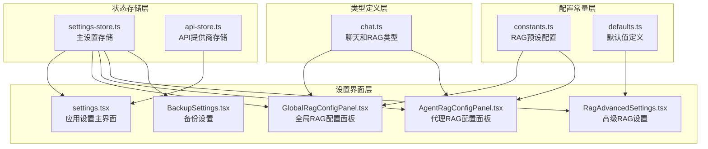
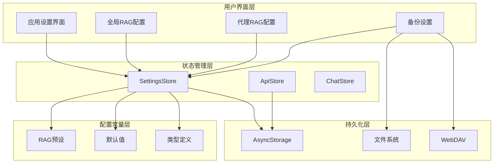
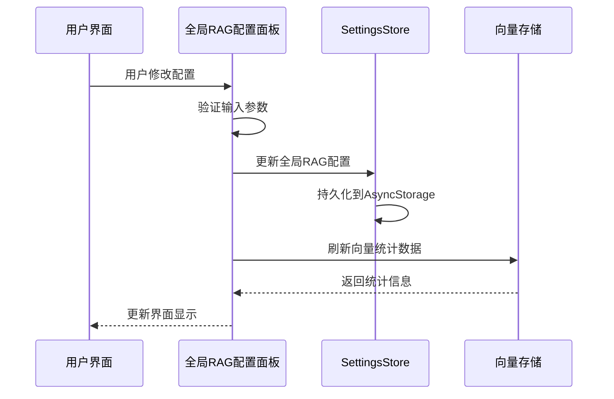
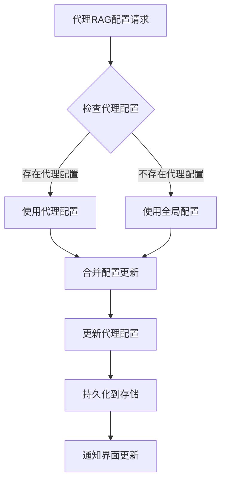
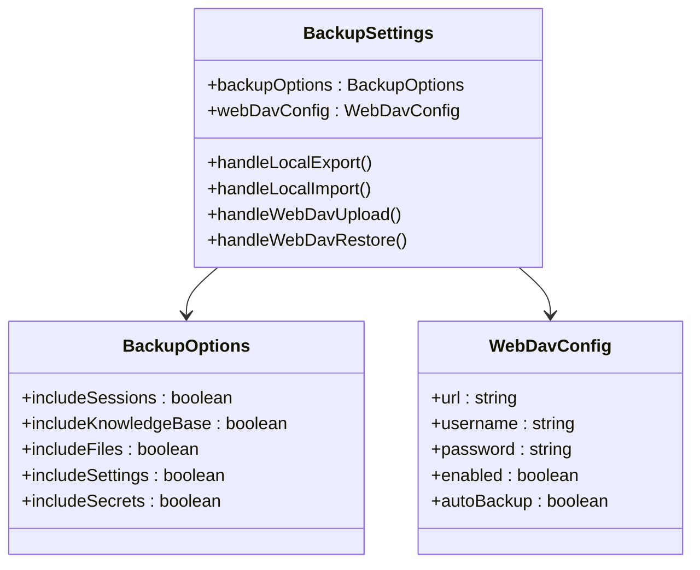
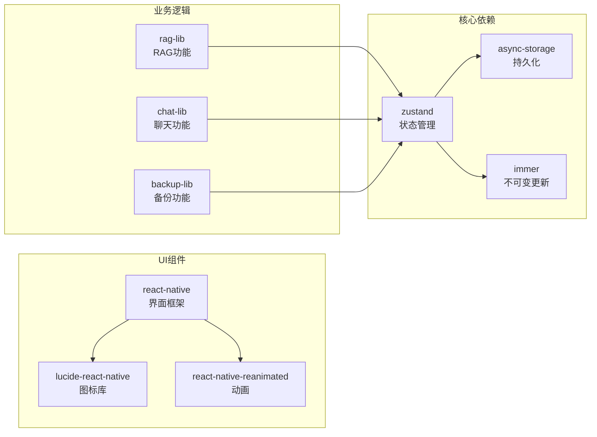
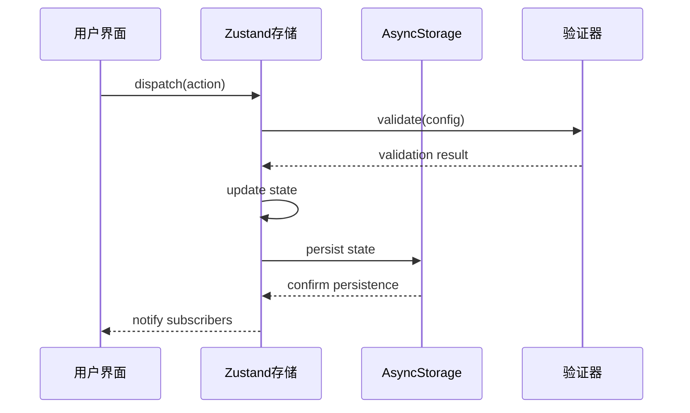

# 设置状态管理

<cite>
**本文档引用的文件**
- [settings-store.ts](file://src/store/settings-store.ts)
- [GlobalRagConfigPanel.tsx](file://src/features/settings/components/GlobalRagConfigPanel.tsx)
- [AgentRagConfigPanel.tsx](file://src/features/settings/components/AgentRagConfigPanel.tsx)
- [RagAdvancedSettings.tsx](file://src/features/settings/screens/RagAdvancedSettings.tsx)
- [constants.ts](file://src/lib/rag/constants.ts)
- [chat.ts](file://src/types/chat.ts)
- [BackupSettings.tsx](file://src/features/settings/BackupSettings.tsx)
- [api-store.ts](file://src/store/api-store.ts)
- [defaults.ts](file://src/lib/rag/defaults.ts)
- [settings.tsx](file://app/(tabs)/settings.tsx)
- [StoreSyncService.ts](file://src/services/workbench/StoreSyncService.ts)
</cite>

## 目录
1. [引言](#引言)
2. [项目结构](#项目结构)
3. [核心组件](#核心组件)
4. [架构概览](#架构概览)
5. [详细组件分析](#详细组件分析)
6. [依赖分析](#依赖分析)
7. [性能考虑](#性能考虑)
8. [故障排除指南](#故障排除指南)
9. [结论](#结论)
10. [附录](#附录)

## 引言

Nexara的设置状态管理系统是一个基于Zustand的状态管理解决方案，专门设计用于管理应用程序的各种配置选项。该系统涵盖了从基础应用设置到复杂的RAG（检索增强生成）配置的完整范围，提供了统一的状态管理模式和持久化机制。

系统的核心目标是为用户提供直观的配置界面，同时确保设置状态在应用重启后能够正确恢复，并支持多层级的配置继承关系。通过精心设计的数据结构和验证机制，系统能够在保证数据完整性的同时提供灵活的配置能力。

## 项目结构

设置状态管理系统主要分布在以下目录结构中：



**图表来源**
- [settings-store.ts:1-244](file://src/store/settings-store.ts#L1-L244)
- [settings.tsx:1-941](file://app/(tabs)/settings.tsx#L1-L941)

**章节来源**
- [settings-store.ts:1-244](file://src/store/settings-store.ts#L1-L244)
- [settings.tsx:1-941](file://app/(tabs)/settings.tsx#L1-L941)

## 核心组件

### 主设置存储（SettingsStore）

主设置存储是整个设置系统的核心，基于Zustand实现了完整的状态管理功能。它包含了以下主要功能模块：

#### 基础设置管理
- **语言设置**：支持中英文切换的语言配置
- **用户资料**：头像和用户名的个性化设置
- **主题配置**：主色调和外观主题的管理
- **触觉反馈**：震动反馈的启用/禁用控制

#### 模型配置管理
系统支持多种AI模型的默认配置：
- 总结模型（defaultSummaryModel）
- 临时会话模型（defaultTempSessionModel）
- 向量嵌入模型（defaultEmbeddingModel）
- 语音模型（defaultSpeechModel）
- 重排序模型（defaultRerankModel）
- 绘图模型（defaultImageModel）

#### RAG全局配置
实现了完整的RAG（检索增强生成）配置系统，包括：
- 文档分块和内存管理
- 检索阈值和限制
- 高级检索功能（重排序、查询重写、混合检索）
- 知识图谱集成
- 可观测性配置

#### 技能和代理设置
- 最大循环次数控制
- 执行模式（自动/半自动/手动）
- 技能启用状态管理
- 本地模型支持

**章节来源**
- [settings-store.ts:10-73](file://src/store/settings-store.ts#L10-L73)
- [settings-store.ts:115-180](file://src/store/settings-store.ts#L115-L180)
- [settings-store.ts:187-195](file://src/store/settings-store.ts#L187-L195)

### API提供商存储（ApiStore）

API提供商存储负责管理外部服务提供商的配置和状态：

#### 提供商管理
- 多提供商支持（Google、Tavily、Bing等）
- 提供商启用/禁用状态
- 模型可用性跟踪
- 使用统计和配额管理

#### 搜索引擎配置
- 多搜索引擎支持
- 搜索结果排序
- API密钥管理
- 配置持久化

**章节来源**
- [api-store.ts:9-36](file://src/store/api-store.ts#L9-L36)
- [api-store.ts:44-53](file://src/store/api-store.ts#L44-L53)

## 架构概览

设置状态管理系统采用分层架构设计，确保了良好的模块分离和可维护性：



**图表来源**
- [settings-store.ts:75-243](file://src/store/settings-store.ts#L75-L243)
- [api-store.ts:38-160](file://src/store/api-store.ts#L38-L160)

## 详细组件分析

### 全局RAG配置面板

全局RAG配置面板提供了完整的RAG系统配置界面，支持多种预设配置和高级设置：

#### 预设配置系统
系统内置了三种预设配置：
- **平衡模式**：适用于一般用途的均衡配置
- **写作模式**：针对长文本生成优化的配置
- **代码模式**：面向编程和技术文档的特殊配置

每个预设都包含完整的RAG参数配置，用户可以通过简单的点击应用这些预设。

#### 配置验证和同步
面板实现了智能的配置验证机制：
- 实时配置状态显示
- 参数范围验证
- 配置冲突检测
- 自动配置同步



**图表来源**
- [GlobalRagConfigPanel.tsx:128-136](file://src/features/settings/components/GlobalRagConfigPanel.tsx#L128-L136)
- [settings-store.ts:182-185](file://src/store/settings-store.ts#L182-L185)

**章节来源**
- [GlobalRagConfigPanel.tsx:18-56](file://src/features/settings/components/GlobalRagConfigPanel.tsx#L18-L56)
- [GlobalRagConfigPanel.tsx:128-136](file://src/features/settings/components/GlobalRagConfigPanel.tsx#L128-L136)

### 代理RAG配置面板

代理RAG配置面板专注于单个代理的RAG配置管理，支持继承和覆盖机制：

#### 配置继承机制
系统实现了智能的配置继承策略：
- 代理级配置优先于全局配置
- 未设置的参数自动继承全局配置
- 支持配置重置回全局默认

#### 配置编辑功能
面板提供了完整的配置编辑体验：
- 实时参数调整
- 配置状态可视化
- 快速预设应用
- 配置重置功能



**图表来源**
- [AgentRagConfigPanel.tsx:30-33](file://src/features/settings/components/AgentRagConfigPanel.tsx#L30-L33)
- [AgentRagConfigPanel.tsx:47-58](file://src/features/settings/components/AgentRagConfigPanel.tsx#L47-L58)

**章节来源**
- [AgentRagConfigPanel.tsx:20-44](file://src/features/settings/components/AgentRagConfigPanel.tsx#L20-L44)
- [AgentRagConfigPanel.tsx:47-58](file://src/features/settings/components/AgentRagConfigPanel.tsx#L47-L58)

### 高级RAG设置

高级RAG设置页面提供了更精细的配置选项，特别是知识图谱集成：

#### 知识图谱配置
- **抽取模型选择**：支持多种LLM模型进行实体抽取
- **成本策略配置**：提供三种不同的抽取成本策略
- **本地优化选项**：支持增量哈希和本地预处理
- **提示词定制**：允许用户自定义抽取提示词

#### 配置验证机制
系统实现了严格的配置验证：
- 提示词格式验证
- 必需参数检查
- 模型可用性验证
- 配置冲突检测

**章节来源**
- [RagAdvancedSettings.tsx:128-153](file://src/features/settings/screens/RagAdvancedSettings.tsx#L128-L153)
- [RagAdvancedSettings.tsx:251-310](file://src/features/settings/screens/RagAdvancedSettings.tsx#L251-L310)

### 备份设置系统

备份设置系统提供了完整的数据保护机制：

#### 多层次备份策略
- **本地备份**：JSON格式的完整数据备份
- **云备份**：WebDAV协议的云端数据同步
- **增量备份**：支持部分数据的增量备份
- **自动备份**：定时自动备份功能

#### 备份数据管理
- **内容选择**：可选择性地备份不同类型的数据
- **版本管理**：支持多个备份版本的管理
- **数据恢复**：完整的数据恢复流程
- **安全保护**：备份数据的安全存储和传输



**图表来源**
- [BackupSettings.tsx:107-117](file://src/features/settings/BackupSettings.tsx#L107-L117)
- [BackupSettings.tsx:80-86](file://src/features/settings/BackupSettings.tsx#L80-L86)

**章节来源**
- [BackupSettings.tsx:119-181](file://src/features/settings/BackupSettings.tsx#L119-L181)
- [BackupSettings.tsx:182-280](file://src/features/settings/BackupSettings.tsx#L182-L280)

## 依赖分析

设置状态管理系统具有清晰的依赖关系和模块边界：



**图表来源**
- [settings-store.ts:1-6](file://src/store/settings-store.ts#L1-L6)
- [settings.tsx:1-30](file://app/(tabs)/settings.tsx#L1-L30)

### 数据流分析

系统实现了完整的数据流管理：



**图表来源**
- [settings-store.ts:233-240](file://src/store/settings-store.ts#L233-L240)
- [settings-store.ts:208-242](file://src/store/settings-store.ts#L208-L242)

**章节来源**
- [settings-store.ts:208-242](file://src/store/settings-store.ts#L208-L242)
- [settings-store.ts:233-240](file://src/store/settings-store.ts#L233-L240)

## 性能考虑

设置状态管理系统在设计时充分考虑了性能优化：

### 状态更新优化
- **局部状态更新**：使用Immer实现高效的不可变更新
- **批量更新**：支持多个状态变更的批量处理
- **防抖机制**：高频状态更新的防抖处理
- **内存管理**：及时清理不再使用的状态引用

### 持久化优化
- **增量持久化**：只持久化必要的状态字段
- **压缩存储**：对存储数据进行压缩处理
- **异步写入**：避免阻塞主线程的异步持久化
- **错误恢复**：持久化失败时的状态恢复机制

### UI响应优化
- **虚拟化列表**：大量设置项的虚拟化渲染
- **懒加载**：延迟加载非关键设置界面
- **缓存策略**：常用配置的内存缓存
- **节流更新**：避免频繁的UI重绘

## 故障排除指南

### 常见问题诊断

#### 设置状态丢失
当遇到设置状态丢失的问题时，可以按照以下步骤排查：

1. **检查存储权限**
   - 确认应用具有访问AsyncStorage的权限
   - 验证设备存储空间充足

2. **验证数据完整性**
   ```typescript
   // 检查存储中的设置数据
   const storedData = await AsyncStorage.getItem('settings-storage-v2');
   console.log('Stored settings:', storedData);
   ```

3. **重置设置状态**
   ```typescript
   // 重置到默认状态
   useSettingsStore.persist.rehydrate();
   ```

#### 配置验证失败
当配置验证失败时，系统会显示相应的错误信息：

1. **参数范围检查**
   - 确认数值参数在有效范围内
   - 验证字符串参数格式正确

2. **依赖关系验证**
   - 检查必需的依赖项是否已配置
   - 验证配置之间的逻辑关系

#### 性能问题
如果遇到设置界面响应缓慢的问题：

1. **检查状态更新频率**
   - 减少不必要的状态订阅
   - 避免在渲染函数中进行复杂计算

2. **优化存储操作**
   - 批量处理多个状态更新
   - 使用防抖机制处理高频更新

**章节来源**
- [settings-store.ts:96-104](file://src/store/settings-store.ts#L96-L104)
- [settings-store.ts:233-240](file://src/store/settings-store.ts#L233-L240)

## 结论

Nexara的设置状态管理系统展现了现代React Native应用中状态管理的最佳实践。通过精心设计的架构和完善的验证机制，系统不仅提供了丰富的配置选项，还确保了数据的一致性和可靠性。

系统的主要优势包括：

- **模块化设计**：清晰的模块分离和职责划分
- **强类型支持**：完整的TypeScript类型定义
- **数据验证**：多层次的配置验证机制
- **持久化策略**：可靠的本地和云端数据存储
- **用户体验**：直观的配置界面和实时反馈

未来的发展方向可能包括：
- 更多的配置预设和模板
- 配置导入导出功能
- 配置版本管理和比较
- 更强大的备份和恢复机制

## 附录

### 配置项参考表

| 配置类别 | 配置项 | 类型 | 默认值 | 描述 |
|---------|--------|------|--------|------|
| 基础设置 | language | string | 'zh' | 应用语言 |
| 基础设置 | hapticsEnabled | boolean | false | 触觉反馈开关 |
| 基础设置 | loggingEnabled | boolean | true | 日志记录开关 |
| 模型配置 | defaultSummaryModel | string | undefined | 总结模型ID |
| 模型配置 | defaultEmbeddingModel | string | undefined | 嵌入模型ID |
| RAG配置 | contextWindow | number | 20 | 上下文窗口大小 |
| RAG配置 | memoryLimit | number | 5 | 内存检索限制 |
| RAG配置 | docLimit | number | 8 | 文档检索限制 |
| 技能配置 | maxLoopCount | number | 50 | 最大循环次数 |
| 技能配置 | executionMode | string | 'semi' | 执行模式 |

### 扩展开发指南

#### 添加新的设置项
1. 在SettingsStore中添加新的状态字段
2. 实现对应的setter方法
3. 在持久化配置中包含新字段
4. 在UI界面中添加相应的控件

#### 创建自定义配置面板
1. 设计配置界面布局
2. 实现配置验证逻辑
3. 集成到主设置界面
4. 测试配置的持久化和恢复

#### 集成第三方服务
1. 定义服务配置接口
2. 实现配置验证和测试
3. 集成到API存储系统
4. 提供用户友好的配置界面