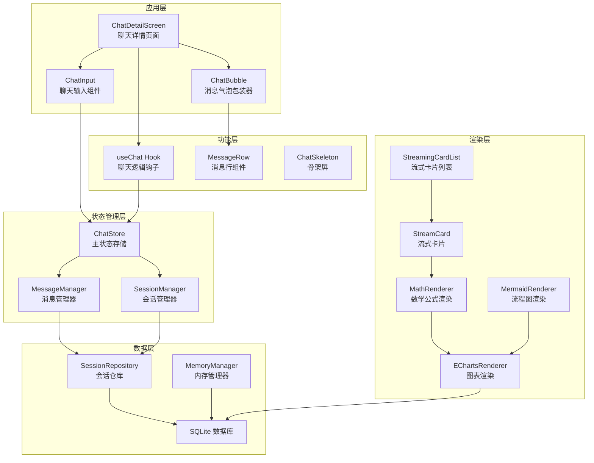
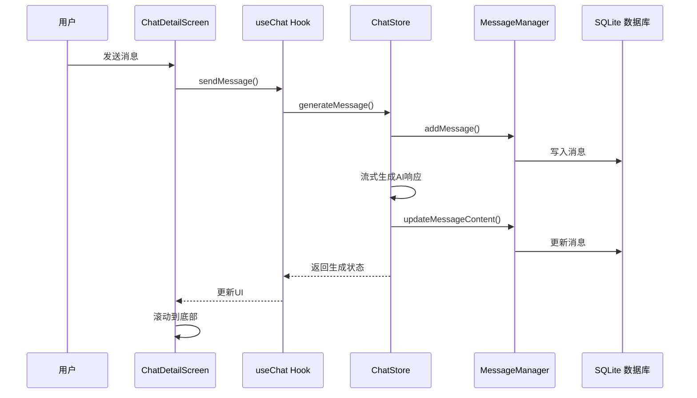
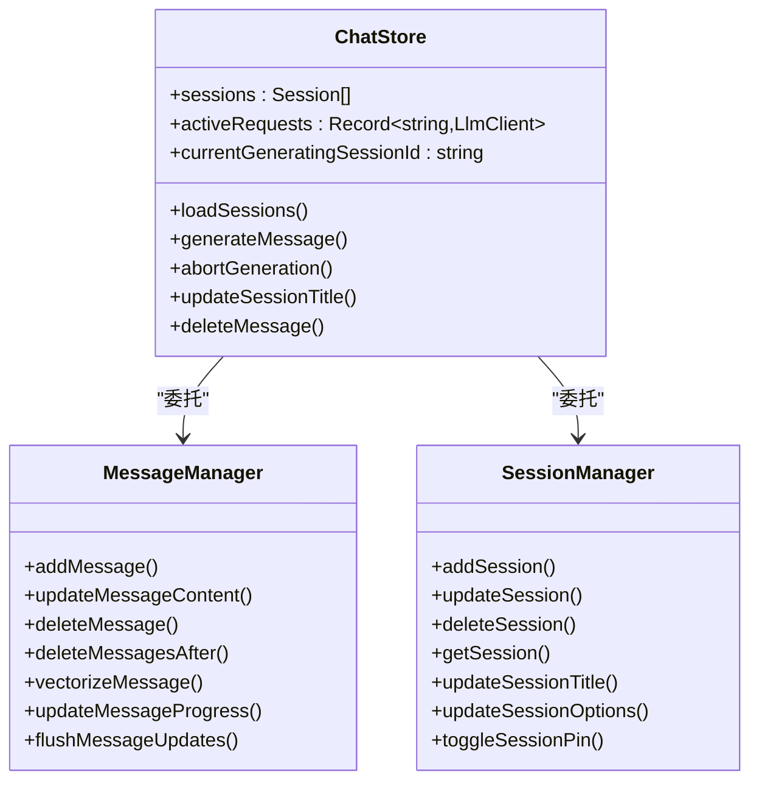
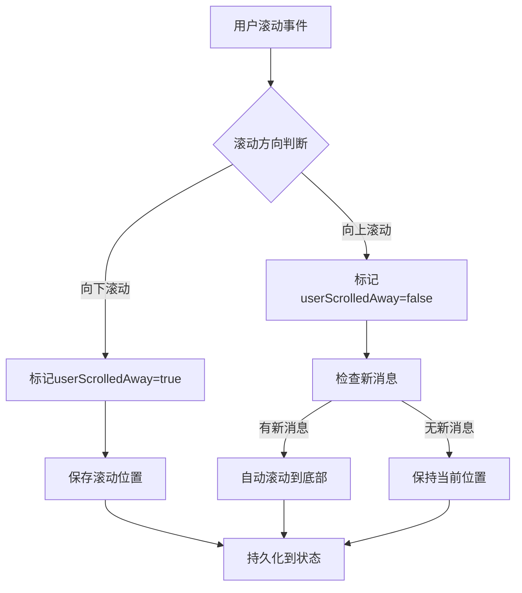
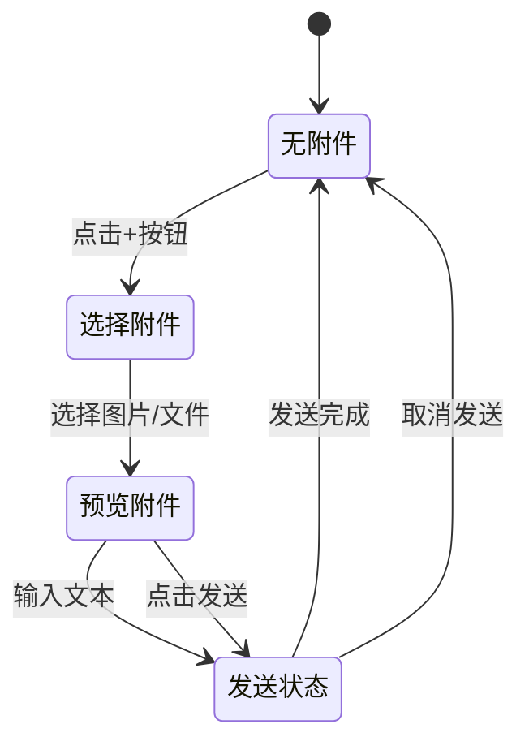
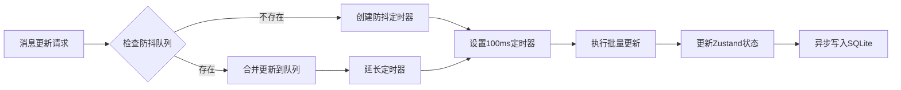
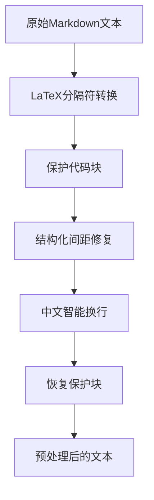
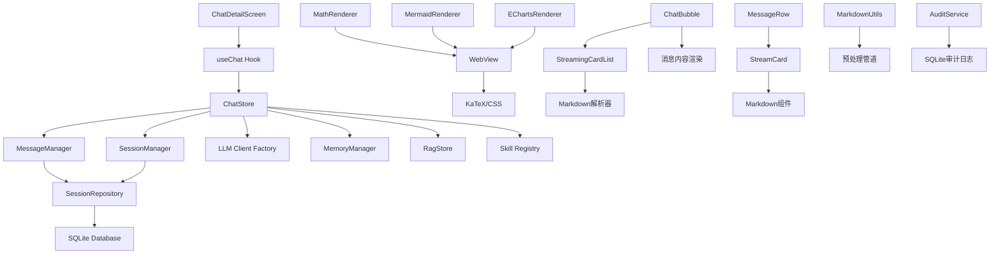
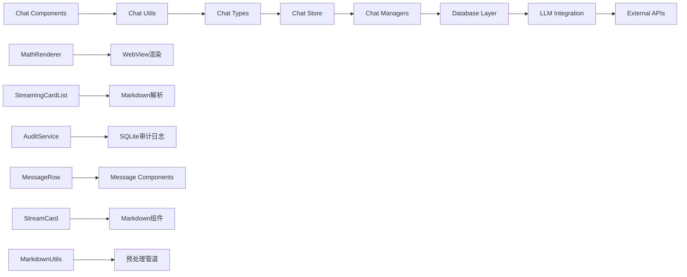

# 聊天界面审计

<cite>
**本文档引用的文件**
- [app/chat/[id].tsx](file://app/chat/[id].tsx)
- [src/features/chat/components/ChatInput.tsx](file://src/features/chat/components/ChatInput.tsx)
- [src/features/chat/hooks/useChat.ts](file://src/features/chat/hooks/useChat.ts)
- [src/store/chat-store.ts](file://src/store/chat-store.ts)
- [src/store/chat/message-manager.ts](file://src/store/chat/message-manager.ts)
- [src/store/chat/session-manager.ts](file://src/store/chat/session-manager.ts)
- [src/features/chat/components/ChatBubble.tsx](file://src/features/chat/components/ChatBubble.tsx)
- [src/features/chat/components/message/MessageRow.tsx](file://src/features/chat/components/message/MessageRow.tsx)
- [src/types/chat.ts](file://src/types/chat.ts)
- [src/services/workbench/StoreSyncService.ts](file://src/services/workbench/StoreSyncService.ts)
- [.agent/docs/architecture/CHAT_INTERFACE_AUDIT.md](file://.agent/docs/architecture/CHAT_INTERFACE_AUDIT.md)
- [src/lib/services/audit-service.ts](file://src/lib/services/audit-service.ts)
- [src/components/chat/MathRenderer.tsx](file://src/components/chat/MathRenderer.tsx)
- [src/features/chat/components/StreamingCardList.tsx](file://src/features/chat/components/StreamingCardList.tsx)
- [src/lib/markdown/markdown-utils.ts](file://src/lib/markdown/markdown-utils.ts)
- [src/features/chat/components/StreamCard.tsx](file://src/features/chat/components/StreamCard.tsx)
</cite>

## 更新摘要
**所做更改**
- 新增了基于最新架构审计报告的详细组件层次结构分析
- 更新了数据流架构图和性能优化建议
- 增加了WebView渲染组件的详细分析
- 完善了Markdown渲染系统的架构说明
- 新增了审计服务和性能监控建议
- 增强了性能瓶颈识别和重构评估

## 目录
1. [简介](#简介)
2. [项目结构](#项目结构)
3. [核心组件](#核心组件)
4. [架构概览](#架构概览)
5. [详细组件分析](#详细组件分析)
6. [依赖关系分析](#依赖关系分析)
7. [性能考量](#性能考量)
8. [故障排除指南](#故障排除指南)
9. [结论](#结论)

## 简介

这是一个基于 React Native 和 Expo 的聊天界面系统，采用了现代化的架构设计和先进的技术实践。该系统实现了完整的聊天功能，包括消息发送、接收、流式输出、RAG 检索、工具调用、知识图谱提取等功能。

系统的核心特点包括：
- 基于 Zustand 的状态管理
- SQLite 数据持久化
- 流式 AI 生成支持
- RAG 检索增强
- 知识图谱构建
- 多模态输入支持（文本、图片、文件）
- **新增**：WebView 渲染优化和性能监控
- **新增**：详细的组件层次结构分析和性能瓶颈识别

## 项目结构

聊天界面采用模块化架构，主要分为以下几个层次：



**图表来源**
- [app/chat/[id].tsx:81-796](file://app/chat/[id].tsx#L81-L796)
- [src/features/chat/hooks/useChat.ts:1-117](file://src/features/chat/hooks/useChat.ts#L1-L117)
- [src/store/chat-store.ts:212-211](file://src/store/chat-store.ts#L212-L211)
- [.agent/docs/architecture/CHAT_INTERFACE_AUDIT.md:13-48](file://.agent/docs/architecture/CHAT_INTERFACE_AUDIT.md#L13-L48)

**章节来源**
- [app/chat/[id].tsx:1-796](file://app/chat/[id].tsx#L1-L796)
- [src/features/chat/hooks/useChat.ts:1-117](file://src/features/chat/hooks/useChat.ts#L1-L117)

## 核心组件

### 主聊天页面组件

ChatDetailScreen 是整个聊天界面的核心组件，负责协调所有聊天相关的功能。它实现了以下关键特性：

- **智能滚动管理**：使用 Reanimated 实现流畅的滚动体验
- **流式生成支持**：实时显示 AI 生成的内容
- **多模态输入**：支持文本、图片、文件等多种输入方式
- **RAG 检索集成**：与知识库进行智能检索
- **知识图谱提取**：支持手动提取知识图谱

### 聊天输入组件

ChatInput 组件提供了完整的聊天输入功能，包括：

- **附件管理**：支持图片和文件上传
- **实时预览**：显示已选择的附件
- **发送控制**：根据输入状态启用/禁用发送按钮
- **中断控制**：支持停止 AI 生成

### 消息显示组件

ChatBubble 和 MessageRow 组件负责消息的渲染和交互：

- **消息分组**：将相关消息组织在一起
- **上下文菜单**：提供消息操作选项
- **内容渲染**：支持多种内容类型的渲染
- **交互功能**：支持删除、重发、重新生成等操作

**章节来源**
- [app/chat/[id].tsx:81-796](file://app/chat/[id].tsx#L81-L796)
- [src/features/chat/components/ChatInput.tsx:1-312](file://src/features/chat/components/ChatInput.tsx#L1-L312)
- [src/features/chat/components/ChatBubble.tsx:1-44](file://src/features/chat/components/ChatBubble.tsx#L1-L44)
- [src/features/chat/components/message/MessageRow.tsx:1-130](file://src/features/chat/components/message/MessageRow.tsx#L1-L130)

## 架构概览

系统采用分层架构设计，确保了良好的可维护性和扩展性：



**图表来源**
- [src/features/chat/hooks/useChat.ts:43-77](file://src/features/chat/hooks/useChat.ts#L43-L77)
- [src/store/chat-store.ts:360-544](file://src/store/chat-store.ts#L360-L544)
- [src/store/chat/message-manager.ts:205-231](file://src/store/chat/message-manager.ts#L205-L231)

### 状态管理架构

系统使用 Zustand 进行状态管理，实现了清晰的状态分离：



**图表来源**
- [src/store/chat-store.ts:108-210](file://src/store/chat-store.ts#L108-L210)
- [src/store/chat/message-manager.ts:18-442](file://src/store/chat/message-manager.ts#L18-L442)
- [src/store/chat/session-manager.ts:15-281](file://src/store/chat/session-manager.ts#L15-L281)

**章节来源**
- [src/store/chat-store.ts:108-210](file://src/store/chat-store.ts#L108-L210)
- [src/store/chat/message-manager.ts:18-442](file://src/store/chat/message-manager.ts#L18-L442)
- [src/store/chat/session-manager.ts:15-281](file://src/store/chat/session-manager.ts#L15-L281)

## 详细组件分析

### 聊天详情页面分析

ChatDetailScreen 实现了复杂的聊天界面逻辑，包括：

#### 滚动管理系统



**图表来源**
- [app/chat/[id].tsx:224-261](file://app/chat/[id].tsx#L224-L261)
- [app/chat/[id].tsx:357-377](file://app/chat/[id].tsx#L357-L377)

#### 流式生成处理

系统实现了智能的流式生成处理机制：

- **生成状态跟踪**：监控当前生成的会话ID
- **自动滚动控制**：在生成过程中自动跟踪最新消息
- **思维链处理**：正确处理思维链（reasoning）阶段的切换
- **用户交互响应**：响应用户的滚动和停止操作

#### 多模态支持

系统支持多种输入方式：

- **文本输入**：标准的文本聊天
- **图片上传**：支持相机拍摄和相册选择
- **文件附件**：支持文档、PDF等文件
- **模型切换**：动态切换不同的AI模型

**章节来源**
- [app/chat/[id].tsx:81-796](file://app/chat/[id].tsx#L81-L796)

### 聊天输入组件分析

ChatInput 组件提供了完整的输入功能：

#### 附件管理



**图表来源**
- [src/features/chat/components/ChatInput.tsx:150-300](file://src/features/chat/components/ChatInput.tsx#L150-L300)

#### 输入状态管理

组件实现了复杂的状态管理：

- **焦点状态**：根据键盘显示调整样式
- **编辑模式**：支持重发和修改消息
- **发送控制**：根据输入内容动态启用/禁用
- **中断控制**：支持停止AI生成

**章节来源**
- [src/features/chat/components/ChatInput.tsx:1-312](file://src/features/chat/components/ChatInput.tsx#L1-L312)

### 消息管理器分析

MessageManager 实现了消息的完整生命周期管理：

#### 防抖更新机制



**图表来源**
- [src/store/chat/message-manager.ts:21-75](file://src/store/chat/message-manager.ts#L21-L75)

#### SQLite 双写模式

系统采用双写模式确保数据一致性：

- **乐观更新**：先更新内存状态，再异步写入数据库
- **错误处理**：数据库写入失败时不阻塞UI
- **数据同步**：通过定时器确保最终一致性

**章节来源**
- [src/store/chat/message-manager.ts:18-442](file://src/store/chat/message-manager.ts#L18-L442)

### 会话管理器分析

SessionManager 负责会话级别的数据管理：

#### 自动配置管理

系统根据模型能力自动配置会话选项：

- **工具启用检测**：高能力模型自动启用工具
- **MCP服务器继承**：继承默认启用的MCP服务器
- **技能状态管理**：管理会话激活的技能列表

#### 知识图谱清理

删除会话时自动清理相关数据：

- **KG边清理**：删除相关的知识图谱边
- **孤立节点清理**：删除没有连接的知识图谱节点
- **数据完整性**：确保数据库约束的一致性

**章节来源**
- [src/store/chat/session-manager.ts:15-281](file://src/store/chat/session-manager.ts#L15-L281)

### Markdown 渲染系统分析

#### 预处理管道

系统实现了完整的Markdown预处理管道：



**图表来源**
- [.agent/docs/architecture/CHAT_INTERFACE_AUDIT.md:163-176](file://.agent/docs/architecture/CHAT_INTERFACE_AUDIT.md#L163-L176)

#### 渲染引擎

系统使用 `react-native-markdown-display` 作为核心渲染引擎，并实现了自定义渲染规则：

- **代码块渲染**：支持 Mermaid、ECharts、LaTeX、SVG 等特殊代码块
- **图片渲染**：使用 GeneratedImage 组件
- **表格渲染**：使用 ResponsiveTable 组件
- **行内公式检测**：自动识别并使用 MathRenderer

#### 流式卡片分割

系统实现了智能的流式内容分割机制：

- **结构化块分割**：使用 LLM_STRUCTURED_BLOCK_REGEX 进行分割
- **标签过滤**：过滤掉 Thinking、Tools、Plans 等标签块
- **语义卡片**：返回语义完整的卡片数组

**章节来源**
- [.agent/docs/architecture/CHAT_INTERFACE_AUDIT.md:157-218](file://.agent/docs/architecture/CHAT_INTERFACE_AUDIT.md#L157-L218)

### WebView 渲染组件分析

#### MathRenderer 分析

MathRenderer 是专门用于数学公式渲染的组件：

- **技术栈**：使用 WebView + KaTeX (CDN)
- **尺寸缓存**：实现全局 sizeCache 防止布局抖动
- **预估尺寸**：提供兜底的尺寸计算
- **性能优化**：避免频繁的布局测量

**性能问题**：
- 每个 `$...$` 创建独立 WebView
- 高频公式场景内存压力大

#### MermaidRenderer 分析

MermaidRenderer 用于流程图渲染：

- **懒加载模式**：点击后全屏渲染
- **横屏支持**：支持设备旋转
- **CDN加载**：使用 CDN 加载 Mermaid.js

#### EChartsRenderer 分析

EChartsRenderer 用于图表渲染：

- **JSON配置解析**：支持完整的 ECharts 配置
- **标题隐藏**：自动隐藏标题避免与原生 Header 冲突
- **横屏支持**：支持设备旋转

#### StreamCard 分析

StreamCard 是流式内容的卡片组件：

- **索引指示器**：显示内容块的顺序
- **侧边色带**：提供视觉分隔
- **Markdown渲染**：使用 react-native-markdown-display
- **主题适配**：支持深色/浅色模式

**章节来源**
- [.agent/docs/architecture/CHAT_INTERFACE_AUDIT.md:221-256](file://.agent/docs/architecture/CHAT_INTERFACE_AUDIT.md#L221-L256)

## 依赖关系分析

系统具有清晰的依赖关系结构：



**图表来源**
- [src/features/chat/hooks/useChat.ts:1-117](file://src/features/chat/hooks/useChat.ts#L1-L117)
- [src/store/chat-store.ts:212-211](file://src/store/chat-store.ts#L212-L211)
- [.agent/docs/architecture/CHAT_INTERFACE_AUDIT.md:52-81](file://.agent/docs/architecture/CHAT_INTERFACE_AUDIT.md#L52-L81)

### 外部依赖

系统依赖的关键外部库：

- **React Native Reanimated**：实现流畅的动画效果
- **Expo Router**：提供路由和导航功能
- **Zustand**：轻量级状态管理
- **Expo FileSystem**：文件系统操作
- **SQLite**：本地数据存储
- **WebView**：用于复杂内容渲染
- **react-native-markdown-display**：Markdown渲染引擎

### 内部模块依赖



**图表来源**
- [src/types/chat.ts:1-314](file://src/types/chat.ts#L1-L314)
- [src/store/chat-store.ts:1-800](file://src/store/chat-store.ts#L1-L800)

**章节来源**
- [src/types/chat.ts:1-314](file://src/types/chat.ts#L1-L314)
- [src/store/chat-store.ts:1-800](file://src/store/chat-store.ts#L1-L800)

## 性能考量

系统在多个方面进行了性能优化：

### 滚动性能优化

- **FlatList 替代**：使用 FlatList 替代 FlashList，避免复杂内容下的滚动bug
- **虚拟化**：只渲染可见的消息项
- **防抖更新**：滚动位置更新使用防抖机制

### 内存管理

- **消息分页**：按需加载历史消息
- **状态清理**：及时清理不再需要的状态
- **图片优化**：使用缩略图减少内存占用
- **WebView缓存**：实现全局尺寸缓存减少重复计算

### 数据库优化

- **批量写入**：使用防抖机制批量写入数据库
- **异步操作**：数据库操作不影响UI线程
- **索引优化**：合理的数据库索引设计

### WebView 性能优化

- **实例复用**：减少 WebView 创建频率
- **懒加载**：按需加载复杂内容
- **尺寸预估**：避免布局抖动
- **缓存策略**：全局尺寸缓存机制

### 审计和监控

系统新增了完善的审计和服务监控能力：

- **审计服务**：异步写入的审计日志系统
- **性能指标**：建议的性能监控指标集合
- **错误追踪**：完整的错误日志记录

### 性能瓶颈分析

**已识别问题**：
- **WebView 数量过多**：🔴 高 - 内存占用、初始化延迟
- **表格滚动体验差**：🟡 中 - 水平滚动不流畅
- **Markdown 渲染慢**：🟡 中 - 复杂内容加载延迟
- **FlatList 禁用视图裁剪**：🟡 中 - 长对话内存压力
- **ChatBubble 单文件过大**：🟢 低 - 维护困难

**性能数据**：
- **消息列表渲染**：100 条消息 ≈ 10MB 内存，单条复杂消息（含表格+公式）≈ 100-200KB
- **WebView 开销**：单个 WebView 初始化 ≈ 50-100ms，内存占用 ≈ 5-10MB/实例
- **Markdown 解析**：`react-native-markdown-display` AST 遍历 ≈ 5-20ms/KB

### WebView 重构评估

#### 可行性分析

**优势**：
1. **渲染性能**：浏览器引擎 GPU 加速，复杂排版更流畅
2. **生态成熟**：markdown-it、marked、KaTeX 等库经过充分优化
3. **一致性**：统一渲染引擎，减少组件碎片化
4. **维护成本**：减少自定义规则维护

**挑战**：
1. **原生桥接延迟**：流式输出需要高频 JS 注入，`injectJavaScript` 调用延迟 ≈ 5-10ms
2. **手势冲突**：WebView 内部滚动 vs RN FlatList 滚动，需要禁用 WebView 滚动或实现手势协商
3. **内存管理**：WebView 内存占用高于原生组件，需要实现 WebView 池/复用机制
4. **状态同步**：消息操作（删除、重发）需要桥接通信，`postMessage` + 事件监听模式

#### 技术方案对比

| 方案 | 复杂度 | 风险 | 收益 |
|------|--------|------|------|
| A. 完全 WebView | 🔴 高 | 高 | 高 |
| B. 混合渲染 | 🟡 中 | 中 | 中 |
| C. 渐进式迁移 | 🟢 低 | 低 | 中 |

**推荐实施路径**：
```
短期 (1-2 周)
├── 优化 MathRenderer：合并相邻公式
├── 表格 WebView 化
└── 代码块 WebView 化

中期 (1 个月)
├── WebView 预加载池
├── 消息级别 WebView 复用
└── 流式输出 JS 注入优化

长期 (评估后决定)
├── 完全 WebView 消息列表
└── 虚拟滚动实现
```

**章节来源**
- [.agent/docs/architecture/CHAT_INTERFACE_AUDIT.md:258-472](file://.agent/docs/architecture/CHAT_INTERFACE_AUDIT.md#L258-L472)

## 故障排除指南

### 常见问题诊断

#### 消息不显示问题

1. **检查数据库连接**
   - 确认 SQLite 数据库正常工作
   - 检查会话数据是否正确加载

2. **验证状态同步**
   - 检查 Zustand 状态是否正确更新
   - 确认消息管理器的双写机制

#### 生成卡顿问题

1. **检查网络连接**
   - 验证 LLM API 连接状态
   - 检查 API 密钥配置

2. **监控资源使用**
   - 监控内存使用情况
   - 检查 CPU 占用率

#### 滚动异常问题

1. **验证滚动逻辑**
   - 检查 userScrolledAway 标志
   - 确认滚动位置保存机制

2. **调试 Reanimated**
   - 检查动画状态
   - 验证共享值同步

#### WebView 相关问题

1. **MathRenderer 问题**
   - 检查 WebView 初始化
   - 验证 KaTeX 资源加载
   - 监控内存使用情况

2. **Mermaid/ECharts 渲染问题**
   - 检查 CDN 资源可用性
   - 验证配置数据格式
   - 确认横屏支持

3. **流式渲染问题**
   - 检查 StreamCard 分割逻辑
   - 验证 Markdown 规则配置
   - 监控内存使用情况

**章节来源**
- [src/store/chat-store.ts:323-337](file://src/store/chat-store.ts#L323-L337)
- [app/chat/[id].tsx:174-180](file://app/chat/[id].tsx#L174-L180)

## 结论

这个聊天界面系统展现了现代移动应用开发的最佳实践：

### 架构优势

- **清晰的分层设计**：各层职责明确，便于维护和扩展
- **状态管理优秀**：Zustand 的使用使得状态管理简洁高效
- **数据持久化可靠**：SQLite 双写模式确保数据一致性
- **用户体验优秀**：流畅的动画和响应式设计
- **渲染系统先进**：混合原生+WebView的渲染架构
- **性能监控完善**：新增的审计服务和性能指标收集

### 技术亮点

- **流式生成支持**：实时显示 AI 生成内容
- **多模态输入**：支持丰富的输入方式
- **RAG 集成**：智能的知识检索增强
- **知识图谱**：自动构建和管理知识图谱
- **WebView 优化**：针对复杂内容的专门优化
- **性能监控**：完善的性能指标和审计系统
- **渐进式重构**：详细的 WebView 重构评估和实施路径

### 改进建议

1. **WebView 重构评估**
   - 考虑渐进式迁移策略，从表格和公式开始
   - 实现 WebView 预加载池和复用机制
   - 优化公式渲染性能，合并相邻公式

2. **错误处理增强**
   - 添加更详细的错误处理和用户反馈
   - 实现自动重试机制
   - 完善错误状态管理

3. **性能监控完善**
   - 实现建议的性能指标收集
   - 添加实时性能监控
   - 建立性能基线和预警

4. **测试覆盖**
   - 增加单元测试和集成测试
   - 实现渲染组件的测试
   - 建立性能回归测试

5. **文档完善**
   - 补充更多的代码注释和API文档
   - 更新架构文档
   - 添加性能优化指南

### 审计服务集成

系统已经集成了审计服务，具备以下能力：

- **异步写入**：避免阻塞主操作
- **批量处理**：1秒批量写入间隔
- **事务支持**：确保数据一致性
- **查询接口**：支持多种查询条件
- **统计分析**：提供错误率和使用统计

### WebView 重构建议

基于详细的性能分析和重构评估：

1. **短期优化（1-2周）**
   - 优化 MathRenderer：合并相邻行内公式到单个 WebView
   - 表格 WebView 化：使用 WebView 替代 ResponsiveTable
   - 代码块 WebView 化：使用 WebView + Prism.js 替代语法高亮

2. **中期改进（1个月）**
   - 实现 WebView 预加载池
   - 消息级别 WebView 复用
   - 优化流式输出 JS 注入性能

3. **长期规划**
   - 评估完全 WebView 消息列表的可行性
   - 实现虚拟滚动以提高长对话性能
   - 建立 WebView 内存管理和生命周期管理

这个系统为聊天应用开发提供了优秀的参考实现，展示了如何在移动端实现复杂的AI聊天功能，特别是在渲染系统和性能优化方面的创新实践。新增的详细架构审计报告为系统的持续改进和重构提供了坚实的技术基础。