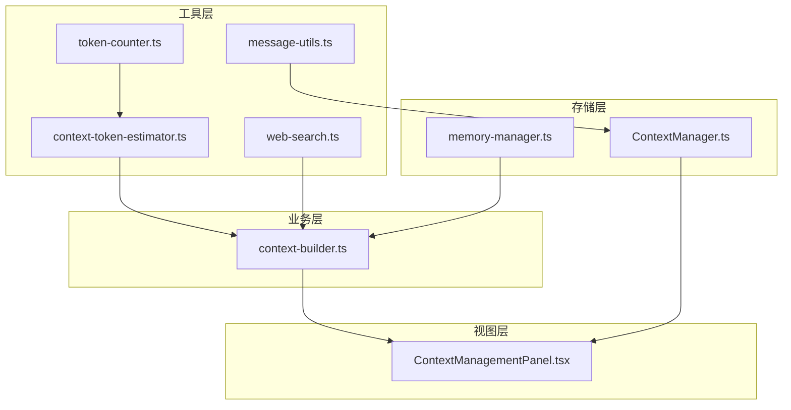
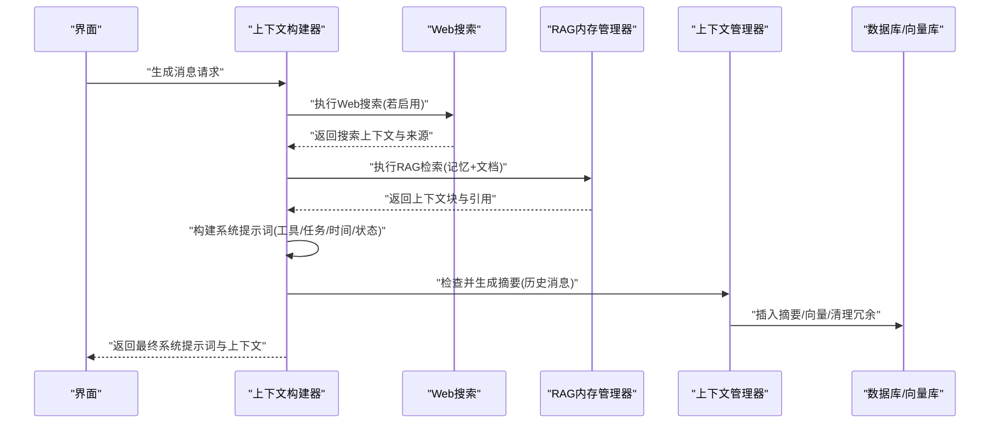
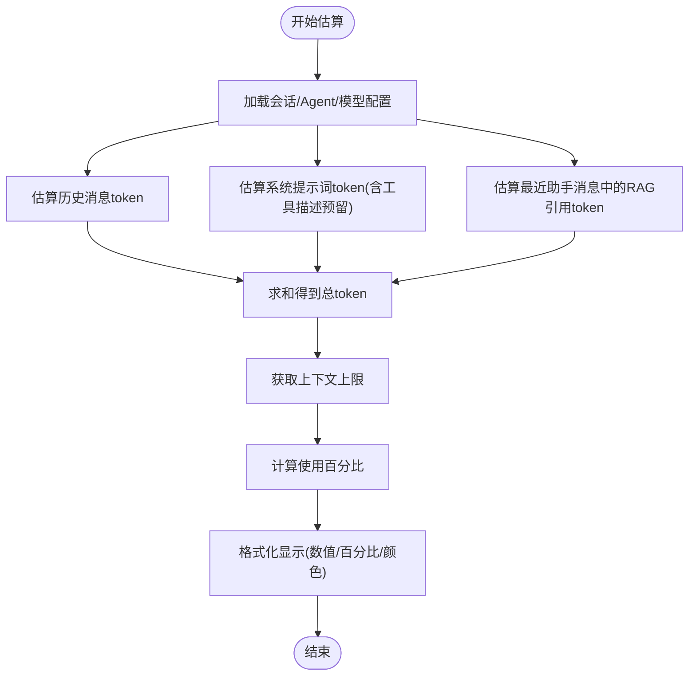
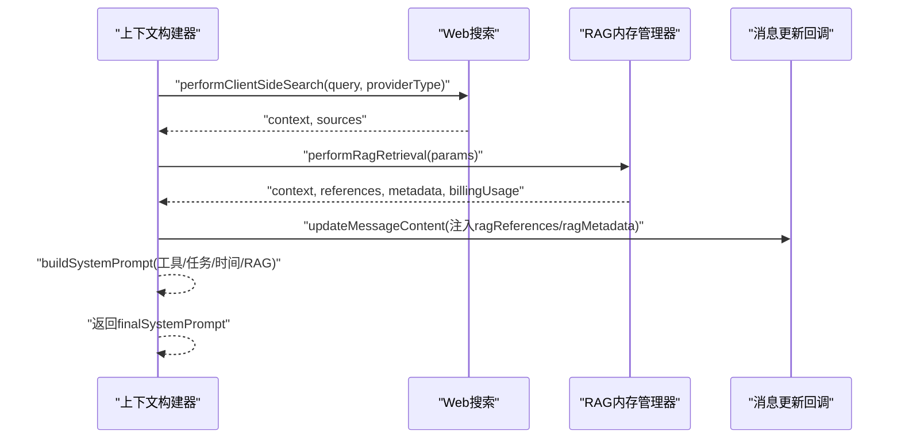
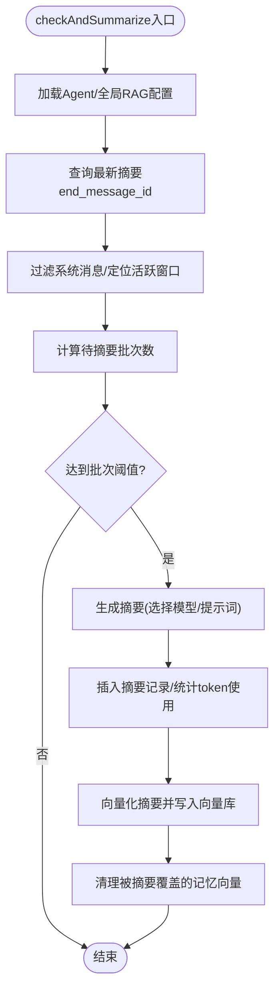
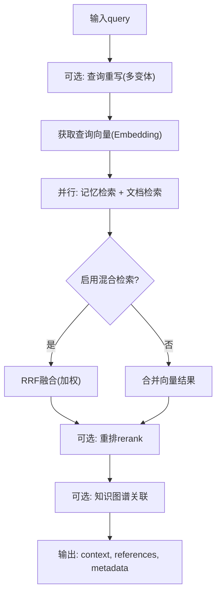
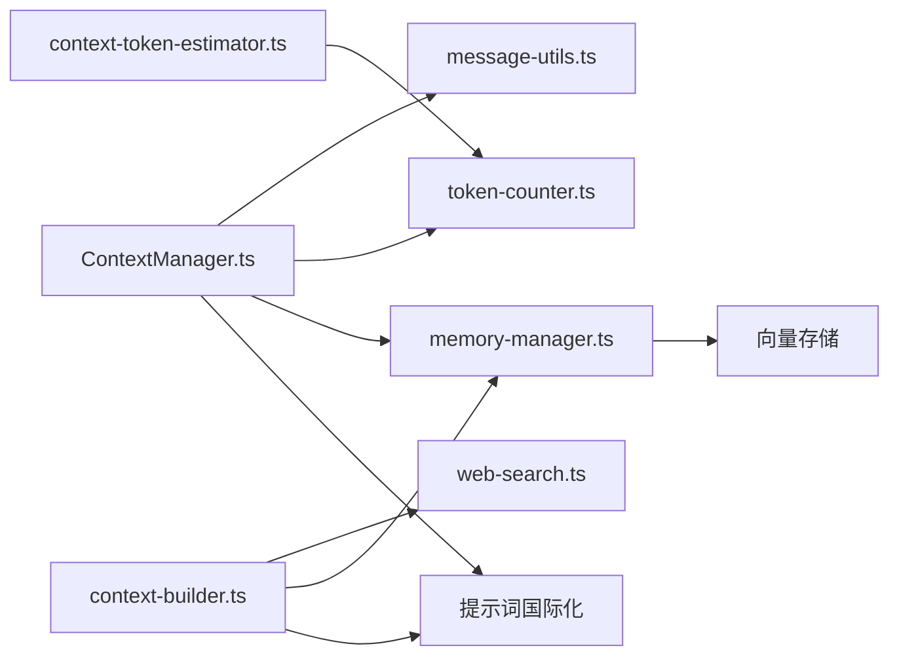

# 上下文管理

<cite>
**本文引用的文件**
- [ContextManager.ts](file://src/features/chat/utils/ContextManager.ts)
- [context-token-estimator.ts](file://src/features/chat/utils/context-token-estimator.ts)
- [token-counter.ts](file://src/features/chat/utils/token-counter.ts)
- [context-builder.ts](file://src/store/chat/context-builder.ts)
- [ContextManagementPanel.tsx](file://src/features/chat/settings/ContextManagementPanel.tsx)
- [memory-manager.ts](file://src/lib/rag/memory-manager.ts)
- [useContextTokens.ts](file://src/features/chat/hooks/useContextTokens.ts)
- [message-utils.ts](file://src/features/chat/utils/message-utils.ts)
- [web-search.ts](file://src/features/chat/utils/web-search.ts)
- [chat.ts](file://src/types/chat.ts)
</cite>

## 目录
1. [简介](#简介)
2. [项目结构](#项目结构)
3. [核心组件](#核心组件)
4. [架构总览](#架构总览)
5. [详细组件分析](#详细组件分析)
6. [依赖分析](#依赖分析)
7. [性能考量](#性能考量)
8. [故障排查指南](#故障排查指南)
9. [结论](#结论)
10. [附录](#附录)

## 简介
本文件面向开发者与高级用户，系统化阐述本项目的上下文管理系统。内容涵盖上下文构建的完整流程（消息收集、RAG上下文整合、搜索结果注入、系统提示词构建）、上下文令牌估算机制（token计数、截断策略、性能优化）、上下文窗口管理（历史消息选择、上下文长度限制、动态调整）、上下文与RAG系统的集成（知识检索、引用管理、语境增强）、上下文优化策略（冗余消除、重要性排序、压缩技术），并提供可操作的配置指南与代码路径定位，帮助快速实现高效稳定的上下文管理。

## 项目结构
上下文管理涉及前端React组件、工具函数、存储层与RAG检索模块的协同工作：
- 工具层：上下文估算、token计数、消息内容抽取、Web搜索
- 存储层：上下文摘要归档、向量检索、RAG进度与引用
- 业务层：上下文构建器（RAG检索、Web搜索、系统提示词拼装）
- 视图层：上下文管理面板（摘要查看与手动摘要）

图表来源
- [context-token-estimator.ts:1-235](file://src/features/chat/utils/context-token-estimator.ts#L1-L235)
- [token-counter.ts:1-46](file://src/features/chat/utils/token-counter.ts#L1-L46)
- [message-utils.ts:1-58](file://src/features/chat/utils/message-utils.ts#L1-L58)
- [web-search.ts:1-258](file://src/features/chat/utils/web-search.ts#L1-L258)
- [ContextManager.ts:1-482](file://src/features/chat/utils/ContextManager.ts#L1-L482)
- [memory-manager.ts:1-997](file://src/lib/rag/memory-manager.ts#L1-L997)
- [context-builder.ts:1-348](file://src/store/chat/context-builder.ts#L1-L348)
- [ContextManagementPanel.tsx:1-330](file://src/features/chat/settings/ContextManagementPanel.tsx#L1-L330)

章节来源
- [context-token-estimator.ts:1-235](file://src/features/chat/utils/context-token-estimator.ts#L1-L235)
- [token-counter.ts:1-46](file://src/features/chat/utils/token-counter.ts#L1-L46)
- [message-utils.ts:1-58](file://src/features/chat/utils/message-utils.ts#L1-L58)
- [web-search.ts:1-258](file://src/features/chat/utils/web-search.ts#L1-L258)
- [ContextManager.ts:1-482](file://src/features/chat/utils/ContextManager.ts#L1-L482)
- [memory-manager.ts:1-997](file://src/lib/rag/memory-manager.ts#L1-L997)
- [context-builder.ts:1-348](file://src/store/chat/context-builder.ts#L1-L348)
- [ContextManagementPanel.tsx:1-330](file://src/features/chat/settings/ContextManagementPanel.tsx#L1-L330)

## 核心组件
- 上下文估算与展示：提供上下文各组成部分的token估算、上下文上限获取、格式化显示与Hook封装，便于UI层实时反馈。
- 上下文构建器：负责RAG检索、Web搜索、系统提示词构建与引用注入，形成最终的系统提示词与上下文。
- 上下文管理器：负责历史消息的摘要生成、归档、向量化、清理冗余向量，以及摘要检索。
- RAG内存管理器：执行查询重写、向量检索、混合检索（RRF融合）、重排（rerank）、知识图谱关联等，产出上下文与引用。
- 消息内容抽取：从复杂消息中抽取语义核心，保留思考过程与检索片段，剔除噪声。
- Web搜索：多引擎容错搜索与网页内容抓取，生成结构化上下文。
- 上下文管理面板：展示摘要归档、手动摘要、统计信息与交互操作。

章节来源
- [context-token-estimator.ts:1-235](file://src/features/chat/utils/context-token-estimator.ts#L1-L235)
- [context-builder.ts:1-348](file://src/store/chat/context-builder.ts#L1-L348)
- [ContextManager.ts:1-482](file://src/features/chat/utils/ContextManager.ts#L1-L482)
- [memory-manager.ts:1-997](file://src/lib/rag/memory-manager.ts#L1-L997)
- [message-utils.ts:1-58](file://src/features/chat/utils/message-utils.ts#L1-L58)
- [web-search.ts:1-258](file://src/features/chat/utils/web-search.ts#L1-L258)
- [ContextManagementPanel.tsx:1-330](file://src/features/chat/settings/ContextManagementPanel.tsx#L1-L330)

## 架构总览
上下文管理的端到端流程如下：
- 输入：用户消息、会话上下文、Agent配置、RAG配置
- 处理：消息内容抽取、Web搜索、RAG检索、系统提示词构建、摘要生成与归档
- 输出：最终系统提示词、上下文块、引用列表、统计与可视化

图表来源
- [context-builder.ts:1-348](file://src/store/chat/context-builder.ts#L1-L348)
- [web-search.ts:1-258](file://src/features/chat/utils/web-search.ts#L1-L258)
- [memory-manager.ts:1-997](file://src/lib/rag/memory-manager.ts#L1-L997)
- [ContextManager.ts:1-482](file://src/features/chat/utils/ContextManager.ts#L1-L482)

## 详细组件分析

### 上下文估算与展示
- 估算维度：历史消息、系统提示词、RAG检索内容
- 上下文上限：优先取模型配置，其次从模型规格表获取，最后兜底
- 格式化显示：千/百万单位、百分比、颜色分级
- Hook封装：useContextTokens与useContextLimit，配合memo与缓存提升性能

图表来源
- [context-token-estimator.ts:1-235](file://src/features/chat/utils/context-token-estimator.ts#L1-L235)
- [token-counter.ts:1-46](file://src/features/chat/utils/token-counter.ts#L1-L46)

章节来源
- [context-token-estimator.ts:1-235](file://src/features/chat/utils/context-token-estimator.ts#L1-L235)
- [token-counter.ts:1-46](file://src/features/chat/utils/token-counter.ts#L1-L46)
- [useContextTokens.ts:1-102](file://src/features/chat/hooks/useContextTokens.ts#L1-L102)

### 上下文构建器（RAG/搜索/系统提示词）
- RAG检索：合并会话与临时配置，调用MemoryManager执行检索，更新消息引用与处理状态
- Web搜索：按提供商类型决定是否执行客户端搜索，聚合结果并格式化上下文
- 系统提示词构建：注入时间、任务状态、工具描述、模型特定增强、RAG上下文

图表来源
- [context-builder.ts:1-348](file://src/store/chat/context-builder.ts#L1-L348)
- [web-search.ts:1-258](file://src/features/chat/utils/web-search.ts#L1-L258)
- [memory-manager.ts:1-997](file://src/lib/rag/memory-manager.ts#L1-L997)

章节来源
- [context-builder.ts:1-348](file://src/store/chat/context-builder.ts#L1-L348)
- [web-search.ts:1-258](file://src/features/chat/utils/web-search.ts#L1-L258)
- [memory-manager.ts:1-997](file://src/lib/rag/memory-manager.ts#L1-L997)

### 上下文管理器（摘要/归档/向量化）
- 摘要检查：确定活跃窗口、未摘要消息数量、批次大小，满足阈值则生成摘要
- 摘要生成：选择合适模型与提示词，调用LLM生成摘要，统计token使用并上报
- 向量化：将摘要嵌入并写入向量库，支持多种embedding提供商
- 冗余清理：删除被摘要覆盖的记忆向量，降低冗余

图表来源
- [ContextManager.ts:1-482](file://src/features/chat/utils/ContextManager.ts#L1-L482)

章节来源
- [ContextManager.ts:1-482](file://src/features/chat/utils/ContextManager.ts#L1-L482)

### RAG内存管理器（检索/重排/融合）
- 查询重写：可选开启，支持多变体生成与超时保护
- 向量检索：并行执行记忆与文档检索，支持全局/会话作用域
- 混合检索：RRF融合向量与关键词结果，加权组合
- 重排：可选rerank模型，支持进度回调与网络统计
- 知识图谱：基于召回文本挖掘实体，一跳扩展并过滤权限
- 输出：上下文块、引用列表、元数据（检索耗时、召回数、分布等）

图表来源
- [memory-manager.ts:1-997](file://src/lib/rag/memory-manager.ts#L1-L997)

章节来源
- [memory-manager.ts:1-997](file://src/lib/rag/memory-manager.ts#L1-L997)

### 消息内容抽取与引用管理
- 内容抽取：保留核心回答、思考过程、检索片段；剔除工具参数、代码、图表等噪声
- 引用管理：RAG引用结构包含内容、来源、类型、相似度、文档ID等，支持UI展示与跳转

章节来源
- [message-utils.ts:1-58](file://src/features/chat/utils/message-utils.ts#L1-L58)
- [chat.ts:77-106](file://src/types/chat.ts#L77-L106)

### 上下文管理面板
- 展示：摘要归档时间线、手动摘要、统计信息（活跃消息/归档数量/总token）
- 交互：刷新、删除摘要、查看更多

章节来源
- [ContextManagementPanel.tsx:1-330](file://src/features/chat/settings/ContextManagementPanel.tsx#L1-L330)

## 依赖分析
- ContextManager依赖：消息工具、token计数、RAG向量存储、API/设置存储、提示词国际化
- ContextBuilder依赖：API/设置/rag存储、Web搜索、RAG内存管理器、模型增强、提示词国际化
- RAG内存管理器依赖：向量存储、embedding/rerank客户端、文本切分、知识图谱数据库
- 估算模块依赖：token计数、模型规格工具、聊天类型定义

图表来源
- [ContextManager.ts:1-482](file://src/features/chat/utils/ContextManager.ts#L1-L482)
- [context-builder.ts:1-348](file://src/store/chat/context-builder.ts#L1-L348)
- [context-token-estimator.ts:1-235](file://src/features/chat/utils/context-token-estimator.ts#L1-L235)
- [message-utils.ts:1-58](file://src/features/chat/utils/message-utils.ts#L1-L58)
- [web-search.ts:1-258](file://src/features/chat/utils/web-search.ts#L1-L258)
- [memory-manager.ts:1-997](file://src/lib/rag/memory-manager.ts#L1-L997)

章节来源
- [ContextManager.ts:1-482](file://src/features/chat/utils/ContextManager.ts#L1-L482)
- [context-builder.ts:1-348](file://src/store/chat/context-builder.ts#L1-L348)
- [context-token-estimator.ts:1-235](file://src/features/chat/utils/context-token-estimator.ts#L1-L235)
- [message-utils.ts:1-58](file://src/features/chat/utils/message-utils.ts#L1-L58)
- [web-search.ts:1-258](file://src/features/chat/utils/web-search.ts#L1-L258)
- [memory-manager.ts:1-997](file://src/lib/rag/memory-manager.ts#L1-L997)

## 性能考量
- 估算性能：token计数采用启发式估算，避免每次渲染重复计算；Hook层使用memo与缓存
- 检索性能：向量检索并行执行，混合检索RRF融合，重排阶段支持进度回调与网络统计
- 摘要性能：摘要生成前yield让出线程，摘要向量化与冗余清理异步进行
- UI响应：摘要检查与检索均包含yield与错误降级，保证UI流畅

章节来源
- [context-token-estimator.ts:1-235](file://src/features/chat/utils/context-token-estimator.ts#L1-L235)
- [token-counter.ts:1-46](file://src/features/chat/utils/token-counter.ts#L1-L46)
- [memory-manager.ts:1-997](file://src/lib/rag/memory-manager.ts#L1-L997)
- [ContextManager.ts:1-482](file://src/features/chat/utils/ContextManager.ts#L1-L482)

## 故障排查指南
- 摘要生成失败：检查AI提供商可用性、模型ID有效性、运行时回退逻辑
- RAG检索失败：确认embedding/rerank提供商配置、查询重写超时、向量检索超时
- Web搜索失败：检查各搜索引擎API Key/地址配置，回退到Mock结果
- 引用与元数据：确认消息更新回调正确注入ragReferences与ragMetadata
- 上下文溢出：使用上下文估算Hook监控使用比例，必要时减少活跃窗口或启用摘要

章节来源
- [ContextManager.ts:1-482](file://src/features/chat/utils/ContextManager.ts#L1-L482)
- [memory-manager.ts:1-997](file://src/lib/rag/memory-manager.ts#L1-L997)
- [web-search.ts:1-258](file://src/features/chat/utils/web-search.ts#L1-L258)
- [context-builder.ts:1-348](file://src/store/chat/context-builder.ts#L1-L348)

## 结论
本上下文管理系统通过“估算—构建—摘要—检索—融合—展示”的闭环，实现了对历史消息、系统提示词、RAG检索与Web搜索的统一管理。其核心优势在于：
- 实时估算与可视化：帮助用户预判上下文风险
- 智能摘要与向量化：降低历史消息对上下文窗口的压力
- 多引擎RAG与知识图谱：增强语境与事实准确性
- 完整的引用与元数据：支撑溯源与效果评估

建议在生产环境中结合业务场景，合理配置上下文窗口、摘要阈值与RAG策略，并持续监控token使用与检索质量。

## 附录

### 上下文令牌估算机制（要点）
- 历史消息：优先使用消息自带token，否则估算内容与reasoning
- 系统提示词：包含Agent/systemPrompt与自定义prompt，预留工具描述开销
- RAG检索：仅估算最近助手消息中的RAG引用片段
- 上下文上限：优先取模型配置，其次模型规格，最后兜底
- 格式化显示：千/百万单位、百分比、颜色分级

章节来源
- [context-token-estimator.ts:1-235](file://src/features/chat/utils/context-token-estimator.ts#L1-L235)
- [token-counter.ts:1-46](file://src/features/chat/utils/token-counter.ts#L1-L46)

### 上下文窗口管理（要点）
- 活跃窗口：保留最近N条消息作为活跃上下文
- 摘要阈值：超过Y条未摘要消息时批量生成摘要
- 截断策略：通过摘要与活跃窗口控制上下文长度
- 动态调整：根据估算使用比例与业务需求调整maxMessages/summaryThreshold

章节来源
- [ContextManager.ts:1-482](file://src/features/chat/utils/ContextManager.ts#L1-L482)
- [context-token-estimator.ts:1-235](file://src/features/chat/utils/context-token-estimator.ts#L1-L235)

### 上下文与RAG系统集成（要点）
- RAG检索：并行记忆与文档检索，支持全局/会话作用域
- 混合检索：RRF融合向量与关键词结果，提升召回稳定性
- 重排：可选rerank模型，支持进度回调
- 知识图谱：基于召回文本挖掘实体，一跳扩展并过滤权限
- 引用管理：结构化引用与元数据，支持UI展示与跳转

章节来源
- [memory-manager.ts:1-997](file://src/lib/rag/memory-manager.ts#L1-L997)
- [context-builder.ts:1-348](file://src/store/chat/context-builder.ts#L1-L348)

### 上下文优化策略（要点）
- 冗余消除：摘要生成后清理被覆盖的记忆向量
- 重要性排序：RAG重排与RRF融合提升相关性
- 压缩技术：摘要生成、活跃窗口截断、reasoning与工具描述的合理裁剪
- 性能优化：并行检索、估算缓存、yield让出线程

章节来源
- [ContextManager.ts:1-482](file://src/features/chat/utils/ContextManager.ts#L1-L482)
- [memory-manager.ts:1-997](file://src/lib/rag/memory-manager.ts#L1-L997)
- [context-token-estimator.ts:1-235](file://src/features/chat/utils/context-token-estimator.ts#L1-L235)

### 配置指南（关键参数）
- 上下文窗口：maxMessages（活跃窗口大小）、summaryThreshold（摘要批次阈值）
- RAG配置：enableMemory、enableDocs、activeDocIds、activeFolderIds、isGlobal、queryRewrite、rerank、hybrid、thresholds等
- 摘要模型：summaryModel（回退逻辑与运行时容错）
- 搜索配置：provider、engineOrder、maxResults、各引擎API Key/地址
- 模型上下文上限：模型配置contextLength优先，否则从规格表获取

章节来源
- [ContextManager.ts:1-482](file://src/features/chat/utils/ContextManager.ts#L1-L482)
- [memory-manager.ts:1-997](file://src/lib/rag/memory-manager.ts#L1-L997)
- [context-builder.ts:1-348](file://src/store/chat/context-builder.ts#L1-L348)
- [web-search.ts:1-258](file://src/features/chat/utils/web-search.ts#L1-L258)
- [chat.ts:1-200](file://src/types/chat.ts#L1-L200)