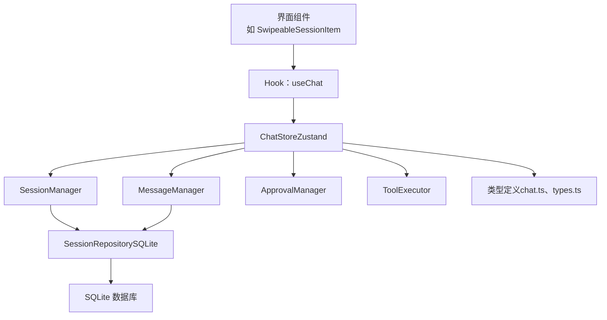
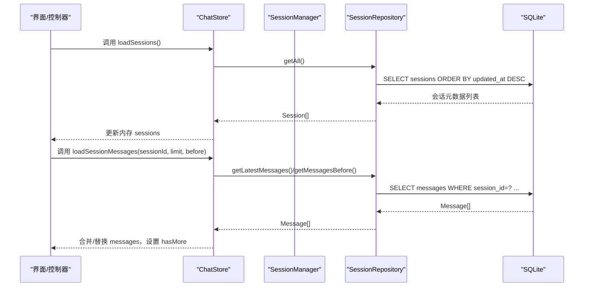
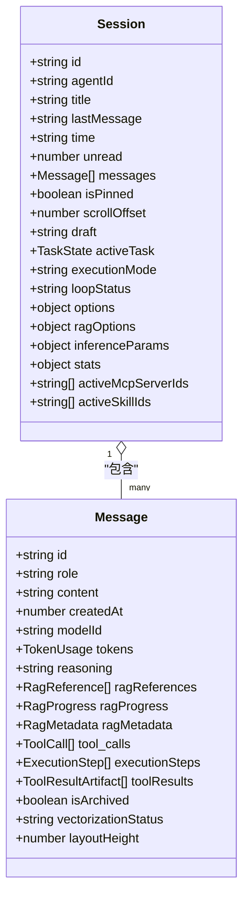
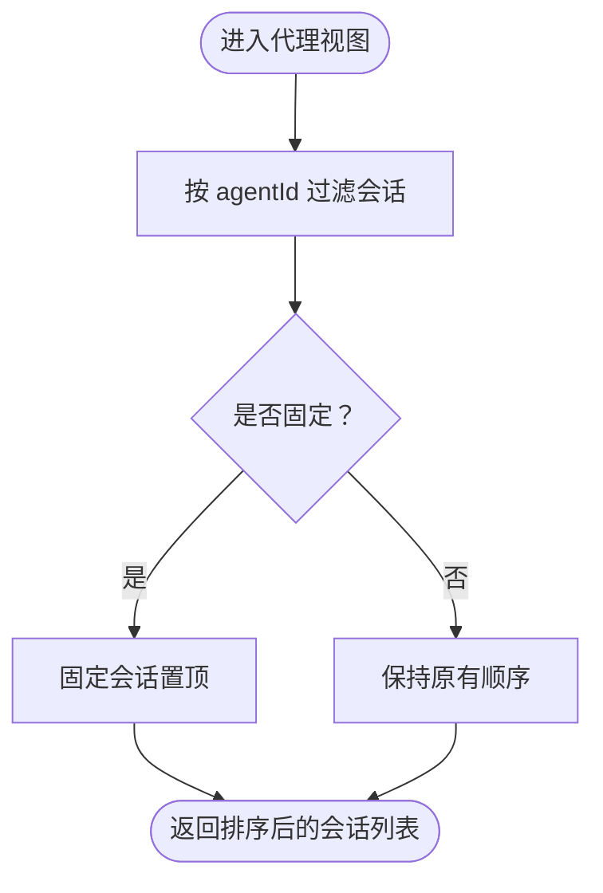
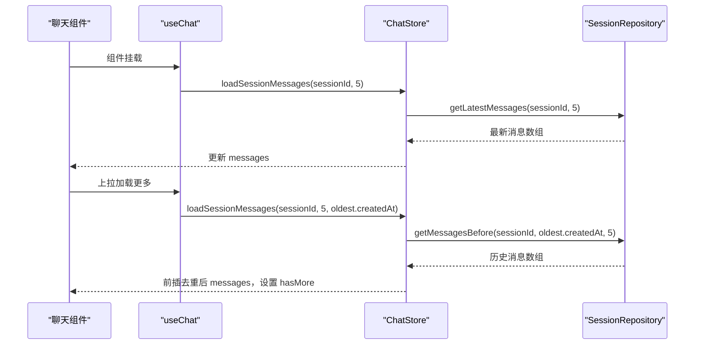
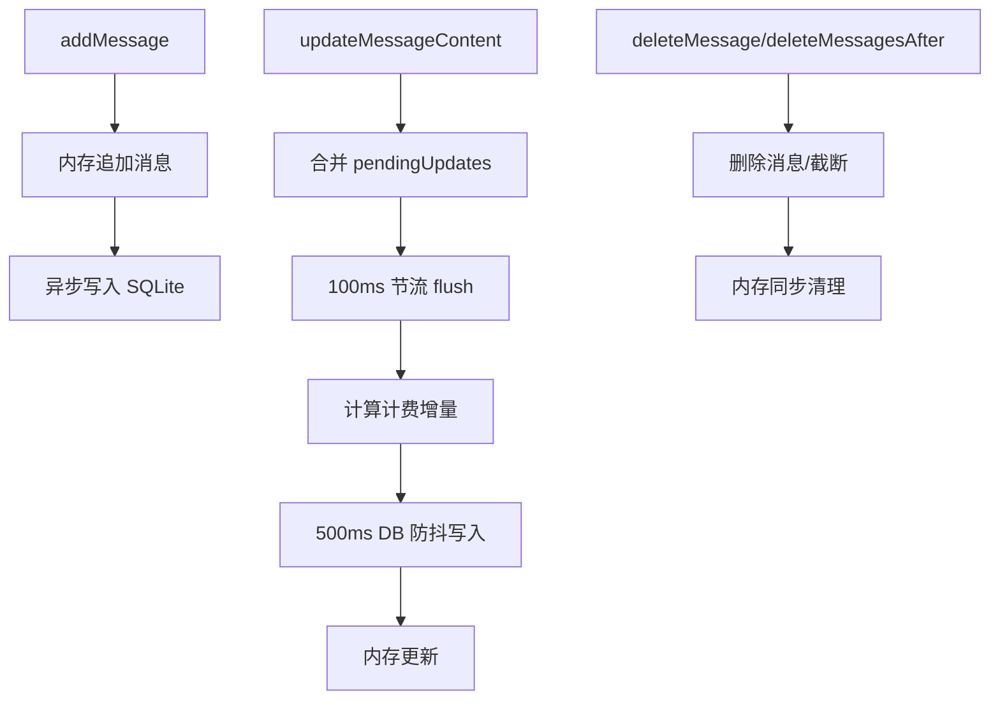
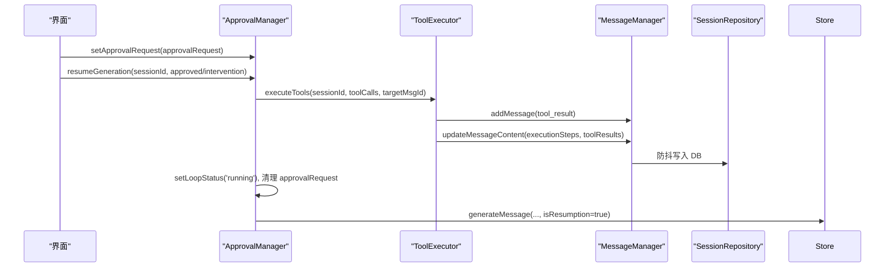
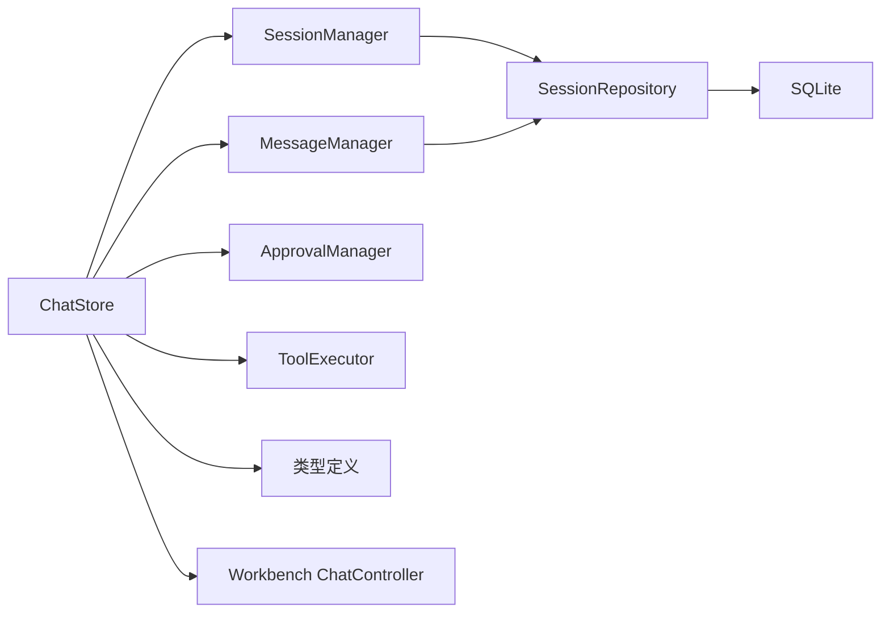

# 会话管理

<cite>
**本文引用的文件**
- [src/store/chat/session-manager.ts](file://src/store/chat/session-manager.ts)
- [src/store/chat-store.ts](file://src/store/chat-store.ts)
- [src/store/chat/message-manager.ts](file://src/store/chat/message-manager.ts)
- [src/lib/db/session-repository.ts](file://src/lib/db/session-repository.ts)
- [src/lib/db/index.ts](file://src/lib/db/index.ts)
- [src/types/chat.ts](file://src/types/chat.ts)
- [src/store/chat/types.ts](file://src/store/chat/types.ts)
- [src/store/chat/approval-manager.ts](file://src/store/chat/approval-manager.ts)
- [src/store/chat/tool-execution.ts](file://src/store/chat/tool-execution.ts)
- [src/features/chat/hooks/useChat.ts](file://src/features/chat/hooks/useChat.ts)
- [src/services/workbench/controllers/ChatController.ts](file://src/services/workbench/controllers/ChatController.ts)
- [src/features/chat/components/SwipeableSessionItem.tsx](file://src/features/chat/components/SwipeableSessionItem.tsx)
</cite>

## 目录
1. [引言](#引言)
2. [项目结构](#项目结构)
3. [核心组件](#核心组件)
4. [架构总览](#架构总览)
5. [详细组件分析](#详细组件分析)
6. [依赖关系分析](#依赖关系分析)
7. [性能考量](#性能考量)
8. [故障排查指南](#故障排查指南)
9. [结论](#结论)
10. [附录](#附录)

## 引言
本文件面向开发者与架构师，系统化阐述会话管理系统的设计与实现，涵盖会话生命周期（创建、加载、更新、删除、持久化）、状态管理（元数据、消息集合、配置与滚动位置）、与代理的关系、排序与固定机制、分页加载策略，以及 SQLite 存储架构、异步持久化与性能优化。文档提供代码级图示与最佳实践，帮助快速理解并正确扩展会话管理能力。

## 项目结构
会话管理位于应用状态层与数据访问层之间，采用 Zustand 状态管理与 SQLite 双写持久化的架构设计。核心模块包括：
- 状态层：chat-store 作为根状态容器，聚合会话、消息、审批、工具执行等管理器
- 管理器层：会话管理器、消息管理器、审批管理器、工具执行器
- 数据访问层：SessionRepository 提供会话与消息的 CRUD 操作
- 数据库层：@op-engineering/op-sqlite 提供底层连接与 WAL 模式

图表来源
- [src/store/chat-store.ts:212-360](file://src/store/chat-store.ts#L212-L360)
- [src/store/chat/session-manager.ts:15-281](file://src/store/chat/session-manager.ts#L15-L281)
- [src/store/chat/message-manager.ts:18-442](file://src/store/chat/message-manager.ts#L18-L442)
- [src/lib/db/session-repository.ts:405-425](file://src/lib/db/session-repository.ts#L405-L425)
- [src/lib/db/index.ts:1-13](file://src/lib/db/index.ts#L1-L13)

章节来源
- [src/store/chat-store.ts:108-211](file://src/store/chat-store.ts#L108-L211)
- [src/store/chat/types.ts:23-163](file://src/store/chat/types.ts#L23-L163)

## 核心组件
- 会话管理器（SessionManager）：负责会话的创建、更新、删除、草稿、固定、推理参数、模型切换、选项合并、滚动位置、代理维度筛选、MCP/技能开关等
- 消息管理器（MessageManager）：负责消息的添加、内容与多维属性更新、删除、截断、向量化、RAG 进度、布局高度、批量向量化状态、防抖写入 SQLite
- 审批管理器（ApprovalManager）：负责 Semi/Auto/Manual 模式的审批请求、续杯预算、干预注入、循环状态推进与工具执行
- 工具执行器（ToolExecutor）：负责工具调用、步骤可视化、MCP 速率限制、错误反射、产物注入与自动提取
- 数据访问层（SessionRepository）：提供会话与消息的 CRUD、分页查询、Schema 自修复、JSON 字段序列化
- 状态层（ChatStore）：聚合管理器、暴露动作与查询、启动时从 SQLite 加载会话元数据、按需加载消息

章节来源
- [src/store/chat/session-manager.ts:15-281](file://src/store/chat/session-manager.ts#L15-L281)
- [src/store/chat/message-manager.ts:18-442](file://src/store/chat/message-manager.ts#L18-L442)
- [src/store/chat/approval-manager.ts:9-173](file://src/store/chat/approval-manager.ts#L9-L173)
- [src/store/chat/tool-execution.ts:20-379](file://src/store/chat/tool-execution.ts#L20-L379)
- [src/lib/db/session-repository.ts:14-425](file://src/lib/db/session-repository.ts#L14-L425)
- [src/store/chat-store.ts:212-360](file://src/store/chat-store.ts#L212-L360)

## 架构总览
会话管理采用“内存优先、异步持久化”的双写策略：UI 与业务逻辑优先更新 Zustand 内存状态，随后异步写入 SQLite，保证交互流畅与数据安全。启动时仅加载会话元数据，消息按需分页加载，降低冷启动开销。

图表来源
- [src/store/chat-store.ts:227-287](file://src/store/chat-store.ts#L227-L287)
- [src/lib/db/session-repository.ts:65-315](file://src/lib/db/session-repository.ts#L65-L315)

章节来源
- [src/store/chat-store.ts:227-287](file://src/store/chat-store.ts#L227-L287)
- [src/lib/db/session-repository.ts:65-315](file://src/lib/db/session-repository.ts#L65-L315)

## 详细组件分析

### 会话生命周期与状态管理
- 生命周期
  - 创建：会话管理器在写入 SQLite 成功后，立即更新 Zustand；若写入失败，仅内存可用，保证可用性
  - 加载：启动时仅加载会话元数据；进入会话页面时按需加载消息（最新或历史游标分页）
  - 更新：支持标题、提示词、模型、推理参数、选项、滚动位置、草稿、MCP/技能开关等
  - 删除：先清理知识图谱残留，再删除会话（消息由外键级联删除），最后更新内存
- 状态结构
  - 元数据：id、agentId、title、lastMessage、time、unread、isPinned、stats、options、ragOptions、inferenceParams、draft、scrollOffset、activeTask、executionMode、loopStatus、approvalRequest、activeMcpServerIds、activeSkillIds
  - 消息集合：Message 数组，支持 tokens、reasoning、citations、ragReferences、ragProgress、ragMetadata、tool_calls、executionSteps、toolResults、isArchived、vectorizationStatus、layoutHeight 等
  - 配置选项：webSearch、reasoning、thinkingLevel、toolsEnabled、strictMode、enableTimeInjection、RAG 开关与范围、KG 开关
  - 滚动位置：scrollOffset 仅内存更新，避免高频写库

图表来源
- [src/types/chat.ts:169-223](file://src/types/chat.ts#L169-L223)
- [src/types/chat.ts:135-167](file://src/types/chat.ts#L135-L167)

章节来源
- [src/store/chat/session-manager.ts:19-94](file://src/store/chat/session-manager.ts#L19-L94)
- [src/store/chat-store.ts:227-287](file://src/store/chat-store.ts#L227-L287)
- [src/types/chat.ts:169-223](file://src/types/chat.ts#L169-L223)

### 会话与代理的关系、排序与固定
- 代理维度：按 agentId 过滤会话，排序时固定 pinned 会话在前
- 固定机制：toggleSessionPin 切换 isPinned，内存与 DB 同步更新
- 代理交互：创建会话时继承 MCP 默认服务器集合，根据模型能力自动设置 toolsEnabled

图表来源
- [src/store/chat/session-manager.ts:223-229](file://src/store/chat/session-manager.ts#L223-L229)

章节来源
- [src/store/chat/session-manager.ts:223-229](file://src/store/chat/session-manager.ts#L223-L229)
- [src/store/chat/session-manager.ts:20-40](file://src/store/chat/session-manager.ts#L20-L40)

### 分页加载策略
- 初始加载：getLatestMessages 返回最新 N 条消息，按时间升序排列以便渲染
- 历史加载：getMessagesBefore 以时间游标分页，返回旧消息片段并反转为升序
- UI 协作：useChat 在挂载时按需触发 loadSessionMessages，支持上拉加载更多

图表来源
- [src/features/chat/hooks/useChat.ts:17-98](file://src/features/chat/hooks/useChat.ts#L17-L98)
- [src/store/chat-store.ts:241-287](file://src/store/chat-store.ts#L241-L287)
- [src/lib/db/session-repository.ts:288-315](file://src/lib/db/session-repository.ts#L288-L315)

章节来源
- [src/features/chat/hooks/useChat.ts:17-98](file://src/features/chat/hooks/useChat.ts#L17-L98)
- [src/store/chat-store.ts:241-287](file://src/store/chat-store.ts#L241-L287)
- [src/lib/db/session-repository.ts:288-315](file://src/lib/db/session-repository.ts#L288-L315)

### 消息管理与异步持久化
- 添加消息：乐观更新内存，后台异步写入 SQLite
- 更新消息：采用 100ms 节流 + 500ms DB 防抖，合并 pendingUpdates，计算计费增量，同时更新内存与 DB
- 删除消息：删除后更新会话 updated_at，必要时中止生成
- 向量化与归档：批量设置 vectorizationStatus，成功后标记 isArchived

图表来源
- [src/store/chat/message-manager.ts:204-442](file://src/store/chat/message-manager.ts#L204-L442)
- [src/lib/db/session-repository.ts:162-260](file://src/lib/db/session-repository.ts#L162-L260)

章节来源
- [src/store/chat/message-manager.ts:204-442](file://src/store/chat/message-manager.ts#L204-L442)
- [src/lib/db/session-repository.ts:162-260](file://src/lib/db/session-repository.ts#L162-L260)

### 审批与工具执行
- 审批管理：维护 approvalRequest、loopStatus、executionMode、pendingIntervention；续杯批准后增加 continuationBudget 并恢复生成
- 工具执行：统一步骤可视化，MCP 速率限制，错误反射，产物注入与自动提取，任务状态持久化

图表来源
- [src/store/chat/approval-manager.ts:21-146](file://src/store/chat/approval-manager.ts#L21-L146)
- [src/store/chat/tool-execution.ts:24-379](file://src/store/chat/tool-execution.ts#L24-L379)
- [src/store/chat/message-manager.ts:337-442](file://src/store/chat/message-manager.ts#L337-L442)

章节来源
- [src/store/chat/approval-manager.ts:21-146](file://src/store/chat/approval-manager.ts#L21-L146)
- [src/store/chat/tool-execution.ts:24-379](file://src/store/chat/tool-execution.ts#L24-L379)
- [src/store/chat/message-manager.ts:337-442](file://src/store/chat/message-manager.ts#L337-L442)

### 会话与外部集成
- Web 控制器：Workbench ChatController 提供会话列表、历史、创建、删除、发送消息、中断生成、删除消息、重生成等接口，内部委托 ChatStore 实现
- UI 组件：SwipeableSessionItem 展示会话列表项，支持固定/删除手势与草稿显示

章节来源
- [src/services/workbench/controllers/ChatController.ts:5-130](file://src/services/workbench/controllers/ChatController.ts#L5-L130)
- [src/features/chat/components/SwipeableSessionItem.tsx:23-181](file://src/features/chat/components/SwipeableSessionItem.tsx#L23-L181)

## 依赖关系分析
- 状态耦合：ChatStore 通过 create*Manager 工厂创建各管理器实例，共享 get/set 上下文
- 管理器内聚：各管理器职责单一，SessionManager/MessageManager/ApprovalManager/ToolExecutor 互不直接依赖
- 数据访问：SessionRepository 统一封装 SQLite 操作，支持 JSON 字段与自修复
- 外部依赖：@op-engineering/op-sqlite、expo-file-system、zustand/persist

图表来源
- [src/store/chat-store.ts:212-360](file://src/store/chat-store.ts#L212-L360)
- [src/store/chat/types.ts:23-163](file://src/store/chat/types.ts#L23-L163)
- [src/lib/db/session-repository.ts:405-425](file://src/lib/db/session-repository.ts#L405-L425)

章节来源
- [src/store/chat-store.ts:212-360](file://src/store/chat-store.ts#L212-L360)
- [src/store/chat/types.ts:23-163](file://src/store/chat/types.ts#L23-L163)
- [src/lib/db/session-repository.ts:405-425](file://src/lib/db/session-repository.ts#L405-L425)

## 性能考量
- 冷启动优化：启动仅加载会话元数据，消息按需分页加载，减少首屏压力
- 写入策略：消息更新采用节流与 DB 防抖，避免高频写库；滚动位置仅内存更新
- 数据库模式：WAL 模式提升并发与可靠性；外键约束与级联删除简化数据一致性
- UI 流畅：乐观更新内存，异步写入 DB，保证交互响应

章节来源
- [src/store/chat-store.ts:227-287](file://src/store/chat-store.ts#L227-L287)
- [src/store/chat/message-manager.ts:15-75](file://src/store/chat/message-manager.ts#L15-L75)
- [src/lib/db/index.ts:7-12](file://src/lib/db/index.ts#L7-L12)

## 故障排查指南
- 写入失败
  - 会话/消息写入 SQLite 失败时，控制台警告并继续内存可用；建议检查 DB 初始化与权限
- Schema 漂移
  - SessionRepository.update 自修复缺失列，若修复失败请检查数据库结构
- 生成中断
  - 删除/截断正在生成的消息会触发中断；确认 UI 状态与 activeRequests
- MCP 限速
  - 工具执行器对 MCP 服务器进行限速与挂起，检查服务器配置与 lastCallTimestamp

章节来源
- [src/store/chat/session-manager.ts:43-47](file://src/store/chat/session-manager.ts#L43-L47)
- [src/store/chat/message-manager.ts:281-301](file://src/store/chat/message-manager.ts#L281-L301)
- [src/lib/db/session-repository.ts:110-147](file://src/lib/db/session-repository.ts#L110-L147)
- [src/store/chat/tool-execution.ts:199-240](file://src/store/chat/tool-execution.ts#L199-L240)

## 结论
会话管理系统通过“内存优先、异步持久化”的双写策略，在保证用户体验的同时确保数据安全。分页加载与元数据优先策略显著降低启动成本；消息更新的节流与防抖机制平衡了实时性与性能。管理器职责清晰、数据访问层稳定可靠，为后续扩展（如知识图谱抽取、工具体验增强）提供了坚实基础。

## 附录
- 最佳实践
  - 会话创建：先填充默认 MCP 与工具开关，再写入 DB，失败仅内存可用
  - 消息更新：尽量合并多次更新，利用 pendingUpdates 与防抖，避免频繁写库
  - 分页加载：使用 getMessagesBefore 与游标，确保 UI 顺序一致
  - 审批与续杯：明确 approvalRequest 类型，续杯预算按 autoLoopLimit 动态调整
  - MCP 速率：为外部服务配置合理的 callInterval，避免触发限流